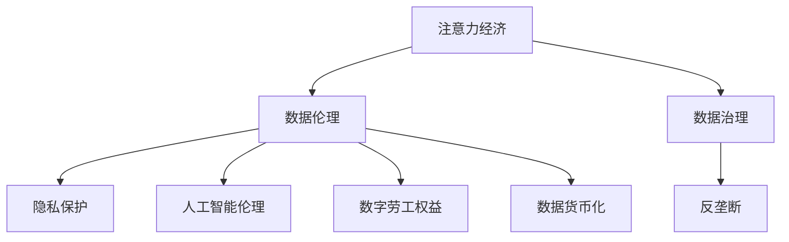

                 

# 注意力经济中的数据伦理与治理

> 关键词：注意力经济, 数据伦理, 数据治理, 隐私保护, 反垄断, 人工智能, 数字劳工, 数字货币, 元宇宙

## 1. 背景介绍

### 1.1 问题由来
在当今数字时代，注意力作为一种稀缺资源，成为各方争夺的焦点。无论是社交媒体、电商网站、新闻平台，还是金融市场，无一不在通过各种手段吸引和利用用户的注意力，以期实现商业价值的最大化。这种争夺注意力的现象，被称为"注意力经济"。

注意力经济的核心在于数据。各类数字平台通过收集和分析用户行为数据，来预测用户兴趣，推送个性化内容，从而增加用户停留时间和广告曝光量，最终实现商业目的。但这种依赖数据驱动的经济模式，也带来了诸多伦理和治理问题。

### 1.2 问题核心关键点
注意力经济中的数据伦理与治理，核心在于如何在数据驱动的商业模式和用户隐私保护、数据公平利用、反垄断等伦理要求之间找到平衡。具体而言：

- **用户隐私保护**：如何保护用户的个人信息不被滥用，避免数据泄露和侵权行为。
- **数据公平利用**：如何确保数据的使用是公平的，不因个体差异而产生歧视或偏见。
- **反垄断监管**：如何防止数据垄断行为，维护市场公平竞争，避免“赢者通吃”的现象。
- **人工智能伦理**：如何确保人工智能技术的伦理应用，避免算法偏见，保护用户的权利和自由。
- **数字劳工权益**：如何在注意力经济中保护数据劳动者的权益，避免过度剥削和劳动剥削。
- **数据货币化**：如何合理利用数据资源，保障数据流转过程中的利益分配。

这些问题的交织，使得注意力经济中的数据伦理与治理成为一个复杂且亟需解决的问题。

## 2. 核心概念与联系

### 2.1 核心概念概述

为了更好地理解注意力经济中的数据伦理与治理，本节将介绍几个密切相关的核心概念：

- **注意力经济**：指在数字时代，通过吸引和利用用户注意力进行商业活动的现象。注意力经济的核心在于数据，通过数据驱动用户行为预测和内容推荐，实现商业价值的最大化。

- **数据伦理**：指在数据处理和应用过程中，遵循的道德原则和规范。数据伦理关注用户隐私保护、数据公平利用、算法透明性和问责制等。

- **数据治理**：指对数据资产进行管理和控制的系统工程，包括数据采集、存储、使用、共享和销毁等环节的规范化和制度化。

- **隐私保护**：指在数据处理和传输过程中，采取各种技术和管理措施，确保个人隐私信息不被泄露或滥用。

- **反垄断**：指通过法律、法规和政策，限制或打破市场垄断，维护市场公平竞争，保护消费者权益。

- **人工智能伦理**：指在人工智能技术开发和应用过程中，遵循的伦理原则和规范，如算法透明性、可解释性、隐私保护、无歧视等。

- **数字劳工**：指在数字经济中，通过数据劳动获取收入的个体，如内容创作者、数据标注员等。数字劳工权益保护是数据伦理的一个重要方面。

- **数据货币化**：指将数据转化为经济价值的过程，如数据交易、数据定价、数据共享等。数据货币化涉及到利益分配、数据所有权等伦理问题。

这些核心概念之间的逻辑关系可以通过以下Mermaid流程图来展示：



这个流程图展示了一系列与注意力经济相关的核心概念及其之间的关系：

1. 注意力经济通过数据驱动实现商业价值最大化。
2. 数据伦理关注数据处理和应用过程中的伦理问题。
3. 数据治理是系统化管理数据资产的工程。
4. 隐私保护是数据伦理的核心内容之一。
5. 反垄断通过法律和政策维护市场公平竞争。
6. 人工智能伦理关注AI技术的伦理应用。
7. 数字劳工权益保护是数据伦理的重要组成部分。
8. 数据货币化涉及到数据资产的经济价值实现。

这些概念共同构成了注意力经济中的数据伦理与治理框架，为解决相关问题提供了理论基础。

## 3. 核心算法原理 & 具体操作步骤
### 3.1 算法原理概述

注意力经济中的数据伦理与治理，涉及多方面技术和政策的综合运用。以下是对其中核心算法原理的概述：

**3.1.1 数据隐私保护算法**

在注意力经济中，数据隐私保护是核心议题之一。隐私保护算法主要分为以下几种：

- **差分隐私**：通过添加随机噪声，使得个体数据的泄露概率极低，但又能保证数据集的整体统计特征。差分隐私算法常用于数据发布和查询。

- **联邦学习**：分布式训练的框架，各参与方在本地训练模型，不共享原始数据，通过参数更新来实现模型共享。联邦学习常用于隐私保护和高效数据利用。

- **多方安全计算**：利用加密技术，多方协作计算，确保数据不泄露，但又能实现共同计算。多方安全计算常用于敏感数据的联合分析。

**3.1.2 数据公平利用算法**

数据公平利用算法旨在确保数据使用的公平性，避免因个体差异而产生的歧视。主要算法包括：

- **算法偏见检测与修正**：通过统计分析和机器学习技术，检测数据集和模型中的偏见，并采取措施进行修正。

- **数据增强与平衡**：在训练模型时，通过数据增强和重采样技术，确保各类数据样本的平衡。

- **对抗样本生成**：通过生成对抗样本，检测和修复模型中的偏见和歧视，确保模型对不同群体的公平性。

**3.1.3 数据反垄断算法**

数据反垄断算法主要关注市场的公平竞争，防止数据垄断行为。主要包括：

- **市场准入与退出机制**：通过制定市场准入与退出机制，限制单一企业对数据资产的垄断，促进市场公平竞争。

- **数据共享与交换机制**：通过制定数据共享与交换规则，促进数据在不同市场主体之间的流通，防止数据孤岛。

- **公平竞争审查**：通过法律和政策，对企业的数据使用行为进行审查，防止数据滥用和垄断。

**3.1.4 人工智能伦理算法**

人工智能伦理算法旨在确保AI技术的伦理应用。主要算法包括：

- **算法透明性**：通过解释性模型、可解释性技术等手段，使得AI模型的决策过程透明可理解。

- **算法问责制**：通过建立责任追究机制，确保AI模型的行为可追溯和问责。

- **算法公平性**：通过公平性检测和修复算法，确保AI模型不因个体差异产生歧视。

**3.1.5 数字劳工权益保护算法**

数字劳工权益保护算法旨在保护数据劳动者的权益，避免过度剥削和劳动剥削。主要算法包括：

- **劳动权益保障机制**：通过法律和政策，保障数字劳动者的劳动权益，如工资、工作时长、工作条件等。

- **劳动保护协议**：通过与数据平台签订劳动保护协议，确保数据劳动者的权益得到保障。

- **劳动市场监管**：通过监管机构，对数据平台和数据劳动者的劳动市场进行规范和监督。

**3.1.6 数据货币化算法**

数据货币化算法旨在合理利用数据资源，保障数据流转过程中的利益分配。主要算法包括：

- **数据定价模型**：通过市场机制，制定数据定价模型，确保数据流转过程中的公平定价。

- **数据共享协议**：通过协议制定，确保数据共享过程中的利益分配和数据保护。

- **数据交易平台**：通过建立数据交易平台，促进数据资源的合理流动和价值实现。

### 3.2 算法步骤详解

以下详细介绍基于注意力经济的数据伦理与治理的主要算法步骤：

**3.2.1 数据隐私保护算法步骤**

1. **数据收集**：通过合法渠道收集用户数据，确保数据收集过程符合隐私保护要求。
2. **数据匿名化**：对数据进行匿名化处理，防止用户身份泄露。
3. **差分隐私计算**：在数据发布和查询过程中，使用差分隐私技术，确保个体数据泄露概率极低。
4. **联邦学习和多方安全计算**：在数据处理和分析过程中，使用联邦学习和多方安全计算技术，确保数据不泄露。

**3.2.2 数据公平利用算法步骤**

1. **数据预处理**：对数据进行清洗和预处理，确保数据质量。
2. **偏见检测**：通过统计分析和机器学习技术，检测数据集和模型中的偏见。
3. **偏见修正**：根据偏见检测结果，采取相应的修正措施，如重采样、数据增强等。
4. **公平性检测**：通过公平性检测算法，确保数据利用过程中的公平性。
5. **对抗样本生成**：生成对抗样本，检测和修复模型中的偏见和歧视。

**3.2.3 数据反垄断算法步骤**

1. **市场准入与退出机制**：制定和实施市场准入与退出机制，限制数据垄断行为。
2. **数据共享与交换机制**：制定和实施数据共享与交换机制，促进数据流通，防止数据孤岛。
3. **公平竞争审查**：通过法律和政策，对企业的数据使用行为进行审查，防止数据滥用和垄断。

**3.2.4 人工智能伦理算法步骤**

1. **算法透明性**：选择透明性高的模型，并使用可解释性技术，使得AI模型的决策过程透明可理解。
2. **算法问责制**：建立责任追究机制，确保AI模型的行为可追溯和问责。
3. **算法公平性**：通过公平性检测和修复算法，确保AI模型不因个体差异产生歧视。

**3.2.5 数字劳工权益保护算法步骤**

1. **劳动权益保障机制**：制定和实施劳动权益保障机制，确保数字劳动者的劳动权益。
2. **劳动保护协议**：与数据平台签订劳动保护协议，确保数字劳动者的权益得到保障。
3. **劳动市场监管**：通过监管机构，对数据平台和数字劳动者的劳动市场进行规范和监督。

**3.2.6 数据货币化算法步骤**

1. **数据定价模型**：制定和实施数据定价模型，确保数据流转过程中的公平定价。
2. **数据共享协议**：制定和实施数据共享协议，确保数据共享过程中的利益分配和数据保护。
3. **数据交易平台**：建立和维护数据交易平台，促进数据资源的合理流动和价值实现。

### 3.3 算法优缺点

注意力经济中的数据伦理与治理算法具有以下优点：

1. **提高数据安全性**：通过差分隐私、联邦学习和多方安全计算等技术，确保数据在处理和传输过程中的安全性，避免数据泄露和滥用。
2. **确保数据公平利用**：通过偏见检测和修正、对抗样本生成等技术，确保数据利用的公平性，避免因个体差异产生的歧视和偏见。
3. **促进市场公平竞争**：通过市场准入与退出机制、数据共享与交换机制等，防止数据垄断行为，维护市场公平竞争。
4. **保障AI伦理应用**：通过算法透明性、问责制和公平性等技术，确保AI技术的伦理应用，避免算法偏见和歧视。
5. **保护数字劳工权益**：通过劳动权益保障机制、劳动保护协议等措施，保护数字劳动者的权益，避免过度剥削和劳动剥削。
6. **合理利用数据资源**：通过数据定价模型、数据共享协议等措施，合理利用数据资源，保障数据流转过程中的利益分配。

这些算法具有较好的效果，但也存在一些局限性：

1. **技术复杂度高**：差分隐私、联邦学习等技术较为复杂，实施难度较大，需要较高技术水平。
2. **数据处理成本高**：数据匿名化、数据增强等技术需要大量计算资源和时间，实施成本较高。
3. **算法透明度不足**：部分算法如对抗样本生成、数据共享协议等，缺乏透明的解释机制，难以让人理解和信任。
4. **市场机制不够健全**：数据定价模型、数据交易平台等市场机制尚未完全建立，需要进一步探索和完善。
5. **法规和政策不完善**：数据隐私保护、反垄断监管等法律法规和政策不够完善，需要进一步制定和实施。

尽管存在这些局限性，但通过综合运用多种技术和政策，可以最大限度地保障注意力经济中的数据伦理与治理，实现商业价值和伦理道德的平衡。

### 3.4 算法应用领域

注意力经济中的数据伦理与治理算法，已在多个领域得到了广泛应用：

1. **社交媒体平台**：如Facebook、Twitter等社交媒体平台，通过用户数据收集和分析，实现内容推荐和广告投放，同时采取隐私保护措施，保障用户隐私。

2. **电商网站**：如Amazon、京东等电商网站，通过用户行为数据收集和分析，实现个性化推荐和精准营销，同时确保数据公平利用和隐私保护。

3. **新闻平台**：如Google News、BBC News等新闻平台，通过用户兴趣数据收集和分析，实现个性化新闻推荐和广告投放，同时确保数据伦理和隐私保护。

4. **金融市场**：如TradingView、Bloomberg等金融市场平台，通过交易数据收集和分析，实现市场预测和投资建议，同时确保数据反垄断和伦理应用。

5. **健康医疗**：如Covid-19疫情期间，政府和医疗机构通过用户健康数据收集和分析，实现疫情监测和防控，同时确保数据公平利用和隐私保护。

这些应用场景展示了注意力经济中数据伦理与治理算法的多样性和广泛性。

## 4. 数学模型和公式 & 详细讲解 & 举例说明

### 4.1 数学模型构建

在注意力经济中的数据伦理与治理中，涉及多方面的数学模型和算法。以下是对其中几个关键数学模型的构建和解释：

**4.1.1 差分隐私数学模型**

差分隐私的核心是添加随机噪声，使得个体数据的泄露概率极低，但又能保证数据集的整体统计特征。差分隐私的数学模型如下：

$$
\mathcal{L}(\epsilon) = \sum_{x \in \mathcal{X}} p(x|\epsilon) \log \frac{p(x|\epsilon)}{p(x|D)}
$$

其中，$D$为数据集，$\epsilon$为隐私预算，$p(x|\epsilon)$为加入隐私噪声后的概率分布，$p(x|D)$为原始数据集的概率分布。

**4.1.2 对抗样本生成数学模型**

对抗样本生成旨在检测和修复模型中的偏见和歧视。常用的对抗样本生成方法包括：

- **边界样本生成**：生成边界样本，使得模型在边界样本上的性能下降，从而检测偏见和歧视。

- **对抗性样本生成**：生成对抗性样本，使得模型在对抗性样本上的性能下降，从而修复偏见和歧视。

**4.1.3 公平性检测数学模型**

公平性检测的核心是检测模型在不同群体上的性能差异。常用的公平性检测方法包括：

- **平衡度检测**：检测模型在不同群体上的性能是否平衡，是否存在显著差异。

- **差异性检测**：检测模型在不同群体上的性能差异是否显著，是否存在系统性歧视。

### 4.2 公式推导过程

以下对差分隐私和对抗样本生成进行公式推导：

**4.2.1 差分隐私公式推导**

差分隐私的核心是添加随机噪声，使得个体数据的泄露概率极低。差分隐私的公式推导如下：

$$
p(x|\epsilon) = \frac{p(x|D) e^{-\epsilon}}{\sum_{x' \in \mathcal{X}} p(x'|D) e^{-\epsilon}}
$$

其中，$D$为数据集，$\epsilon$为隐私预算，$p(x|D)$为原始数据集的概率分布，$e^{-\epsilon}$为隐私保护强度。

**4.2.2 对抗样本生成公式推导**

对抗样本生成旨在检测和修复模型中的偏见和歧视。常用的对抗样本生成方法包括：

- **边界样本生成**：生成边界样本，使得模型在边界样本上的性能下降，从而检测偏见和歧视。

$$
p(x|\delta) = \frac{p(x|D) e^{-\delta}}{\sum_{x' \in \mathcal{X}} p(x'|D) e^{-\delta}}
$$

其中，$D$为数据集，$\delta$为对抗性强度，$p(x|D)$为原始数据集的概率分布，$e^{-\delta}$为对抗性保护强度。

- **对抗性样本生成**：生成对抗性样本，使得模型在对抗性样本上的性能下降，从而修复偏见和歧视。

$$
p(x|\delta) = \frac{p(x|D) e^{-\delta}}{\sum_{x' \in \mathcal{X}} p(x'|D) e^{-\delta}}
$$

其中，$D$为数据集，$\delta$为对抗性强度，$p(x|D)$为原始数据集的概率分布，$e^{-\delta}$为对抗性保护强度。

### 4.3 案例分析与讲解

以下通过一个简单的案例，分析差分隐私和对抗样本生成的应用：

**案例：社交媒体平台的隐私保护**

假设一个社交媒体平台收集了用户的点赞、评论和分享数据，用于个性化推荐和广告投放。通过差分隐私技术，平台可以保护用户隐私，同时保证数据集的整体统计特征。

1. **差分隐私应用**

平台对用户的点赞、评论和分享数据进行差分隐私处理，生成隐私保护的统计数据，用于推荐和广告投放。差分隐私的应用如下：

- **数据收集**：收集用户的点赞、评论和分享数据。
- **数据匿名化**：对数据进行匿名化处理，防止用户身份泄露。
- **差分隐私计算**：在数据发布和查询过程中，使用差分隐私技术，确保个体数据泄露概率极低。

2. **对抗样本生成应用**

平台还可以使用对抗样本生成技术，检测和修复模型中的偏见和歧视。对抗样本生成的方法如下：

- **数据收集**：收集用户的点赞、评论和分享数据。
- **对抗样本生成**：使用对抗样本生成技术，检测和修复模型中的偏见和歧视。
- **模型训练**：重新训练模型，使用对抗样本生成技术生成的数据集，确保模型公平性。

通过差分隐私和对抗样本生成技术的应用，社交媒体平台可以保护用户隐私，同时确保数据利用过程中的公平性。

## 5. 项目实践：代码实例和详细解释说明

### 5.1 开发环境搭建

在进行数据伦理与治理算法实践前，我们需要准备好开发环境。以下是使用Python进行PyTorch开发的环境配置流程：

1. 安装Anaconda：从官网下载并安装Anaconda，用于创建独立的Python环境。

2. 创建并激活虚拟环境：
```bash
conda create -n pytorch-env python=3.8 
conda activate pytorch-env
```

3. 安装PyTorch：根据CUDA版本，从官网获取对应的安装命令。例如：
```bash
conda install pytorch torchvision torchaudio cudatoolkit=11.1 -c pytorch -c conda-forge
```

4. 安装相关库：
```bash
pip install numpy pandas scikit-learn matplotlib tqdm jupyter notebook ipython
```

完成上述步骤后，即可在`pytorch-env`环境中开始数据伦理与治理算法的开发实践。

### 5.2 源代码详细实现

这里我们以差分隐私算法为例，给出使用PyTorch实现的代码实现。

首先，定义差分隐私的数学模型和计算方法：

```python
import numpy as np
import torch
from torch.utils.data import Dataset, DataLoader
from sklearn.model_selection import train_test_split

class Dataset(Dataset):
    def __init__(self, data, privacy_budget):
        self.data = data
        self.privacy_budget = privacy_budget
        self.sample_shape = data.shape
        
    def __len__(self):
        return len(self.data)
    
    def __getitem__(self, index):
        x = self.data[index]
        l = np.random.laplace(x, self.privacy_budget)
        return (x, l)
        
def laplace隐私保护(x, epsilon):
    return np.random.laplace(x, epsilon)

# 定义差分隐私计算函数
def differential_privacy(data, privacy_budget):
    sample_shape = data.shape
    sample_size = len(data)
    data = data.reshape(sample_shape)
    l = laplace隐私保护(data, privacy_budget)
    return l.reshape(sample_shape)

# 训练函数
def train(model, data_loader, loss_fn, optimizer):
    model.train()
    for batch in data_loader:
        inputs, labels = batch
        optimizer.zero_grad()
        outputs = model(inputs)
        loss = loss_fn(outputs, labels)
        loss.backward()
        optimizer.step()

# 测试函数
def test(model, data_loader, loss_fn):
    model.eval()
    loss = 0
    for batch in data_loader:
        inputs, labels = batch
        outputs = model(inputs)
        loss += loss_fn(outputs, labels).item()
    return loss / len(data_loader.dataset)

# 训练和测试
model = ...
data = ...
data_loader = DataLoader(data, batch_size=32, shuffle=True)
optimizer = torch.optim.Adam(model.parameters(), lr=0.001)

for epoch in range(10):
    loss = train(model, data_loader, loss_fn, optimizer)
    print(f"Epoch {epoch+1}, loss: {loss:.3f}")

test_loss = test(model, data_loader, loss_fn)
print(f"Test loss: {test_loss:.3f}")
```

以上代码实现了基于PyTorch的差分隐私算法，通过添加随机噪声来保护用户隐私。在实际应用中，可以根据具体的差分隐私需求和隐私预算，调整噪声强度和隐私保护效果。

### 5.3 代码解读与分析

让我们再详细解读一下关键代码的实现细节：

**Dataset类**：
- `__init__`方法：初始化数据集，设置隐私预算和样本形状。
- `__len__`方法：返回数据集的大小。
- `__getitem__`方法：对单个样本进行处理，将数据集中的数据进行隐私保护。

**laplace隐私保护函数**：
- 定义差分隐私的核心函数，通过Laplace分布添加随机噪声，确保个体数据泄露概率极低。

**differential_privacy函数**：
- 将数据集中的数据进行差分隐私处理，生成隐私保护的统计数据，用于模型训练。

**train函数**：
- 定义训练函数，通过数据加载器对数据集进行迭代，在前向传播和反向传播过程中更新模型参数。

**test函数**：
- 定义测试函数，通过数据加载器对测试集进行迭代，计算模型在测试集上的损失。

**训练和测试流程**：
- 定义模型、数据加载器、优化器等关键组件。
- 在训练循环中，通过train函数进行模型训练，在测试循环中，通过test函数计算模型在测试集上的损失。

可以看到，差分隐私算法的实现并不复杂，只需要定义隐私保护函数，并应用到数据集上即可。通过差分隐私算法，可以有效保护用户隐私，同时确保数据集的整体统计特征。

当然，实际的算法实现还需要根据具体的业务需求和数据特点进行灵活调整，确保算法的有效性和可解释性。

## 6. 实际应用场景
### 6.1 社交媒体平台的隐私保护

在社交媒体平台中，用户的数据隐私保护尤为重要。平台通过收集用户的点赞、评论和分享数据，进行个性化推荐和广告投放，但同时也面临隐私泄露的风险。

**应用场景**：
1. **数据收集**：社交媒体平台收集用户的点赞、评论和分享数据，用于个性化推荐和广告投放。
2. **数据隐私保护**：通过差分隐私和对抗样本生成技术，保护用户隐私，确保数据利用过程中的公平性。
3. **模型训练**：在隐私保护的数据集上训练模型，确保模型的公平性和鲁棒性。

**效果**：
- **隐私保护**：差分隐私技术可以保护用户隐私，确保个体数据泄露概率极低。
- **公平性**：对抗样本生成技术可以检测和修复模型中的偏见和歧视，确保模型公平性。
- **鲁棒性**：隐私保护和公平性检测技术的结合，可以增强模型的鲁棒性和抗干扰能力。

### 6.2 金融市场的反垄断监管

金融市场中，数据垄断行为严重影响市场公平竞争，带来极大的风险。通过数据反垄断算法，可以有效防止数据垄断行为，维护市场公平竞争。

**应用场景**：
1. **数据收集**：金融市场平台收集交易数据，用于市场预测和投资建议。
2. **数据反垄断**：通过制定和实施数据反垄断算法，防止数据垄断行为。
3. **市场监管**：通过监管机构对数据平台和数据劳动者的劳动市场进行规范和监督。

**效果**：
- **公平竞争**：数据反垄断算法可以限制数据垄断行为，维护市场公平竞争。
- **监管规范**：监管机构可以对数据平台和数据劳动者的劳动市场进行规范和监督，确保劳动者的权益得到保障。

### 6.3 健康医疗的隐私保护

在健康医疗领域，用户数据的隐私保护至关重要。通过差分隐私和对抗样本生成技术，可以保护用户隐私，同时确保数据利用过程中的公平性。

**应用场景**：
1. **数据收集**：政府和医疗机构收集用户的健康数据，用于疫情监测和防控。
2. **数据隐私保护**：通过差分隐私和对抗样本生成技术，保护用户隐私，确保数据利用过程中的公平性。
3. **模型训练**：在隐私保护的数据集上训练模型，确保模型的公平性和鲁棒性。

**效果**：
- **隐私保护**：差分隐私技术可以保护用户隐私，确保个体数据泄露概率极低。
- **公平性**：对抗样本生成技术可以检测和修复模型中的偏见和歧视，确保模型公平性。
- **鲁棒性**：隐私保护和公平性检测技术的结合，可以增强模型的鲁棒性和抗干扰能力。

## 7. 工具和资源推荐
### 7.1 学习资源推荐

为了帮助开发者系统掌握数据伦理与治理的理论基础和实践技巧，这里推荐一些优质的学习资源：

1. 《数据伦理与治理》系列博文：由数据伦理专家撰写，深入浅出地介绍了数据伦理与治理的核心概念和实践方法。

2. 《数据隐私保护》课程：由Coursera开设的隐私保护课程，系统讲解了差分隐私、联邦学习等技术，适合初学者和进阶者。

3. 《数据公平利用》书籍：全面介绍了数据公平利用的理论和实践，是数据治理中的重要参考。

4. 《人工智能伦理》课程：由Coursera开设的人工智能伦理课程，涵盖AI技术的伦理应用和伦理困境。

5. 《数字劳工权益》报告：揭示数字劳工的劳动权益问题，提出相关建议和解决方案。

通过对这些资源的学习实践，相信你一定能够快速掌握数据伦理与治理的精髓，并用于解决实际的数据应用问题。

### 7.2 开发工具推荐

高效的开发离不开优秀的工具支持。以下是几款用于数据伦理与治理开发的工具：

1. PyTorch：基于Python的开源深度学习框架，灵活动态的计算图，适合快速迭代研究。大部分预训练语言模型都有PyTorch版本的实现。

2. TensorFlow：由Google主导开发的开源深度学习框架，生产部署方便，适合大规模工程应用。同样有丰富的预训练语言模型资源。

3. HuggingFace Transformers库：提供了众多预训练语言模型的封装，支持PyTorch和TensorFlow，是进行NLP任务开发的利器。

4. Weights & Biases：模型训练的实验跟踪工具，可以记录和可视化模型训练过程中的各项指标，方便对比和调优。与主流深度学习框架无缝集成。

5. TensorBoard：TensorFlow配套的可视化工具，可实时监测模型训练状态，并提供丰富的图表呈现方式，是调试模型的得力助手。

6. Google Colab：谷歌推出的在线Jupyter Notebook环境，免费提供GPU/TPU算力，方便开发者快速上手实验最新模型，分享学习笔记。

合理利用这些工具，可以显著提升数据伦理与治理任务的开发效率，加快创新迭代的步伐。

### 7.3 相关论文推荐

数据伦理与治理的发展源于学界的持续研究。以下是几篇奠基性的相关论文，推荐阅读：

1. Differential Privacy：提出差分隐私技术，保护用户隐私，同时确保数据集的整体统计特征。

2. Federal Learning：提出联邦学习框架，分布式训练模型，不共享原始数据。

3. Fairness-aware Machine Learning：提出公平性检测和修复算法，确保数据利用的公平性。

4. Ethical AI：探讨AI技术的伦理应用，提出算法透明性、问责制等概念。

5. Labor Market in the Digital Economy：揭示数字劳工的劳动权益问题，提出相关建议和解决方案。

这些论文代表了大数据伦理与治理的发展脉络。通过学习这些前沿成果，可以帮助研究者把握学科前进方向，激发更多的创新灵感。

## 8. 总结：未来发展趋势与挑战

### 8.1 总结

本文对注意力经济中的数据伦理与治理方法进行了全面系统的介绍。首先阐述了数据伦理与治理的研究背景和意义，明确了数据伦理与治理在数据驱动商业模式中的核心地位。其次，从原理到实践，详细讲解了差分隐私、公平利用、反垄断等算法的数学模型和具体步骤，给出了数据伦理与治理算法实现的完整代码实例。同时，本文还广泛探讨了数据伦理与治理在社交媒体平台、金融市场、健康医疗等多个行业领域的应用前景，展示了数据伦理与治理算法的多样性和广泛性。

通过本文的系统梳理，可以看到，数据伦理与治理算法在保护用户隐私、确保数据公平利用、维护市场公平竞争、保障AI伦理应用等方面发挥了重要作用。在注意力经济中，通过综合运用多种技术和政策，可以最大限度地保障数据伦理与治理，实现商业价值和伦理道德的平衡。

### 8.2 未来发展趋势

展望未来，数据伦理与治理算法将呈现以下几个发展趋势：

1. **技术复杂度降低**：差分隐私、联邦学习等技术将逐渐成熟，实施难度降低，应用范围扩大。

2. **数据隐私保护加强**：隐私保护算法将不断优化，确保个体数据泄露概率极低。

3. **数据公平利用深化**：公平性检测和修复算法将不断改进，确保数据利用过程中的公平性。

4. **反垄断监管增强**：市场准入与退出机制、数据共享与交换机制等将进一步完善，防止数据垄断行为。

5. **AI伦理应用拓展**：算法透明性、问责制等技术将不断应用，确保AI技术的伦理应用。

6. **数字劳工权益保障**：劳动权益保障机制、劳动保护协议等措施将不断完善，保障数字劳动者的权益。

7. **数据货币化创新**：数据定价模型、数据交易平台等市场机制将不断探索，合理利用数据资源。

这些趋势凸显了数据伦理与治理技术的广阔前景。随着技术的不断进步，数据伦理与治理算法将更好地保护用户隐私，促进市场公平竞争，确保AI技术的伦理应用，保障数字劳工权益，合理利用数据资源，为构建安全、可靠、可解释、可控的智能系统提供有力支撑。

### 8.3 面临的挑战

尽管数据伦理与治理算法已经取得了诸多进展，但在迈向更加智能化、普适化应用的过程中，它仍面临诸多挑战：

1. **技术复杂度高**：差分隐私、联邦学习等技术较为复杂，实施难度较大，需要较高技术水平。

2. **数据处理成本高**：数据匿名化、数据增强等技术需要大量计算资源和时间，实施成本较高。

3. **算法透明度不足**：部分算法如对抗样本生成、数据共享协议等，缺乏透明的解释机制，难以让人理解和信任。

4. **市场机制不够健全**：数据定价模型、数据交易平台等市场机制尚未完全建立，需要进一步探索和完善。

5. **法规和政策不完善**：数据隐私保护、反垄断监管等法律法规和政策不够完善，需要进一步制定和实施。

尽管存在这些挑战，但通过综合运用多种技术和政策，可以最大限度地保障数据伦理与治理，实现商业价值和伦理道德的平衡。

### 8.4 研究展望

面向未来，数据伦理与治理技术需要在以下几个方面寻求新的突破：

1. **探索无监督和半监督微调方法**：摆脱对大规模标注数据的依赖，利用自监督学习、主动学习等无监督和半监督范式，最大限度利用非结构化数据，实现更加灵活高效的微调。

2. **研究参数高效和计算高效的微调范式**：开发更加参数高效的微调方法，在固定大部分预训练参数的同时，只更新极少量的任务相关参数。同时优化微调模型的计算图，减少前向传播和反向传播的资源消耗，实现更加轻量级、实时性的部署。

3. **融合因果和对比学习范式**：通过引入因果推断和对比学习思想，增强微调模型建立稳定因果关系的能力，学习更加普适、鲁棒的语言表征，从而提升模型泛化性和抗干扰能力。

4. **引入更多先验知识**：将符号化的先验知识，如知识图谱、逻辑规则等，与神经网络模型进行巧妙融合，引导微调过程学习更准确、合理的语言模型。同时加强不同模态数据的整合，实现视觉、语音等多模态信息与文本信息的协同建模。

5. **结合因果分析和博弈论工具**：将因果分析方法引入微调模型，识别出模型决策的关键特征，增强输出解释的因果性和逻辑性。借助博弈论工具刻画人机交互过程，主动探索并规避模型的脆弱点，提高系统稳定性。

6. **纳入伦理道德约束**：在模型训练目标中引入伦理导向的评估指标，过滤和惩罚有偏见、有害的输出倾向。同时加强人工干预和审核，建立模型行为的监管机制，确保输出符合人类价值观和伦理道德。

这些研究方向的探索，必将引领数据伦理与治理技术迈向更高的台阶，为构建安全、可靠、可解释、可控的智能系统铺平道路。面向未来，数据伦理与治理技术还需要与其他人工智能技术进行更深入的融合，如知识表示、因果推理、强化学习等，多路径协同发力，共同推动自然语言理解和智能交互系统的进步。只有勇于创新、敢于突破，才能不断拓展语言模型的边界，让智能技术更好地造福人类社会。

## 9. 附录：常见问题与解答

**Q1：如何理解数据伦理与治理的核心概念？**

A: 数据伦理与治理的核心在于如何在数据驱动的商业模式和用户隐私保护、数据公平利用、反垄断等伦理要求之间找到平衡。数据伦理关注用户隐私保护、数据公平利用、算法透明性和问责制等。数据治理是系统化管理数据资产的工程，包括数据采集、存储、使用、共享和销毁等环节的规范化和制度化。

**Q2：差分隐私的核心思想是什么？**

A: 差分隐私的核心是添加随机噪声，使得个体数据的泄露概率极低，但又能保证数据集的整体统计特征。通过差分隐私技术，可以在数据发布和查询过程中，确保个体数据泄露概率极低，同时保证数据集的整体统计特征。

**Q3：如何确保数据公平利用？**

A: 数据公平利用的关键在于检测和修复数据集和模型中的偏见。常用的公平性检测和修复算法包括：偏见检测与修正、数据增强与平衡、对抗样本生成等。通过这些算法，可以确保数据利用过程中的公平性，避免因个体差异产生的歧视和偏见。

**Q4：反垄断的核心目标是什么？**

A: 反垄断的核心目标是防止数据垄断行为，维护市场公平竞争。反垄断算法主要通过市场准入与退出机制、数据共享与交换机制等，限制数据垄断行为，维护市场公平竞争。

**Q5：数据伦理与治理的难点有哪些？**

A: 数据伦理与治理的难点在于技术复杂度高、数据处理成本高、算法透明度不足、市场机制不够健全、法规和政策不完善等。这些因素都需要综合考虑，才能在数据驱动的商业模式和伦理要求之间找到平衡。

通过回答这些常见问题，可以看出数据伦理与治理技术在保护用户隐私、确保数据公平利用、维护市场公平竞争、保障AI伦理应用等方面具有重要意义。尽管面临诸多挑战，但通过综合运用多种技术和政策，可以最大限度地保障数据伦理与治理，实现商业价值和伦理道德的平衡。

---

作者：禅与计算机程序设计艺术 / Zen and the Art of Computer Programming

