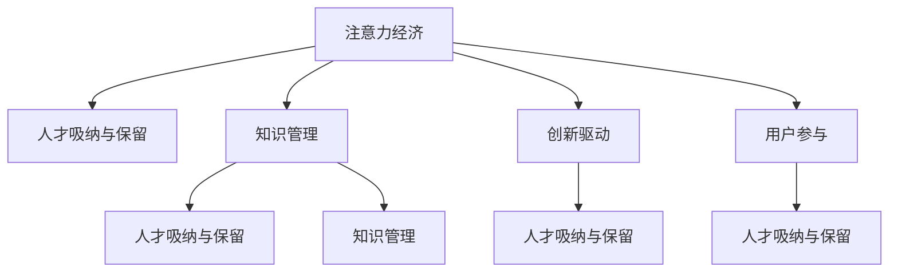

                 

# 注意力经济对企业人才培养的新要求

## 1. 背景介绍

在数字经济蓬勃发展的今天，企业面临着前所未有的挑战和机遇。一方面，互联网、大数据、人工智能等技术的发展，为企业提供了丰富的数据资源和先进的工具，助力企业创新发展；另一方面，信息过载、用户注意力分散等问题，也使得企业在吸引和保持用户注意力方面面临巨大压力。这促使企业需要重新审视自身的经营战略、产品设计、市场推广等方面的策略，从“注意力经济”的角度出发，进行更深层次的思考和改进。

在企业运营的各个环节中，人才的培养和储备尤为重要。高质量的人才不仅能够提升企业技术创新能力和市场竞争力，还能够有效吸引和保持用户的注意力，从而在竞争激烈的市场中脱颖而出。然而，面对注意力经济的挑战，企业人才培养模式也亟需进行调整，以适应新的市场环境和用户需求。本文旨在探讨注意力经济对企业人才培养的新要求，为企业人力资源管理提供有价值的参考。

## 2. 核心概念与联系

### 2.1 核心概念概述

为更好地理解注意力经济对企业人才培养的新要求，本节将介绍几个关键概念：

- **注意力经济（Attention Economy）**：指在信息过载的背景下，通过争夺用户的注意力，实现商业价值的经济形态。企业需通过优化产品设计、提升用户体验等方式，最大化地吸引和保持用户的注意力。

- **人才吸纳与保留**：指企业通过招聘、培训、激励等手段，吸引并留住优秀人才的过程。在注意力经济时代，企业需更加注重人才的吸引和保留，以提升市场竞争力。

- **知识管理（Knowledge Management）**：指通过科学管理知识和信息，提升组织效率和创新能力的过程。在注意力经济时代，企业需注重知识共享与传播，鼓励员工的知识积累与创新。

- **创新驱动（Innovation-Driven）**：指通过推动技术创新和商业模式创新，引领市场发展，创造新价值的过程。在注意力经济时代，企业需积极推动技术创新和产品创新，以满足用户不断变化的需求。

- **用户参与（User Engagement）**：指通过设计互动性强的产品和服务，增强用户参与度和粘性。在注意力经济时代，企业需注重用户参与度，以提高产品竞争力和市场份额。

这些概念之间的逻辑关系可以通过以下Mermaid流程图来展示：



这个流程图展示了几大核心概念之间的相互作用和影响：

1. 注意力经济是企业运营的基础，影响着人才吸纳与保留、知识管理、创新驱动和用户参与等关键环节。
2. 人才吸纳与保留是企业发展的基石，通过吸引和留住优秀人才，提升企业的创新能力和市场竞争力。
3. 知识管理是企业知识积累和传播的重要手段，有助于提升组织效率和创新能力。
4. 创新驱动是企业发展的动力源泉，通过技术创新和商业模式创新，实现市场引领和价值创造。
5. 用户参与是企业获取用户关注和保持用户粘性的关键，通过互动性强的产品和服务，增强用户参与度和忠诚度。

这些概念共同构成了企业的人才培养体系，需要在注意力经济时代进行重新设计和优化。

## 3. 核心算法原理 & 具体操作步骤

### 3.1 算法原理概述

注意力经济对企业人才培养的新要求，主要体现在以下几个方面：

- **数据驱动的人才招聘**：在招聘过程中，企业需通过数据分析，评估应聘者的技能、经验、潜力等综合素质，从而做出更为准确的人才选择。

- **个性化的人才培训**：通过数据分析，了解员工的学习习惯、知识掌握程度等个性化信息，为每位员工设计个性化的培训计划，提升培训效果。

- **知识共享与传播**：利用数据分析，了解员工的知识积累、创新能力等，促进知识共享与传播，提升组织整体的知识水平和创新能力。

- **用户行为分析**：通过分析用户行为数据，了解用户需求和偏好，优化产品设计，提升用户参与度和粘性。

### 3.2 算法步骤详解

基于注意力经济的人才培养体系，包括以下几个关键步骤：

**Step 1: 数据收集与处理**

1. **招聘数据收集**：从企业招聘网站、社交媒体、简历库等渠道，收集应聘者的简历、履历、技能证书等数据。
2. **员工绩效数据收集**：从企业内部系统（如CRM、ERP等）收集员工的绩效数据、工作日志、培训记录等。
3. **用户行为数据收集**：通过网站、应用等平台，收集用户的行为数据（如点击、浏览、购买等）。

**Step 2: 数据分析与建模**

1. **简历与履历分析**：使用自然语言处理（NLP）技术，提取简历中的关键信息（如教育背景、工作经验、技能等），并进行分类和聚类分析。
2. **员工绩效分析**：通过统计分析、机器学习等方法，评估员工的绩效表现，识别高潜员工。
3. **用户行为分析**：使用用户行为分析技术，识别用户需求和偏好，为产品设计提供数据支持。

**Step 3: 人才招聘与培训**

1. **人才选择与评估**：根据数据分析结果，选择最符合企业需求的候选人，并建立综合评估体系，进行面试和评估。
2. **个性化培训计划设计**：通过数据分析，了解员工的学习习惯、知识掌握程度等，为每位员工设计个性化的培训计划，提升培训效果。
3. **知识共享与传播**：利用数据分析，识别知识空白点，推动知识共享与传播，建立知识库和知识网络。

**Step 4: 产品设计与优化**

1. **用户需求分析**：通过用户行为数据分析，了解用户需求和偏好，优化产品设计。
2. **用户体验优化**：根据用户反馈和行为数据，优化用户体验，提升用户参与度和粘性。
3. **产品迭代与创新**：利用数据分析，识别市场趋势和技术发展方向，推动产品迭代与创新，保持市场竞争力。

### 3.3 算法优缺点

基于注意力经济的人才培养体系，具有以下优点：

1. **数据驱动决策**：通过数据分析，提升招聘和培训的精准度，优化人力资源管理。
2. **个性化培训**：针对每位员工的个性化需求，设计个性化的培训计划，提升培训效果。
3. **知识共享与传播**：通过知识共享与传播，提升组织整体的知识水平和创新能力。
4. **用户参与度提升**：通过产品优化和用户体验提升，增强用户参与度和粘性，提升市场竞争力。

同时，该体系也存在一定的局限性：

1. **数据隐私问题**：在收集和分析数据时，需确保数据的隐私和安全，避免数据滥用。
2. **数据质量问题**：数据质量和完整性直接影响分析结果的准确性，需确保数据收集的全面性和准确性。
3. **人才流失问题**：数据分析和个性化培训等手段，可能造成员工的过度监控和压力，影响员工的工作满意度。

尽管存在这些局限性，但就目前而言，基于注意力经济的人才培养体系仍是大数据时代下企业人才培养的重要方向。未来相关研究的重点在于如何更好地平衡数据驱动与员工隐私，提升数据质量，降低员工压力，从而实现企业的人才培养目标。

### 3.4 算法应用领域

基于注意力经济的人才培养体系，在多个领域都具有广泛的应用前景：

- **招聘与人力资源管理**：通过数据分析，优化招聘流程，提升人才选择和评估的精准度。
- **员工培训与发展**：通过个性化培训计划和知识共享，提升员工技能和知识水平，促进员工职业发展。
- **产品设计与用户体验优化**：通过用户行为分析，优化产品设计和用户体验，提升用户参与度和满意度。
- **市场分析与策略制定**：通过数据分析，了解市场趋势和技术发展方向，制定科学的市场策略和产品规划。
- **创新驱动与研发管理**：通过数据分析，推动技术创新和产品创新，提升研发效率和市场竞争力。

除了上述这些应用场景外，基于数据驱动的人才培养体系，还可以应用于教育、医疗、公共服务等更多领域，为不同行业的人才培养提供新的思路和方法。

## 4. 数学模型和公式 & 详细讲解  
### 4.1 数学模型构建

本节将使用数学语言对基于注意力经济的人才培养体系进行更加严格的刻画。

设企业需招聘的岗位为 $n$，每个岗位需具备的技能集合为 $S=\{s_1, s_2, ..., s_m\}$，每位应聘者的技能集合为 $A=\{a_1, a_2, ..., a_n\}$。设技能 $s_i$ 对应岗位 $p_j$ 的重要性为 $w_{i,j}$。

假设企业通过数据分析，得到每位应聘者在技能 $s_i$ 上的掌握程度 $k_{a_i}$，以及技能 $s_i$ 对岗位 $p_j$ 的重要性 $w_{i,j}$。通过加权求和的方式，计算应聘者 $a_i$ 的综合能力 $C_{a_i}$：

$$
C_{a_i} = \sum_{s_i \in A} w_{i,j} \cdot k_{a_i}
$$

同时，设员工在岗位 $p_j$ 上的绩效评价为 $P_{j}$，通过统计分析和机器学习等方法，评估员工在岗位 $p_j$ 上的潜在价值 $V_{p_j}$：

$$
V_{p_j} = f(P_{j})
$$

其中 $f$ 为评估函数，可以使用统计方法、回归模型等。

### 4.2 公式推导过程

根据以上定义，企业可以通过以下公式，计算应聘者在岗位 $p_j$ 上的潜在价值：

$$
V_{a_i, p_j} = C_{a_i} \cdot w_{i,j}
$$

通过上述公式，企业可以根据应聘者的综合能力和岗位的重要性，评估其潜在价值。在招聘过程中，根据潜在价值的排序，选择最符合企业需求的候选人。

同时，企业可以通过以下公式，计算员工在岗位 $p_j$ 上的实际绩效表现 $E_{j}$：

$$
E_{j} = \sum_{a_i \in A} V_{a_i, p_j} \cdot k_{a_i}
$$

通过公式（3）和（4），企业可以全面了解员工的潜在价值和实际绩效表现，从而进行科学的人才选择和评估。

## 5. 项目实践：代码实例和详细解释说明
### 5.1 开发环境搭建

在进行人才培养体系开发前，我们需要准备好开发环境。以下是使用Python进行数据分析的环境配置流程：

1. 安装Anaconda：从官网下载并安装Anaconda，用于创建独立的Python环境。

2. 创建并激活虚拟环境：
```bash
conda create -n pyanaconda python=3.8 
conda activate pyanaconda
```

3. 安装Python和相关工具：
```bash
pip install numpy pandas scikit-learn matplotlib seaborn jupyter notebook ipython
```

完成上述步骤后，即可在`pyanaconda`环境中开始人才培养体系开发。

### 5.2 源代码详细实现

下面以招聘与人力资源管理为例，给出使用Python进行数据分析的人才培养体系代码实现。

首先，定义招聘数据处理函数：

```python
import pandas as pd

def process_recruitment_data(data_path):
    data = pd.read_csv(data_path)
    return data
```

然后，定义数据分析与建模函数：

```python
from sklearn.model_selection import train_test_split
from sklearn.preprocessing import StandardScaler
from sklearn.linear_model import LinearRegression

def analyze_recruitment_data(data):
    # 分割数据为训练集和测试集
    train_data, test_data = train_test_split(data, test_size=0.2)
    
    # 数据标准化处理
    scaler = StandardScaler()
    train_data = scaler.fit_transform(train_data)
    test_data = scaler.transform(test_data)
    
    # 建立线性回归模型
    model = LinearRegression()
    model.fit(train_data, train_data['potential_value'])
    
    # 预测测试集潜在价值
    test_predictions = model.predict(test_data)
    
    return test_predictions
```

接着，定义人才选择与评估函数：

```python
def select_and_evaluate_candidates(data):
    # 加载简历数据
    recruitment_data = process_recruitment_data(data_path)
    
    # 数据分析与建模
    potential_values = analyze_recruitment_data(recruitment_data)
    
    # 根据潜在价值排序
    candidates = sorted(recruitment_data, key=lambda x: x['potential_value'], reverse=True)
    
    return candidates
```

最后，启动招聘流程：

```python
# 选择最符合企业需求的候选人
selected_candidates = select_and_evaluate_candidates(recruitment_data)

# 输出候选人名单
print(selected_candidates)
```

以上就是使用Python进行数据分析的人才培养体系代码实现。可以看到，通过数据分析，企业可以在招聘过程中，科学评估应聘者的潜在价值，选择最符合企业需求的候选人。

### 5.3 代码解读与分析

让我们再详细解读一下关键代码的实现细节：

**process_recruitment_data函数**：
- `pd.read_csv`方法：使用Pandas库读取招聘数据。
- `return`语句：返回处理后的数据。

**analyze_recruitment_data函数**：
- `train_test_split`方法：将数据分割为训练集和测试集。
- `StandardScaler`类：使用sklearn库进行数据标准化处理。
- `LinearRegression`类：建立线性回归模型，预测应聘者的潜在价值。

**select_and_evaluate_candidates函数**：
- `process_recruitment_data`函数：调用简历数据处理函数。
- `analyze_recruitment_data`函数：调用数据分析与建模函数。
- `sorted`函数：根据潜在价值对候选人进行排序。

**招聘流程**：
- `select_and_evaluate_candidates`函数：选择最符合企业需求的候选人。
- `print`函数：输出候选人名单。

代码实现展示了如何使用数据分析来优化招聘流程，选择最符合企业需求的候选人。在实际应用中，企业还可以进一步扩展功能，如引入机器学习模型进行更深层次的预测和评估，增强招聘决策的科学性和准确性。

## 6. 实际应用场景
### 6.1 智能招聘系统

基于数据分析的人才培养体系，可以应用于智能招聘系统的构建。传统的招聘流程往往需要耗费大量人力和时间，且难以全面评估应聘者的综合素质。通过引入数据分析，智能招聘系统可以自动化地进行简历筛选、技能评估、潜力预测等，大幅提升招聘效率和质量。

在技术实现上，可以收集企业招聘历史数据，提取简历中的关键信息（如教育背景、工作经验、技能等），并通过机器学习模型进行技能评估和潜力预测。微调后的模型能够在招聘初期自动筛选符合企业需求的候选人，并给出科学的人才评估报告，供招聘人员参考。如此构建的智能招聘系统，可以显著减少招聘过程中的主观判断，提升招聘决策的科学性和准确性。

### 6.2 个性化培训与发展

在员工培训与发展方面，数据分析同样大有可为。传统的培训方式往往难以针对每位员工的个性化需求，导致培训效果不佳。通过引入数据分析，企业可以了解员工的学习习惯、知识掌握程度等，为每位员工设计个性化的培训计划，提升培训效果。

在技术实现上，可以收集员工的学习记录、绩效数据、知识测试等，通过数据分析，了解员工的学习情况和知识掌握程度。根据分析结果，设计个性化的培训计划，提供针对性的学习资源和培训课程，提升员工的职业技能和知识水平。通过持续跟踪和评估，确保培训效果和员工职业发展目标的对齐，提升员工的工作满意度和企业竞争力。

### 6.3 用户行为分析与产品优化

在产品设计与用户体验优化方面，数据分析同样具有重要应用。传统的用户调研方式往往耗时耗力，难以全面了解用户需求和行为。通过引入数据分析，企业可以实时监控用户行为，分析用户需求和偏好，优化产品设计，提升用户参与度和满意度。

在技术实现上，可以收集用户的行为数据（如点击、浏览、购买等），通过用户行为分析技术，识别用户需求和偏好。根据分析结果，优化产品设计，提升用户体验，增强用户参与度和粘性。通过持续跟踪和评估，及时发现问题并优化改进，提升产品竞争力和市场份额。

### 6.4 未来应用展望

随着数据分析技术的不断发展，基于注意力经济的人才培养体系将会在更多领域得到应用，为企业的运营和发展提供新的思路和方法。

在智慧医疗领域，数据分析可以应用于医生招聘、培训、绩效评估等环节，提升医疗服务的智能化水平，辅助医生诊疗，加速医疗创新。

在智能教育领域，数据分析可以应用于学生招聘、培训、评估等环节，因材施教，促进教育公平，提高教学质量。

在智慧城市治理中，数据分析可以应用于城市事件监测、舆情分析、应急指挥等环节，提高城市管理的自动化和智能化水平，构建更安全、高效的未来城市。

此外，在企业生产、社会治理、文娱传媒等众多领域，基于数据分析的人才培养体系也将不断涌现，为传统行业数字化转型升级提供新的技术路径。相信随着数据分析技术的不断成熟，企业的人才培养体系将不断优化和升级，为企业的运营和发展提供更强的支持。

## 7. 工具和资源推荐
### 7.1 学习资源推荐

为了帮助开发者系统掌握数据分析的原理和实践技巧，这里推荐一些优质的学习资源：

1. 《数据分析实战：Python+R+SQL》系列博文：由数据分析专家撰写，深入浅出地介绍了数据分析的基本概念和实用技术，涵盖数据清洗、数据可视化、机器学习等内容。

2. Coursera《数据分析与可视化》课程：由美国杜克大学开设，涵盖数据分析的多个方面，从基础统计方法到高级机器学习技术，均有详细讲解。

3. 《Python数据科学手册》书籍：O'Reilly出版社出版的经典书籍，系统介绍了Python在数据科学中的应用，涵盖数据处理、可视化、机器学习等内容。

4. Kaggle平台：全球最大的数据科学竞赛平台，提供海量数据集和竞赛项目，是数据科学家和数据分析师的绝佳学习资源。

5. DataCamp平台：提供系统化的在线课程，涵盖数据科学、机器学习、统计分析等多个方面，适合初学者和进阶学习者。

通过对这些资源的学习实践，相信你一定能够快速掌握数据分析的精髓，并用于解决实际的数据分析问题。

### 7.2 开发工具推荐

高效的数据分析离不开优秀的工具支持。以下是几款用于数据分析开发的常用工具：

1. Python：作为数据分析的主流语言，Python以其简洁易读、功能强大著称，是数据科学家和数据分析师的必备工具。

2. R语言：R语言以其丰富的统计分析和机器学习包，在学术界和工业界广泛应用，适合进行复杂的数据分析和统计建模。

3. SQL：SQL语言是数据管理和分析的重要工具，适合进行数据查询、统计和分析。

4. Excel：Microsoft Office中的Excel，适合进行简单数据的整理、统计和可视化。

5. Tableau：数据可视化工具，适合进行数据的直观展示和分析。

6. Power BI：微软推出的商业智能工具，适合进行复杂数据的分析和可视化。

合理利用这些工具，可以显著提升数据分析的效率和质量，加快创新迭代的步伐。

### 7.3 相关论文推荐

数据分析领域的研究源远流长，以下是几篇奠基性的相关论文，推荐阅读：

1. "Data Mining: Concepts and Techniques" by Jeffrey Ullman：经典数据挖掘教材，系统介绍了数据挖掘的原理、技术和应用。

2. "Statistical Learning with Sparsity: The Lasso and Generalizations" by Trevor Hastie, Robert Tibshirani, Jerome Friedman：介绍了Lasso回归等统计学习方法，适合进行数据建模和预测。

3. "An Introduction to Statistical Learning" by Gareth James, Daniela Witten, Trevor Hastie, Robert Tibshirani：经典机器学习教材，介绍了多种统计学习方法和应用。

4. "The Elements of Statistical Learning" by Trevor Hastie, Robert Tibshirani, Jerome Friedman：介绍了多种机器学习算法及其应用，适合进行数据分析和建模。

这些论文代表了大数据分析领域的研究脉络。通过学习这些前沿成果，可以帮助研究者把握学科前进方向，激发更多的创新灵感。

## 8. 总结：未来发展趋势与挑战

### 8.1 总结

本文对基于注意力经济的人才培养体系进行了全面系统的介绍。首先阐述了注意力经济对企业运营的深刻影响，明确了数据分析在人才吸纳与保留、知识管理、创新驱动和用户参与等方面的重要性。其次，从原理到实践，详细讲解了数据分析的数学模型和操作步骤，给出了数据分析任务开发的完整代码实例。同时，本文还广泛探讨了数据分析在招聘、培训、产品优化等方面的实际应用场景，展示了数据分析的广阔前景。此外，本文精选了数据分析技术的各类学习资源，力求为读者提供全方位的技术指引。

通过本文的系统梳理，可以看到，基于数据分析的人才培养体系正在成为企业人才管理的核心方向，极大地提升了企业人才管理的科学性和效率。未来，伴随数据分析技术的不断演进，企业的人才培养体系将更加智能化、个性化，为企业的运营和发展提供更强的支持。

### 8.2 未来发展趋势

展望未来，基于数据分析的人才培养体系将呈现以下几个发展趋势：

1. **自动化和智能化**：随着机器学习和深度学习技术的发展，数据分析将越来越自动化和智能化，减少人工干预，提升数据分析的效率和准确性。

2. **个性化和定制化**：通过个性化数据分析，企业可以为每位员工设计定制化的培训和发展计划，提升培训效果和员工满意度。

3. **实时性和动态性**：数据分析将具备实时性和动态性，能够及时捕捉市场变化和员工动态，快速做出调整和优化。

4. **多模态和融合性**：数据分析将突破单一数据类型的限制，融合多模态数据（如文本、图像、视频等），提升数据的质量和多样性。

5. **数据隐私和安全**：随着数据隐私和安全问题的重要性日益凸显，数据分析将更加注重数据隐私保护和安全性。

6. **跨领域和跨行业应用**：数据分析将不仅仅局限于某一特定领域，而是跨领域、跨行业进行应用，提升数据在更广泛场景下的实用性和价值。

以上趋势凸显了基于数据分析的人才培养体系的广阔前景。这些方向的探索发展，必将进一步提升企业的人才管理能力，为企业的运营和发展提供更强的支持。

### 8.3 面临的挑战

尽管基于数据分析的人才培养体系已经取得了瞩目成就，但在迈向更加智能化、普适化应用的过程中，它仍面临着诸多挑战：

1. **数据质量和完整性问题**：数据分析的准确性很大程度上依赖于数据的质量和完整性，如何确保数据收集的全面性和准确性，是一个重要问题。

2. **数据隐私和安全问题**：在数据收集和分析过程中，需确保数据的隐私和安全，避免数据滥用和泄露。

3. **人才流失问题**：数据分析和个性化培训等手段，可能造成员工的过度监控和压力，影响员工的工作满意度。

4. **技术复杂性问题**：数据分析涉及多种技术和工具，如何降低技术门槛，使其易于理解和应用，是一个挑战。

5. **跨部门协作问题**：数据分析需要跨部门协作，如何协调不同部门的需求和利益，是一个复杂问题。

尽管存在这些挑战，但就目前而言，基于数据分析的人才培养体系仍是大数据时代下企业人才管理的重要方向。未来相关研究的重点在于如何更好地平衡数据驱动与员工隐私，提升数据质量，降低员工压力，从而实现企业的人才培养目标。

### 8.4 研究展望

面对基于数据分析的人才培养体系所面临的种种挑战，未来的研究需要在以下几个方面寻求新的突破：

1. **数据融合与预处理**：开发更加高效的数据融合与预处理技术，提升数据质量和完整性，确保数据分析的准确性。

2. **隐私保护与匿名化**：研究数据隐私保护和匿名化技术，确保数据分析过程中数据的安全性和隐私性。

3. **智能自动化系统**：开发智能自动化数据分析系统，降低技术门槛，使其易于理解和应用。

4. **跨部门协作机制**：建立跨部门协作机制，协调不同部门的需求和利益，提升数据分析的效率和效果。

5. **个性化与定制化**：开发个性化和定制化的数据分析模型，提升数据分析的个性化和定制化水平。

6. **多模态数据分析**：研究多模态数据分析技术，融合文本、图像、视频等多模态数据，提升数据分析的多样性和质量。

这些研究方向的探索，必将引领基于数据分析的人才培养体系迈向更高的台阶，为企业的运营和发展提供更强的支持。面向未来，基于数据分析的人才培养体系需要与其他数据分析技术进行更深入的融合，如知识表示、因果推理、强化学习等，多路径协同发力，共同推动企业的人才培养和运营优化。只有勇于创新、敢于突破，才能不断拓展数据分析的边界，让企业的人才培养体系更加智能化、高效化。

## 9. 附录：常见问题与解答

**Q1：数据分析在企业人才管理中的应用前景如何？**

A: 数据分析在企业人才管理中的应用前景广阔，主要体现在以下几个方面：

1. **数据驱动决策**：通过数据分析，企业可以科学评估应聘者的综合素质，选择最符合企业需求的候选人，优化招聘决策。

2. **个性化培训**：通过数据分析，企业可以为每位员工设计个性化的培训计划，提升培训效果，促进员工职业发展。

3. **知识共享与传播**：通过数据分析，企业可以推动知识共享与传播，提升组织整体的知识水平和创新能力。

4. **用户行为分析**：通过数据分析，企业可以优化产品设计，提升用户体验，增强用户参与度和粘性。

数据分析技术的应用，使得企业的人才管理更加科学、智能化，提升了企业的人才吸引力和市场竞争力。

**Q2：如何平衡数据驱动与员工隐私？**

A: 在数据分析过程中，平衡数据驱动与员工隐私是一个重要问题。以下是一些具体措施：

1. **数据匿名化**：在数据分析前，对数据进行匿名化处理，去除可能识别个人身份的信息，保护员工隐私。

2. **数据访问控制**：设置数据访问权限，确保只有授权人员才能访问和处理数据，防止数据滥用和泄露。

3. **数据加密**：在数据传输和存储过程中，使用加密技术保护数据安全，防止数据被非法获取和篡改。

4. **数据最小化**：仅收集和分析必要的数据，减少数据收集的范围和频率，降低员工隐私风险。

5. **透明度和公正性**：建立数据使用的透明机制，告知员工数据使用的目的和范围，增强员工对数据分析的信任感。

通过这些措施，可以有效地平衡数据驱动与员工隐私，确保数据分析的合规性和有效性。

**Q3：数据分析在产品优化中的应用有哪些？**

A: 数据分析在产品优化中的应用非常广泛，主要体现在以下几个方面：

1. **用户行为分析**：通过数据分析，企业可以识别用户需求和偏好，优化产品设计，提升用户体验。

2. **用户反馈分析**：通过数据分析，企业可以收集用户反馈，及时发现产品问题和改进方向，优化产品功能。

3. **A/B测试**：通过数据分析，企业可以进行A/B测试，比较不同版本产品的表现，优化产品设计。

4. **市场分析**：通过数据分析，企业可以了解市场趋势和技术发展方向，推动产品迭代与创新。

5. **用户体验优化**：通过数据分析，企业可以优化用户体验，增强用户参与度和粘性，提升市场竞争力。

数据分析技术的应用，使得企业在产品优化过程中更加科学、高效，提升了产品的市场竞争力和用户满意度。

**Q4：数据分析在人才招聘中的应用有哪些？**

A: 数据分析在人才招聘中的应用非常广泛，主要体现在以下几个方面：

1. **简历筛选**：通过数据分析，企业可以对简历进行初步筛选，去除不符合要求的简历，减少招聘成本。

2. **技能评估**：通过数据分析，企业可以对应聘者的技能进行评估，预测其未来的表现，提高招聘决策的科学性。

3. **潜力预测**：通过数据分析，企业可以预测应聘者的潜力，选择最符合企业需求的候选人，提升招聘质量。

4. **候选人比较**：通过数据分析，企业可以对候选人进行比较，选择最符合企业需求的候选人，优化招聘流程。

数据分析技术的应用，使得企业在人才招聘过程中更加科学、高效，提升了招聘决策的科学性和准确性。

**Q5：数据分析在员工培训中的应用有哪些？**

A: 数据分析在员工培训中的应用非常广泛，主要体现在以下几个方面：

1. **技能评估**：通过数据分析，企业可以了解员工的技能掌握程度，进行针对性的培训，提升培训效果。

2. **培训计划设计**：通过数据分析，企业可以为每位员工设计个性化的培训计划，提升培训效果。

3. **知识共享**：通过数据分析，企业可以推动知识共享与传播，提升员工的知识水平和创新能力。

4. **学习效果评估**：通过数据分析，企业可以评估培训效果，及时调整培训策略，提升培训效果。

数据分析技术的应用，使得企业在员工培训过程中更加科学、个性化，提升了培训效果和员工满意度。

---

作者：禅与计算机程序设计艺术 / Zen and the Art of Computer Programming

