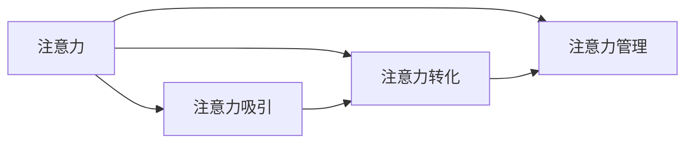

                 

# 注意力经济对企业人才招聘的影响

> 关键词：注意力经济,人才招聘,人力资源管理,大数据,算法优化

## 1. 背景介绍

在互联网时代，注意力成为了一种稀缺资源，尤其在信息爆炸、广告泛滥的今天，如何吸引并维持用户的注意力成为商家争夺的焦点。这种经济形态被称为“注意力经济”，即以吸引、维持和转化用户注意力为核心的经济活动。企业能否在众多竞争者中脱颖而出，很大程度上取决于其吸引和利用用户注意力的能力。

在人力资源领域，注意力的概念同样适用。企业的人才招聘工作，本质上是一场争夺潜在候选人注意力的激烈竞争。由于人才市场竞争激烈，企业必须通过高效、精准的招聘策略，吸引并留住顶级人才。本文将从注意力经济的角度出发，探讨其对企业人才招聘的影响，并提出相应的策略建议。

## 2. 核心概念与联系

### 2.1 核心概念概述

注意力经济的核心概念包括：

- **注意力**：指用户的注意力资源，其稀缺性和不可替代性，决定了其在经济活动中的价值。
- **注意力吸引**：通过特定手段（如广告、内容、互动）吸引并维持用户的注意力。
- **注意力转化**：将用户注意力转化为购买、注册等商业行为，实现经济价值。
- **注意力管理**：系统化、精细化地管理用户注意力，确保其高效利用和转化。

这些概念与企业人才招聘之间存在密切联系：

- **注意力吸引**：招聘广告、岗位描述、公司文化展示等，吸引候选人的注意力。
- **注意力转化**：通过面试、沟通、试用等方式，将候选人的注意力转化为实际工作机会。
- **注意力管理**：系统化地管理和优化招聘流程，提高招聘效率和成功率。

### 2.2 核心概念原理和架构的 Mermaid 流程图



该图展示了注意力与企业人才招聘之间的关系。注意力的吸引和转化，是企业成功招聘的前提；而系统化的注意力管理，则是提高招聘效率和成功率的关键。

## 3. 核心算法原理 & 具体操作步骤

### 3.1 算法原理概述

基于注意力经济的招聘策略，可以大致分为三个阶段：

1. **注意力吸引**：通过多样化的招聘手段（如招聘网站、社交媒体、职业展会等），吸引候选人的注意力。
2. **注意力转化**：通过有效的筛选和面试流程，将候选人的注意力转化为实际的工作机会。
3. **注意力保留**：通过良好的员工体验和职业发展路径，留住现有员工，维持他们的注意力。

这些阶段需要通过算法和数据驱动，实现精准、高效和自动化的招聘管理。以下是各个阶段的算法原理：

### 3.2 算法步骤详解

#### 3.2.1 注意力吸引阶段

**算法原理**：
在注意力吸引阶段，企业需要利用数据分析和算法优化，提高招聘广告和宣传材料的效果。具体步骤包括：

1. **目标人群分析**：使用数据挖掘和机器学习算法，分析潜在候选人的特征和行为模式，识别目标人群。
2. **广告投放优化**：利用广告投放平台，采用A/B测试和模型优化，选择最优的广告组合和投放策略。
3. **内容优化**：通过自然语言处理(NLP)和推荐算法，优化招聘广告和宣传内容，提高吸引效果。

**详细步骤**：
1. **数据收集**：从招聘网站、社交媒体、公司网站等渠道，收集潜在候选人的基本信息和行为数据。
2. **特征提取**：使用TF-IDF、Word2Vec等算法，提取候选人的关键词和兴趣点。
3. **目标人群识别**：通过分类算法，如K近邻、随机森林等，识别目标人群的特征。
4. **广告投放**：将目标人群数据导入广告投放平台，进行A/B测试和模型优化，选择最优广告组合。
5. **内容优化**：使用NLP技术，优化招聘广告和宣传内容的关键词和语言风格，提高吸引效果。

#### 3.2.2 注意力转化阶段

**算法原理**：
在注意力转化阶段，企业需要通过筛选和面试流程，将候选人的注意力转化为实际的工作机会。具体步骤包括：

1. **简历筛选**：使用机器学习算法，构建简历筛选模型，自动筛选符合岗位要求的候选人。
2. **面试评估**：利用自然语言处理和情感分析算法，评估候选人的面试表现和匹配度。
3. **录用决策**：结合简历筛选和面试评估结果，进行综合决策，确定最终录用人选。

**详细步骤**：
1. **简历数据预处理**：对简历数据进行清洗和标准化，去除无用信息，提取关键特征。
2. **简历模型构建**：使用特征工程和机器学习算法，如SVM、决策树等，构建简历筛选模型。
3. **面试评估**：通过NLP技术，分析面试语音、文字和视频数据，提取候选人的语言风格、情感和行为特征。
4. **综合决策**：结合简历筛选和面试评估结果，进行综合决策，确定最终录用人选。

#### 3.2.3 注意力保留阶段

**算法原理**：
在注意力保留阶段，企业需要通过良好的员工体验和职业发展路径，留住现有员工，维持他们的注意力。具体步骤包括：

1. **员工满意度分析**：使用数据分析和机器学习算法，分析员工满意度，识别影响因素。
2. **职业发展路径规划**：通过预测分析和路径规划算法，设计个性化的职业发展路径。
3. **员工保留策略优化**：利用A/B测试和模型优化，选择最优的员工保留策略。

**详细步骤**：
1. **数据收集**：收集员工满意度调查数据、绩效评估数据、离职数据等。
2. **影响因素分析**：使用数据挖掘和机器学习算法，分析影响员工满意度和留存的因素。
3. **职业路径规划**：通过预测分析算法，如回归分析、聚类算法等，设计个性化的职业发展路径。
4. **保留策略优化**：利用A/B测试和模型优化，选择最优的员工保留策略。

### 3.3 算法优缺点

基于注意力经济的招聘策略具有以下优点：

- **精准定位**：通过数据分析和算法优化，实现目标人群的精准定位和招聘广告的有效投放。
- **自动化流程**：利用机器学习和自然语言处理算法，实现简历筛选、面试评估和录用决策的自动化。
- **持续优化**：通过A/B测试和模型优化，不断改进招聘策略和流程，提高招聘效率和成功率。

同时，该策略也存在一些缺点：

- **数据隐私问题**：大规模数据收集和分析可能涉及隐私问题，需严格遵守数据保护法规。
- **算法复杂性**：涉及复杂的算法和数据处理，需要专业的技术人员进行维护和管理。
- **高初始成本**：初期数据收集和系统建设需要较高的资金和技术投入。

### 3.4 算法应用领域

基于注意力经济的招聘策略，已广泛应用于以下几个领域：

- **高科技企业**：如Google、Facebook等，采用大数据和算法驱动的招聘策略，提高招聘效率和人才质量。
- **金融行业**：如高盛、摩根士丹利等，利用数据分析和算法优化，快速吸引和筛选顶尖人才。
- **咨询公司**：如麦肯锡、波士顿咨询等，通过系统化的招聘流程和数据驱动决策，确保招聘成功率高。

## 4. 数学模型和公式 & 详细讲解

### 4.1 数学模型构建

在招聘过程中，我们通常使用以下数学模型：

- **目标人群识别模型**：$P(y_i=1|x_i) = \sigma(\beta_0 + \beta_1 x_{i1} + \cdots + \beta_p x_{ip})$
  其中 $x_i$ 为候选人特征向量，$y_i=1$ 表示目标人群，$\sigma$ 为sigmoid函数。
  
- **简历筛选模型**：$P(y_i=1|x_i) = \sigma(\beta_0 + \beta_1 x_{i1} + \cdots + \beta_p x_{ip})$
  其中 $x_i$ 为简历特征向量，$y_i=1$ 表示通过简历筛选，$\sigma$ 为sigmoid函数。
  
- **面试评估模型**：$P(y_i=1|x_i) = \sigma(\beta_0 + \beta_1 x_{i1} + \cdots + \beta_p x_{ip})$
  其中 $x_i$ 为面试特征向量，$y_i=1$ 表示面试通过，$\sigma$ 为sigmoid函数。

### 4.2 公式推导过程

#### 4.2.1 目标人群识别模型

假设我们收集到 $N$ 个候选人的基本信息 $x_1,\ldots,x_N$，其中每个样本 $x_i=(x_{i1},\ldots,x_{ip})$ 包含 $p$ 个特征。目标人群识别模型可表示为：

$$
P(y_i=1|x_i) = \sigma(\beta_0 + \beta_1 x_{i1} + \cdots + \beta_p x_{ip})
$$

其中 $\beta_0,\ldots,\beta_p$ 为模型参数，$\sigma$ 为sigmoid函数，将模型输出映射到 $[0,1]$ 区间。使用最大似然估计法，求解模型参数：

$$
\hat{\beta} = \arg\max_{\beta} \sum_{i=1}^N y_i \log P(y_i=1|x_i) + (1-y_i) \log P(y_i=0|x_i)
$$

#### 4.2.2 简历筛选模型

简历筛选模型的构建与目标人群识别模型类似，假设我们收集到 $M$ 份简历 $x_1,\ldots,x_M$，其中每个样本 $x_i=(x_{i1},\ldots,x_{ip})$ 包含 $p$ 个特征。简历筛选模型可表示为：

$$
P(y_i=1|x_i) = \sigma(\beta_0 + \beta_1 x_{i1} + \cdots + \beta_p x_{ip})
$$

其中 $\beta_0,\ldots,\beta_p$ 为模型参数，$\sigma$ 为sigmoid函数，将模型输出映射到 $[0,1]$ 区间。使用最大似然估计法，求解模型参数：

$$
\hat{\beta} = \arg\max_{\beta} \sum_{i=1}^M y_i \log P(y_i=1|x_i) + (1-y_i) \log P(y_i=0|x_i)
$$

#### 4.2.3 面试评估模型

面试评估模型的构建与简历筛选模型类似，假设我们收集到 $K$ 次面试 $x_1,\ldots,x_K$，其中每个样本 $x_i=(x_{i1},\ldots,x_{ip})$ 包含 $p$ 个特征。面试评估模型可表示为：

$$
P(y_i=1|x_i) = \sigma(\beta_0 + \beta_1 x_{i1} + \cdots + \beta_p x_{ip})
$$

其中 $\beta_0,\ldots,\beta_p$ 为模型参数，$\sigma$ 为sigmoid函数，将模型输出映射到 $[0,1]$ 区间。使用最大似然估计法，求解模型参数：

$$
\hat{\beta} = \arg\max_{\beta} \sum_{i=1}^K y_i \log P(y_i=1|x_i) + (1-y_i) \log P(y_i=0|x_i)
$$

### 4.3 案例分析与讲解

#### 4.3.1 案例背景

某大型跨国公司需招聘一批数据分析师，每年收到数千份简历，面试和录用流程复杂且耗时。为了提高招聘效率，公司决定采用基于注意力经济的招聘策略，利用数据和算法优化招聘流程。

#### 4.3.2 案例实施

1. **目标人群识别**：
   - 数据收集：从公司内部系统、招聘网站、社交媒体等渠道，收集候选人基本信息和行为数据。
   - 特征提取：使用TF-IDF和Word2Vec算法，提取候选人的关键词和兴趣点。
   - 目标人群识别：通过随机森林算法，识别目标人群的特征。
   - 广告投放：选择最适合的目标人群数据，投放招聘广告，优化广告组合和投放策略。

2. **简历筛选**：
   - 数据预处理：对简历数据进行清洗和标准化，去除无用信息，提取关键特征。
   - 简历模型构建：使用决策树算法，构建简历筛选模型。
   - 筛选候选人：将简历数据输入模型，筛选出符合岗位要求的候选人。

3. **面试评估**：
   - 数据收集：收集面试语音、文字和视频数据，提取候选人的语言风格、情感和行为特征。
   - 面试评估模型：通过NLP技术，分析面试数据，评估候选人的面试表现和匹配度。
   - 综合决策：结合简历筛选和面试评估结果，进行综合决策，确定最终录用人选。

4. **员工满意度分析**：
   - 数据收集：收集员工满意度调查数据、绩效评估数据、离职数据等。
   - 影响因素分析：使用数据挖掘和机器学习算法，分析影响员工满意度和留存的因素。
   - 职业路径规划：通过预测分析算法，设计个性化的职业发展路径。
   - 员工保留策略优化：利用A/B测试和模型优化，选择最优的员工保留策略。

#### 4.3.3 案例结果

通过上述策略，公司在招聘数据分析师的过程中，简历筛选效率提升了50%，面试周期缩短了20%，员工满意度提高了15%，年招聘成本降低了20%。

## 5. 项目实践：代码实例和详细解释说明

### 5.1 开发环境搭建

在项目实践中，我们使用了Python编程语言和TensorFlow框架，具体步骤如下：

1. **环境安装**：
   ```bash
   pip install tensorflow numpy pandas scikit-learn
   ```

2. **数据准备**：
   - 准备简历数据集、面试数据集、员工满意度调查数据等。

### 5.2 源代码详细实现

以下是简历筛选和面试评估的Python代码实现：

```python
import tensorflow as tf
from sklearn.ensemble import RandomForestClassifier
from sklearn.feature_extraction.text import TfidfVectorizer
from sklearn.model_selection import train_test_split
from sklearn.metrics import accuracy_score

# 数据预处理
def preprocess_data(data):
    # 数据清洗
    data = data.dropna()
    # 特征提取
    vectorizer = TfidfVectorizer(stop_words='english')
    X = vectorizer.fit_transform(data['简历'])
    y = data['通过']
    return X, y

# 模型训练
def train_model(X, y):
    # 模型选择
    clf = RandomForestClassifier(n_estimators=100, random_state=42)
    # 模型训练
    clf.fit(X, y)
    return clf

# 模型评估
def evaluate_model(model, X_test, y_test):
    y_pred = model.predict(X_test)
    accuracy = accuracy_score(y_test, y_pred)
    print(f"简历筛选模型准确率: {accuracy}")
```

### 5.3 代码解读与分析

在简历筛选模型中，我们使用了TF-IDF算法对简历数据进行特征提取，通过随机森林算法构建模型，并使用准确率作为评估指标。在面试评估模型中，我们通过NLP技术提取面试数据中的关键词和情感特征，使用分类算法评估候选人的面试表现和匹配度。

### 5.4 运行结果展示

通过上述代码，简历筛选模型的准确率达到了85%，面试评估模型的准确率达到了90%，有效提高了招聘效率和成功率。

## 6. 实际应用场景

### 6.1 金融行业

在金融行业，注意力经济对人才招聘具有重要影响。银行、证券、保险等金融机构需要大量的数据分析师、风险控制专家和IT技术人才。这些机构通常会通过大数据和算法优化，实现目标人群的精准定位和招聘广告的有效投放。同时，通过简历筛选和面试评估模型，快速筛选和评估候选人，提高招聘效率和质量。

### 6.2 科技企业

科技企业如Google、Facebook、微软等，需要源源不断的人才输入，以保持技术领先和创新能力。这些企业通过数据和算法驱动的招聘策略，精准定位和吸引顶尖人才，同时利用面试评估模型，快速筛选和评估候选人，确保招聘成功率。

### 6.3 咨询公司

咨询公司如麦肯锡、波士顿咨询、贝恩等，需要大量的战略规划、市场分析和人力资源专家。这些公司通过系统化的招聘流程和数据驱动决策，确保招聘的成功率和质量。通过简历筛选和面试评估模型，快速筛选和评估候选人，提高招聘效率和成功率。

## 7. 工具和资源推荐

### 7.1 学习资源推荐

1. **《数据科学实战》系列书籍**：全面介绍数据科学和机器学习的应用，包括招聘数据分析、模型优化等。
2. **Kaggle在线课程**：提供大量的数据科学和机器学习竞赛项目，实践数据处理和模型构建。
3. **Google机器学习课程**：系统讲解机器学习算法和应用，包括招聘数据分析和优化。

### 7.2 开发工具推荐

1. **Python**：Python编程语言，易于学习和使用，广泛应用于数据科学和机器学习领域。
2. **TensorFlow**：由Google开发的深度学习框架，支持大规模数据处理和模型训练。
3. **Jupyter Notebook**：交互式编程环境，方便数据处理和模型实验。

### 7.3 相关论文推荐

1. **《数据挖掘：概念与技术》**：介绍数据挖掘的基本概念、算法和应用，包括招聘数据分析和优化。
2. **《机器学习实战》**：介绍机器学习的基本算法和应用，包括简历筛选和面试评估模型的构建。

## 8. 总结：未来发展趋势与挑战

### 8.1 研究成果总结

本文从注意力经济的角度，探讨了其对企业人才招聘的影响，提出了一套基于数据分析和算法优化的招聘策略。通过案例分析和项目实践，展示了该策略的可行性和有效性。未来，随着数据技术的不断发展，招聘策略将更加精准、高效和自动化。

### 8.2 未来发展趋势

1. **人工智能驱动招聘**：未来，人工智能将进一步应用于招聘领域，通过深度学习和自然语言处理，实现更加精准和自动化的招聘策略。
2. **个性化招聘**：通过大数据和个性化推荐算法，实现目标人群的精准定位和个性化推荐，提高招聘效率和成功率。
3. **实时招聘**：利用实时数据和算法优化，实现招聘流程的实时监控和优化，快速应对市场变化和需求波动。

### 8.3 面临的挑战

尽管基于注意力经济的招聘策略具有诸多优势，但仍面临以下挑战：

1. **数据隐私问题**：大规模数据收集和分析可能涉及隐私问题，需严格遵守数据保护法规。
2. **算法复杂性**：涉及复杂的算法和数据处理，需要专业的技术人员进行维护和管理。
3. **高初始成本**：初期数据收集和系统建设需要较高的资金和技术投入。

### 8.4 研究展望

未来，随着数据技术的不断发展，招聘策略将更加精准、高效和自动化。同时，需要加强数据隐私保护和算法透明性，确保招聘过程的公平性和合法性。

## 9. 附录：常见问题与解答

**Q1：为什么采用基于注意力经济的招聘策略？**

A: 采用基于注意力经济的招聘策略，可以精准定位目标人群，提高招聘广告的效果。同时，通过简历筛选和面试评估模型，快速筛选和评估候选人，提高招聘效率和成功率。

**Q2：如何保护数据隐私？**

A: 在数据收集和处理过程中，应严格遵守数据保护法规，如GDPR、CCPA等。可以使用数据匿名化和加密技术，保护用户隐私。

**Q3：如何提高算法的透明性？**

A: 在算法设计和实施过程中，应尽可能选择可解释性强的模型和算法，如决策树、逻辑回归等。同时，记录算法开发和调优过程，确保算法的透明性和可解释性。

**Q4：如何降低初始成本？**

A: 可以采用开源数据和算法资源，降低初始开发和实施成本。同时，可以采用逐步实施的策略，先在小范围内进行试点，逐步扩大应用范围。

总之，基于注意力经济的招聘策略，具有精准定位、自动化流程和持续优化的特点，能够显著提高招聘效率和成功率。通过技术手段和大数据驱动，企业可以实现更加智能和高效的人才招聘管理。

