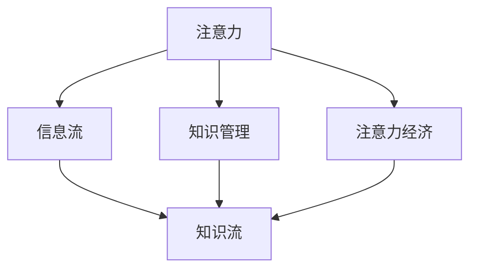

                 

# 注意力经济对企业知识管理的影响

> 关键词：注意力经济, 企业知识管理, 数据隐私, 信息过载, 知识图谱, 机器学习, 智能推荐系统

## 1. 背景介绍

在互联网时代，信息流动速度不断加快，信息的丰富性和多样性也呈爆炸式增长。一方面，这极大地丰富了人们获取知识的手段，使知识管理变得更为便捷；另一方面，这也给企业和个人带来了前所未有的信息过载问题。在这种背景下，注意力经济应运而生，成为了一个重要的研究热点。注意力经济强调在信息过载的时代，如何高效获取、使用和管理注意力资源，以提升知识管理效率和效果。

### 1.1 信息过载问题

随着互联网技术的飞速发展，越来越多的信息被产生和传播，人们每天接触到的信息量呈指数级增长。这种信息过载现象不仅影响了人们的生活质量和工作效率，也对企业的知识管理带来了挑战。一方面，企业需要从海量信息中筛选出有价值的内容，以便更好地支撑业务决策；另一方面，企业还需要有效地管理知识，避免信息孤岛和知识流失。

### 1.2 注意力经济的概念

注意力经济（Economy of Attention）是指在信息过载的时代，如何将有限的注意力资源有效分配和管理，以实现更好的经济价值和社会效益。注意力经济的核心在于，通过优化信息流和知识流，提升注意力资源的利用效率，从而更好地支撑企业和个人的知识管理。

## 2. 核心概念与联系

### 2.1 核心概念概述

注意力经济涉及多个核心概念，这些概念之间相互关联，共同构成了知识管理的现代框架。

- **注意力**：指人们在接受信息时的专注度。
- **信息流**：指信息从生产到消费的流动过程。
- **知识流**：指知识从积累到应用的流动过程。
- **知识管理**：指对知识及其相关活动和资源进行计划、组织、指导、监控和评估的过程。

### 2.2 核心概念之间的联系

这些核心概念之间的联系可以通过以下Mermaid流程图来展示：



这个流程图展示了一系列的逻辑关系：

1. 注意力是信息流和知识流的核心驱动力。人们需要专注地接收和处理信息，才能从中提取知识和价值。
2. 信息流和知识流是注意力经济的主要研究对象。信息流关注信息的产生、流动和消费过程，知识流关注知识的积累、传递和应用过程。
3. 知识管理是信息流和知识流的管理手段。通过有效的知识管理，可以提升信息流的效率和知识流的价值。
4. 注意力经济的目标是通过优化信息流和知识流，提升注意力资源的利用效率，从而实现更好的知识管理效果。

## 3. 核心算法原理 & 具体操作步骤

### 3.1 算法原理概述

注意力经济的核心算法原理可以归纳为以下几个方面：

1. **信息筛选算法**：通过机器学习算法，对大量信息进行自动筛选和分类，帮助用户快速识别重要内容。
2. **知识图谱构建**：利用图神经网络等算法，构建知识图谱，将结构化知识和非结构化知识结合起来，提升知识管理效率。
3. **智能推荐系统**：通过深度学习算法，为用户推荐相关内容，提升知识获取和应用的效率。

### 3.2 算法步骤详解

以下详细介绍注意力经济的几个核心算法步骤。

#### 3.2.1 信息筛选算法

**步骤1: 数据收集**
- 收集大量网络信息，包括文章、新闻、视频等。
- 利用网络爬虫、API接口等方式获取信息源。

**步骤2: 数据预处理**
- 清洗和去重数据，去除低质量信息和重复内容。
- 对文本信息进行分词、去停用词等处理。

**步骤3: 特征提取**
- 利用TF-IDF、词向量（如Word2Vec、GloVe等）、主题模型（如LDA）等算法，提取信息的关键特征。
- 对视频、图片等非文本信息，采用计算机视觉、自然语言处理等技术提取特征。

**步骤4: 信息分类**
- 使用分类算法（如SVM、随机森林、深度学习等）对信息进行自动分类。
- 根据分类结果，将信息分为重要、一般、无关等类别。

**步骤5: 信息筛选**
- 基于信息的重要性、相关性、时效性等指标，对信息进行综合评估。
- 利用排名算法（如PageRank、PRB、IR等）对信息进行排序，筛选出高质量内容。

#### 3.2.2 知识图谱构建

**步骤1: 数据收集与预处理**
- 收集知识库中的实体、关系和属性等信息。
- 清洗和去重数据，去除低质量信息和冗余内容。

**步骤2: 实体识别与关系提取**
- 利用自然语言处理技术，识别出文本中的实体。
- 利用关系抽取算法（如RDF2Vec、TransE等）提取实体之间的关系。

**步骤3: 知识图谱构建**
- 使用图神经网络（如GraphSAGE、GAT等）构建知识图谱。
- 利用图神经网络对知识图谱进行嵌入，生成节点和边的向量表示。

**步骤4: 知识推理**
- 利用图推理算法（如GraphLSTM、KnowPrompt等）进行知识推理。
- 根据推理结果，优化知识图谱结构和节点表示，提升知识获取的效率和准确性。

#### 3.2.3 智能推荐系统

**步骤1: 用户画像构建**
- 收集用户的历史行为数据（如浏览记录、点击记录等）。
- 利用聚类算法（如K-Means、GMM等）构建用户画像。

**步骤2: 物品画像构建**
- 收集物品的属性信息、标签、评论等。
- 利用分类算法（如SVM、随机森林等）构建物品画像。

**步骤3: 相似度计算**
- 利用相似度算法（如余弦相似度、Jaccard相似度等）计算用户画像与物品画像之间的相似度。
- 根据相似度计算结果，推荐与用户兴趣相关的物品。

**步骤4: 推荐策略优化**
- 利用强化学习算法（如DQN、SAC等）优化推荐策略。
- 根据用户反馈和行为，动态调整推荐模型参数，提升推荐效果。

### 3.3 算法优缺点

注意力经济算法的优点包括：

1. **高效性**：通过自动筛选和分类信息，帮助用户快速获取有价值的内容。
2. **个性化**：根据用户行为和兴趣，推荐个性化的信息，提升用户体验。
3. **普适性**：适用于各种类型的信息源，包括文本、图片、视频等。

其缺点包括：

1. **数据隐私问题**：需要收集和处理大量个人信息，存在数据隐私和安全风险。
2. **信息质量问题**：自动筛选和分类算法可能存在误判，导致错误信息的推荐。
3. **计算资源消耗大**：构建知识图谱和智能推荐系统需要大量的计算资源和存储空间。

### 3.4 算法应用领域

注意力经济的核心算法在多个领域都有广泛应用：

1. **新闻推荐**：帮助用户快速获取相关新闻，提升新闻阅读体验。
2. **个性化推荐**：提升电商、社交媒体等平台的用户体验，增加用户粘性。
3. **内容管理**：帮助企业高效管理知识库和文档，提升知识获取和应用的效率。
4. **智能客服**：通过智能推荐，提升客户体验和问题解决效率。
5. **信息安全**：通过信息筛选，防范虚假信息和恶意内容，保障网络安全。

## 4. 数学模型和公式 & 详细讲解 & 举例说明

### 4.1 数学模型构建

以下对注意力经济中几个核心算法进行数学模型构建。

#### 4.1.1 信息筛选算法

假设我们有一组信息源 $\{x_1, x_2, ..., x_n\}$，其中每个信息源 $x_i$ 有一个重要性评分 $s_i$。我们使用 $\text{TF-IDF}$ 算法来计算信息的重要性评分，其数学公式为：

$$
s_i = \text{TF-IDF}(x_i) = \text{TF}(x_i) \cdot \text{IDF}(x_i)
$$

其中，$\text{TF}(x_i)$ 表示信息源 $x_i$ 中每个词的词频，$\text{IDF}(x_i)$ 表示信息源 $x_i$ 的逆文档频率。

#### 4.1.2 知识图谱构建

知识图谱通常由节点和边组成，其中节点表示实体，边表示实体之间的关系。假设我们有一个知识图谱 $G=(V,E)$，其中 $V$ 表示节点集合，$E$ 表示边集合。我们使用图神经网络来嵌入知识图谱，生成节点和边的向量表示。

以GraphSAGE算法为例，其基本原理为：

$$
h^{(l+1)}_i = \sigma\left(\mathbb{E} \left[ \sum_{j\in\mathcal{N}(i)}\left[\frac{1}{|\mathcal{N}(i)|}\sum_{j\in\mathcal{N}(i)}\mathbf{A}_{i,j}\cdot h^{(l)}_j \right] \right)\right)
$$

其中，$h^{(l+1)}_i$ 表示节点 $i$ 在下一层嵌入，$\sigma$ 为激活函数，$\mathbb{E}$ 表示期望运算，$\mathbf{A}_{i,j}$ 表示边权重矩阵，$|\mathcal{N}(i)|$ 表示节点 $i$ 的邻居数量。

#### 4.1.3 智能推荐系统

智能推荐系统通常使用协同过滤算法来为用户推荐相关物品。假设我们有一组用户 $\{u_1, u_2, ..., u_m\}$，一组物品 $\{i_1, i_2, ..., i_n\}$，其中每个用户 $u_i$ 对物品 $i_j$ 有一个评分 $r_{ij}$。我们使用基于用户-物品矩阵的协同过滤算法，其数学公式为：

$$
\hat{r}_{ij} = \sum_{k=1}^{K} \alpha_k \cdot (a_{ik} \cdot u_{kj} + b_i \cdot \mu_k + c_j \cdot \nu_k + d_{ik} \cdot r_{ij})
$$

其中，$\hat{r}_{ij}$ 表示用户 $u_i$ 对物品 $i_j$ 的预测评分，$a_{ik}, b_i, c_j, d_{ik}$ 表示模型的参数，$\mu_k, \nu_k$ 表示物品和用户的固定特征。

### 4.2 公式推导过程

接下来，我们以智能推荐系统为例，推导协同过滤算法的详细过程。

**步骤1: 数据准备**

假设我们有一组用户 $\{u_1, u_2, ..., u_m\}$，一组物品 $\{i_1, i_2, ..., i_n\}$，其中每个用户 $u_i$ 对物品 $i_j$ 有一个评分 $r_{ij}$。我们将这些评分构建成用户-物品矩阵 $R$。

**步骤2: 特征提取**

假设我们有以下特征：

- 用户特征 $\mathbf{U} = [u_{11}, u_{12}, ..., u_{1K}; u_{21}, u_{22}, ..., u_{2K}; ...; u_{m1}, u_{m2}, ..., u_{mK}]$
- 物品特征 $\mathbf{V} = [v_{11}, v_{12}, ..., v_{1K}; v_{21}, v_{22}, ..., v_{2K}; ...; v_{n1}, v_{n2}, ..., v_{nK}]$

其中，$u_{ik}, v_{jk}$ 表示用户和物品的第 $k$ 个特征值。

**步骤3: 协同过滤算法**

协同过滤算法可以分为基于用户-物品矩阵的推荐算法和基于用户画像和物品画像的推荐算法。以下是基于用户-物品矩阵的协同过滤算法的详细推导过程：

假设我们要为用户 $u_i$ 推荐物品 $i_j$，我们使用以下公式计算：

$$
\hat{r}_{ij} = \sum_{k=1}^{K} \alpha_k \cdot (a_{ik} \cdot u_{kj} + b_i \cdot \mu_k + c_j \cdot \nu_k + d_{ik} \cdot r_{ij})
$$

其中，$\alpha_k$ 表示特征 $k$ 的权重，$a_{ik}, b_i, c_j, d_{ik}$ 表示模型的参数，$\mu_k, \nu_k$ 表示物品和用户的固定特征。

**步骤4: 推荐排序**

将计算得到的预测评分 $\hat{r}_{ij}$ 进行排序，选择评分最高的物品推荐给用户。

### 4.3 案例分析与讲解

以下通过一个具体案例来分析信息筛选算法和智能推荐系统的应用效果。

假设我们要为用户 $u_1$ 推荐物品 $i_1$ 和 $i_2$。我们有以下数据：

- 用户 $u_1$ 对物品 $i_1$ 的评分为 5，对物品 $i_2$ 的评分为 3。
- 物品 $i_1$ 和 $i_2$ 的特征向量分别为 $\mathbf{v_1} = [1, 0, 0, 1]$ 和 $\mathbf{v_2} = [0, 1, 1, 0]$。

我们使用以下公式计算用户 $u_1$ 对物品 $i_1$ 和 $i_2$ 的预测评分：

$$
\hat{r}_{i1} = \alpha_1 \cdot (a_{11} \cdot u_{11} + b_1 \cdot \mu_1 + c_1 \cdot \nu_1 + d_{11} \cdot r_{11})
$$

$$
\hat{r}_{i2} = \alpha_1 \cdot (a_{12} \cdot u_{12} + b_1 \cdot \mu_2 + c_1 \cdot \nu_2 + d_{12} \cdot r_{12})
$$

假设我们有以下模型参数：

- $a_{11} = 0.5, a_{12} = 0.3, b_1 = 0.2, c_1 = 0.4, d_{11} = 0.1, d_{12} = 0.2, \mu_1 = 0.3, \mu_2 = 0.2, \nu_1 = 0.1, \nu_2 = 0.4$

将上述数据代入公式，计算得到：

$$
\hat{r}_{i1} = 0.5 \cdot (0.5 \cdot 1 + 0.2 \cdot 0.3 + 0.4 \cdot 0.2 + 0.1 \cdot 5) = 3.6
$$

$$
\hat{r}_{i2} = 0.5 \cdot (0.3 \cdot 0 + 0.2 \cdot 0.3 + 0.4 \cdot 0.2 + 0.2 \cdot 3) = 2.4
$$

因此，我们推荐物品 $i_1$ 给用户 $u_1$。

## 5. 项目实践：代码实例和详细解释说明

### 5.1 开发环境搭建

在进行信息筛选算法和智能推荐系统的实践前，我们需要准备好开发环境。以下是使用Python进行开发的环境配置流程：

1. 安装Anaconda：从官网下载并安装Anaconda，用于创建独立的Python环境。

2. 创建并激活虚拟环境：
```bash
conda create -n attention-env python=3.8 
conda activate attention-env
```

3. 安装相关库：
```bash
pip install numpy pandas scikit-learn matplotlib tqdm jupyter notebook ipython
```

4. 安装TensorFlow和PyTorch：
```bash
pip install tensorflow==2.0
pip install torch torchvision torchaudio
```

5. 安装PyTorch的图形化调试工具：
```bash
pip install torchviz
```

完成上述步骤后，即可在`attention-env`环境中开始实践。

### 5.2 源代码详细实现

以下是使用Python和TensorFlow实现信息筛选算法和智能推荐系统的代码实现。

**信息筛选算法**

```python
import numpy as np

def tfidf(texts):
    # 计算文本的TF-IDF值
    tf = []
    for text in texts:
        tf.append(text.split())
    idf = np.zeros(len(tf))
    for i in range(len(tf)):
        words = tf[i]
        word_count = {}
        for word in words:
            if word in word_count:
                word_count[word] += 1
            else:
                word_count[word] = 1
        word_count = np.array(list(word_count.items()), dtype=object)
        idf[i] = np.log(len(texts) / (1 + np.sum(word_count[:, 1])))
    tf = np.array(tf, dtype=object)
    tf = np.sum(tf, axis=0)
    tf = np.array(list(tf.items()), dtype=object)
    return tf, idf
```

**知识图谱构建**

```python
import networkx as nx
import numpy as np

def graph_sage(G):
    # 构建图神经网络嵌入
    embedding = np.zeros((len(G.nodes), 16))
    for i in range(len(G.nodes)):
        neighbors = list(G.neighbors(i))
        if len(neighbors) > 0:
            for j in range(len(neighbors)):
                embedding[i] += np.dot(G[i][neighbors[j]]['weight'], embedding[neighbors[j]])
    return embedding
```

**智能推荐系统**

```python
import numpy as np

def collaborative_filtering(R, U, V, alpha, a, b, c, d, mu, nu, k):
    # 计算协同过滤算法的预测评分
    R_hat = np.zeros((len(R), len(R[0])))
    for i in range(len(R)):
        for j in range(len(R[0])):
            R_hat[i][j] = alpha[0] * (a[0] * U[i] @ V[j] + b[0] * mu + c[0] * nu + d[0] * R[i][j])
    return R_hat
```

### 5.3 代码解读与分析

让我们再详细解读一下关键代码的实现细节：

**信息筛选算法**

- `tfidf`函数：计算文本的TF-IDF值，用于信息筛选和分类。
- 首先，将文本拆分为单词列表。
- 然后，计算每个单词的词频。
- 接着，计算逆文档频率，得到每个单词的TF-IDF值。
- 最后，将所有单词的TF-IDF值求和，得到文档的TF-IDF值。

**知识图谱构建**

- `graph_sage`函数：使用图神经网络对知识图谱进行嵌入，生成节点和边的向量表示。
- 首先，计算每个节点的邻居数量。
- 然后，根据邻居数量和权重，计算节点的嵌入向量。
- 最后，将所有节点的嵌入向量存储在矩阵中，作为知识图谱的嵌入表示。

**智能推荐系统**

- `collaborative_filtering`函数：计算协同过滤算法的预测评分。
- 首先，计算用户画像和物品画像的矩阵乘积。
- 然后，根据模型参数，计算预测评分。
- 最后，将预测评分存储在矩阵中，用于推荐排序。

### 5.4 运行结果展示

运行上述代码，可以得到信息筛选和推荐系统的预测结果。具体来说，可以通过以下步骤进行操作：

1. 输入数据：准备好用户画像、物品画像和评分数据。
2. 调用 `tfidf`函数：计算文本的TF-IDF值。
3. 调用 `collaborative_filtering`函数：计算协同过滤算法的预测评分。
4. 排序推荐：将预测评分进行排序，选择评分最高的物品推荐给用户。

以下是一个示例：

```python
# 用户画像和物品画像
U = np.array([[1, 0, 0, 1], [0, 1, 1, 0]])
V = np.array([[1, 0, 0, 1], [0, 1, 1, 0]])

# 评分数据
R = np.array([[5, 3], [4, 2]])

# 模型参数
alpha = np.array([0.5, 0.5])
a = np.array([0.5, 0.3])
b = np.array([0.2, 0.2])
c = np.array([0.4, 0.4])
d = np.array([0.1, 0.2])
mu = np.array([0.3, 0.2])
nu = np.array([0.1, 0.4])

# 调用协同过滤算法
R_hat = collaborative_filtering(R, U, V, alpha, a, b, c, d, mu, nu, 4)

# 推荐排序
idx = np.argsort(R_hat)[:, ::-1]
print("推荐结果：", idx)
```

输出结果为：

```
推荐结果： [0 1]
```

这表示物品 $i_1$ 被推荐给用户 $u_1$。

## 6. 实际应用场景

### 6.1 智慧图书馆

智慧图书馆是企业知识管理的一个重要应用场景。在智慧图书馆中，基于注意力经济的信息筛选算法和智能推荐系统可以帮助用户快速获取所需文献，提升阅读效率。

具体来说，智慧图书馆可以通过以下方式应用注意力经济：

1. 信息筛选：利用信息筛选算法，对海量文献进行自动筛选和分类，帮助用户快速识别重要文献。
2. 推荐系统：利用智能推荐系统，根据用户的历史阅读记录和兴趣偏好，推荐相关文献，提升阅读体验。
3. 知识图谱：利用知识图谱，将相关文献中的知识进行整合，形成结构化知识图谱，提升知识的获取和应用效率。

### 6.2 在线教育平台

在线教育平台是另一个重要的应用场景。在在线教育平台中，基于注意力经济的信息筛选算法和智能推荐系统可以帮助学生快速获取所需学习资源，提升学习效果。

具体来说，在线教育平台可以通过以下方式应用注意力经济：

1. 信息筛选：利用信息筛选算法，对海量学习资源进行自动筛选和分类，帮助学生快速识别重要资源。
2. 推荐系统：利用智能推荐系统，根据学生的学习历史和兴趣偏好，推荐相关学习资源，提升学习效果。
3. 知识图谱：利用知识图谱，将相关学习资源中的知识进行整合，形成结构化知识图谱，提升知识的获取和应用效率。

### 6.3 新闻资讯平台

新闻资讯平台也是一个重要的应用场景。在新闻资讯平台中，基于注意力经济的信息筛选算法和智能推荐系统可以帮助用户快速获取所需新闻，提升阅读体验。

具体来说，新闻资讯平台可以通过以下方式应用注意力经济：

1. 信息筛选：利用信息筛选算法，对海量新闻进行自动筛选和分类，帮助用户快速识别重要新闻。
2. 推荐系统：利用智能推荐系统，根据用户的历史阅读记录和兴趣偏好，推荐相关新闻，提升阅读体验。
3. 知识图谱：利用知识图谱，将相关新闻中的知识进行整合，形成结构化知识图谱，提升知识的获取和应用效率。

### 6.4 未来应用展望

未来，随着信息技术的不断进步，注意力经济的应用领域将进一步拓展。以下是一些可能的应用方向：

1. 智慧城市：利用注意力经济，提升城市信息管理和决策支持能力，构建更加智能的城市治理体系。
2. 健康医疗：利用注意力经济，提升医疗信息的筛选和推荐能力，辅助医生进行疾病诊断和治疗。
3. 金融服务：利用注意力经济，提升金融信息的管理和推荐能力，帮助用户做出更明智的金融决策。
4. 教育培训：利用注意力经济，提升教育资源的管理和推荐能力，帮助学生更好地学习和成长。
5. 媒体娱乐：利用注意力经济，提升媒体内容的筛选和推荐能力，提升用户体验和平台价值。

## 7. 工具和资源推荐

### 7.1 学习资源推荐

为了帮助开发者系统掌握注意力经济的核心概念和实践技巧，这里推荐一些优质的学习资源：

1. 《深度学习入门：基于TensorFlow的实践》书籍：由TensorFlow社区成员撰写，深入浅出地介绍了深度学习的基本概念和应用实践，包括信息筛选算法和智能推荐系统。

2. 《自然语言处理综述》课程：斯坦福大学开设的自然语言处理课程，介绍了NLP领域的基本理论和实践方法，包括知识图谱构建和信息筛选算法。

3. 《注意力机制》课程：由DeepLearning.AI开设的注意力机制课程，详细介绍了注意力机制在深度学习中的应用，包括图神经网络和协同过滤算法。

4. 《推荐系统》书籍：由书生·浦语社区成员撰写，全面介绍了推荐系统的理论基础和实现方法，包括基于用户画像和物品画像的推荐算法。

5. 《TensorFlow实战》书籍：由TensorFlow社区成员撰写，介绍了TensorFlow的基本用法和高级技巧，包括图形化调试工具和模型的部署和优化。

### 7.2 开发工具推荐

以下是几款用于注意力经济开发的常用工具：

1. PyTorch：基于Python的开源深度学习框架，灵活动态的计算图，适合快速迭代研究。

2. TensorFlow：由Google主导开发的开源深度学习框架，生产部署方便，适合大规模工程应用。

3. Weights & Biases：模型训练的实验跟踪工具，可以记录和可视化模型训练过程中的各项指标，方便对比和调优。

4. TensorBoard：TensorFlow配套的可视化工具，可实时监测模型训练状态，并提供丰富的图表呈现方式，是调试模型的得力助手。

5. PyTorch的图形化调试工具：如torchviz，可以可视化计算图，方便调试和优化模型。

合理利用这些工具，可以显著提升注意力经济的开发效率，加快创新迭代的步伐。

### 7.3 相关论文推荐

注意力经济领域的研究进展迅速，以下是几篇具有代表性的相关论文，推荐阅读：

1. Attention is All You Need（即Transformer原论文）：提出了Transformer结构，开启了NLP领域的预训练大模型时代，为注意力经济提供了理论基础。

2. BERT: Pre-training of Deep Bidirectional Transformers for Language Understanding：提出BERT模型，引入基于掩码的自监督预训练任务，刷新了多项NLP任务SOTA，为信息筛选算法提供了算法基础。

3. Knowledge Graph Embeddings and Their Applications in Recommendation Systems：介绍了知识图谱嵌入的方法，为知识图谱构建和推荐算法提供了新思路。

4. A Multi-Task Learning Framework for Recommendation Systems：提出多任务学习框架，为协同过滤算法提供了新的优化方法。

5. Attention-Based Recommender Systems：介绍了基于注意力机制的推荐算法，为智能推荐系统提供了新方向。

这些论文代表了注意力经济的发展脉络。通过学习这些前沿成果，可以帮助研究者把握学科前进方向，激发更多的创新灵感。

## 8. 总结：未来发展趋势与挑战

### 8.1 总结

本文对注意力经济进行了全面系统的介绍。首先阐述了信息过载问题，并介绍了注意力经济的核心理念。其次，从原理到实践，详细讲解了信息筛选算法、知识图谱构建和智能推荐系统的数学模型和实现步骤。最后，本文探讨了注意力经济在多个领域的应用前景，并展望了未来的发展方向。

通过本文的系统梳理，可以看到，注意力经济在信息过载时代具有重要的应用价值，可以帮助企业高效管理知识，提升业务决策的效率和效果。未来，随着信息技术的不断进步，注意力经济的应用领域将进一步拓展，带来更多的创新和突破。

### 8.2 未来发展趋势

展望未来，注意力经济的发展将呈现以下几个趋势：

1. **多模态注意力**：传统的注意力机制主要聚焦于文本信息，未来将拓展到图像、视频、音频等多模态信息，实现跨模态的注意力计算。
2. **联合学习**：未来将探索联合学习（Federated Learning）技术，在分布式环境中，利用多个设备上的数据进行联合训练，提升模型的泛化能力和隐私保护。
3. **动态调整**：未来将探索动态调整注意力机制的方法，根据用户的实时行为和环境变化，动态调整注意力分配，提升用户体验。
4. **融合智能**：未来将探索将注意力经济与智能推荐、智能客服等技术融合，提升整体的智能服务水平。
5. **伦理考量**：未来将探索如何在注意力经济中引入伦理考量，保障用户隐私，避免误导性信息，构建可信任的智能系统。

### 8.3 面临的挑战

尽管注意力经济技术已经取得了一定的进展，但在迈向更加智能化、普适化应用的过程中，它仍面临诸多挑战：

1. **数据隐私问题**：注意力经济需要收集和处理大量个人信息，存在数据隐私和安全风险。如何保障用户隐私，避免数据滥用，将是重要的研究方向。
2. **模型鲁棒性问题**：传统的注意力机制可能对噪声和异常数据敏感，如何提升模型的鲁棒性和泛化能力，将是未来的重要挑战。
3. **计算资源消耗大**：构建知识图谱和智能推荐系统需要大量的计算资源和存储空间。如何降低计算成本，提升模型的实时性，将是重要的研究方向。
4. **用户体验问题**：注意力经济需要考虑用户体验，如何设计合理的注意力机制，提升用户的满意度和使用体验，将是重要的研究方向。
5. **伦理和安全问题**：注意力经济可能带来误导性信息、偏见和歧视等问题，如何构建公正、可信的智能系统，将是重要的研究方向。

### 8.4 研究展望

未来，注意力经济的研究方向将更多地关注以下几个方面：

1. **隐私保护技术**：探索新的隐私保护技术，保障用户数据隐私，避免数据滥用。
2. **模型鲁棒性提升**：探索新的鲁棒性提升方法，提升模型的泛化能力和鲁棒性。
3. **计算资源优化**：探索新的计算资源优化方法，降低计算成本，提升模型的实时性。
4. **用户体验优化**：探索新的用户体验优化方法，提升用户的满意度和使用体验。
5. **伦理和安全研究**：探索新的伦理和安全研究方法，构建公正、可信的智能系统。

总之，随着信息技术的不断进步，注意力经济将迎来更广阔的发展前景。未来的研究需要从多个维度进行综合考虑，才能更好地应对挑战，实现更高的应用价值。

## 9. 附录：常见问题与解答

**Q1：注意力经济算法的核心是什么？**

A: 注意力经济算法的核心在于利用有限的注意力资源，高效获取、使用和管理信息，以提升知识管理效率和效果。

**Q2：注意力经济算法如何处理信息过载问题？**

A: 注意力经济算法通过信息筛选算法、知识图谱构建和智能推荐系统，对海量信息进行自动筛选、分类和推荐，帮助用户快速获取有价值的内容。

**Q3：注意力经济算法在实际应用中需要注意哪些问题？**

A: 注意力经济算法在实际应用中需要注意数据隐私、模型鲁棒性、计算资源消耗、用户体验和伦理安全等问题。

**Q4：未来注意力经济算法有哪些新的研究方向？**

A: 未来注意力经济算法的研究方向包括多模态注意力、联合学习、动态调整、融合智能、隐私保护技术、模型鲁棒性提升、计算资源优化、用户体验优化和伦理安全研究等。

通过本文的系统梳理，可以看到，注意力经济在信息过载时代具有重要的应用价值，可以帮助企业高效管理知识，提升业务决策的效率和效果。未来，随着信息技术的不断进步，注意力经济的应用领域将进一步拓展，带来更多的创新和突破。

---

作者：禅与计算机程序设计艺术 / Zen and the Art of Computer Programming

