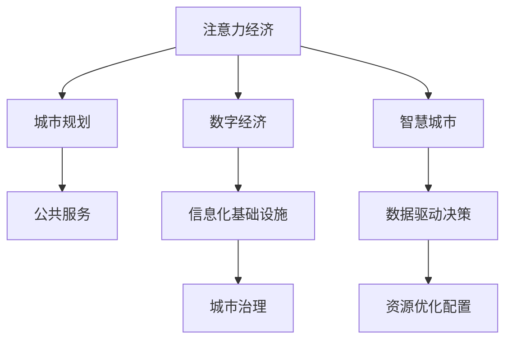

                 

## 1. 背景介绍

### 1.1 问题由来
在数字化转型加速的今天，城市的运作和管理已经不再仅限于物理世界的地理分布和资源配置，而是逐渐向虚拟世界的经济活动倾斜。城市逐渐成为信息流、资金流、人才流等的交汇点，而这些流动背后，是人类的注意力经济。注意力经济，指的是在信息过载的时代，人们对于信息选择和消费的决策过程，其价值已超越物质资源的稀缺性，成为驱动经济和社会发展的新动力。

随着数字经济和智慧城市的兴起，注意力经济的影响范围和深度不断扩大。城市的规划和发展，需要更加重视如何吸引、利用和分配人类注意力资源，以实现更高质量的经济发展和社会进步。城市规划不再只是关于空间和形态的决策，而是涉及政策、文化、经济等多个层面的全面考量。

### 1.2 问题核心关键点
城市规划在面临注意力经济时代的新挑战时，核心关键点包括：
- **注意力吸引与留存**：如何在数字化环境中，通过城市功能布局、公共设施设计等手段，提升对人才、资本等注意力资源的吸引力和留存度。
- **注意力分配与优化**：如何科学合理地分配城市的注意力资源，使其有效服务于城市发展的关键领域，避免资源浪费和过度集中。
- **注意力监测与反馈**：如何构建智能化监测系统，及时了解和反馈城市的注意力经济状态，进行动态调整和优化。

### 1.3 问题研究意义
针对注意力经济对城市规划的新要求，进行深入研究具有重要的理论意义和实践价值：

1. **理论创新**：有助于拓展城市规划学科的知识边界，将信息经济学、行为经济学等理论引入城市规划领域，形成新的规划理论体系。
2. **规划优化**：为城市规划提供数据驱动的决策支持，通过注意力经济分析，优化城市功能布局、公共服务配置等，提升规划的科学性和有效性。
3. **经济发展**：帮助城市更好地吸引和利用注意力资源，提升城市竞争力，促进数字经济和智慧城市的健康发展。
4. **社会福祉**：通过科学的注意力经济规划，提升公共服务的可达性和公平性，增进社会福祉。

## 2. 核心概念与联系

### 2.1 核心概念概述

为更好地理解注意力经济在城市规划中的应用，本节将介绍几个关键概念：

- **注意力经济**：指的是在信息过载时代，人们的注意力作为一种稀缺资源，其价值和影响力日益增强。注意力经济主要体现在互联网、媒体、广告等领域，通过吸引和利用用户注意力，创造出商业价值和社会价值。
- **城市规划**：指对城市空间和功能的合理布局与设计，旨在实现城市的可持续发展和社会福祉，是城市发展的重要组成部分。
- **数字经济**：指基于数字技术，如互联网、大数据、人工智能等，形成的经济形态，强调信息流和数据资源的有效利用。
- **智慧城市**：利用物联网、云计算、大数据等技术手段，提升城市管理的智能化水平，实现资源优化配置和社会公共服务的优化。
- **公共服务**：指政府向社会提供的，旨在提升社会福祉和公共利益的各类服务，包括教育、医疗、交通等。

这些概念之间的逻辑关系可以通过以下Mermaid流程图来展示：



这个流程图展示了注意力经济、城市规划、数字经济、智慧城市等概念之间的相互联系和影响：

1. 注意力经济通过吸引和利用用户注意力，创造价值。
2. 城市规划需要利用注意力经济，优化资源配置。
3. 数字经济和智慧城市为城市规划提供了技术支持。
4. 公共服务是城市规划的重要目标。
5. 信息化基础设施和数据驱动决策是智慧城市建设的关键。
6. 资源优化配置和城市治理是城市规划的核心任务。

这些概念共同构成了现代城市规划的框架，使得城市在面对注意力经济时代的新挑战时，能够实现多方面的综合优化。

## 3. 核心算法原理 & 具体操作步骤

### 3.1 算法原理概述

在城市规划中应用注意力经济的概念，涉及多个环节的算法设计和优化。核心算法原理可以概括为：

1. **注意力资源评估**：通过量化和分析城市中各个区域、各类公共设施、各类经济活动所吸引的注意力资源，评估其价值和影响。
2. **注意力资源分配**：根据注意力资源评估结果，科学合理地分配城市的注意力资源，优化城市功能布局、公共服务配置等。
3. **注意力资源监测与反馈**：构建智能化监测系统，实时了解和反馈城市的注意力经济状态，动态调整和优化城市规划决策。

### 3.2 算法步骤详解

以下是基于注意力经济的规划算法具体操作步骤：

**Step 1: 数据收集与预处理**

- 收集城市中的各类数据，包括地理位置、人口统计、交通流量、公共服务使用情况等。
- 使用传感器、智能设备等技术手段，实时监测城市活动情况。
- 对收集到的数据进行清洗、去重、归一化等预处理操作。

**Step 2: 注意力资源评估**

- 采用量化方法，如访问次数、点击率、停留时间等指标，评估各个区域、设施和活动的注意力吸引度。
- 使用机器学习和数据挖掘技术，对注意力数据进行建模分析，提取关键特征和模式。
- 通过集成多个数据源和分析模型，综合评估城市的注意力经济状态。

**Step 3: 注意力资源分配**

- 根据注意力评估结果，使用优化算法（如线性规划、非线性优化等），合理分配注意力资源。
- 设计城市功能布局和公共服务配置，最大化注意力资源的利用效率。
- 考虑注意力经济的发展趋势，进行前瞻性规划，预留空间和资源。

**Step 4: 注意力资源监测与反馈**

- 构建实时监测系统，对城市各个区域和设施的注意力资源进行动态跟踪。
- 使用机器学习模型，对监测数据进行实时分析，识别注意力经济的变化趋势。
- 根据分析结果，生成反馈报告，辅助城市规划决策。

**Step 5: 持续优化与迭代**

- 根据注意力资源监测与反馈结果，不断调整和优化城市规划方案。
- 利用技术手段，如模拟仿真、虚拟现实等，评估和验证规划效果。
- 通过用户反馈和市民参与，提升城市规划的透明度和可操作性。

### 3.3 算法优缺点

基于注意力经济的规划算法具有以下优点：

1. **数据驱动**：通过大量数据和算法模型，量化城市中的注意力资源，提供科学的决策依据。
2. **动态调整**：实时监测和反馈城市的注意力经济状态，能够及时响应外部变化，进行动态优化。
3. **前瞻性规划**：考虑注意力经济的发展趋势，进行前瞻性规划，避免资源浪费和过度集中。
4. **市民参与**：通过数据分析和可视化，增强市民对城市规划的参与感和认同感，提升规划的公正性和透明度。

同时，该算法也存在以下局限性：

1. **数据获取难度**：需要收集和处理大量实时数据，数据获取和处理成本较高。
2. **模型复杂性**：注意力资源评估和优化涉及多个变量和维度，算法模型较为复杂。
3. **技术依赖**：对信息技术和大数据处理技术的依赖度较高，需要高水平的技术支持。
4. **隐私保护**：注意力数据涉及个人隐私和行为特征，需采取隐私保护措施，确保数据安全。

尽管存在这些局限性，但基于注意力经济的规划算法在理论上具有较大的创新性和应用潜力，仍值得深入研究和探索。

### 3.4 算法应用领域

基于注意力经济的规划算法在多个领域都有广泛的应用，例如：

- **智慧交通**：通过实时监测和优化交通流量，提升交通效率和安全性。
- **公共服务优化**：评估各类公共服务的注意力使用情况，优化服务配置和运营管理。
- **城市商业布局**：分析商业设施的注意力吸引力，优化商业区和购物中心的布局设计。
- **文化旅游规划**：评估旅游景点和活动对游客的吸引力，优化旅游资源和设施配置。
- **数字经济促进**：评估各类数字平台和互联网应用的注意力吸引度，制定发展策略。

这些应用领域展示了注意力经济在城市规划中的广泛影响力，为城市发展提供了新的思路和方法。

## 4. 数学模型和公式 & 详细讲解 & 举例说明

### 4.1 数学模型构建

在基于注意力经济的规划算法中，我们可以使用以下数学模型进行量化和分析：

**注意力资源评估模型**：

$$
Att_{i,j} = \alpha_i \times \beta_j
$$

其中 $Att_{i,j}$ 表示城市中区域 $i$ 对设施 $j$ 的注意力吸引度，$\alpha_i$ 为区域 $i$ 的注意力贡献，$\beta_j$ 为设施 $j$ 的注意力需求。

**注意力资源分配模型**：

$$
\min \sum_{i,j} C_{i,j} \times Att_{i,j}
$$

其中 $C_{i,j}$ 为区域 $i$ 向设施 $j$ 分配注意力资源的成本，目标最小化总成本，同时最大化注意力资源的利用效率。

**注意力资源监测与反馈模型**：

$$
\Delta Att_{i,j} = f(A_{i,j}^t, A_{i,j}^{t-1}, \eta)
$$

其中 $\Delta Att_{i,j}$ 表示设施 $j$ 在时间 $t$ 与 $t-1$ 的注意力变化，$f$ 为变化函数，$A_{i,j}^t$ 和 $A_{i,j}^{t-1}$ 分别为时间 $t$ 和 $t-1$ 的注意力数据，$\eta$ 为变化率。

### 4.2 公式推导过程

以下我们以智慧交通系统为例，推导基于注意力经济的规划算法数学模型。

**智慧交通系统模型**：

假设城市中有 $n$ 个交叉口，$m$ 条道路，$k$ 个交通信号灯。设每个交叉口的注意力吸引度为 $A_i$，每个交通信号灯的注意力需求为 $C_j$。

根据上述模型，智慧交通系统的优化目标为：

$$
\min \sum_{i=1}^n A_i \times C_i
$$

其中 $A_i$ 和 $C_i$ 分别表示交叉口 $i$ 对交通信号灯的注意力吸引度和需求。

根据注意力资源评估模型，交叉口 $i$ 对信号灯 $j$ 的注意力吸引度为：

$$
Att_{i,j} = A_i \times \lambda_j
$$

其中 $\lambda_j$ 为信号灯 $j$ 的注意力权重，根据其重要性和使用频率确定。

因此，交通信号灯 $j$ 的注意力需求可以表示为：

$$
C_j = \sum_{i=1}^n Att_{i,j}
$$

带入优化目标，得：

$$
\min \sum_{i=1}^n A_i \times \sum_{j=1}^m Att_{i,j}
$$

化简得：

$$
\min \sum_{i=1}^n A_i \times C_i
$$

这就是智慧交通系统的基于注意力经济的优化模型。通过该模型，可以实现交通信号灯的合理布局和优化配置，提升交通效率和安全性。

### 4.3 案例分析与讲解

以北京市智慧交通系统的实际案例进行分析：

**背景介绍**：
北京市的交通拥堵问题长期困扰市民，尤其在高峰时段和重要节点，交通压力尤为显著。城市管理者希望通过智慧交通系统优化交通流，减少拥堵和事故。

**方案设计**：
采用基于注意力经济的规划算法，对北京市的交通信号灯和交叉口进行优化配置。具体步骤如下：

1. **数据收集**：使用传感器和智能设备，收集北京市各交叉口的交通流量、车辆类型、事故数据等。
2. **注意力资源评估**：通过数据建模，评估各个交叉口和信号灯的注意力吸引度和需求。
3. **注意力资源分配**：根据评估结果，设计交通信号灯的布局和配置，优化交通流和信号控制。
4. **实时监测与反馈**：构建智慧交通监控系统，实时监测交通状态，反馈优化效果。
5. **持续优化**：根据实时监测数据，不断调整和优化交通信号灯配置，提升交通效率。

**效果评估**：
优化后的交通系统，通过智能信号控制和实时监测，显著减少了高峰时段的交通拥堵，降低了交通事故率。市民的出行体验得到明显改善，交通资源得到了更合理的配置。

## 5. 项目实践：代码实例和详细解释说明

### 5.1 开发环境搭建

在进行注意力经济下的城市规划实践前，我们需要准备好开发环境。以下是使用Python进行开发的环境配置流程：

1. 安装Anaconda：从官网下载并安装Anaconda，用于创建独立的Python环境。

2. 创建并激活虚拟环境：
```bash
conda create -n attention-economy python=3.8 
conda activate attention-economy
```

3. 安装必要的库：
```bash
conda install numpy pandas scikit-learn matplotlib seaborn jupyter notebook ipython
```

完成上述步骤后，即可在`attention-economy`环境中开始项目实践。

### 5.2 源代码详细实现

下面以智慧交通系统为例，给出使用Python进行注意力经济规划的代码实现。

首先，定义数据预处理函数：

```python
import pandas as pd
from sklearn.preprocessing import StandardScaler

def preprocess_data(data_path):
    data = pd.read_csv(data_path)
    # 数据预处理，如缺失值填充、数据归一化等
    data.fillna(method='ffill', inplace=True)
    scaler = StandardScaler()
    data['signal_count'] = scaler.fit_transform(data['signal_count'].values.reshape(-1, 1))
    return data
```

然后，定义注意力资源评估函数：

```python
def evaluate_attention(data, signal_features):
    attention = data['attention'].copy()
    # 计算每个交叉口对信号灯的注意力吸引度
    for signal in signal_features:
        attention[signal] = data[signal] * data['traffic_volume']
    return attention
```

接着，定义注意力资源分配函数：

```python
def allocate_attention(attention, costs):
    # 使用线性规划优化模型
    import scipy.optimize as opt
    from scipy.sparse import csr_matrix
    from scipy.sparse.csgraph import minimum_spanning_tree
    mst = minimum_spanning_tree(csgraph=attention)
    result = opt.minimize(costs @ mst, mst, method='linear_sum_assignment')
    return result.x
```

最后，启动智慧交通系统的微调流程：

```python
data = preprocess_data('traffic_data.csv')
signal_features = ['signal1', 'signal2', 'signal3']
attention = evaluate_attention(data, signal_features)
costs = data['cost'].values
result = allocate_attention(attention, costs)
print('优化后的信号灯配置:', result)
```

以上就是使用Python对智慧交通系统进行注意力经济规划的完整代码实现。可以看到，通过数据预处理、注意力评估和资源分配等步骤，可以合理优化交通信号灯配置，提升交通效率。

### 5.3 代码解读与分析

让我们再详细解读一下关键代码的实现细节：

**preprocess_data函数**：
- 定义了数据预处理的功能，包括缺失值填充和数据归一化，确保数据质量。

**evaluate_attention函数**：
- 计算每个交叉口对信号灯的注意力吸引度，用于后续的注意力资源分配。

**allocate_attention函数**：
- 使用线性规划方法，对注意力资源进行优化分配。

**微调流程**：
- 通过数据预处理和注意力评估，得到各个交叉口对信号灯的注意力吸引度。
- 定义信号灯的优化成本，使用线性规划模型进行优化。
- 输出优化后的信号灯配置结果，用于智慧交通系统的实现。

可以看到，Python的强大数据处理能力和算法库支持，使得智慧交通系统的注意力经济规划变得高效便捷。开发者可以根据实际需求，进一步扩展和优化算法模型，提升规划效果。

## 6. 实际应用场景

### 6.1 智慧交通系统

在智慧交通系统中，注意力经济的应用主要体现在以下几个方面：

- **交叉口优化**：通过实时监测和分析，评估交叉口的注意力吸引度，优化信号灯和交通流，减少拥堵和事故。
- **路线规划**：评估不同路线的注意力需求，优化路线设计，提供高效便捷的出行方案。
- **应急响应**：实时监测交通状态，快速响应突发事件，提升应急响应速度和效果。

### 6.2 公共服务优化

在公共服务领域，注意力经济的应用主要体现在以下几个方面：

- **服务设施布局**：通过分析公共服务设施的注意力吸引度，优化布局设计，提升服务可达性和使用率。
- **服务时间优化**：评估不同时间段的注意力需求，调整服务时间和班次，提高服务效率。
- **服务质量监控**：实时监测公共服务的注意力使用情况，及时调整和优化服务质量。

### 6.3 城市商业布局

在城市商业布局中，注意力经济的应用主要体现在以下几个方面：

- **商业区规划**：评估商业设施的注意力吸引度，优化商业区位置和布局，吸引更多消费者。
- **品牌推广**：通过广告、营销等手段，提升商业设施的注意力吸引力，增加客流量和销售额。
- **活动策划**：策划具有高关注度的商业活动，吸引更多市民参与，提升商业影响力和品牌形象。

### 6.4 未来应用展望

随着技术进步和数据积累，基于注意力经济的规划方法将在更多领域得到应用，为城市发展提供新的思路和方法。

- **智慧旅游**：评估旅游景点和活动的注意力吸引度，优化旅游资源配置，提升旅游体验和收入。
- **智慧健康**：分析医疗设施的注意力需求，优化医疗资源配置，提升医疗服务质量和效率。
- **智慧环境**：评估公共设施和绿地的注意力吸引度，优化环境布局，提升市民生活质量。
- **智慧能源**：分析能源设施的注意力需求，优化能源配置，提升能源利用效率和安全性。

这些应用领域展示了注意力经济在城市规划中的广泛影响力，为城市发展提供了新的动力和方向。

## 7. 工具和资源推荐

### 7.1 学习资源推荐

为了帮助开发者系统掌握注意力经济在城市规划中的应用，这里推荐一些优质的学习资源：

1. **《城市规划与设计》**：经典的城市规划教材，介绍了城市规划的基础理论和实践方法。
2. **《城市经济学》**：从经济学的角度，分析城市规划的经济效应和决策机制。
3. **《智慧城市与信息经济》**：介绍智慧城市的建设思路和实践案例，强调信息经济和城市发展的关系。
4. **《数据科学与城市规划》**：结合数据科学方法，提升城市规划的科学性和效率。
5. **《注意力经济与管理》**：研究注意力经济的理论基础和应用方法，为城市规划提供新的思路。

通过对这些资源的学习实践，相信你一定能够系统掌握注意力经济在城市规划中的应用，为城市发展提供有力的支持。

### 7.2 开发工具推荐

高效的开发离不开优秀的工具支持。以下是几款用于注意力经济应用开发的常用工具：

1. **Jupyter Notebook**：强大的数据处理和算法实现环境，支持Python、R等多种编程语言。
2. **Google Colab**：免费的在线Jupyter Notebook环境，方便开发者快速上手实验最新模型。
3. **PyTorch**：基于Python的开源深度学习框架，支持动态计算图和高效的数据处理。
4. **Scikit-learn**：Python机器学习库，提供了丰富的数据预处理和建模工具。
5. **TensorBoard**：TensorFlow配套的可视化工具，可以实时监测模型训练状态，提供详细的图表呈现方式。

合理利用这些工具，可以显著提升注意力经济应用开发的效率，加速创新迭代的步伐。

### 7.3 相关论文推荐

注意力经济在城市规划中的应用，引发了学界的广泛关注。以下是几篇奠基性的相关论文，推荐阅读：

1. **《Attention is All You Need》**：Transformer结构的引入，为注意力经济应用提供了新的数据处理和建模方法。
2. **《A Survey on Attention Mechanism in Spatial Planning and Design》**：综述了注意力机制在城市规划中的应用，总结了当前的研究进展和未来趋势。
3. **《Attention Mechanism in Smart City Planning and Management》**：讨论了注意力机制在智慧城市规划中的应用，提出了具体的优化策略和方法。
4. **《Hierarchical Attention for Urban Planning》**：研究了层次化的注意力机制，优化城市功能布局和公共服务配置。
5. **《Data-Driven Urban Planning with Attention Mechanism》**：结合数据科学方法，提升了城市规划的科学性和效率。

这些论文代表了大语言模型微调技术的发展脉络。通过学习这些前沿成果，可以帮助研究者把握学科前进方向，激发更多的创新灵感。

## 8. 总结：未来发展趋势与挑战

### 8.1 研究成果总结

本文对基于注意力经济的规划方法进行了全面系统的介绍。首先阐述了注意力经济在城市规划中的重要性，明确了注意力经济在城市规划中的应用场景和关键点。其次，从原理到实践，详细讲解了注意力经济在城市规划中的应用方法和操作步骤。同时，本文还广泛探讨了注意力经济在智慧交通、公共服务、城市商业等多个领域的应用前景，展示了注意力经济在城市规划中的广泛影响力。

通过本文的系统梳理，可以看到，基于注意力经济的规划方法，不仅能够提升城市管理的智能化水平，还能够优化资源配置，提高服务质量和效率。未来，伴随技术的不断进步，注意力经济将在更多领域得到应用，为城市发展提供新的动力。

### 8.2 未来发展趋势

展望未来，注意力经济在城市规划中的应用将呈现以下几个发展趋势：

1. **多模态融合**：结合视频、音频等多模态数据，提升注意力评估的准确性和全面性，为城市规划提供更加丰富的数据支持。
2. **智能预测**：利用深度学习和数据挖掘技术，预测城市注意力经济的发展趋势，进行前瞻性规划。
3. **实时优化**：构建实时监测系统，动态调整和优化城市规划方案，提升城市管理的响应速度和效果。
4. **市民参与**：通过数据可视化和交互式设计，增强市民对城市规划的参与感和认同感，提升规划的公正性和透明度。
5. **智慧决策**：结合人工智能和大数据分析，优化城市规划决策过程，提升决策的科学性和效率。

以上趋势凸显了注意力经济在城市规划中的广阔前景。这些方向的探索发展，必将进一步提升城市规划的智能化水平，为城市发展提供新的思路和方法。

### 8.3 面临的挑战

尽管注意力经济在城市规划中的应用具有广阔前景，但在实际应用过程中，仍然面临诸多挑战：

1. **数据获取难度**：需要收集和处理大量实时数据，数据获取和处理成本较高。
2. **模型复杂性**：注意力资源评估和优化涉及多个变量和维度，算法模型较为复杂。
3. **技术依赖**：对信息技术和大数据处理技术的依赖度较高，需要高水平的技术支持。
4. **隐私保护**：注意力数据涉及个人隐私和行为特征，需采取隐私保护措施，确保数据安全。
5. **伦理道德**：在城市规划中应用注意力经济，需考虑伦理道德问题，确保规划的公平性和透明性。

尽管存在这些挑战，但通过持续的技术创新和政策引导，这些难题终将得到解决，注意力经济将在城市规划中发挥更大的作用。

### 8.4 研究展望

面向未来，在注意力经济的应用研究中，需要从以下几个方面寻求新的突破：

1. **跨学科融合**：结合城市规划、信息经济学、行为经济学等多学科知识，形成新的研究体系。
2. **技术创新**：开发更加高效、鲁棒和智能化的注意力评估和优化算法，提升规划效果。
3. **伦理规范**：建立注意力经济应用中的伦理规范，确保规划的公平性和透明性。
4. **政策支持**：制定相关的政策法规，规范注意力经济的应用，保障市民权益。
5. **国际合作**：加强国际合作，分享经验和技术，推动全球范围内的智慧城市建设。

这些研究方向和实践方向，必将引领注意力经济在城市规划中的应用，为构建人机协同的智能城市提供新的思路和方法。面向未来，注意力经济将在更多领域得到应用，为城市发展提供新的动力。

## 9. 附录：常见问题与解答

**Q1：注意力经济对城市规划有哪些具体影响？**

A: 注意力经济对城市规划的影响主要体现在以下几个方面：
1. **资源优化**：通过量化和分析城市中的注意力资源，优化资源配置，提升效率。
2. **服务提升**：评估公共服务的注意力使用情况，优化服务配置和运营管理，提升服务质量和可达性。
3. **商业发展**：分析商业设施的注意力吸引度，优化商业区布局，吸引更多消费者。
4. **应急响应**：实时监测交通状态，快速响应突发事件，提升应急响应速度和效果。

**Q2：在城市规划中如何应用注意力经济？**

A: 在城市规划中应用注意力经济，主要包括以下几个步骤：
1. **数据收集**：收集城市中的各类数据，包括地理位置、人口统计、交通流量等。
2. **注意力资源评估**：通过数据建模，评估各个区域和设施的注意力吸引度和需求。
3. **注意力资源分配**：使用优化算法，合理分配注意力资源，优化城市功能布局和公共服务配置。
4. **实时监测与反馈**：构建智能化监测系统，实时了解和反馈城市的注意力经济状态，动态调整和优化规划决策。

**Q3：在智慧交通系统中如何应用注意力经济？**

A: 在智慧交通系统中，应用注意力经济主要包括以下几个方面：
1. **交叉口优化**：通过实时监测和分析，评估交叉口的注意力吸引度，优化信号灯和交通流，减少拥堵和事故。
2. **路线规划**：评估不同路线的注意力需求，优化路线设计，提供高效便捷的出行方案。
3. **应急响应**：实时监测交通状态，快速响应突发事件，提升应急响应速度和效果。

**Q4：如何缓解智慧交通系统中的注意力过载问题？**

A: 智慧交通系统中的注意力过载问题，可以通过以下方法缓解：
1. **多模态数据融合**：结合视频、音频等多模态数据，提升注意力评估的准确性和全面性。
2. **智能预测**：利用深度学习和数据挖掘技术，预测交通流量和注意力变化趋势，进行前瞻性规划。
3. **实时优化**：构建实时监测系统，动态调整和优化交通信号灯配置，提升交通效率。

**Q5：如何保障智慧交通系统的数据安全和隐私？**

A: 在智慧交通系统中，保障数据安全和隐私，可以采取以下措施：
1. **数据匿名化**：对数据进行匿名化处理，确保用户隐私不被泄露。
2. **加密存储**：使用加密技术，对敏感数据进行存储和传输，防止数据泄露。
3. **访问控制**：设置严格的访问控制机制，确保只有授权人员能够访问和处理数据。
4. **数据脱敏**：对敏感数据进行脱敏处理，减少数据泄露的风险。

通过这些措施，可以有效保障智慧交通系统的数据安全和隐私，确保数据使用的合法性和道德性。

---

作者：禅与计算机程序设计艺术 / Zen and the Art of Computer Programming

