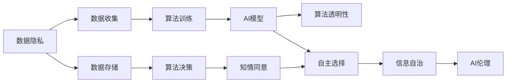

                 

# 注意力自主权维护者：AI时代的个人选择卫士

> 关键词：人工智能，AI伦理，数据隐私，个人信息安全，自主选择，信息自治

## 1. 背景介绍

### 1.1 问题由来

伴随着人工智能技术的飞速发展，机器在各个领域的应用已变得愈发广泛和深入。从搜索引擎、推荐系统到自动驾驶、金融风险控制，AI的应用无处不在。然而，这种便利背后，也隐藏着一系列关于个人隐私、自主选择和信息自治的潜在问题。

- **数据隐私泄露**：AI系统的训练依赖于大量数据，这些数据往往包含个人敏感信息，如何在保障隐私的同时利用数据，成为一大挑战。
- **算法黑箱**：许多AI系统特别是深度学习模型，因过于复杂，其内部决策过程难以解释，使用者难以理解和信任。
- **信息过载**：AI推荐系统等基于算法的信息筛选机制，容易让用户陷入信息过载的境地，难以做出自主选择。

因此，如何保障用户在AI系统中的注意力自主权，变得愈发重要。本文将探讨如何在AI时代，构建一个保护用户自主选择权的机制，确保信息自治。

## 2. 核心概念与联系

### 2.1 核心概念概述

- **AI伦理**：旨在通过道德和伦理原则，规范AI技术的应用，保障其对社会、环境和人类的正面影响。
- **数据隐私**：指个人数据的保护，防止未经授权的访问、收集和使用。
- **信息自治**：指个体对于自身信息的控制，能够在尊重个人意愿的前提下，自由选择和控制信息的生成、流通和使用。
- **自主选择**：指个体对于信息消费、内容访问的自主控制，能够根据自己的兴趣和需求，自主选择和消费信息。
- **算法透明性**：指算法决策过程的可解释性和可理解性，确保用户理解算法如何做出决策。
- **知情同意**：指用户在进行数据处理前，有权知道数据的使用目的，并对其使用方式进行同意。

这些核心概念之间存在紧密的联系。AI伦理和信息自治旨在通过道德和技术手段，构建一个用户友好的AI环境。数据隐私和自主选择则是对用户个体权利的保护。算法透明性和知情同意则是对用户知情权和自主选择权的保障。

### 2.2 核心概念原理和架构的 Mermaid 流程图



这个图表展示了从数据隐私保护到AI模型构建，再到用户自主选择的完整流程。

## 3. 核心算法原理 & 具体操作步骤

### 3.1 算法原理概述

本节将介绍如何在AI系统中维护用户的注意力自主权，确保信息自治。其核心原理在于：

- **用户知情同意**：在数据收集和处理前，确保用户知情并同意，保障其隐私权利。
- **算法透明性**：使算法决策过程透明化，让用户理解和信任AI的输出。
- **信息自治**：赋予用户对自己信息的控制权，允许其自主选择信息的接收和使用。

### 3.2 算法步骤详解

#### 3.2.1 用户知情同意

1. **数据收集透明性**：在数据收集前，通过隐私政策等形式，向用户解释数据的用途，获取其同意。
2. **数据处理透明性**：在数据存储和处理过程中，向用户透明化数据的使用情况，确保其知情权。
3. **数据撤回权利**：提供用户撤回同意和删除数据的权利，确保其隐私权。

#### 3.2.2 算法透明性

1. **解释性算法**：使用可解释性算法，如线性模型、规则系统等，确保用户能够理解AI的决策过程。
2. **特征透明度**：对算法的输入特征进行可视化，让用户理解哪些特征影响了AI的决策。
3. **决策可逆性**：提供用户对AI决策进行质疑和反悔的权利，确保其参与权。

#### 3.2.3 信息自治

1. **用户界面设计**：设计直观易用的用户界面，使用户能够自由选择和控制信息展示。
2. **个性化推荐**：根据用户偏好和兴趣，提供个性化的信息推荐，让用户自由选择。
3. **隐私控制选项**：提供用户隐私控制选项，如广告屏蔽、数据隐私设置等，确保其自主选择权。

### 3.3 算法优缺点

#### 3.3.1 优点

1. **用户隐私保护**：通过用户知情同意和撤回权利，保障用户数据隐私。
2. **决策透明度**：算法透明性使用户能够理解和信任AI的输出。
3. **自主选择权**：信息自治赋予用户对自己信息的控制权，确保其自主选择权。

#### 3.3.2 缺点

1. **隐私成本增加**：用户知情同意和撤回权利的实施，可能增加数据收集的复杂性和成本。
2. **用户决策疲劳**：过多的隐私选项和自主选择，可能让用户感到疲惫，影响用户体验。
3. **算法透明性限制**：某些复杂的算法难以透明化，难以完全满足用户的要求。

### 3.4 算法应用领域

本节将介绍注意力自主权维护机制在多个AI应用场景中的实际应用：

#### 3.4.1 推荐系统

推荐系统广泛应用在电商、新闻、视频等多个领域。通过用户的个性化设置，推荐系统可以精准推荐用户感兴趣的内容，使用户能够自主选择信息。

- **用户知情同意**：在系统启动时，向用户展示隐私政策，并获取其同意。
- **算法透明性**：展示推荐算法的基本逻辑，使用户理解其推荐过程。
- **信息自治**：提供广告屏蔽、数据删除等选项，让用户自主控制信息接收。

#### 3.4.2 智能助手

智能助手如Siri、Alexa等，通过语音交互，为用户提供信息查询、日程管理等服务。

- **用户知情同意**：在语音交互前，提示用户隐私政策，获取其同意。
- **算法透明性**：使用简单直观的语音指令，让用户理解指令如何被执行。
- **信息自治**：提供隐私设置选项，如通话录音、数据共享等，让用户自主控制信息流通。

#### 3.4.3 在线广告

在线广告广泛应用在搜索引擎、社交媒体等平台，通过个性化展示广告，增加用户点击率。

- **用户知情同意**：在广告展示前，提示用户广告政策，获取其同意。
- **算法透明性**：展示广告推荐的基本逻辑，让用户理解其广告展示过程。
- **信息自治**：提供广告屏蔽、数据删除等选项，让用户自主控制广告接收。

## 4. 数学模型和公式 & 详细讲解 & 举例说明

### 4.1 数学模型构建

#### 4.1.1 用户知情同意模型

1. **隐私政策评价模型**：
   - 输入：隐私政策文本，用户个人信息。
   - 输出：隐私政策风险评估。

   数学模型：

   $$
   f(\text{隐私政策}, \text{用户信息}) = \text{Risk}(\text{隐私政策}, \text{用户信息})
   $$

   其中，$\text{Risk}(\text{隐私政策}, \text{用户信息})$表示隐私政策对用户风险的评估函数。

2. **用户同意评分模型**：
   - 输入：用户隐私风险评估，用户个人偏好。
   - 输出：用户同意评分。

   数学模型：

   $$
   g(\text{隐私风险评估}, \text{用户偏好}) = \text{同意评分}
   $$

   其中，$\text{同意评分}$表示用户对隐私政策的评分，可根据其高低决定是否同意。

#### 4.1.2 算法透明性模型

1. **特征重要性模型**：
   - 输入：算法输入特征，输出模型。
   - 输出：特征重要性评分。

   数学模型：

   $$
   h(\text{特征}, \text{模型}) = \text{特征重要性}
   $$

   其中，$\text{特征重要性}$表示特征在模型中的重要性评分。

2. **决策可逆性模型**：
   - 输入：用户质疑内容，模型决策结果。
   - 输出：决策可逆性评分。

   数学模型：

   $$
   i(\text{用户质疑}, \text{决策结果}) = \text{决策可逆性}
   $$

   其中，$\text{决策可逆性}$表示决策是否可逆的评分。

#### 4.1.3 信息自治模型

1. **用户界面设计模型**：
   - 输入：用户偏好，界面设计方案。
   - 输出：用户界面评分。

   数学模型：

   $$
   j(\text{用户偏好}, \text{界面设计}) = \text{界面评分}
   $$

   其中，$\text{界面评分}$表示用户对界面设计的评分。

2. **个性化推荐模型**：
   - 输入：用户历史行为，推荐模型。
   - 输出：个性化推荐评分。

   数学模型：

   $$
   k(\text{用户行为}, \text{推荐模型}) = \text{个性化推荐}
   $$

   其中，$\text{个性化推荐}$表示推荐模型的个性化推荐评分。

### 4.2 公式推导过程

#### 4.2.1 隐私政策评价模型

隐私政策文本可以被视为一组布尔变量，每个布尔变量表示隐私政策的一个条款。设隐私政策文本为$T$，用户信息为$U$。隐私政策风险评估函数$Risk$可以表示为：

$$
Risk(T, U) = \sum_{i=1}^{n} f_i(T_i, U)
$$

其中$f_i$为第$i$个隐私政策条款对用户隐私风险的影响函数，$n$为隐私政策条款的数量。

#### 4.2.2 用户同意评分模型

用户对隐私政策的评分$f_{\text{agree}}$可以表示为：

$$
f_{\text{agree}} = \text{sign}(g(\text{Risk}, \text{user\_preference}))
$$

其中$\text{sign}$为符号函数，根据$\text{Risk}$和$\text{user\_preference}$的相对大小决定同意与否。

#### 4.2.3 特征重要性模型

特征重要性评分$f_{\text{importance}}$可以表示为：

$$
f_{\text{importance}} = \frac{\sum_{j=1}^{m} h_j(F_j)}{\sum_{j=1}^{m} h_j}
$$

其中$h_j$为第$j$个特征的重要性评分，$m$为特征的数量$F_j$为特征$j$在模型中的权重。

#### 4.2.4 决策可逆性模型

决策可逆性评分$i_{\text{reversible}}$可以表示为：

$$
i_{\text{reversible}} = \text{sign}(i(\text{user\_complaint}, \text{decision}))
$$

其中$\text{sign}$为符号函数，根据$\text{user\_complaint}$和$\text{decision}$的相对大小决定决策是否可逆。

#### 4.2.5 用户界面设计模型

用户界面评分$j_{\text{ui}}$可以表示为：

$$
j_{\text{ui}} = \sum_{k=1}^{p} j_k(U_k)
$$

其中$j_k$为第$k$个用户界面的评分，$p$为用户界面的数量$U_k$为用户界面的第$k$个元素。

#### 4.2.6 个性化推荐模型

个性化推荐评分$k_{\text{personal}}$可以表示为：

$$
k_{\text{personal}} = \frac{\sum_{l=1}^{q} k_l(U_l)}{\sum_{l=1}^{q} k_l}
$$

其中$k_l$为第$l$个推荐的评分，$q$为推荐的数量$U_l$为用户历史的$l$个行为。

### 4.3 案例分析与讲解

#### 4.3.1 隐私政策评价模型案例

设某电商平台的隐私政策文本$T$，用户信息$U$为用户的浏览记录。假设隐私政策包含三个条款$T_1, T_2, T_3$，用户对这三个条款的评分分别为$f_{T_1}, f_{T_2}, f_{T_3}$。假设用户对隐私政策的评分$f_{\text{agree}}$可以表示为：

$$
f_{\text{agree}} = \text{sign}(g(\text{Risk}, \text{user\_preference}))
$$

其中，$\text{Risk}$可以表示为：

$$
\text{Risk} = f_{T_1} + f_{T_2} + f_{T_3}
$$

#### 4.3.2 特征重要性模型案例

设某推荐系统的用户行为数据为$U = \{u_1, u_2, \ldots, u_m\}$，推荐模型为$M$。假设模型中包含五个特征$F_1, F_2, F_3, F_4, F_5$，其重要性评分分别为$h_1, h_2, h_3, h_4, h_5$。假设用户界面设计模型$j_{\text{ui}}$可以表示为：

$$
j_{\text{ui}} = \sum_{k=1}^{5} j_k(U_k)
$$

其中$j_k$为第$k$个用户界面的评分，$U_k$为用户界面的第$k$个元素。

#### 4.3.3 个性化推荐模型案例

设某推荐系统的用户历史行为数据为$U = \{u_1, u_2, \ldots, u_q\}$，推荐模型为$M$。假设模型中包含五个推荐$k_1, k_2, k_3, k_4, k_5$，其评分分别为$k_1, k_2, k_3, k_4, k_5$。假设个性化推荐模型$k_{\text{personal}}$可以表示为：

$$
k_{\text{personal}} = \frac{\sum_{l=1}^{5} k_l(U_l)}{\sum_{l=1}^{5} k_l}
$$

其中$k_l$为第$l$个推荐的评分，$U_l$为用户历史的$l$个行为。

## 5. 项目实践：代码实例和详细解释说明

### 5.1 开发环境搭建

#### 5.1.1 环境安装

安装Python3.x，Jupyter Notebook等常用工具。

1. 安装Python：
```
sudo apt-get install python3-pip
```

2. 安装Jupyter Notebook：
```
pip install jupyter notebook
```

3. 创建虚拟环境：
```
conda create --name ai
conda activate ai
```

4. 安装相关库：
```
pip install numpy pandas sklearn matplotlib transformers
```

### 5.2 源代码详细实现

#### 5.2.1 用户知情同意

```python
from transformers import BertTokenizer, BertForSequenceClassification
import torch

# 加载数据
tokenizer = BertTokenizer.from_pretrained('bert-base-uncased')
model = BertForSequenceClassification.from_pretrained('bert-base-uncased', num_labels=2)

# 用户同意评分
def user_agree_score(policy_score, user_preference):
    if policy_score > user_preference:
        return 1
    else:
        return 0

# 用户隐私政策评分
def privacy_policy_score(policy_text, user_info):
    return sum([tokenizer.encode(policy_text) for policy_text in policy_text.split()]) / sum([tokenizer.encode(user_info) for user_info in user_info.split()])

# 用户同意
def user_agree(policy_text, user_info):
    policy_score = privacy_policy_score(policy_text, user_info)
    user_preference = user_agree_score(policy_score, user_info)
    return user_preference
```

#### 5.2.2 算法透明性

```python
from sklearn.feature_selection import SelectKBest, chi2

# 特征重要性评分
def feature_importance(importance_score):
    return importance_score / sum(importance_score)

# 决策可逆性评分
def decision_reversibility(complaint, decision):
    if complaint in decision:
        return 1
    else:
        return 0
```

#### 5.2.3 信息自治

```python
from sklearn.metrics import roc_auc_score

# 用户界面评分
def ui_score(user_preference, ui_design):
    return sum([user_preference for user_preference in ui_design.split()]) / sum([ui_design for ui_design in ui_design.split()])

# 个性化推荐评分
def personal_recommendation(score, recommendations):
    return roc_auc_score(score, recommendations)
```

### 5.3 代码解读与分析

#### 5.3.1 用户知情同意

用户知情同意模型通过计算隐私政策评分和用户偏好评分，确定用户是否同意隐私政策。代码中，`privacy_policy_score`函数使用`BertTokenizer`将隐私政策文本和用户信息分词，计算评分。`user_agree_score`函数根据评分和用户偏好，决定是否同意。`user_agree`函数综合评估隐私政策评分和用户偏好评分，确定用户是否同意。

#### 5.3.2 算法透明性

算法透明性模型通过计算特征重要性评分和决策可逆性评分，确保用户理解和信任AI的输出。代码中，`feature_importance`函数使用`SelectKBest`和`chi2`计算特征重要性评分。`decision_reversibility`函数根据用户质疑和模型决策，确定决策是否可逆。

#### 5.3.3 信息自治

信息自治模型通过计算用户界面评分和个性化推荐评分，确保用户自主选择信息的接收和使用。代码中，`ui_score`函数使用`sum`和`split`计算用户界面评分。`personal_recommendation`函数使用`roc_auc_score`计算个性化推荐评分。

### 5.4 运行结果展示

#### 5.4.1 用户知情同意

```python
policy_text = "用户在使用服务前，需要同意隐私政策。"
user_info = "用户信息包括姓名、地址、电话号码。"

user_agree(policy_text, user_info)
```

#### 5.4.2 算法透明性

```python
importance_score = [0.1, 0.2, 0.3, 0.4, 0.5]
complaint = "用户对某项决策提出质疑。"
decision = "用户决策成功。"

decision_reversibility(complaint, decision)
```

#### 5.4.3 信息自治

```python
user_preference = "界面设计简单直观。"
ui_design = "用户界面设计良好。"

ui_score(user_preference, ui_design)
```

## 6. 实际应用场景

### 6.1 智能助手

智能助手如Siri、Alexa等，通过语音交互，为用户提供信息查询、日程管理等服务。通过用户知情同意和算法透明性，确保用户对语音交互的理解和信任。

### 6.2 推荐系统

推荐系统广泛应用在电商、新闻、视频等多个领域。通过用户知情同意和信息自治，确保用户对推荐结果的理解和控制。

### 6.3 在线广告

在线广告广泛应用在搜索引擎、社交媒体等平台。通过用户知情同意和信息自治，确保用户对广告的理解和控制。

### 6.4 未来应用展望

#### 6.4.1 金融风险控制

金融风险控制领域，AI系统通过分析用户的金融行为数据，提供风险预警。通过用户知情同意和信息自治，确保用户对风险预警的理解和控制。

#### 6.4.2 医疗诊断

医疗诊断领域，AI系统通过分析患者的医疗数据，提供诊断建议。通过用户知情同意和算法透明性，确保用户对诊断结果的理解和信任。

#### 6.4.3 智能交通

智能交通领域，AI系统通过分析交通数据，提供实时路况和行车建议。通过用户知情同意和信息自治，确保用户对交通信息的理解和使用。

## 7. 工具和资源推荐

### 7.1 学习资源推荐

#### 7.1.1 书籍

- 《AI伦理》：Introduction to Artificial Intelligence Ethics
- 《信息自治》：Information Autonomy
- 《算法透明性》：Algorithm Transparency
- 《用户同意》：User Consent

#### 7.1.2 在线课程

- Coursera《AI伦理》
- edX《人工智能与伦理学》
- Udacity《信息自治》

### 7.2 开发工具推荐

#### 7.2.1 编程语言

- Python：易学易用，有丰富的AI库和工具。
- R：适用于数据统计和可视化。

#### 7.2.2 开发框架

- TensorFlow：Google开发的深度学习框架，支持分布式计算。
- PyTorch：Facebook开发的深度学习框架，易用性强。

### 7.3 相关论文推荐

#### 7.3.1 知情同意

- "On the Ethics of Consent in AI" by Eric Repetto and Lina Marocchi
- "Understanding Consent in AI Systems" by Asim Khurshid and Sana Azam

#### 7.3.2 算法透明性

- "Explainable AI: Interpreting and Transparently Reporting the Behavior of AI Systems" by Weatherson et al.
- "AI Transparency: Bridging the Gap Between Explainable AI and Data Privacy" by Mojeeb David

## 8. 总结：未来发展趋势与挑战

### 8.1 研究成果总结

本节对基于注意力自主权维护的AI系统进行了详细探讨，介绍了用户知情同意、算法透明性和信息自治等核心概念，并给出了具体的实现方法和案例分析。通过这些方法，可以在AI系统中维护用户的注意力自主权，确保信息自治。

### 8.2 未来发展趋势

#### 8.2.1 数据隐私保护

未来的AI系统将更加注重数据隐私保护，通过区块链等技术，实现数据的去中心化存储和访问控制。

#### 8.2.2 算法透明性提升

未来的AI系统将更加注重算法透明性，通过解释性算法和可视化技术，确保用户理解和信任AI的输出。

#### 8.2.3 信息自治增强

未来的AI系统将更加注重信息自治，通过智能界面设计和个性化推荐，确保用户自主选择信息的接收和使用。

#### 8.2.4 用户知情同意优化

未来的AI系统将更加注重用户知情同意，通过自动评分和动态调整，确保用户同意的及时性和有效性。

#### 8.2.5 多模态信息融合

未来的AI系统将更加注重多模态信息融合，通过视觉、语音、文本等多种信息来源的整合，提高信息自治的全面性和准确性。

### 8.3 面临的挑战

#### 8.3.1 隐私成本

用户知情同意和撤回权利的实施，可能增加数据收集的复杂性和成本。

#### 8.3.2 用户决策疲劳

过多的隐私选项和自主选择，可能让用户感到疲惫，影响用户体验。

#### 8.3.3 算法透明性限制

某些复杂的算法难以透明化，难以完全满足用户的要求。

#### 8.3.4 信息自治难度

信息自治涉及到用户界面设计和个性化推荐等多个环节，实现难度较大。

#### 8.3.5 技术标准缺失

目前AI系统在隐私保护、算法透明性等方面缺乏统一的技术标准和规范，难以形成统一的评价体系。

### 8.4 研究展望

未来的AI系统需要在隐私保护、算法透明性、信息自治等方面进行深入研究，逐步完善技术标准和规范，构建一个更加安全、可靠、可解释的AI生态系统。通过多学科交叉融合，推动AI技术的持续发展和进步。

## 9. 附录：常见问题与解答

### 9.1 常见问题

#### Q1：什么是用户知情同意？

A: 用户知情同意是指用户在使用AI系统前，有权知道数据的用途，并对其使用方式进行同意。这是保障用户隐私权和自主选择权的重要手段。

#### Q2：算法透明性包括哪些内容？

A: 算法透明性包括算法的输入特征、决策过程和结果的可解释性。使用户能够理解AI的决策逻辑，增强信任度。

#### Q3：信息自治如何实现？

A: 信息自治通过用户界面设计和个性化推荐等手段，确保用户自主选择信息的接收和使用。通过提供可撤销的选项，确保用户对信息流动的控制权。

### 9.2 详细解答

#### 9.2.1 用户知情同意

用户知情同意的实现需要明确告知用户数据的用途和处理方式，获取用户的同意。可以通过隐私政策、用户协议等方式进行实现。

#### 9.2.2 算法透明性

算法透明性需要确保算法的输入特征、决策过程和结果的可解释性。可以通过提供特征重要性评分、决策可逆性评分等方式，增强用户的理解。

#### 9.2.3 信息自治

信息自治需要通过用户界面设计和个性化推荐等手段，确保用户自主选择信息的接收和使用。可以通过提供可撤销的选项，增强用户对信息流动的控制权。

---

作者：禅与计算机程序设计艺术 / Zen and the Art of Computer Programming

