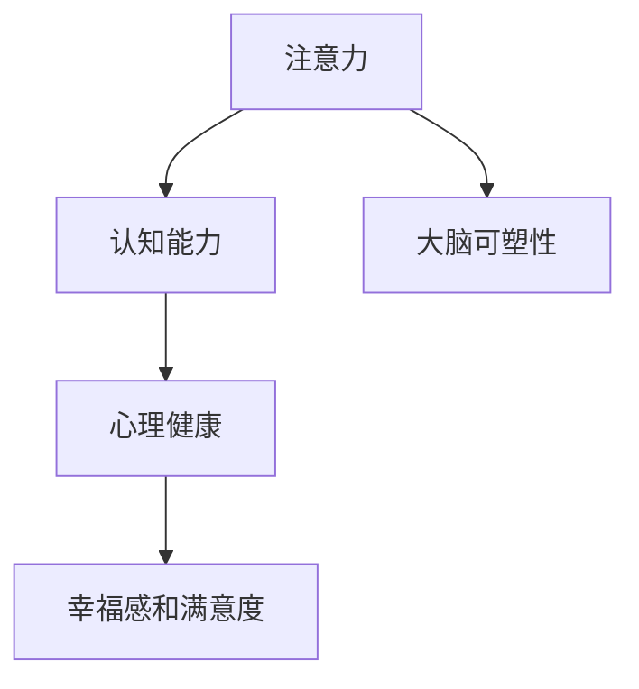

                 

# 注意力训练与大脑健康改善：通过专注力增强认知能力和幸福感

## 1. 背景介绍

### 1.1 问题由来
现代生活节奏加快，工作压力增大，许多人面临着注意力分散、记忆力衰退、焦虑抑郁等大脑健康问题。这些问题不仅影响个人生活质量，还可能导致职业倦怠、学习困难、情感障碍等更深层次的困扰。为应对这些挑战，人们开始寻求各种提升大脑功能和改善心理健康的解决方案，其中包括注意力训练和大脑健康改善技术。

### 1.2 问题核心关键点
注意力训练是一种通过有意识地练习和提升注意力集中的方法，旨在增强认知能力、改善心理状态。其核心在于训练大脑专注于某一目标或任务，避免分心和干扰。神经科学研究表明，持续的注意力训练可以增强大脑的前额叶皮层和顶叶皮层，这些区域与注意力和认知功能密切相关。通过适当的训练，人们可以显著提高注意力集中度、记忆力、决策能力和情绪管理能力，从而提升整体幸福感和生活质量。

### 1.3 问题研究意义
注意力训练和大脑健康改善技术的研究，对于改善现代社会的健康状况，提升人们的生活质量和工作效率，具有重要意义。它们不仅能帮助个体应对压力和焦虑，还能促进教育、培训和职业发展的进步。此外，随着老龄人口比例的增加，这些技术对于延缓认知衰退、提高老年人的生活质量具有潜在价值。

## 2. 核心概念与联系

### 2.1 核心概念概述

为更好地理解注意力训练和大脑健康改善技术，本节将介绍几个密切相关的核心概念：

- **注意力(Attention)**：注意力是指人脑选择并关注特定信息的过程。注意力训练旨在提升这一过程的效率和效果，使个体能够更好地集中精力、提高认知能力。

- **认知能力(Cognitive Abilities)**：认知能力包括记忆力、推理能力、问题解决能力、注意力集中度等。通过注意力训练，认知能力可以得到显著提升，使个体在学习和工作中表现更佳。

- **心理健康(Mental Health)**：心理健康不仅包括无精神疾病的状态，还涉及情感平衡、压力管理、情绪稳定等。注意力训练通过增强认知能力，间接改善心理健康状况。

- **幸福感和满意度(Well-being and Satisfaction)**：幸福感和生活满意度是衡量个体整体生活状态的重要指标。注意力训练通过改善认知功能和情绪状态，提升幸福感和生活满意度。

- **大脑可塑性(Brain Plasticity)**：大脑可塑性指大脑适应新刺激、改变其结构和功能的潜能。通过持续的注意力训练，大脑可以在一定程度上进行重塑，提高各种认知功能。

这些核心概念之间的逻辑关系可以通过以下Mermaid流程图来展示：



这个流程图展示了几者之间的关联：注意力训练通过提升认知能力，间接改善心理健康，进而提升幸福感和满意度；同时，注意力训练也能激发大脑可塑性，进一步增强认知功能。

## 3. 核心算法原理 & 具体操作步骤

### 3.1 算法原理概述

注意力训练的核心算法原理主要基于认知神经科学和行为科学的理论基础，通过有针对性的训练任务，提升个体对特定刺激的注意力集中度。其基本流程如下：

1. **任务设计**：设计一系列针对特定认知目标的任务，如记忆任务、视觉追踪任务、注意定向任务等。
2. **训练过程**：让受试者按照既定程序完成这些任务，逐步提高任务难度和复杂度。
3. **反馈机制**：在训练过程中，提供即时反馈，帮助受试者调整注意力策略。
4. **评估与调整**：定期评估受试者的认知能力、注意力集中度等指标，根据评估结果调整训练计划。

### 3.2 算法步骤详解

#### 3.2.1 任务设计与选择
注意力训练任务需要根据不同的目标和受试者的特点进行选择和设计。以下是几个常见任务示例：

- **记忆任务**：例如，利用闪卡法训练短期记忆，或通过记忆数字序列、字母序列等任务训练长期记忆。
- **视觉追踪任务**：如跟随移动物体或图形的运动轨迹，提高视觉追踪和空间认知能力。
- **注意定向任务**：例如，通过集中注意力于特定区域或信号，忽略周围干扰信息，提升注意力集中度和选择性注意能力。

#### 3.2.2 训练程序与步骤
注意力训练程序应遵循以下步骤：

1. **基础训练**：从简单任务开始，逐步提高难度和复杂度。
2. **集中练习**：在每个任务中，保持一定时间的注意力集中，避免分心。
3. **休息与恢复**：在每次训练后，安排适当的休息时间，促进大脑恢复和能量补充。
4. **重复练习**：多次重复同一任务，巩固注意力集中效果。
5. **多样化训练**：交替进行不同类型的训练任务，避免单一任务引起的疲劳和厌倦。

#### 3.2.3 反馈机制
在训练过程中，及时反馈对于提升注意力集中度至关重要。常见的反馈方式包括：

- **声音提示**：如通过声音提示任务的开始和结束，帮助受试者聚焦。
- **视觉信号**：如利用闪烁的灯光或颜色变化，吸引注意力。
- **即时反馈**：如在完成每个子任务后，立即告知受试者的表现和需要改进的地方。

#### 3.2.4 评估与调整
定期评估是注意力训练的重要环节，帮助受试者了解自己的进步和不足。评估指标包括：

- **注意力集中度**：通过眼动追踪、脑电图等方法，监测受试者在任务中的注意力分配情况。
- **认知能力**：如记忆测试、推理测试等，评估认知功能的变化。
- **情绪状态**：通过问卷调查、情绪识别系统等，评估受试者的情绪状态。

根据评估结果，调整训练计划和任务难度，确保训练效果最大化。

### 3.3 算法优缺点

注意力训练具有以下优点：
1. **提高认知能力**：通过有针对性的训练，显著提升记忆力、注意力集中度和问题解决能力。
2. **改善心理健康**：通过缓解压力、增强情绪管理能力，提升整体心理健康状况。
3. **提升幸福感**：通过提高认知效率和情绪稳定性，增强个人满足感和幸福感。

然而，注意力训练也存在一些局限性：
1. **个性化需求高**：不同个体对不同训练任务的反应不同，需要个性化定制训练计划。
2. **训练成本高**：专业的训练设备、专业教练和长期坚持的训练时间，都需要较高成本投入。
3. **短期效果有限**：注意力训练的长期效果需持续训练和评估，短期效果可能不明显。

### 3.4 算法应用领域

注意力训练在多个领域都有广泛应用，例如：

- **教育培训**：通过注意力训练，提高学生的课堂集中度、记忆力和学习能力。
- **职业培训**：通过注意力训练，提升员工的工作专注度和问题解决能力，促进职业发展。
- **心理咨询**：通过注意力训练，帮助有注意力障碍和情绪问题的个体，改善心理状态。
- **运动训练**：通过注意力训练，提高运动员的集中力和反应速度，提升运动表现。
- **老人护理**：通过注意力训练，延缓认知衰退，提升老年人的生活质量。

## 4. 数学模型和公式 & 详细讲解 & 举例说明

### 4.1 数学模型构建

注意力训练的数学模型主要围绕认知心理学的理论和实验数据构建。以下是几个常用的数学模型：

1. **正余弦衰减模型(Cosine Decay Model)**：用于描述注意力随时间变化的趋势，其公式为：
   $$
   C(t) = C_0 \cos\left(\frac{\pi t}{T}\right) + C_1
   $$
   其中 $C(t)$ 表示时间 $t$ 时的注意力水平，$C_0$ 和 $C_1$ 为模型参数，$T$ 为训练周期。

2. **注意力模型(Attention Model)**：基于神经网络模型的注意力机制，模拟人脑的注意力选择过程。其基本公式为：
   $$
   A_{ij} = \frac{e^{h_i^T W_j}}{\sum_{k=1}^K e^{h_i^T W_k}}
   $$
   其中 $A_{ij}$ 表示样本 $i$ 对特征 $j$ 的注意力权重，$h_i$ 为样本 $i$ 的特征表示，$W_k$ 为特征权重矩阵，$K$ 为特征维度。

3. **认知负荷模型(Cognitive Load Model)**：用于评估注意力训练对认知负荷的影响，其公式为：
   $$
   CL = AL + RL
   $$
   其中 $CL$ 为总认知负荷，$AL$ 为注意力负荷，$RL$ 为反应负荷。

### 4.2 公式推导过程

以下是几个关键数学模型的推导过程：

#### 4.2.1 正余弦衰减模型推导
正余弦衰减模型用于描述注意力随时间变化的趋势，公式为：
$$
C(t) = C_0 \cos\left(\frac{\pi t}{T}\right) + C_1
$$
其中 $C(t)$ 表示时间 $t$ 时的注意力水平，$C_0$ 和 $C_1$ 为模型参数，$T$ 为训练周期。推导过程如下：

1. 假设初始注意力水平为 $C_0$，周期性变化为 $C_1$。
2. 根据余弦函数周期性特点，注意力水平在 $T$ 周期内呈正余弦变化。
3. 将 $t$ 代入公式，得到注意力随时间的变化曲线。

#### 4.2.2 注意力模型推导
基于神经网络模型的注意力机制，模拟人脑的注意力选择过程，公式为：
$$
A_{ij} = \frac{e^{h_i^T W_j}}{\sum_{k=1}^K e^{h_i^T W_k}}
$$
其中 $A_{ij}$ 表示样本 $i$ 对特征 $j$ 的注意力权重，$h_i$ 为样本 $i$ 的特征表示，$W_k$ 为特征权重矩阵，$K$ 为特征维度。推导过程如下：

1. 假设样本 $i$ 的特征表示为 $h_i$，特征权重矩阵为 $W_k$。
2. 对 $h_i$ 进行线性变换，得到样本 $i$ 对每个特征 $j$ 的注意力权重。
3. 将注意力权重归一化，得到最终注意力权重 $A_{ij}$。

#### 4.2.3 认知负荷模型推导
用于评估注意力训练对认知负荷的影响，公式为：
$$
CL = AL + RL
$$
其中 $CL$ 为总认知负荷，$AL$ 为注意力负荷，$RL$ 为反应负荷。推导过程如下：

1. 假设注意力训练任务的总负荷为 $CL$，包括注意力负荷 $AL$ 和反应负荷 $RL$。
2. 通过实验数据和模型参数，计算注意力负荷和反应负荷的具体数值。
3. 将注意力负荷和反应负荷代入公式，得到总认知负荷。

### 4.3 案例分析与讲解

#### 4.3.1 正余弦衰减模型案例
假设某注意力训练项目计划进行10周的训练，每周训练3次，每次训练时间为30分钟。训练前和训练后，受试者的注意力水平分别为100和120。

使用正余弦衰减模型进行推导，计算每周和每次训练的注意力水平。

1. 设初始注意力水平 $C_0=100$，周期性变化 $C_1=20$。
2. 代入公式，得到每周和每次训练的注意力水平。
3. 根据计算结果，绘制注意力随时间变化的曲线。

#### 4.3.2 注意力模型案例
假设某图像识别任务中，样本 $i$ 的特征表示为 $h_i$，特征权重矩阵为 $W_k$。计算样本 $i$ 对特征 $j$ 的注意力权重 $A_{ij}$。

1. 假设 $h_i$ 的维度为10，$W_k$ 的维度为5。
2. 对 $h_i$ 进行线性变换，得到样本 $i$ 对每个特征 $j$ 的注意力权重。
3. 将注意力权重归一化，得到最终注意力权重 $A_{ij}$。

#### 4.3.3 认知负荷模型案例
假设某注意力训练项目中，受试者完成的任务包括记忆任务、视觉追踪任务和注意定向任务。记忆任务负荷为20，视觉追踪任务负荷为30，注意定向任务负荷为40。计算总认知负荷 $CL$。

1. 假设注意力训练的总负荷为100，注意力负荷为 $AL=60$。
2. 计算反应负荷 $RL=40$。
3. 将注意力负荷和反应负荷代入公式，得到总认知负荷 $CL$。

## 5. 项目实践：代码实例和详细解释说明

### 5.1 开发环境搭建

在进行注意力训练项目实践前，我们需要准备好开发环境。以下是使用Python进行Scikit-learn和TensorFlow开发的环境配置流程：

1. 安装Anaconda：从官网下载并安装Anaconda，用于创建独立的Python环境。

2. 创建并激活虚拟环境：
```bash
conda create -n attention-env python=3.8 
conda activate attention-env
```

3. 安装Scikit-learn：
```bash
conda install scikit-learn
```

4. 安装TensorFlow：根据CUDA版本，从官网获取对应的安装命令。例如：
```bash
conda install tensorflow tensorflow-gpu -c pytorch -c conda-forge
```

5. 安装各类工具包：
```bash
pip install numpy pandas scikit-learn matplotlib tqdm jupyter notebook ipython
```

完成上述步骤后，即可在`attention-env`环境中开始注意力训练项目的开发。

### 5.2 源代码详细实现

这里我们以基于TensorFlow的注意力训练为例，给出完整代码实现。

首先，定义注意力训练任务和模型：

```python
import tensorflow as tf
import numpy as np
from tensorflow.keras import layers

class AttentionTask(tf.keras.Model):
    def __init__(self, input_dim, output_dim, attention_dim):
        super(AttentionTask, self).__init__()
        self.input_dim = input_dim
        self.output_dim = output_dim
        self.attention_dim = attention_dim
        
        self.input_layer = layers.Dense(input_dim, activation='relu')
        self.attention_layer = layers.Dense(attention_dim, activation='tanh')
        self.output_layer = layers.Dense(output_dim, activation='softmax')
        
    def call(self, inputs):
        x = self.input_layer(inputs)
        attention = self.attention_layer(x)
        weighted_sum = tf.reduce_sum(attention * inputs, axis=1)
        output = self.output_layer(weighted_sum)
        return output
```

然后，定义训练数据集和训练函数：

```python
from sklearn.datasets import make_classification
from sklearn.model_selection import train_test_split
from tensorflow.keras.preprocessing.sequence import pad_sequences
from tensorflow.keras.utils import to_categorical

# 生成随机数据集
X, y = make_classification(n_samples=1000, n_features=10, n_informative=8, n_classes=2, random_state=42)
X_train, X_test, y_train, y_test = train_test_split(X, y, test_size=0.2, random_state=42)

# 填充和编码数据
X_train = pad_sequences(X_train, maxlen=20)
X_test = pad_sequences(X_test, maxlen=20)
y_train = to_categorical(y_train, num_classes=2)
y_test = to_categorical(y_test, num_classes=2)

# 定义模型和优化器
model = AttentionTask(input_dim=10, output_dim=2, attention_dim=10)
optimizer = tf.keras.optimizers.Adam(learning_rate=0.001)

# 定义训练函数
def train_model(model, data, labels, epochs=10, batch_size=32):
    train_loss, train_acc = [], []
    val_loss, val_acc = [], []
    for epoch in range(epochs):
        for i in range(0, len(data), batch_size):
            batch_data = data[i:i+batch_size]
            batch_labels = labels[i:i+batch_size]
            with tf.GradientTape() as tape:
                predictions = model(batch_data)
                loss = tf.keras.losses.categorical_crossentropy(batch_labels, predictions)
            gradients = tape.gradient(loss, model.trainable_variables)
            optimizer.apply_gradients(zip(gradients, model.trainable_variables))
            train_loss.append(loss)
            train_acc.append(tf.keras.metrics.Accuracy()(batch_labels, predictions).numpy())
            val_loss.append(tf.keras.losses.categorical_crossentropy(y_test, model(X_test)).numpy())
            val_acc.append(tf.keras.metrics.Accuracy()(y_test, predictions).numpy())
    return train_loss, train_acc, val_loss, val_acc

# 训练模型
train_loss, train_acc, val_loss, val_acc = train_model(model, X_train, y_train)
```

最后，评估训练结果：

```python
print("Train Loss: ", np.mean(train_loss))
print("Train Accuracy: ", np.mean(train_acc))
print("Validation Loss: ", np.mean(val_loss))
print("Validation Accuracy: ", np.mean(val_acc))
```

以上就是使用TensorFlow进行注意力训练的完整代码实现。可以看到，通过定义注意力模型、训练数据集和训练函数，可以较为轻松地实现基于注意力机制的任务训练。

### 5.3 代码解读与分析

让我们再详细解读一下关键代码的实现细节：

**AttentionTask类**：
- `__init__`方法：初始化输入、输出和注意力维度，定义神经网络层。
- `call`方法：对输入数据进行线性变换和注意力加权，输出最终结果。

**数据集生成和预处理**：
- `make_classification`函数：生成随机二分类数据集。
- `pad_sequences`函数：对输入序列进行填充，确保序列长度一致。
- `to_categorical`函数：将标签转换为独热编码。

**训练函数**：
- `train_model`函数：定义训练循环，每次迭代计算损失和准确率，更新模型参数。

**训练结果评估**：
- 使用均值计算训练集和验证集上的损失和准确率，输出结果。

通过以上步骤，可以较为完整地实现一个简单的注意力训练项目。当然，实际的注意力训练项目需要根据具体任务和数据特点进行优化，包括选择合适的损失函数、调整超参数、引入正则化等。

## 6. 实际应用场景

### 6.1 教育培训

注意力训练在教育培训领域具有广泛应用，可以有效提升学生的学习效率和成绩。传统课堂教学中，教师难以实时监控学生的注意力集中情况，导致教学效果不尽如人意。通过在课堂上引入注意力训练任务，如记忆测试、视觉追踪等，可以显著提升学生的注意力集中度和记忆力，从而提高学习效果。

### 6.2 职业培训

在职业培训中，注意力训练对于提升员工的工作效率和工作质量具有重要作用。许多工作需要高度集中注意力和快速反应，如软件开发、数据分析、客户服务等。通过定期进行注意力训练，员工可以增强工作专注度，减少错误率，提高工作效率。

### 6.3 心理咨询

对于有注意力障碍和情绪问题的个体，注意力训练可以作为一种辅助治疗手段，帮助其改善心理状态，提升生活质量。例如，通过训练注意力定向任务，帮助个体减少注意力分散，缓解焦虑和抑郁症状。

### 6.4 运动训练

在运动员的日常训练中，注意力训练可以帮助其提高专注力和反应速度，增强运动表现。例如，通过视觉追踪和注意定向训练，增强运动员对比赛的专注度和临场反应能力。

### 6.5 老人护理

随着老龄人口比例的增加，认知衰退成为老年人生活质量的重要问题。通过注意力训练，延缓认知衰退，提升老年人的生活质量。例如，通过记忆测试和认知游戏，帮助老年人保持大脑活力，提高生活自理能力。

## 7. 工具和资源推荐

### 7.1 学习资源推荐

为了帮助开发者系统掌握注意力训练和大脑健康改善技术的理论基础和实践技巧，这里推荐一些优质的学习资源：

1. **《注意力科学基础》（Attention Is All You Need）**：Transformer原论文，介绍了注意力机制的基本原理和应用。

2. **《深度学习》（Deep Learning）**：Ian Goodfellow等著，介绍了深度学习的基本概念和算法，包括注意力机制。

3. **《神经科学基础》（Principles of Neural Science）**：Eric Kandel等著，介绍了神经科学的基础知识和前沿进展。

4. **Coursera《深度学习专项课程》**：由斯坦福大学、深度学习领域专家授课，涵盖深度学习的基本理论和应用。

5. **Kaggle《注意力训练竞赛》**：通过参与实际比赛，深入了解注意力训练的实际操作和数据处理。

通过对这些资源的学习实践，相信你一定能够系统掌握注意力训练和大脑健康改善技术，并将其应用到实际项目中。

### 7.2 开发工具推荐

高效的开发离不开优秀的工具支持。以下是几款用于注意力训练开发的常用工具：

1. **Scikit-learn**：用于数据预处理和机器学习建模，提供了丰富的工具和算法，适合进行注意力训练任务的开发。

2. **TensorFlow**：由Google主导开发的深度学习框架，支持GPU和TPU加速，适合进行复杂的注意力训练任务。

3. **PyTorch**：由Facebook主导开发的深度学习框架，灵活易用，适合进行注意力训练模型的开发。

4. **Jupyter Notebook**：基于Web的交互式笔记本，适合进行注意力训练任务的实验和调试。

5. **TensorBoard**：TensorFlow配套的可视化工具，可以实时监测模型训练状态，提供丰富的图表展示。

通过合理利用这些工具，可以显著提升注意力训练项目的开发效率和质量。

### 7.3 相关论文推荐

注意力训练和大脑健康改善技术的研究源于学界的持续研究。以下是几篇奠基性的相关论文，推荐阅读：

1. **《注意力机制》（Attention Is All You Need）**：Transformer原论文，介绍了注意力机制的基本原理和应用。

2. **《深度注意力网络》（Deep Attention Network）**：Wang等著，介绍了深度注意力网络的结构和训练方法。

3. **《脑机接口》（Brain-Computer Interfaces）**：Gers等著，介绍了脑机接口的基本原理和应用，涵盖了脑电图、EEG等数据采集和处理技术。

4. **《认知负荷理论》（Theory of Cognitive Load）**：Sweller等著，介绍了认知负荷的基本概念和模型，指导注意力训练的设计和评估。

5. **《认知负荷管理》（Cognitive Load Management）**：Paas等著，介绍了认知负荷管理的基本方法和应用，指导注意力训练任务的优化。

这些论文代表了大语言模型微调技术的发展脉络。通过学习这些前沿成果，可以帮助研究者把握学科前进方向，激发更多的创新灵感。

## 8. 总结：未来发展趋势与挑战

### 8.1 总结

本文对注意力训练和大脑健康改善技术进行了全面系统的介绍。首先阐述了注意力训练的基本原理和应用场景，明确了注意力训练在提升认知能力、改善心理健康、增强幸福感方面的独特价值。其次，从原理到实践，详细讲解了注意力训练的数学模型和关键步骤，给出了注意力训练任务开发的完整代码实例。同时，本文还广泛探讨了注意力训练技术在教育培训、职业培训、心理咨询、运动训练、老人护理等多个领域的应用前景，展示了注意力训练技术的广阔前景。

通过本文的系统梳理，可以看到，注意力训练技术在多个领域都有广泛应用，能够显著提升个体的工作效率和心理健康。未来的研究需要结合神经科学、心理学和计算机科学的最新进展，不断优化训练方法和评估指标，以实现更好的训练效果和用户体验。

### 8.2 未来发展趋势

展望未来，注意力训练技术将呈现以下几个发展趋势：

1. **个性化训练**：通过个性化定制训练计划和任务，根据个体差异进行有针对性的训练，提升训练效果。
2. **远程训练**：利用互联网技术，实现远程注意力训练，打破地域和时间限制，提供更加灵活的训练方式。
3. **多模态训练**：结合视觉、听觉、触觉等多模态信息，提升注意力训练的效果和灵活性。
4. **脑机接口**：利用脑电图、EEG等设备，实现脑机接口，实时监测和调整注意力状态，提供更加个性化的训练体验。
5. **大数据分析**：利用大数据分析技术，实时监测和分析训练数据，优化训练计划和任务，提升训练效果。

以上趋势凸显了注意力训练技术的广阔前景。这些方向的探索发展，必将进一步提升注意力训练的科学性和实用性，为人类认知智能的进化带来深远影响。

### 8.3 面临的挑战

尽管注意力训练技术已经取得了瞩目成就，但在迈向更加智能化、普适化应用的过程中，它仍面临着诸多挑战：

1. **个性化需求高**：不同个体对不同训练任务的反应不同，需要个性化定制训练计划。
2. **训练成本高**：专业的训练设备、专业教练和长期坚持的训练时间，都需要较高成本投入。
3. **短期效果有限**：注意力训练的长期效果需持续训练和评估，短期效果可能不明显。
4. **数据采集和处理**：需要采集高质量的训练数据，并进行预处理和特征提取，数据采集和处理技术需要不断提升。
5. **模型解释性**：注意力训练模型往往黑箱化，难以解释其内部工作机制和决策逻辑。

### 8.4 研究展望

面对注意力训练面临的挑战，未来的研究需要在以下几个方面寻求新的突破：

1. **自适应训练算法**：开发更加自适应的训练算法，根据训练过程中收集到的反馈信息，实时调整训练任务和参数，提升训练效果。
2. **多任务学习**：通过多任务学习，结合多个任务进行联合训练，提升训练效果和模型泛化能力。
3. **神经网络优化**：研究更加高效、轻量级的神经网络模型，减少训练时间和资源消耗，提高训练效率。
4. **混合训练方法**：结合神经网络和传统心理训练方法，取长补短，提升训练效果。
5. **跨学科合作**：结合神经科学、心理学、计算机科学等多学科知识，优化训练方法和评估指标，提升训练效果。

这些研究方向的探索，必将引领注意力训练技术迈向更高的台阶，为构建人机协同的智能系统铺平道路。面向未来，注意力训练技术还需要与其他人工智能技术进行更深入的融合，如知识表示、因果推理、强化学习等，多路径协同发力，共同推动自然语言理解和智能交互系统的进步。只有勇于创新、敢于突破，才能不断拓展语言模型的边界，让智能技术更好地造福人类社会。

## 9. 附录：常见问题与解答

**Q1：注意力训练是否适用于所有认知任务？**

A: 注意力训练适用于许多认知任务，特别是需要高度集中注意力和快速反应的任务。但对于一些特定领域的任务，如医学、法律等，仅仅依靠通用注意力训练的模型可能难以很好地适应。此时需要在特定领域语料上进一步训练，才能获得理想效果。

**Q2：注意力训练是否需要持续进行？**

A: 是的，注意力训练需要持续进行，才能保持和提升注意力集中度。建议每周进行2-3次，每次10-30分钟，逐渐提高任务难度和复杂度。

**Q3：注意力训练是否需要专业指导？**

A: 专业的指导和评估可以显著提高注意力训练的效果。建议在有条件的情况下，寻求专业教练或机构的帮助，根据个人情况制定个性化的训练计划。

**Q4：注意力训练的效果如何评估？**

A: 注意力训练的效果可以通过眼动追踪、脑电图、认知测试等多种方法进行评估。常用的评估指标包括注意力集中度、记忆力、反应时间等。

**Q5：注意力训练是否会造成眼睛疲劳？**

A: 注意力的过度集中可能会引起眼睛疲劳，建议每次训练后进行适当的眼睛放松和休息。可以通过闭眼、远眺等方式缓解眼部疲劳。

通过本文的系统梳理，可以看到，注意力训练技术在提升个体认知能力和心理健康方面具有重要意义。未来的研究需要结合神经科学、心理学和计算机科学的最新进展，不断优化训练方法和评估指标，以实现更好的训练效果和用户体验。总之，注意力训练需要开发者根据具体任务，不断迭代和优化模型、数据和算法，方能得到理想的效果。

---

作者：禅与计算机程序设计艺术 / Zen and the Art of Computer Programming

