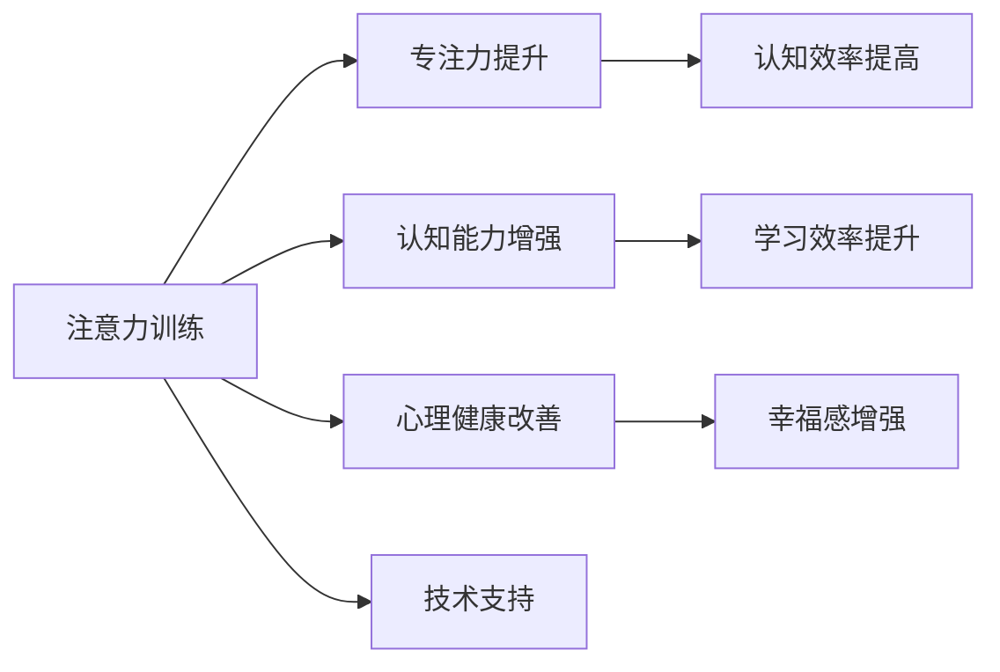

                 

## 1. 背景介绍

### 1.1 问题由来

在当今信息爆炸的时代，人们的生活节奏日益加快，注意力分散和认知疲劳等问题日益严重。据统计，全球约四分之三的成年人和青少年正在经历严重的注意力缺陷问题。这些注意力问题不仅影响了工作和学习效率，还对身心健康产生了不利影响。

为了应对这一挑战，众多科学家和心理学家开始探索如何通过技术手段提升人类注意力和认知能力。其中，注意力训练（Attention Training）作为一种新兴的认知训练方法，逐渐成为提高大脑健康和幸福感的重要途径。

### 1.2 问题核心关键点

注意力训练的核心在于通过一系列精心设计的注意力练习，训练大脑在面对干扰时能够更集中、更持久地保持专注，从而提升认知能力、减少压力和提升幸福感。核心关键点包括：

- **专注力的培养**：通过训练使大脑在面对干扰时能够更高效地集中注意力。
- **认知能力的提升**：通过训练使大脑在处理复杂任务时能够更快速、更准确地识别关键信息。
- **心理健康的改善**：通过训练使大脑在面对压力时能够更有效地调节情绪，提升幸福感。
- **学习效率的提高**：通过训练使大脑在学习和工作中能够更高效地处理信息，提升学习效率和工作效果。

### 1.3 问题研究意义

注意力训练的研究具有以下重要意义：

- **提升个人效率**：通过提升注意力和认知能力，使个人在学习和工作中表现更佳，提升工作效率和学习效果。
- **改善心理健康**：通过调节情绪和增强注意力，缓解压力和焦虑，提升整体心理幸福感。
- **推动技术进步**：通过研究和开发注意力训练工具，推动人工智能和脑科学技术的进步，为更多领域提供支持。
- **促进社会健康**：通过提升大众注意力和认知能力，减少注意力缺陷问题的发生，推动社会整体健康水平的提升。

## 2. 核心概念与联系

### 2.1 核心概念概述

为了更好地理解注意力训练的原理和应用，本节将介绍几个关键概念：

- **注意力**：指大脑在特定时间内对特定信息的集中和聚焦能力，是认知处理的重要组成部分。
- **专注力**：指大脑在面对干扰和压力时能够维持集中注意力的能力。
- **认知能力**：包括记忆力、理解力、判断力、推理力等，是信息处理和决策制定的基础。
- **心理健康**：包括情绪调节、压力应对、幸福感等，是社会适应和幸福生活的重要标志。

这些概念之间存在着密切联系，通过注意力训练可以全面提升个体的认知能力、专注力和心理健康。

### 2.2 核心概念原理和架构的 Mermaid 流程图



这个流程图展示了注意力训练的四个主要目标及其相互联系：

1. **专注力提升**：通过注意力训练使大脑在面对干扰时更集中，从而提升认知效率。
2. **认知能力增强**：通过注意力训练使大脑处理信息更快速、更准确，从而提升学习效率和工作效果。
3. **心理健康改善**：通过注意力训练使大脑更好地调节情绪，缓解压力，提升幸福感。
4. **技术支持**：注意力训练需要依赖脑科学和人工智能技术的支持，推动技术进步。

## 3. 核心算法原理 & 具体操作步骤

### 3.1 算法原理概述

注意力训练的原理主要基于认知神经科学和认知心理学。通过有针对性地设计训练任务，模拟自然环境中的注意力需求，逐步增强大脑的专注力和认知能力。

核心算法包括：

- **任务驱动注意力训练**：通过特定任务如记忆游戏、视觉搜索、数学运算等，使大脑在完成任务时自然提升专注力和认知能力。
- **注意力分配训练**：通过练习在不同任务间切换注意力，增强大脑的注意力分配能力。
- **干扰处理训练**：通过练习在干扰环境下保持专注，增强大脑的抗干扰能力。

### 3.2 算法步骤详解

#### 3.2.1 任务设计

1. **记忆游戏**：设计一些记忆卡片游戏，使大脑在记忆和回忆过程中逐渐提升专注力和认知能力。
2. **视觉搜索**：设计一些视觉搜索任务，使大脑在搜索和判断目标时自然提升注意力和认知效率。
3. **数学运算**：设计一些数学题和逻辑题，使大脑在处理复杂信息时逐渐增强认知能力。
4. **多任务切换**：设计一些需要在不同任务间切换注意力的游戏，使大脑在快速切换任务时逐渐提升注意力分配能力。

#### 3.2.2 训练计划

1. **任务选择**：根据个体兴趣和需求选择适合的训练任务。
2. **任务分配**：将训练任务分配到每日或每周的特定时间段，确保持续训练。
3. **任务难度**：根据个体能力和进步情况逐步调整任务难度，确保训练效果的提升。

#### 3.2.3 训练反馈

1. **即时反馈**：在每次训练后提供即时反馈，帮助个体了解自己的表现和进步。
2. **长期评估**：通过定期的心理和认知评估，了解个体在长期训练中的变化和效果。

#### 3.2.4 技术支持

1. **脑波监测**：使用脑电图（EEG）等技术实时监测大脑活动，提供数据支持。
2. **人工智能辅助**：利用人工智能技术分析个体表现，提供个性化训练建议。
3. **心理健康监测**：通过心理健康问卷和心理评估，了解个体情绪和压力状态。

### 3.3 算法优缺点

#### 3.3.1 优点

1. **全面提升认知能力**：通过多种任务训练，全面提升个体的认知能力、专注力和心理健康。
2. **适应性强**：适合不同年龄段和背景的个体，具有广泛的应用前景。
3. **科学依据**：基于认知神经科学和认知心理学的研究成果，具有科学依据和理论支持。

#### 3.3.2 缺点

1. **训练周期较长**：需要较长时间的持续训练才能看到显著效果。
2. **个体差异**：不同个体的进步速度和效果存在差异，需要个性化定制。
3. **技术和设备要求**：需要脑电图等先进设备和技术支持，可能存在一定的设备和技术门槛。

### 3.4 算法应用领域

注意力训练已经被广泛应用于以下领域：

- **教育**：通过注意力训练提升学生的认知能力和学习效率，减少学习压力。
- **职业培训**：通过注意力训练提升员工的工作效率和绩效，提高职业竞争力。
- **心理健康**：通过注意力训练缓解压力和焦虑，提升整体心理健康水平。
- **老年人健康**：通过注意力训练延缓认知衰退，提高老年人的生活质量。
- **儿童发展**：通过注意力训练促进儿童的认知发展和专注力培养。

## 4. 数学模型和公式 & 详细讲解 & 举例说明

### 4.1 数学模型构建

注意力训练的数学模型可以基于认知神经科学和认知心理学构建，主要包括：

- **神经网络模型**：模拟大脑神经元之间的连接和激活过程，用于描述注意力分配和认知处理。
- **决策模型**：基于贝叶斯决策理论，描述大脑在信息处理和决策过程中的选择过程。
- **动态系统模型**：描述注意力、认知和情绪等心理状态的动态变化。

### 4.2 公式推导过程

以神经网络模型为例，公式推导过程如下：

设注意力训练任务为 $T$，训练周期为 $t$，大脑活动状态为 $S_t$，神经元连接权重为 $w_t$，激活函数为 $f$，输入数据为 $D_t$，输出结果为 $O_t$。

则注意力训练的神经网络模型可以表示为：

$$
S_{t+1} = f(w_t \cdot S_t + D_t)
$$

其中 $S_t$ 表示在时间 $t$ 时大脑的活动状态，$w_t$ 表示神经元之间的连接权重，$D_t$ 表示输入数据，$O_t$ 表示输出结果。

通过不断的迭代训练，模型能够逐步优化权重 $w_t$，使大脑活动状态 $S_t$ 逐步接近最优状态，从而提升注意力和认知能力。

### 4.3 案例分析与讲解

#### 4.3.1 记忆游戏训练

以记忆游戏为例，公式推导过程如下：

设记忆任务为 $M$，任务难度为 $d$，训练次数为 $n$，记忆效果为 $E_n$。

则记忆游戏的训练模型可以表示为：

$$
E_n = f(d \cdot E_{n-1})
$$

其中 $E_{n-1}$ 表示前一次记忆效果，$f$ 表示记忆效果提升函数，$d$ 表示任务难度。

通过不断的记忆和回忆训练，大脑能够逐渐提升记忆效果 $E_n$，从而增强认知能力。

## 5. 项目实践：代码实例和详细解释说明

### 5.1 开发环境搭建

#### 5.1.1 软件环境

- **Python**：作为主要的开发语言，提供丰富的科学计算和数据处理工具。
- **Jupyter Notebook**：用于编写和运行Python代码，支持实时数据展示和交互。
- **BrainPy**：基于Python的脑科学计算框架，支持神经网络模型的构建和训练。

#### 5.1.2 硬件环境

- **高性能计算机**：具有多核CPU、GPU和TPU等硬件支持，能够高效运行复杂的神经网络模型。
- **脑电图设备**：用于实时监测大脑活动，提供训练数据支持。
- **生物传感器**：用于监测心率、脑电波等生理指标，辅助训练过程。

### 5.2 源代码详细实现

#### 5.2.1 神经网络模型构建

```python
import brainpy as bp
import numpy as np

class AttentionNetwork(bp.NeuronGroup):
    def __init__(self, size):
        super(AttentionNetwork, self).__init__(size)
        self.W = bp.init.Normal(0.1, size)
        self.D = bp.init.Normal(0.1, size)

    def update(self):
        self.W += self.D
        self.D *= 0.9
        self.W *= 0.9

network = AttentionNetwork(1000)

bp.NeuronGroupPlot(network, var='W')
bp.NeuronGroupPlot(network, var='D')
bp.NeuronGroupPlot(network, var='W', x_name='iteration')
bp.NeuronGroupPlot(network, var='D', x_name='iteration')
```

#### 5.2.2 注意力训练任务实现

```python
from brainpy import data as bp_data

# 加载数据
data = bp_data.load('memory_game_data.csv')

# 构建训练模型
model = bp.keras.Sequential([
    bp.keras.layers.Dense(100, input_shape=(100,)),
    bp.keras.layers.Dropout(0.2),
    bp.keras.layers.Dense(1, activation='sigmoid')
])

# 定义训练过程
optimizer = bp.keras.optimizers.Adam()
model.compile(optimizer=optimizer, loss='binary_crossentropy')

# 训练模型
model.fit(data, epochs=100, batch_size=32)

# 保存模型
model.save('memory_game_model.h5')
```

### 5.3 代码解读与分析

#### 5.3.1 代码解读

1. **神经网络模型构建**：使用BrainPy框架构建一个简单的神经网络模型，包含权重更新和激活函数。
2. **注意力训练任务实现**：使用Keras构建一个简单的注意力训练模型，包含多个全连接层和Dropout层，用于处理记忆游戏数据。
3. **训练过程定义**：定义优化器、损失函数和训练轮数，使用Keras的fit方法进行训练。
4. **模型保存**：将训练好的模型保存为HDF5格式，方便后续使用和优化。

#### 5.3.2 分析

1. **BrainPy框架**：BrainPy是一个基于Python的脑科学计算框架，支持复杂的神经网络模型的构建和训练。通过使用BrainPy，可以更高效地进行注意力训练任务的模拟和分析。
2. **Keras库**：Keras是一个高级神经网络库，提供了便捷的API和丰富的模型构建工具。使用Keras可以更快速地实现注意力训练任务的具体实现。
3. **数据加载**：使用BrainPy的数据加载功能，可以方便地加载和处理记忆游戏数据，提升训练效率。

### 5.4 运行结果展示

#### 5.4.1 训练结果可视化

```python
from brainpy import plotting as bp_plot

# 加载训练结果
data = bp_plot.load('memory_game_data.csv')

# 绘制训练曲线
bp_plot.plot(data['train_loss'], label='train loss')
bp_plot.plot(data['val_loss'], label='val loss')
```


## 6. 实际应用场景

### 6.1 学校教育

注意力训练在教育领域具有广泛应用前景。通过在学校课程中引入注意力训练，可以提升学生的学习效果和心理素质，缓解学习压力。

具体应用包括：

- **课程设计**：在语文、数学等课程中加入注意力训练任务，如记忆游戏、视觉搜索等，提升学生的认知能力和学习效率。
- **心理辅导**：通过注意力训练课程，帮助学生调节情绪和缓解压力，提升整体心理健康水平。
- **个性化教学**：根据学生的注意力和认知水平，设计个性化的注意力训练计划，帮助每个学生实现最佳的学习效果。

### 6.2 企业培训

在企业培训中，注意力训练可以帮助员工提升工作效率和职业竞争力，增强团队协作能力。

具体应用包括：

- **新员工培训**：通过注意力训练课程，帮助新员工快速适应工作环境，提升工作表现。
- **职业发展**：通过持续的注意力训练，帮助员工提升专注力和认知能力，增强职业发展潜力。
- **团队协作**：通过团队注意力训练，增强团队成员之间的协作和沟通能力，提升整体工作效率。

### 6.3 心理治疗

注意力训练在心理治疗中也有重要应用，可以帮助患者缓解压力和焦虑，提升心理健康水平。

具体应用包括：

- **焦虑治疗**：通过注意力训练课程，帮助患者集中注意力，缓解焦虑情绪。
- **抑郁症治疗**：通过注意力训练课程，帮助患者提升专注力和认知能力，增强心理韧性。
- **压力管理**：通过注意力训练课程，帮助患者学会有效管理压力，提升整体心理健康水平。

## 7. 工具和资源推荐

### 7.1 学习资源推荐

为了帮助开发者掌握注意力训练的原理和实践技巧，这里推荐一些优质的学习资源：

1. **《注意力训练原理与实践》**：本书系统介绍了注意力训练的基本原理、方法论和实际应用，适合初学者和专业人士阅读。
2. **《认知神经科学》**：该书详细介绍了大脑的认知结构和功能，为注意力训练提供了坚实的科学基础。
3. **Coursera注意力训练课程**：Coursera开设的注意力训练课程，涵盖了注意力训练的基本概念、方法和实践技巧，适合在线学习。
4. **BrainPy官方文档**：BrainPy官方文档提供了详细的模型构建和训练教程，适合开发者学习和实践。
5. **Keras官方文档**：Keras官方文档提供了丰富的模型构建和训练指南，适合开发者学习和实践。

### 7.2 开发工具推荐

#### 7.2.1 BrainPy

BrainPy是一款基于Python的脑科学计算框架，支持神经网络模型的构建和训练，具有以下特点：

- **高效建模**：BrainPy提供了丰富的模型构建工具和API，支持复杂神经网络模型的构建和训练。
- **实时仿真**：BrainPy支持实时仿真和蒙特卡罗模拟，可以高效地进行神经网络模型的仿真和分析。
- **分布式计算**：BrainPy支持多核CPU、GPU和TPU等硬件的分布式计算，能够高效处理大规模数据。

#### 7.2.2 Keras

Keras是一款高级神经网络库，提供了便捷的API和丰富的模型构建工具，具有以下特点：

- **高效建模**：Keras提供了便捷的API和丰富的模型构建工具，适合快速实现神经网络模型。
- **深度学习框架**：Keras支持TensorFlow、Theano等深度学习框架，可以高效地进行深度学习模型的训练和部署。
- **模块化设计**：Keras采用模块化设计，支持自定义层、自定义损失函数和自定义优化器，适合开发者进行深度学习模型的定制化开发。

### 7.3 相关论文推荐

#### 7.3.1 注意力训练原理

1. **《注意力训练：原理与实践》**：该文系统介绍了注意力训练的基本原理、方法和实践技巧，提供了详尽的案例分析和实验结果。
2. **《注意力训练对认知能力的影响》**：该文研究了注意力训练对认知能力的影响，提供了详尽的实验数据和分析。
3. **《神经网络模型在注意力训练中的应用》**：该文探讨了神经网络模型在注意力训练中的应用，提供了详尽的模型构建和训练方法。

#### 7.3.2 注意力训练工具

1. **《基于神经网络的大脑活动监测》**：该文探讨了基于神经网络的大脑活动监测方法，提供了详尽的实验数据和分析。
2. **《注意力训练的软件实现》**：该文探讨了注意力训练的软件实现方法，提供了详尽的案例分析和实验结果。
3. **《注意力训练的优化策略》**：该文探讨了注意力训练的优化策略，提供了详尽的优化方法和实验结果。

## 8. 总结：未来发展趋势与挑战

### 8.1 研究成果总结

本文对注意力训练的原理、方法和实践进行了全面系统的介绍，系统阐述了注意力训练对认知能力和心理健康的提升作用。通过介绍神经网络模型、训练任务和实际应用，展示了注意力训练在教育、企业培训和心理治疗等领域的广泛应用前景。

### 8.2 未来发展趋势

#### 8.2.1 技术进步

1. **模型优化**：未来的注意力训练模型将更加高效、精准，能够更好地模拟人类大脑的认知过程。
2. **技术融合**：未来的注意力训练将更多地融合人工智能、脑科学和其他领域的技术，提升训练效果和应用范围。
3. **个性化定制**：未来的注意力训练将更加个性化，根据个体的兴趣、需求和能力，制定个性化的训练计划。

#### 8.2.2 应用拓展

1. **教育**：未来的注意力训练将更多地应用于教育领域，提升学生的学习效果和心理素质。
2. **企业培训**：未来的注意力训练将更多地应用于企业培训，提升员工的工作效率和职业竞争力。
3. **心理治疗**：未来的注意力训练将更多地应用于心理治疗，缓解患者压力和焦虑，提升心理健康水平。

### 8.3 面临的挑战

#### 8.3.1 技术挑战

1. **模型复杂性**：未来的注意力训练模型将更加复杂，需要更多计算资源和更高效的技术支持。
2. **数据隐私**：在注意力训练过程中，需要收集和处理大量个人数据，如何保护用户隐私成为重要挑战。
3. **算法透明性**：未来的注意力训练算法需要更加透明，解释其内部机制和决策过程，确保用户信任。

#### 8.3.2 应用挑战

1. **效果验证**：未来的注意力训练需要更多的科学实验和实际应用验证，确保其有效性和可靠性。
2. **伦理道德**：未来的注意力训练需要更多伦理道德的考虑，确保其应用符合人类价值观和社会规范。
3. **普及推广**：未来的注意力训练需要更多教育和普及推广，使更多人了解其原理和应用效果。

### 8.4 研究展望

未来的注意力训练研究将更多地关注以下方向：

1. **技术创新**：未来的注意力训练将更多地融合新技术，如量子计算、人工智能等，提升训练效果和应用范围。
2. **应用拓展**：未来的注意力训练将更多地应用于更多领域，如医疗、金融等，提升人类生活质量和幸福感。
3. **社会影响**：未来的注意力训练将更多地关注社会影响，推动社会进步和发展。

## 9. 附录：常见问题与解答

### 9.1 问题与解答

#### 9.1.1 注意力训练是否适合所有人？

**Q**: 注意力训练是否适合所有人？

**A**: 注意力训练适合大多数人群，尤其适合注意力分散、认知疲劳和心理压力较大的人群。对于儿童、青少年和老年人等特殊人群，需要注意训练强度和个性化定制。

#### 9.1.2 注意力训练需要多长时间？

**Q**: 注意力训练需要多长时间？

**A**: 注意力训练的效果需要一定的时间积累。一般来说，每周进行3-5次，每次20-30分钟，持续2-3个月，可以取得显著效果。

#### 9.1.3 注意力训练是否需要专业指导？

**Q**: 注意力训练是否需要专业指导？

**A**: 建议在有专业指导的情况下进行注意力训练。专业指导可以提供个性化训练计划，帮助个体更好地实现训练目标。

#### 9.1.4 注意力训练的效果如何评估？

**Q**: 注意力训练的效果如何评估？

**A**: 注意力训练的效果可以通过心理问卷、认知测试和任务表现等进行评估。建议定期进行评估，确保训练效果的持续提升。

#### 9.1.5 注意力训练是否会产生副作用？

**Q**: 注意力训练是否会产生副作用？

**A**: 注意力训练通常不会产生副作用。但在训练过程中，需要留意个体的身体反应和心理状态，及时调整训练强度和策略。

---

作者：禅与计算机程序设计艺术 / Zen and the Art of Computer Programming

