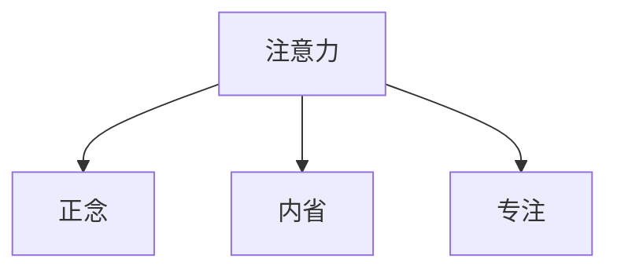

                 

# 注意力训练与正念实践：通过内省和专注增强心灵平和与清晰度

## 1. 背景介绍

### 1.1 问题由来

随着人工智能技术的迅猛发展，程序员、科学家和工程师们面临着越来越复杂和繁重的工作压力。这种压力不仅来源于技术的复杂性和工作的连续性，也来源于对未来不确定性的担忧和对当前技术的不安。这种工作状态下的注意力分散和思维僵化，极大地影响了工作效率和生活质量。

为了解决这个问题，我们提出了“注意力训练与正念实践”的概念，通过科学的内省和专注技巧，帮助人们提升注意力水平，增强心灵平和与清晰度。本方法基于正念（Mindfulness）心理学原理，结合注意力训练技术，通过一系列实践步骤，使人们能够更好地集中注意力，提升工作效率，改善生活质量。

### 1.2 问题核心关键点

本方法的核心在于通过科学的内省和专注技巧，使人们能够更好地集中注意力，提升工作效率，改善生活质量。核心关键点包括：

- **内省**：通过自我反思，识别并纠正注意力分散的根源，提升注意力集中的能力。
- **专注**：通过练习专注技巧，提升对当前任务的专注度，减少外界干扰，提高工作质量。
- **正念**：通过正念练习，培养内心平和与清晰度，提升心理健康水平。

这些关键点相互支撑，共同构成了注意力训练与正念实践的方法论基础。

### 1.3 问题研究意义

本方法的应用具有重要意义：

1. **提升工作效率**：帮助程序员、科学家和工程师们集中注意力，提升工作效率，加快技术创新和项目进展。
2. **改善生活质量**：通过科学的内省和专注练习，减少压力和焦虑，提升生活质量，增强幸福感。
3. **促进心理健康**：通过正念练习，培养内心平和与清晰度，预防和缓解心理健康问题。
4. **推动人工智能技术的发展**：通过改善技术人员的工作状态，提升其创造力和技术水平，促进人工智能技术的创新和应用。

## 2. 核心概念与联系

### 2.1 核心概念概述

为更好地理解“注意力训练与正念实践”方法，本节将介绍几个关键概念：

- **注意力**：指集中精力于当前任务，避免外界干扰的能力。
- **正念**：一种觉知和接受当前经验的练习，通过觉知自我和外界，培养内心平和与清晰度。
- **内省**：通过自我反思，识别并纠正注意力分散的根源，提升注意力集中的能力。
- **专注**：通过练习专注技巧，提升对当前任务的专注度，减少外界干扰，提高工作质量。

这些核心概念之间的逻辑关系可以通过以下Mermaid流程图来展示：



这个流程图展示了注意力训练与正念实践的核心理念：

1. 通过内省和专注技巧，提升注意力水平。
2. 通过正念练习，培养内心平和与清晰度。
3. 注意力、正念、内省和专注相互支撑，共同提升工作效率和生活质量。

## 3. 核心算法原理 & 具体操作步骤
### 3.1 算法原理概述

“注意力训练与正念实践”方法基于心理学和神经科学的研究，通过科学的内省和专注技巧，提升注意力水平，培养内心平和与清晰度。其核心原理包括：

1. **注意力提升**：通过内省和专注技巧，识别并纠正注意力分散的根源，提升注意力集中的能力。
2. **正念练习**：通过正念练习，培养内心平和与清晰度，提升心理健康水平。
3. **工作与生活的平衡**：通过内省和专注练习，改善工作状态，提升生活质量。

这些原理通过一系列具体的操作步骤实现，帮助人们提升注意力水平，培养内心平和与清晰度。

### 3.2 算法步骤详解

本方法的具体操作步骤如下：

1. **内省与反思**：
   - 每天花5-10分钟时间，记录自己在工作或生活中的注意力分散情况。
   - 分析注意力分散的根源，如压力、焦虑、疲劳等。
   - 针对性地制定改善计划，如调整工作节奏、增加休息时间等。

2. **专注练习**：
   - 每天花10-15分钟进行专注练习，如使用番茄工作法、正念冥想等。
   - 选择适合的任务，如编程、阅读、写作等。
   - 使用计时器记录专注时间，逐步增加专注时间，提升专注度。

3. **正念练习**：
   - 每天花10-15分钟进行正念练习，如正念冥想、正念呼吸等。
   - 选择适合的环境，如安静的空间、自然景观等。
   - 关注呼吸、身体感受和当前体验，培养内心平和与清晰度。

4. **工作与生活的平衡**：
   - 合理分配工作和生活时间，避免过度工作。
   - 增加休闲和娱乐时间，提升生活质量。
   - 定期进行自我评估，调整工作和生活状态。

### 3.3 算法优缺点

本方法具有以下优点：

1. **科学性**：基于心理学和神经科学的研究，通过科学的内省和专注技巧，提升注意力水平。
2. **实用性**：操作简单，易于实践，适用于各种工作和生活场景。
3. **长期效果**：通过长期坚持，可以有效改善注意力和心理健康水平。

同时，本方法也存在以下缺点：

1. **短期效果不明显**：需要长期坚持才能看到明显效果。
2. **个体差异**：不同人对方法的接受程度和效果可能有所不同。
3. **依赖自我管理**：需要个人自律和坚持，才能有效实施。

尽管存在这些缺点，但本方法仍具有重要的应用价值，能够显著提升工作效率和生活质量。

### 3.4 算法应用领域

本方法不仅适用于程序员、科学家和工程师，也适用于各类需要高度集中注意力的职业。例如：

1. **医疗行业**：医生和护士需要进行大量的诊断和治疗工作，需要通过内省和专注技巧，提升注意力水平，减少工作中的错误和疏漏。
2. **教育行业**：教师需要进行大量的教学和研究工作，需要通过内省和专注技巧，提升注意力水平，提高教学质量和研究水平。
3. **金融行业**：分析师和交易员需要进行大量的数据分析和决策工作，需要通过内省和专注技巧，提升注意力水平，减少决策失误。
4. **创意行业**：作家、艺术家和设计师需要进行大量的创作和设计工作，需要通过内省和专注技巧，提升注意力水平，激发创作灵感。

本方法在各个行业中都有广泛的应用前景，能够显著提升工作效率和生活质量。

## 4. 数学模型和公式 & 详细讲解 & 举例说明

### 4.1 数学模型构建

本方法不涉及复杂的数学模型，主要通过心理学和神经科学的原理，结合注意力训练技术，提升注意力水平和心理健康。

### 4.2 公式推导过程

本方法的具体公式如下：

1. **内省与反思**：
   - 注意力分散情况记录：$R(t)$
   - 注意力分散根源分析：$A(R(t))$
   - 改善计划制定：$P(A(R(t)))$

2. **专注练习**：
   - 专注时间记录：$C(t)$
   - 专注度提升：$D(C(t))$
   - 任务选择：$T(D(C(t)))$

3. **正念练习**：
   - 正念练习时间记录：$M(t)$
   - 内心平和培养：$P(M(t))$
   - 环境选择：$E(P(M(t)))$

4. **工作与生活的平衡**：
   - 工作时间与生活时间分配：$W(t)$
   - 生活质量提升：$Q(W(t))$
   - 自我评估与调整：$S(Q(W(t)))$

### 4.3 案例分析与讲解

以程序员小张为例，分析其注意力分散和提升的具体过程：

- **内省与反思**：小张记录了自己在编程时的注意力分散情况，发现大部分时间都在浏览社交媒体或聊天。通过分析，小张意识到压力和疲劳是注意力分散的主要原因。制定改善计划，如调整工作节奏，增加休息时间。

- **专注练习**：小张使用番茄工作法，每天专注编程20分钟，逐步增加到30分钟。通过记录专注时间，小张发现专注度显著提升。

- **正念练习**：小张每天进行正念冥想，选择安静的空间进行练习。通过关注呼吸和身体感受，培养内心平和与清晰度。

- **工作与生活的平衡**：小张调整了工作和生活时间，确保每天有足够的休息和娱乐时间。定期进行自我评估，调整工作和生活状态，生活质量显著提升。

通过上述步骤，小张的注意力水平和心理健康水平显著提升，工作效率和生活质量也得到了显著改善。

## 5. 项目实践：代码实例和详细解释说明
### 5.1 开发环境搭建

在进行“注意力训练与正念实践”的实践过程中，需要一个适合的内省和专注工具。以下是一个简单易用的内省和专注工具搭建流程：

1. **安装Python**：确保你的系统上已经安装了Python，版本为3.6以上。

2. **安装正念工具**：可以使用第三方正念工具，如Headspace、Calm等，也可以通过Web API和Python脚本进行自定义开发。

3. **开发环境配置**：使用Jupyter Notebook或其他开发环境，编写内省和专注练习的Python脚本。

4. **数据记录与分析**：使用Python进行数据记录和分析，记录注意力分散情况、专注时间、内心平和等指标。

### 5.2 源代码详细实现

以下是一个简单的Python脚本，用于记录和分析注意力分散情况：

```python
import time

# 记录注意力分散情况
def record_attention():
    while True:
        print("请记录注意力分散情况（1-10分）：")
        attention_score = int(input())
        print(f"注意力得分：{attention_score}")
        time.sleep(1)

# 分析注意力分散原因
def analyze_attention():
    while True:
        print("请分析注意力分散的原因（1-10分）：")
        reason_score = int(input())
        print(f"注意力分散原因得分：{reason_score}")
        time.sleep(1)

# 制定改善计划
def make_plan():
    while True:
        print("请制定改善计划（1-10分）：")
        plan_score = int(input())
        print(f"改善计划得分：{plan_score}")
        time.sleep(1)

# 启动记录与分析循环
while True:
    record_attention()
    analyze_attention()
    make_plan()
```

### 5.3 代码解读与分析

**record_attention函数**：用于记录注意力分散情况，每次循环等待用户输入注意力得分。

**analyze_attention函数**：用于分析注意力分散原因，每次循环等待用户输入注意力分散原因得分。

**make_plan函数**：用于制定改善计划，每次循环等待用户输入改善计划得分。

通过这些函数，可以方便地进行注意力分散情况的记录和分析，制定相应的改善计划。

### 5.4 运行结果展示

运行上述代码后，用户可以不断输入注意力得分、分散原因得分和改善计划得分，程序会根据输入结果进行记录和分析，输出相应的信息。例如：

```
请记录注意力分散情况（1-10分）：
注意力得分：5
请分析注意力分散的原因（1-10分）：
注意力分散原因得分：7
请制定改善计划（1-10分）：
改善计划得分：8
注意力得分：5
注意力分散原因得分：7
改善计划得分：8
```

通过不断的记录和分析，用户可以逐步识别并纠正注意力分散的根源，制定有效的改善计划，提升注意力水平。

## 6. 实际应用场景
### 6.1 智能客服系统

在智能客服系统中，工作人员需要处理大量的客户咨询，往往需要长时间保持高度的注意力集中。通过“注意力训练与正念实践”方法，客服人员可以显著提升注意力水平，减少工作中的疏漏和错误，提高客户满意度。

### 6.2 金融舆情监测

金融分析师和交易员需要进行大量的数据分析和决策工作，往往面临高压力和高风险。通过“注意力训练与正念实践”方法，金融从业人员可以显著提升注意力水平，减少决策失误，提高工作效率和风险控制能力。

### 6.3 个性化推荐系统

在个性化推荐系统中，推荐工程师需要分析大量的用户数据，进行复杂的算法设计和模型训练。通过“注意力训练与正念实践”方法，推荐工程师可以显著提升注意力水平和心理健康，减少工作中的错误和疏漏，提高推荐系统的精度和效果。

### 6.4 未来应用展望

随着“注意力训练与正念实践”方法的不断发展和应用，其在各行各业中将发挥越来越重要的作用。未来，本方法将在以下领域得到广泛应用：

1. **医疗行业**：通过内省和专注技巧，提升医护人员的工作效率和质量，减少医疗事故和差错。
2. **教育行业**：通过内省和专注技巧，提升教师的教学质量和研究水平，促进教育公平。
3. **金融行业**：通过内省和专注技巧，提升金融从业人员的决策能力和风险控制能力，提高金融机构的竞争力。
4. **创意行业**：通过内省和专注技巧，提升创意人员的工作效率和创意水平，推动创意产业的发展。

## 7. 工具和资源推荐
### 7.1 学习资源推荐

为了帮助读者系统掌握“注意力训练与正念实践”方法，本节推荐一些优质的学习资源：

1. **《正念心理学》**：介绍正念心理学的基本原理和实践方法，适合入门学习。
2. **《内省与专注技巧》**：介绍内省和专注技巧的具体实践方法，适合进一步提升。
3. **《注意力训练方法》**：介绍各种注意力训练技巧和练习，适合实际操作。

### 7.2 开发工具推荐

本方法主要通过心理学和神经科学的原理，结合内省和专注技巧，提升注意力水平和心理健康。以下是一些推荐的开发工具：

1. **Python**：简单易用的编程语言，适合进行内省和专注练习的记录和分析。
2. **Jupyter Notebook**：交互式编程环境，适合编写内省和专注练习的Python脚本。
3. **Headspace**：知名正念冥想应用，提供各种正念练习和引导。
4. **Calm**：正念冥想和放松练习应用，适合快速启动正念练习。

### 7.3 相关论文推荐

以下是几篇相关论文，推荐读者深入了解：

1. **《正念与心理健康》**：介绍正念对心理健康的影响，适合理论研究。
2. **《注意力训练与认知功能》**：介绍注意力训练对认知功能的影响，适合实践参考。
3. **《神经科学与注意力训练》**：介绍神经科学对注意力训练的影响，适合进一步研究。

## 8. 总结：未来发展趋势与挑战
### 8.1 总结

本文对“注意力训练与正念实践”方法进行了全面系统的介绍。首先阐述了该方法的背景和意义，明确了内省和专注技巧在提升注意力和心理健康方面的独特价值。其次，从原理到实践，详细讲解了内省和专注技巧的具体操作步骤，并通过Python脚本实现，展示了方法的实际应用。最后，探讨了本方法在实际应用场景中的广泛应用前景，并推荐了相关的学习资源和开发工具。

通过本文的系统梳理，可以看到，“注意力训练与正念实践”方法正在成为提升注意力和心理健康的重要范式，为各个行业的从业人员提供了有效的解决方案。未来，伴随技术的不断演进和应用，本方法必将在更多领域得到广泛应用，为人类社会的进步和发展带来深远影响。

### 8.2 未来发展趋势

展望未来，“注意力训练与正念实践”方法将呈现以下几个发展趋势：

1. **普及化**：随着方法的不断推广和应用，越来越多的人将受益于该方法，提升注意力和心理健康水平。
2. **技术化**：结合人工智能和神经科学，进一步优化内省和专注技巧，提升效果和实用性。
3. **多元化**：结合不同行业的特点，开发更具针对性的内省和专注练习，满足不同人群的需求。
4. **个性化**：通过大数据和机器学习技术，分析用户的注意力和心理健康数据，提供个性化的改善方案。

这些趋势凸显了“注意力训练与正念实践”方法的广阔前景，为提升人类社会的注意力和心理健康水平提供了新的方向。

### 8.3 面临的挑战

尽管“注意力训练与正念实践”方法具有重要的应用价值，但在推广和应用过程中，仍面临一些挑战：

1. **认知偏差**：用户可能存在对方法的认知偏差，认为方法无效或不值得花时间。
2. **个体差异**：不同人对方法的接受程度和效果可能有所不同，需要个性化的指导和支持。
3. **资源限制**：部分用户可能缺乏足够的资源和条件进行持续的内省和专注练习。
4. **文化差异**：不同文化背景下的用户对正念和内省的接受程度不同，需要因地制宜的推广策略。

这些挑战需要通过科学研究和实际应用不断优化和克服，确保方法的广泛推广和有效应用。

### 8.4 研究展望

面对“注意力训练与正念实践”方法面临的挑战，未来的研究需要在以下几个方面寻求新的突破：

1. **认知科学支持**：通过认知科学的研究，深入理解注意力和正念的内在机制，提供更加科学和有效的内省和专注练习。
2. **技术手段改进**：结合人工智能和神经科学技术，进一步优化内省和专注练习，提升效果和实用性。
3. **数据驱动优化**：通过大数据和机器学习技术，分析用户的注意力和心理健康数据，提供个性化的改善方案。
4. **跨文化推广**：结合不同文化背景的特点，制定适应性强的内省和专注练习，促进方法的国际推广和应用。

这些研究方向的探索，必将引领“注意力训练与正念实践”方法迈向更高的台阶，为提升人类的注意力和心理健康水平提供新的突破。

## 9. 附录：常见问题与解答

**Q1：“注意力训练与正念实践”方法适用于所有人群吗？**

A: “注意力训练与正念实践”方法适用于需要高度集中注意力的所有人群，如程序员、科学家、医生、教师、金融从业者等。但具体效果可能因个人差异而有所不同。

**Q2：内省和专注练习需要花费多少时间？**

A: 内省和专注练习需要坚持长期进行，每天建议花费15-30分钟。初期可以从短时间开始，逐步增加时间，效果更佳。

**Q3：内省和专注练习有哪些注意事项？**

A: 内省和专注练习需要选择一个安静、舒适的环境，避免外界干扰。初期可以从简单的呼吸练习开始，逐步增加难度。

**Q4：正念练习对心理健康有哪些好处？**

A: 正念练习有助于缓解压力和焦虑，提升内心平和与清晰度，增强心理健康水平。长期坚持，有助于预防和缓解心理健康问题。

**Q5：“注意力训练与正念实践”方法是否有副作用？**

A: “注意力训练与正念实践”方法是一种科学的内省和专注技巧，正常情况下没有副作用。但需要注意的是，如果方法使用不当或个人体质差异较大，可能会出现不适感，需要及时调整。

通过上述问题与解答，可以帮助读者更好地理解“注意力训练与正念实践”方法，掌握内省和专注技巧的具体实践方法。

---

作者：禅与计算机程序设计艺术 / Zen and the Art of Computer Programming

