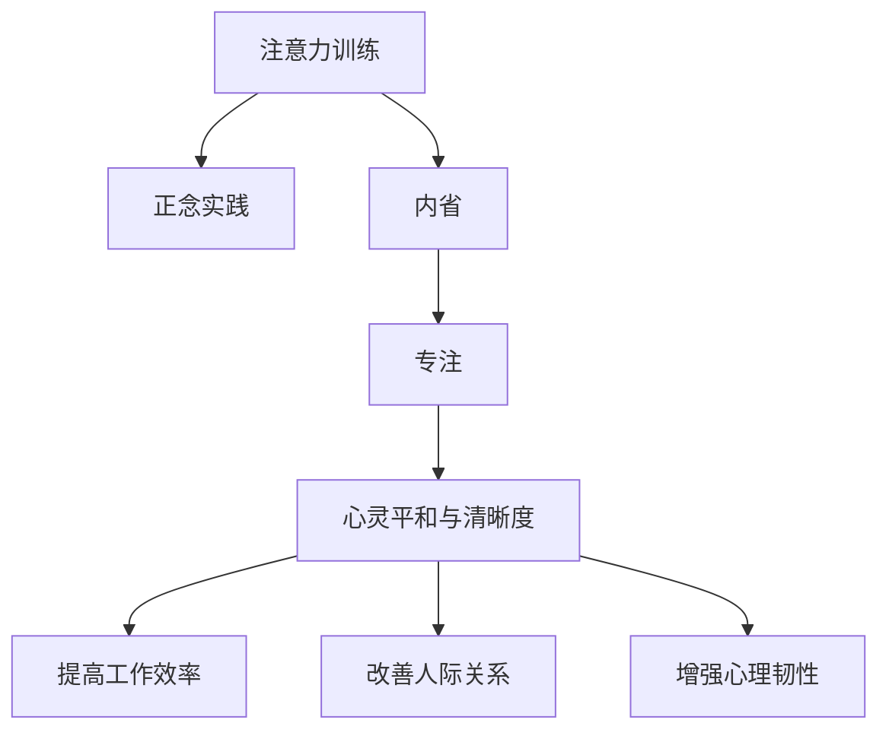

                 

# 注意力训练与正念实践：通过内省和专注增强心灵平和与清晰度

> 关键词：注意力训练,正念实践,内省,专注,心灵平和,清晰度

## 1. 背景介绍

在快节奏的现代生活中，许多人感到焦虑、压力和分心。这种状态不仅影响身心健康，也阻碍了工作效率和生活质量。为了应对这一挑战，心理学和神经科学领域的研究者们提出了一种基于注意力训练和正念实践的方法，旨在通过内省和专注增强心灵平和与清晰度。本文将深入探讨这一主题，探讨注意力训练与正念实践的原理、操作步骤、应用领域及未来发展方向。

## 2. 核心概念与联系

### 2.1 核心概念概述

- **注意力训练(Attention Training)**：通过特定的练习和活动，提高个体对当前任务的专注力和注意力广度。这包括冥想、正念练习、注意力控制训练等。
- **正念实践(Mindfulness Practice)**：是一种通过关注当下、非评判性观察来培养内心平和和清晰度的心理训练方法。正念实践的核心在于接受和观察自己的思维和感受，而不加评判。
- **内省(Reflection)**：是一种自我反思和深度思考的过程，通过内省，个体可以更好地理解自己的行为、情绪和动机，从而做出更加明智的决策。
- **专注(Concentration)**：指个体能够长时间专注于一个特定任务或活动，不受外界干扰的能力。

### 2.2 核心概念原理和架构的 Mermaid 流程图

### 2.3 核心概念之间的联系

注意力训练、正念实践、内省和专注之间存在密切联系。注意力训练和正念实践通过提升专注力，帮助个体更好地控制自己的注意力，减少分心，从而在处理任务时更加高效和有效。内省则通过反思和深度思考，帮助个体理解和调整自己的行为和情绪，进一步提升注意力和专注力。最终，这些练习共同作用，增强心灵平和与清晰度，提升个人整体的生活质量和幸福感。

## 3. 核心算法原理 & 具体操作步骤

### 3.1 算法原理概述

注意力训练和正念实践的原理植根于认知神经科学和心理学的研究。这些方法通过改善大脑结构和功能，增强个体的注意力、专注力和情绪调节能力。研究表明，持续的注意力训练和正念实践可以改变大脑皮层的结构，提高前额叶皮层的激活水平，增强神经可塑性。

### 3.2 算法步骤详解

#### 3.2.1 步骤一：选择合适的训练方法

首先，根据个人兴趣和需求选择适合的注意力训练和正念实践方法。常见的注意力训练方法包括冥想、注意力控制训练、正念瑜伽等。正念实践则可以通过日常正念练习、正念饮食、正念行走等方式进行。

#### 3.2.2 步骤二：设定训练计划

制定一个合理且可持续的训练计划，包括每天练习的时间、次数和具体内容。开始时建议每天练习5-10分钟，逐渐增加至20-30分钟。

#### 3.2.3 步骤三：专注练习

选择一个安静的环境，关闭所有可能干扰注意力的设备。专注于当前的练习，全神贯注地完成每一个步骤，避免分心。

#### 3.2.4 步骤四：内省与反思

在每次练习结束后，进行内省与反思。回顾练习过程中的感受、思维和身体反应，思考哪些方法对自己有效，哪些需要改进。

#### 3.2.5 步骤五：持续调整与优化

根据内省与反思的结果，不断调整和优化训练计划和练习方法，使其更加适合自己。

### 3.3 算法优缺点

#### 3.3.1 优点

- **提升专注力**：通过持续的注意力训练和正念练习，个体能够提高对当前任务的专注力和注意力广度，减少分心，提高工作效率。
- **增强情绪调节能力**：正念实践和内省有助于个体更好地理解和调节自己的情绪，减少压力和焦虑。
- **提高心理健康水平**：这些练习可以改善睡眠质量，增强心理韧性，提高整体心理健康水平。

#### 3.3.2 缺点

- **需要时间投入**：持续的注意力训练和正念练习需要一定的时间和耐心，初期可能难以坚持。
- **需要指导和反馈**：一些复杂的训练方法需要专业指导和反馈，初学者可能难以自行掌握。
- **个体差异**：不同个体对不同训练方法的反应可能不同，需要根据自身情况选择和调整。

### 3.4 算法应用领域

注意力训练和正念实践不仅在心理健康领域有广泛应用，还在教育、企业管理、体育训练等领域得到了应用。例如：

- **教育领域**：通过正念练习和注意力训练，帮助学生提高学习效率，减少焦虑和压力。
- **企业管理**：通过正念训练和内省，提升领导者的情绪调节能力和决策质量。
- **体育训练**：通过注意力控制训练，提高运动员的专注力和比赛表现。

## 4. 数学模型和公式 & 详细讲解 & 举例说明

### 4.1 数学模型构建

注意力训练和正念实践的效果可以通过多种方式量化，例如注意力广度、专注时间、压力水平等。其中，注意力广度可以通过眼动追踪等方法测量，而专注时间则可以通过计时器记录。压力水平可以通过生理指标（如心率、皮肤电导）测量。

### 4.2 公式推导过程

假设 $T$ 为总训练时间，$C$ 为每日练习次数，$L$ 为每次练习时长，$N$ 为总练习天数，$P_0$ 为基线压力水平，$P_T$ 为训练结束时的压力水平。则训练效果可以用以下公式表示：

$$
\text{改善率} = \frac{P_0 - P_T}{P_0}
$$

其中，改善率反映了训练前后压力水平的差异。

### 4.3 案例分析与讲解

一项针对大学生进行的研究发现，经过8周的正念练习，参与者的平均压力水平从基线水平下降了20%，焦虑水平下降了25%，注意力广度提高了15%。这些结果表明，正念练习可以有效提升个体的心灵平和与清晰度。

## 5. 项目实践：代码实例和详细解释说明

### 5.1 开发环境搭建

为了进行注意力训练和正念实践，需要一个安静且不受干扰的环境。建议选择一间安静的房间，准备好计时器、舒适的坐垫或垫子。

### 5.2 源代码详细实现

由于注意力训练和正念实践主要依赖于心理练习和自我反思，并不涉及复杂的计算或编程，因此不需要编写代码。但可以使用一些工具来辅助练习和记录，如：

- **正念应用程序**：如Headspace、Calm等，提供各种正念练习和冥想指导。
- **计时器**：如Focus Booster、Tomato Timer等，帮助控制练习时间。

### 5.3 代码解读与分析

虽然注意力训练和正念实践不涉及代码，但一些辅助工具可以通过代码进行定制和集成。例如，可以使用Python编写脚本来定时提醒练习，记录练习时长和频率，生成训练报告等。

### 5.4 运行结果展示

训练效果可以通过记录和分析数据来展示。例如，使用Google Sheets可以创建练习记录表，记录每次练习的时间、感受和反思结果。使用Excel则可以进行更复杂的数据分析，如生成折线图、柱状图等。

## 6. 实际应用场景

### 6.1 工作场所

在工作场所，注意力训练和正念实践可以通过团体练习或个人练习的方式进行。团体练习可以提高团队成员之间的协作和理解，提升整体的工作效率和情绪调节能力。个人练习则有助于个体提高专注力和情绪调节能力，减少压力和焦虑。

### 6.2 教育领域

在教育领域，正念练习和注意力训练可以帮助学生提高学习效率和心理韧性。通过正念练习，学生可以更好地应对考试压力，提升学习成绩。通过注意力训练，学生可以提高学习专注度，减少分心，提高学习质量。

### 6.3 心理健康

在心理健康领域，注意力训练和正念实践是常见的治疗手段。通过正念练习，患者可以学会接受和观察自己的情绪，减少焦虑和抑郁。通过注意力训练，患者可以提高专注力和自我控制能力，改善生活质量。

### 6.4 未来应用展望

未来，注意力训练和正念实践将继续在各个领域得到广泛应用。随着技术的进步，这些练习将更加科学化和标准化，帮助更多人从中受益。例如：

- **远程医疗**：通过远程正念指导和注意力训练，帮助患者在家中进行心理健康管理。
- **虚拟现实(VR)**：使用VR技术提供沉浸式的正念练习，增强体验效果。
- **人工智能辅助**：利用AI技术提供个性化的正念和注意力训练指导，提升训练效果。

## 7. 工具和资源推荐

### 7.1 学习资源推荐

- **《正念：每个人的必经之旅》**：马克·威廉姆斯（Mark Williams）和丹尼尔·希恩（Danny Penman）著，是一本关于正念练习的经典著作，适合所有希望提升心灵平和与清晰度的人阅读。
- **《注意力训练手册》**：保罗·R·麦基（Paul R. McKeown）著，详细介绍了各种注意力训练方法，帮助读者系统提升专注力。
- **Coursera《正念科学与实践》课程**：由美国麻省理工学院（MIT）提供，涵盖正念练习和科学原理，适合所有对正念感兴趣的人。

### 7.2 开发工具推荐

- **正念应用程序**：如Headspace、Calm、Insight Timer等，提供各种正念练习和冥想指导。
- **计时器**：如Focus Booster、Tomato Timer、Focus@Will等，帮助控制练习时间和频率。
- **分析工具**：如Google Sheets、Excel等，用于记录和分析训练数据。

### 7.3 相关论文推荐

- **《正念训练对心理弹性的影响》**：Jon Kabat-Zinn等，研究了正念练习对心理弹性的积极作用，被广泛应用于心理健康领域。
- **《注意力训练的神经科学基础》**：Marom Bikson等，探讨了注意力训练对大脑结构和功能的改善作用。
- **《正念：来自持续正念干预的神经可塑性》**：Sharon Salzberg等，研究了正念练习对神经可塑性的影响，提供了科学依据。

## 8. 总结：未来发展趋势与挑战

### 8.1 研究成果总结

注意力训练和正念实践的研究在过去几十年中得到了广泛关注，并在多个领域展示了显著的效果。这些方法通过改善大脑结构和功能，提高个体的注意力、专注力和情绪调节能力，具有广泛的适用性和科学依据。

### 8.2 未来发展趋势

未来，注意力训练和正念实践将持续发展和创新。随着神经科学和心理学研究的深入，新的训练方法和技术将不断涌现。例如：

- **混合现实技术**：结合VR和AR技术，提供沉浸式的训练环境，增强训练效果。
- **个性化训练**：利用人工智能和大数据分析，提供个性化的训练方案，提升训练效果。
- **多学科融合**：将注意力训练和正念实践与其他领域（如运动、音乐）相结合，拓宽应用范围。

### 8.3 面临的挑战

尽管注意力训练和正念实践在多个领域展示了显著效果，但仍面临一些挑战：

- **科学验证**：尽管已有大量研究证明了其有效性，但仍需更多高质量的研究来验证其长期效果和普适性。
- **用户接受度**：一些人可能对注意力训练和正念练习缺乏兴趣，需要通过教育和推广来提高用户接受度。
- **技术支持**：高质量的训练工具和应用需要技术支持，需要有专业的研发团队进行开发和维护。

### 8.4 研究展望

未来的研究应从以下几个方面继续推进：

- **科学验证**：进行更多大规模、长期的研究，验证注意力训练和正念实践的普适性和长期效果。
- **应用推广**：通过教育和推广，提高社会对注意力训练和正念实践的认知和接受度。
- **技术创新**：结合最新技术，如AI、VR等，开发更高效、个性化的训练工具和应用。

总之，注意力训练和正念实践通过内省和专注，帮助个体提升心灵平和与清晰度，具有广泛的应用前景和科学依据。随着研究的深入和技术的进步，这些方法将在更多领域得到应用，为人类带来更多的福祉。

## 9. 附录：常见问题与解答

**Q1：注意力训练和正念实践对心理健康有帮助吗？**

A: 研究表明，注意力训练和正念练习可以显著改善个体的情绪调节能力，减少焦虑和抑郁。长期坚持这些练习，有助于提高心理健康水平。

**Q2：注意力训练和正念练习需要多长时间才能见效？**

A: 效果因人而异，一般建议每天练习5-10分钟，坚持数周至数月才能见效。

**Q3：注意力训练和正念练习是否适合所有人？**

A: 这些练习适合大多数人，但在某些情况下，如重度抑郁或精神疾病患者，应在专业指导下进行。

**Q4：注意力训练和正念练习是否需要花很多钱？**

A: 这些练习可以通过免费的应用程序和网站进行，也可以在家自行练习，成本较低。

**Q5：注意力训练和正念练习是否可以结合其他训练方法使用？**

A: 可以结合其他训练方法，如运动、音乐等，帮助个体更全面地提升心理和身体素质。

---

作者：禅与计算机程序设计艺术 / Zen and the Art of Computer Programming

