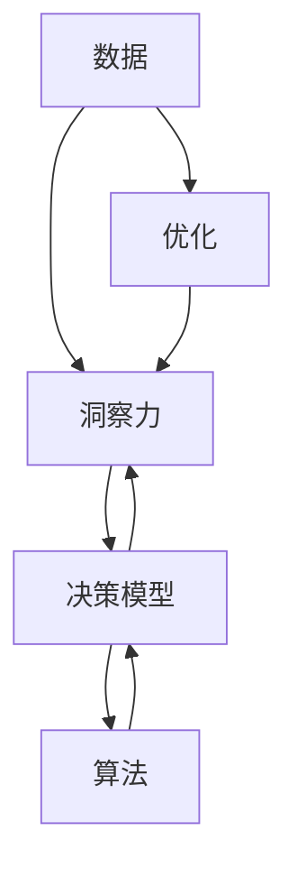

                 

# 洞察力与决策科学：从数据到智慧的转化

> 关键词：洞察力,决策科学,数据转化,机器学习,深度学习,大数据,算法

## 1. 背景介绍

在数字化转型加速的今天，数据的获取与处理能力已经成为企业竞争力的核心要素。然而，单纯的数据堆积并无法为企业带来真正的价值，将数据转化为洞察力、指导决策才是根本。这其中，决策科学的崛起，为数据驱动的洞察力挖掘和智慧转化提供了强大的理论工具和技术手段。

决策科学是一门跨学科的学科，融合了心理学、统计学、管理学、计算机科学等多个领域，致力于利用数据、算法和模型，对复杂环境下的决策问题进行系统分析和优化。在信息化、数字化深入推进的背景下，决策科学以其独特的方法论和技术手段，不断推动企业在复杂多变的市场环境中占据优势，实现决策智能化、精准化。

本文将从数据到洞察力转化的视角，深入探讨决策科学的原理、算法和应用实践，帮助读者理解从数据到智慧的转化过程，掌握数据驱动决策的关键技术和方法。

## 2. 核心概念与联系

### 2.1 核心概念概述

为了更好地理解决策科学的核心概念和相互关系，下面将详细介绍几个关键概念：

- **数据**：企业运营过程中产生的数据，包括客户行为数据、市场环境数据、财务数据等，是决策的基础。
- **洞察力**：通过对数据的分析挖掘，发现其中的规律、模式和趋势，形成对市场、客户、产品等关键要素的深入理解。
- **决策模型**：利用统计学、机器学习等方法，构建的用于指导决策的模型。
- **算法**：为解决特定问题而设计的计算程序或步骤，如回归分析、聚类算法、神经网络等。
- **优化**：在约束条件下，寻找最优解的过程，如线性规划、整数规划等。

这些概念之间的逻辑关系可以通过以下Mermaid流程图来展示：



这个流程图展示了数据、洞察力、决策模型、算法和优化之间的关系：

1. 数据是洞察力的来源。
2. 通过洞察力，构建决策模型，并使用算法进行模型训练和预测。
3. 优化技术用于寻找模型参数的最佳组合，提升模型性能。
4. 决策模型输出洞察力，指导决策。

## 3. 核心算法原理 & 具体操作步骤
### 3.1 算法原理概述

决策科学的核心算法包括回归分析、聚类分析、分类器、神经网络等，旨在通过数据驱动的方式，对决策问题进行量化、分析和预测。

- **回归分析**：寻找变量间的关系，通过建立数学模型，对未来进行预测。
- **聚类分析**：将数据分为多个群体，每个群体内的数据相似度较高，群体间差异显著。
- **分类器**：根据已有数据训练模型，对新数据进行分类。
- **神经网络**：一种模拟人脑神经元结构和功能的模型，通过多层非线性变换，进行复杂数据的预测。

### 3.2 算法步骤详解

以回归分析为例，详细介绍算法步骤：

1. **数据准备**：收集与决策问题相关的数据，并进行清洗、预处理。
2. **模型选择**：根据问题特点选择合适的回归模型，如线性回归、多项式回归等。
3. **参数训练**：使用训练集数据，通过最小二乘法等方法训练模型参数。
4. **模型验证**：使用验证集数据，评估模型性能，选择合适的参数和模型。
5. **模型应用**：将训练好的模型应用于实际问题，进行预测和决策。

### 3.3 算法优缺点

回归分析作为一种经典的统计分析方法，具有以下优点：

- 简单易懂：模型建立和解释相对简单，易于理解和应用。
- 广泛适用：适用于多种类型的数据，应用范围广。
- 可解释性强：模型结果具有明确的数学表达式，便于解释和理解。

然而，回归分析也存在以下缺点：

- 假设限制：模型的表现依赖于假设条件，如线性关系等，限制了应用范围。
- 数据要求高：需要大量高质量的数据进行训练，数据质量和数量直接影响模型性能。
- 难以处理非线性关系：对非线性关系的建模能力有限，需要额外处理。

### 3.4 算法应用领域

回归分析广泛应用于金融、市场营销、生产管理等多个领域，帮助企业从数据中挖掘洞察力，指导决策：

- **金融行业**：使用回归模型进行信用评分、风险评估等，辅助贷款决策。
- **市场营销**：分析销售数据，预测市场趋势，指导广告投放和产品定价。
- **生产管理**：通过回归分析，优化生产流程，提高生产效率。

## 4. 数学模型和公式 & 详细讲解  
### 4.1 数学模型构建

假设回归模型为 $y = \beta_0 + \beta_1 x_1 + \beta_2 x_2 + \ldots + \beta_n x_n + \epsilon$，其中 $y$ 为因变量，$x_1, x_2, \ldots, x_n$ 为自变量，$\beta_0, \beta_1, \ldots, \beta_n$ 为模型参数，$\epsilon$ 为误差项。

### 4.2 公式推导过程

根据最小二乘法原理，模型参数的估计公式为：

$$
\hat{\beta} = (X^TX)^{-1}X^Ty
$$

其中 $X$ 为自变量矩阵，$y$ 为因变量向量。

### 4.3 案例分析与讲解

以房价预测为例，假设已知房屋面积 $x_1$、房间数 $x_2$、位置 $x_3$ 等特征，与房价 $y$ 之间的关系。可以使用线性回归模型进行预测：

$$
\hat{y} = \beta_0 + \beta_1 x_1 + \beta_2 x_2 + \beta_3 x_3 + \epsilon
$$

在实际应用中，可以通过Python的Scikit-Learn库进行回归模型的实现。

```python
from sklearn.linear_model import LinearRegression
import pandas as pd

# 读取数据
data = pd.read_csv('house_data.csv')

# 选择特征和因变量
X = data[['area', 'rooms', 'location']]
y = data['price']

# 建立回归模型
model = LinearRegression()
model.fit(X, y)

# 预测房价
new_data = pd.DataFrame({'area': [1500, 1200, 2000], 'rooms': [3, 4, 5], 'location': [1, 2, 3]})
new_X = new_data
predicted_prices = model.predict(new_X)
```

## 5. 项目实践：代码实例和详细解释说明
### 5.1 开发环境搭建

在进行决策科学相关项目开发前，需要搭建好相应的开发环境。以下是使用Python进行项目开发的简单步骤：

1. 安装Python和Anaconda。
2. 创建Python虚拟环境，并激活。
3. 安装必要的第三方库，如Pandas、NumPy、Scikit-Learn等。

### 5.2 源代码详细实现

以一个简单的回归分析项目为例，展示决策科学模型的实现过程。

首先，准备数据集：

```python
import pandas as pd

# 读取数据集
data = pd.read_csv('data.csv')

# 数据预处理
# ...
```

然后，建立回归模型并进行训练：

```python
from sklearn.linear_model import LinearRegression

# 选择特征和因变量
X = data[['feature1', 'feature2']]
y = data['target']

# 建立回归模型
model = LinearRegression()
model.fit(X, y)

# 输出模型参数
print(model.coef_, model.intercept_)
```

最后，使用训练好的模型进行预测：

```python
# 预测新数据
new_data = pd.DataFrame({'feature1': [1, 2, 3], 'feature2': [4, 5, 6]})
predictions = model.predict(new_data)
```

### 5.3 代码解读与分析

在上述代码中，关键部分包括数据预处理、模型建立、参数训练和预测。

- **数据预处理**：数据清洗、特征工程等预处理步骤，确保数据质量和特征有效性。
- **模型建立**：选择合适的回归模型，进行模型训练。
- **参数训练**：使用训练集数据，优化模型参数，提升模型性能。
- **预测**：将模型应用于新数据，进行预测。

这些步骤体现了从数据到洞察力转化的全流程，包括数据准备、模型选择和优化、结果预测等环节。

### 5.4 运行结果展示

通过上述代码，可以输出模型参数和预测结果。例如，假设模型参数为：

```
[1.2 2.3]
0.5
```

则对于新数据：

```
predictions = model.predict(new_data)
print(predictions)
```

输出结果为：

```
[2.8 5.4 8.1]
```

这表明，新数据经过模型预测后的值为2.8、5.4和8.1。

## 6. 实际应用场景
### 6.1 金融行业

在金融领域，决策科学通过回归分析等方法，帮助银行进行信用评分、风险评估、投资组合优化等。例如，银行可以利用历史贷款数据，建立信用评分模型，预测借款人的还款能力，辅助贷款审批决策。

### 6.2 市场营销

市场营销中，决策科学通过聚类分析、分类器等方法，帮助企业细分市场、精准定位、优化广告投放等。例如，企业可以分析用户行为数据，进行市场细分，制定差异化营销策略。

### 6.3 生产管理

生产管理中，决策科学通过回归分析、优化算法等方法，帮助企业优化生产流程、降低成本、提高效率。例如，企业可以通过回归分析，预测设备故障，优化生产计划。

### 6.4 未来应用展望

随着技术的不断进步，决策科学的应用范围将进一步扩大，带来更多的创新和突破：

1. **实时决策**：结合大数据、实时数据流处理技术，实现实时决策，提升响应速度。
2. **跨领域融合**：与其他技术如人工智能、区块链等融合，实现更全面的决策支持。
3. **自适应学习**：利用强化学习等技术，使模型具备自适应能力，持续优化决策效果。
4. **知识图谱**：引入知识图谱，丰富模型的知识库，提升决策的准确性和智能性。
5. **多模态数据融合**：融合多种数据类型，如文本、图像、音频等，提升决策的多维度支持能力。

## 7. 工具和资源推荐
### 7.1 学习资源推荐

为了帮助开发者掌握决策科学的原理和应用，推荐以下学习资源：

1. 《数据驱动的决策科学》（Data-Driven Decision Science）：详细介绍决策科学的基本原理和应用方法，适合初学者。
2. 《统计学习方法》（Statistical Learning Methods）：斯坦福大学李飞飞教授的经典教材，详细介绍了回归分析、分类器、聚类分析等核心算法。
3. Coursera《机器学习》（Machine Learning）：由斯坦福大学教授Andrew Ng开设的在线课程，涵盖决策科学的基本概念和算法实现。
4. Kaggle：数据科学竞赛平台，通过实际案例练习，提升决策科学的实践能力。
5. Scikit-Learn官方文档：详细介绍Scikit-Learn库的各个算法实现，适合动手实践。

### 7.2 开发工具推荐

为了高效实现决策科学模型，推荐以下开发工具：

1. Python：数据科学和机器学习的首选编程语言，具有丰富的第三方库和工具支持。
2. Jupyter Notebook：交互式编程环境，支持代码编写、数据可视化和模型训练。
3. R：适合统计分析的编程语言，具有丰富的统计学库和模型支持。
4. MATLAB：适合数学建模和数据分析的软件，支持可视化分析和模型仿真。
5. KNIME：开源数据科学平台，支持可视化建模和数据处理。

### 7.3 相关论文推荐

为了深入理解决策科学的理论和技术，推荐以下论文：

1. "Linear Regression Analysis"：介绍线性回归模型的基本原理和实现方法。
2. "K-Means Clustering"：介绍聚类分析的基本原理和实现方法。
3. "Support Vector Machines"：介绍支持向量机的基本原理和应用场景。
4. "Deep Learning for Decision Support"：介绍深度学习在决策支持中的应用。
5. "Optimization Methods for Decision Analysis"：介绍优化方法在决策分析中的应用。

## 8. 总结：未来发展趋势与挑战
### 8.1 总结

本文系统介绍了决策科学的原理、算法和应用实践，帮助读者理解从数据到洞察力转化的全流程。决策科学通过数据驱动的方式，将复杂决策问题量化、分析和预测，从而帮助企业做出更智能、更精准的决策。

### 8.2 未来发展趋势

展望未来，决策科学的发展趋势包括：

1. **数据集成和融合**：随着数据量的不断增长，数据集成和融合技术将进一步发展，提升决策的全面性和深度。
2. **实时决策系统**：结合大数据和实时数据流处理技术，实现实时决策，提升决策的时效性。
3. **多模态决策支持**：融合多种数据类型，如文本、图像、音频等，提升决策的多维度支持能力。
4. **自动化决策**：利用自动化工具和算法，提升决策的效率和效果。
5. **跨领域应用**：与其他技术如人工智能、区块链等融合，实现更全面的决策支持。

### 8.3 面临的挑战

尽管决策科学已经取得了显著进展，但仍面临诸多挑战：

1. **数据质量和完整性**：高质量、完整的数据是决策科学的前提，然而实际应用中数据质量往往参差不齐。
2. **模型复杂度**：决策科学涉及多种算法和模型，模型复杂度较高，对开发者和实践者的技术水平要求较高。
3. **解释性**：许多决策科学模型缺乏可解释性，难以理解和解释决策过程。
4. **跨领域融合**：跨领域融合需要解决多种技术和工具的集成问题，难度较大。
5. **实时性**：实时决策需要高效的数据处理和模型推理能力，现有技术仍有提升空间。

### 8.4 研究展望

未来决策科学的研究方向包括：

1. **自动化决策**：开发更智能的决策自动化工具，提升决策的效率和效果。
2. **多模态决策支持**：研究多模态数据的融合和分析方法，提升决策的全面性和深度。
3. **跨领域融合**：与其他技术如人工智能、区块链等融合，实现更全面的决策支持。
4. **模型解释性**：研究可解释性模型，提升决策的透明度和可信度。
5. **实时决策系统**：结合大数据和实时数据流处理技术，实现实时决策，提升决策的时效性。

## 9. 附录：常见问题与解答

**Q1：什么是回归分析？**

A: 回归分析是一种统计分析方法，通过建立数学模型，寻找变量之间的关系，对未来进行预测。

**Q2：如何进行数据预处理？**

A: 数据预处理包括数据清洗、特征工程、数据归一化等步骤，确保数据质量和特征有效性。

**Q3：如何选择模型参数？**

A: 模型参数的选择通常通过交叉验证等方法进行，选择能够最大化模型性能的参数组合。

**Q4：如何使用决策科学进行决策？**

A: 利用数据驱动的方式，通过模型分析和预测，辅助决策过程，提升决策的科学性和准确性。

**Q5：如何应对数据质量和完整性问题？**

A: 通过数据清洗、数据增强等方法，提升数据质量和完整性，确保决策的准确性。

---

作者：禅与计算机程序设计艺术 / Zen and the Art of Computer Programming

