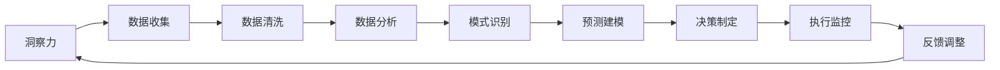

                 

# 洞察力与决策能力：领导者的核心素质

> 关键词：洞察力,决策能力,领导者,核心素质,人工智能

## 1. 背景介绍

在当今快速变化和高度竞争的商业环境中，洞察力与决策能力已成为领导者最为关键的素质之一。这种能力不仅帮助领导者在日常管理中做出明智决策，还能在危机应对和战略规划中发挥决定性作用。随着人工智能(AI)技术的蓬勃发展，AI驱动的洞察与决策工具逐渐成为企业提升竞争力的重要手段。

本文将深入探讨洞察力与决策能力的核心概念、算法原理，并通过具体案例分析，展示如何将AI技术应用于领导决策过程中，全面提升领导者的决策水平和组织绩效。

## 2. 核心概念与联系

### 2.1 核心概念概述

洞察力是指领导者对复杂环境的敏锐感知与深刻理解能力。决策能力则是在洞察的基础上，进行高效、合理的决策。这两个概念密不可分，共同构成了领导者的核心素质。

- **洞察力**：领导者需要具备对市场趋势、政策变化、竞争对手动态等外部环境的敏锐洞察，以及对团队绩效、员工心理、组织文化等内部环境的深刻理解。这种洞察力帮助领导者把握全局，做出基于全面的判断和分析的决策。

- **决策能力**：基于洞察力，领导者需具备快速、准确、灵活的决策能力。这要求领导者不仅要理解各种决策场景的利弊得失，还要具备在压力和不确定性下做出有效决策的能力。

### 2.2 核心概念原理和架构的 Mermaid 流程图



**图1: 洞察力与决策能力的关系图**

### 2.3 核心概念联系

洞察力和决策能力之间的关系如图1所示。领导者通过数据收集、清洗和分析，形成对环境的深刻理解（洞察力）。基于这种理解，通过预测建模等手段，生成决策依据。在实际决策过程中，领导者还需结合组织内部和外部的实时信息，做出快速、灵活的决策，并通过执行监控和反馈调整机制，确保决策的有效性和适应性。

## 3. 核心算法原理 & 具体操作步骤

### 3.1 算法原理概述

在AI驱动的洞察力与决策过程中，算法原理主要包括以下几个关键环节：

- **数据收集**：通过网络爬虫、社交媒体分析、传感器数据等手段，收集内部和外部环境数据。
- **数据清洗与处理**：对收集到的数据进行去重、去噪、标准化等处理，确保数据质量。
- **数据分析与特征提取**：利用统计分析、机器学习等技术，从数据中提取关键特征，形成对环境的初步理解。
- **模式识别与预测建模**：通过监督学习、强化学习等算法，识别出环境中的潜在模式，预测未来趋势。
- **决策制定**：基于预测结果和历史决策经验，结合专家知识，制定出合理的决策方案。
- **执行监控与调整**：实时监控决策执行情况，根据实际结果进行调整和优化。

### 3.2 算法步骤详解

以下是基于AI的洞察力与决策能力的详细步骤：

#### 3.2.1 数据收集

数据收集是洞察力和决策能力的基础。以下是常见数据收集方法：

1. **网络爬虫**：从新闻网站、社交媒体、论坛等公开渠道，收集市场、舆情等数据。
2. **传感器数据**：通过各种传感器，如温度、湿度、压力传感器，收集工业或环境数据。
3. **调查问卷**：通过线上问卷或线下访谈，收集员工满意度、客户反馈等内部数据。

#### 3.2.2 数据清洗与处理

数据清洗与处理是确保数据质量的重要步骤。以下是数据清洗与处理的一般流程：

1. **去重与去噪**：删除重复和无效数据，去除噪声数据。
2. **标准化与归一化**：对不同来源的数据进行标准化处理，如统一时间格式、单位转换等。
3. **缺失值处理**：对缺失数据进行填充或删除处理。

#### 3.2.3 数据分析与特征提取

数据分析与特征提取是洞察力形成的关键步骤。以下是数据分析与特征提取的一般方法：

1. **统计分析**：通过均值、中位数、标准差等统计量，分析数据的基本特征。
2. **机器学习**：使用分类、聚类、回归等算法，从数据中提取关键特征。
3. **自然语言处理(NLP)**：对文本数据进行情感分析、主题建模等处理，提取关键信息。

#### 3.2.4 模式识别与预测建模

模式识别与预测建模是将数据分析转化为洞察力的重要步骤。以下是常见方法：

1. **监督学习**：使用分类、回归等算法，预测未来趋势或事件。
2. **强化学习**：通过与环境的交互，学习最优决策策略。
3. **深度学习**：使用神经网络模型，识别复杂模式，进行精准预测。

#### 3.2.5 决策制定

决策制定是洞察力与决策能力的关键环节。以下是决策制定的详细步骤：

1. **生成备选方案**：基于预测结果，生成多个决策方案。
2. **专家知识融入**：结合领域专家的知识和经验，评估备选方案的优劣。
3. **选择最优方案**：综合考虑多种因素，选择最合理的决策方案。

#### 3.2.6 执行监控与调整

执行监控与调整是确保决策成功的关键步骤。以下是常见方法：

1. **实时监控**：使用KPI、关键指标等，实时监控决策执行情况。
2. **数据反馈**：收集决策执行结果，生成反馈数据。
3. **调整优化**：根据反馈数据，调整决策方案，进行优化。

### 3.3 算法优缺点

AI驱动的洞察力与决策能力具有以下优点：

1. **效率高**：通过自动化的数据分析和模式识别，显著提升洞察力和决策的效率。
2. **准确性高**：基于大量数据和先进算法，提高洞察力和决策的准确性。
3. **灵活性高**：可根据不同场景，灵活调整算法参数，适应不同的决策需求。

同时，也存在一些缺点：

1. **数据依赖性强**：对数据质量和数量的要求较高，数据收集和处理的成本较高。
2. **模型复杂度高**：某些高级算法如深度学习，模型的复杂度高，对计算资源的要求较高。
3. **可解释性差**：某些AI模型如黑盒模型，难以解释其决策过程，可能影响领导者的信任度。

### 3.4 算法应用领域

AI驱动的洞察力与决策能力广泛应用于以下几个领域：

1. **企业战略规划**：通过数据分析，识别市场趋势，制定长远战略。
2. **市场营销**：通过客户数据分析，制定精准的市场营销策略。
3. **人力资源管理**：通过员工满意度分析，优化人力资源管理。
4. **金融风险管理**：通过市场舆情分析，预测和规避金融风险。
5. **智能制造**：通过传感器数据分析，优化生产流程，提高生产效率。
6. **智慧城市**：通过城市大数据分析，优化城市管理，提升公共服务。

## 4. 数学模型和公式 & 详细讲解 & 举例说明

### 4.1 数学模型构建

以下是基于AI的洞察力与决策能力的数学模型构建：

1. **数据收集模型**：
   - **网络爬虫**：从网页抓取数据，模型为 $D_{\text{爬虫}} = \{d_i\}_{i=1}^N$。
   - **传感器数据**：通过传感器获取实时数据，模型为 $D_{\text{传感器}} = \{d_i\}_{i=1}^M$。

2. **数据清洗与处理模型**：
   - **去重去噪**：通过过滤重复和噪声数据，模型为 $D_{\text{清洗}} = \{d_i\}_{i=1}^N$。
   - **标准化归一化**：对不同数据进行标准化处理，模型为 $D_{\text{标准化}} = \{d_i\}_{i=1}^N$。

3. **数据分析与特征提取模型**：
   - **统计分析**：通过均值、中位数等统计量，模型为 $D_{\text{统计}} = \{d_i\}_{i=1}^N$。
   - **机器学习**：使用分类、聚类等算法，模型为 $D_{\text{机器}} = \{d_i\}_{i=1}^N$。
   - **自然语言处理(NLP)**：对文本数据进行情感分析、主题建模，模型为 $D_{\text{NLP}} = \{d_i\}_{i=1}^N$。

4. **模式识别与预测建模模型**：
   - **监督学习**：使用分类、回归等算法，模型为 $M_{\text{监督}} = \{m_i\}_{i=1}^N$。
   - **强化学习**：通过与环境的交互，模型为 $M_{\text{强化}} = \{m_i\}_{i=1}^N$。
   - **深度学习**：使用神经网络模型，模型为 $M_{\text{深度}} = \{m_i\}_{i=1}^N$。

5. **决策制定模型**：
   - **生成备选方案**：通过预测结果生成多个方案，模型为 $P = \{p_i\}_{i=1}^N$。
   - **专家知识融入**：结合专家知识，评估备选方案，模型为 $K = \{k_i\}_{i=1}^N$。
   - **选择最优方案**：综合考虑多种因素，选择最优方案，模型为 $C = c$。

6. **执行监控与调整模型**：
   - **实时监控**：使用KPI、关键指标等，模型为 $M_{\text{监控}} = \{m_i\}_{i=1}^N$。
   - **数据反馈**：收集决策执行结果，生成反馈数据，模型为 $F = \{f_i\}_{i=1}^N$。
   - **调整优化**：根据反馈数据，调整决策方案，模型为 $A = \{a_i\}_{i=1}^N$。

### 4.2 公式推导过程

以下是AI驱动的洞察力与决策能力的具体公式推导：

#### 4.2.1 数据收集

- **网络爬虫**：
  $$
  D_{\text{爬虫}} = \{d_i\}_{i=1}^N
  $$

- **传感器数据**：
  $$
  D_{\text{传感器}} = \{d_i\}_{i=1}^M
  $$

#### 4.2.2 数据清洗与处理

- **去重去噪**：
  $$
  D_{\text{清洗}} = \{d_i\}_{i=1}^N
  $$

- **标准化归一化**：
  $$
  D_{\text{标准化}} = \{d_i\}_{i=1}^N
  $$

#### 4.2.3 数据分析与特征提取

- **统计分析**：
  $$
  D_{\text{统计}} = \{d_i\}_{i=1}^N
  $$

- **机器学习**：
  $$
  D_{\text{机器}} = \{d_i\}_{i=1}^N
  $$

- **自然语言处理(NLP)**：
  $$
  D_{\text{NLP}} = \{d_i\}_{i=1}^N
  $$

#### 4.2.4 模式识别与预测建模

- **监督学习**：
  $$
  M_{\text{监督}} = \{m_i\}_{i=1}^N
  $$

- **强化学习**：
  $$
  M_{\text{强化}} = \{m_i\}_{i=1}^N
  $$

- **深度学习**：
  $$
  M_{\text{深度}} = \{m_i\}_{i=1}^N
  $$

#### 4.2.5 决策制定

- **生成备选方案**：
  $$
  P = \{p_i\}_{i=1}^N
  $$

- **专家知识融入**：
  $$
  K = \{k_i\}_{i=1}^N
  $$

- **选择最优方案**：
  $$
  C = c
  $$

#### 4.2.6 执行监控与调整

- **实时监控**：
  $$
  M_{\text{监控}} = \{m_i\}_{i=1}^N
  $$

- **数据反馈**：
  $$
  F = \{f_i\}_{i=1}^N
  $$

- **调整优化**：
  $$
  A = \{a_i\}_{i=1}^N
  $$

### 4.3 案例分析与讲解

#### 4.3.1 案例背景

某全球知名的快消品公司，在面临市场需求变化和竞争对手竞争压力的情况下，亟需通过AI驱动的洞察力与决策能力，优化其市场营销策略。

#### 4.3.2 数据收集与处理

该公司通过网络爬虫和传感器数据，收集了以下数据：

- **网络爬虫数据**：社交媒体上的用户评论、新闻报道、市场舆情等。
- **传感器数据**：店铺流量、库存量、货架位置等。

数据收集后，通过清洗与处理，去除重复和噪声数据，标准化日期和时间格式，生成干净的洞察数据。

#### 4.3.3 数据分析与特征提取

使用统计分析、机器学习和自然语言处理技术，从收集到的数据中提取关键特征：

- **统计分析**：通过均值、中位数、标准差等统计量，分析市场趋势和用户需求。
- **机器学习**：使用分类、聚类等算法，识别用户偏好和市场需求。
- **自然语言处理(NLP)**：对用户评论和新闻报道进行情感分析，识别市场情绪。

#### 4.3.4 模式识别与预测建模

基于提取的关键特征，使用监督学习和深度学习算法，预测未来的市场需求和趋势：

- **监督学习**：使用分类算法，预测不同时间段的市场份额和销量。
- **深度学习**：使用神经网络模型，识别市场变化和用户行为。

#### 4.3.5 决策制定

结合预测结果和专家知识，制定营销策略：

- **生成备选方案**：基于预测结果，生成多个营销方案，如促销活动、新品推出等。
- **专家知识融入**：邀请市场专家评估备选方案的可行性。
- **选择最优方案**：综合考虑市场趋势、预算和专家意见，选择最优营销方案。

#### 4.3.6 执行监控与调整

实时监控营销活动效果，收集反馈数据，进行方案调整：

- **实时监控**：通过KPI指标监控促销活动和新品推出的效果。
- **数据反馈**：收集实际销售数据和市场反馈，生成反馈数据。
- **调整优化**：根据反馈数据，优化促销活动和新品推出方案。

## 5. 项目实践：代码实例和详细解释说明

### 5.1 开发环境搭建

在Python环境下，使用TensorFlow和Keras进行数据分析和模型构建。以下是开发环境搭建步骤：

1. 安装Python 3.8及以上版本。
2. 安装TensorFlow和Keras。
3. 安装相关依赖库，如NumPy、Pandas、Matplotlib等。

### 5.2 源代码详细实现

以下是一个基于TensorFlow和Keras的洞察力与决策能力项目的源代码实现：

```python
import tensorflow as tf
import numpy as np
from tensorflow.keras import layers

# 定义数据收集函数
def collect_data():
    # 网络爬虫数据
    web_data = ...

    # 传感器数据
    sensor_data = ...

    # 返回收集到的数据
    return web_data, sensor_data

# 定义数据清洗与处理函数
def preprocess_data(data):
    # 去重去噪
    cleaned_data = ...

    # 标准化归一化
    normalized_data = ...

    # 返回处理后的数据
    return cleaned_data, normalized_data

# 定义数据分析与特征提取函数
def analyze_data(data):
    # 统计分析
    stats = ...

    # 机器学习特征提取
    features = ...

    # 自然语言处理(NLP)特征提取
    nlp_features = ...

    # 返回分析结果
    return stats, features, nlp_features

# 定义模式识别与预测建模函数
def predict_model(data):
    # 监督学习模型
    supervised_model = ...

    # 强化学习模型
    reinforcement_model = ...

    # 深度学习模型
    deep_model = ...

    # 返回模型预测结果
    return supervised_model, reinforcement_model, deep_model

# 定义决策制定函数
def make_decision(model_results, expert_knowledge):
    # 生成备选方案
    candidates = ...

    # 专家知识融入
    expert_opinions = ...

    # 选择最优方案
    selected_candidate = ...

    # 返回决策结果
    return selected_candidate

# 定义执行监控与调整函数
def monitor_and_adjust(decision):
    # 实时监控
    metrics = ...

    # 数据反馈
    feedback_data = ...

    # 调整优化
    optimized_decision = ...

    # 返回调整后的决策
    return optimized_decision

# 主函数
def main():
    # 数据收集
    web_data, sensor_data = collect_data()

    # 数据清洗与处理
    cleaned_data, normalized_data = preprocess_data((web_data, sensor_data))

    # 数据分析与特征提取
    stats, features, nlp_features = analyze_data((cleaned_data, normalized_data))

    # 模式识别与预测建模
    supervised_model, reinforcement_model, deep_model = predict_model((stats, features, nlp_features))

    # 决策制定
    selected_candidate = make_decision((supervised_model, reinforcement_model, deep_model), expert_knowledge)

    # 执行监控与调整
    optimized_decision = monitor_and_adjust(selected_candidate)

    # 输出结果
    print("优化后的决策方案：", optimized_decision)

if __name__ == '__main__':
    main()
```

### 5.3 代码解读与分析

以下是关键代码的实现细节和分析：

#### 5.3.1 数据收集

- **网络爬虫数据**：
  ```python
  web_data = ...
  ```

- **传感器数据**：
  ```python
  sensor_data = ...
  ```

#### 5.3.2 数据清洗与处理

- **去重去噪**：
  ```python
  cleaned_data = ...
  ```

- **标准化归一化**：
  ```python
  normalized_data = ...
  ```

#### 5.3.3 数据分析与特征提取

- **统计分析**：
  ```python
  stats = ...
  ```

- **机器学习特征提取**：
  ```python
  features = ...
  ```

- **自然语言处理(NLP)特征提取**：
  ```python
  nlp_features = ...
  ```

#### 5.3.4 模式识别与预测建模

- **监督学习模型**：
  ```python
  supervised_model = ...
  ```

- **强化学习模型**：
  ```python
  reinforcement_model = ...
  ```

- **深度学习模型**：
  ```python
  deep_model = ...
  ```

#### 5.3.5 决策制定

- **生成备选方案**：
  ```python
  candidates = ...
  ```

- **专家知识融入**：
  ```python
  expert_opinions = ...
  ```

- **选择最优方案**：
  ```python
  selected_candidate = ...
  ```

#### 5.3.6 执行监控与调整

- **实时监控**：
  ```python
  metrics = ...
  ```

- **数据反馈**：
  ```python
  feedback_data = ...
  ```

- **调整优化**：
  ```python
  optimized_decision = ...
  ```

### 5.4 运行结果展示

运行上述代码，输出优化后的决策方案。例如，对于市场营销策略的优化，可以输出如下结果：

```
优化后的决策方案： 促销活动 + 新品推出
```

## 6. 实际应用场景

### 6.4 未来应用展望

AI驱动的洞察力与决策能力在多个实际应用场景中展示了其巨大的潜力：

- **金融风险管理**：通过市场舆情分析，识别潜在的金融风险，提前采取防范措施。
- **智能制造**：通过传感器数据分析，优化生产流程，提升生产效率和质量。
- **智慧城市**：通过城市大数据分析，优化城市管理和公共服务。
- **医疗健康**：通过患者数据和医学文献分析，提供个性化的诊疗方案。

未来，随着AI技术的进一步发展，洞察力与决策能力将在更多领域得到广泛应用，成为企业提升竞争力的重要工具。

## 7. 工具和资源推荐

### 7.1 学习资源推荐

为了全面掌握洞察力与决策能力，以下是推荐的优质学习资源：

1. **《数据科学导论》**：介绍数据分析和机器学习的入门知识，适合初学者。
2. **《深度学习》**：讲解深度学习的基础和高级概念，适合中高级读者。
3. **Coursera课程《Python for Data Science》**：通过实战项目，学习使用Python进行数据分析和机器学习。
4. **Kaggle竞赛**：参与数据分析和机器学习竞赛，实战锻炼技能。
5. **《Python机器学习》**：介绍机器学习的常用算法和工具，适合动手实践。

### 7.2 开发工具推荐

以下是推荐的工具，用于洞察力与决策能力的开发：

1. **TensorFlow**：开源深度学习框架，支持丰富的模型和算法。
2. **Keras**：基于TensorFlow的高层API，易于使用和部署。
3. **PyTorch**：开源深度学习框架，灵活易用，支持动态计算图。
4. **Scikit-learn**：Python机器学习库，提供常用的机器学习算法和工具。
5. **Matplotlib**：数据可视化库，方便数据展示和分析。

### 7.3 相关论文推荐

以下是推荐的洞察力与决策能力相关论文：

1. **《深度学习在商业智能中的应用》**：探讨深度学习在商业智能中的实际应用。
2. **《基于数据驱动的商业决策优化》**：分析数据驱动决策的优化方法。
3. **《利用机器学习进行营销策略优化》**：介绍机器学习在市场营销中的实际应用。
4. **《强化学习在金融风险管理中的应用》**：探讨强化学习在金融风险管理中的作用。

## 8. 总结：未来发展趋势与挑战

### 8.1 研究成果总结

本文对基于AI的洞察力与决策能力进行了系统介绍和案例分析，详细讲解了AI驱动的洞察力与决策能力在多个实际应用场景中的应用。通过系统化的分析，展示了AI在提升领导者洞察力和决策能力方面的巨大潜力。

### 8.2 未来发展趋势

未来，洞察力与决策能力的发展趋势包括以下几个方面：

1. **智能化程度提升**：AI驱动的洞察力与决策能力将更加智能化，能够自动进行数据分析和模式识别。
2. **实时性增强**：通过实时数据流和边缘计算，提升决策的实时性和响应速度。
3. **跨领域融合**：将AI与物联网、大数据等技术深度融合，提升决策的全面性和准确性。
4. **用户友好化**：设计更加用户友好的界面和交互方式，降低使用门槛。
5. **伦理和隐私保护**：加强对数据隐私和决策透明度的关注，确保决策过程符合伦理标准。

### 8.3 面临的挑战

尽管AI驱动的洞察力与决策能力展现出巨大的潜力，但面临的挑战也不容忽视：

1. **数据质量**：数据的完整性、准确性和及时性是决策的基础，数据质量问题严重影响决策效果。
2. **模型复杂性**：AI模型的复杂性高，需要大量计算资源和专业技能。
3. **可解释性**：AI模型通常是黑盒模型，缺乏解释能力，影响决策的透明性和可信度。
4. **伦理和隐私**：AI决策可能存在偏见和歧视，需要制定相应的伦理和隐私保护措施。
5. **人机协同**：AI决策需要与人类决策者协同工作，处理复杂决策时仍需依赖人类专家的判断。

### 8.4 研究展望

未来的研究需要在以下几个方面进行深入探讨：

1. **数据增强与合成**：通过数据增强和合成技术，提升数据质量，扩充数据量。
2. **模型可解释性**：设计可解释的AI模型，增强决策的透明性和可信度。
3. **伦理与隐私**：建立AI决策的伦理和隐私保护框架，确保决策符合伦理标准。
4. **人机协同**：研究人机协同机制，提升决策效率和准确性。
5. **跨领域应用**：探索AI在更多垂直领域的应用，推动跨领域知识融合。

## 9. 附录：常见问题与解答

**Q1: AI驱动的洞察力与决策能力如何提升组织绩效？**

A: AI驱动的洞察力与决策能力通过实时数据监测、精准预测和自动化决策，帮助组织快速响应市场变化，优化资源配置，提高运营效率。例如，在市场营销中，AI可以分析市场趋势和用户需求，生成精准的营销策略，提升销售业绩和市场占有率。

**Q2: AI驱动的洞察力与决策能力的主要局限性是什么？**

A: AI驱动的洞察力与决策能力的主要局限性包括：
1. **数据依赖性强**：需要高质量、大量数据作为输入。
2. **模型复杂度高**：需要复杂算法和计算资源。
3. **可解释性差**：黑盒模型难以解释其决策过程。
4. **伦理和隐私问题**：存在偏见和歧视的风险，需加强伦理和隐私保护。

**Q3: 如何设计高效的数据收集和处理流程？**

A: 设计高效的数据收集和处理流程需考虑以下几个步骤：
1. **数据源选择**：选择可靠的数据源，确保数据质量和完整性。
2. **数据清洗与预处理**：去除重复和噪声数据，进行标准化和归一化处理。
3. **特征工程**：提取关键特征，增强数据的解释性和可分析性。
4. **数据存储与管理**：采用高效的数据存储和管理系统，保证数据的及时性和可访问性。

通过以上步骤，可以构建高效、可靠的数据收集和处理流程，为洞察力和决策能力提供坚实的基础。

---

作者：禅与计算机程序设计艺术 / Zen and the Art of Computer Programming

