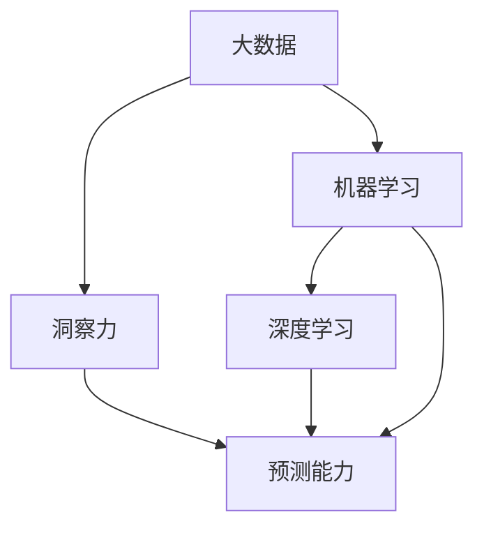

                 

# 洞察力与预测能力：未来学的核心素质

> 关键词：洞察力, 预测能力, 未来学, 人工智能, 机器学习, 深度学习, 大数据, 智能决策

## 1. 背景介绍

### 1.1 问题由来
在数字化时代，信息爆炸与日俱增，未来发展的不确定性日益增大。为了应对未来世界的多变和未知，掌握洞察力和预测能力成为必不可少的核心素质。未来学（Futurology），即对未来发展趋势的研究和预测，成为众多领域的重要参考。

### 1.2 问题核心关键点
未来学依赖于对历史数据和趋势的深度分析，以及建立准确的预测模型。其核心关键点在于：

- 数据处理与分析：获取并处理海量数据，从中提取有用信息和知识。
- 模型构建与训练：利用统计学、机器学习等方法，构建预测模型。
- 结果解读与优化：解释模型结果，并通过反馈进行模型优化。

掌握这些关键点，能够帮助我们更好地理解和预测未来的发展趋势，为个人和组织做出更为明智的决策。

### 1.3 问题研究意义
在未来学研究中，洞察力和预测能力尤为重要。这些能力可以帮助我们：

- 理解复杂系统：通过分析数据，揭示系统运行的内在规律和关键因素。
- 预测未来趋势：利用模型预测未来可能的发展方向和变化，制定应对策略。
- 做出智能决策：基于洞察和预测，做出更为科学和合理的决策，规避风险。

在未来学应用中，洞察力和预测能力对社会治理、经济发展、科技创新等领域具有重要意义。

## 2. 核心概念与联系

### 2.1 核心概念概述

为了更好地理解未来学的核心素质，本节将介绍几个密切相关的核心概念：

- 洞察力（Insight）：指通过深度分析和逻辑推理，揭示事物本质的能力。
- 预测能力（Prediction）：指利用历史数据和模型，预测未来发展趋势的能力。
- 大数据（Big Data）：指通过分析海量数据，挖掘有价值信息的过程。
- 机器学习（Machine Learning）：指通过训练数据模型，让机器从数据中学习规律并进行预测。
- 深度学习（Deep Learning）：指利用神经网络，处理复杂非线性问题的学习方式。
- 智能决策（Intelligent Decision Making）：指基于洞察力和预测能力，做出科学决策的过程。

这些概念之间存在密切联系，通过数据驱动的洞察和预测，智能决策得以实现。

### 2.2 核心概念原理和架构的 Mermaid 流程图



这个流程图展示了各个核心概念之间的关系：

- 大数据是洞察力和预测能力的基础。
- 机器学习和深度学习为预测能力提供了模型和算法支持。
- 洞察力与预测能力共同作用，辅助智能决策。

## 3. 核心算法原理 & 具体操作步骤

### 3.1 算法原理概述

在未来学的核心算法中，数据处理、模型构建和结果解读是最关键的三步。这些步骤通过以下逻辑展开：

1. **数据处理与分析**：从海量数据中提取有用信息，构建数据集。
2. **模型构建与训练**：利用机器学习和深度学习算法，构建预测模型，并进行训练。
3. **结果解读与优化**：解释模型预测结果，根据结果进行模型优化。

### 3.2 算法步骤详解

#### 3.2.1 数据预处理

数据预处理包括数据清洗、特征提取和数据分割。以股票价格预测为例，数据预处理步骤如下：

1. **数据清洗**：去除缺失值、异常值，确保数据质量。
2. **特征提取**：选择影响股票价格的特征，如历史股价、交易量、公司财报等。
3. **数据分割**：将数据集分为训练集、验证集和测试集，分别用于模型训练、调优和测试。

#### 3.2.2 模型构建与训练

常用的机器学习模型包括线性回归、决策树、随机森林等。以线性回归模型为例，步骤包括：

1. **模型定义**：定义线性回归模型 $y = \theta_0 + \theta_1 x_1 + \theta_2 x_2 + \ldots + \theta_n x_n$。
2. **损失函数**：选择损失函数，如均方误差（Mean Squared Error）。
3. **优化算法**：使用梯度下降算法优化模型参数 $\theta$。

### 3.3 算法优缺点

#### 3.3.1 优点

- **精度高**：利用大数据和复杂模型，能够提高预测准确度。
- **灵活性高**：适用于多种预测任务，如股票价格、天气变化、经济增长等。
- **自动化强**：通过模型训练和优化，减少人工干预。

#### 3.3.2 缺点

- **数据依赖强**：预测结果高度依赖于数据质量和特征选择。
- **模型复杂度高**：深度学习模型可能需要大量计算资源和时间。
- **解释性差**：黑盒模型难以解释预测过程。

### 3.4 算法应用领域

未来学的算法在金融、气象、交通等领域有广泛应用：

- **金融预测**：利用历史数据预测股票、货币等金融资产价格变化。
- **气象预报**：通过气象数据预测未来天气情况。
- **交通管理**：预测交通流量，优化交通信号灯控制。

## 4. 数学模型和公式 & 详细讲解 & 举例说明

### 4.1 数学模型构建

本节将使用数学语言对未来学的预测模型进行详细讲解。

设有一组历史数据 $\{x_i,y_i\}_{i=1}^N$，其中 $x_i = (x_{i1}, x_{i2}, \ldots, x_{in})$ 为特征向量，$y_i$ 为对应的目标变量。预测模型 $M$ 可以通过以下公式表示：

$$ M(x) = \theta_0 + \theta_1 x_1 + \theta_2 x_2 + \ldots + \theta_n x_n $$

其中 $\theta$ 为模型参数，需要通过训练数据优化。

### 4.2 公式推导过程

以线性回归为例，预测模型参数 $\theta$ 的优化目标为最小化预测误差。损失函数为：

$$ \mathcal{L}(\theta) = \frac{1}{2N} \sum_{i=1}^N (y_i - M(x_i))^2 $$

使用梯度下降算法更新模型参数：

$$ \theta_j \leftarrow \theta_j - \frac{\alpha}{N} \sum_{i=1}^N (y_i - M(x_i)) \frac{\partial M(x_i)}{\partial x_j} $$

其中 $\alpha$ 为学习率。

### 4.3 案例分析与讲解

以房价预测为例，通过历史数据构建线性回归模型，步骤如下：

1. **数据准备**：收集历史房屋销售数据，包括房屋面积、地理位置等特征。
2. **模型构建**：定义线性回归模型 $y = \theta_0 + \theta_1 x_1 + \theta_2 x_2$，其中 $y$ 为房屋价格，$x_1$ 为房屋面积，$x_2$ 为地理位置。
3. **模型训练**：使用梯度下降算法，优化模型参数 $\theta$。
4. **结果评估**：在测试集上评估模型预测精度，调整模型参数。

## 5. 项目实践：代码实例和详细解释说明

### 5.1 开发环境搭建

在进行未来学项目实践前，我们需要准备好开发环境。以下是使用Python进行Scikit-learn开发的流程：

1. 安装Anaconda：从官网下载并安装Anaconda，用于创建独立的Python环境。
2. 创建并激活虚拟环境：
```bash
conda create -n futurology python=3.8 
conda activate futurology
```
3. 安装Scikit-learn：
```bash
conda install scikit-learn
```
4. 安装各类工具包：
```bash
pip install numpy pandas matplotlib seaborn scikit-learn
```

完成上述步骤后，即可在`futurology`环境中开始未来学项目实践。

### 5.2 源代码详细实现

以房价预测为例，给出使用Scikit-learn进行线性回归模型训练的Python代码实现：

```python
from sklearn.linear_model import LinearRegression
from sklearn.metrics import mean_squared_error
from sklearn.model_selection import train_test_split

# 准备数据
X = df[['area', 'location']]
y = df['price']

# 划分数据集
X_train, X_test, y_train, y_test = train_test_split(X, y, test_size=0.2, random_state=42)

# 建立模型
model = LinearRegression()

# 训练模型
model.fit(X_train, y_train)

# 预测和评估
y_pred = model.predict(X_test)
mse = mean_squared_error(y_test, y_pred)
print(f"MSE: {mse:.3f}")
```

### 5.3 代码解读与分析

让我们再详细解读一下关键代码的实现细节：

**数据准备**：
- 从数据框（DataFrame）中提取房屋面积、地理位置等特征。
- 设定目标变量为房屋价格。

**模型训练**：
- 使用`train_test_split`函数将数据集分为训练集和测试集。
- 创建线性回归模型，使用训练集数据进行训练。

**预测和评估**：
- 在测试集上使用模型进行预测。
- 计算均方误差（MSE），评估模型预测精度。

## 6. 实际应用场景

### 6.1 金融预测

在金融领域，未来学的算法可用于预测股票价格、货币汇率等。通过分析历史数据和市场趋势，预测未来的市场走向，辅助投资决策。

### 6.2 天气预报

气象预测是未来学的重要应用之一。通过分析气象数据，预测未来的天气变化，如气温、降水量等，为农业、交通等领域提供科学依据。

### 6.3 交通管理

交通流量预测是未来学的另一个重要应用。通过分析历史交通数据，预测未来的交通流量，优化交通信号灯控制，提升城市交通效率。

### 6.4 未来应用展望

未来学算法将不断拓展应用领域，提高预测精度和效率。未来展望包括：

- **实时预测**：利用大数据和实时数据，进行实时预测，提高决策效率。
- **跨领域应用**：未来学算法在更多领域得到应用，如医疗、教育、安全等。
- **自动化决策**：结合智能决策系统，实现自动化的智能决策过程。

## 7. 工具和资源推荐

### 7.1 学习资源推荐

为了帮助开发者掌握未来学的理论基础和实践技巧，这里推荐一些优质的学习资源：

1. 《未来学基础》系列博文：由未来学专家撰写，系统介绍未来学的基本概念和应用方法。
2. Coursera《未来学导论》课程：斯坦福大学开设的未来学课程，涵盖未来学的基本原理和分析方法。
3. 《大数据与未来学》书籍：系统讲解大数据在未来学中的应用，深入分析未来趋势。
4. Kaggle未来学竞赛：通过实际项目练习，提升数据分析和模型构建能力。
5. 未来学研究机构网站：提供未来学研究论文、会议和报告，了解最新研究成果。

通过对这些资源的学习实践，相信你一定能够快速掌握未来学的核心能力，并用于解决实际的预测问题。

### 7.2 开发工具推荐

高效的开发离不开优秀的工具支持。以下是几款用于未来学开发的常用工具：

1. Python：作为数据分析和机器学习的语言，Python简单易用，支持Scikit-learn等强大库。
2. Jupyter Notebook：交互式开发环境，支持代码编写、数据可视化、结果展示等。
3. TensorBoard：TensorFlow配套的可视化工具，可实时监测模型训练状态，提供丰富的图表呈现方式。
4. Weights & Biases：模型训练的实验跟踪工具，记录和可视化模型训练过程中的各项指标，方便对比和调优。
5. D3.js：数据可视化工具，支持创建复杂的交互式图表，增强数据展示效果。

合理利用这些工具，可以显著提升未来学项目开发的效率，加快创新迭代的步伐。

### 7.3 相关论文推荐

未来学研究源于学界的持续研究。以下是几篇奠基性的相关论文，推荐阅读：

1. The Future of Employment: How Susceptible are Jobs to Computerisation?：揭示未来就业趋势，探讨机器替代人类的可能性。
2. Artificial Intelligence: A Guide for Thinking Humans：讲述AI技术的发展历程和应用前景，理解未来技术的本质。
3. The World in 2050：通过数据分析和模型构建，预测未来世界的发展趋势。
4. Understanding Artificial Intelligence：深入浅出地介绍AI的基本原理和应用，为未来学研究提供理论支持。
5. The Age of Artificial Intelligence：探讨AI技术对社会的影响和未来挑战，提供系统性分析。

这些论文代表了大语言模型微调技术的发展脉络。通过学习这些前沿成果，可以帮助研究者把握学科前进方向，激发更多的创新灵感。

## 8. 总结：未来发展趋势与挑战

### 8.1 总结

本文对未来学的核心素质进行了全面系统的介绍。首先阐述了未来学的研究背景和意义，明确了洞察力和预测能力在未来发展中的关键作用。其次，从原理到实践，详细讲解了未来学的数学模型和关键步骤，给出了未来学项目开发的完整代码实例。同时，本文还广泛探讨了未来学算法在金融预测、天气预报、交通管理等多个行业领域的应用前景，展示了未来学范式的巨大潜力。此外，本文精选了未来学技术的各类学习资源，力求为读者提供全方位的技术指引。

通过本文的系统梳理，可以看到，未来学的算法和工具为理解和预测未来世界的发展趋势提供了有力支持。未来学不仅有助于社会治理、经济发展、科技创新等领域做出更为科学的决策，还能为个人发展提供指导，帮助我们在未知的领域中更好地把握机遇和挑战。

### 8.2 未来发展趋势

展望未来，未来学算法将呈现以下几个发展趋势：

1. **数据质量提升**：随着数据采集技术的进步和数据清洗技术的提升，未来学的数据质量将进一步提高。
2. **模型精度优化**：通过不断优化模型算法和参数，未来学预测的精度将进一步提升。
3. **跨领域融合**：未来学算法与其他领域技术如物联网、人工智能等进行融合，拓展应用范围。
4. **自动化增强**：未来学的自动化决策和预测系统将逐步实现，提升效率和效果。
5. **实时预测能力**：结合实时数据，实现实时预测，增强决策的及时性和准确性。
6. **伦理和安全考量**：未来学算法在应用过程中，将更加注重数据隐私和算法伦理，确保技术应用的透明性和安全性。

以上趋势凸显了未来学算法在智能化和自动化方面的巨大潜力，这些方向的探索发展，必将进一步提升未来学算法的性能和应用范围，为社会治理、经济发展等领域提供新的技术支撑。

### 8.3 面临的挑战

尽管未来学算法已经取得了显著进展，但在迈向更加智能化和自动化应用的过程中，仍面临诸多挑战：

1. **数据获取难度大**：高质量、实时的数据采集和处理仍然是一个难题，数据不足将限制预测的准确性。
2. **模型复杂度高**：未来学的算法模型往往较为复杂，需要大量计算资源和时间。
3. **模型可解释性差**：黑盒模型难以解释预测过程，影响决策的可信度和接受度。
4. **伦理和安全问题**：预测模型的偏见、隐私泄露等问题需要谨慎对待。
5. **跨领域应用挑战**：将未来学算法应用于不同领域时，需要考虑数据特征和应用场景的差异。

解决这些挑战，需要进一步的技术创新和伦理规范的建立。

### 8.4 研究展望

未来学算法的研究需要在以下几个方面寻求新的突破：

1. **数据增强技术**：开发更多数据增强技术，提升数据质量和多样性。
2. **模型简化和优化**：通过模型简化和优化，提高模型效率和可解释性。
3. **跨领域知识融合**：将不同领域的数据和知识进行融合，提升预测的全面性和准确性。
4. **伦理和隐私保护**：建立数据隐私保护机制，确保算法的伦理和透明性。
5. **人机协同决策**：开发人机协同系统，将人类专家的经验和判断融入预测过程。

这些研究方向将有助于未来学算法更好地服务于社会治理、经济发展等领域，推动技术应用的普惠性和公正性。

## 9. 附录：常见问题与解答

**Q1：未来学的核心素质是什么？**

A: 未来学的核心素质包括洞察力和预测能力。洞察力指通过深度分析和逻辑推理，揭示事物本质的能力。预测能力指利用历史数据和模型，预测未来发展趋势的能力。

**Q2：未来学的算法有哪些？**

A: 常用的未来学算法包括线性回归、决策树、随机森林、支持向量机等。深度学习模型如神经网络在复杂预测任务中也有广泛应用。

**Q3：未来学算法在金融预测中的应用有哪些？**

A: 金融预测包括股票价格预测、货币汇率预测、市场趋势预测等。通过历史数据和市场分析，预测未来的金融市场变化，辅助投资决策。

**Q4：未来学算法的优点和缺点是什么？**

A: 优点包括精度高、自动化强、适用于多种预测任务。缺点包括数据依赖强、模型复杂度高、解释性差。

**Q5：未来学算法的应用领域有哪些？**

A: 未来学算法在金融预测、天气预报、交通管理、医疗诊断等领域有广泛应用。

---

作者：禅与计算机程序设计艺术 / Zen and the Art of Computer Programming

