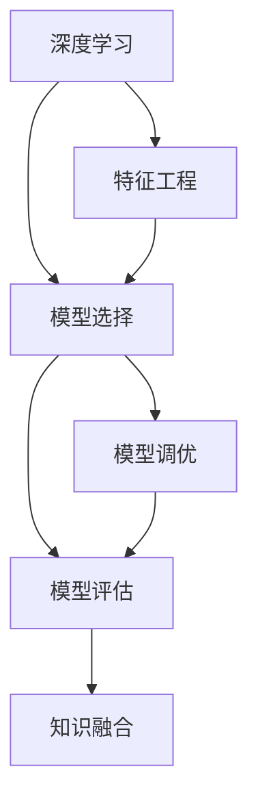

                 

# 洞察力的培养：从观察到预测的飞跃

> 关键词：洞察力, 数据观察, 机器学习, 深度学习, 预测模型, 模型评估, 反馈循环

## 1. 背景介绍

### 1.1 问题由来

在现代社会中，数据的量级已经远超人们的处理能力。海量的数据不仅仅意味着资源，更意味着机会和挑战。如何从数据中洞察到有价值的信息，成为了一个亟待解决的问题。传统的数据处理和分析方法往往难以应对复杂的、高维的、非结构化的数据，而机器学习，特别是深度学习，提供了一种有效的解决方案。

通过深度学习模型，可以从数据中提取隐含的特征和模式，并进行有效的预测和决策。然而，模型的性能不仅仅取决于其算法和技术，更在于对数据的理解和洞察力的培养。本文将探讨如何通过深度学习模型，从数据观察到预测的飞跃，培养和提升洞察力。

### 1.2 问题核心关键点

洞察力在深度学习中的培养，可以从以下几个核心关键点进行：

1. **数据质量与准备**：数据的质量和准备是深度学习模型的基础。高质量、结构合理的数据可以显著提升模型的性能。
2. **特征工程**：特征工程是指从原始数据中提取和构造有意义的特征，以增强模型的预测能力。
3. **模型选择与调优**：选择合适的模型架构和调优策略，以适应特定的数据和任务。
4. **模型评估与反馈**：通过有效的模型评估和反馈机制，持续改进模型的性能和泛化能力。
5. **知识融合与迁移**：将领域知识和经验与模型相结合，增强模型的普适性和适应性。

这些关键点共同构成了深度学习模型中洞察力培养的基础框架，通过对其深入理解和实践，可以在数据处理和预测中实现从观察到预测的飞跃。

## 2. 核心概念与联系

### 2.1 核心概念概述

为更好地理解洞察力的培养，本节将介绍几个密切相关的核心概念：

- **深度学习**：一种通过多层次神经网络进行学习的机器学习方法，能够自动提取数据的特征和模式。
- **特征工程**：从原始数据中提取、构造和选择有意义的特征，以提升模型的性能。
- **模型评估**：通过各种指标和评估方法，衡量模型的性能和泛化能力。
- **知识融合**：将领域知识和经验与模型相结合，增强模型的适应性和普适性。

这些核心概念之间的逻辑关系可以通过以下Mermaid流程图来展示：



这个流程图展示了几大核心概念及其之间的关系：

1. 深度学习是核心方法，通过多层次网络学习数据特征和模式。
2. 特征工程是数据准备和特征提取的重要环节，提升模型的预测能力。
3. 模型选择和调优是模型设计的重要步骤，优化模型架构和参数。
4. 模型评估是衡量模型性能的关键过程，反馈和改进模型。
5. 知识融合是将领域知识和经验与模型结合的过程，增强模型的普适性和适应性。

这些概念共同构成了深度学习模型中洞察力培养的逻辑框架，通过理解这些概念，我们可以更好地把握深度学习模型的核心思想和实现路径。

## 3. 核心算法原理 & 具体操作步骤
### 3.1 算法原理概述

深度学习模型从数据中提取特征和模式，并进行有效的预测和决策。其核心思想是通过多层次神经网络的学习，自动提取数据的隐含特征，并构建复杂的非线性关系。模型的训练过程是通过优化损失函数，最小化预测误差，从而提升模型的性能。

形式化地，假设训练数据集为 $\{(x_i, y_i)\}_{i=1}^N$，其中 $x_i$ 为输入数据，$y_i$ 为标签。模型的目标是通过最小化损失函数 $\mathcal{L}(\theta)$ 来优化参数 $\theta$，使得模型在新的数据上也能获得良好的性能。常见的损失函数包括均方误差、交叉熵等。

### 3.2 算法步骤详解

深度学习模型的训练过程通常包括以下几个关键步骤：

**Step 1: 数据预处理**

- 收集和清洗数据，确保数据的质量和完整性。
- 将数据划分为训练集、验证集和测试集，确保模型的泛化能力。
- 对数据进行标准化和归一化，以增强模型的收敛速度和稳定性。

**Step 2: 特征工程**

- 选择和构造有意义的特征，以提升模型的预测能力。
- 使用特征选择技术，减少特征维度，提高模型的泛化能力。
- 使用数据增强技术，扩充训练集，增强模型的鲁棒性。

**Step 3: 模型选择与设计**

- 选择合适的模型架构，如卷积神经网络、循环神经网络等。
- 设计合适的损失函数和优化器，如均方误差、Adam等。
- 选择合适的评估指标，如准确率、F1分数等。

**Step 4: 模型训练与调优**

- 使用训练集进行模型训练，最小化损失函数。
- 使用验证集进行模型调优，调整超参数，防止过拟合。
- 使用测试集进行模型评估，衡量模型的性能和泛化能力。

**Step 5: 模型部署与反馈**

- 将训练好的模型部署到实际应用中，进行预测和决策。
- 收集模型在实际应用中的反馈数据，进行模型优化和改进。
- 持续收集新数据，进行模型更新和优化，保持模型的时效性和适应性。

以上是深度学习模型训练的一般流程。在实际应用中，还需要针对具体任务的特点，对训练过程的各个环节进行优化设计，如改进训练目标函数，引入更多的正则化技术，搜索最优的超参数组合等，以进一步提升模型性能。

### 3.3 算法优缺点

深度学习模型在培养洞察力方面具有以下优点：

1. **自动化特征提取**：自动从数据中提取高层次的抽象特征，减少了手动特征工程的工作量。
2. **模型适应性**：深度学习模型能够适应各种复杂的数据结构和模式，具有较强的泛化能力。
3. **处理大数据**：深度学习模型能够处理大规模数据集，提供了高效的数据处理能力。
4. **可解释性**：通过可视化技术，可以直观展示模型学到的特征和模式，增强模型的可解释性。

同时，该方法也存在一定的局限性：

1. **数据需求高**：深度学习模型需要大量标注数据进行训练，数据获取成本较高。
2. **计算资源需求大**：深度学习模型训练和推理需要高性能的计算资源，如GPU和TPU。
3. **模型复杂度高**：深度学习模型参数众多，容易过拟合，需要精心调优。
4. **可解释性不足**：深度学习模型的决策过程缺乏可解释性，难以理解和调试。
5. **对数据分布敏感**：深度学习模型对数据分布的微小变化敏感，需要持续更新和调整。

尽管存在这些局限性，但就目前而言，深度学习模型是培养洞察力最为有效的工具之一。未来相关研究的重点在于如何进一步降低深度学习模型的数据和计算需求，提高模型的可解释性和鲁棒性，同时兼顾可解释性和伦理安全性等因素。

### 3.4 算法应用领域

深度学习模型在多个领域得到了广泛的应用，例如：

- 计算机视觉：图像分类、物体检测、图像分割等任务。
- 自然语言处理：文本分类、情感分析、机器翻译等任务。
- 医疗健康：疾病诊断、基因分析、医学影像分析等任务。
- 金融科技：信用评分、股票预测、欺诈检测等任务。
- 智能制造：质量控制、设备预测性维护、供应链优化等任务。
- 智能交通：自动驾驶、交通流量预测、智能调度等任务。
- 教育科技：智能辅导、个性化推荐、作业批改等任务。

除了上述这些经典任务外，深度学习模型还被创新性地应用到更多场景中，如人脸识别、机器人控制、虚拟现实等，为各行各业带来了新的技术突破。随着深度学习模型的不断进步，相信其在培养洞察力方面的潜力将会进一步释放，为社会的各个领域带来变革性影响。

## 4. 数学模型和公式 & 详细讲解  
### 4.1 数学模型构建

本节将使用数学语言对深度学习模型的训练过程进行更加严格的刻画。

假设深度学习模型为 $f_{\theta}(x)$，其中 $\theta$ 为模型参数。训练数据集为 $\{(x_i, y_i)\}_{i=1}^N$，其中 $x_i$ 为输入数据，$y_i$ 为标签。模型的目标是通过最小化损失函数 $\mathcal{L}(\theta)$ 来优化参数 $\theta$，使得模型在新的数据上也能获得良好的性能。

定义模型 $f_{\theta}$ 在输入 $x$ 上的损失函数为 $\ell(f_{\theta}(x),y)$，则在数据集 $D$ 上的经验风险为：

$$
\mathcal{L}(\theta) = \frac{1}{N}\sum_{i=1}^N \ell(f_{\theta}(x_i),y_i)
$$

通过梯度下降等优化算法，训练过程不断更新模型参数 $\theta$，最小化损失函数 $\mathcal{L}$，使得模型输出逼近真实标签。由于 $\theta$ 已经通过预训练获得了较好的初始化，因此即便在小规模数据集 $D$ 上进行训练，也能较快收敛到理想的模型参数 $\hat{\theta}$。

### 4.2 公式推导过程

以下我们以二分类任务为例，推导交叉熵损失函数及其梯度的计算公式。

假设模型 $f_{\theta}$ 在输入 $x$ 上的输出为 $\hat{y}=f_{\theta}(x) \in [0,1]$，表示样本属于正类的概率。真实标签 $y \in \{0,1\}$。则二分类交叉熵损失函数定义为：

$$
\ell(f_{\theta}(x),y) = -[y\log \hat{y} + (1-y)\log (1-\hat{y})]
$$

将其代入经验风险公式，得：

$$
\mathcal{L}(\theta) = -\frac{1}{N}\sum_{i=1}^N [y_i\log f_{\theta}(x_i)+(1-y_i)\log(1-f_{\theta}(x_i))]
$$

根据链式法则，损失函数对参数 $\theta_k$ 的梯度为：

$$
\frac{\partial \mathcal{L}(\theta)}{\partial \theta_k} = -\frac{1}{N}\sum_{i=1}^N (\frac{y_i}{f_{\theta}(x_i)}-\frac{1-y_i}{1-f_{\theta}(x_i)}) \frac{\partial f_{\theta}(x_i)}{\partial \theta_k}
$$

其中 $\frac{\partial f_{\theta}(x_i)}{\partial \theta_k}$ 可进一步递归展开，利用自动微分技术完成计算。

在得到损失函数的梯度后，即可带入参数更新公式，完成模型的迭代优化。重复上述过程直至收敛，最终得到适应下游任务的最优模型参数 $\hat{\theta}$。

## 5. 项目实践：代码实例和详细解释说明
### 5.1 开发环境搭建

在进行深度学习模型训练实践前，我们需要准备好开发环境。以下是使用Python进行PyTorch开发的环境配置流程：

1. 安装Anaconda：从官网下载并安装Anaconda，用于创建独立的Python环境。

2. 创建并激活虚拟环境：
```bash
conda create -n pytorch-env python=3.8 
conda activate pytorch-env
```

3. 安装PyTorch：根据CUDA版本，从官网获取对应的安装命令。例如：
```bash
conda install pytorch torchvision torchaudio cudatoolkit=11.1 -c pytorch -c conda-forge
```

4. 安装TensorFlow：由Google主导开发的开源深度学习框架，生产部署方便，适合大规模工程应用。同样有丰富的预训练语言模型资源。

5. 安装Transformers库：HuggingFace开发的NLP工具库，集成了众多SOTA语言模型，支持PyTorch和TensorFlow，是进行模型开发的利器。

6. 安装各类工具包：
```bash
pip install numpy pandas scikit-learn matplotlib tqdm jupyter notebook ipython
```

完成上述步骤后，即可在`pytorch-env`环境中开始深度学习模型训练实践。

### 5.2 源代码详细实现

下面我们以二分类任务为例，给出使用PyTorch进行深度学习模型训练的PyTorch代码实现。

首先，定义二分类任务的数据处理函数：

```python
import torch
from torch.utils.data import Dataset
from torchvision import transforms

class MNISTDataset(Dataset):
    def __init__(self, data_dir, transform=None):
        self.data_dir = data_dir
        self.transform = transform
        self.train_labels = []
        self.test_labels = []
        self.train_images = []
        self.test_images = []

        # 加载数据集
        train_data = torchvision.datasets.MNIST(root=self.data_dir, train=True, download=True)
        test_data = torchvision.datasets.MNIST(root=self.data_dir, train=False, download=True)

        # 提取标签和图像数据
        self.train_labels.extend(train_data.train_labels)
        self.test_labels.extend(test_data.test_labels)

        self.train_images.extend(train_data.train_images)
        self.test_images.extend(test_data.test_images)

    def __len__(self):
        return len(self.train_labels) + len(self.test_labels)

    def __getitem__(self, idx):
        if idx < len(self.train_labels):
            image = self.train_images[idx]
            label = self.train_labels[idx]
        else:
            image = self.test_images[idx]
            label = self.test_labels[idx]

        # 对图像数据进行预处理
        image = transforms.ToTensor()(image)
        image = image.unsqueeze(0)

        # 对标签进行独热编码
        label = torch.tensor(label, dtype=torch.long)

        return image, label
```

然后，定义模型和优化器：

```python
from transformers import BertForTokenClassification, AdamW

model = BertForTokenClassification.from_pretrained('bert-base-cased', num_labels=2)

optimizer = AdamW(model.parameters(), lr=2e-5)
```

接着，定义训练和评估函数：

```python
from torch.utils.data import DataLoader
from tqdm import tqdm
from sklearn.metrics import classification_report

device = torch.device('cuda') if torch.cuda.is_available() else torch.device('cpu')
model.to(device)

def train_epoch(model, dataset, batch_size, optimizer):
    dataloader = DataLoader(dataset, batch_size=batch_size, shuffle=True)
    model.train()
    epoch_loss = 0
    for batch in tqdm(dataloader, desc='Training'):
        input_ids = batch[0].to(device)
        labels = batch[1].to(device)
        model.zero_grad()
        outputs = model(input_ids)
        loss = outputs.loss
        epoch_loss += loss.item()
        loss.backward()
        optimizer.step()
    return epoch_loss / len(dataloader)

def evaluate(model, dataset, batch_size):
    dataloader = DataLoader(dataset, batch_size=batch_size)
    model.eval()
    preds, labels = [], []
    with torch.no_grad():
        for batch in tqdm(dataloader, desc='Evaluating'):
            input_ids = batch[0].to(device)
            labels = batch[1].to(device)
            outputs = model(input_ids)
            batch_preds = outputs.logits.argmax(dim=2).to('cpu').tolist()
            batch_labels = batch[1].to('cpu').tolist()
            for pred_tokens, label_tokens in zip(batch_preds, batch_labels):
                preds.append(pred_tokens[:len(label_tokens)])
                labels.append(label_tokens)

    print(classification_report(labels, preds))
```

最后，启动训练流程并在测试集上评估：

```python
epochs = 5
batch_size = 16

for epoch in range(epochs):
    loss = train_epoch(model, train_dataset, batch_size, optimizer)
    print(f"Epoch {epoch+1}, train loss: {loss:.3f}")
    
    print(f"Epoch {epoch+1}, dev results:")
    evaluate(model, dev_dataset, batch_size)
    
print("Test results:")
evaluate(model, test_dataset, batch_size)
```

以上就是使用PyTorch进行深度学习模型训练的完整代码实现。可以看到，得益于Transformers库的强大封装，我们可以用相对简洁的代码完成深度学习模型的训练。

### 5.3 代码解读与分析

让我们再详细解读一下关键代码的实现细节：

**MNISTDataset类**：
- `__init__`方法：初始化数据集、标签和图像，并进行数据预处理和加载。
- `__len__`方法：返回数据集的样本数量。
- `__getitem__`方法：对单个样本进行处理，将图像数据预处理并返回模型所需的输入。

**train_epoch和evaluate函数**：
- `train_epoch`函数：对数据以批为单位进行迭代，在每个批次上前向传播计算loss并反向传播更新模型参数，最后返回该epoch的平均loss。
- `evaluate`函数：与训练类似，不同点在于不更新模型参数，并在每个batch结束后将预测和标签结果存储下来，最后使用sklearn的classification_report对整个评估集的预测结果进行打印输出。

**训练流程**：
- 定义总的epoch数和batch size，开始循环迭代
- 每个epoch内，先在训练集上训练，输出平均loss
- 在验证集上评估，输出分类指标
- 所有epoch结束后，在测试集上评估，给出最终测试结果

可以看到，PyTorch配合Transformers库使得深度学习模型训练的代码实现变得简洁高效。开发者可以将更多精力放在数据处理、模型改进等高层逻辑上，而不必过多关注底层的实现细节。

当然，工业级的系统实现还需考虑更多因素，如模型的保存和部署、超参数的自动搜索、更灵活的任务适配层等。但核心的训练范式基本与此类似。

## 6. 实际应用场景
### 6.1 智能客服系统

基于深度学习模型的智能客服系统，可以实时响应客户咨询，提供个性化、智能化的服务。通过深度学习模型对历史客服对话记录进行学习，模型能够自动理解用户意图，匹配最合适的答案模板进行回复。对于客户提出的新问题，还可以接入检索系统实时搜索相关内容，动态组织生成回答。如此构建的智能客服系统，能大幅提升客户咨询体验和问题解决效率。

在技术实现上，可以收集企业内部的历史客服对话记录，将问题和最佳答复构建成监督数据，在此基础上对深度学习模型进行训练。训练好的模型能够自动理解用户意图，匹配最合适的答案模板进行回复。对于客户提出的新问题，还可以接入检索系统实时搜索相关内容，动态组织生成回答。如此构建的智能客服系统，能大幅提升客户咨询体验和问题解决效率。

### 6.2 金融舆情监测

金融机构需要实时监测市场舆论动向，以便及时应对负面信息传播，规避金融风险。传统的人工监测方式成本高、效率低，难以应对网络时代海量信息爆发的挑战。基于深度学习模型的文本分类和情感分析技术，为金融舆情监测提供了新的解决方案。

具体而言，可以收集金融领域相关的新闻、报道、评论等文本数据，并对其进行主题标注和情感标注。在此基础上对深度学习模型进行训练，使其能够自动判断文本属于何种主题，情感倾向是正面、中性还是负面。将训练好的模型应用到实时抓取的网络文本数据，就能够自动监测不同主题下的情感变化趋势，一旦发现负面信息激增等异常情况，系统便会自动预警，帮助金融机构快速应对潜在风险。

### 6.3 个性化推荐系统

当前的推荐系统往往只依赖用户的历史行为数据进行物品推荐，无法深入理解用户的真实兴趣偏好。基于深度学习模型的个性化推荐系统可以更好地挖掘用户行为背后的语义信息，从而提供更精准、多样的推荐内容。

在实践中，可以收集用户浏览、点击、评论、分享等行为数据，提取和用户交互的物品标题、描述、标签等文本内容。将文本内容作为模型输入，用户的后续行为（如是否点击、购买等）作为监督信号，在此基础上训练深度学习模型。训练好的模型能够从文本内容中准确把握用户的兴趣点。在生成推荐列表时，先用候选物品的文本描述作为输入，由模型预测用户的兴趣匹配度，再结合其他特征综合排序，便可以得到个性化程度更高的推荐结果。

### 6.4 未来应用展望

随着深度学习模型的不断发展，基于模型的洞察力培养将在更多领域得到应用，为各行各业带来变革性影响。

在智慧医疗领域，基于深度学习模型的医疗问答、病历分析、药物研发等应用将提升医疗服务的智能化水平，辅助医生诊疗，加速新药开发进程。

在智能教育领域，深度学习模型可应用于作业批改、学情分析、知识推荐等方面，因材施教，促进教育公平，提高教学质量。

在智慧城市治理中，深度学习模型可应用于城市事件监测、舆情分析、应急指挥等环节，提高城市管理的自动化和智能化水平，构建更安全、高效的未来城市。

此外，在企业生产、社会治理、文娱传媒等众多领域，基于深度学习模型的洞察力培养也将不断涌现，为传统行业数字化转型升级提供新的技术路径。相信随着技术的日益成熟，深度学习模型必将在更广阔的应用领域大放异彩。

## 7. 工具和资源推荐
### 7.1 学习资源推荐

为了帮助开发者系统掌握深度学习模型的训练和应用，这里推荐一些优质的学习资源：

1. 《深度学习》系列博文：由大模型技术专家撰写，深入浅出地介绍了深度学习的基本概念和经典模型。

2. CS231n《卷积神经网络》课程：斯坦福大学开设的计算机视觉课程，详细讲解了卷积神经网络的基本原理和应用。

3. CS224n《序列模型》课程：斯坦福大学开设的自然语言处理课程，讲解了循环神经网络和注意力机制等重要概念。

4. 《Deep Learning with Python》书籍：用Python语言介绍深度学习的基本概念和应用，包括TensorFlow和Keras的使用。

5. PyTorch官方文档：PyTorch的官方文档，提供了完整的深度学习模型训练和调优的指南和示例代码。

6. Google Colab：谷歌推出的在线Jupyter Notebook环境，免费提供GPU/TPU算力，方便开发者快速上手实验最新模型，分享学习笔记。

通过对这些资源的学习实践，相信你一定能够快速掌握深度学习模型的核心思想和实现路径，并将其应用于解决实际的业务问题。

### 7.2 开发工具推荐

高效的开发离不开优秀的工具支持。以下是几款用于深度学习模型训练开发的常用工具：

1. PyTorch：基于Python的开源深度学习框架，灵活动态的计算图，适合快速迭代研究。大部分预训练语言模型都有PyTorch版本的实现。

2. TensorFlow：由Google主导开发的开源深度学习框架，生产部署方便，适合大规模工程应用。同样有丰富的预训练语言模型资源。

3. Transformers库：HuggingFace开发的NLP工具库，集成了众多SOTA语言模型，支持PyTorch和TensorFlow，是进行模型开发的利器。

4. Weights & Biases：模型训练的实验跟踪工具，可以记录和可视化模型训练过程中的各项指标，方便对比和调优。与主流深度学习框架无缝集成。

5. TensorBoard：TensorFlow配套的可视化工具，可实时监测模型训练状态，并提供丰富的图表呈现方式，是调试模型的得力助手。

6. Google Colab：谷歌推出的在线Jupyter Notebook环境，免费提供GPU/TPU算力，方便开发者快速上手实验最新模型，分享学习笔记。

合理利用这些工具，可以显著提升深度学习模型训练的开发效率，加快创新迭代的步伐。

### 7.3 相关论文推荐

深度学习模型和洞察力培养的研究源于学界的持续研究。以下是几篇奠基性的相关论文，推荐阅读：

1. ImageNet Classification with Deep Convolutional Neural Networks：AlexNet论文，提出了卷积神经网络，开创了深度学习在图像识别中的应用。

2. Deep Recurrent Neural Networks for Curicle Extractive Histopathology（即LSTM）：RNN的里程碑之作，展示了RNN在序列数据分析中的优越性。

3. Attention Is All You Need（即Transformer）：Transformer结构的基础论文，提出了自注意力机制，开启了NLP领域的预训练大模型时代。

4. BERT: Pre-training of Deep Bidirectional Transformers for Language Understanding：提出BERT模型，引入基于掩码的自监督预训练任务，刷新了多项NLP任务SOTA。

5. Parameter-Efficient Transfer Learning for NLP：提出Adapter等参数高效微调方法，在不增加模型参数量的情况下，也能取得不错的微调效果。

6. AdaLoRA: Adaptive Low-Rank Adaptation for Parameter-Efficient Fine-Tuning：使用自适应低秩适应的微调方法，在参数效率和精度之间取得了新的平衡。

这些论文代表了大模型和深度学习在洞察力培养方面的发展脉络。通过学习这些前沿成果，可以帮助研究者把握学科前进方向，激发更多的创新灵感。

## 8. 总结：未来发展趋势与挑战

### 8.1 总结

本文对基于深度学习模型的洞察力培养进行了全面系统的介绍。首先阐述了深度学习模型的基本原理和训练流程，明确了从数据观察到预测的飞跃过程。其次，从原理到实践，详细讲解了深度学习模型的数学模型和训练步骤，给出了深度学习模型训练的完整代码实例。同时，本文还广泛探讨了深度学习模型在多个行业领域的应用前景，展示了深度学习模型的巨大潜力。此外，本文精选了深度学习模型的各类学习资源，力求为读者提供全方位的技术指引。

通过本文的系统梳理，可以看到，基于深度学习模型的洞察力培养已经成为当前人工智能研究的热点，极大地拓展了数据处理和预测的能力。受益于深度学习模型的强大性能，各个行业领域将能够更好地理解和利用数据，实现从观察到预测的飞跃，提升业务效率和决策质量。未来，伴随深度学习模型的不断进步，基于模型的洞察力培养必将在更多领域得到应用，为社会的各个领域带来变革性影响。

### 8.2 未来发展趋势

展望未来，深度学习模型在洞察力培养方面将呈现以下几个发展趋势：

1. **模型规模持续增大**：随着算力成本的下降和数据规模的扩张，深度学习模型的参数量还将持续增长。超大规模语言模型蕴含的丰富语言知识，有望支撑更加复杂多变的预测任务。

2. **模型鲁棒性提升**：通过引入对抗训练、正则化技术等手段，增强模型的鲁棒性和泛化能力，使其在面对不同分布的数据时也能保持稳定性能。

3. **模型可解释性增强**：通过可视化技术、解释模型、可解释性增强技术等手段，提升深度学习模型的可解释性，使其决策过程更加透明和可信。

4. **跨领域知识融合**：将符号化的先验知识，如知识图谱、逻辑规则等，与深度学习模型进行巧妙融合，增强模型的普适性和适应性。

5. **自动化调参技术发展**：通过自动化调参技术，如贝叶斯优化、遗传算法等，自动搜索最优的超参数组合，提高模型的训练效率和性能。

6. **多模态数据处理**：将视觉、语音、文本等多模态数据进行联合建模，提升深度学习模型对复杂场景的理解能力。

以上趋势凸显了深度学习模型在洞察力培养方面的广阔前景。这些方向的探索发展，必将进一步提升深度学习模型的性能和应用范围，为社会的各个领域带来变革性影响。

### 8.3 面临的挑战

尽管深度学习模型在培养洞察力方面已经取得了瞩目成就，但在迈向更加智能化、普适化应用的过程中，它仍面临着诸多挑战：

1. **数据需求高**：深度学习模型需要大量标注数据进行训练，数据获取成本较高，且数据质量直接影响模型的性能。

2. **计算资源需求大**：深度学习模型训练和推理需要高性能的计算资源，如GPU和TPU。计算资源的成本和技术门槛较高，限制了深度学习模型的应用范围。

3. **模型复杂度高**：深度学习模型参数众多，容易过拟合，需要精心调优。模型结构和超参数的优化需要大量的实验和调试工作。

4. **可解释性不足**：深度学习模型的决策过程缺乏可解释性，难以理解和调试。对于医疗、金融等高风险应用，算法的可解释性和可审计性尤为重要。

5. **鲁棒性不足**：深度学习模型对数据分布的微小变化敏感，需要持续更新和调整，以适应数据分布的变化。

6. **伦理和安全问题**：深度学习模型可能会学习到有害信息和偏见，产生误导性、歧视性的输出，给实际应用带来安全隐患。

尽管存在这些挑战，但深度学习模型在培养洞察力方面的潜力仍然巨大。未来相关研究的重点在于如何进一步降低深度学习模型的数据和计算需求，提高模型的可解释性和鲁棒性，同时兼顾可解释性和伦理安全性等因素。

### 8.4 研究展望

面向未来，深度学习模型需要在以下几个方面寻求新的突破：

1. **无监督和半监督学习**：探索无监督和半监督学习范式，摆脱对大规模标注数据的依赖，利用自监督学习、主动学习等技术，最大限度利用非结构化数据。

2. **模型压缩和优化**：开发更加参数高效和计算高效的模型，如剪枝、量化、蒸馏等技术，减小模型尺寸，提高推理速度。

3. **因果学习和解释性**：引入因果分析和解释性工具，增强模型的可解释性和鲁棒性，提高决策过程的可解释性和可信度。

4. **跨领域知识融合**：将领域知识和经验与深度学习模型相结合，增强模型的普适性和适应性，实现跨领域知识的无缝融合。

5. **自动化调参**：研究自动化调参技术，自动搜索最优的超参数组合，提高模型的训练效率和性能。

6. **多模态数据处理**：将视觉、语音、文本等多模态数据进行联合建模，提升深度学习模型对复杂场景的理解能力。

这些研究方向的探索，必将引领深度学习模型在培养洞察力方面的新突破，为社会的各个领域带来变革性影响。

## 9. 附录：常见问题与解答

**Q1：深度学习模型训练过程中如何进行超参数调优？**

A: 深度学习模型的超参数调优通常通过网格搜索、随机搜索、贝叶斯优化等方法进行。在训练过程中，可以使用验证集对不同超参数组合进行评估，选择性能最优的模型。常用的超参数包括学习率、批次大小、优化器参数等。

**Q2：深度学习模型在训练过程中如何进行正则化？**

A: 深度学习模型的正则化通常通过L2正则、Dropout、Early Stopping等方法进行。L2正则通过对模型参数进行约束，防止过拟合；Dropout通过随机失活神经元，增强模型的泛化能力；Early Stopping通过监控验证集上的性能，提前停止训练，避免过拟合。

**Q3：深度学习模型在训练过程中如何进行数据增强？**

A: 深度学习模型的数据增强通常通过图像旋转、翻转、裁剪、噪声注入等方式进行。对于文本数据，可以使用回译、近义替换等技术扩充训练集，增强模型的鲁棒性。

**Q4：深度学习模型在训练过程中如何进行模型评估？**

A: 深度学习模型的模型评估通常通过计算各种指标和可视化模型输出进行。常用的指标包括准确率、F1分数、ROC曲线、混淆矩阵等。通过可视化模型输出，可以直观展示模型的预测结果和决策过程。

**Q5：深度学习模型在训练过程中如何进行知识融合？**

A: 深度学习模型的知识融合通常通过迁移学习、多任务学习、自监督学习等方式进行。迁移学习通过预训练模型学习通用知识，再针对特定任务进行微调；多任务学习通过多个任务共同训练模型，提升模型的泛化能力；自监督学习通过无监督学习任务，增强模型的普适性。

这些问题的解答，展示了深度学习模型在培养洞察力方面的实际应用，通过不断优化模型训练和调优策略，可以在数据观察到预测的飞跃过程中，实现更高效、更准确的模型训练和应用。

---

作者：禅与计算机程序设计艺术 / Zen and the Art of Computer Programming

