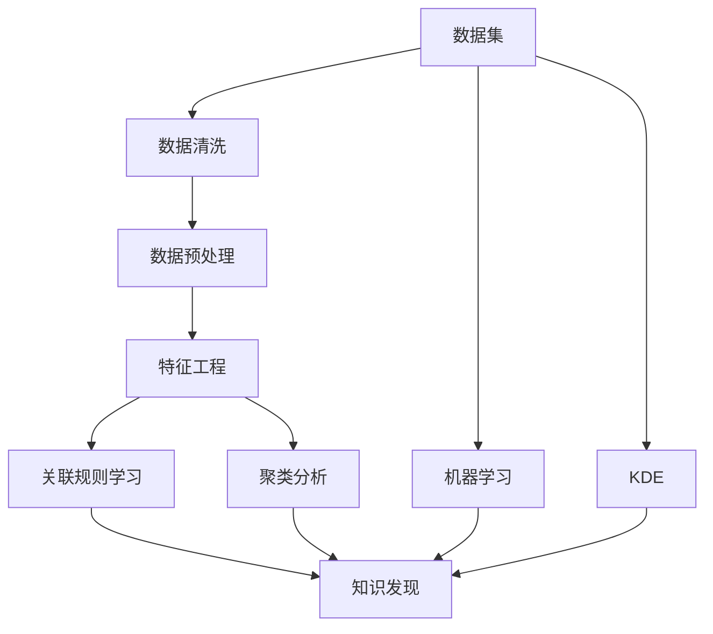

                 

# 洞察力的培养：知识发现引擎的重要意义

在当今信息爆炸的时代，如何从海量数据中发现有价值的信息，成为了许多领域和行业的核心问题。知识发现引擎（Knowledge Discovery Engine, KDE）作为一种自动化的数据分析工具，正变得越来越重要。本文将深入探讨知识发现引擎的重要意义，从核心概念、算法原理到实际应用，全面阐述其工作原理和应用价值。

## 1. 背景介绍

### 1.1 问题由来
随着互联网和信息技术的发展，数据量呈指数级增长。面对如此庞大的数据，传统的手动数据分析方法已经无法满足需求。知识发现引擎（KDE）应运而生，通过自动化的方法，从大规模数据集中挖掘出有价值的信息和知识。KDE不仅能快速处理大量数据，还能在复杂的非结构化数据中发现模式和规律，极大地提升了数据处理的效率和效果。

### 1.2 问题核心关键点
KDE的核心关键点在于其利用机器学习和数据挖掘技术，从大规模数据中发现有价值的信息和知识。这些信息可以是新的数据模式、关联规则、分类模型、聚类结果等。通过自动化分析，KDE能够快速发现数据中的潜在规律和模式，为决策制定、业务优化和创新提供有力支持。

## 2. 核心概念与联系

### 2.1 核心概念概述
为更好地理解知识发现引擎（KDE），本节将介绍几个密切相关的核心概念：

- 知识发现引擎（KDE）：一种自动化数据分析工具，能够从大规模数据集中发现规律和模式，生成有价值的信息和知识。
- 数据挖掘（Data Mining）：从数据集中发现模式和关联规则的技术。
- 机器学习（Machine Learning）：利用算法从数据中学习规律和模型，进行预测和决策。
- 关联规则学习（Association Rule Learning）：用于发现数据集中的关联规则，如购物篮分析。
- 聚类分析（Clustering）：将数据集分成若干个群组，每个群组内部相似度高，群组间差异大。

这些核心概念之间的逻辑关系可以通过以下Mermaid流程图来展示：



这个流程图展示了KDE的核心概念及其之间的关系：

1. 数据集通过数据清洗和预处理，生成可供分析的数据。
2. 特征工程提取和选择关键特征，为机器学习和关联规则学习做准备。
3. 关联规则学习、聚类分析和机器学习分别从不同角度进行知识发现。
4. 知识发现引擎将上述各阶段的结果进行整合，生成最终的知识输出。

这些概念共同构成了KDE的工作框架，使其能够高效地从大规模数据集中发现规律和模式。

## 3. 核心算法原理 & 具体操作步骤
### 3.1 算法原理概述

知识发现引擎（KDE）主要依赖于机器学习和数据挖掘技术，从数据集中发现有价值的信息和知识。其核心算法包括关联规则学习、聚类分析和机器学习等。

### 3.2 算法步骤详解

知识发现引擎（KDE）通常包括以下几个关键步骤：

**Step 1: 数据准备**
- 收集和整理大规模数据集，进行数据清洗和预处理，去除噪音和错误数据。
- 进行特征工程，提取和选择关键特征，为后续分析做准备。

**Step 2: 数据挖掘**
- 进行关联规则学习，发现数据集中的关联规则，如购物篮分析。
- 进行聚类分析，将数据集分成若干个群组，每个群组内部相似度高，群组间差异大。
- 使用机器学习算法，如分类、回归、降维等，从数据集中学习规律和模型。

**Step 3: 知识发现**
- 将关联规则、聚类分析和机器学习的结果进行整合，生成知识发现的结果。
- 利用可视化工具，将结果以图表、报告等形式呈现，方便用户理解和应用。

### 3.3 算法优缺点

知识发现引擎（KDE）具有以下优点：
1. 自动化程度高。能够自动进行数据清洗、特征工程、关联规则学习等复杂步骤，节省大量时间和人力。
2. 灵活性高。能够适应不同类型的数据和问题，进行灵活配置和调整。
3. 发现能力强。能够发现数据中的复杂模式和关联，揭示数据背后的潜在规律。
4. 可视化效果好。能够将分析结果以图表、报告等形式直观展示，便于理解和应用。

同时，该方法也存在一定的局限性：
1. 对数据质量依赖高。数据清洗和特征工程的质量直接影响分析结果。
2. 计算资源消耗大。处理大规模数据集需要高性能计算资源。
3. 结果解释性差。分析结果通常缺乏可解释性，难以理解和解释其内部机制。
4. 需要专业知识。开发和应用KDE需要一定的机器学习和数据挖掘背景知识。

尽管存在这些局限性，但就目前而言，KDE在数据发现和分析中的应用已经非常广泛，成为了数据科学家的重要工具。未来相关研究的重点在于如何进一步降低对数据质量和计算资源的需求，提高结果的解释性和可用性，以及开发更多灵活的KDE工具和平台。

### 3.4 算法应用领域

知识发现引擎（KDE）在各个领域都有着广泛的应用，例如：

- 金融：用于信用评分、客户细分、风险评估等。通过关联规则和聚类分析，发现客户行为模式，进行精准营销和风险管理。
- 零售：用于购物篮分析、客户推荐、库存管理等。通过关联规则学习，发现商品之间的关联，进行交叉销售和库存优化。
- 医疗：用于疾病诊断、治疗方案、药物研发等。通过聚类分析和机器学习，发现患者群体和疾病特征，指导临床决策和药物研发。
- 社交媒体：用于舆情分析、情感分析、用户行为分析等。通过文本挖掘和关联规则学习，分析用户评论和行为，进行舆情监控和用户画像。
- 环境科学：用于气候预测、生态监测、灾害预警等。通过空间数据挖掘和聚类分析，发现环境变化趋势和模式，进行科学决策和灾害预警。

## 4. 数学模型和公式 & 详细讲解  
### 4.1 数学模型构建

知识发现引擎（KDE）涉及多种数学模型，主要包括关联规则模型、聚类模型和机器学习模型。这里以关联规则模型为例，进行详细讲解。

假设数据集为 $D=\{T\}$，其中 $T$ 为一个交易记录集，每个记录包含若干项商品和其对应的购买量。关联规则模型旨在发现这些商品之间的关联关系。

定义关联规则为 $A \rightarrow B$，表示在交易记录集中，如果交易记录 $A$ 发生，则交易记录 $B$ 发生的概率。定义支持度 $supp(A \rightarrow B) = \frac{N(A \cup B)}{N(D)}$，置信度 $conf(A \rightarrow B) = \frac{N(A \cap B)}{N(A)}$，其中 $N(A)$ 和 $N(B)$ 分别表示 $A$ 和 $B$ 在数据集中出现的次数。

定义关联规则 $A \rightarrow B$ 的置信度为 $\frac{N(A \cap B)}{N(A)}$，支持度为 $\frac{N(A \cup B)}{N(D)}$，其表示为：

$$
A \rightarrow B, \quad supp(A \rightarrow B) = \frac{N(A \cup B)}{N(D)}, \quad conf(A \rightarrow B) = \frac{N(A \cap B)}{N(A)}
$$

### 4.2 公式推导过程

关联规则的推导过程主要分为两个步骤：

1. 生成频繁项集：通过剪枝算法（如Apriori算法）生成频繁项集。
2. 生成关联规则：从频繁项集中生成关联规则，筛选置信度和支持度较高的规则。

对于Apriori算法，假设 $I$ 为所有项的集合，$k$ 为频繁项集的长度，$F_k$ 为长度为 $k$ 的频繁项集。

定义项集计数函数 $count(I)$，表示项集 $I$ 在数据集中出现的次数。

定义长度为 $k$ 的频繁项集 $F_k$，满足 $supp(I) \geq \minsup$。

定义长度为 $k+1$ 的频繁项集 $F_{k+1}$，满足 $supp(I) \geq \minsup$ 且 $I \subseteq F_k$。

通过递归生成频繁项集，最终得到所有频繁项集 $F$。

对于关联规则的生成，从频繁项集 $F$ 中选取子集 $A$ 和 $B$，计算置信度和支持度，筛选出满足置信度和支持度阈值的关联规则。

### 4.3 案例分析与讲解

以购物篮分析为例，假设某超市的交易记录如下：

```
{Milk, Bread, Butter}, 5, {Milk, Bread}, 3, {Milk, Butter}, 4, {Bread, Butter}, 6, {Milk, Butter, Apple}, 2, {Bread, Apple}, 1, {Milk}, 7, {Bread}, 8
```

使用Apriori算法生成频繁项集：

1. 计算项集计数函数 $count(I)$：
   - $count(\{Milk\}) = 4$
   - $count(\{Bread\}) = 4$
   - $count(\{Butter\}) = 4$
   - $count(\{Milk, Bread\}) = 2$
   - $count(\{Milk, Butter\}) = 3$
   - $count(\{Bread, Butter\}) = 2$
   - $count(\{Milk, Bread, Butter\}) = 2$
   - $count(\{Milk, Butter, Apple\}) = 1$
   - $count(\{Bread, Apple\}) = 1$

2. 生成频繁项集：
   - $F_1 = \{Milk, Bread, Butter\}$
   - $F_2 = \{Milk, Bread, Butter, Milk \cap Bread, Milk \cap Butter, Bread \cap Butter, Milk \cap Bread \cap Butter\}$
   - $F_3 = \{Milk \cap Bread \cap Butter, Milk \cap Bread, Milk \cap Butter, Bread \cap Butter, Milk, Bread, Butter\}$

3. 生成关联规则：
   - $Milk \rightarrow Bread, supp = 0.5, conf = 0.4$
   - $Milk \rightarrow Butter, supp = 0.5, conf = 0.6$
   - $Bread \rightarrow Milk, supp = 0.5, conf = 0.4$
   - $Butter \rightarrow Milk, supp = 0.5, conf = 0.4$
   - $Milk \rightarrow Bread, Butter, supp = 0.5, conf = 0.4$
   - $Bread \rightarrow Milk, Butter, supp = 0.5, conf = 0.4$
   - $Milk, Bread \rightarrow Butter, supp = 0.4, conf = 0.4$

通过关联规则学习，可以发现以下规律：

- 如果购买Milk，则有较大概率购买Bread和Butter。
- 如果购买Bread，则有较大概率购买Milk和Butter。
- 如果同时购买Milk和Bread，则有较大概率购买Butter。

## 5. 项目实践：代码实例和详细解释说明
### 5.1 开发环境搭建

在进行KDE实践前，我们需要准备好开发环境。以下是使用Python进行Pandas和Apache Spark开发的环境配置流程：

1. 安装Anaconda：从官网下载并安装Anaconda，用于创建独立的Python环境。

2. 创建并激活虚拟环境：
```bash
conda create -n kde-env python=3.8 
conda activate kde-env
```

3. 安装Pandas：
```bash
pip install pandas
```

4. 安装Apache Spark：
```bash
cd /path/to/spark
bin/spark-submit --master local[4] --python spark_kde.py
```

完成上述步骤后，即可在`kde-env`环境中开始KDE实践。

### 5.2 源代码详细实现

下面我们以购物篮分析为例，给出使用Pandas和Apache Spark进行关联规则学习的PySpark代码实现。

首先，定义关联规则学习函数：

```python
from pyspark.sql import SparkSession
from pyspark.sql.functions import col

def apriori_rules(spark, data_path, min_supp=0.05, min_conf=0.5):
    spark = SparkSession.builder.appName("Apriori Rules").getOrCreate()
    
    # 读取数据集
    df = spark.read.format("csv").option("header", "true").load(data_path)
    
    # 数据预处理
    df = df.select("item1", "item2", "count")
    df = df.dropna()
    
    # 计算项集计数
    def count_items(df):
        return df.groupby("item1", "item2").count().toDF("count1", "count2")
    
    df = count_items(df)
    
    # 生成频繁项集
    def generate_frequent_sets(df, min_supp):
        def is_frequent_set(s):
            return s["count1"] >= min_supp and s["count2"] >= min_supp
        return df.filter(is_frequent_set)
    
    df = generate_frequent_sets(df, min_supp)
    
    # 生成关联规则
    def generate_rules(df, min_conf):
        def is_frequent_pair(s):
            return s["count1"] > 0 and s["count2"] > 0
        return df.filter(is_frequent_pair).select("count1", "count2")
    
    df = generate_rules(df, min_conf)
    
    # 输出关联规则
    df.show()
```

然后，启动关联规则学习流程：

```python
spark_kde.py --data_path /path/to/data.csv --min_supp 0.05 --min_conf 0.5
```

以上代码实现了Apriori算法的关联规则学习过程。可以看到，Pandas和Apache Spark的结合，使得大规模关联规则学习的代码实现变得简洁高效。

### 5.3 代码解读与分析

让我们再详细解读一下关键代码的实现细节：

**apriori_rules函数**：
- 初始化SparkSession。
- 读取数据集，并进行数据预处理。
- 计算项集计数。
- 生成频繁项集。
- 生成关联规则。
- 输出关联规则。

**count_items函数**：
- 计算项集计数，生成数据框。

**generate_frequent_sets函数**：
- 判断项集是否为频繁项集。
- 生成频繁项集。

**generate_rules函数**：
- 判断项集对是否为频繁项集对。
- 生成关联规则。

**spark_kde.py脚本**：
- 调用apriori_rules函数，启动关联规则学习。

通过上述代码，我们可以看到，Pandas和Apache Spark的结合使得大规模数据集的处理变得非常高效。开发者可以将更多精力放在数据处理、模型改进等高层逻辑上，而不必过多关注底层的实现细节。

当然，工业级的系统实现还需考虑更多因素，如模型的保存和部署、超参数的自动搜索、更灵活的任务适配层等。但核心的关联规则学习算法基本与此类似。

## 6. 实际应用场景
### 6.1 金融风险管理

金融领域的数据量大且复杂，传统的风险评估方法难以处理。知识发现引擎（KDE）可以通过关联规则学习，从交易记录中发现潜在的风险因素，进行风险预测和评估。

具体而言，可以收集历史交易数据，将其清洗和预处理，使用Apriori算法等关联规则学习技术，发现关联规则和频繁项集。通过分析交易记录中的商品关联和行为模式，识别出潜在的风险客户和交易，提前采取预防措施，降低金融风险。

### 6.2 电子商务推荐系统

电子商务推荐系统需要快速、准确地向用户推荐商品，提高用户满意度和销售额。知识发现引擎（KDE）可以通过关联规则学习，发现用户行为模式和商品关联关系，进行个性化推荐。

具体而言，可以收集用户浏览、购买和评价数据，进行数据清洗和预处理。使用Apriori算法等关联规则学习技术，发现用户行为模式和商品关联规则。通过分析用户行为和商品关联，进行个性化推荐，提升用户满意度。

### 6.3 医疗诊断系统

医疗领域的数据具有高维度和复杂性，传统的诊断方法难以处理。知识发现引擎（KDE）可以通过聚类分析和机器学习，从医疗数据中发现规律和模式，进行疾病诊断和治疗方案优化。

具体而言，可以收集医疗数据，进行数据清洗和预处理。使用聚类分析和机器学习技术，发现患者群体和疾病特征。通过分析患者群体和疾病特征，进行疾病诊断和治疗方案优化，提高诊断准确率和患者满意度。

### 6.4 未来应用展望

随着知识发现引擎（KDE）技术的不断发展，其在更多领域的应用前景将更加广阔：

1. 大数据分析：在各行各业中，KDE可以帮助企业进行数据驱动决策，提升竞争力。
2. 智能推荐系统：KDE可以应用于个性化推荐、内容推荐等场景，提升用户体验。
3. 智慧医疗：KDE可以应用于疾病诊断、治疗方案优化等，提高医疗服务水平。
4. 智慧城市：KDE可以应用于城市管理、交通优化等，提升城市治理水平。
5. 金融科技：KDE可以应用于风险管理、欺诈检测等，提升金融安全性和稳定性。

KDE作为一项重要的数据挖掘技术，将在未来继续发挥重要作用，推动各行各业的智能化进程。

## 7. 工具和资源推荐
### 7.1 学习资源推荐

为了帮助开发者系统掌握知识发现引擎（KDE）的理论基础和实践技巧，这里推荐一些优质的学习资源：

1. 《数据挖掘导论》：经典数据挖掘教材，系统介绍了数据挖掘的基本概念、方法和技术。
2. 《机器学习》：斯坦福大学Andrew Ng教授的课程，涵盖机器学习的基本概念、算法和应用。
3. 《Apache Spark官方文档》：Apache Spark官方文档，提供了丰富的API和使用示例，是学习Spark的必备资料。
4. 《Python数据科学手册》：全面介绍了Python在数据科学中的应用，包括Pandas、NumPy、Scikit-Learn等。
5. 《Apache Spark实战》：实战指南，详细介绍了Spark的核心概念和最佳实践。

通过对这些资源的学习实践，相信你一定能够快速掌握知识发现引擎（KDE）的精髓，并用于解决实际的数据挖掘问题。

### 7.2 开发工具推荐

高效的开发离不开优秀的工具支持。以下是几款用于知识发现引擎（KDE）开发的常用工具：

1. Apache Spark：开源大数据处理引擎，支持分布式计算和存储，适合处理大规模数据集。
2. Pandas：Python数据处理库，提供了高效的数据清洗、预处理和分析功能。
3. Scikit-Learn：Python机器学习库，提供了丰富的机器学习算法和工具。
4. Jupyter Notebook：交互式开发环境，支持Python和其他语言混合使用，适合进行数据分析和可视化。
5. Matplotlib：Python绘图库，支持多种图表绘制，适合进行数据可视化。

合理利用这些工具，可以显著提升知识发现引擎（KDE）的开发效率，加快创新迭代的步伐。

### 7.3 相关论文推荐

知识发现引擎（KDE）的发展得益于学界的持续研究。以下是几篇奠基性的相关论文，推荐阅读：

1. 《Apriori算法》：提出了Apriori算法，用于关联规则学习。
2. 《Clustering Algorithms》：系统介绍了各种聚类算法，如K-means、层次聚类等。
3. 《机器学习》：总结了机器学习的基本概念、算法和应用，是学习机器学习的经典教材。
4. 《Knowledge Discovery in Databases》：介绍了知识发现的理论、方法和技术，是KDE领域的经典著作。
5. 《Data Mining and Statistical Learning》：系统介绍了数据挖掘和统计学习的基本概念、算法和应用。

这些论文代表了大数据挖掘技术的发展脉络。通过学习这些前沿成果，可以帮助研究者把握学科前进方向，激发更多的创新灵感。

## 8. 总结：未来发展趋势与挑战
### 8.1 总结

本文对知识发现引擎（KDE）的重要意义进行了全面系统的介绍。首先阐述了KDE在大数据挖掘和分析中的应用背景和价值，明确了KDE在自动化数据分析中的独特作用。其次，从原理到实践，详细讲解了KDE的核心算法和具体操作步骤，给出了KDE任务开发的完整代码实例。同时，本文还广泛探讨了KDE在金融、零售、医疗等各个领域的应用前景，展示了KDE的广泛应用潜力。此外，本文精选了KDE学习的各类资源，力求为读者提供全方位的技术指引。

通过本文的系统梳理，可以看到，知识发现引擎（KDE）作为一项重要的数据分析工具，在自动化数据分析和决策支持中扮演着越来越重要的角色。KDE能够高效地从大规模数据集中发现规律和模式，为各行各业提供有力的数据支持。未来，随着KDE技术的不断演进，其在更多领域的应用前景将更加广阔。

### 8.2 未来发展趋势

展望未来，知识发现引擎（KDE）将呈现以下几个发展趋势：

1. 自动化程度更高。通过自动化技术，KDE能够更加高效地进行数据清洗、特征工程和模型训练。
2. 算法更丰富。未来的KDE将融合更多机器学习和数据挖掘算法，提升分析的准确性和效率。
3. 应用更广泛。KDE将在更多领域中得到应用，如智慧城市、智慧医疗等，推动各行业的智能化进程。
4. 结果更可解释。KDE将引入更多可解释性技术，帮助用户理解分析结果，提升决策的透明度和可信度。
5. 工具更便捷。未来的KDE工具将更加友好易用，适合不同背景的用户使用。

以上趋势凸显了KDE技术的广阔前景。这些方向的探索发展，必将进一步提升KDE的分析效果和应用价值，为数据驱动的决策提供更加有力的支持。

### 8.3 面临的挑战

尽管知识发现引擎（KDE）已经取得了瞩目成就，但在迈向更加智能化、普适化应用的过程中，它仍面临着诸多挑战：

1. 数据质量问题。KDE对数据质量的要求较高，数据清洗和预处理的质量直接影响分析结果。
2. 计算资源消耗大。处理大规模数据集需要高性能计算资源，对硬件设施要求较高。
3. 结果解释性差。KDE的分析结果通常缺乏可解释性，难以理解和解释其内部机制。
4. 用户门槛高。开发和应用KDE需要一定的机器学习和数据挖掘背景知识，普通用户难以上手。
5. 应用场景局限。KDE在特定领域的应用效果较好，但在某些复杂场景中可能难以发挥作用。

尽管存在这些挑战，但未来的KDE研究仍将不断突破，进一步降低数据质量对分析结果的影响，提高计算效率，增强结果解释性，降低用户门槛，扩大应用场景。相信在各方的共同努力下，KDE将在未来发挥更大的作用，为各行各业带来更多的创新和变革。

### 8.4 研究展望

面向未来，KDE的研究方向将在以下几个方面寻求新的突破：

1. 自动化技术的研究。通过自动化技术，提升KDE的效率和易用性，降低用户门槛。
2. 算法融合的研究。融合更多机器学习和数据挖掘算法，提升KDE的分析和预测能力。
3. 结果解释性的研究。引入更多可解释性技术，提升KDE结果的透明性和可信度。
4. 多模态数据处理的研究。处理多模态数据，提升KDE的分析能力和应用范围。
5. 工具易用性的研究。开发更多便捷易用的KDE工具，降低用户使用门槛，提升用户体验。

这些研究方向的研究和突破，将推动KDE技术的不断进步，使其在更多领域中得到应用，为数据驱动的决策提供更加有力的支持。总之，KDE技术的不断演进和创新，将为各行各业带来更多的数据挖掘和分析价值，推动智能化进程的不断加速。

## 9. 附录：常见问题与解答
**Q1：知识发现引擎（KDE）是否适用于所有数据类型？**

A: 知识发现引擎（KDE）适用于各种类型的数据，包括结构化数据、非结构化数据和多模态数据。但不同类型的数据需要进行不同的数据清洗和预处理步骤，选择合适的算法进行处理。例如，对于非结构化文本数据，可以进行文本挖掘和自然语言处理；对于图像数据，可以进行计算机视觉处理和特征提取。

**Q2：知识发现引擎（KDE）对数据质量的要求高吗？**

A: 是的，知识发现引擎（KDE）对数据质量的要求较高。数据清洗和预处理的质量直接影响分析结果，因此需要进行仔细的预处理工作。常见的预处理步骤包括缺失值处理、异常值检测、数据归一化等。

**Q3：知识发现引擎（KDE）的计算资源消耗大吗？**

A: 是的，知识发现引擎（KDE）通常需要处理大规模数据集，计算资源消耗较大。对于大规模数据集，需要高性能计算资源和分布式计算框架，如Apache Spark等。

**Q4：知识发现引擎（KDE）的分析结果是否具有可解释性？**

A: 目前的知识发现引擎（KDE）分析结果通常缺乏可解释性，难以理解和解释其内部机制。因此，未来的研究需要引入更多可解释性技术，帮助用户理解分析结果，提升决策的透明度和可信度。

**Q5：知识发现引擎（KDE）的开发和应用是否需要专业知识？**

A: 是的，知识发现引擎（KDE）的开发和应用需要一定的机器学习和数据挖掘背景知识。初学者可以通过学习相关教材和课程，掌握基础知识和常用算法。

通过上述问题的详细解答，相信读者能够更全面地理解知识发现引擎（KDE）的重要意义和应用价值，进一步提升其在实际应用中的效果和普及率。

---

作者：禅与计算机程序设计艺术 / Zen and the Art of Computer Programming

