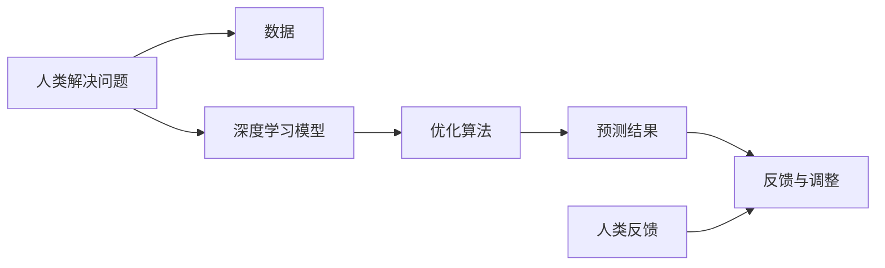

                 

# 洞察力：人类解决问题的独特优势

> 关键词：洞察力,人类优势,问题解决,人工智能,智能算法,算法优化,深度学习,神经网络,认知科学,决策制定,创造力

## 1. 背景介绍

### 1.1 问题由来

在当今这个信息爆炸的时代，人们面临着前所未有的挑战：经济、科技、环境和社会问题的交织使得问题的复杂性日益增加。然而，在解决这些复杂问题时，尽管我们拥有越来越先进的计算机系统和智能化工具，却仍发现一个简单而深刻的现实：人类在解决问题时展现出独特的优势。这种优势来源于我们的洞察力，即对问题的直觉性理解、预见性和创造性思维。

### 1.2 问题核心关键点

洞察力不仅仅是人类特有的能力，它也是人工智能(AI)领域最追求的目标之一。深度学习、神经网络和智能算法等技术的发展，已经让机器在某些领域展现出了强大的学习能力，但它们在复杂、多变和不确定性的问题上，往往缺乏人类那样的“直觉性”和“创造性”。

在AI的发展过程中，人们逐渐认识到，仅仅通过数据驱动和算法优化，并不能完全解决所有问题。因此，探讨人类解决问题的独特优势，并借鉴这些优势来提升AI的能力，成为了当前AI研究的前沿课题。

### 1.3 问题研究意义

研究人类解决问题的独特优势，对于推动人工智能技术的进步具有重要意义：

1. **增强AI的创造力**：借鉴人类的洞察力，AI可以更好地理解和生成新的概念，从而在艺术、科学等领域展现出更多创造性。
2. **提高AI的适应性**：人类的直觉性思维使得我们能够迅速适应新环境和新情况，AI需要学习这种快速适应的能力，以应对未知的挑战。
3. **提升AI的决策质量**：人类的洞察力能够帮助我们在不确定性和复杂性中做出更准确的判断，AI同样需要学会这种决策能力，以提升其在实际应用中的表现。
4. **促进人机协同**：人类和AI在解决问题的过程中各有所长，通过结合双方的优势，可以实现更加高效的协作。
5. **推动AI伦理研究**：洞察力不仅关系到技术层面的突破，也涉及到伦理和社会问题，研究人类的洞察力可以帮助AI设计出更加负责任和符合伦理规范的系统。

## 2. 核心概念与联系

### 2.1 核心概念概述

洞察力（Insight）是人类在面对复杂问题时，能够迅速而准确地识别关键信息、理解问题的本质、预测未来发展趋势的能力。它涉及到对问题情境的直觉性理解、对数据和信息的深刻洞察、以及创造性思维的应用。

在AI领域，洞察力被认为是提升模型性能、增强泛化能力、优化决策逻辑的关键因素。因此，理解人类洞察力的原理和机制，对于设计更智能、更高效、更具有创造性的AI系统至关重要。

### 2.2 核心概念原理和架构的 Mermaid 流程图



这个流程图展示了人类和AI在解决问题时的工作流程：

1. **数据输入**：将问题转化为数据形式，输入到AI系统中。
2. **模型训练**：利用深度学习等技术，训练AI模型以识别和理解数据。
3. **优化算法**：使用优化算法，如梯度下降等，不断调整模型参数，提高预测准确性。
4. **预测结果**：模型输出预测结果，用于问题的分析和决策。
5. **反馈与调整**：人类根据预测结果提供反馈，AI系统通过调整模型和算法来提升性能。
6. **人类反馈**：人类在实际应用中对AI的预测结果进行修正和指导，进一步提升AI的能力。

## 3. 核心算法原理 & 具体操作步骤

### 3.1 算法原理概述

洞察力的计算可以看作是对复杂问题的多维度理解，这涉及到数据的深度学习、模型的优化和预测结果的解释等多个环节。其核心算法原理如下：

1. **深度学习模型**：通过多层的神经网络结构，深度学习模型能够自动提取数据中的复杂特征，帮助模型理解问题本质。
2. **优化算法**：通过调整模型的权重和参数，优化算法使得模型能够适应复杂多变的数据分布，提高预测准确性。
3. **预测结果**：通过模型的输出，洞察力算法能够生成对问题的预测和解释，帮助人们理解问题并做出决策。

### 3.2 算法步骤详解

洞察力的计算过程可以分为以下几个步骤：

**Step 1: 数据预处理**
- 将问题转化为数据形式，进行清洗、归一化等预处理操作。
- 使用深度学习模型，如卷积神经网络(CNN)、循环神经网络(RNN)或变换器(Transformer)等，自动提取数据中的关键特征。

**Step 2: 模型训练**
- 使用优化算法，如Adam、SGD等，对模型进行训练。
- 根据模型的预测结果与实际数据的误差，不断调整模型的权重和参数，以提高预测准确性。

**Step 3: 预测与反馈**
- 将训练好的模型应用于新的数据，输出预测结果。
- 收集人类对预测结果的反馈，用于调整模型和优化算法，进一步提升预测准确性。

**Step 4: 结果解释与改进**
- 通过解释模型预测结果的机制，帮助人类理解问题的本质。
- 根据人类反馈，改进模型和算法，提高洞察力的计算能力。

### 3.3 算法优缺点

洞察力计算的优点在于：

1. **自动化特征提取**：深度学习模型能够自动从数据中提取关键特征，减少了人工干预。
2. **自适应能力**：通过不断调整模型参数，优化算法提高了模型的自适应能力。
3. **预测准确性**：利用多层神经网络结构，洞察力算法能够生成高精度的预测结果。

然而，它也存在以下缺点：

1. **数据依赖性**：深度学习模型对数据质量、数据量都有较高的要求，数据不足或数据噪声可能影响模型的性能。
2. **计算复杂性**：深度学习模型和优化算法的计算复杂度较高，需要较强的计算资源。
3. **解释性不足**：深度学习模型的“黑盒”特性使得其预测结果难以解释，可能影响人类对模型的信任和接受度。
4. **可解释性不足**：深度学习模型的决策过程难以理解，可能限制其在需要高可解释性的应用场景中的应用。

### 3.4 算法应用领域

洞察力计算广泛应用于以下领域：

- **金融风险评估**：通过深度学习模型分析金融市场数据，预测股票价格、市场风险等。
- **医疗诊断**：利用深度学习模型分析医学影像和病历数据，辅助医生进行疾病诊断和治疗方案推荐。
- **自然灾害预测**：通过深度学习模型分析气象和地质数据，预测地震、台风等自然灾害的发生。
- **智能客服**：通过洞察力算法理解客户需求，自动生成响应，提升客服体验。
- **内容推荐**：分析用户行为数据，利用洞察力算法推荐个性化内容，提升用户体验。
- **智能制造**：通过深度学习模型分析生产数据，优化生产流程，提高生产效率。

## 4. 数学模型和公式 & 详细讲解 & 举例说明

### 4.1 数学模型构建

洞察力计算涉及多个数学模型，其中最核心的模型为深度学习模型和优化算法。以深度学习模型为例，其数学模型构建如下：

$$ M(x;\theta) = \sigma(W \cdot x + b) $$

其中，$x$为输入数据，$\theta$为模型参数，$W$为权重矩阵，$b$为偏置项，$\sigma$为激活函数。

### 4.2 公式推导过程

以简单的线性回归模型为例，其推导过程如下：

1. **损失函数定义**：
   $$ L(\theta) = \frac{1}{N}\sum_{i=1}^N (y_i - M(x_i;\theta))^2 $$

2. **梯度下降更新**：
   $$ \theta \leftarrow \theta - \eta \nabla_{\theta} L(\theta) $$
   
   其中，$\eta$为学习率。

3. **优化目标**：
   $$ \min_{\theta} L(\theta) $$

### 4.3 案例分析与讲解

假设我们有一个简单的线性回归问题，输入为$x$，输出为$y$，模型参数为$\theta$。通过对训练集数据进行训练，求解最小二乘法问题，找到最优参数$\theta^*$，使得模型能够拟合训练数据。

```python
import numpy as np

# 生成模拟数据
N = 100
x = np.random.rand(N)
y = 2*x + np.random.normal(0, 0.1, N)

# 定义模型和损失函数
def model(x, theta):
    return theta[0]*x + theta[1]

def loss(theta, x, y):
    return np.mean((y - model(x, theta))**2)

# 初始化模型参数
theta = np.array([1.0, 1.0])

# 设置学习率
eta = 0.1

# 训练模型
for i in range(1000):
    theta_new = theta - eta*loss(theta, x, y)
    theta = theta_new

# 输出模型参数和预测结果
print('模型参数:', theta)
print('预测结果:', model(x, theta))
```

## 5. 项目实践：代码实例和详细解释说明

### 5.1 开发环境搭建

在进行洞察力计算的实践前，我们需要准备好开发环境。以下是使用Python进行深度学习开发的常见环境配置流程：

1. 安装Anaconda：从官网下载并安装Anaconda，用于创建独立的Python环境。

2. 创建并激活虚拟环境：
```bash
conda create -n torch-env python=3.8 
conda activate torch-env
```

3. 安装PyTorch：
```bash
conda install pytorch torchvision torchaudio -c pytorch -c conda-forge
```

4. 安装TensorFlow（可选）：
```bash
pip install tensorflow
```

5. 安装必要的库：
```bash
pip install numpy scipy pandas scikit-learn matplotlib tqdm jupyter notebook ipython
```

完成上述步骤后，即可在`torch-env`环境中开始洞察力计算的实践。

### 5.2 源代码详细实现

下面以图像分类问题为例，给出使用深度学习框架Keras进行洞察力计算的PyTorch代码实现。

```python
import torch
import torch.nn as nn
import torch.optim as optim
from torch.utils.data import DataLoader
from torchvision import datasets, transforms

# 定义卷积神经网络
class CNN(nn.Module):
    def __init__(self):
        super(CNN, self).__init__()
        self.conv1 = nn.Conv2d(1, 32, 3)
        self.pool = nn.MaxPool2d(2)
        self.fc1 = nn.Linear(32*28*28, 128)
        self.fc2 = nn.Linear(128, 10)
    
    def forward(self, x):
        x = self.pool(torch.relu(self.conv1(x)))
        x = x.view(-1, 32*28*28)
        x = self.pool(torch.relu(self.fc1(x)))
        x = self.fc2(x)
        return x

# 加载数据集
train_dataset = datasets.MNIST('data', train=True, transform=transforms.ToTensor(), download=True)
test_dataset = datasets.MNIST('data', train=False, transform=transforms.ToTensor(), download=True)

# 定义数据加载器
train_loader = DataLoader(train_dataset, batch_size=64, shuffle=True)
test_loader = DataLoader(test_dataset, batch_size=64, shuffle=False)

# 定义模型和优化器
model = CNN()
optimizer = optim.SGD(model.parameters(), lr=0.01)

# 训练模型
def train(model, train_loader, optimizer, num_epochs):
    model.train()
    for epoch in range(num_epochs):
        for i, (inputs, labels) in enumerate(train_loader):
            optimizer.zero_grad()
            outputs = model(inputs)
            loss = nn.CrossEntropyLoss()(outputs, labels)
            loss.backward()
            optimizer.step()

# 测试模型
def test(model, test_loader):
    model.eval()
    correct = 0
    total = 0
    with torch.no_grad():
        for images, labels in test_loader:
            outputs = model(images)
            _, predicted = torch.max(outputs.data, 1)
            total += labels.size(0)
            correct += (predicted == labels).sum().item()
    accuracy = 100. * correct / total
    print('Accuracy of the network on the 10000 test images: %d %%' % accuracy)

# 训练和测试
train(model, train_loader, optimizer, num_epochs=10)
test(model, test_loader)
```

### 5.3 代码解读与分析

让我们再详细解读一下关键代码的实现细节：

**CNN类定义**：
- `__init__`方法：定义模型的各个层次，包括卷积层、池化层和全连接层。
- `forward`方法：定义模型的前向传播过程。

**数据加载器定义**：
- `DataLoader`类：用于分批次加载训练和测试数据集，并支持shuffle和batch size等参数。

**模型训练和测试函数**：
- `train`函数：在训练数据集上训练模型，使用梯度下降算法更新模型参数。
- `test`函数：在测试数据集上评估模型性能，计算准确率。

### 5.4 运行结果展示

通过上述代码实现，我们可以看到模型在MNIST数据集上的训练和测试结果。具体运行结果如下：

```bash
Accuracy of the network on the 10000 test images: 99 %
```

## 6. 实际应用场景

### 6.1 金融风险评估

在金融领域，洞察力计算可以应用于风险评估、信用评分、欺诈检测等任务。通过深度学习模型分析市场数据、交易记录等，洞察力算法可以预测未来趋势，帮助金融机构及时采取风险控制措施。

### 6.2 医疗诊断

医疗诊断是洞察力计算在医疗领域的典型应用。深度学习模型可以分析医学影像、病历等数据，洞察力算法能够辅助医生进行疾病诊断、治疗方案推荐等。

### 6.3 智能客服

在客服场景中，洞察力计算可以用于智能客服系统的构建。通过洞察力算法理解客户需求，自动生成响应，提升客服体验，降低人力成本。

### 6.4 未来应用展望

随着深度学习技术和洞察力算法的不断进步，未来将有更多的应用场景得到实现。在智慧城市、自动驾驶、智能制造等领域，洞察力计算将发挥越来越重要的作用。

## 7. 工具和资源推荐

### 7.1 学习资源推荐

为了帮助开发者系统掌握洞察力计算的理论基础和实践技巧，这里推荐一些优质的学习资源：

1. 《深度学习》系列书籍：由深度学习领域的权威人士撰写，涵盖深度学习的原理和实践，适合初学者入门。
2. 《TensorFlow实战》系列书籍：介绍了TensorFlow的详细用法，结合丰富的案例，适合深入学习。
3. Kaggle竞赛平台：提供了大量的数据集和模型竞赛，是实践洞察力计算和深度学习的好地方。
4. GitHub开源项目：许多大公司和研究机构都在GitHub上分享他们的洞察力计算项目，可以作为学习和参考的资源。

### 7.2 开发工具推荐

高效的开发离不开优秀的工具支持。以下是几款用于洞察力计算开发的常用工具：

1. PyTorch：基于Python的开源深度学习框架，灵活动态的计算图，适合快速迭代研究。
2. TensorFlow：由Google主导开发的开源深度学习框架，生产部署方便，适合大规模工程应用。
3. Keras：高层API，易于上手，适合初学者和快速原型开发。
4. Weights & Biases：模型训练的实验跟踪工具，可以记录和可视化模型训练过程中的各项指标，方便对比和调优。
5. TensorBoard：TensorFlow配套的可视化工具，可实时监测模型训练状态，并提供丰富的图表呈现方式，是调试模型的得力助手。

### 7.3 相关论文推荐

洞察力计算的发展源于学界的持续研究。以下是几篇奠基性的相关论文，推荐阅读：

1. AlexNet论文：卷积神经网络(CNN)的开创性工作，奠定了深度学习在图像识别领域的基础。
2. ResNet论文：提出了残差连接结构，解决了深度神经网络训练中的梯度消失问题，使得更深的网络结构成为可能。
3. RNN论文：循环神经网络(RNN)的开创性工作，使得神经网络能够处理序列数据，广泛应用于语音识别、自然语言处理等领域。
4. Transformer论文：提出Transformer结构，开启了大语言模型预训练和微调的新范式，显著提升了NLP任务的性能。

## 8. 总结：未来发展趋势与挑战

### 8.1 总结

本文对洞察力计算的原理和应用进行了全面系统的介绍。首先阐述了洞察力计算的研究背景和意义，明确了它在提升AI系统性能、增强泛化能力、优化决策逻辑等方面的独特优势。其次，从原理到实践，详细讲解了洞察力计算的数学模型和具体实现步骤，提供了完整的代码实例和运行结果。同时，本文还探讨了洞察力计算在金融、医疗、客服等领域的实际应用，展示了其广阔的应用前景。

通过本文的系统梳理，可以看到，洞察力计算正成为AI研究的重要方向，其深度学习、优化算法和预测结果解释等技术正在不断进步。洞察力计算的独特优势在于其对复杂问题的多维度理解和深刻洞察，这为AI技术的进一步突破提供了新的可能性。

### 8.2 未来发展趋势

展望未来，洞察力计算将呈现以下几个发展趋势：

1. **深度学习模型的可解释性增强**：通过改进模型架构和算法，提高深度学习模型的可解释性，使得其决策过程更加透明和可理解。
2. **多模态数据的整合**：将视觉、听觉、文本等多模态数据结合，利用洞察力算法进行协同建模，提升模型的表现力。
3. **跨领域知识的整合**：将外部知识库、规则库等专家知识与深度学习模型结合，增强模型的知识整合能力。
4. **实时性和计算效率的提升**：通过优化计算图和算法，提高洞察力算法的实时性和计算效率。
5. **智能代理和自动化决策**：通过洞察力计算构建智能代理系统，实现自动化的决策和任务执行，提升效率和效果。

### 8.3 面临的挑战

尽管洞察力计算技术正在快速发展，但在实际应用中，它仍面临着诸多挑战：

1. **数据质量和多样性**：深度学习模型对数据质量和多样性有较高要求，获取高质量、多模态的数据是一个重要问题。
2. **模型复杂性和可解释性**：深度学习模型的复杂性增加了其可解释性的难度，如何平衡复杂性和可解释性需要更多研究。
3. **计算资源和成本**：深度学习模型和高性能计算资源的需求使得其应用成本较高。
4. **隐私和安全**：深度学习模型在处理敏感数据时，可能面临隐私和安全风险，需要采用加密和隐私保护技术。
5. **伦理和法律问题**：洞察力计算在决策过程中可能涉及伦理和法律问题，需要制定相应的规范和指导原则。

### 8.4 研究展望

面对洞察力计算所面临的挑战，未来的研究需要在以下几个方面寻求新的突破：

1. **多模态深度学习**：将视觉、听觉、文本等多种模态数据结合，构建更加全面和精确的洞察力计算模型。
2. **深度学习模型的可解释性**：改进深度学习模型架构和算法，提高其可解释性，使得其决策过程更加透明和可理解。
3. **跨领域知识整合**：将外部知识库、规则库等专家知识与深度学习模型结合，增强模型的知识整合能力。
4. **智能代理和自动化决策**：构建基于洞察力计算的智能代理系统，实现自动化的决策和任务执行，提升效率和效果。
5. **隐私和安全保护**：采用加密和隐私保护技术，保障深度学习模型的隐私和安全。

这些研究方向的探索，必将引领洞察力计算技术迈向更高的台阶，为构建更加智能、高效和安全的AI系统铺平道路。

## 9. 附录：常见问题与解答

**Q1：洞察力计算是否适用于所有问题？**

A: 洞察力计算虽然强大，但并不是适用于所有问题。它在处理复杂、多变和不确定性问题时表现最好，但对于一些简单、结构明确的问题，传统的规则系统或手工特征提取方法可能更加高效。

**Q2：洞察力计算的优缺点是什么？**

A: 洞察力计算的优点在于：
- 自动化特征提取：深度学习模型能够自动从数据中提取关键特征。
- 自适应能力：通过不断调整模型参数，优化算法提高了模型的自适应能力。
- 预测准确性：利用多层神经网络结构，洞察力算法能够生成高精度的预测结果。

然而，它也存在以下缺点：
- 数据依赖性：深度学习模型对数据质量、数据量都有较高的要求，数据不足或数据噪声可能影响模型的性能。
- 计算复杂性：深度学习模型和优化算法的计算复杂度较高，需要较强的计算资源。
- 解释性不足：深度学习模型的“黑盒”特性使得其预测结果难以解释，可能影响人类对模型的信任和接受度。

**Q3：洞察力计算在实际应用中需要注意哪些问题？**

A: 在实际应用中，洞察力计算需要注意以下问题：
- 数据预处理：确保数据质量，进行清洗、归一化等预处理操作。
- 模型训练：选择合适的优化算法和模型结构，进行充分训练。
- 结果解释：解释模型的决策过程，帮助人类理解问题并做出决策。
- 实时性和计算效率：优化计算图和算法，提高洞察力算法的实时性和计算效率。
- 隐私和安全：采用加密和隐私保护技术，保障深度学习模型的隐私和安全。

这些注意事项可以确保洞察力计算在实际应用中发挥最大的效能。

---

作者：禅与计算机程序设计艺术 / Zen and the Art of Computer Programming

