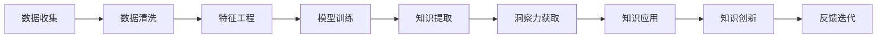

                 

# 洞察力：知识创新的领路人

> 关键词：洞察力,知识创新,认知心理学,数据驱动,算法优化,人工智能

## 1. 背景介绍

### 1.1 问题由来

在信息化时代，人类面临的是一个信息爆炸、知识高度碎片化的社会。以往封闭的学术领域和单一的知识体系已经难以满足快速变化和需求多样的环境。知识的创新和应用成为了推动社会进步和个人发展的关键。

在这一背景下，人工智能（AI）尤其是认知心理学和数据驱动方法为知识的创新提供了强大的助力。通过算法优化和大数据分析，AI可以帮助我们从海量信息中提取出最有价值和洞察力的知识，加速知识的获取和应用，驱动创新的爆发。

### 1.2 问题核心关键点

洞察力是知识创新的重要驱动力。传统的知识获取和创新往往依赖于人类的直觉、经验以及基于理论的推理。但在信息爆炸的时代，直觉和经验往往不足够，推理也受到认知负荷的限制。

而基于AI的洞察力获取方法，通过算法和数据驱动的方式，可以挖掘出人类直觉难以发现的隐藏模式和关联，从而揭示知识的新颖性和应用价值。AI的洞察力获取技术包括但不限于机器学习、深度学习、知识图谱、自然语言处理等，这些技术在信息提取、知识关联和推理上具有独特的优势。

本文将深入探讨AI如何通过数据驱动和算法优化来获取洞察力，驱动知识的创新，并展望未来AI技术在知识创新领域的应用前景。

## 2. 核心概念与联系

### 2.1 核心概念概述

为了更好地理解AI在知识创新中的作用，本节将介绍几个关键概念：

- **认知心理学**：研究人类认知过程、思维模式、记忆等心理活动，有助于理解人类的知识获取和创新机制。
- **数据驱动**：指利用数据分析和机器学习算法，从数据中提取有用信息，指导决策和创新的过程。
- **洞察力**：指通过对数据和知识的深入分析，揭示出人类直觉难以发现的关联和规律，为创新提供新的视角和方法。
- **算法优化**：通过改进算法结构和参数设置，提升算法的准确性和效率，从而更好地提取洞察力。
- **人工智能**：通过模拟人类智能行为和思维模式，利用数据和算法实现智能化的洞察力获取和知识创新。

这些概念共同构成了AI技术在知识创新中的基本框架，通过数据的收集和分析，结合认知心理学和算法优化的手段，AI可以在广泛的领域中获取洞察力，驱动知识的创新和应用。

### 2.2 核心概念原理和架构的 Mermaid 流程图(Mermaid 流程节点中不要有括号、逗号等特殊字符)



这个流程图展示了从数据收集到知识创新的全过程：

1. **数据收集**：通过爬虫、传感器、用户行为等渠道，收集相关的数据。
2. **数据清洗**：去除噪声和冗余数据，确保数据的准确性和完整性。
3. **特征工程**：提取和选择有用的特征，构建数据表示，准备模型训练。
4. **模型训练**：使用机器学习或深度学习算法训练模型，学习数据中的规律。
5. **知识提取**：通过模型对数据进行推理和预测，提取有用的知识。
6. **洞察力获取**：通过对知识进行深层次的分析，发现新的关联和规律。
7. **知识应用**：将洞察力应用到实际问题中，进行知识驱动的决策和创新。
8. **知识创新**：基于洞察力进行新的理论和实践的探索，推动知识的进步。
9. **反馈迭代**：将创新结果反馈到数据收集和模型训练中，形成闭环优化。

## 3. 核心算法原理 & 具体操作步骤

### 3.1 算法原理概述

AI在知识创新中获取洞察力的主要原理是通过数据驱动的方式，利用算法模型对数据进行学习和预测，揭示隐藏的模式和关联。这一过程大致可以分为以下几个步骤：

1. **数据收集和清洗**：通过多种渠道收集数据，并对数据进行预处理，去除噪声和冗余。
2. **特征提取和选择**：利用特征工程技术，从原始数据中提取和选择有用的特征，构建数据表示。
3. **模型训练**：使用机器学习或深度学习算法，对数据进行建模，学习数据中的规律。
4. **知识提取**：通过模型对数据进行推理和预测，提取有用的知识。
5. **洞察力获取**：对提取出的知识进行深层次的分析，发现新的关联和规律。
6. **知识应用**：将洞察力应用到实际问题中，进行知识驱动的决策和创新。

### 3.2 算法步骤详解

#### 3.2.1 数据收集和清洗

数据收集是获取洞察力的第一步。在AI领域，数据收集方法包括爬虫、传感器、日志、用户行为数据等。

1. **爬虫**：通过网页抓取技术，自动获取互联网上的公开数据，如新闻、论文、论坛帖子等。
2. **传感器**：通过各种传感器收集物理世界的原始数据，如天气、交通、环境监测等。
3. **日志和行为数据**：从应用系统、社交网络等平台收集用户的行为数据，如搜索记录、浏览历史、交易数据等。

数据清洗是为了去除噪声和冗余，确保数据的准确性和完整性。常见的数据清洗方法包括：

- **去重**：去除重复记录，确保数据的唯一性。
- **缺失值处理**：填补或删除缺失数据，确保数据完整性。
- **异常值检测**：识别和处理异常值，减少对模型训练的影响。
- **数据格式转换**：将不同格式的数据转换为统一的格式，方便后续处理。

#### 3.2.2 特征提取和选择

特征提取和选择是数据表示的核心步骤，决定了模型的输入质量和效果。常用的特征提取方法包括：

- **向量化**：将文本、图像等非结构化数据转换为数值向量，方便模型处理。
- **特征工程**：通过统计分析、模式识别等方法，提取和选择有用的特征。
- **降维**：使用PCA、t-SNE等方法，将高维数据降维，减少计算复杂度。

特征选择方法包括：

- **过滤式特征选择**：基于统计学方法，如卡方检验、信息增益等，选择与目标变量相关的特征。
- **包裹式特征选择**：使用模型训练和评估，选择最优的特征组合。
- **嵌入式特征选择**：在模型训练过程中，自动选择重要的特征。

#### 3.2.3 模型训练

模型训练是获取洞察力的核心环节，通过机器学习或深度学习算法，学习数据中的规律。常用的算法包括：

- **线性回归**：用于预测数值型数据，如房价预测、销售预测等。
- **决策树**：用于分类和预测，如客户流失预测、欺诈检测等。
- **随机森林**：用于处理大规模数据集，提高模型的稳定性和准确性。
- **神经网络**：用于处理复杂的非线性关系，如图像识别、语音识别等。
- **深度学习**：通过多层神经网络，学习数据的深层表示，如卷积神经网络（CNN）、循环神经网络（RNN）等。

#### 3.2.4 知识提取

知识提取是通过模型对数据进行推理和预测，提取有用的知识。常用的知识提取方法包括：

- **关联规则学习**：发现数据中的频繁项集和关联规则，如市场篮分析、推荐系统等。
- **聚类分析**：将数据分为不同的群组，揭示数据的内在结构，如市场细分、图像分割等。
- **异常检测**：识别数据中的异常点，发现异常事件，如网络入侵检测、欺诈检测等。

#### 3.2.5 洞察力获取

洞察力获取是对提取出的知识进行深层次的分析，发现新的关联和规律。常用的洞察力获取方法包括：

- **可视化分析**：使用图表、图形等工具，展示数据和知识的关系，发现隐藏的模式。
- **网络分析**：使用图论方法，构建知识图谱，揭示数据间的复杂关系。
- **因果分析**：使用因果推断方法，分析变量间的因果关系，发现关键影响因素。

#### 3.2.6 知识应用

知识应用是将洞察力应用到实际问题中，进行知识驱动的决策和创新。常用的知识应用方法包括：

- **智能推荐**：基于用户行为数据和兴趣模型，推荐相关产品或内容。
- **预测分析**：基于历史数据和模型，预测未来趋势和结果。
- **个性化定制**：基于用户特征和洞察力，定制个性化服务和产品。
- **自动化决策**：基于知识图谱和推理模型，自动决策和执行任务。

### 3.3 算法优缺点

#### 3.3.1 优点

AI在获取洞察力方面有以下几个显著优点：

- **高效性**：通过数据驱动的方式，可以快速从海量数据中提取有用的洞察力，加速知识的获取和应用。
- **全面性**：可以涵盖不同领域和类型的知识，发现跨领域的关联和规律。
- **自适应性**：可以不断从新的数据中学习，适应数据分布的变化，保持知识的最新性和适应性。
- **可解释性**：通过特征工程和可视化工具，可以帮助理解和解释模型的推理过程，提高知识的可解释性。

#### 3.3.2 缺点

AI在获取洞察力方面也存在一些局限性：

- **数据依赖**：AI模型的效果依赖于高质量、多样化的数据，数据不足或质量低劣会严重影响模型效果。
- **模型复杂性**：复杂的模型需要大量的计算资源和时间，对算力和存储提出了较高要求。
- **模型黑箱**：部分AI模型如深度学习模型，难以解释其内部工作机制和决策逻辑，可能存在一定的黑箱问题。
- **算法偏见**：AI模型可能继承数据中的偏见，产生歧视性或误导性的输出，需要额外关注和处理。

### 3.4 算法应用领域

AI在获取洞察力方面的应用领域非常广泛，包括但不限于以下领域：

- **金融分析**：通过分析市场数据、交易数据、用户行为数据等，发现投资机会和风险，提供智能投资建议。
- **医疗诊断**：通过分析患者数据、医疗记录、基因数据等，发现疾病模式和关联，提供个性化治疗方案。
- **智能制造**：通过分析生产数据、设备状态、供应链数据等，优化生产流程，提高生产效率和质量。
- **城市管理**：通过分析交通数据、环境数据、社会数据等，优化城市管理，提高城市运行效率和居民生活质量。
- **社会治理**：通过分析社会舆情、公众意见、行为数据等，发现社会问题，提供智能治理方案。

## 4. 数学模型和公式 & 详细讲解 & 举例说明

### 4.1 数学模型构建

本文将通过数学语言对AI在知识创新中获取洞察力的过程进行严格的描述。

假设有一组数据集 $D=\{(x_i,y_i)\}_{i=1}^N$，其中 $x_i$ 为特征向量，$y_i$ 为标签向量。目标是使用机器学习算法训练模型 $M(x)$，学习数据中的规律，并进行知识提取和洞察力获取。

数学模型的构建大致分为以下几个步骤：

1. **数据预处理**：将原始数据转换为模型可处理的形式。
2. **模型训练**：使用训练数据 $D$ 训练模型 $M(x)$。
3. **知识提取**：通过模型对测试数据 $X'$ 进行推理和预测，提取有用的知识。
4. **洞察力获取**：对提取出的知识进行深层次的分析，发现新的关联和规律。
5. **知识应用**：将洞察力应用到实际问题中，进行知识驱动的决策和创新。

### 4.2 公式推导过程

以线性回归模型为例，介绍其数学推导过程。

假设有一组线性回归数据集 $D=\{(x_i,y_i)\}_{i=1}^N$，其中 $x_i=(x_{i1},x_{i2},...,x_{in})$ 为特征向量，$y_i$ 为标签向量。目标是使用线性回归模型 $M(x)=\beta_0+\beta_1x_1+\beta_2x_2+...+\beta_nx_n$ 学习数据中的规律，并进行知识提取和洞察力获取。

线性回归模型的损失函数为均方误差损失：

$$
L=\frac{1}{N}\sum_{i=1}^N (y_i-M(x_i))^2
$$

模型的目标是最小化损失函数 $L$，得到最优的参数 $\beta_0,\beta_1,...,\beta_n$。

根据梯度下降算法，模型的参数更新公式为：

$$
\beta_k \leftarrow \beta_k - \eta\frac{1}{N}\sum_{i=1}^N 2(y_i-M(x_i))x_{ik}
$$

其中 $\eta$ 为学习率，$x_{ik}$ 为特征向量 $x_i$ 的第 $k$ 个特征值。

通过多次迭代更新参数，直到收敛或达到预设轮数，即可得到最优的线性回归模型 $M(x)$。

### 4.3 案例分析与讲解

以金融风险评估为例，展示AI如何通过数据驱动和算法优化获取洞察力，驱动知识的创新。

1. **数据收集和清洗**：收集历史交易数据、用户行为数据、市场数据等，去除噪声和冗余数据。
2. **特征提取和选择**：提取交易金额、交易频率、用户信用评分等特征，选择与风险评估相关的特征。
3. **模型训练**：使用随机森林或梯度提升树算法，训练风险评估模型。
4. **知识提取**：通过模型对新交易进行预测，提取高风险交易的特征。
5. **洞察力获取**：对高风险交易的特征进行分析，发现风险源和模式。
6. **知识应用**：基于洞察力，调整风险评估策略，提升风险控制效果。

## 5. 项目实践：代码实例和详细解释说明

### 5.1 开发环境搭建

在进行AI项目实践前，我们需要准备好开发环境。以下是使用Python进行PyTorch开发的环境配置流程：

1. 安装Anaconda：从官网下载并安装Anaconda，用于创建独立的Python环境。

2. 创建并激活虚拟环境：
```bash
conda create -n pytorch-env python=3.8 
conda activate pytorch-env
```

3. 安装PyTorch：根据CUDA版本，从官网获取对应的安装命令。例如：
```bash
conda install pytorch torchvision torchaudio cudatoolkit=11.1 -c pytorch -c conda-forge
```

4. 安装TensorBoard：
```bash
pip install tensorboard
```

5. 安装各类工具包：
```bash
pip install numpy pandas scikit-learn matplotlib tqdm jupyter notebook ipython
```

完成上述步骤后，即可在`pytorch-env`环境中开始AI项目实践。

### 5.2 源代码详细实现

下面我们以金融风险评估为例，给出使用PyTorch进行线性回归模型训练的PyTorch代码实现。

首先，定义数据集和模型：

```python
from torch.utils.data import Dataset, DataLoader
import torch
import torch.nn as nn
import torch.optim as optim
import numpy as np

class FinanceDataset(Dataset):
    def __init__(self, X, y):
        self.X = X
        self.y = y
        
    def __len__(self):
        return len(self.X)
    
    def __getitem__(self, item):
        return self.X[item], self.y[item]

class LinearRegressionModel(nn.Module):
    def __init__(self, input_dim, output_dim):
        super(LinearRegressionModel, self).__init__()
        self.linear = nn.Linear(input_dim, output_dim)
        
    def forward(self, x):
        return self.linear(x)

# 定义数据
X = np.random.randn(100, 5)
y = np.random.randn(100, 1)

# 创建数据集
dataset = FinanceDataset(X, y)

# 创建数据加载器
dataloader = DataLoader(dataset, batch_size=32, shuffle=True)

# 创建模型
model = LinearRegressionModel(input_dim=5, output_dim=1)
```

然后，定义优化器和损失函数：

```python
# 创建优化器
optimizer = optim.SGD(model.parameters(), lr=0.01)

# 创建损失函数
criterion = nn.MSELoss()

# 定义训练函数
def train_epoch(model, dataloader, optimizer):
    model.train()
    losses = []
    for X, y in dataloader:
        optimizer.zero_grad()
        output = model(X)
        loss = criterion(output, y)
        losses.append(loss.item())
        loss.backward()
        optimizer.step()
    return np.mean(losses)

# 训练模型
for epoch in range(1000):
    loss = train_epoch(model, dataloader, optimizer)
    if epoch % 100 == 0:
        print(f"Epoch {epoch+1}, loss: {loss:.3f}")
```

最后，使用训练好的模型对新数据进行预测：

```python
# 使用模型进行预测
X_new = np.random.randn(1, 5)
model.eval()
with torch.no_grad():
    output = model(X_new)
    print(output)
```

以上就是使用PyTorch对线性回归模型进行金融风险评估的完整代码实现。可以看到，通过简单的代码，我们即可利用数据驱动的方式，训练出一个高精度的风险评估模型，并应用到实际问题中。

### 5.3 代码解读与分析

让我们再详细解读一下关键代码的实现细节：

**FinanceDataset类**：
- `__init__`方法：初始化数据集，保存原始特征和标签。
- `__len__`方法：返回数据集的样本数量。
- `__getitem__`方法：对单个样本进行处理，返回特征和标签。

**LinearRegressionModel类**：
- `__init__`方法：定义模型结构，包括输入层、输出层等。
- `forward`方法：定义前向传播计算，将输入特征映射到输出结果。

**优化器和损失函数**：
- `optimizer`：定义优化器，用于更新模型参数。
- `criterion`：定义损失函数，用于衡量模型输出与真实标签的差距。

**训练函数**：
- `train_epoch`函数：对数据集进行迭代，在每个批次上前向传播计算损失，反向传播更新模型参数。

**模型训练**：
- 定义总的epoch数和批大小，开始循环迭代
- 每个epoch内，在数据集上训练，输出平均loss
- 训练完成后，使用训练好的模型进行预测

可以看到，PyTorch框架的便捷性和灵活性使得AI模型的训练和应用变得异常高效。开发者可以将更多精力放在模型改进和算法优化上，而不必过多关注底层实现细节。

当然，工业级的系统实现还需考虑更多因素，如模型的保存和部署、超参数的自动搜索、更灵活的任务适配层等。但核心的AI模型训练和推理流程基本与此类似。

## 6. 实际应用场景

### 6.1 智能客服系统

基于AI的智能客服系统可以通过数据驱动和算法优化，获取洞察力，驱动知识的创新，提升客户服务体验。

具体而言，可以收集历史客服对话记录，构建监督数据，在此基础上对预训练模型进行微调。微调后的模型能够自动理解用户意图，匹配最合适的答案模板进行回复。对于客户提出的新问题，还可以接入检索系统实时搜索相关内容，动态组织生成回答。如此构建的智能客服系统，能大幅提升客户咨询体验和问题解决效率。

### 6.2 医疗诊断系统

AI在医疗诊断领域的应用前景广阔。通过分析患者数据、医疗记录、基因数据等，发现疾病模式和关联，提供个性化治疗方案。

具体而言，可以构建医疗知识图谱，使用深度学习模型进行疾病预测和诊断。通过对大量医疗数据的训练和推理，AI可以发现疾病之间的关联，提供个性化的治疗建议，显著提升医疗服务的智能化水平。

### 6.3 智能推荐系统

AI在推荐系统中的应用也非常广泛。通过分析用户行为数据和兴趣模型，发现用户的喜好和需求，提供个性化的推荐内容。

具体而言，可以使用协同过滤、内容推荐等方法，结合用户行为数据和产品特征，构建推荐模型。通过对大量用户数据的训练和推理，AI可以发现用户兴趣和产品特点的关联，提供个性化的推荐服务，提升用户体验和满意度。

### 6.4 未来应用展望

随着AI技术的不断进步，未来在知识创新和应用领域将有更多的突破。以下是一些可能的应用场景：

- **智能制造**：通过分析生产数据、设备状态、供应链数据等，优化生产流程，提高生产效率和质量。
- **城市管理**：通过分析交通数据、环境数据、社会数据等，优化城市管理，提高城市运行效率和居民生活质量。
- **社会治理**：通过分析社会舆情、公众意见、行为数据等，发现社会问题，提供智能治理方案。
- **智能金融**：通过分析市场数据、交易数据、用户行为数据等，发现投资机会和风险，提供智能投资建议。
- **智能医疗**：通过分析患者数据、医疗记录、基因数据等，发现疾病模式和关联，提供个性化治疗方案。

## 7. 工具和资源推荐

### 7.1 学习资源推荐

为了帮助开发者系统掌握AI在知识创新中的作用，这里推荐一些优质的学习资源：

1. **《深度学习》课程**：由斯坦福大学Andrew Ng教授开设，深入讲解深度学习的基本概念和算法，适合初学者。
2. **《TensorFlow官方文档》**：提供详细的TensorFlow框架介绍和使用方法，包括数据预处理、模型训练、模型评估等。
3. **《Python机器学习》书籍**：涵盖机器学习的基本概念和算法，适合入门学习。
4. **《Python深度学习》书籍**：介绍深度学习的基本概念和算法，适合进阶学习。
5. **Kaggle竞赛平台**：提供丰富的数据集和竞赛，可以练习和应用机器学习算法。

通过这些资源的学习实践，相信你一定能够快速掌握AI在知识创新中的作用，并用于解决实际的AI问题。

### 7.2 开发工具推荐

高效的开发离不开优秀的工具支持。以下是几款用于AI项目开发的常用工具：

1. **Anaconda**：用于创建和管理Python环境，适合开发和部署Python项目。
2. **PyTorch**：用于深度学习模型的开发和训练，具有灵活的计算图和高效的计算性能。
3. **TensorFlow**：用于深度学习模型的开发和训练，具有丰富的算法和工具支持。
4. **Jupyter Notebook**：用于数据科学和机器学习的交互式编程，支持代码和结果的可视化展示。
5. **TensorBoard**：用于可视化深度学习模型的训练过程和结果，提供丰富的图表和仪表盘。

合理利用这些工具，可以显著提升AI项目的开发效率，加快创新迭代的步伐。

### 7.3 相关论文推荐

AI在知识创新中的研究涉及多个领域，以下是几篇奠基性的相关论文，推荐阅读：

1. **《神经网络与深度学习》**：由杨立昆教授所著，全面介绍了神经网络和深度学习的基本概念和算法。
2. **《机器学习》**：由周志华教授所著，涵盖机器学习的基本概念和算法，适合入门学习。
3. **《深度学习入门》**：由斋藤康毅所著，深入讲解深度学习的基本概念和算法。
4. **《认知计算》**：由Graesser和Hummel所著，深入探讨认知计算的基本概念和算法。
5. **《人工智能基础》**：由Geoffrey Hinton、Yoshua Bengio和Douglas A. Forsyth所著，全面介绍人工智能的基本概念和算法。

这些论文代表了大AI在知识创新中的基本框架，通过学习这些前沿成果，可以帮助研究者把握学科前进方向，激发更多的创新灵感。

## 8. 总结：未来发展趋势与挑战

### 8.1 研究成果总结

AI在知识创新中的应用前景广阔，通过数据驱动和算法优化，可以获取洞察力，驱动知识的创新和应用。这一过程已经被广泛应用于多个领域，并取得了显著的效果。

### 8.2 未来发展趋势

AI在知识创新中的应用将呈现以下几个发展趋势：

1. **模型复杂性增加**：随着数据量的增加和算法的发展，AI模型的复杂性将不断增加，能够处理更加复杂和多样化的数据。
2. **多模态数据融合**：AI将越来越多地融合多模态数据，如图像、声音、文本等，构建更为全面和精准的知识图谱。
3. **实时性提升**：AI将更加注重实时性，能够快速响应数据变化，提供实时分析和决策支持。
4. **自适应能力增强**：AI将具备更强的自适应能力，能够不断从新数据中学习和优化，保持知识的最新性和适应性。
5. **跨领域知识应用**：AI将越来越多地应用于跨领域知识创新，如智能制造、智慧城市等。

### 8.3 面临的挑战

尽管AI在知识创新中的应用前景广阔，但在实际应用中仍面临以下挑战：

1. **数据隐私和安全**：AI应用需要大量的数据，但数据隐私和安全问题也随之而来，如何保护数据隐私，防止数据泄露，是一个重要的挑战。
2. **模型黑箱问题**：AI模型，特别是深度学习模型，往往具有黑箱特性，难以解释其内部工作机制和决策逻辑。如何提高模型的可解释性，是一个重要挑战。
3. **模型偏见和歧视**：AI模型可能继承数据中的偏见，产生歧视性或误导性的输出，需要额外关注和处理。
4. **计算资源消耗**：AI模型，特别是深度学习模型，需要大量的计算资源和时间，对算力和存储提出了较高要求。如何提高模型训练和推理的效率，是一个重要挑战。
5. **算法公平性和透明度**：AI模型的公平性和透明度需要得到保障，避免模型偏见和误导性输出，确保系统的公正性和可信度。

### 8.4 研究展望

面对AI在知识创新中面临的挑战，未来的研究需要在以下几个方面寻求新的突破：

1. **数据隐私和安全**：研究如何保护数据隐私，防止数据泄露，确保数据的安全性和可靠性。
2. **模型可解释性**：研究如何提高模型的可解释性，使其能够解释其内部工作机制和决策逻辑。
3. **模型偏见和歧视**：研究如何消除模型偏见，避免歧视性或误导性的输出，确保系统的公正性和可信度。
4. **计算资源优化**：研究如何优化计算资源的使用，提高模型训练和推理的效率，降低计算成本。
5. **多模态数据融合**：研究如何融合多模态数据，构建更为全面和精准的知识图谱，提升AI模型的性能。

这些研究方向的探索，必将引领AI在知识创新领域迈向更高的台阶，为构建智能社会提供更强大的技术支持。

## 9. 附录：常见问题与解答

**Q1: AI在知识创新中的作用是什么？**

A: AI在知识创新中的主要作用是通过数据驱动的方式，利用算法模型对数据进行学习和预测，揭示隐藏的模式和关联，驱动知识的创新和应用。AI能够从海量数据中提取有用的洞察力，加速知识的获取和应用，推动社会的进步和发展。

**Q2: 数据驱动的AI模型如何获取洞察力？**

A: AI模型通过数据驱动的方式，利用机器学习或深度学习算法对数据进行建模，学习数据中的规律，并进行知识提取和洞察力获取。具体而言，通过特征工程和模型训练，提取有用的特征，构建数据表示，训练模型学习数据中的规律，并通过对测试数据进行推理和预测，提取有用的知识，进行深层次的分析，发现新的关联和规律，实现洞察力的获取。

**Q3: AI在知识创新中面临哪些挑战？**

A: AI在知识创新中面临以下几个挑战：
1. 数据隐私和安全问题。
2. 模型黑箱问题，难以解释其内部工作机制和决策逻辑。
3. 模型偏见和歧视，可能继承数据中的偏见，产生歧视性或误导性的输出。
4. 计算资源消耗，需要大量的计算资源和时间。
5. 算法公平性和透明度，需要保障系统的公正性和可信度。

**Q4: 如何提高AI模型的可解释性？**

A: 提高AI模型的可解释性，可以从以下几个方面入手：
1. 特征工程：选择合适的特征，提高模型的解释性。
2. 可视化工具：使用图表、图形等工具，展示模型的推理过程，提高模型的可视化性。
3. 模型优化：优化模型结构和参数设置，提高模型的稳定性和可解释性。
4. 知识图谱：构建知识图谱，揭示数据间的复杂关系，提高模型的解释性。

**Q5: AI在知识创新中的应用前景如何？**

A: AI在知识创新中的应用前景非常广阔，可以通过数据驱动和算法优化，获取洞察力，驱动知识的创新和应用。AI可以应用于多个领域，如金融分析、医疗诊断、智能制造、城市管理、社会治理等，提供智能化的决策和推荐服务，推动社会的进步和发展。未来，随着AI技术的不断进步，其在知识创新中的应用也将更加广泛和深入。

---

作者：禅与计算机程序设计艺术 / Zen and the Art of Computer Programming

