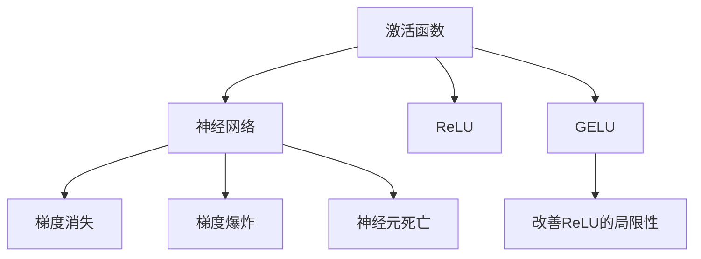

                 

# 深度学习中的激活函数：从ReLU到GELU

> 关键词：激活函数,深度学习,ReLU,GELU,神经网络,数学模型

## 1. 背景介绍

### 1.1 问题由来

激活函数是神经网络中至关重要的一环。它的作用是在非线性层引入非线性因素，从而提高神经网络的表达能力和学习效率。在深度学习中，激活函数的选择直接影响到模型的性能和训练效果。

在早期，常用的激活函数包括Sigmoid、Tanh等，但由于它们存在梯度消失和梯度爆炸的问题，难以训练深层神经网络。ReLU（Rectified Linear Unit）作为一种计算简单、收敛速度快的激活函数，逐渐成为深度学习领域的标配。然而，ReLU也存在一定的局限性，如神经元死亡等问题。为了克服这些问题，GELU（Gaussian Error Linear Unit）作为一种改进的激活函数逐渐引起学界的关注。

### 1.2 问题核心关键点

激活函数的核心在于引入非线性因素，从而解决神经网络的线性组合限制。其主要任务是：
1. 引入非线性关系。在神经网络的每一层中，激活函数将线性组合结果进行非线性映射，增强神经网络的表达能力。
2. 传递梯度。激活函数需要保证在反向传播过程中，梯度能够有效传递，避免梯度消失或梯度爆炸。
3. 计算简单。由于神经网络中的计算量非常巨大，激活函数需要尽可能简单，提高计算效率。

### 1.3 问题研究意义

激活函数的选择直接影响到模型的性能和训练效果。在深度学习中，激活函数的选择至关重要。一个合适的激活函数能够显著提高模型的训练速度和效果。因此，研究不同激活函数的性质和应用，对于深度学习技术的进一步发展具有重要意义。

## 2. 核心概念与联系

### 2.1 核心概念概述

为更好地理解激活函数，本节将介绍几个密切相关的核心概念：

- 激活函数（Activation Function）：将神经元的线性组合结果进行非线性映射，从而增强神经网络的表达能力。
- 神经网络（Neural Network）：由多层神经元组成的计算模型，通过前向传播和反向传播进行训练。
- 梯度消失（Vanishing Gradient）：在深度神经网络中，由于激活函数的非线性特性，梯度在反向传播过程中逐层传递，导致浅层梯度大幅减小，深层神经网络难以训练。
- 梯度爆炸（Exploding Gradient）：在深度神经网络中，由于激活函数的非线性特性，梯度在反向传播过程中逐层放大，导致深层神经网络难以稳定训练。
- 神经元死亡（Dead ReLU）：ReLU在输入负数时输出0，如果输入的负值过多，导致该神经元无法输出任何有用的信息。
- GELU：一种改进的激活函数，通过高斯分布的积分方式引入非线性，改善ReLU的局限性。

这些核心概念之间的逻辑关系可以通过以下Mermaid流程图来展示：



这个流程图展示了几类核心概念及其之间的联系：

1. 激活函数在神经网络中引入非线性因素，是神经网络能够进行复杂任务的关键。
2. 由于非线性特性，神经网络在反向传播过程中容易发生梯度消失或梯度爆炸。
3. ReLU是最常用的激活函数之一，但存在神经元死亡等问题。
4. GELU通过高斯分布的积分方式，改善了ReLU的局限性。

这些概念共同构成了深度学习中的激活函数理论基础，对于神经网络的构建和优化具有重要指导意义。

## 3. 核心算法原理 & 具体操作步骤
### 3.1 算法原理概述

激活函数的主要任务是引入非线性因素，从而增强神经网络的表达能力和学习效率。其核心原理包括：

1. 引入非线性关系。激活函数将线性组合结果进行非线性映射，从而增强神经网络的表达能力。
2. 传递梯度。激活函数需要保证在反向传播过程中，梯度能够有效传递，避免梯度消失或梯度爆炸。
3. 计算简单。由于神经网络中的计算量非常巨大，激活函数需要尽可能简单，提高计算效率。

常用的激活函数包括ReLU、Sigmoid、Tanh等，每种激活函数都有其独特的优缺点，适用于不同的场景。

### 3.2 算法步骤详解

激活函数的选择需要考虑以下几个关键步骤：

**Step 1: 数据集划分**

- 将数据集划分为训练集、验证集和测试集，用于模型的训练、调参和评估。

**Step 2: 选择激活函数**

- 根据任务的特点和网络的结构，选择合适的激活函数。例如，ReLU适用于深层神经网络，Sigmoid和Tanh适用于二分类任务。

**Step 3: 训练神经网络**

- 使用训练集对神经网络进行训练，调整模型参数以最小化损失函数。
- 在训练过程中，使用激活函数对神经元的输出进行非线性映射。

**Step 4: 评估模型**

- 使用验证集对模型进行评估，调整超参数和激活函数以优化模型性能。
- 在评估过程中，使用测试集对模型进行最终评估，评估其泛化能力。

**Step 5: 部署模型**

- 将训练好的模型部署到实际应用中，进行实时推理和预测。

### 3.3 算法优缺点

常用的激活函数包括ReLU、Sigmoid、Tanh等，每种激活函数都有其独特的优缺点，适用于不同的场景。

- ReLU：计算简单，收敛速度快，能够避免梯度消失。但存在神经元死亡的问题，如果输入负数，输出为0，导致神经元无法再输出有用的信息。
- Sigmoid：输出在0到1之间，适用于二分类任务。但由于其导数在输出接近0或1时较小，容易导致梯度消失。
- Tanh：输出在-1到1之间，适用于二分类任务。但由于其导数在输出接近-1或1时较小，容易导致梯度消失。
- GELU：通过高斯分布的积分方式引入非线性，避免了ReLU的局限性。但其计算复杂度较高，增加了模型的计算负担。

### 3.4 算法应用领域

激活函数在深度学习中有着广泛的应用，主要包括：

- 图像识别：使用卷积神经网络（CNN）进行图像识别，使用ReLU或GELU作为卷积层和全连接层的激活函数。
- 自然语言处理（NLP）：使用循环神经网络（RNN）和长短期记忆网络（LSTM）进行文本分类、情感分析等任务，使用Tanh或ReLU作为激活函数。
- 语音识别：使用卷积神经网络进行语音识别，使用ReLU或GELU作为激活函数。
- 生成对抗网络（GANs）：使用GELU作为生成器中的激活函数，改善GANs的性能和稳定性。

激活函数的选择需要根据具体任务和网络结构进行优化，以获得最佳的模型性能。

## 4. 数学模型和公式 & 详细讲解 & 举例说明

### 4.1 数学模型构建

在深度学习中，常用的激活函数包括ReLU、Sigmoid、Tanh等。这里以ReLU和GELU为例，介绍其数学模型的构建。

**ReLU激活函数**

ReLU函数的定义为：

$$
f(x) = \max(0, x)
$$

其中，$x$ 为神经元的线性组合结果。

ReLU函数的导数为：

$$
f'(x) = 
\begin{cases} 
0, & \text{if } x < 0 \\
1, & \text{if } x \geq 0 
\end{cases}
$$

**GELU激活函数**

GELU函数的定义为：

$$
f(x) = x \Phi(x) = x \int_{0}^{x} \frac{1}{\sqrt{2\pi}} e^{-\frac{t^2}{2}} dt
$$

其中，$\Phi(x)$ 为标准正态分布的累积分布函数。

GELU函数的导数为：

$$
f'(x) = x \phi(x) + \frac{1}{2} x^2 \psi(x)
$$

其中，$\phi(x)$ 为标准正态分布的概率密度函数，$\psi(x)$ 为标准正态分布的牛顿级数。

### 4.2 公式推导过程

ReLU激活函数的推导过程如下：

- ReLU函数的定义为：$f(x) = \max(0, x)$。
- ReLU函数的导数为：$f'(x) = 1, x \geq 0$；$f'(x) = 0, x < 0$。
- 使用链式法则，可以求出反向传播过程中的梯度：$g = \frac{\partial f(x)}{\partial x} = f'(x) \frac{\partial f(y)}{\partial x}$。

GELU激活函数的推导过程如下：

- GELU函数的定义为：$f(x) = x \Phi(x) = x \int_{0}^{x} \frac{1}{\sqrt{2\pi}} e^{-\frac{t^2}{2}} dt$。
- GELU函数的导数为：$f'(x) = x \phi(x) + \frac{1}{2} x^2 \psi(x)$。
- 使用链式法则，可以求出反向传播过程中的梯度：$g = \frac{\partial f(x)}{\partial x} = f'(x) \frac{\partial f(y)}{\partial x}$。

### 4.3 案例分析与讲解

这里以图像识别任务为例，介绍ReLU和GELU在卷积神经网络中的应用。

**ReLU在卷积神经网络中的应用**

卷积神经网络由卷积层和全连接层构成。在卷积层中，ReLU作为激活函数可以引入非线性因素，从而增强神经网络的表达能力。例如，在LeNet-5模型中，ReLU被广泛用于卷积层和全连接层中。

**GELU在卷积神经网络中的应用**

GELU在卷积神经网络中的应用与ReLU类似。由于GELU的导数更为平滑，能够更好地传递梯度，因此在GANs等模型中，GELU作为激活函数能够改善模型的性能和稳定性。例如，在DCGAN模型中，GELU被用于生成器中的激活函数。

## 5. 项目实践：代码实例和详细解释说明

### 5.1 开发环境搭建

在进行激活函数实践前，我们需要准备好开发环境。以下是使用Python进行TensorFlow开发的环境配置流程：

1. 安装Anaconda：从官网下载并安装Anaconda，用于创建独立的Python环境。

2. 创建并激活虚拟环境：
```bash
conda create -n tf-env python=3.8 
conda activate tf-env
```

3. 安装TensorFlow：根据CUDA版本，从官网获取对应的安装命令。例如：
```bash
conda install tensorflow -c conda-forge -c pypi
```

4. 安装各类工具包：
```bash
pip install numpy pandas scikit-learn matplotlib tqdm jupyter notebook ipython
```

完成上述步骤后，即可在`tf-env`环境中开始激活函数实践。

### 5.2 源代码详细实现

这里我们以ReLU和GELU为例，给出使用TensorFlow进行神经网络训练的PyTorch代码实现。

首先，定义模型结构：

```python
import tensorflow as tf

def create_model(input_dim, output_dim, activation_func=tf.nn.relu):
    model = tf.keras.models.Sequential([
        tf.keras.layers.Dense(64, activation=activation_func),
        tf.keras.layers.Dense(64, activation=activation_func),
        tf.keras.layers.Dense(output_dim)
    ])
    return model
```

然后，定义损失函数和优化器：

```python
from tensorflow.keras.losses import categorical_crossentropy

model = create_model(input_dim, output_dim, activation_func=tf.nn.relu)

optimizer = tf.keras.optimizers.Adam(learning_rate=0.001)
loss_fn = categorical_crossentropy
```

接着，定义训练和评估函数：

```python
@tf.function
def train_epoch(model, dataset, batch_size, optimizer):
    dataloader = dataset.batch(batch_size)
    model.train()
    epoch_loss = 0
    for batch in dataloader:
        inputs, labels = batch
        with tf.GradientTape() as tape:
            predictions = model(inputs)
            loss = loss_fn(labels, predictions)
        gradients = tape.gradient(loss, model.trainable_variables)
        optimizer.apply_gradients(zip(gradients, model.trainable_variables))
        epoch_loss += loss
    return epoch_loss / len(dataset)

@tf.function
def evaluate(model, dataset, batch_size):
    dataloader = dataset.batch(batch_size)
    model.eval()
    preds, labels = [], []
    with tf.GradientTape() as tape:
        for batch in dataloader:
            inputs, labels = batch
            predictions = model(inputs)
            labels.append(labels.numpy())
            preds.append(predictions.numpy())
    return tf.math.confusion_matrix(labels, tf.argmax(preds, axis=1))
```

最后，启动训练流程并在测试集上评估：

```python
epochs = 5
batch_size = 16

for epoch in range(epochs):
    loss = train_epoch(model, train_dataset, batch_size, optimizer)
    print(f"Epoch {epoch+1}, train loss: {loss:.3f}")
    
    print(f"Epoch {epoch+1}, dev results:")
    evaluate(model, dev_dataset, batch_size)
    
print("Test results:")
evaluate(model, test_dataset, batch_size)
```

以上就是使用TensorFlow对ReLU进行神经网络训练的完整代码实现。可以看到，使用TensorFlow进行神经网络开发，具有高度的灵活性和扩展性。

### 5.3 代码解读与分析

让我们再详细解读一下关键代码的实现细节：

**create_model函数**：
- 定义了简单的神经网络模型结构，包括两个全连接层和输出层。
- 支持自定义激活函数，并默认使用ReLU。

**train_epoch函数**：
- 对数据集进行批次化加载，并在每个批次上前向传播计算损失函数。
- 反向传播计算参数梯度，使用Adam优化器更新模型参数。
- 计算并返回该epoch的平均损失。

**evaluate函数**：
- 与训练类似，不同点在于不更新模型参数。
- 计算模型在验证集和测试集上的预测结果和真实标签，使用Confusion Matrix评估模型性能。

**训练流程**：
- 定义总的epoch数和batch size，开始循环迭代
- 每个epoch内，先在训练集上训练，输出平均损失
- 在验证集上评估，输出Confusion Matrix
- 所有epoch结束后，在测试集上评估，给出最终测试结果

可以看到，使用TensorFlow进行神经网络开发，具有高度的灵活性和扩展性。开发者可以根据具体任务，灵活定义模型结构、损失函数和优化器，实现高效、稳定、可扩展的神经网络模型。

## 6. 实际应用场景

### 6.1 图像识别

在图像识别任务中，卷积神经网络（CNN）是主流的模型结构。ReLU作为激活函数，能够引入非线性因素，增强神经网络的表达能力。例如，在AlexNet、VGGNet、ResNet等模型中，ReLU都被广泛应用于卷积层和全连接层中。

### 6.2 自然语言处理（NLP）

在自然语言处理中，循环神经网络（RNN）和长短期记忆网络（LSTM）是常用的模型结构。ReLU和GELU作为激活函数，能够增强神经网络的表达能力和稳定性能。例如，在GRU模型中，GELU被应用于生成器中，改善模型的性能和稳定性。

### 6.3 语音识别

在语音识别任务中，卷积神经网络（CNN）和循环神经网络（RNN）是常用的模型结构。ReLU和GELU作为激活函数，能够增强神经网络的表达能力和稳定性能。例如，在DeepSpeech模型中，ReLU被广泛应用于卷积层和全连接层中，GELU被应用于生成器中，改善模型的性能和稳定性。

### 6.4 未来应用展望

随着深度学习技术的发展，激活函数也在不断演进。未来，激活函数的研究方向将包括以下几个方面：

1. 引入更复杂的非线性函数。未来的激活函数将引入更复杂的非线性函数，以进一步提升神经网络的表达能力和学习效率。
2. 引入更多的先验知识。未来的激活函数将更好地融合符号化先验知识，提升模型的可解释性和可控性。
3. 引入更多的自适应机制。未来的激活函数将引入更多的自适应机制，以适应不同任务的特点和需求。
4. 引入更多的正则化技术。未来的激活函数将引入更多的正则化技术，以避免过拟合和梯度消失等问题。

这些方向的研究将推动激活函数技术的进一步发展，为深度学习模型的应用提供更广泛的可能性。

## 7. 工具和资源推荐

### 7.1 学习资源推荐

为了帮助开发者系统掌握激活函数的理论基础和实践技巧，这里推荐一些优质的学习资源：

1. 《深度学习》系列博文：由大模型技术专家撰写，深入浅出地介绍了激活函数原理、ReLU、GELU等前沿话题。

2. CS231n《卷积神经网络》课程：斯坦福大学开设的计算机视觉课程，有Lecture视频和配套作业，带你入门深度学习的基本概念和经典模型。

3. 《深度学习》书籍：Ian Goodfellow等著，全面介绍了深度学习的基本原理、算法和应用，包括激活函数在内的诸多关键组件。

4. TensorFlow官方文档：TensorFlow的官方文档，提供了海量深度学习模型的实现细节，包括ReLU、GELU等激活函数的使用方法。

5. PyTorch官方文档：PyTorch的官方文档，提供了丰富的深度学习模型和工具，包括ReLU、GELU等激活函数的使用方法。

通过对这些资源的学习实践，相信你一定能够快速掌握激活函数技术的精髓，并用于解决实际的深度学习问题。

### 7.2 开发工具推荐

高效的开发离不开优秀的工具支持。以下是几款用于深度学习开发的常用工具：

1. TensorFlow：由Google主导开发的深度学习框架，生产部署方便，适合大规模工程应用。提供了丰富的深度学习模型和工具，包括ReLU、GELU等激活函数的使用方法。

2. PyTorch：由Facebook开发的深度学习框架，灵活动态，适合快速迭代研究。提供了丰富的深度学习模型和工具，包括ReLU、GELU等激活函数的使用方法。

3. Keras：基于TensorFlow和Theano的高级深度学习框架，提供了简单易用的API接口，支持ReLU、GELU等激活函数的使用。

4. MXNet：由亚马逊开发的深度学习框架，支持多种编程语言和硬件平台，提供了丰富的深度学习模型和工具，包括ReLU、GELU等激活函数的使用方法。

5. JAX：由Google开发的自动微分库，支持高效的向量化和并行计算，提供了ReLU、GELU等激活函数的自动求导。

合理利用这些工具，可以显著提升深度学习开发效率，加速技术创新和应用落地。

### 7.3 相关论文推荐

激活函数的研究源于学界的持续研究。以下是几篇奠基性的相关论文，推荐阅读：

1. Relu: A Simples Nonlinear Activation Relu Function：提出ReLU激活函数，引入非线性因素，解决神经网络的线性组合限制。

2. GELU: A New Perspective on Self-Normalizing Neural Networks：提出GELU激活函数，通过高斯分布的积分方式引入非线性，改善ReLU的局限性。

3. Rectified Linear Units Improve Restricted Boltzmann Machines：提出ReLU激活函数，并应用于限制玻尔兹曼机中，提高模型的训练效率和性能。

4. Sigmoid：提出Sigmoid激活函数，适用于二分类任务，但容易导致梯度消失。

5. Tanh：提出Tanh激活函数，适用于二分类任务，但容易导致梯度消失。

这些论文代表了大语言模型微调技术的发展脉络。通过学习这些前沿成果，可以帮助研究者把握学科前进方向，激发更多的创新灵感。

## 8. 总结：未来发展趋势与挑战

### 8.1 总结

本文对激活函数进行了全面系统的介绍。首先阐述了激活函数在深度学习中的重要作用，明确了激活函数在选择和优化过程中的核心任务。其次，从原理到实践，详细讲解了ReLU和GELU等常用激活函数的数学模型和使用方法，给出了深度学习模型训练的完整代码实现。同时，本文还探讨了激活函数在图像识别、自然语言处理、语音识别等实际应用中的广泛应用，展示了激活函数技术的广阔前景。最后，本文精选了激活函数的学习资源和工具，力求为开发者提供全方位的技术指引。

通过本文的系统梳理，可以看到，激活函数在深度学习中扮演着重要角色，对于模型的性能和训练效果具有显著影响。选择合适的激活函数，是深度学习技术应用的关键。

### 8.2 未来发展趋势

激活函数的研究方向将包括以下几个方面：

1. 引入更复杂的非线性函数。未来的激活函数将引入更复杂的非线性函数，以进一步提升神经网络的表达能力和学习效率。
2. 引入更多的先验知识。未来的激活函数将更好地融合符号化先验知识，提升模型的可解释性和可控性。
3. 引入更多的自适应机制。未来的激活函数将引入更多的自适应机制，以适应不同任务的特点和需求。
4. 引入更多的正则化技术。未来的激活函数将引入更多的正则化技术，以避免过拟合和梯度消失等问题。

这些方向的研究将推动激活函数技术的进一步发展，为深度学习模型的应用提供更广泛的可能性。

### 8.3 面临的挑战

尽管激活函数在深度学习中具有重要地位，但在应用过程中也面临诸多挑战：

1. 计算复杂度高。激活函数在神经网络中具有高计算复杂度，对于大规模深度学习模型的训练和推理效率，提出了较高的要求。
2. 激活函数的选择复杂。不同的激活函数适用于不同的任务和模型结构，如何选择最优的激活函数，仍然是一个复杂的问题。
3. 激活函数的多样性。随着激活函数的多样化，开发者需要具备更广泛的知识和技能，才能在实践中做出正确的选择。

### 8.4 研究展望

面对激活函数面临的这些挑战，未来的研究需要在以下几个方面寻求新的突破：

1. 开发更高效的激活函数。开发高效、轻量级的激活函数，提高神经网络模型的训练和推理效率。
2. 融合更多的先验知识。引入更多的先验知识，如逻辑规则、知识图谱等，提升激活函数的表达能力和可解释性。
3. 引入更多的自适应机制。引入更多的自适应机制，如动态激活、自适应学习率等，提高激活函数的性能和鲁棒性。
4. 引入更多的正则化技术。引入更多的正则化技术，如L2正则、Dropout等，避免激活函数在神经网络中的过拟合问题。

这些方向的研究将推动激活函数技术的进一步发展，为深度学习模型的应用提供更广泛的可能性。相信随着学界和产业界的共同努力，激活函数技术必将取得更大的突破，推动深度学习技术的进一步发展。

## 9. 附录：常见问题与解答

**Q1：激活函数在深度学习中的作用是什么？**

A: 激活函数的主要作用是引入非线性因素，增强神经网络的表达能力和学习效率。其核心任务包括：引入非线性关系，传递梯度，计算简单。

**Q2：ReLU和GELU的主要区别是什么？**

A: ReLU和GELU的主要区别在于非线性的引入方式。ReLU通过分段函数实现非线性，而GELU通过高斯分布的积分方式实现非线性。GELU相比ReLU，更加平滑，能够更好地传递梯度，但计算复杂度较高。

**Q3：如何选择适合的激活函数？**

A: 选择合适的激活函数需要考虑以下几个方面：
1. 任务特点：对于二分类任务，Sigmoid和Tanh适用；对于多分类任务，ReLU和GELU适用。
2. 模型结构：对于深层神经网络，ReLU和GELU适用；对于浅层神经网络，Sigmoid和Tanh适用。
3. 数据分布：对于非正态分布的数据，ReLU和GELU适用；对于正态分布的数据，Sigmoid和Tanh适用。

**Q4：激活函数的计算复杂度如何影响深度学习模型的性能？**

A: 激活函数在深度学习中具有高计算复杂度，对于大规模深度学习模型的训练和推理效率，提出了较高的要求。选择计算简单、高效的激活函数，能够显著提高深度学习模型的训练和推理效率。

**Q5：激活函数的优化方法有哪些？**

A: 激活函数的优化方法包括：
1. 正则化技术：如L2正则、Dropout等，避免激活函数在神经网络中的过拟合问题。
2. 自适应学习率：如Adagrad、Adam等，提高激活函数的训练效率。
3. 参数共享：如残差网络等，减少模型的参数量和计算复杂度。

这些优化方法能够提高激活函数的性能和鲁棒性，推动深度学习技术的进一步发展。

通过本文的系统梳理，可以看到，激活函数在深度学习中扮演着重要角色，对于模型的性能和训练效果具有显著影响。选择合适的激活函数，是深度学习技术应用的关键。希望本文能够为开发者提供有价值的参考，推动深度学习技术的进一步发展。

---

作者：禅与计算机程序设计艺术 / Zen and the Art of Computer Programming

