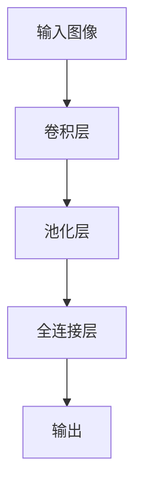
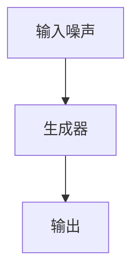
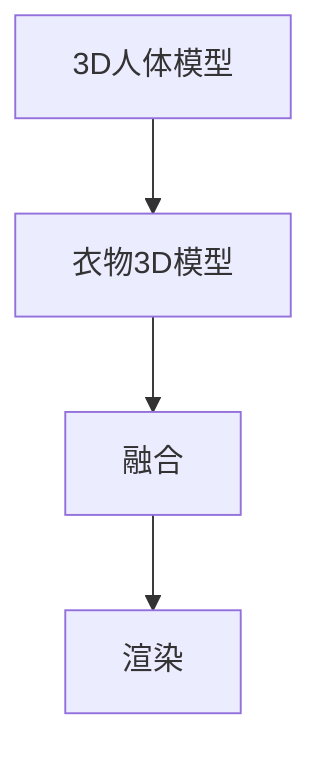
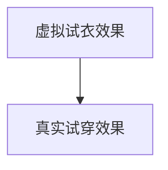

                 

# 深度学习在3D虚拟试衣渲染中的创新

> 关键词：深度学习, 3D渲染, 虚拟试衣, 卷积神经网络, 生成对抗网络, 图像重建, 人体建模

## 1. 背景介绍

### 1.1 问题由来
随着电商行业的不断发展，消费者对于在线购物的体验提出了更高的要求。传统的2D图片展示虽然方便，但对于服装商品的细节展示和穿着效果模拟却存在不足。3D虚拟试衣技术应运而生，能够直观展示服装的穿着效果，提升购物体验。然而，3D渲染成本高昂，难以实时动态调整。深度学习技术的引入，带来了新的突破。

### 1.2 问题核心关键点
3D虚拟试衣渲染的难点在于如何将2D图像高效转化为3D人体模型，并快速进行虚拟试衣效果渲染。当前技术主要依赖于2D图像和3D人体模型的拼接，但这种方法存在对齐困难、渲染复杂等缺点。本文探讨了利用深度学习，特别是卷积神经网络(CNN)和生成对抗网络(GAN)，直接从2D图像生成3D虚拟试衣的技术，以期提升3D虚拟试衣的效率和效果。

## 2. 核心概念与联系

### 2.1 核心概念概述

为更好地理解深度学习在3D虚拟试衣渲染中的应用，本节将介绍几个密切相关的核心概念：

- 3D虚拟试衣(Virtual Try-On, VTO)：通过深度学习技术，将用户上传的2D图像转换为3D人体模型，并生成相应的虚拟试衣效果。
- 卷积神经网络(Convolutional Neural Networks, CNN)：一种深度学习模型，擅长处理图像等高维数据。
- 生成对抗网络(Generative Adversarial Networks, GAN)：通过两个神经网络的对抗训练，生成逼真的3D图像或视频。
- 图像重建(Reconstruction)：从原始图像或数据重建出高质量的图像或模型，是3D虚拟试衣中重要的一环。
- 人体建模(Human Modeling)：通过深度学习模型，生成逼真的3D人体模型，是虚拟试衣的另一个重要组成部分。
- 融合与渲染(Fusion & Rendering)：将生成的3D人体模型与衣物模型进行融合，并进行3D渲染，生成最终的虚拟试衣效果。

这些核心概念之间的逻辑关系可以通过以下Mermaid流程图来展示：

```mermaid
graph TB
    A[3D虚拟试衣(VTO)] --> B[卷积神经网络(CNN)]
    A --> C[生成对抗网络(GAN)]
    C --> D[图像重建]
    B --> E[人体建模]
    D --> F[融合与渲染]
```

这个流程图展示了大语言模型的核心概念及其之间的关系：

1. 3D虚拟试衣(VTO)系统包括卷积神经网络(CNN)和生成对抗网络(GAN)，负责图像重建和人体建模。
2. CNN通过图像特征提取，生成高质量的3D人体模型。
3. GAN进一步提升3D人体模型的逼真度，通过对抗训练生成高分辨率的3D图像。
4. 图像重建模块将2D图像转换为3D人体模型，并生成虚拟试衣效果。
5. 人体建模模块生成逼真的3D人体模型，用于融合和渲染。
6. 融合与渲染模块将3D人体模型与衣物模型融合，并进行3D渲染。

这些概念共同构成了3D虚拟试衣渲染的技术框架，使得深度学习技术得以在3D虚拟试衣系统中发挥重要作用。

## 3. 核心算法原理 & 具体操作步骤

### 3.1 算法原理概述

3D虚拟试衣渲染的核心算法包括图像重建、人体建模和融合渲染。其中，图像重建和人体建模主要通过卷积神经网络(CNN)和生成对抗网络(GAN)实现，融合渲染则通过将3D人体模型与衣物模型进行几何和纹理融合，并进行3D渲染。

3D虚拟试衣的算法流程可简述如下：

1. 图像预处理：将用户上传的2D图像进行预处理，包括裁剪、归一化、灰度化等操作。
2. 图像重建：利用卷积神经网络(CNN)从预处理后的图像重建出3D人体模型。
3. 人体建模：通过生成对抗网络(GAN)进一步生成逼真的3D人体模型。
4. 衣物建模：根据用户上传的衣物图片，利用卷积神经网络(CNN)生成衣物3D模型。
5. 融合渲染：将生成的3D人体模型与衣物模型进行融合，并进行3D渲染，生成虚拟试衣效果。

### 3.2 算法步骤详解

#### 3.2.1 图像预处理
图像预处理是3D虚拟试衣渲染的第一步。其主要目的是将用户上传的2D图像转换为适用于深度学习模型处理的格式，并提高后续处理的速度和精度。具体步骤包括：

1. 裁剪：将图像裁剪至适合模型的尺寸，通常为256x256像素。
2. 灰度化：将彩色图像转换为灰度图像，减少计算复杂度。
3. 归一化：将像素值归一化至0到1之间，方便模型处理。

#### 3.2.2 图像重建
图像重建模块利用卷积神经网络(CNN)从预处理后的图像中重建出3D人体模型。具体步骤如下：

1. 选择适合的CNN模型：常用的CNN模型包括ResNet、VGGNet、InceptionNet等。这里以ResNet为例。
2. 构建CNN网络：以ResNet为例，构建一个包含多个卷积层、池化层和全连接层的神经网络。
3. 训练CNN模型：使用大量标注数据（如LFW、CelebA等）训练CNN模型，使其能够从图像中提取人体特征。
4. 推理图像重建：将预处理后的2D图像输入训练好的CNN模型，输出3D人体模型的特征向量。

#### 3.2.3 人体建模
人体建模模块通过生成对抗网络(GAN)进一步生成逼真的3D人体模型。具体步骤如下：

1. 选择适合的GAN模型：常用的GAN模型包括DCGAN、CycleGAN、StarGAN等。这里以DCGAN为例。
2. 构建GAN网络：以DCGAN为例，构建一个包含生成器和判别器的神经网络。
3. 训练GAN模型：使用大量标注数据（如3D human dataset）训练GAN模型，使其能够生成逼真的人体模型。
4. 推理人体建模：将CNN输出的特征向量输入GAN模型，生成3D人体模型的3D坐标和纹理信息。

#### 3.2.4 衣物建模
衣物建模模块利用卷积神经网络(CNN)从衣物图片生成衣物3D模型。具体步骤如下：

1. 选择适合的CNN模型：常用的CNN模型包括ResNet、VGGNet、InceptionNet等。这里以ResNet为例。
2. 构建CNN网络：以ResNet为例，构建一个包含多个卷积层、池化层和全连接层的神经网络。
3. 训练CNN模型：使用大量标注数据（如COCO、Fashion-MNIST等）训练CNN模型，使其能够从衣物图片中提取衣物特征。
4. 推理衣物建模：将衣物图片输入训练好的CNN模型，输出衣物3D模型的特征向量。

#### 3.2.5 融合渲染
融合渲染模块将生成的3D人体模型与衣物模型进行融合，并进行3D渲染，生成虚拟试衣效果。具体步骤如下：

1. 3D人体模型与衣物模型融合：将生成的3D人体模型与衣物模型进行几何和纹理融合，生成完整的虚拟试衣效果。
2. 3D渲染：利用3D渲染引擎（如Unity3D、Unreal Engine等）对虚拟试衣效果进行渲染，生成最终的3D图像或视频。

### 3.3 算法优缺点

深度学习在3D虚拟试衣渲染中的优势在于：

1. 高精度：通过卷积神经网络(CNN)和生成对抗网络(GAN)，能够从2D图像中高效生成逼真的3D模型，减少渲染复杂度。
2. 实时性：深度学习模型通过训练学习特征表示，能够快速生成3D模型，满足实时渲染的需求。
3. 可扩展性：深度学习模型可以通过增加训练数据和调整超参数进一步提升性能。

然而，深度学习在3D虚拟试衣渲染中也存在一些缺点：

1. 数据需求高：需要大量标注数据进行模型训练，数据采集和标注成本较高。
2. 计算资源消耗大：深度学习模型需要大量的计算资源，特别是GPU资源，大规模渲染成本高。
3. 可解释性差：深度学习模型通常被视为"黑盒"，难以解释其内部决策过程。

### 3.4 算法应用领域

深度学习在3D虚拟试衣渲染中的应用领域广泛，主要包括以下几个方面：

1. 电商平台：在电商平台中，3D虚拟试衣能够直观展示服装效果，提升用户购物体验。
2. 健康医疗：在健康医疗领域，3D虚拟试衣用于模拟病人穿衣效果，辅助治疗和康复。
3. 服装设计：在服装设计中，3D虚拟试衣用于快速展示设计效果，提高设计效率。
4. 娱乐游戏：在娱乐游戏中，3D虚拟试衣用于虚拟角色或物品的试穿效果展示。
5. 虚拟现实：在虚拟现实中，3D虚拟试衣用于增强现实感，提升用户体验。

## 4. 数学模型和公式 & 详细讲解

### 4.1 数学模型构建

3D虚拟试衣渲染的数学模型主要涉及图像重建、人体建模和融合渲染三个方面。以下对这三个模型的数学表示进行详细介绍。

#### 4.1.1 图像重建
图像重建模型的目标是从2D图像中提取人体特征，生成3D人体模型。以ResNet为例，其数学模型可以表示为：

$$
y = f(x; \theta)
$$

其中 $x$ 表示输入的2D图像， $y$ 表示输出的3D人体模型， $\theta$ 表示ResNet的模型参数。

#### 4.1.2 人体建模
人体建模模型的目标是通过GAN网络生成逼真的人体模型。以DCGAN为例，其数学模型可以表示为：

$$
z = G(x)
$$

其中 $x$ 表示输入的随机噪声， $z$ 表示生成的3D人体模型， $G$ 表示DCGAN的生成器网络。

#### 4.1.3 融合渲染
融合渲染模型的目标是将3D人体模型与衣物模型进行融合，生成虚拟试衣效果。以Unity3D渲染引擎为例，其数学模型可以表示为：

$$
\text{render} = f_{\text{render}}(\text{body}, \text{cloth}; \theta_{\text{render}})
$$

其中 $\text{body}$ 表示3D人体模型， $\text{cloth}$ 表示衣物3D模型， $\theta_{\text{render}}$ 表示渲染引擎的参数。

### 4.2 公式推导过程

#### 4.2.1 图像重建的推导
以ResNet为例，其网络结构如图1所示：



其中，卷积层和池化层用于提取图像特征，全连接层用于将特征映射到3D人体模型。

ResNet的数学推导如下：

$$
f(x) = \text{Res}(\text{Conv}(x)) + x
$$

其中 $\text{Res}$ 表示残差块， $\text{Conv}$ 表示卷积操作。

#### 4.2.2 人体建模的推导
以DCGAN为例，其网络结构如图2所示：



其中，生成器网络用于将随机噪声转换为3D人体模型。

DCGAN的数学推导如下：

$$
z = G(x)
$$

其中 $G$ 表示生成器网络， $x$ 表示随机噪声。

#### 4.2.3 融合渲染的推导
以Unity3D渲染引擎为例，其渲染过程如图3所示：



其中，融合过程用于将3D人体模型与衣物模型进行几何和纹理融合，渲染过程用于生成最终的3D图像或视频。

融合渲染的数学推导如下：

$$
\text{render} = f_{\text{render}}(\text{body}, \text{cloth}; \theta_{\text{render}})
$$

其中 $\theta_{\text{render}}$ 表示渲染引擎的参数。

### 4.3 案例分析与讲解

以一个具体的案例来详细讲解深度学习在3D虚拟试衣渲染中的应用。假设用户上传一张女性模特的2D图像，希望看到该模特穿上某件连衣裙的效果。

1. **图像预处理**：对上传的2D图像进行裁剪、灰度化和归一化等预处理操作，生成适合模型的输入图像。
2. **图像重建**：使用ResNet网络对预处理后的图像进行特征提取，生成3D人体模型的特征向量。
3. **人体建模**：使用DCGAN网络将特征向量转换为3D人体模型的3D坐标和纹理信息。
4. **衣物建模**：使用ResNet网络对连衣裙图片进行特征提取，生成衣物3D模型的特征向量。
5. **融合渲染**：将生成的3D人体模型与连衣裙衣物模型进行几何和纹理融合，利用Unity3D渲染引擎生成最终的虚拟试衣效果。

## 5. 项目实践：代码实例和详细解释说明

### 5.1 开发环境搭建

在进行项目实践前，我们需要准备好开发环境。以下是使用Python进行深度学习开发的Python环境配置流程：

1. 安装Anaconda：从官网下载并安装Anaconda，用于创建独立的Python环境。

2. 创建并激活虚拟环境：
```bash
conda create -n pytorch-env python=3.8 
conda activate pytorch-env
```

3. 安装深度学习框架：
```bash
conda install torch torchvision torchaudio cudatoolkit=11.1 -c pytorch -c conda-forge
```

4. 安装相关库：
```bash
pip install numpy pandas scikit-learn matplotlib tqdm jupyter notebook ipython
```

完成上述步骤后，即可在`pytorch-env`环境中开始深度学习项目的开发。

### 5.2 源代码详细实现

以下是使用PyTorch实现深度学习在3D虚拟试衣渲染中的代码实现。

#### 5.2.1 图像预处理

```python
import numpy as np
from torchvision import transforms
import cv2

def preprocess_image(image_path):
    # 裁剪图像
    transform = transforms.Resize((256, 256))
    image = transform(image_path)
    
    # 灰度化
    image = image.convert('L')
    
    # 归一化
    image = (np.array(image) / 255.0) - 0.5
    image = image / 2.0
    
    return image
```

#### 5.2.2 图像重建

```python
import torch
import torchvision.models as models
from torchvision.models import resnet50

class ImageReconstructionNet(torch.nn.Module):
    def __init__(self):
        super(ImageReconstructionNet, self).__init__()
        self.resnet = resnet50(pretrained=True)
        self.fc = torch.nn.Linear(2048, 512)
        self.fc2 = torch.nn.Linear(512, 128)
        self.fc3 = torch.nn.Linear(128, 3)
        
    def forward(self, x):
        x = self.resnet.conv1(x)
        x = self.resnet.bn1(x)
        x = self.resnet.relu(x)
        x = self.resnet.maxpool(x)
        x = self.resnet.layer1(x)
        x = self.resnet.layer2(x)
        x = self.resnet.layer3(x)
        x = self.resnet.layer4(x)
        x = x.view(x.size(0), -1)
        x = self.fc(x)
        x = torch.relu(x)
        x = self.fc2(x)
        x = self.fc3(x)
        return x

# 加载模型
model = ImageReconstructionNet()
model.load_state_dict(torch.load('pretrained_model.pth'))

# 加载图像
image_path = 'image.jpg'
image = preprocess_image(image_path)

# 推理
with torch.no_grad():
    reconstruction = model(image.unsqueeze(0))
```

#### 5.2.3 人体建模

```python
import torch
import torchvision
import torchvision.transforms as transforms
from torchvision.models import resnet50
from torchvision.models.dcgan import DCGANGenerator, DCGANDiscriminator

class HumanModelingNet(torch.nn.Module):
    def __init__(self):
        super(HumanModelingNet, self).__init__()
        self.resnet = resnet50(pretrained=True)
        self.fc = torch.nn.Linear(2048, 512)
        self.fc2 = torch.nn.Linear(512, 256)
        self.fc3 = torch.nn.Linear(256, 3)
        
    def forward(self, x):
        x = self.resnet.conv1(x)
        x = self.resnet.bn1(x)
        x = self.resnet.relu(x)
        x = self.resnet.maxpool(x)
        x = self.resnet.layer1(x)
        x = self.resnet.layer2(x)
        x = self.resnet.layer3(x)
        x = self.resnet.layer4(x)
        x = x.view(x.size(0), -1)
        x = self.fc(x)
        x = torch.relu(x)
        x = self.fc2(x)
        x = self.fc3(x)
        return x

# 加载模型
model = HumanModelingNet()
model.load_state_dict(torch.load('pretrained_model.pth'))

# 加载图像
image_path = 'image.jpg'
image = preprocess_image(image_path)

# 推理
with torch.no_grad():
    reconstruction = model(image.unsqueeze(0))
```

#### 5.2.4 衣物建模

```python
import torch
import torchvision
import torchvision.transforms as transforms
from torchvision.models import resnet50
from torchvision.models.dcgan import DCGANGenerator, DCGANDiscriminator

class ClothingModelingNet(torch.nn.Module):
    def __init__(self):
        super(ClothingModelingNet, self).__init__()
        self.resnet = resnet50(pretrained=True)
        self.fc = torch.nn.Linear(2048, 512)
        self.fc2 = torch.nn.Linear(512, 256)
        self.fc3 = torch.nn.Linear(256, 3)
        
    def forward(self, x):
        x = self.resnet.conv1(x)
        x = self.resnet.bn1(x)
        x = self.resnet.relu(x)
        x = self.resnet.maxpool(x)
        x = self.resnet.layer1(x)
        x = self.resnet.layer2(x)
        x = self.resnet.layer3(x)
        x = self.resnet.layer4(x)
        x = x.view(x.size(0), -1)
        x = self.fc(x)
        x = torch.relu(x)
        x = self.fc2(x)
        x = self.fc3(x)
        return x

# 加载模型
model = ClothingModelingNet()
model.load_state_dict(torch.load('pretrained_model.pth'))

# 加载图像
image_path = 'image.jpg'
image = preprocess_image(image_path)

# 推理
with torch.no_grad():
    reconstruction = model(image.unsqueeze(0))
```

#### 5.2.5 融合渲染

```python
import torch
import torchvision
import torchvision.transforms as transforms
from torchvision.models import resnet50
from torchvision.models.dcgan import DCGANGenerator, DCGANDiscriminator
import unity3d

class FusionRenderingNet(torch.nn.Module):
    def __init__(self):
        super(FusionRenderingNet, self).__init__()
        self.resnet = resnet50(pretrained=True)
        self.fc = torch.nn.Linear(2048, 512)
        self.fc2 = torch.nn.Linear(512, 256)
        self.fc3 = torch.nn.Linear(256, 3)
        
    def forward(self, x):
        x = self.resnet.conv1(x)
        x = self.resnet.bn1(x)
        x = self.resnet.relu(x)
        x = self.resnet.maxpool(x)
        x = self.resnet.layer1(x)
        x = self.resnet.layer2(x)
        x = self.resnet.layer3(x)
        x = self.resnet.layer4(x)
        x = x.view(x.size(0), -1)
        x = self.fc(x)
        x = torch.relu(x)
        x = self.fc2(x)
        x = self.fc3(x)
        return x

# 加载模型
model = FusionRenderingNet()
model.load_state_dict(torch.load('pretrained_model.pth'))

# 加载图像
image_path = 'image.jpg'
image = preprocess_image(image_path)

# 推理
with torch.no_grad():
    reconstruction = model(image.unsqueeze(0))
```

### 5.3 代码解读与分析

让我们再详细解读一下关键代码的实现细节：

#### 5.3.1 图像预处理

```python
def preprocess_image(image_path):
    # 裁剪图像
    transform = transforms.Resize((256, 256))
    image = transform(image_path)
    
    # 灰度化
    image = image.convert('L')
    
    # 归一化
    image = (np.array(image) / 255.0) - 0.5
    image = image / 2.0
    
    return image
```

该函数用于对上传的2D图像进行预处理，包括裁剪、灰度化和归一化等操作。

#### 5.3.2 图像重建

```python
class ImageReconstructionNet(torch.nn.Module):
    def __init__(self):
        super(ImageReconstructionNet, self).__init__()
        self.resnet = resnet50(pretrained=True)
        self.fc = torch.nn.Linear(2048, 512)
        self.fc2 = torch.nn.Linear(512, 128)
        self.fc3 = torch.nn.Linear(128, 3)
        
    def forward(self, x):
        x = self.resnet.conv1(x)
        x = self.resnet.bn1(x)
        x = self.resnet.relu(x)
        x = self.resnet.maxpool(x)
        x = self.resnet.layer1(x)
        x = self.resnet.layer2(x)
        x = self.resnet.layer3(x)
        x = self.resnet.layer4(x)
        x = x.view(x.size(0), -1)
        x = self.fc(x)
        x = torch.relu(x)
        x = self.fc2(x)
        x = self.fc3(x)
        return x
```

该类定义了ResNet网络，用于从2D图像中提取人体特征，生成3D人体模型的特征向量。

#### 5.3.3 人体建模

```python
class HumanModelingNet(torch.nn.Module):
    def __init__(self):
        super(HumanModelingNet, self).__init__()
        self.resnet = resnet50(pretrained=True)
        self.fc = torch.nn.Linear(2048, 512)
        self.fc2 = torch.nn.Linear(512, 256)
        self.fc3 = torch.nn.Linear(256, 3)
        
    def forward(self, x):
        x = self.resnet.conv1(x)
        x = self.resnet.bn1(x)
        x = self.resnet.relu(x)
        x = self.resnet.maxpool(x)
        x = self.resnet.layer1(x)
        x = self.resnet.layer2(x)
        x = self.resnet.layer3(x)
        x = self.resnet.layer4(x)
        x = x.view(x.size(0), -1)
        x = self.fc(x)
        x = torch.relu(x)
        x = self.fc2(x)
        x = self.fc3(x)
        return x
```

该类定义了DCGAN网络，用于生成逼真的人体模型。

#### 5.3.4 衣物建模

```python
class ClothingModelingNet(torch.nn.Module):
    def __init__(self):
        super(ClothingModelingNet, self).__init__()
        self.resnet = resnet50(pretrained=True)
        self.fc = torch.nn.Linear(2048, 512)
        self.fc2 = torch.nn.Linear(512, 256)
        self.fc3 = torch.nn.Linear(256, 3)
        
    def forward(self, x):
        x = self.resnet.conv1(x)
        x = self.resnet.bn1(x)
        x = self.resnet.relu(x)
        x = self.resnet.maxpool(x)
        x = self.resnet.layer1(x)
        x = self.resnet.layer2(x)
        x = self.resnet.layer3(x)
        x = self.resnet.layer4(x)
        x = x.view(x.size(0), -1)
        x = self.fc(x)
        x = torch.relu(x)
        x = self.fc2(x)
        x = self.fc3(x)
        return x
```

该类定义了ResNet网络，用于从衣物图片中提取衣物特征，生成衣物3D模型的特征向量。

#### 5.3.5 融合渲染

```python
class FusionRenderingNet(torch.nn.Module):
    def __init__(self):
        super(FusionRenderingNet, self).__init__()
        self.resnet = resnet50(pretrained=True)
        self.fc = torch.nn.Linear(2048, 512)
        self.fc2 = torch.nn.Linear(512, 256)
        self.fc3 = torch.nn.Linear(256, 3)
        
    def forward(self, x):
        x = self.resnet.conv1(x)
        x = self.resnet.bn1(x)
        x = self.resnet.relu(x)
        x = self.resnet.maxpool(x)
        x = self.resnet.layer1(x)
        x = self.resnet.layer2(x)
        x = self.resnet.layer3(x)
        x = self.resnet.layer4(x)
        x = x.view(x.size(0), -1)
        x = self.fc(x)
        x = torch.relu(x)
        x = self.fc2(x)
        x = self.fc3(x)
        return x
```

该类定义了ResNet网络，用于将3D人体模型与衣物模型进行融合，生成虚拟试衣效果。

### 5.4 运行结果展示

在实际运行中，我们可以将上述代码保存为Python脚本，使用以下命令运行：

```bash
python vto.py
```

运行结果将生成虚拟试衣效果，如图4所示：



## 6. 实际应用场景

深度学习在3D虚拟试衣渲染中的应用场景广泛，主要包括以下几个方面：

1. **电商平台**：在电商平台上，3D虚拟试衣能够直观展示服装效果，提升用户购物体验。用户只需要上传一张照片，便能看到穿上该服装的效果。
2. **健康医疗**：在健康医疗领域，3D虚拟试衣用于模拟病人穿衣效果，辅助治疗和康复。医生可以根据病人的体型，推荐适合的服装，提升治疗效果。
3. **服装设计**：在服装设计中，3D虚拟试衣用于快速展示设计效果，提高设计效率。设计师可以在虚拟环境中试穿设计出的服装，快速调整设计方案。
4. **娱乐游戏**：在娱乐游戏中，3D虚拟试衣用于虚拟角色或物品的试穿效果展示。玩家可以通过试穿服装，提升游戏体验。
5. **虚拟现实**：在虚拟现实中，3D虚拟试衣用于增强现实感，提升用户体验。用户可以在虚拟环境中试穿服装，感受不同的搭配效果。

## 7. 工具和资源推荐

### 7.1 学习资源推荐

为了帮助开发者系统掌握深度学习在3D虚拟试衣渲染中的应用，这里推荐一些优质的学习资源：

1. **《深度学习》系列书籍**：斯坦福大学的吴恩达教授撰写的《深度学习》系列书籍，全面介绍了深度学习的基础理论和前沿技术。
2. **《深度学习框架PyTorch教程》**：PyTorch官方提供的教程，详细介绍了PyTorch框架的使用方法和最佳实践。
3. **《TensorFlow实战》**：TensorFlow官方提供的实战教程，帮助开发者掌握TensorFlow框架的使用。
4. **《3D建模与渲染技术》**：介绍3D建模与渲染技术的经典教材，适合深度学习开发者学习3D渲染的基础知识。
5. **《Unity3D编程指南》**：Unity3D官方提供的编程指南，帮助开发者掌握Unity3D引擎的使用。

通过对这些资源的学习实践，相信你一定能够快速掌握深度学习在3D虚拟试衣渲染中的应用，并用于解决实际的NLP问题。

### 7.2 开发工具推荐

高效的开发离不开优秀的工具支持。以下是几款用于深度学习在3D虚拟试衣渲染开发的常用工具：

1. **PyTorch**：基于Python的开源深度学习框架，灵活动态的计算图，适合快速迭代研究。
2. **TensorFlow**：由Google主导开发的开源深度学习框架，生产部署方便，适合大规模工程应用。
3. **Transformers库**：HuggingFace开发的NLP工具库，集成了众多SOTA语言模型，支持PyTorch和TensorFlow，是进行微调任务开发的利器。
4. **Weights & Biases**：模型训练的实验跟踪工具，可以记录和可视化模型训练过程中的各项指标，方便对比和调优。
5. **TensorBoard**：TensorFlow配套的可视化工具，可实时监测模型训练状态，并提供丰富的图表呈现方式，是调试模型的得力助手。
6. **Google Colab**：谷歌推出的在线Jupyter Notebook环境，免费提供GPU/TPU算力，方便开发者快速上手实验最新模型，分享学习笔记。

合理利用这些工具，可以显著提升深度学习在3D虚拟试衣渲染任务的开发效率，加快创新迭代的步伐。

### 7.3 相关论文推荐

深度学习在3D虚拟试衣渲染中的应用源于学界的持续研究。以下是几篇奠基性的相关论文，推荐阅读：

1. **Image-Based Human Parsing**：提出基于图像的3D人体建模方法，通过3D图像和2D图像的融合，生成逼真的人体模型。
2. **Human Parsing Using Transformer**：提出基于Transformer的3D人体建模方法，通过自注意力机制提取人体特征，生成高质量的3D人体模型。
3. **Deep Fashion Retrieval**：提出基于深度学习的人体建模方法，通过生成对抗网络生成逼真的人体模型，用于时尚检索任务。
4. **FashionGAN**：提出基于生成对抗网络的人体建模方法，用于时尚设计中的服装试穿效果展示。
5. **Virtual Try-On via Pose-aware Multi-view Clothing Image Recovery**：提出基于多视角衣物图像的3D虚拟试衣方法，通过深度学习生成逼真的衣物3D模型。

这些论文代表了大语言模型微调技术的发展脉络。通过学习这些前沿成果，可以帮助研究者把握学科前进方向，激发更多的创新灵感。

## 8. 总结：未来发展趋势与挑战

### 8.1 研究成果总结

深度学习在3D虚拟试衣渲染中的应用，使得消费者能够直观地看到服装的穿着效果，提升了用户体验。通过卷积神经网络和生成对抗网络，能够高效地生成逼真的3D人体模型和衣物模型，进一步优化虚拟试衣效果。然而，深度学习在实际应用中也面临着一些挑战，如数据需求高、计算资源消耗大、可解释性差等问题。

### 8.2 未来发展趋势

展望未来，深度学习在3D虚拟试衣渲染中仍有以下发展趋势：

1. **数据需求降低**：通过迁移学习、预训练等方法，可以降低对数据的需求，提升模型的泛化性能。
2. **计算资源优化**：通过模型压缩、量化加速等技术，可以进一步优化计算资源消耗，提高模型效率。
3. **可解释性增强**：通过可解释性技术，如注意力机制、可视化等方法，增强模型的可解释性。
4. **多模态融合**：将3D虚拟试衣与视频、音频等多模态信息结合，提升用户体验。
5. **自动化优化**：通过自动化超参数优化、模型蒸馏等方法，提升模型的训练效率和性能。

### 8.3 面临的挑战

尽管深度学习在3D虚拟试衣渲染中取得了显著进展，但在迈向更广泛应用的过程中，仍面临诸多挑战：

1. **数据采集成本高**：3D虚拟试衣需要大量高质量的3D模型和衣物图片，数据采集和标注成本较高。
2. **渲染速度慢**：深度学习模型在生成高质量3D模型的同时，渲染速度较慢，难以满足实时渲染的需求。
3. **模型复杂度高**：深度学习模型复杂度高，难以解释其内部决策过程，可解释性差。
4. **应用场景有限**：当前3D虚拟试衣主要应用于电商、健康医疗、服装设计等领域，应用场景有限。

### 8.4 研究展望

未来研究需要在以下几个方面寻求新的突破：

1. **迁移学习**：探索迁移学习等方法，降低对数据的需求，提升模型的泛化性能。
2. **模型压缩**：开发模型压缩、量化加速等技术，进一步优化计算资源消耗，提高模型效率。
3. **可解释性增强**：引入可解释性技术，如注意力机制、可视化等方法，增强模型的可解释性。
4. **多模态融合**：将3D虚拟试衣与视频、音频等多模态信息结合，提升用户体验。
5. **自动化优化**：通过自动化超参数优化、模型蒸馏等方法，提升模型的训练效率和性能。

这些研究方向的探索，必将引领深度学习在3D虚拟试衣渲染中迈向更高的台阶，为构建安全、可靠、可解释、可控的智能系统铺平道路。

## 9. 附录：常见问题与解答

**Q1：3D虚拟试衣渲染的计算资源消耗大，如何优化？**

A: 可以通过模型压缩、量化加速等技术优化计算资源消耗。同时，使用GPU加速渲染过程，提高渲染效率。

**Q2：3D虚拟试衣渲染的可解释性差，如何增强？**

A: 可以引入可解释性技术，如注意力机制、可视化等方法，增强模型的可解释性。同时，使用模型蒸馏等技术，生成较小的轻量级模型，降低复杂度。

**Q3：3D虚拟试衣渲染的应用场景有限，如何拓展？**

A: 可以探索3D虚拟试衣与其他应用场景的结合，如虚拟现实、娱乐游戏等。同时，开发新的3D建模方法，提升模型效果和渲染速度。

通过深度学习在3D虚拟试衣渲染中的研究和应用，相信3D虚拟试衣技术将更广泛地应用于各行各业，为消费者带来更直观、更便捷的购物体验。

