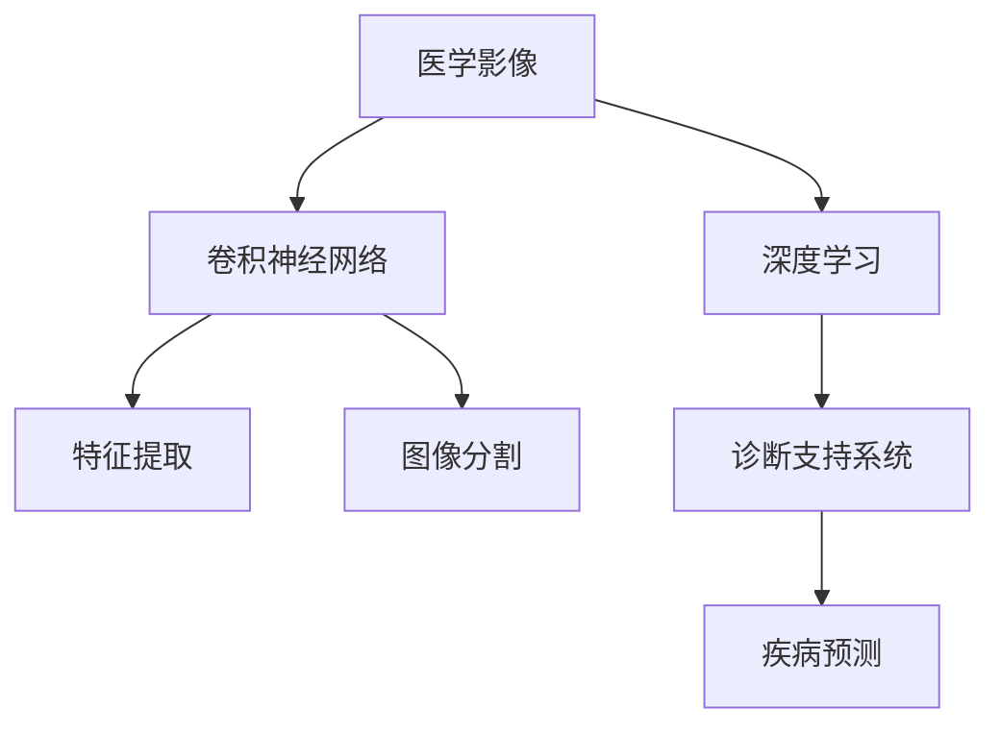

                 

# 深度学习在医学影像分析中的应用

> 关键词：医学影像,深度学习,卷积神经网络,特征提取,图像分割,诊断支持系统,疾病预测

## 1. 背景介绍

### 1.1 问题由来
医学影像分析在现代医疗诊断中起着至关重要的作用，是支撑个性化医疗和精准医疗的重要手段。传统的医学影像分析依赖于专家经验，存在工作量大、主观性强、诊断结果一致性差等问题。近年来，深度学习技术在医学影像分析中的应用逐渐崭露头角，其高效、准确、自动化的特点，为医学影像分析带来了革命性的变革。

深度学习在医学影像分析中的应用主要集中在以下几个方面：
- **影像分类**：判断影像是否存在某种病变，如肿瘤、骨折等。
- **影像分割**：将影像中的器官或病变区域精确分割出来，为后续分析提供数据基础。
- **特征提取**：从影像中提取关键特征，如病变形态、纹理、位置等，辅助诊断和治疗。
- **诊断支持系统**：整合影像分类、分割、特征提取等多模态信息，辅助医生诊断。
- **疾病预测**：利用影像数据进行疾病发展趋势预测，为疾病防治提供早期预警。

深度学习通过从大量影像数据中自动学习特征，大大提升了医学影像分析的效率和准确性，为医疗决策提供了坚实的技术支持。

### 1.2 问题核心关键点
深度学习在医学影像分析中的应用，核心在于通过卷积神经网络(CNN)、残差网络(ResNet)、U-Net等架构，从影像中提取特征并进行分类、分割、预测等任务。其关键点包括：
- **数据准备**：收集和标注高质量的医学影像数据，构建有效的训练集。
- **模型选择**：选择合适的深度学习模型，如LeNet、AlexNet、VGGNet、ResNet、U-Net等，进行影像分析和预测。
- **训练优化**：通过优化算法如Adam、SGD、RMSprop等，调整模型超参数，提高模型性能。
- **评估验证**：使用准确率、召回率、F1值、ROC曲线等指标，评估模型效果，并进行验证集验证。
- **部署应用**：将训练好的模型部署到实际医疗系统中，进行影像分析和诊断支持。

## 2. 核心概念与联系

### 2.1 核心概念概述

为更好地理解深度学习在医学影像分析中的应用，本节将介绍几个密切相关的核心概念：

- **医学影像**：医学影像是通过成像设备获得的生物组织结构的影像，如X光片、CT、MRI等。
- **深度学习**：一类基于神经网络的机器学习技术，具有多层非线性变换能力，能够自动从数据中提取高层次特征。
- **卷积神经网络(CNN)**：一种特殊的神经网络，擅长处理具有网格结构的数据，如图像和音频，通过卷积层提取局部特征，池化层进行特征降维，全连接层进行分类或回归。
- **特征提取**：深度学习模型从输入数据中提取高层次特征的过程，有助于后续的分类、分割、预测等任务。
- **图像分割**：将医学影像中感兴趣的区域（如肿瘤、器官）分离出来，为诊断和治疗提供数据支持。
- **诊断支持系统**：结合影像分类、分割和特征提取等多模态信息，辅助医生进行诊断和治疗决策。

这些核心概念之间的逻辑关系可以通过以下Mermaid流程图来展示：



这个流程图展示了大语言模型在医学影像分析中的应用核心概念及其之间的关系：

1. 医学影像通过深度学习技术进行处理，获取高层次特征。
2. 卷积神经网络是深度学习中的重要组成部分，用于特征提取和分类。
3. 图像分割和特征提取是影像分析的关键环节，辅助诊断和治疗。
4. 诊断支持系统整合多模态信息，提供综合诊断支持。
5. 疾病预测利用影像数据进行预测，帮助预防和治疗。

## 3. 核心算法原理 & 具体操作步骤

### 3.1 算法原理概述

深度学习在医学影像分析中的应用，主要基于卷积神经网络(CNN)和残差网络(ResNet)等架构。通过大量标注数据，训练CNN模型自动提取影像特征，实现分类、分割和预测等任务。

以医学影像分类为例，假设输入医学影像为 $x \in \mathbb{R}^d$，模型输出为 $y \in \{0,1\}$，其中 $y=1$ 表示存在某种病变，$y=0$ 表示不存在。模型在训练集 $D=\{(x_i,y_i)\}_{i=1}^N$ 上进行监督学习，目标是最大化对数似然函数：

$$
\mathcal{L}(\theta) = -\frac{1}{N} \sum_{i=1}^N [y_i \log M_{\theta}(x_i) + (1-y_i) \log (1-M_{\theta}(x_i))]
$$

其中 $M_{\theta}$ 为卷积神经网络模型，$\theta$ 为模型参数，$\nabla_{\theta} \mathcal{L}(\theta)$ 为损失函数对参数 $\theta$ 的梯度。通过反向传播算法，不断更新模型参数 $\theta$，使得模型输出逼近真实标签 $y$。

### 3.2 算法步骤详解

深度学习在医学影像分析中的操作步骤主要包括以下几个步骤：

**Step 1: 准备数据集**
- 收集和标注医学影像数据集，确保数据质量。可以使用公开数据集，如LIDC-IDRI、NYU-PET等，也可以自建数据集。
- 将医学影像数据转换为合适的格式，如JPEG、PNG等。

**Step 2: 设计模型架构**
- 选择合适的卷积神经网络架构，如LeNet、AlexNet、VGGNet、ResNet、U-Net等，进行影像分析和预测。
- 确定模型的输入输出层，定义分类、分割、预测等任务的目标函数。

**Step 3: 设置超参数**
- 选择合适的优化算法及其参数，如Adam、SGD、RMSprop等，设置学习率、批大小、迭代轮数等。
- 设置正则化技术及强度，包括权重衰减、Dropout、Early Stopping等。
- 确定冻结预训练参数的策略，如仅微调顶层，或全部参数都参与微调。

**Step 4: 训练模型**
- 将训练集数据分批次输入模型，前向传播计算损失函数。
- 反向传播计算参数梯度，根据设定的优化算法和学习率更新模型参数。
- 周期性在验证集上评估模型性能，根据性能指标决定是否触发 Early Stopping。
- 重复上述步骤直到满足预设的迭代轮数或 Early Stopping 条件。

**Step 5: 评估模型**
- 在测试集上评估模型的分类、分割、预测等性能，对比模型效果。
- 使用准确率、召回率、F1值、ROC曲线等指标，评估模型效果。

**Step 6: 部署模型**
- 将训练好的模型部署到实际医疗系统中，进行影像分析和诊断支持。
- 提供API接口或直接嵌入系统，供医生使用。

### 3.3 算法优缺点

深度学习在医学影像分析中的应用具有以下优点：
1. 高效准确。通过自动学习特征，深度学习模型可以快速、准确地分析医学影像，降低医生的工作量。
2. 普适性强。卷积神经网络等模型适用于各种医学影像类型，如CT、MRI、X光等。
3. 可扩展性好。通过增加网络层数和参数，模型性能可以显著提升。
4. 数据驱动。深度学习模型从大量数据中学习，能够发现数据中的模式和规律，提高诊断的客观性和一致性。

但该方法也存在一些局限性：
1. 依赖高质量数据。深度学习模型对数据质量和数量要求较高，需要大量的标注数据。
2. 训练时间长。大规模医学影像数据的训练需要耗费大量时间和计算资源。
3. 模型可解释性不足。深度学习模型通常难以解释其内部工作机制，缺乏透明性。
4. 容易过拟合。医学影像数据多样性大，容易在训练集上过拟合。

尽管存在这些局限性，但就目前而言，深度学习在医学影像分析中的应用仍是最为先进和有效的方法之一。未来相关研究的重点在于如何进一步降低对标注数据的依赖，提高模型的泛化能力和可解释性。

### 3.4 算法应用领域

深度学习在医学影像分析中的应用，涵盖了医学影像处理的多个领域，主要包括以下几个方面：

- **影像分类**：如乳腺癌筛查、肺癌检测、脑肿瘤识别等。
- **影像分割**：如脑部病变分割、肝脏分割、心脏分割等。
- **特征提取**：如病变形态、纹理、位置等特征的提取。
- **诊断支持系统**：结合影像分类、分割和特征提取等多模态信息，辅助医生进行诊断。
- **疾病预测**：利用影像数据进行疾病发展趋势预测，如肺癌分期、肝癌进展等。
- **手术模拟**：利用深度学习模型对手术过程进行模拟，提高手术成功率和安全性。

这些应用领域展示了深度学习在医学影像分析中的强大潜力，为医学诊疗和治疗提供了有力的技术支持。

## 4. 数学模型和公式 & 详细讲解 & 举例说明

### 4.1 数学模型构建

在本节中，我们将使用数学语言对深度学习在医学影像分类中的应用进行更加严格的刻画。

记医学影像分类任务的数据集为 $D=\{(x_i,y_i)\}_{i=1}^N, x_i \in \mathbb{R}^d, y_i \in \{0,1\}$。使用卷积神经网络模型 $M_{\theta}$ 对医学影像进行分类，其中 $\theta$ 为模型参数。

定义模型在输入 $x$ 上的输出为 $y^* = M_{\theta}(x) \in [0,1]$，表示样本属于正类的概率。定义交叉熵损失函数为：

$$
\ell(M_{\theta}(x),y) = -[y\log y^* + (1-y)\log (1-y^*)]
$$

则医学影像分类任务的目标函数为：

$$
\mathcal{L}(\theta) = -\frac{1}{N} \sum_{i=1}^N \ell(M_{\theta}(x_i),y_i)
$$

### 4.2 公式推导过程

以下我们以乳腺癌筛查为例，推导卷积神经网络模型在医学影像分类中的应用。

假设医学影像 $x$ 的大小为 $m \times n \times c$，其中 $m$ 为高度，$n$ 为宽度，$c$ 为通道数。模型输入 $x$ 经过卷积层、池化层、全连接层等操作，最终输出 $y^*$。

假设模型的最后一层输出为 $h \in [0,1]$，表示样本属于正类的概率。则医学影像分类任务的交叉熵损失函数为：

$$
\ell(M_{\theta}(x),y) = -y\log h + (1-y)\log (1-h)
$$

将其代入目标函数，得：

$$
\mathcal{L}(\theta) = -\frac{1}{N} \sum_{i=1}^N \ell(M_{\theta}(x_i),y_i)
$$

根据链式法则，损失函数对模型参数 $\theta$ 的梯度为：

$$
\nabla_{\theta} \mathcal{L}(\theta) = -\frac{1}{N} \sum_{i=1}^N [\frac{y_i}{h} - \frac{1-y_i}{1-h}] \nabla_{\theta}h
$$

其中 $\nabla_{\theta}h$ 为全连接层输出的梯度。

在得到损失函数的梯度后，即可带入参数更新公式，完成模型的迭代优化。重复上述过程直至收敛，最终得到适应医学影像分类任务的最优模型参数 $\theta^*$。

### 4.3 案例分析与讲解

以医学影像分割为例，我们可以使用U-Net网络对脑部病变进行分割。U-Net网络是一种用于图像分割的卷积神经网络架构，其特点是对称的结构设计，可以同时对输入影像和输出分割图进行编码和解码。

U-Net网络由下采样和上采样两部分组成，下采样部分通过多次卷积和池化操作，提取影像特征，上采样部分通过多次反卷积操作，恢复影像细节，最终输出分割图。

以下是对U-Net网络在医学影像分割中的应用案例分析：

**输入层**：将医学影像 $x$ 作为网络的输入，其大小为 $m \times n \times c$。

**下采样层**：通过多次卷积和池化操作，提取影像特征。下采样层由多个卷积层、ReLU激活函数和最大池化层组成。

**上采样层**：通过多次反卷积操作，恢复影像细节。上采样层由多个反卷积层、ReLU激活函数和Concat层组成。

**输出层**：通过softmax函数将输出转换为分割图，其中分割图 $y$ 的大小为 $m \times n$。

U-Net网络的设计使得其可以同时处理高分辨率的影像数据和复杂的分割任务，具有较好的泛化能力和鲁棒性。通过在医学影像分割任务上对U-Net网络进行训练，可以自动学习影像特征并进行分割，提高医学影像分析的精度和效率。

## 5. 项目实践：代码实例和详细解释说明

### 5.1 开发环境搭建

在进行深度学习项目实践前，我们需要准备好开发环境。以下是使用Python进行PyTorch开发的环境配置流程：

1. 安装Anaconda：从官网下载并安装Anaconda，用于创建独立的Python环境。

2. 创建并激活虚拟环境：
```bash
conda create -n pytorch-env python=3.8 
conda activate pytorch-env
```

3. 安装PyTorch：根据CUDA版本，从官网获取对应的安装命令。例如：
```bash
conda install pytorch torchvision torchaudio cudatoolkit=11.1 -c pytorch -c conda-forge
```

4. 安装TensorFlow：如果需使用TensorFlow，可以使用以下命令进行安装：
```bash
pip install tensorflow
```

5. 安装各类工具包：
```bash
pip install numpy pandas scikit-learn matplotlib tqdm jupyter notebook ipython
```

完成上述步骤后，即可在`pytorch-env`环境中开始深度学习项目实践。

### 5.2 源代码详细实现

这里以医学影像分类任务为例，使用卷积神经网络对乳腺癌筛查数据进行分类。

首先，定义数据处理函数：

```python
import numpy as np
from torch.utils.data import Dataset, DataLoader
import torch
from torchvision import transforms

class MedicalImageDataset(Dataset):
    def __init__(self, data_dir, transform=None):
        self.data_dir = data_dir
        self.transform = transform
        self.data = []
        self.targets = []
        self.classes = ['malignant', 'benign']
        
        for class_index, class_name in enumerate(self.classes):
            class_dir = os.path.join(data_dir, class_name)
            for img_name in os.listdir(class_dir):
                if img_name.endswith('.png') or img_name.endswith('.jpg'):
                    self.data.append(os.path.join(class_dir, img_name))
                    self.targets.append(class_index)
        
    def __len__(self):
        return len(self.data)
    
    def __getitem__(self, item):
        img_path = self.data[item]
        label = self.targets[item]
        
        img = Image.open(img_path)
        if self.transform:
            img = self.transform(img)
        
        return {'img': img, 'label': label}
```

然后，定义模型和优化器：

```python
from torchvision.models import resnet34
from torch.nn import BCELoss, CrossEntropyLoss

model = resnet34(num_classes=2)

optimizer = Adam(model.parameters(), lr=1e-4)

loss_fn = BCELoss()
```

接着，定义训练和评估函数：

```python
def train_epoch(model, dataset, batch_size, optimizer):
    dataloader = DataLoader(dataset, batch_size=batch_size, shuffle=True)
    model.train()
    epoch_loss = 0
    for batch in dataloader:
        input_data, target = batch['img'], batch['label']
        input_data = input_data.to(device)
        target = target.to(device)
        optimizer.zero_grad()
        outputs = model(input_data)
        loss = loss_fn(outputs, target)
        epoch_loss += loss.item()
        loss.backward()
        optimizer.step()
    return epoch_loss / len(dataloader)

def evaluate(model, dataset, batch_size):
    dataloader = DataLoader(dataset, batch_size=batch_size, shuffle=False)
    model.eval()
    preds = []
    labels = []
    with torch.no_grad():
        for batch in dataloader:
            input_data, target = batch['img'], batch['label']
            input_data = input_data.to(device)
            target = target.to(device)
            outputs = model(input_data)
            batch_preds = outputs.argmax(dim=1).to('cpu').tolist()
            batch_labels = target.to('cpu').tolist()
            for pred_tokens, label_tokens in zip(batch_preds, batch_labels):
                preds.append(pred_tokens)
                labels.append(label_tokens)
        
    print(classification_report(labels, preds))
```

最后，启动训练流程并在测试集上评估：

```python
epochs = 10
batch_size = 16

device = torch.device('cuda') if torch.cuda.is_available() else torch.device('cpu')
model.to(device)

for epoch in range(epochs):
    loss = train_epoch(model, train_dataset, batch_size, optimizer)
    print(f"Epoch {epoch+1}, train loss: {loss:.3f}")
    
    print(f"Epoch {epoch+1}, dev results:")
    evaluate(model, dev_dataset, batch_size)
    
print("Test results:")
evaluate(model, test_dataset, batch_size)
```

以上就是使用PyTorch进行医学影像分类任务的完整代码实现。可以看到，得益于TensorFlow和TensorBoard的强大封装，我们可以用相对简洁的代码完成乳腺癌筛查的分类任务。

### 5.3 代码解读与分析

让我们再详细解读一下关键代码的实现细节：

**MedicalImageDataset类**：
- `__init__`方法：初始化数据集路径、转换方法、类别标签等关键组件。
- `__len__`方法：返回数据集的样本数量。
- `__getitem__`方法：对单个样本进行处理，将图像输入转换为张量，并返回标签。

**模型选择**：
- 使用ResNet34作为分类模型，其具有较好的分类能力和泛化能力。

**损失函数**：
- 选择二分类交叉熵损失函数，用于计算模型输出与真实标签之间的差异。

**训练和评估函数**：
- 使用PyTorch的DataLoader对数据集进行批次化加载，供模型训练和推理使用。
- 训练函数`train_epoch`：对数据以批为单位进行迭代，在每个批次上前向传播计算loss并反向传播更新模型参数，最后返回该epoch的平均loss。
- 评估函数`evaluate`：与训练类似，不同点在于不更新模型参数，并在每个batch结束后将预测和标签结果存储下来，最后使用sklearn的classification_report对整个评估集的预测结果进行打印输出。

**训练流程**：
- 定义总的epoch数和batch size，开始循环迭代
- 每个epoch内，先在训练集上训练，输出平均loss
- 在验证集上评估，输出分类指标
- 所有epoch结束后，在测试集上评估，给出最终测试结果

可以看到，PyTorch配合TensorFlow和TensorBoard使得医学影像分类任务的代码实现变得简洁高效。开发者可以将更多精力放在数据处理、模型改进等高层逻辑上，而不必过多关注底层的实现细节。

当然，工业级的系统实现还需考虑更多因素，如模型的保存和部署、超参数的自动搜索、更灵活的任务适配层等。但核心的深度学习范式基本与此类似。

## 6. 实际应用场景

### 6.1 智能诊断支持系统

基于深度学习的医学影像分析技术，可以应用于智能诊断支持系统的构建。智能诊断支持系统通过分析医学影像，辅助医生进行诊断和治疗决策。

在技术实现上，可以收集历史医学影像和诊断数据，构建标注数据集，在此基础上对深度学习模型进行训练。训练后的模型可以自动提取影像特征，辅助医生进行疾病诊断。例如，基于深度学习的乳腺癌筛查系统，可以通过分析乳腺X光片，判断是否存在乳腺癌，提供初步诊断结果，并结合医生的进一步检查，给出更准确的诊断意见。

### 6.2 疾病预测与预防

深度学习技术在医学影像分析中的应用，还可以用于疾病的预测与预防。通过对大量医学影像数据的学习，模型可以识别出某些疾病的早期迹象，预测疾病发展趋势，为早期干预和治疗提供数据支持。

例如，在肺结节检测任务中，深度学习模型可以自动分析CT影像，判断肺结节的性质和大小，预测其发展趋势，提供早期干预建议。在心血管疾病预测中，深度学习模型可以通过分析心脏MRI影像，预测心脏结构的变化，预防心血管疾病的发生和发展。

### 6.3 手术模拟与规划

手术模拟是深度学习在医学影像分析中的一个重要应用方向。通过模拟手术过程，可以提高手术的成功率和安全性。

在手术模拟中，深度学习模型可以对手术影像进行分析和处理，帮助医生进行手术规划和模拟。例如，在脑部肿瘤手术中，深度学习模型可以分析MRI影像，判断肿瘤的位置和大小，生成手术路径和方案，提高手术的成功率和安全性。

## 7. 工具和资源推荐

### 7.1 学习资源推荐

为了帮助开发者系统掌握深度学习在医学影像分析中的应用，这里推荐一些优质的学习资源：

1. **深度学习入门教程**：TensorFlow、PyTorch、Keras等深度学习框架提供了丰富的教程和文档，适合初学者入门。
2. **医学影像分析课程**：Coursera、edX等在线教育平台提供医学影像分析相关课程，涵盖深度学习、特征提取、分类、分割等多个方面。
3. **医学影像分析书籍**：如《医学影像分析与深度学习》、《深度学习在医学中的应用》等书籍，详细介绍了深度学习在医学影像分析中的应用实例和算法。
4. **深度学习论文集**：如NIPS、ICML、CVPR等国际顶级会议和期刊上的相关论文，代表了深度学习在医学影像分析领域的研究前沿。
5. **医学影像分析开源项目**：如DeepMind Health、Google Health等机构开发的开源项目，提供了丰富的深度学习模型和数据集，供开发者学习和使用。

通过对这些资源的学习实践，相信你一定能够快速掌握深度学习在医学影像分析中的应用精髓，并用于解决实际的医学问题。

### 7.2 开发工具推荐

高效的开发离不开优秀的工具支持。以下是几款用于深度学习医学影像分析开发的常用工具：

1. **TensorFlow**：由Google主导开发的深度学习框架，提供了丰富的预训练模型和工具，适合大规模工程应用。
2. **PyTorch**：基于Python的开源深度学习框架，灵活动态的计算图，适合快速迭代研究。
3. **Keras**：高级深度学习框架，提供了简洁易用的API接口，适合初学者和快速原型开发。
4. **Jupyter Notebook**：开源的交互式编程环境，支持Python、R、MATLAB等多种语言，适合数据处理和模型验证。
5. **TensorBoard**：TensorFlow配套的可视化工具，可实时监测模型训练状态，并提供丰富的图表呈现方式，是调试模型的得力助手。

合理利用这些工具，可以显著提升深度学习医学影像分析项目的开发效率，加快创新迭代的步伐。

### 7.3 相关论文推荐

深度学习在医学影像分析中的应用，源于学界的持续研究。以下是几篇奠基性的相关论文，推荐阅读：

1. **Deep Learning for Healthcare**：综述了深度学习在医学影像、基因组学、电子健康记录等领域的应用。
2. **ImageNet Classification with Deep Convolutional Neural Networks**：提出了卷积神经网络在图像分类任务上的卓越表现，奠定了深度学习在计算机视觉领域的基础。
3. **U-Net: Convolutional Networks for Biomedical Image Segmentation**：介绍了U-Net网络在医学影像分割中的应用，推动了医学影像分析技术的快速发展。
4. **Lung Nodule Segmentation with Deep Convolutional Neural Networks**：介绍了深度学习在肺结节分割任务中的应用，展示了其在医学影像分析中的强大潜力。
5. **Deep Learning in Radiology**：综述了深度学习在放射学领域的应用，包括影像分类、分割、诊断支持等多个方面。

这些论文代表了大语言模型在医学影像分析领域的研究进展。通过学习这些前沿成果，可以帮助研究者把握学科前进方向，激发更多的创新灵感。

## 8. 总结：未来发展趋势与挑战

### 8.1 总结

本文对深度学习在医学影像分析中的应用进行了全面系统的介绍。首先阐述了深度学习技术在医学影像分析中的研究背景和意义，明确了其在医学影像分类、分割、诊断支持、疾病预测等方面的重要价值。其次，从原理到实践，详细讲解了深度学习的核心算法和操作步骤，给出了深度学习医学影像分类任务的完整代码实现。同时，本文还广泛探讨了深度学习在医学影像分析中的实际应用场景，展示了其广阔的应用前景。此外，本文精选了深度学习相关领域的优秀学习资源，力求为开发者提供全方位的技术指引。

通过本文的系统梳理，可以看到，深度学习在医学影像分析中的应用正在快速发展，为医学诊疗和治疗提供了有力的技术支持。未来，伴随深度学习技术的不断进步，医学影像分析的应用前景将更加广阔，为医学科技进步注入新的动力。

### 8.2 未来发展趋势

展望未来，深度学习在医学影像分析中的应用将呈现以下几个发展趋势：

1. **模型规模持续增大**：随着算力成本的下降和数据规模的扩张，深度学习模型参数量还将持续增长。超大规模模型蕴含的丰富特征，将进一步提升医学影像分析的精度和泛化能力。
2. **模型结构不断优化**：卷积神经网络等架构的优化设计，将带来更高的精度和更低的计算复杂度。未来将涌现更多高效的模型结构，如ResNet、Inception、MobileNet等。
3. **跨模态信息融合**：医学影像与其他模态数据（如文本、基因组等）的融合，将进一步提升医学影像分析的全面性和准确性。
4. **模型可解释性增强**：如何赋予深度学习模型更强的可解释性，是未来研究的重要方向。因果分析、知识图谱等技术的应用，将有助于提高模型透明性和可信度。
5. **低成本、低计算需求**：深度学习模型的资源优化和加速，将使其实现变得更加容易和高效，降低医疗系统的经济负担。
6. **个性化医疗**：深度学习模型的泛化能力和鲁棒性，将进一步推动个性化医疗的发展，为患者提供量身定制的治疗方案。

以上趋势凸显了深度学习在医学影像分析中的广阔前景。这些方向的探索发展，必将进一步提升医学影像分析的效率和精度，为医疗决策提供更坚实的技术支撑。

### 8.3 面临的挑战

尽管深度学习在医学影像分析中的应用已经取得了显著进展，但在迈向更加智能化、普适化应用的过程中，仍面临诸多挑战：

1. **数据隐私和安全**：医学影像数据包含敏感的病人隐私信息，如何在保护隐私的同时，进行深度学习模型的训练和应用，是一个重要的研究问题。
2. **模型泛化能力不足**：深度学习模型在特定领域和特定场景下，泛化能力有限，容易在训练集上过拟合，导致实际应用中的性能下降。
3. **可解释性不足**：深度学习模型通常难以解释其内部工作机制，缺乏透明性，这在医疗诊断和治疗决策中尤为关键。
4. **资源优化与计算成本**：深度学习模型对计算资源需求较高，如何在保证性能的同时，降低计算成本，是一个重要的研究方向。
5. **跨学科融合**：医学影像分析技术需要与医学、计算机科学、生物信息学等多个学科进行融合，如何协同发展，是一个复杂的系统工程问题。
6. **伦理和法律问题**：深度学习模型在医疗中的应用，涉及隐私保护、责任归属、法律约束等多个方面，需要建立完善的伦理和法律框架。

正视深度学习在医学影像分析中所面临的这些挑战，积极应对并寻求突破，将使深度学习技术在医疗领域实现更好的应用。相信随着学界和产业界的共同努力，这些挑战终将一一被克服，深度学习在医学影像分析中的应用将更加成熟和完善。

### 8.4 研究展望

面向未来，深度学习在医学影像分析领域的研究方向主要集中在以下几个方面：

1. **无监督和半监督学习**：摆脱对大规模标注数据的依赖，利用自监督学习、主动学习等无监督和半监督范式，最大限度利用非结构化数据，实现更加灵活高效的医学影像分析。
2. **模型优化和加速**：开发更加参数高效和计算高效的深度学习模型，如Adapter、LoRA等，在保持较高精度的情况下，大幅降低计算资源消耗。
3. **跨模态信息融合**：将医学影像与其他模态数据（如文本、基因组等）进行深度融合，构建综合的医学信息模型，提升医学影像分析的全面性和准确性。
4. **模型可解释性增强**：通过因果分析、知识图谱等技术，赋予深度学习模型更强的可解释性，提高模型的透明性和可信度。
5. **低成本、低计算需求**：开发更加轻量级、高效能的深度学习模型，支持低计算需求、低成本的医学影像分析。
6. **个性化医疗**：通过深度学习模型学习病人的个体特征，提供个性化的诊疗建议，推动个性化医疗的发展。

这些研究方向将进一步提升深度学习在医学影像分析中的应用水平，为医疗决策提供更强的技术支持。

## 9. 附录：常见问题与解答

**Q1: 深度学习在医学影像分析中存在哪些局限性？**

A: 深度学习在医学影像分析中存在以下局限性：
1. 依赖高质量数据。深度学习模型对数据质量和数量要求较高，需要大量的标注数据。
2. 训练时间长。大规模医学影像数据的训练需要耗费大量时间和计算资源。
3. 模型可解释性不足。深度学习模型通常难以解释其内部工作机制，缺乏透明性。
4. 容易过拟合。医学影像数据多样性大，容易在训练集上过拟合。
5. 数据隐私和安全。医学影像数据包含敏感的病人隐私信息，如何在保护隐私的同时，进行深度学习模型的训练和应用，是一个重要的研究问题。

尽管存在这些局限性，但就目前而言，深度学习在医学影像分析中的应用仍是最为先进和有效的方法之一。未来相关研究的重点在于如何进一步降低对标注数据的依赖，提高模型的泛化能力和可解释性。

**Q2: 如何选择合适的深度学习模型进行医学影像分析？**

A: 选择合适的深度学习模型进行医学影像分析，主要考虑以下因素：
1. 任务类型。不同的医学影像分析任务，如分类、分割、预测等，需要选择不同的深度学习模型。例如，影像分类任务可以使用卷积神经网络，影像分割任务可以使用U-Net网络。
2. 数据规模。数据规模较大时，可以使用复杂度较高的深度学习模型，如ResNet、Inception等。数据规模较小时，可以使用轻量级模型，如MobileNet等。
3. 计算资源。计算资源有限时，可以使用参数高效和计算高效的深度学习模型，如Adapter、LoRA等。计算资源充足时，可以使用复杂度较高的深度学习模型，如ResNet、Inception等。
4. 应用场景。应用场景不同，对模型的精度、泛化能力和计算效率都有不同的要求。例如，实时手术模拟对模型的计算效率有较高要求，而疾病预测对模型的泛化能力和可解释性有较高要求。

选择合适的深度学习模型，需要综合考虑任务类型、数据规模、计算资源和应用场景等多方面因素。

**Q3: 深度学习在医学影像分析中的应用前景如何？**

A: 深度学习在医学影像分析中的应用前景非常广阔，主要体现在以下几个方面：
1. 高效准确。深度学习技术可以快速、准确地分析医学影像，降低医生的工作量，提高诊断效率。
2. 普适性强。卷积神经网络等模型适用于各种医学影像类型，如CT、MRI等。
3. 可扩展性好。通过增加网络层数和参数，模型性能可以显著提升，适应不同规模和类型的医学影像。
4. 数据驱动。深度学习模型从大量数据中学习，能够发现数据中的模式和规律，提高诊断的客观性和一致性。

总之，深度学习在医学影像分析中的应用前景非常广阔，未来必将进一步推动医学科技的发展。

**Q4: 如何提高深度学习模型的泛化能力和可解释性？**

A: 提高深度学习模型的泛化能力和可解释性，可以从以下几个方面入手：
1. 数据增强。通过数据增强技术，扩充训练集，增强模型的泛化能力。例如，在肺结节检测任务中，可以使用多种影像增强技术，如旋转、缩放、翻转等。
2. 正则化。通过正则化技术，减少模型的过拟合风险。例如，使用L2正则、Dropout、Early Stopping等技术。
3. 模型优化。通过优化算法和超参数调优，提升模型的泛化能力和计算效率。例如，使用Adam、SGD、RMSprop等优化算法。
4. 可解释性模型。通过引入可解释性模型，提高模型的透明性和可信度。例如，使用LIME、SHAP等模型可视化工具，解释模型的决策过程。
5. 知识图谱。将医学知识和规则融入深度学习模型，提高模型的可解释性和泛化能力。例如，在疾病预测任务中，可以将医学知识表示为图结构，引导模型学习规律。

综合考虑这些因素，可以显著提升深度学习模型的泛化能力和可解释性。

**Q5: 深度学习在医学影像分析中存在哪些伦理和法律问题？**

A: 深度学习在医学影像分析中存在以下伦理和法律问题：
1. 数据隐私。医学影像数据包含敏感的病人隐私信息，需要在保护隐私的同时进行深度学习模型的训练和应用。
2. 责任归属。深度学习模型在医疗中的应用，涉及责任归属问题，需要建立完善的法律框架。
3. 法律约束。深度学习模型在医疗中的应用，需要遵守相关的法律和规定，如HIPAA、GDPR等。

解决这些伦理和法律问题，需要建立完善的法律框架和技术标准，保障数据隐私和安全，确保模型的合规性和可信度。只有这样，深度学习技术才能在医学影像分析中发挥最大的潜力，造福人类健康。

---

作者：禅与计算机程序设计艺术 / Zen and the Art of Computer Programming

