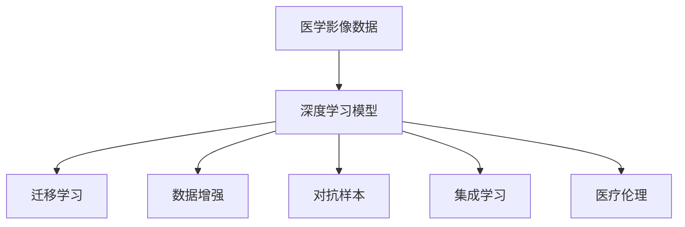

                 

## 1. 背景介绍

深度学习(DL)技术近年来在医学影像分析中取得显著进展，广泛应用于疾病诊断、治疗方案制定、个性化医疗等多个领域。以深度学习为基础的医学影像分析系统，已经逐步替代了传统的影像分类方法，成为推动医学发展的强大工具。

### 1.1 医学影像分析的由来

医学影像分析主要通过深度学习模型对医学影像数据进行自动化分析，包括图像分类、分割、量化等多个方面。传统医学影像分析方法需要大量手工标注和专业知识，不仅效率低下，还容易受主观因素影响，导致分析结果的准确性和一致性难以保证。深度学习模型通过学习海量数据，自动提取影像特征，减少了人工标注的依赖，提升了分析的效率和准确性。

### 1.2 医学影像分析的价值

深度学习在医学影像分析中的应用，能够显著降低医疗成本，提高诊疗效率，提升医疗服务质量。具体而言，深度学习技术在以下几个方面具有明显优势：

1. **诊断准确性**：深度学习模型能够自动从影像数据中提取特征，并结合知识图谱、逻辑规则等先验知识，进行精准诊断。
2. **个性化医疗**：通过对海量患者影像数据的深度学习，模型可以捕捉到个体差异，实现更加个性化的治疗方案。
3. **实时分析**：深度学习模型可以实时处理影像数据，辅助医生在手术、急诊等高压力场景中快速做出决策。
4. **辅助教学**：深度学习模型可以作为教学工具，帮助医学实习生和学生理解复杂的影像知识，提高医学教育质量。
5. **远程医疗**：深度学习模型可以部署到云端或移动设备中，实现医疗资源的共享，推动远程医疗发展。

## 2. 核心概念与联系

### 2.1 核心概念概述

为更好地理解深度学习在医学影像分析中的应用，本节将介绍几个关键概念：

- **医学影像数据**：包括X光片、CT、MRI、超声等图像数据，是深度学习模型输入的基础。
- **深度学习模型**：如卷积神经网络(CNN)、递归神经网络(RNN)、Transformer等，通过多层非线性变换提取特征，用于影像分析任务。
- **迁移学习**：利用预训练模型在大规模数据上学习到的知识，在下游特定任务上进行微调，提高模型性能。
- **数据增强**：通过对原始影像数据进行旋转、裁剪、平移、翻转等操作，增加数据多样性，提高模型泛化能力。
- **对抗样本**：构造特定的干扰样本，挑战模型的鲁棒性，提高模型在真实环境下的鲁棒性。
- **集成学习**：通过融合多个模型的预测结果，减少个体模型的不确定性，提升整体模型的准确性和鲁棒性。
- **医疗伦理**：在深度学习模型应用于医疗领域时，需要考虑数据隐私、算法透明性、医疗责任等伦理问题。

这些核心概念之间的逻辑关系可以通过以下Mermaid流程图来展示：



这个流程图展示了深度学习模型与医学影像分析任务之间的联系，以及模型训练中可能涉及的关键技术和伦理问题。

## 3. 核心算法原理 & 具体操作步骤

### 3.1 算法原理概述

深度学习在医学影像分析中的应用，主要基于两个核心算法：卷积神经网络(CNN)和迁移学习。

**CNN算法原理**：
卷积神经网络是由多层卷积和池化操作组成的前馈神经网络。CNN通过卷积操作提取影像数据的空间局部特征，通过池化操作降低特征维度，最终通过全连接层进行分类或回归任务。

**迁移学习原理**：
迁移学习是指在大规模数据上预训练一个通用模型，然后在特定任务上进行微调，利用预训练模型的知识提高模型性能。迁移学习可以有效减少训练数据的需求，提高模型在新任务上的泛化能力。

### 3.2 算法步骤详解

深度学习在医学影像分析中的操作步骤主要包括以下几个步骤：

**Step 1: 数据预处理**
- 收集医学影像数据，并进行清洗、标注。
- 对图像数据进行预处理，包括裁剪、归一化、缩放等操作。
- 将标注数据转换为模型可接受的格式，如TensorFlow、PyTorch等深度学习框架的张量形式。

**Step 2: 模型构建**
- 选择合适的深度学习模型，如CNN、RNN、Transformer等。
- 在数据集上进行预训练，学习通用特征。
- 设计适合特定任务的目标函数，如分类任务中的交叉熵损失，分割任务中的Dice系数损失等。

**Step 3: 模型微调**
- 在预训练模型基础上，使用特定任务的标注数据进行微调。
- 选择合适的优化算法，如Adam、SGD等，并设置学习率、批大小、迭代轮数等参数。
- 应用正则化技术，如Dropout、L2正则等，防止模型过拟合。
- 评估模型性能，并在需要时进行微调超参数优化。

**Step 4: 模型评估与部署**
- 在验证集上评估模型性能，使用准确率、召回率、F1分数等指标进行评估。
- 对模型进行保存和部署，支持API接口调用或嵌入到医疗设备中。
- 持续收集新数据，定期重新训练和微调模型。

### 3.3 算法优缺点

深度学习在医学影像分析中具有以下优点：
1. **高精度**：通过学习海量数据，能够自动提取影像特征，提高诊断准确性。
2. **自动化**：自动化影像处理流程，减轻医生负担，提高诊疗效率。
3. **泛化能力**：通过迁移学习，模型能够在不同影像数据集上取得优异性能。
4. **可解释性**：通过可视化工具，如Grad-CAM、SHAP等，可以解释模型决策过程。

同时，深度学习也存在一些缺点：
1. **资源消耗大**：模型训练和推理需要高性能设备，如GPU、TPU等。
2. **数据依赖性强**：深度学习模型需要大量标注数据，而医学影像数据获取成本高。
3. **解释性不足**：深度学习模型通常是"黑盒"系统，难以解释其内部决策逻辑。
4. **伦理风险**：在医疗领域应用深度学习模型时，需要考虑数据隐私、算法透明性、医疗责任等伦理问题。

### 3.4 算法应用领域

深度学习在医学影像分析中的应用，已经涵盖多个领域，具体包括：

1. **疾病诊断**：如乳腺癌、肺癌、脑瘤等疾病的早期筛查与诊断。
2. **治疗方案制定**：根据影像分析结果，制定个性化治疗方案，如放疗、化疗、手术等。
3. **手术辅助**：利用深度学习模型生成手术导航图，辅助医生进行精准手术。
4. **影像分割**：对影像数据进行分割，如肿瘤分割、器官分割等。
5. **病理学分析**：利用深度学习模型分析组织切片，辅助病理诊断。
6. **智能问诊**：基于深度学习模型构建智能问诊系统，辅助医生进行疾病诊断与治疗。
7. **远程医疗**：部署深度学习模型到云端，支持远程医疗咨询和影像诊断。

## 4. 数学模型和公式 & 详细讲解 & 举例说明

### 4.1 数学模型构建

**数据集构建**：
假设医学影像数据集 $D=\{(x_i,y_i)\}_{i=1}^N$，其中 $x_i$ 为影像数据，$y_i$ 为标注数据。常见标注数据包括像素级标签、区域级标签、多类别标签等。

**模型构建**：
选择卷积神经网络(CNN)模型，其基本结构如图1所示。


**目标函数**：
对于分类任务，常用的目标函数为交叉熵损失函数：
$$
\mathcal{L}=\frac{1}{N}\sum_{i=1}^N -y_i\log p(y_i)
$$
其中 $p(y_i)$ 为模型对类别 $y_i$ 的预测概率。

**参数更新**：
常用的优化算法为Adam，其参数更新公式为：
$$
\theta \leftarrow \theta - \eta \nabla_{\theta}\mathcal{L}(\theta)
$$
其中 $\eta$ 为学习率，$\nabla_{\theta}\mathcal{L}(\theta)$ 为损失函数对模型参数的梯度。

### 4.2 公式推导过程

以卷积神经网络为例，推导其参数更新公式。

卷积层的操作可以看作卷积核在图像数据上的滑动卷积，具体公式如下：
$$
\mathcal{F}(\mathbf{W}, \mathbf{b}, \mathbf{X})=\mathbf{b}+\mathbf{X} * \mathbf{W}
$$
其中 $\mathbf{W}$ 为卷积核，$\mathbf{b}$ 为偏置项，$\mathbf{X}$ 为输入数据。

假设卷积核大小为 $k \times k$，输入数据大小为 $w \times h \times c$，输出数据大小为 $n \times n \times o$，则卷积操作的计算量为 $O(nknwo)$。

池化层的操作通常包括最大池化、平均池化等，其中最大池化的公式为：
$$
\mathcal{F}_{\text{max}}=\max_{i,j}(\mathbf{W}, \mathbf{b}, \mathbf{X})= \max_{i,j}(\mathbf{X} * \mathbf{W}+\mathbf{b})
$$
其中 $\mathbf{W}$ 为池化核，$\mathbf{b}$ 为偏置项，$\mathbf{X}$ 为输入数据。

假设池化核大小为 $k \times k$，输入数据大小为 $n \times n \times o$，则最大池化操作的计算量为 $O(n^{k^2}o)$。

### 4.3 案例分析与讲解

以乳腺癌影像分类为例，展示深度学习模型的训练和应用过程。

假设乳腺癌数据集包含 $N$ 个图像和对应的像素级标签，图像大小为 $w \times h \times c$。

**数据预处理**：
- 将图像数据归一化到 $[0,1]$ 区间。
- 将像素级标签转换为独热编码。

**模型构建**：
选择VGG16作为基础模型，在最后全连接层添加softmax激活函数，输出 $N$ 个类别的预测概率。

**目标函数**：
选择交叉熵损失函数，公式为：
$$
\mathcal{L}=-\frac{1}{N}\sum_{i=1}^N y_i\log p(y_i)
$$

**参数更新**：
使用Adam优化算法进行参数更新，学习率设置为 $10^{-4}$，批大小为 $32$，迭代轮数为 $100$。

**模型评估**：
在验证集上使用准确率、召回率、F1分数等指标进行评估。

## 5. 项目实践：代码实例和详细解释说明

### 5.1 开发环境搭建

在进行深度学习模型开发前，需要进行以下环境搭建：

1. **安装Python**：从官网下载并安装Python，通常建议安装Python 3.7及以上版本。
2. **安装深度学习框架**：如TensorFlow、PyTorch等，通常使用pip或conda安装。
3. **安装相关库**：如NumPy、Pandas、Matplotlib等，支持数据处理和可视化。
4. **配置GPU环境**：如果使用的是GPU设备，需要安装CUDA和cuDNN等GPU驱动和库。

### 5.2 源代码详细实现

以下是使用TensorFlow实现卷积神经网络进行乳腺癌影像分类的代码：

```python
import tensorflow as tf
from tensorflow.keras import layers, models
import numpy as np
import matplotlib.pyplot as plt

# 数据预处理
def preprocess_data(data_path):
    # 加载图像数据
    image_data = tf.keras.preprocessing.image.load_img(data_path, target_size=(224, 224))
    image_data = tf.keras.preprocessing.image.img_to_array(image_data)
    image_data = tf.image.convert_image_dtype(image_data, tf.float32)
    image_data /= 255.0
    image_data = tf.expand_dims(image_data, axis=0)

    # 加载标签数据
    label_data = np.loadtxt(data_path[:-4] + '.txt', dtype=np.int32)
    label_data = tf.keras.utils.to_categorical(label_data, num_classes=2)

    return image_data, label_data

# 定义模型
model = models.Sequential([
    layers.Conv2D(32, (3, 3), activation='relu', input_shape=(224, 224, 3)),
    layers.MaxPooling2D((2, 2)),
    layers.Conv2D(64, (3, 3), activation='relu'),
    layers.MaxPooling2D((2, 2)),
    layers.Conv2D(128, (3, 3), activation='relu'),
    layers.MaxPooling2D((2, 2)),
    layers.Flatten(),
    layers.Dense(128, activation='relu'),
    layers.Dense(2, activation='softmax')
])

# 编译模型
model.compile(optimizer='adam', loss='categorical_crossentropy', metrics=['accuracy'])

# 加载数据集
image_data, label_data = preprocess_data('data/train/000001.jpg')

# 训练模型
model.fit(image_data, label_data, epochs=100, batch_size=32, validation_data=preprocess_data('data/val/000001.jpg'))

# 模型评估
test_image_data, test_label_data = preprocess_data('data/test/000001.jpg')
test_loss, test_acc = model.evaluate(test_image_data, test_label_data)
print('Test accuracy:', test_acc)

# 可视化模型
class_names = ['malignant', 'benign']
predictions = model.predict(test_image_data)
predicted_class = class_names[np.argmax(predictions)]

plt.imshow(test_image_data[0, :, :, :])
plt.title(predicted_class)
plt.show()
```

### 5.3 代码解读与分析

以上代码展示了如何使用TensorFlow构建和训练卷积神经网络模型，进行乳腺癌影像分类。

**数据预处理**：
- `preprocess_data`函数用于加载和预处理图像和标签数据，将图像数据归一化，将标签数据转换为独热编码。

**模型定义**：
- `Sequential`模型定义了卷积神经网络的结构，包括卷积层、池化层、全连接层等。

**模型编译**：
- `compile`方法用于配置模型，指定优化器、损失函数和评估指标。

**模型训练**：
- `fit`方法用于训练模型，指定训练数据、训练轮数、批大小等参数。

**模型评估**：
- `evaluate`方法用于评估模型性能，返回损失和准确率等指标。

**可视化模型**：
- 使用Matplotlib库可视化模型的输出结果，展示模型对新样本的分类结果。

## 6. 实际应用场景

### 6.1 癌症筛查

癌症筛查是医学影像分析的重要应用场景之一。通过深度学习模型，可以自动分析影像数据，识别出癌症病灶，并辅助医生进行诊断和治疗。

具体而言，深度学习模型可以用于：
- 肺癌筛查：对CT影像数据进行自动分析，识别出肺部结节和肿瘤。
- 乳腺癌筛查：对乳腺X光片进行自动分析，识别出微小癌灶。
- 前列腺癌筛查：对MRI影像数据进行自动分析，识别出前列腺病变。

**技术要点**：
- 选择合适的预训练模型，如ResNet、Inception等，进行微调。
- 对影像数据进行增强处理，如旋转、裁剪、翻转等，提高模型泛化能力。
- 利用对抗样本生成技术，生成对模型进行鲁棒性测试的样本。
- 结合先验知识，如病理知识库、逻辑规则等，增强模型对特定疾病的识别能力。

### 6.2 脑部疾病诊断

脑部疾病诊断是医学影像分析的另一个重要应用场景。深度学习模型可以自动分析影像数据，识别出脑部病变，辅助医生进行诊断和治疗。

具体而言，深度学习模型可以用于：
- 脑出血诊断：对MRI影像数据进行自动分析，识别出脑出血位置和大小。
- 脑肿瘤诊断：对MRI影像数据进行自动分析，识别出脑肿瘤的边界和类型。
- 脑部血管病变诊断：对CTA影像数据进行自动分析，识别出脑部血管病变。

**技术要点**：
- 选择合适的预训练模型，如3D卷积神经网络等，进行微调。
- 对影像数据进行分割处理，如肿瘤分割、脑部血管分割等，提高模型对病变区域的识别能力。
- 利用先验知识，如解剖学知识、病理学知识等，增强模型对特定病变的识别能力。

### 6.3 医疗影像增强

医疗影像增强是医学影像分析的重要应用场景之一。深度学习模型可以自动增强影像质量，提升影像的可读性和可分析性。

具体而言，深度学习模型可以用于：
- 影像去噪：对CT、MRI等影像数据进行去噪处理，提升影像清晰度。
- 影像增强：对X光片等影像数据进行增强处理，提升影像对比度。
- 影像融合：对不同模态的影像数据进行融合处理，生成新的影像数据。

**技术要点**：
- 选择合适的预训练模型，如U-Net、GAN等，进行微调。
- 对影像数据进行增强处理，如去噪、增强、融合等，提高影像质量。
- 利用先验知识，如解剖学知识、生理学知识等，增强模型对影像特征的提取能力。

## 7. 工具和资源推荐

### 7.1 学习资源推荐

为了帮助开发者系统掌握深度学习在医学影像分析中的应用，这里推荐一些优质的学习资源：

1. **《深度学习》书籍**：Ian Goodfellow、Yoshua Bengio、Aaron Courville合著的经典深度学习教材，系统介绍深度学习原理、算法和应用。
2. **《医学影像处理与分析》课程**：北京大学、上海交通大学等知名高校开设的医学影像处理与分析课程，涵盖医学影像分析的多个方面。
3. **TensorFlow官方文档**：TensorFlow官方文档，提供详细的API介绍、使用示例和代码实践，是学习深度学习的必读资源。
4. **PyTorch官方文档**：PyTorch官方文档，提供丰富的教程、示例和代码实践，是学习深度学习的推荐资源。
5. **Coursera深度学习课程**：Coursera上由深度学习领域的知名教授开设的深度学习课程，涵盖深度学习原理、算法和应用。

通过对这些资源的学习实践，相信你一定能够快速掌握深度学习在医学影像分析中的应用方法，并用于解决实际的医学问题。

### 7.2 开发工具推荐

高效的开发离不开优秀的工具支持。以下是几款用于深度学习模型开发的常用工具：

1. **TensorFlow**：Google开发的开源深度学习框架，支持分布式训练和模型部署，是深度学习领域的主流工具。
2. **PyTorch**：Facebook开发的开源深度学习框架，支持动态计算图，适合快速迭代研究。
3. **Keras**：基于TensorFlow和Theano等后端实现的高级深度学习API，易于上手和调试。
4. **MXNet**：由亚马逊开发的开源深度学习框架，支持分布式训练和模型部署，适合大规模工程应用。
5. **JAX**：由Google开发的自动微分和高效计算库，支持动态计算图和静态计算图，是未来深度学习领域的趋势。

合理利用这些工具，可以显著提升深度学习模型开发的效率，加快创新迭代的步伐。

### 7.3 相关论文推荐

深度学习在医学影像分析中的应用源于学界的持续研究。以下是几篇奠基性的相关论文，推荐阅读：

1. **Deep Residual Learning for Image Recognition**：He等提出的ResNet模型，是深度学习领域的重要突破，其残差连接结构解决了深层网络训练中的梯度消失问题。
2. **U-Net: Convolutional Networks for Biomedical Image Segmentation**：Ronneberger等提出的U-Net模型，是医学影像分割的重要算法，其全卷积网络结构对像素级的分割任务具有很好的适应性。
3. **ChestX-ray8: Towards Radiologist-Level Pneumonia Detection on Chest X-Ray Images with Deep Learning**：Wang等提出的ChestX-ray8模型，通过深度学习技术实现了对胸片中的肺炎病灶的自动检测，取得了SOTA性能。
4. **3D Fully Convolutional Networks for Segmentation of Pancreatic CT**：Yang等提出的3D卷积神经网络，用于对胰腺CT影像进行分割，取得了很好的效果。
5. **Rethinking Medical Imaging Analysis as Automated Reasoning**：Carreira-Perpinan等提出的医学影像自动推理模型，通过符号化先验知识与深度学习模型的结合，提高了影像分析的准确性和可解释性。

这些论文代表了大语言模型在医学影像分析领域的发展脉络。通过学习这些前沿成果，可以帮助研究者把握学科前进方向，激发更多的创新灵感。

## 8. 总结：未来发展趋势与挑战

### 8.1 研究成果总结

本文对深度学习在医学影像分析中的应用进行了全面系统的介绍。首先阐述了深度学习在医学影像分析中的重要性和应用价值，明确了其在疾病诊断、治疗方案制定、个性化医疗等多个领域的重要作用。其次，从原理到实践，详细讲解了深度学习模型的构建、微调、评估和部署，给出了深度学习在医学影像分析中的完整实现流程。同时，本文还探讨了深度学习在医学影像分析中的实际应用场景，展示了其在癌症筛查、脑部疾病诊断、医疗影像增强等多个领域的应用前景。最后，本文精选了深度学习在医学影像分析中的学习资源、开发工具和相关论文，力求为读者提供全方位的技术指引。

通过本文的系统梳理，可以看到，深度学习在医学影像分析中的应用已经逐步成熟，并开始进入大规模落地阶段。深度学习模型通过学习海量医学影像数据，自动提取特征，提高了影像分析的精度和效率，为医疗服务带来了深刻变革。未来，随着深度学习技术的不断进步，其在医学影像分析中的应用将更加广泛和深入。

### 8.2 未来发展趋势

深度学习在医学影像分析的未来发展趋势将主要体现在以下几个方面：

1. **模型自动化**：深度学习模型的自动化构建和训练过程将更加自动化，减少人工干预，提升模型开发效率。
2. **数据联邦学习**：利用数据联邦学习技术，通过多方数据联合训练，提升模型的泛化能力，同时保障数据隐私。
3. **多模态融合**：将深度学习模型应用于多模态数据融合，如医学影像与基因组数据的联合分析，提升模型的综合分析能力。
4. **跨领域迁移**：深度学习模型将更多地应用于跨领域迁移任务，如医学影像分析到电子健康记录的迁移，提升模型的适应性。
5. **实时分析**：深度学习模型将更多地应用于实时分析，如实时影像检测和诊断，提升医疗服务的响应速度和效率。
6. **解释性增强**：深度学习模型的可解释性将进一步增强，通过可视化工具、因果推理等方法，提升模型的透明性和可信度。

### 8.3 面临的挑战

尽管深度学习在医学影像分析中取得了显著进展，但在实际应用过程中，仍面临一些挑战：

1. **数据质量问题**：医学影像数据的质量参差不齐，部分数据存在噪声、缺失等问题，影响模型的训练效果。
2. **模型鲁棒性**：深度学习模型在面对噪声、变异等因素时，可能出现鲁棒性不足的问题，影响诊断的准确性。
3. **可解释性**：深度学习模型通常是"黑盒"系统，难以解释其内部决策过程，影响临床应用的信任度。
4. **伦理风险**：在医学影像分析中，深度学习模型可能面临数据隐私、算法透明性、医疗责任等伦理问题，需要加强监管和管理。
5. **资源消耗**：深度学习模型需要高性能计算设备和大量标注数据，增加了医疗机构的资源投入。
6. **跨域应用**：医学影像数据具有高度的领域特性，不同医学领域之间的数据迁移和应用存在难度。

### 8.4 研究展望

面对深度学习在医学影像分析中面临的挑战，未来的研究需要在以下几个方面寻求新的突破：

1. **数据清洗和增强**：开发数据清洗和增强技术，提升医学影像数据的质量和多样性，减少噪声和缺失对模型的影响。
2. **鲁棒性增强**：研究鲁棒性增强方法，提升深度学习模型对噪声、变异等因素的鲁棒性，提高模型的诊断准确性。
3. **可解释性提升**：开发可解释性增强技术，提升深度学习模型的透明性和可信度，增强临床应用的信任度。
4. **跨域应用**：研究跨域应用技术，实现医学影像数据在不同领域之间的迁移和应用，提升模型的适应性。
5. **模型自动化**：开发深度学习模型的自动化构建和训练工具，减少人工干预，提升模型开发效率。
6. **联邦学习**：利用联邦学习技术，通过多方数据联合训练，提升模型的泛化能力，同时保障数据隐私。

总之，深度学习在医学影像分析中的应用已经进入快速发展阶段，其前景广阔。未来，随着深度学习技术的不断进步和应用的深入，深度学习将在医疗领域发挥更大的作用，推动医疗服务的数字化和智能化进程。

## 9. 附录：常见问题与解答

**Q1：深度学习模型在医学影像分析中的训练数据需求有多大？**

A: 深度学习模型在医学影像分析中的训练数据需求较大，通常需要数万到数十万张影像数据，以及对应的像素级、区域级或多类别标签。对于某些复杂任务，如肿瘤分割、脑部疾病诊断等，需要的数据量更大。获取高质量的医学影像数据通常需要较高的成本，因此需要注意数据的质量和获取方式。

**Q2：深度学习模型在医学影像分析中的训练时间如何？**

A: 深度学习模型在医学影像分析中的训练时间较长，通常需要数天到数周不等。训练时间受模型复杂度、数据量、设备性能等因素影响。为了加速训练过程，可以采用分布式训练、模型并行、混合精度训练等技术，提升训练效率。

**Q3：深度学习模型在医学影像分析中如何避免过拟合？**

A: 深度学习模型在医学影像分析中容易出现过拟合，常见的方法包括数据增强、正则化、Dropout、Early Stopping等。通过数据增强，可以在训练集上生成更多的样本，增加数据多样性，防止模型过拟合。通过正则化，可以限制模型参数的大小，防止模型过拟合。通过Dropout，可以在训练过程中随机丢弃一些神经元，防止模型过拟合。通过Early Stopping，可以在验证集上监控模型性能，提前停止训练，防止模型过拟合。

**Q4：深度学习模型在医学影像分析中的输出解释如何处理？**

A: 深度学习模型在医学影像分析中的输出解释通常需要借助可视化工具进行处理。常见的可视化工具包括Grad-CAM、SHAP等，可以生成模型的激活图和解释图，帮助医生理解模型的诊断结果。此外，还可以通过结合先验知识，如解剖学知识、病理知识等，增强模型输出的可解释性。

**Q5：深度学习模型在医学影像分析中的应用前景如何？**

A: 深度学习模型在医学影像分析中的应用前景广阔，涵盖疾病诊断、治疗方案制定、个性化医疗等多个领域。深度学习模型可以自动分析影像数据，识别出病变，辅助医生进行诊断和治疗。未来，随着深度学习技术的不断进步，深度学习在医学影像分析中的应用将更加深入和广泛，推动医疗服务的数字化和智能化进程。

---

作者：禅与计算机程序设计艺术 / Zen and the Art of Computer Programming

