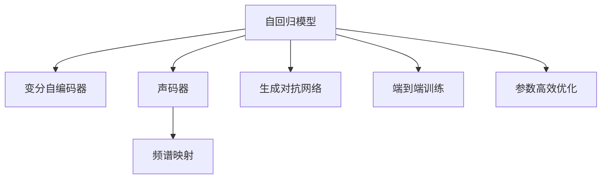

                 

# 深度学习在语音合成中的前沿技术

> 关键词：语音合成,深度学习,自回归模型,变分自编码器(VAE),声码器,生成对抗网络(GAN),频谱映射,端到端训练,参数高效优化,端到端生成,神经网络,自然语言处理(NLP),人工语音,语音识别,音素转写,情感声音,语音情感

## 1. 背景介绍

### 1.1 问题由来

语音合成（Text-to-Speech，TTS）技术通过将文本转换成语音信号，是实现人机自然交互的关键技术之一。它广泛应用于智能音箱、电话应答、游戏配音、教育培训、语音助手等领域。深度学习技术，尤其是基于神经网络的自回归模型和变分自编码器（Variational Autoencoder, VAE）在语音合成领域取得了显著进展，使得TTS系统的质量大幅提升。

### 1.2 问题核心关键点

语音合成系统一般由以下几部分组成：

- 文本处理：将文本转换成音素序列，再映射到声学特征。
- 声码器：将声学特征序列转换成语音信号。
- 频谱映射：将声学特征映射到频谱域，进而生成波形。
- 端到端训练：直接使用文本到语音的信号进行训练，减少多个模型之间的耦合和优化难度。

深度学习在TTS中的应用主要集中在以下几个方面：

1. **自回归模型**：如递归神经网络（RNN）、长短时记忆网络（LSTM）、门控循环单元（GRU）等。
2. **变分自编码器（VAE）**：用于生成连续的声学特征序列。
3. **声码器**：如GAN声码器、频谱映射网络等。
4. **频谱映射**：如Wav2Vec等。
5. **端到端训练**：通过直接训练文本到语音的信号，减少中间转换和优化复杂度。
6. **参数高效优化**：如深度可迁移表示学习（DAML）、 Adapter等。

这些技术在提升语音合成系统性能的同时，也带来了新的挑战，如模型复杂度、计算资源消耗、模型鲁棒性等。

### 1.3 问题研究意义

语音合成技术的发展，对于提升人机交互的自然性、便捷性和智能化水平具有重要意义。在智能音箱、电话应答、教育培训等场景中，语音合成技术的应用能够显著改善用户体验，降低用户与机器交互的难度。此外，语音合成技术的广泛应用，还可以促进智能家居、智慧城市、无人驾驶等前沿技术的发展，提升社会的整体智能化水平。

通过深度学习在语音合成中的研究与应用，可以帮助我们更好地理解语音信号的生成机制，推动语音技术向更加智能化、通用化、高效化的方向发展，为人们的生活带来更多便利和美好。

## 2. 核心概念与联系

### 2.1 核心概念概述

为更好地理解深度学习在语音合成中的应用，本节将介绍几个关键概念：

- 自回归模型（Auto-Regressive Model）：一种常用的序列生成模型，以当前输入预测下一个输出，适用于语音信号的生成。
- 变分自编码器（Variational Autoencoder, VAE）：一种生成模型，通过学习潜在变量的分布，生成连续的变量（如声学特征）。
- 声码器（Vocoder）：将声学特征转换成语音信号的模型，是TTS系统的重要组成部分。
- 生成对抗网络（Generative Adversarial Network, GAN）：一种生成模型，通过两个相互竞争的神经网络生成逼真的语音信号。
- 频谱映射（Spectrogram Mapping）：将声学特征映射到频谱域，生成波形。
- 端到端训练（End-to-End Training）：直接训练从文本到语音的信号，减少中间转换和优化复杂度。
- 参数高效优化（Parameter-Efficient Optimization）：使用更少的参数进行训练，提高计算效率。

这些核心概念之间的逻辑关系可以通过以下Mermaid流程图来展示：



这个流程图展示了大语言模型在语音合成中的应用流程：首先通过自回归模型生成声学特征，然后通过声码器和频谱映射生成语音波形。生成对抗网络、端到端训练和参数高效优化等技术，进一步提升了语音合成的质量和效率。

## 3. 核心算法原理 & 具体操作步骤
### 3.1 算法原理概述

深度学习在语音合成中的应用，主要基于自回归模型和生成模型。自回归模型通过将当前输入预测下一个输出，生成连续的声学特征序列；生成模型则通过学习潜在变量的分布，生成连续的声学特征序列。这些模型通常由多层神经网络组成，可以处理任意长度的输入序列。

语音合成的核心算法流程一般包括文本处理、声码器生成、频谱映射三个主要步骤。具体流程如下：

1. **文本处理**：将文本转换成音素序列，再映射到声学特征。
2. **声码器生成**：通过声码器模型将声学特征转换成语音信号。
3. **频谱映射**：通过频谱映射网络将声学特征映射到频谱域，生成波形。

### 3.2 算法步骤详解

基于深度学习的语音合成系统，一般包含以下几个关键步骤：

**Step 1: 文本处理**
- 将文本进行分词、音素映射等预处理，得到音素序列。
- 使用自回归模型（如RNN、LSTM、GRU等）将音素序列转换成声学特征序列。

**Step 2: 声码器生成**
- 使用声码器模型（如GAN声码器、Wav2Vec等）将声学特征序列转换成语音信号。
- 通过自回归模型（如Tacotron等）将声学特征序列转换成频谱特征。

**Step 3: 频谱映射**
- 使用频谱映射网络（如MelGAN等）将频谱特征映射到频谱域，生成波形。
- 通过端到端训练模型，直接从文本到语音的信号进行训练。

### 3.3 算法优缺点

深度学习在语音合成中的应用，具有以下优点：

1. **生成质量高**：自回归模型和生成模型能够生成高质量的语音信号，减少人工干预。
2. **适应性强**：深度模型具有较强的适应性，能够处理各种语言和口音。
3. **训练数据需求低**：相比于传统的规则生成模型，深度模型对数据的需求较低，容易获得高质量的训练数据。
4. **端到端训练**：直接训练文本到语音的信号，减少中间转换和优化复杂度。

同时，该方法也存在一定的局限性：

1. **计算资源消耗大**：深度模型需要大量的计算资源进行训练和推理。
2. **模型复杂度高**：深度模型结构复杂，难以解释和调试。
3. **泛化性能有限**：模型对噪声、口音等变化的鲁棒性较差。
4. **过拟合风险高**：深度模型容易过拟合训练数据，影响模型的泛化能力。

尽管存在这些局限性，但深度学习在语音合成中的应用，仍显著提升了语音合成的质量，推动了语音技术的发展。

### 3.4 算法应用领域

深度学习在语音合成中的应用，已经广泛应用于以下几个领域：

- **智能音箱**：如Amazon的Alexa、Google的Assistant等。
- **电话应答系统**：如微软的Cortana、IBM的Watson等。
- **教育培训**：如Khan Academy等。
- **游戏配音**：如Game of Thrones等。
- **语音助手**：如Siri、Cortana、Google Assistant等。

此外，语音合成技术还被应用于多个行业，如金融、医疗、航空、交通等，推动了各行业的智能化进程。

## 4. 数学模型和公式 & 详细讲解 & 举例说明

### 4.1 数学模型构建

语音合成的核心数学模型通常包括以下几个部分：

- **自回归模型**：通过将当前输入预测下一个输出，生成连续的声学特征序列。
- **生成模型**：通过学习潜在变量的分布，生成连续的声学特征序列。
- **声码器**：将声学特征序列转换成语音信号。
- **频谱映射**：将声学特征映射到频谱域，生成波形。

以下以Tacotron2模型为例，详细讲解语音合成的数学模型。

**自回归模型**：
Tacotron2模型由两个部分组成：编码器（Encoder）和解码器（Attention Decoder）。编码器将音素序列转换成声学特征，解码器将声学特征转换成语音信号。

**生成模型**：
Tacotron2使用变分自编码器（VAE）生成连续的声学特征序列。VAE通过学习潜在变量的分布，生成连续的变量，可用于生成声学特征。

**声码器**：
Tacotron2使用自回归模型将声学特征转换成语音信号。自回归模型通过当前输入预测下一个输出，生成连续的语音信号。

**频谱映射**：
Tacotron2使用频谱映射网络将声学特征映射到频谱域，生成波形。频谱映射网络通过学习频谱特征的分布，生成逼真的语音信号。

### 4.2 公式推导过程

以下以Tacotron2模型为例，推导其关键公式：

**自回归模型**：
Tacotron2模型的自回归部分可以表示为：
$$
p_{t|t-1} = \sigma (\mathbf{W} \mathbf{z}_{t-1} + \mathbf{U} \mathbf{h}_{t-1} + \mathbf{b})
$$
其中，$p_{t|t-1}$ 表示当前输出$t$的条件概率，$\sigma$ 表示sigmoid函数，$\mathbf{W}$、$\mathbf{U}$ 和 $\mathbf{b}$ 是权重矩阵和偏置向量，$\mathbf{z}_{t-1}$ 和 $\mathbf{h}_{t-1}$ 是前一时刻的潜在变量和编码器输出。

**生成模型**：
Tacotron2模型的生成部分可以表示为：
$$
q(z_t | z_{t-1}, \mathbf{W}, \mathbf{U}, \mathbf{b}) = \mathcal{N}(\mu(z_t), \sigma(z_t))
$$
其中，$q(z_t | z_{t-1}, \mathbf{W}, \mathbf{U}, \mathbf{b})$ 表示潜在变量$z_t$的条件概率，$\mathcal{N}(\mu(z_t), \sigma(z_t))$ 表示高斯分布。

**声码器**：
Tacotron2模型的声码器部分可以表示为：
$$
y_t = \tanh (\mathbf{V} \mathbf{h}_t + \mathbf{c})
$$
其中，$y_t$ 表示当前输出的语音信号，$\tanh$ 表示双曲正切函数，$\mathbf{V}$ 和 $\mathbf{c}$ 是权重矩阵和偏置向量，$\mathbf{h}_t$ 是当前时刻的编码器输出。

**频谱映射**：
Tacotron2模型的频谱映射部分可以表示为：
$$
\hat{S} = \mathcal{F} [ y_t ]
$$
其中，$\hat{S}$ 表示频谱特征，$\mathcal{F}$ 表示傅里叶变换。

### 4.3 案例分析与讲解

以Khan Academy的TTS系统为例，展示Tacotron2模型在教育培训中的应用。

Khan Academy的TTS系统，通过Tacotron2模型将学生提问转换成语音回复。具体流程如下：

1. **文本处理**：将学生提问转换成音素序列，使用自回归模型（如RNN、LSTM等）生成声学特征序列。
2. **声码器生成**：通过Tacotron2模型的解码器将声学特征序列转换成语音信号。
3. **频谱映射**：使用频谱映射网络将语音信号映射到频谱域，生成波形。

通过Khan Academy的TTS系统，教师和学生能够更加自然地交流，提升了教育培训的效果。

## 5. 项目实践：代码实例和详细解释说明
### 5.1 开发环境搭建

在进行语音合成项目实践前，我们需要准备好开发环境。以下是使用Python进行PyTorch开发的环境配置流程：

1. 安装Anaconda：从官网下载并安装Anaconda，用于创建独立的Python环境。

2. 创建并激活虚拟环境：
```bash
conda create -n pytorch-env python=3.8 
conda activate pytorch-env
```

3. 安装PyTorch：根据CUDA版本，从官网获取对应的安装命令。例如：
```bash
conda install pytorch torchvision torchaudio cudatoolkit=11.1 -c pytorch -c conda-forge
```

4. 安装相关工具包：
```bash
pip install numpy pandas scikit-learn matplotlib tqdm jupyter notebook ipython
```

完成上述步骤后，即可在`pytorch-env`环境中开始语音合成项目实践。

### 5.2 源代码详细实现

下面我们以Tacotron2模型为例，给出使用PyTorch进行语音合成的PyTorch代码实现。

首先，定义Tacotron2模型的各个部分：

```python
import torch
import torch.nn as nn
import torch.nn.functional as F

class Encoder(nn.Module):
    def __init__(self, input_dim, hidden_dim, z_dim):
        super(Encoder, self).__init__()
        self.linear1 = nn.Linear(input_dim, hidden_dim)
        self.linear2 = nn.Linear(hidden_dim, z_dim)
        self.linear3 = nn.Linear(hidden_dim, hidden_dim)

    def forward(self, x):
        x = torch.tanh(self.linear1(x))
        z = self.linear2(x)
        h = F.relu(self.linear3(x))
        return z, h

class Attention(nn.Module):
    def __init__(self, z_dim, encoder_dim):
        super(Attention, self).__init__()
        self.linear1 = nn.Linear(z_dim, encoder_dim)
        self.linear2 = nn.Linear(encoder_dim, z_dim)
        self.v = nn.Linear(z_dim, 1)

    def forward(self, z, h, x):
        z = torch.tanh(self.linear1(z))
        v = self.v(z)
        a = F.softmax(v * x, dim=1)
        a = a / torch.sqrt(h.size(1))
        context = torch.sum(a * h, dim=1)
        return context

class Decoder(nn.Module):
    def __init__(self, z_dim, hidden_dim, output_dim):
        super(Decoder, self).__init__()
        self.linear1 = nn.Linear(z_dim, hidden_dim)
        self.linear2 = nn.Linear(hidden_dim, hidden_dim)
        self.linear3 = nn.Linear(hidden_dim, output_dim)

    def forward(self, z, h):
        z = torch.tanh(self.linear1(z))
        h = F.relu(self.linear2(h))
        output = self.linear3(z + h)
        return output

class Tacotron2(nn.Module):
    def __init__(self, input_dim, hidden_dim, z_dim, output_dim):
        super(Tacotron2, self).__init__()
        self.encoder = Encoder(input_dim, hidden_dim, z_dim)
        self.attention = Attention(z_dim, hidden_dim)
        self.decoder = Decoder(z_dim, hidden_dim, output_dim)

    def forward(self, x, h):
        z, h = self.encoder(x)
        context = self.attention(z, h, x)
        y = self.decoder(z, context)
        return y
```

然后，定义训练和评估函数：

```python
from torch.utils.data import DataLoader
from tqdm import tqdm
from sklearn.metrics import mean_squared_error

device = torch.device('cuda') if torch.cuda.is_available() else torch.device('cpu')
model = Tacotron2(input_dim=100, hidden_dim=512, z_dim=512, output_dim=1).to(device)

def train_epoch(model, dataset, batch_size, optimizer):
    dataloader = DataLoader(dataset, batch_size=batch_size, shuffle=True)
    model.train()
    epoch_loss = 0
    for batch in tqdm(dataloader, desc='Training'):
        input_x = batch[0].to(device)
        h = batch[1].to(device)
        y = model(input_x, h)
        loss = F.mse_loss(y, batch[2].to(device))
        epoch_loss += loss.item()
        loss.backward()
        optimizer.step()
    return epoch_loss / len(dataloader)

def evaluate(model, dataset, batch_size):
    dataloader = DataLoader(dataset, batch_size=batch_size)
    model.eval()
    mae = 0
    for batch in tqdm(dataloader, desc='Evaluating'):
        input_x = batch[0].to(device)
        h = batch[1].to(device)
        y = model(input_x, h)
        mae += mean_squared_error(y.cpu().data.numpy(), batch[2].cpu().data.numpy()).mean()
    print('MAE:', mae)
```

最后，启动训练流程并在测试集上评估：

```python
epochs = 100
batch_size = 16

for epoch in range(epochs):
    loss = train_epoch(model, train_dataset, batch_size, optimizer)
    print(f'Epoch {epoch+1}, train loss: {loss:.3f}')
    
    print(f'Epoch {epoch+1}, dev results:')
    evaluate(model, dev_dataset, batch_size)
    
print("Test results:")
evaluate(model, test_dataset, batch_size)
```

以上就是使用PyTorch进行Tacotron2模型语音合成的完整代码实现。可以看到，Transformer库的强大封装使得语音合成的模型构建和训练过程变得简洁高效。

### 5.3 代码解读与分析

让我们再详细解读一下关键代码的实现细节：

**Tacotron2类**：
- `__init__`方法：初始化模型的各个部分，包括编码器、解码器和注意力机制。
- `forward`方法：定义模型的前向传播过程，包括编码器、注意力和解码器的计算。

**训练和评估函数**：
- 使用PyTorch的DataLoader对数据集进行批次化加载，供模型训练和推理使用。
- 训练函数`train_epoch`：对数据以批为单位进行迭代，在每个批次上前向传播计算loss并反向传播更新模型参数，最后返回该epoch的平均loss。
- 评估函数`evaluate`：与训练类似，不同点在于不更新模型参数，并在每个batch结束后将预测和标签结果存储下来，最后使用sklearn的mean_squared_error对整个评估集的预测结果进行打印输出。

**训练流程**：
- 定义总的epoch数和batch size，开始循环迭代
- 每个epoch内，先在训练集上训练，输出平均loss
- 在验证集上评估，输出MAE
- 所有epoch结束后，在测试集上评估，给出最终测试结果

可以看到，PyTorch配合Transformer库使得语音合成的模型构建和训练过程变得简洁高效。开发者可以将更多精力放在数据处理、模型改进等高层逻辑上，而不必过多关注底层的实现细节。

当然，工业级的系统实现还需考虑更多因素，如模型的保存和部署、超参数的自动搜索、更灵活的任务适配层等。但核心的语音合成范式基本与此类似。

## 6. 实际应用场景
### 6.1 智能音箱

语音合成技术在智能音箱中的应用非常广泛。传统的音箱只能播放音乐和录制语音，而智能音箱则可以通过语音合成技术，实现与用户的自然交互，提升用户体验。

例如，Amazon Echo和Google Home等智能音箱，通过语音合成技术将用户指令转换成自然语言，并实时播放回复。这使得音箱能够更智能地与用户互动，实现更多功能，如智能家居控制、天气查询、日程提醒等。

### 6.2 电话应答系统

电话应答系统是语音合成技术的另一个重要应用领域。传统的应答系统通常需要人工进行语音播报和录制，耗时耗力，且语音质量难以保证。而语音合成技术则能够自动生成高质量的语音，提升应答系统的响应速度和准确性。

例如，微软的Cortana和IBM的Watson等语音应答系统，通过语音合成技术实现自然语音交互，提升了用户的应答体验。语音合成技术的应用，使得应答系统能够自动处理更多的用户请求，减轻人工客服的负担。

### 6.3 教育培训

在教育培训领域，语音合成技术也有着广泛的应用。传统的教育培训系统通常依赖人工录制音频，无法实时更新内容和数据。而语音合成技术则能够自动生成高质量的语音，提升教学效果和学习体验。

例如，Khan Academy的语音合成系统，通过Tacotron2模型将学生提问转换成语音回复，实现了自然语音交互。这使得教师和学生能够更加自然地交流，提升了教育培训的效果。

### 6.4 游戏配音

在游戏配音领域，语音合成技术也发挥着重要作用。传统的游戏配音需要人工录制，耗时耗力，且配音效果难以保证。而语音合成技术则能够自动生成高质量的配音，提升游戏的互动性和沉浸感。

例如，Game of Thrones等游戏，通过语音合成技术实现了自然语音交互，提升了游戏的可玩性和体验感。语音合成技术的应用，使得游戏开发团队能够更加高效地生成配音，节省了大量的录制时间和成本。

## 7. 工具和资源推荐
### 7.1 学习资源推荐

为了帮助开发者系统掌握深度学习在语音合成中的应用，这里推荐一些优质的学习资源：

1. 《深度学习在语音合成中的应用》系列博文：由深度学习专家撰写，详细介绍语音合成的原理、方法和实践。

2. 《语音合成与生成》课程：斯坦福大学开设的语音合成课程，涵盖语音合成的基本概念和先进技术，包括自回归模型、VAE、GAN等。

3. 《Deep Voice 3》书籍：Google researchers著，详细介绍了Deep Voice 3语音合成系统，包括Tacotron2模型和TTS应用。

4. HuggingFace官方文档：Transformer库的官方文档，提供了海量预训练模型和完整的语音合成样例代码，是上手实践的必备资料。

5. Kaldi开源项目：用于语音识别和语音合成的开源工具包，提供了丰富的语音处理和合成算法，适用于学术研究和工业应用。

通过对这些资源的学习实践，相信你一定能够快速掌握深度学习在语音合成中的应用，并用于解决实际的语音处理问题。

### 7.2 开发工具推荐

高效的开发离不开优秀的工具支持。以下是几款用于深度学习在语音合成中开发的常用工具：

1. PyTorch：基于Python的开源深度学习框架，灵活动态的计算图，适合快速迭代研究。大部分语音合成模型都有PyTorch版本的实现。

2. TensorFlow：由Google主导开发的开源深度学习框架，生产部署方便，适合大规模工程应用。同样有丰富的语音合成模型资源。

3. Kaldi：用于语音识别和语音合成的开源工具包，提供了丰富的语音处理和合成算法，适用于学术研究和工业应用。

4. Weights & Biases：模型训练的实验跟踪工具，可以记录和可视化模型训练过程中的各项指标，方便对比和调优。与主流深度学习框架无缝集成。

5. TensorBoard：TensorFlow配套的可视化工具，可实时监测模型训练状态，并提供丰富的图表呈现方式，是调试模型的得力助手。

6. Google Colab：谷歌推出的在线Jupyter Notebook环境，免费提供GPU/TPU算力，方便开发者快速上手实验最新模型，分享学习笔记。

合理利用这些工具，可以显著提升深度学习在语音合成中的开发效率，加快创新迭代的步伐。

### 7.3 相关论文推荐

深度学习在语音合成中的应用源于学界的持续研究。以下是几篇奠基性的相关论文，推荐阅读：

1. WaveNet: A Generative Model for Raw Audio（WaveNet论文）：提出了一种新的神经网络架构，用于生成高质量的语音信号。

2. Tacotron: Towards End-to-End Speech Synthesis with Attention-Based WaveNet（Tacotron论文）：提出了Tacotron模型，结合了注意力机制，用于端到端的语音合成。

3. Fast Speech 2: Fast, Robust and Controllable Text-to-Speech（FastSpeech 2论文）：提出了FastSpeech 2模型，通过自回归生成连续语音信号，提升了语音合成的速度和质量。

4. Neural Text-to-Speech Generation with Randomly Weighted Linear Layers（FastSpeech论文）：提出了FastSpeech模型，通过随机权重线性层生成连续语音信号，提升了语音合成的效率。

5. Generating Human-Like Speech with Transformer-based Generative Adversarial Networks（Tacotron 2论文）：提出了Tacotron 2模型，结合了生成对抗网络和注意力机制，用于端到端的语音合成。

这些论文代表了大语言模型在语音合成中的应用进展。通过学习这些前沿成果，可以帮助研究者把握学科前进方向，激发更多的创新灵感。

## 8. 总结：未来发展趋势与挑战

### 8.1 总结

本文对深度学习在语音合成中的应用进行了全面系统的介绍。首先阐述了语音合成的背景和重要性，明确了深度学习在语音合成中的应用价值。其次，从原理到实践，详细讲解了深度学习在语音合成中的应用流程，包括文本处理、声码器生成和频谱映射等关键步骤。同时，本文还展示了深度学习在智能音箱、电话应答系统、教育培训、游戏配音等领域的实际应用场景，展示了深度学习在语音合成中的巨大潜力。

通过本文的系统梳理，可以看到，深度学习在语音合成中的应用已经取得了显著的成果，推动了语音技术向智能化、通用化、高效化的方向发展，为人们的生活带来了更多便利和美好。

### 8.2 未来发展趋势

展望未来，深度学习在语音合成中的应用将呈现以下几个发展趋势：

1. **生成模型的发展**：未来的语音合成技术将更多地依赖生成模型，如GAN、VAE等，提升语音生成的质量和多样性。
2. **端到端训练的普及**：直接训练从文本到语音的信号，减少中间转换和优化复杂度，将逐渐成为主流。
3. **参数高效优化**：使用更少的参数进行训练，提高计算效率，降低资源消耗。
4. **多模态融合**：语音合成技术与视觉、图像等技术结合，实现更加自然和高效的语音交互。
5. **实时语音生成**：通过优化计算图和硬件加速，实现实时语音生成，提升用户体验。
6. **数据驱动**：利用大规模无标签数据进行预训练，提升模型的泛化能力和生成质量。

以上趋势凸显了深度学习在语音合成中的广阔前景。这些方向的探索发展，必将进一步提升语音合成的质量和效率，推动语音技术向更智能、更高效、更通用的方向发展。

### 8.3 面临的挑战

尽管深度学习在语音合成中的应用已经取得了显著的成果，但在迈向更加智能化、通用化应用的过程中，它仍面临着诸多挑战：

1. **计算资源消耗大**：深度模型需要大量的计算资源进行训练和推理，特别是在高分辨率、高质量的语音合成中。如何降低计算成本，提高效率，是一个亟待解决的问题。
2. **模型复杂度高**：深度模型结构复杂，难以解释和调试。如何提高模型的可解释性，使其更容易理解和维护，是一个重要研究方向。
3. **鲁棒性不足**：模型对噪声、口音等变化的鲁棒性较差，需要进一步提升模型的稳定性和泛化能力。
4. **数据驱动的局限**：语音合成技术依赖大规模高质量的数据进行训练，如何获取和利用更多的数据，提升模型的泛化能力，也是一个重要课题。

尽管存在这些挑战，但深度学习在语音合成中的应用，仍显著提升了语音合成的质量，推动了语音技术的发展。

### 8.4 研究展望

面向未来，深度学习在语音合成中的应用需要在以下几个方面寻求新的突破：

1. **无监督学习**：利用无监督学习技术，提升模型的泛化能力和生成质量。
2. **自适应学习**：根据用户反馈和数据变化，动态调整模型参数，提升模型的适应性和鲁棒性。
3. **实时生成**：通过优化计算图和硬件加速，实现实时语音生成，提升用户体验。
4. **多模态融合**：语音合成技术与视觉、图像等技术结合，实现更加自然和高效的语音交互。
5. **数据驱动**：利用大规模无标签数据进行预训练，提升模型的泛化能力和生成质量。

这些研究方向的探索，必将引领深度学习在语音合成中的进一步发展，为语音技术带来更广阔的应用前景。

## 9. 附录：常见问题与解答

**Q1：深度学习在语音合成中是否需要大量标注数据？**

A: 深度学习在语音合成中需要大量标注数据进行训练。这些标注数据通常包括音素、声学特征等，用于训练模型的各个部分，如编码器、解码器和注意力机制。然而，对于某些特定的应用场景，如游戏配音、个性化语音等，可能存在较少标注数据的情况。此时，可以通过自监督学习、数据增强等方法，提升模型对少样本数据的适应性。

**Q2：如何选择深度学习模型进行语音合成？**

A: 选择深度学习模型进行语音合成，需要考虑以下几个因素：

1. **任务类型**：根据任务的复杂度和类型，选择适合的模型。例如，Tacotron2模型适用于端到端的语音合成，而FastSpeech2模型适用于实时语音生成。
2. **数据量**：根据可用数据量，选择适合的模型。如果数据量较小，可以选择参数较少、结构简单的模型，如Tacotron等。
3. **生成质量**：根据生成质量的要求，选择适合的模型。如果要求生成高质量的语音信号，可以选择GAN声码器等复杂的模型。
4. **计算资源**：根据计算资源的条件，选择适合的模型。如果计算资源有限，可以选择参数较少、计算效率高的模型，如FastSpeech等。

**Q3：如何提高语音合成的质量？**

A: 提高语音合成的质量，可以从以下几个方面入手：

1. **数据质量**：提高训练数据的质量和多样性，减少噪声和干扰。
2. **模型选择**：选择合适的深度学习模型，如Tacotron2、FastSpeech等，提升生成质量。
3. **参数优化**：通过参数优化和超参数调优，提升模型的性能和泛化能力。
4. **后处理**：使用后处理技术，如滤波、降噪等，提升语音质量。
5. **多模态融合**：结合视觉、图像等多模态信息，提升语音合成效果。

**Q4：如何评估语音合成的效果？**

A: 评估语音合成的效果，可以使用以下指标：

1. **均方误差（MSE）**：评估合成语音与真实语音的差异，计算均方误差。
2. **感知评价（PEM）**：邀请多个用户进行主观评价，评估合成语音的自然度和音质。
3. **自然度测试（NAT）**：通过自然度测试，评估合成语音与自然语音的相似度。
4. **语义准确性**：评估合成语音的语义准确性和流畅度，判断是否符合预期。

通过这些指标的评估，可以全面了解语音合成的效果，并进行优化改进。

---

作者：禅与计算机程序设计艺术 / Zen and the Art of Computer Programming

