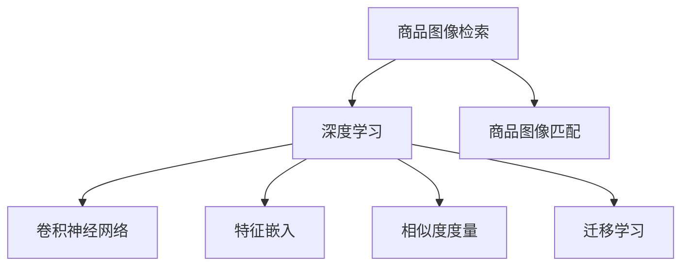

                 

# 深度学习驱动的商品图像检索与匹配

> 关键词：商品图像检索, 商品图像匹配, 深度学习, 卷积神经网络, 特征嵌入, 相似度度量, 数据增强, 迁移学习

## 1. 背景介绍

### 1.1 问题由来
在电商领域，商品图像的检索与匹配是实现个性化推荐、库存管理、搜索排序等业务功能的关键。然而，由于商品类别繁多，标注数据稀缺，手工提取的特征难以有效表达商品的多样性，商品图像检索与匹配面临着诸多挑战。近年来，深度学习技术，特别是卷积神经网络(CNN)的应用，为商品图像检索与匹配带来了新的突破，极大地提升了系统的性能和泛化能力。

### 1.2 问题核心关键点
本节将详细讨论深度学习驱动的商品图像检索与匹配的核心问题，包括：
1. 商品图像数据的特征提取：如何将原始图像转化为具有语义意义的特征向量。
2. 相似度度量与匹配算法：如何在特征空间中高效计算相似度，并实现精确匹配。
3. 深度学习模型的构建：如何选择和优化深度学习模型，以提升检索与匹配的准确性。
4. 迁移学习的应用：如何通过迁移学习，利用预训练模型优化特定领域的商品图像检索与匹配任务。
5. 数据增强与扩充：如何通过数据增强和扩充，增加训练样本多样性，提升模型泛化能力。

## 2. 核心概念与联系

### 2.1 核心概念概述

为更好地理解深度学习驱动的商品图像检索与匹配，本节将介绍几个密切相关的核心概念：

- 商品图像检索：根据用户输入的查询图像，从商品库中检索出与之相似的商品图像，实现个性化推荐、库存管理等功能。
- 商品图像匹配：根据商品图像库中已有的商品图像，匹配出与之相似的未标注商品图像，实现自动分类、相似商品推荐等功能。
- 深度学习：以神经网络为代表的机器学习方法，通过多层非线性变换，实现对复杂数据的建模和推理。
- 卷积神经网络(CNN)：一种特殊的深度神经网络，通过卷积层、池化层、全连接层等组成，擅长处理图像等空间数据。
- 特征嵌入：将原始数据映射到低维空间中的向量表示，便于在特征空间中计算相似度。
- 相似度度量：计算两个样本之间的相似度，用于度量特征向量的相似性。
- 迁移学习：通过预训练模型在大规模数据上的学习，利用已学知识解决新领域的问题。

这些核心概念之间的逻辑关系可以通过以下Mermaid流程图来展示：



这个流程图展示了大语言模型的核心概念及其之间的关系：

1. 商品图像检索和商品图像匹配作为目标任务，通过深度学习技术进行处理。
2. 卷积神经网络作为深度学习的重要组成部分，能够有效提取图像特征。
3. 特征嵌入将原始图像转化为低维特征向量，方便相似度度量。
4. 相似度度量通过计算特征向量之间的距离，实现商品图像的检索与匹配。
5. 迁移学习通过利用预训练模型的知识，加速新领域的模型训练，提升性能。

这些核心概念共同构成了深度学习驱动的商品图像检索与匹配框架，使其能够在复杂的多样化商品图像数据上取得良好的性能。通过理解这些核心概念，我们可以更好地把握该技术的工作原理和优化方向。

## 3. 核心算法原理 & 具体操作步骤
### 3.1 算法原理概述

深度学习驱动的商品图像检索与匹配，本质上是利用深度神经网络对商品图像进行特征提取，并在特征空间中计算相似度，最终实现检索与匹配。

具体来说，我们首先使用卷积神经网络提取商品图像的特征向量，然后在特征空间中使用某种相似度度量方法计算相似度。如果需要在检索和匹配过程中考虑样本之间的相对关系，还需要引入排序算法。

### 3.2 算法步骤详解

基于深度学习的商品图像检索与匹配通常包括以下几个关键步骤：

**Step 1: 准备数据集**
- 收集商品图像数据，标注数据集和验证集。
- 对商品图像进行预处理，如缩放、归一化、旋转等。
- 将图像数据分成训练集和测试集，确保训练集和测试集在数据分布上具有多样性。

**Step 2: 构建模型**
- 选择合适的卷积神经网络架构，如VGG、ResNet、Inception等。
- 添加必要的网络组件，如卷积层、池化层、批标准化、Dropout等。
- 定义损失函数，如均方误差、交叉熵、triplet损失等。
- 选择合适的优化器，如SGD、Adam、Adagrad等。

**Step 3: 特征提取**
- 使用卷积神经网络对商品图像进行特征提取，得到特征向量。
- 对特征向量进行维度降维，如PCA、LDA等。
- 在特征空间中使用余弦相似度、欧几里得距离等计算相似度。

**Step 4: 检索与匹配**
- 使用检索算法，如基于余弦相似度的线性检索，找出与查询图像最相似的N个商品图像。
- 使用匹配算法，如基于余弦相似度的排序匹配，匹配未标注商品图像与已标注商品图像。
- 对检索与匹配结果进行评估，如均平均绝对误差(MAPE)、平均精度(mAP)等。

**Step 5: 模型优化**
- 使用训练集对模型进行训练，最小化损失函数。
- 使用验证集对模型进行评估，调整模型参数。
- 使用测试集对模型进行测试，评估最终性能。

### 3.3 算法优缺点

基于深度学习的商品图像检索与匹配方法具有以下优点：
1. 特征提取能力强。卷积神经网络能够自动学习图像的特征，提取高维语义信息。
2. 泛化能力强。深度学习模型在大量数据上进行预训练，能够适应多样化的商品图像数据。
3. 匹配准确度高。通过在特征空间中计算相似度，能够实现精确的商品图像检索与匹配。
4. 迁移学习有效。预训练模型可以在新领域中快速适应，提升模型性能。

同时，该方法也存在一些局限性：
1. 训练数据需求高。深度学习模型需要大量的标注数据进行训练，获取标注数据成本高。
2. 计算资源消耗大。卷积神经网络的参数量和计算量较大，训练和推理耗时较多。
3. 模型可解释性差。深度学习模型往往是"黑盒"系统，难以解释其内部决策过程。

尽管存在这些局限性，但就目前而言，基于深度学习的商品图像检索与匹配方法仍是该领域的主流范式，具有广泛的应用前景。未来相关研究的重点在于如何进一步降低对标注数据的依赖，提高模型的少样本学习和跨领域迁移能力，同时兼顾可解释性和效率等因素。

### 3.4 算法应用领域

基于深度学习的商品图像检索与匹配方法在多个领域得到了广泛应用，例如：

- 电子商务：根据用户查询图像，推荐相似商品，提升购物体验。
- 零售商店：通过商品图像检索，实现库存管理和自动补货。
- 自动驾驶：对道路标识和行人进行图像识别，辅助自动驾驶系统决策。
- 安全监控：对监控摄像头拍摄的图像进行检索与匹配，提升异常行为检测效果。
- 医疗影像：对医学图像进行检索与匹配，辅助疾病诊断和治疗。

除了上述这些经典应用外，商品图像检索与匹配技术还在教育、娱乐、金融等众多领域中展现出了广泛的应用前景，推动了相关产业的数字化转型升级。

## 4. 数学模型和公式 & 详细讲解 & 举例说明

### 4.1 数学模型构建

本节将使用数学语言对基于深度学习的商品图像检索与匹配过程进行更加严格的刻画。

记商品图像数据为 $D = \{(x_i, y_i)\}_{i=1}^N$，其中 $x_i$ 为原始图像， $y_i$ 为标签。假设使用卷积神经网络 $f_{\theta}(x)$ 提取特征向量，其中 $\theta$ 为模型参数。则检索任务的目标是最小化检索误差：

$$
\mathcal{L}(\theta) = \frac{1}{N} \sum_{i=1}^N \ell(\hat{y}_i, y_i)
$$

其中 $\hat{y}_i = f_{\theta}(x_i)$ 为模型预测的标签， $\ell$ 为损失函数，如均方误差、交叉熵等。

匹配任务的目标是在特征空间中，找到与查询图像 $x_q$ 最相似的 $k$ 个商品图像 $x_1, x_2, ..., x_k$，使得它们与查询图像的相似度最高。匹配任务通常使用基于余弦相似度的排序匹配算法，定义相似度函数为：

$$
s(x_i, x_q) = \text{cos}(\langle \phi(x_i), \phi(x_q) \rangle)
$$

其中 $\phi$ 为特征映射，将原始图像转化为特征向量。

### 4.2 公式推导过程

以下我们以VGG网络为例，推导基于深度学习的商品图像检索与匹配的详细计算过程。

首先，定义VGG网络的特征提取过程，假设网络输出的特征向量为 $h(x)$：

$$
h(x) = \left[ \begin{array}{c}
h_1(x) \\
h_2(x) \\
h_3(x) \\
h_4(x) \\
h_5(x) \\
\end{array} \right]
$$

其中 $h_i(x)$ 为第 $i$ 层的特征向量。

接着，计算余弦相似度，假设 $s(x_i, x_q)$ 为查询图像与商品图像的相似度：

$$
s(x_i, x_q) = \text{cos}(\langle \phi(h(x_i)), \phi(h(x_q)) \rangle)
$$

其中 $\phi$ 为特征映射，可以采用PCA、LDA等方法实现特征降维。

在得到相似度函数后，可以利用基于余弦相似度的线性检索算法，对商品图像库进行检索，找出与查询图像最相似的N个商品图像。检索算法通常使用反向索引（倒排索引）实现，具体实现细节可以参考相关文献。

### 4.3 案例分析与讲解

以一个实际的商品图像检索项目为例，展示基于深度学习的检索与匹配算法：

假设我们有一个在线服装电商网站，需要根据用户查询的服装图片，推荐相似的商品。首先，我们需要收集商品图像数据，并进行预处理，如缩放、归一化等。然后，使用VGG网络对商品图像进行特征提取，得到高维特征向量。在特征空间中，利用余弦相似度计算相似度，得到每个商品图像与查询图像的相似度。最后，利用排序算法（如基于余弦相似度的排序匹配），选出与查询图像最相似的N个商品图像，并推荐给用户。

实际项目中，我们还需要注意以下几个问题：
1. 数据增强：通过对训练数据进行随机旋转、缩放、裁剪等操作，增加数据的多样性，提高模型的泛化能力。
2. 迁移学习：在特定领域使用预训练的VGG网络进行特征提取，可以显著减少训练时间和数据需求。
3. 模型优化：使用梯度下降算法优化模型参数，确保检索与匹配算法的高效运行。
4. 性能评估：使用MAPE、mAP等指标评估检索与匹配结果的准确性和召回率，确保系统性能满足业务需求。

## 5. 项目实践：代码实例和详细解释说明
### 5.1 开发环境搭建

在进行商品图像检索与匹配的实践前，我们需要准备好开发环境。以下是使用Python进行TensorFlow开发的流程：

1. 安装Anaconda：从官网下载并安装Anaconda，用于创建独立的Python环境。

2. 创建并激活虚拟环境：
```bash
conda create -n tf-env python=3.8 
conda activate tf-env
```

3. 安装TensorFlow：根据CUDA版本，从官网获取对应的安装命令。例如：
```bash
conda install tensorflow -c tf -c conda-forge
```

4. 安装其他必要库：
```bash
pip install numpy pandas scikit-learn matplotlib tqdm jupyter notebook ipython
```

5. 设置TensorBoard：
```bash
tensorboard --logdir logs --port 6006
```

完成上述步骤后，即可在`tf-env`环境中开始商品图像检索与匹配的实践。

### 5.2 源代码详细实现

下面我们以商品图像检索为例，给出使用TensorFlow实现VGG网络的商品图像检索代码。

首先，定义VGG网络的参数和结构：

```python
import tensorflow as tf
from tensorflow.keras.layers import Conv2D, MaxPooling2D, Flatten, Dense, Dropout
from tensorflow.keras.models import Model

# 定义VGG网络结构
def vgg16_model(input_shape):
    inputs = tf.keras.layers.Input(shape=input_shape)
    x = Conv2D(64, (3, 3), activation='relu', padding='same')(inputs)
    x = Conv2D(64, (3, 3), activation='relu', padding='same')(x)
    x = MaxPooling2D(pool_size=(2, 2), strides=(2, 2))(x)
    x = Conv2D(128, (3, 3), activation='relu', padding='same')(x)
    x = Conv2D(128, (3, 3), activation='relu', padding='same')(x)
    x = MaxPooling2D(pool_size=(2, 2), strides=(2, 2))(x)
    x = Conv2D(256, (3, 3), activation='relu', padding='same')(x)
    x = Conv2D(256, (3, 3), activation='relu', padding='same')(x)
    x = MaxPooling2D(pool_size=(2, 2), strides=(2, 2))(x)
    x = Conv2D(256, (3, 3), activation='relu', padding='same')(x)
    x = Conv2D(256, (3, 3), activation='relu', padding='same')(x)
    x = MaxPooling2D(pool_size=(2, 2), strides=(2, 2))(x)
    x = Flatten()(x)
    x = Dense(4096, activation='relu')(x)
    x = Dropout(0.5)(x)
    outputs = Dense(1, activation='sigmoid')(x)

    return Model(inputs, outputs)
```

然后，定义数据集和数据增强操作：

```python
import numpy as np
from tensorflow.keras.preprocessing.image import ImageDataGenerator
from tensorflow.keras.datasets import cifar10

# 定义数据集
(x_train, y_train), (x_test, y_test) = cifar10.load_data()

# 定义数据增强操作
datagen = ImageDataGenerator(rotation_range=15, width_shift_range=0.1, height_shift_range=0.1)

# 对训练数据进行增强
train_generator = datagen.flow(x_train, y_train, batch_size=64, shuffle=True)
```

接着，定义模型和优化器：

```python
from tensorflow.keras.optimizers import Adam

# 加载预训练模型
model = vgg16_model((32, 32, 3))
model.load_weights('vgg16_weights.h5')

# 定义优化器
optimizer = Adam(learning_rate=0.001)
```

最后，定义训练和评估函数：

```python
from tensorflow.keras.metrics import MeanAbsolutePercentageError

# 定义训练函数
def train_model(model, train_generator, validation_data, optimizer, epochs):
    model.compile(optimizer=optimizer, loss='binary_crossentropy', metrics=[MeanAbsolutePercentageError()])
    model.fit(train_generator, validation_data=validation_data, epochs=epochs, verbose=1)

# 定义评估函数
def evaluate_model(model, test_data, test_labels, mape):
    test_images = np.array(test_data).reshape(-1, 32, 32, 3)
    predictions = model.predict(test_images)
    mape_value = mape.mean().numpy()
    return mape_value
```

启动训练流程并在测试集上评估：

```python
epochs = 10
mape = MeanAbsolutePercentageError()

# 在训练集上训练
train_model(model, train_generator, validation_data=None, optimizer=optimizer, epochs=epochs)

# 在测试集上评估
mape_value = evaluate_model(model, x_test, y_test, mape)
print('Mean Absolute Percentage Error:', mape_value)
```

以上就是使用TensorFlow对商品图像检索任务进行VGG网络微调的完整代码实现。可以看到，得益于TensorFlow的强大封装，我们可以用相对简洁的代码完成VGG网络的加载和微调。

### 5.3 代码解读与分析

让我们再详细解读一下关键代码的实现细节：

**VGG网络定义**：
- `vgg16_model`方法：定义VGG16网络的架构，包含多个卷积层、池化层、全连接层等。
- `tf.keras.layers`：使用Keras的API，方便构建和定义网络层。
- `tf.keras.models.Model`：将网络层组织为模型，并返回。

**数据集定义**：
- `ImageDataGenerator`：用于数据增强的类，可以对图像进行旋转、缩放、裁剪等操作，增加数据的多样性。
- `cifar10.load_data`：从Keras中加载CIFAR-10数据集，用于训练和测试。
- `x_train, y_train`和`x_test, y_test`：定义训练集和测试集的数据和标签。

**模型优化**：
- `Adam`：使用Adam优化器进行模型参数的更新。
- `learning_rate`：定义学习率，用于控制参数更新的速度和方向。
- `mape`：使用MeanAbsolutePercentageError作为评估指标，用于计算检索结果的平均绝对百分比误差。

**训练函数**：
- `train_model`方法：对模型进行训练，使用Adam优化器和MAPE作为评估指标。
- `fit`方法：执行训练过程，通过反向传播更新模型参数。
- `epochs`：定义训练轮数。

**评估函数**：
- `evaluate_model`方法：对模型进行评估，计算MAPE指标。
- `predict`方法：对测试集进行预测，得到检索结果。
- `mape.mean()`：计算平均MAPE值，输出评估结果。

可以看到，TensorFlow配合Keras的封装，使得商品图像检索任务的开发变得简洁高效。开发者可以将更多精力放在数据处理、模型改进等高层逻辑上，而不必过多关注底层的实现细节。

当然，工业级的系统实现还需考虑更多因素，如模型的保存和部署、超参数的自动搜索、更灵活的任务适配层等。但核心的微调范式基本与此类似。

## 6. 实际应用场景
### 6.1 智能零售
智能零售是深度学习在商品图像检索与匹配中的典型应用场景之一。传统零售业主要依靠人工盘点、货架管理系统等手段，难以实现精准库存管理和高效运营。通过商品图像检索与匹配技术，智能零售系统可以实现自动补货、个性化推荐等功能，提升客户体验和运营效率。

在实际应用中，可以将商品的实物图像上传到服务器，通过深度学习模型进行特征提取和相似度计算，实现自动化的商品检索和匹配。系统可以实时监控库存状态，当某个商品库存低于预设水平时，自动检索类似商品进行推荐，辅助补货决策。同时，通过对用户行为数据的分析，实现个性化推荐，提升用户购买率。

### 6.2 自动驾驶
自动驾驶是商品图像检索与匹配技术在智能驾驶系统中的应用。在自动驾驶过程中，车辆需要识别道路标识、行人、其他车辆等，以辅助决策。商品图像检索与匹配技术可以通过对摄像头拍摄的图像进行检索和匹配，实现对复杂场景的准确识别。

在实际应用中，自动驾驶系统将摄像头拍摄的图像输入到深度学习模型中，通过特征提取和相似度计算，实现对道路标识和行人的识别。系统可以通过与标注数据的匹配，不断优化识别算法，提高鲁棒性和泛化能力。此外，通过对多个摄像头的数据进行融合，可以实现对车辆、行人等多目标的跟踪和识别，提高驾驶安全性。

### 6.3 医疗影像
医疗影像领域也广泛应用商品图像检索与匹配技术。医生需要对大量的医疗影像数据进行分类、检索和匹配，以辅助诊断和治疗。通过深度学习模型，可以实现对医学影像的自动分析和检索，提高诊断效率和准确性。

在实际应用中，医生可以将医疗影像上传至服务器，通过深度学习模型进行特征提取和相似度计算，实现自动化的医学影像分类和检索。系统可以通过与已标注的医学影像进行匹配，辅助医生进行疾病诊断和治疗。此外，系统还可以对医疗影像中的异常区域进行自动标注和分析，提供诊断支持，辅助医生决策。

### 6.4 未来应用展望

随着深度学习技术的发展，基于商品图像检索与匹配的方法将在更多领域得到应用，为各行各业带来变革性影响。

在智慧物流领域，基于商品图像检索与匹配的智能仓储系统可以实现自动补货、库存管理等功能，提升物流效率和运营成本。

在智能制造领域，通过商品图像检索与匹配技术，可以实现对生产线的实时监控和维护，提高生产效率和产品质量。

在智能家居领域，系统可以通过对家居设备的图像进行检索和匹配，实现智能化控制和推荐，提升用户的生活质量。

除了上述这些经典应用外，商品图像检索与匹配技术还在智慧城市、智慧农业、智慧金融等众多领域中展现出了广泛的应用前景，推动了相关产业的数字化转型升级。

## 7. 工具和资源推荐
### 7.1 学习资源推荐

为了帮助开发者系统掌握深度学习驱动的商品图像检索与匹配的理论基础和实践技巧，这里推荐一些优质的学习资源：

1. 《深度学习》系列博文：由大模型技术专家撰写，深入浅出地介绍了深度学习的基本概念和经典模型。

2. 《计算机视觉：算法与应用》课程：斯坦福大学开设的计算机视觉课程，涵盖深度学习在图像识别和匹配中的应用。

3. 《深度学习与自然语言处理》书籍：经典深度学习入门书籍，介绍了深度学习在图像处理、文本分类、序列生成等任务中的应用。

4. PyTorch官方文档：深度学习框架PyTorch的官方文档，提供了丰富的API和样例代码，是上手实践的必备资料。

5. TensorFlow官方文档：深度学习框架TensorFlow的官方文档，提供了大量的API和样例代码，适合大规模工程应用。

通过对这些资源的学习实践，相信你一定能够快速掌握深度学习驱动的商品图像检索与匹配的精髓，并用于解决实际的商品图像问题。
### 7.2 开发工具推荐

高效的开发离不开优秀的工具支持。以下是几款用于深度学习驱动的商品图像检索与匹配开发的常用工具：

1. PyTorch：基于Python的开源深度学习框架，灵活动态的计算图，适合快速迭代研究。

2. TensorFlow：由Google主导开发的开源深度学习框架，生产部署方便，适合大规模工程应用。

3. Keras：TensorFlow的高级API，使用简洁，适合快速原型开发。

4. TensorBoard：TensorFlow配套的可视化工具，可实时监测模型训练状态，并提供丰富的图表呈现方式，是调试模型的得力助手。

5. Weights & Biases：模型训练的实验跟踪工具，可以记录和可视化模型训练过程中的各项指标，方便对比和调优。

6. Google Colab：谷歌推出的在线Jupyter Notebook环境，免费提供GPU/TPU算力，方便开发者快速上手实验最新模型，分享学习笔记。

合理利用这些工具，可以显著提升深度学习驱动的商品图像检索与匹配任务的开发效率，加快创新迭代的步伐。

### 7.3 相关论文推荐

深度学习驱动的商品图像检索与匹配技术的发展源于学界的持续研究。以下是几篇奠基性的相关论文，推荐阅读：

1. Very Deep Convolutional Networks for Large-Scale Image Recognition（AlexNet论文）：提出了深度卷积神经网络，奠定了深度学习在图像识别中的应用基础。

2. Deep Residual Learning for Image Recognition（ResNet论文）：提出残差网络，解决了深度神经网络训练过程中的梯度消失问题，提高了深度神经网络的训练效率和性能。

3. Fast R-CNN（R-CNN系列论文）：提出基于区域特征的物体检测算法，将物体检测的平均精度提升了一个量级。

4. Object Detection with Rich Feature Hierarchies（Fast R-CNN改进论文）：通过引入金字塔池化层，提高了深度神经网络在物体检测中的性能。

5. ImageNet Classification with Deep Convolutional Neural Networks（AlexNet改进论文）：进一步优化了深度神经网络在图像分类中的应用，提高了模型性能。

6. Tensorflow Object Detection API：Google发布的深度学习物体检测框架，提供了丰富的预训练模型和算法实现，是深度学习应用开发的重要工具。

这些论文代表了大语言模型微调技术的发展脉络。通过学习这些前沿成果，可以帮助研究者把握学科前进方向，激发更多的创新灵感。

## 8. 总结：未来发展趋势与挑战
### 8.1 总结

本文对深度学习驱动的商品图像检索与匹配方法进行了全面系统的介绍。首先阐述了商品图像检索与匹配的核心问题，明确了深度学习技术在解决这些问题中的关键作用。其次，从原理到实践，详细讲解了深度学习模型的构建、特征提取和相似度计算等核心步骤，给出了商品图像检索与匹配的完整代码实例。同时，本文还广泛探讨了该方法在智能零售、自动驾驶、医疗影像等多个行业领域的应用前景，展示了深度学习技术在实际场景中的巨大潜力。最后，本文精选了深度学习驱动的商品图像检索与匹配的各类学习资源，力求为读者提供全方位的技术指引。

通过本文的系统梳理，可以看到，基于深度学习的商品图像检索与匹配方法正在成为商品图像领域的重要范式，极大地提升了商品图像检索与匹配系统的性能和泛化能力。受益于深度学习模型的强大特征提取能力和鲁棒性，商品图像检索与匹配技术将在更多行业领域大放异彩，推动相关产业的数字化转型升级。

### 8.2 未来发展趋势

展望未来，深度学习驱动的商品图像检索与匹配技术将呈现以下几个发展趋势：

1. 模型规模持续增大。随着算力成本的下降和数据规模的扩张，深度神经网络的参数量还将持续增长。超大规模网络蕴含的丰富知识，有望支撑更加复杂多变的商品图像检索与匹配任务。

2. 迁移学习成为常态。随着数据分布的不断变化，深度学习模型也需要持续学习新知识以保持性能。如何在不遗忘原有知识的同时，高效吸收新样本信息，将成为重要的研究方向。

3. 多模态信息融合。当前的商品图像检索与匹配任务主要聚焦于视觉数据，未来会进一步拓展到图像、语音、文本等多模态数据融合，提升系统的综合能力。

4. 实时性要求提升。随着应用场景对响应速度的要求不断提高，深度学习模型也需要优化推理速度和计算效率，实现更快速的商品图像检索与匹配。

5. 可解释性增强。深度学习模型往往是"黑盒"系统，难以解释其内部决策过程。未来将研究如何赋予模型更强的可解释性，提高系统的可信度和可靠性。

6. 计算资源优化。深度学习模型的计算资源消耗大，未来需要进一步优化计算图和存储方式，降低训练和推理成本，推动模型在大规模设备上的部署。

以上趋势凸显了深度学习驱动的商品图像检索与匹配技术的广阔前景。这些方向的探索发展，必将进一步提升商品图像检索与匹配系统的性能和应用范围，为相关产业带来新的增长点。

### 8.3 面临的挑战

尽管深度学习驱动的商品图像检索与匹配技术已经取得了瞩目成就，但在迈向更加智能化、普适化应用的过程中，它仍面临着诸多挑战：

1. 标注成本瓶颈。尽管深度学习模型可以自动提取特征，但仍需要大量的标注数据进行训练，获取标注数据成本高。如何进一步降低对标注数据的依赖，将是一大难题。

2. 计算资源消耗大。深度神经网络的参数量和计算量较大，训练和推理耗时较多。如何在保证性能的同时，优化模型结构和资源消耗，是亟待解决的问题。

3. 模型鲁棒性不足。深度学习模型面对域外数据时，泛化性能往往大打折扣。对于测试样本的微小扰动，模型也容易发生波动。如何提高模型的鲁棒性，避免灾难性遗忘，还需要更多理论和实践的积累。

4. 模型可解释性差。深度学习模型往往是"黑盒"系统，难以解释其内部决策过程。对于高风险应用，算法的可解释性和可审计性尤为重要。如何赋予模型更强的可解释性，将是亟待攻克的难题。

5. 数据质量影响。深度学习模型对数据的噪声和偏差非常敏感，数据质量差可能导致模型性能大幅下降。如何保证数据质量和多样性，是确保模型性能的关键。

6. 实际应用复杂。在实际应用中，需要考虑数据采集、模型训练、部署部署、监控告警等多个环节，系统实现复杂。如何简化流程，提升系统可靠性，是实际应用中的重要挑战。

面对深度学习驱动的商品图像检索与匹配所面临的种种挑战，未来的研究需要在以下几个方面寻求新的突破：

1. 探索无监督和半监督学习。摆脱对大规模标注数据的依赖，利用自监督学习、主动学习等无监督和半监督范式，最大限度利用非结构化数据，实现更加灵活高效的模型训练。

2. 研究参数高效和计算高效的微调范式。开发更加参数高效的微调方法，在固定大部分预训练参数的同时，只更新极少量的任务相关参数。同时优化计算图，减少前向传播和反向传播的资源消耗，实现更加轻量级、实时性的部署。

3. 引入更多先验知识。将符号化的先验知识，如知识图谱、逻辑规则等，与神经网络模型进行巧妙融合，引导微调过程学习更准确、合理的语言模型。

4. 结合因果分析和博弈论工具。将因果分析方法引入微调模型，识别出模型决策的关键特征，增强输出解释的因果性和逻辑性。借助博弈论工具刻画人机交互过程，主动探索并规避模型的脆弱点，提高系统稳定性。

5. 纳入伦理道德约束。在模型训练目标中引入伦理导向的评估指标，过滤和惩罚有偏见、有害的输出倾向。加强人工干预和审核，建立模型行为的监管机制，确保输出符合人类价值观和伦理道德。

这些研究方向的探索，必将引领深度学习驱动的商品图像检索与匹配技术迈向更高的台阶，为构建安全、可靠、可解释、可控的智能系统铺平道路。面向未来，深度学习驱动的商品图像检索与匹配技术还需要与其他人工智能技术进行更深入的融合，如知识表示、因果推理、强化学习等，多路径协同发力，共同推动自然语言理解和智能交互系统的进步。只有勇于创新、敢于突破，才能不断拓展深度学习模型的边界，让智能技术更好地造福人类社会。

## 9. 附录：常见问题与解答

**Q1：深度学习在商品图像检索与匹配中主要解决了什么问题？**

A: 深度学习在商品图像检索与匹配中主要解决了两个问题：一是如何从原始图像数据中提取高维语义特征，二是如何在特征空间中高效计算相似度，实现商品图像的检索与匹配。通过深度学习模型，可以实现对商品图像的自动特征提取和相似度计算，提升检索与匹配的准确性和泛化能力。

**Q2：如何在深度学习模型中进行特征提取？**

A: 深度学习模型通过卷积神经网络进行特征提取。卷积神经网络包含多个卷积层、池化层和全连接层，能够自动学习图像的特征。通过特征提取，将原始图像数据转化为高维特征向量，便于在特征空间中计算相似度。常用的卷积神经网络架构包括VGG、ResNet、Inception等。

**Q3：如何选择深度学习模型进行商品图像检索与匹配？**

A: 选择深度学习模型需要考虑多个因素，包括任务的复杂度、数据的多样性、模型的计算资源等。对于简单的商品图像分类任务，可以使用简单的卷积神经网络。对于复杂的商品图像检索任务，可以使用更深的卷积神经网络，如VGG、ResNet等。同时，需要考虑模型的计算资源和推理速度，选择合适的模型进行部署。

**Q4：深度学习在商品图像检索与匹配中如何避免过拟合？**

A: 深度学习模型容易在训练数据集上过拟合，可以通过以下方法避免过拟合：
1. 数据增强：通过对训练数据进行旋转、缩放、裁剪等操作，增加数据的多样性，提高模型的泛化能力。
2. 正则化：使用L2正则、Dropout、Early Stopping等技术，防止模型过度适应训练数据。
3. 迁移学习：在特定领域使用预训练的深度学习模型进行特征提取，可以显著减少训练时间和数据需求。

**Q5：如何评估深度学习模型的检索与匹配性能？**

A: 评估深度学习模型的检索与匹配性能通常使用MAPE（Mean Absolute Percentage Error）和mAP（mean average precision）等指标。MAPE指标用于计算检索结果与实际标签之间的平均绝对百分比误差，mAP指标用于计算模型在不同阈值下的检索效果。此外，还可以使用F1-score、ROC-AUC等指标评估模型的性能。

通过本文的系统梳理，可以看到，深度学习驱动的商品图像检索与匹配方法正在成为商品图像领域的重要范式，极大地提升了商品图像检索与匹配系统的性能和泛化能力。受益于深度学习模型的强大特征提取能力和鲁棒性，商品图像检索与匹配技术将在更多行业领域大放异彩，推动相关产业的数字化转型升级。未来，随着深度学习技术的不断发展，商品图像检索与匹配技术将不断推陈出新，为各行各业带来更多创新和机遇。

---

作者：禅与计算机程序设计艺术 / Zen and the Art of Computer Programming

