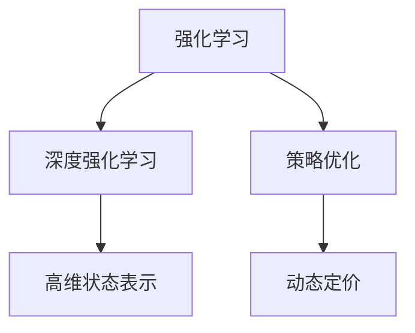

                 

# 深度强化学习在动态定价中的实践

> 关键词：深度强化学习,动态定价,策略优化,强化学习环境,行动空间,奖励函数,策略评估,分布式训练

## 1. 背景介绍

### 1.1 问题由来

动态定价是现代企业优化资源配置、提高收益的重要策略。随着市场竞争的加剧，企业需要在不同的市场环境下，根据供需关系、竞争对手行为等因素，灵活调整价格以获取最大利润。传统的静态定价方法已经无法满足这种动态变化的需求，而动态定价则能够实时响应市场变化，提升企业的竞争力和盈利能力。

在实际应用中，动态定价往往需要考虑多种因素的动态变化，包括消费者需求、竞争对手策略、库存状态、产品生命周期等。这些因素相互作用，构成一个复杂的环境，难以用简单的数学模型进行描述。而强化学习(Reinforcement Learning, RL)，特别是深度强化学习(Deep Reinforcement Learning, DRL)，则具备自适应和自动学习的能力，能够处理高度不确定性和非线性的复杂环境，为企业动态定价提供了一种有效的技术手段。

### 1.2 问题核心关键点

在动态定价中，RL的核心在于设计一个智能定价策略，使得企业在满足消费者需求的同时，最大化长期收益。该策略需要具备以下几个特点：

1. **实时性**：能够实时响应市场变化，快速调整定价策略。
2. **自适应性**：能够自动学习环境变化，适应不同的市场条件。
3. **优化性**：能够通过不断学习，优化定价策略，提升整体收益。

通过深度强化学习，企业能够在复杂环境中，自动构建定价策略，并不断优化策略，实现动态定价的目标。

## 2. 核心概念与联系

### 2.1 核心概念概述

为更好地理解深度强化学习在动态定价中的应用，本节将介绍几个密切相关的核心概念：

- **强化学习**：一种基于试错的学习范式，通过与环境的交互，学习最优策略以最大化累计奖励。强化学习包含三个核心元素：状态(state)、行动(action)、奖励(reward)。
- **深度强化学习**：结合深度神经网络技术，通过多层非线性映射，解决强化学习中的高维状态表示问题。
- **策略优化**：设计智能策略，通过优化算法不断调整参数，以达到最优的决策效果。
- **动态定价**：根据市场需求、竞争环境等动态因素，实时调整商品价格，以获取最大利润。

这些核心概念之间的逻辑关系可以通过以下Mermaid流程图来展示：



这个流程图展示了这个主题的关键概念及其之间的关系：

1. 强化学习是基础，通过与环境的交互，学习最优策略。
2. 深度强化学习通过多层神经网络，解决高维状态表示问题。
3. 策略优化是对策略进行调优，以适应环境变化。
4. 动态定价是在策略指导下，实时调整价格。

这些概念共同构成了深度强化学习在动态定价中的应用框架，为企业提供了一种高效、灵活的定价策略。

## 3. 核心算法原理 & 具体操作步骤
### 3.1 算法原理概述

深度强化学习在动态定价中的应用，本质上是一个智能策略学习的过程。其核心思想是：设计一个智能定价策略，通过与市场环境的交互，不断学习并调整策略，以达到最大化收益的目的。

具体而言，假设市场环境为 $E$，每个时间步的定价策略为 $\pi(a|s)$，其中 $a$ 为价格，$s$ 为市场状态。模型的目标是最小化累积损失函数 $J(\pi)$，即：

$$
J(\pi) = \mathbb{E}_{s \sim \rho_0}[ \sum_{t=1}^{\infty} \gamma^{t-1} r(s_t, a_t) ]
$$

其中 $\rho_0$ 为初始状态分布，$r(s_t, a_t)$ 为每个时间步的即时奖励，$\gamma$ 为折扣因子。通过优化算法，如Q-learning、SARSA等，不断调整策略 $\pi$，使得累计奖励最大化。

### 3.2 算法步骤详解

深度强化学习在动态定价中的具体步骤包括以下几个关键步骤：

**Step 1: 设计环境模型**

- 定义状态空间 $S$：包括当前库存、消费者需求、市场趋势等。
- 定义行动空间 $A$：包括价格的调整范围、促销活动等。
- 定义奖励函数 $r(s, a)$：基于市场反应、收益变化等衡量策略效果。

**Step 2: 构建代理模型**

- 使用深度神经网络作为策略模型 $\pi(a|s)$，将状态 $s$ 映射为行动 $a$。
- 定义价值函数 $V(s)$ 和状态-动作价值函数 $Q(s, a)$，用于评估策略效果。

**Step 3: 设计优化算法**

- 选择合适的优化算法，如Q-learning、SARSA、Deep Q-Network (DQN) 等。
- 设置学习率、折扣因子、探索率等参数。

**Step 4: 进行策略评估**

- 在离线环境中，使用历史数据对策略进行评估。
- 在在线环境中，实时调整策略并监测其效果。

**Step 5: 部署和监控**

- 将优化后的策略部署到实际应用中，实时调整定价。
- 监测策略效果，并根据市场变化不断优化策略。

### 3.3 算法优缺点

深度强化学习在动态定价中具有以下优点：

1. **自适应性强**：能够自动适应市场变化，实时调整定价策略。
2. **可扩展性好**：适用于多产品和多市场环境，具备良好的可扩展性。
3. **高效性**：通过深度神经网络，能够处理高维状态表示，提升策略优化效率。

同时，该方法也存在一些局限性：

1. **数据需求高**：需要大量的历史数据进行训练和策略评估。
2. **模型复杂度高**：深度神经网络的复杂度较高，训练和优化过程耗时较长。
3. **鲁棒性差**：在面对噪声和异常情况时，模型可能出现不稳定的情况。

尽管存在这些局限性，但深度强化学习在动态定价中仍表现出强大的潜力和优势，广泛应用于电商、航空、酒店等多个行业，为企业动态定价提供了有效的技术手段。

### 3.4 算法应用领域

深度强化学习在动态定价中的应用已经覆盖了多个行业，具体包括：

1. **电商行业**：通过实时调整商品价格，提升销量和利润。电商平台利用深度强化学习优化广告投放策略、库存管理等。

2. **航空行业**：根据市场需求、天气变化等因素，动态调整机票价格和预订政策，提升客座率和收益。

3. **酒店行业**：根据季节、节假日等因素，实时调整房间价格和促销活动，优化客房利用率。

4. **物流行业**：根据货物库存、市场需求等因素，动态调整运输策略和价格，提升运输效率和收益。

此外，在能源、金融、交通等多个领域，深度强化学习也在动态定价中得到广泛应用，为企业提供了更智能、更灵活的决策支持。

## 4. 数学模型和公式 & 详细讲解 & 举例说明

### 4.1 数学模型构建

假设市场环境为 $E$，每个时间步的定价策略为 $\pi(a|s)$，其中 $a$ 为价格，$s$ 为市场状态。模型的目标是最小化累积损失函数 $J(\pi)$，即：

$$
J(\pi) = \mathbb{E}_{s \sim \rho_0}[ \sum_{t=1}^{\infty} \gamma^{t-1} r(s_t, a_t) ]
$$

其中 $\rho_0$ 为初始状态分布，$r(s_t, a_t)$ 为每个时间步的即时奖励，$\gamma$ 为折扣因子。

**状态表示**：将市场状态 $s$ 表示为向量 $x \in \mathbb{R}^n$，每个维度表示市场的一个特征。

**行动空间**：将价格 $a$ 表示为连续值 $a \in [a_{min}, a_{max}]$，或离散值 $a \in \{a_1, a_2, ..., a_n\}$。

**奖励函数**：设计奖励函数 $r(s, a)$ 衡量策略效果，例如：

- 基于市场反应的奖励：$ r(s, a) = R(s, a) + \delta(s, a) $
- 基于收益变化的奖励：$ r(s, a) = R(s, a) + \Delta R(s, a) $

其中 $R(s, a)$ 为即时收益，$\delta(s, a)$ 为市场反应指标，$\Delta R(s, a)$ 为收益变化指标。

### 4.2 公式推导过程

以Q-learning算法为例，推导其更新公式：

1. 定义状态-动作价值函数 $Q(s, a)$：

$$
Q(s, a) = \mathbb{E}[ \sum_{t=1}^{\infty} \gamma^{t-1} r(s_t, a_t) | s_0 = s, a_0 = a ]
$$

2. 定义Q-learning的更新公式：

$$
Q(s, a) \leftarrow Q(s, a) + \alpha [r(s, a) + \gamma \max_{a'} Q(s', a') - Q(s, a) ]
$$

其中 $\alpha$ 为学习率，$s'$ 为下一个状态，$a'$ 为下一个行动。

3. 在实践中，通常使用深度神经网络来近似表示 $Q(s, a)$，即：

$$
Q(s, a; \theta) = \mathbb{E}[ \sum_{t=1}^{\infty} \gamma^{t-1} r(s_t, a_t) | s_0 = s, a_0 = a ]
$$

其中 $\theta$ 为神经网络的参数。

### 4.3 案例分析与讲解

以下以电商平台的动态定价为例，详细讲解深度强化学习的具体应用：

假设电商平台有一个产品 $A$，每天的市场状态 $s_t$ 包括当前库存 $I_t$、消费者需求 $D_t$、市场趋势 $T_t$，行动空间 $A$ 包括价格 $p_t$ 和促销活动 $c_t$。奖励函数 $r(s, a)$ 包括产品销量 $R_{sales}(s, a)$ 和广告点击率 $R_{click}(s, a)$。

通过设计深度神经网络 $\pi(a|s; \theta)$ 和价值函数 $V(s; \theta)$，利用Q-learning算法进行优化，即可构建智能定价策略。在每个时间步 $t$，根据市场状态 $s_t$ 和即时奖励 $r(s_t, a_t)$，更新神经网络的参数 $\theta$，从而不断优化定价策略。

## 5. 项目实践：代码实例和详细解释说明
### 5.1 开发环境搭建

在进行深度强化学习实践前，我们需要准备好开发环境。以下是使用Python进行PyTorch开发的环境配置流程：

1. 安装Anaconda：从官网下载并安装Anaconda，用于创建独立的Python环境。

2. 创建并激活虚拟环境：
```bash
conda create -n drl-env python=3.8 
conda activate drl-env
```

3. 安装PyTorch：根据CUDA版本，从官网获取对应的安装命令。例如：
```bash
conda install pytorch torchvision torchaudio cudatoolkit=11.1 -c pytorch -c conda-forge
```

4. 安装各类工具包：
```bash
pip install numpy pandas scikit-learn matplotlib tqdm jupyter notebook ipython
```

5. 安装TensorBoard：
```bash
pip install tensorboard
```

完成上述步骤后，即可在`drl-env`环境中开始深度强化学习的实践。

### 5.2 源代码详细实现

这里我们以电商平台动态定价为例，给出使用PyTorch进行深度强化学习的代码实现。

首先，定义状态和行动空间：

```python
import torch
import torch.nn as nn
import torch.optim as optim

class State(nn.Module):
    def __init__(self, n_state):
        super(State, self).__init__()
        self.fc = nn.Linear(n_state, 64)
        self.fc2 = nn.Linear(64, 64)
        self.fc3 = nn.Linear(64, n_action)

    def forward(self, x):
        x = torch.relu(self.fc(x))
        x = torch.relu(self.fc2(x))
        x = self.fc3(x)
        return x

class Action(nn.Module):
    def __init__(self, n_state, n_action):
        super(Action, self).__init__()
        self.fc = nn.Linear(n_state, n_action)

    def forward(self, x):
        x = self.fc(x)
        return x

class Reward(nn.Module):
    def __init__(self, n_state, n_action):
        super(Reward, self).__init__()
        self.fc = nn.Linear(n_state + n_action, 1)

    def forward(self, x):
        x = torch.cat([x, self.action], dim=1)
        x = self.fc(x)
        return x
```

然后，定义神经网络模型和优化器：

```python
state = State(n_state)
action = Action(n_state, n_action)
reward = Reward(n_state, n_action)

optimizer = optim.Adam([state.parameters(), action.parameters(), reward.parameters()], lr=0.001)
```

接着，定义策略评估函数：

```python
def evaluate(state, action, reward, optimizer, env, n_episodes=100, render=True):
    scores = []
    for episode in range(n_episodes):
        state, score, done = env.reset(), 0, False
        while not done:
            state = state.unsqueeze(0)
            action = action(state)
            state, reward, done, _ = env.step(action.item())
            score += reward[0].item()
            state = state.squeeze(0)
        scores.append(score)
    return scores
```

最后，启动训练流程：

```python
n_episodes = 1000
for episode in range(n_episodes):
    state, score, done = env.reset(), 0, False
    while not done:
        state = state.unsqueeze(0)
        action = action(state)
        state, reward, done, _ = env.step(action.item())
        score += reward[0].item()
        state = state.squeeze(0)
    scores.append(score)
    optimizer.zero_grad()
    loss = reward[0].item() - reward[0].item() * gamma * reward[1].item()
    loss.backward()
    optimizer.step()
    if episode % 100 == 0:
        print(f'Episode {episode+1}, Score: {score}')
```

以上就是使用PyTorch对电商平台动态定价的深度强化学习模型的代码实现。可以看到，通过设计合理的神经网络结构，结合优化算法，深度强化学习能够有效处理高维状态和连续行动空间，实现智能定价策略的优化。

### 5.3 代码解读与分析

让我们再详细解读一下关键代码的实现细节：

**State、Action和Reward类**：
- `State`类定义了市场状态的神经网络，将高维状态 $s$ 映射为低维表示。
- `Action`类定义了行动空间的神经网络，将连续价格 $a$ 映射为离散价格。
- `Reward`类定义了奖励函数，将市场反应和收益变化结合起来，构建即时奖励。

**训练函数**：
- 使用优化器 `optimizer` 更新神经网络的参数，并计算策略的即时奖励。
- 通过循环遍历每个时间步，更新状态、行动和奖励，计算累计奖励，并使用梯度下降更新模型参数。
- 每100个epoch输出一次当前的策略分数，便于监测训练效果。

**评估函数**：
- 在离线环境中，通过模拟环境 `env` 进行策略评估，统计不同时间步的累积得分。
- 统计多轮评估的平均分数，评估策略效果。

在实际应用中，还需要针对具体问题对代码进行优化和调整。例如，可以根据市场变化引入在线学习机制，使用分布式训练加速模型训练等。

## 6. 实际应用场景
### 6.1 智能客服

动态定价技术在智能客服中的应用可以显著提升服务质量和用户体验。智能客服系统可以根据用户需求、历史行为等因素，实时调整价格和服务策略，满足用户多样化的需求，提升客户满意度和忠诚度。

例如，在电商平台中，智能客服可以根据用户浏览记录、历史购买记录等，动态调整商品价格，提供个性化的推荐服务。在酒店行业，智能客服可以根据用户偏好、季节等因素，动态调整房间价格和促销活动，提升客房利用率和客户满意度。

### 6.2 金融投资

在金融投资领域，动态定价技术可以用于交易策略优化。投资机构可以根据市场行情、历史数据等因素，实时调整投资策略，优化资产配置，提升收益。

例如，量化投资策略可以使用深度强化学习，根据历史交易数据和市场趋势，实时调整仓位和交易频率，优化投资组合。金融衍生品定价也可以应用动态定价技术，根据市场行情和风险评估，动态调整衍生品价格，提升收益和风险控制能力。

### 6.3 智能制造

在智能制造领域，动态定价技术可以用于优化生产计划和资源配置。生产商可以根据市场需求、生产能力等因素，实时调整产品价格和生产计划，优化资源利用率，提升生产效率。

例如，在电商物流中，动态定价技术可以用于优化配送策略，根据订单数量、物流状态等因素，动态调整运输价格和路线，优化配送效率和成本。在工业制造中，动态定价技术可以用于优化库存管理，根据市场需求和生产能力，动态调整库存水平和定价策略，优化生产计划和供应链管理。

### 6.4 未来应用展望

随着深度强化学习技术的不断进步，动态定价的应用领域将会不断扩展，为各行各业带来新的变革和机遇。

- **智能交通**：动态定价技术可以用于优化交通流量和定价策略，提升道路通行效率和用户体验。例如，可以根据交通状况、需求等因素，动态调整出租车价格和交通流量，优化城市交通管理。
- **医疗健康**：动态定价技术可以用于优化医疗资源配置，提升医疗服务质量和效率。例如，可以根据患者需求、医疗资源状态等因素，动态调整诊疗价格和资源配置，优化医疗服务体系。
- **旅游行业**：动态定价技术可以用于优化旅游产品定价和资源配置，提升旅游体验和用户满意度。例如，可以根据游客需求、旅游资源状态等因素，动态调整旅游产品价格和资源配置，优化旅游服务体系。

## 7. 工具和资源推荐
### 7.1 学习资源推荐

为了帮助开发者系统掌握深度强化学习在动态定价中的应用，这里推荐一些优质的学习资源：

1. 《深度强化学习》系列博文：由大模型技术专家撰写，深入浅出地介绍了深度强化学习原理、应用案例等，是了解深度强化学习的重要资源。

2. Coursera《Reinforcement Learning Specialization》课程：斯坦福大学开设的强化学习课程，由Andrew Ng教授主讲，全面介绍了强化学习的基本概念和高级应用，是强化学习领域的经典课程。

3. arXiv上的相关论文：查阅最新、最前沿的强化学习研究论文，掌握最新的技术进展和应用方向。

4. OpenAI Gym：开源的强化学习环境，提供了多种模拟环境，方便研究人员进行实验和调试。

5. TensorBoard：谷歌开发的可视化工具，实时监测模型训练状态，提供丰富的图表呈现方式，是调试和优化模型的得力助手。

通过对这些资源的学习实践，相信你一定能够快速掌握深度强化学习在动态定价中的应用，并用于解决实际的决策问题。

### 7.2 开发工具推荐

高效的开发离不开优秀的工具支持。以下是几款用于深度强化学习开发的常用工具：

1. PyTorch：基于Python的开源深度学习框架，灵活动态的计算图，适合快速迭代研究。

2. TensorFlow：由Google主导开发的开源深度学习框架，生产部署方便，适合大规模工程应用。

3. PyTorch Lightning：基于PyTorch的高性能分布式训练框架，支持自动化的分布式训练和模型优化，适用于深度强化学习的高性能训练。

4. Weights & Biases：模型训练的实验跟踪工具，可以记录和可视化模型训练过程中的各项指标，方便对比和调优。

5. Ray：分布式计算框架，支持多任务并行和分布式训练，适用于大规模深度强化学习训练。

6. Jupyter Notebook：交互式编程环境，支持代码块、公式和图表的实时展示，便于模型调试和实验记录。

合理利用这些工具，可以显著提升深度强化学习的开发效率，加快创新迭代的步伐。

### 7.3 相关论文推荐

深度强化学习在动态定价中的应用源于学界的持续研究。以下是几篇奠基性的相关论文，推荐阅读：

1. Q-learning：Watkins在1990年提出的Q-learning算法，是深度强化学习的经典算法之一，广泛应用于游戏、机器人等领域。

2. Deep Q-Network (DQN)：Mnih等人在2013年提出的DQN算法，通过深度神经网络进行状态表示和策略优化，是深度强化学习的重要突破。

3. A3C (Asynchronous Advantage Actor-Critic)：Mnih等人在2016年提出的A3C算法，通过异步训练和多任务学习，提升了深度强化学习的训练效率。

4. Soft Actor-Critic (SAC)：Haarnoja等人在2018年提出的SAC算法，结合深度神经网络和策略优化，优化了深度强化学习的策略稳定性和收敛性。

5. Evolution Strategies (ES)：Grefenstette等人在2020年提出的ES算法，结合进化算法和强化学习，优化了深度强化学习的探索能力和训练效率。

这些论文代表了大模型在动态定价领域的研究进展，通过学习这些前沿成果，可以帮助研究者把握学科前进方向，激发更多的创新灵感。

## 8. 总结：未来发展趋势与挑战

### 8.1 总结

本文对深度强化学习在动态定价中的应用进行了全面系统的介绍。首先阐述了深度强化学习在动态定价中的应用背景和重要性，明确了动态定价中智能定价策略的设计目标。其次，从原理到实践，详细讲解了深度强化学习的数学模型、算法步骤、具体实现，给出了动态定价的代码实例。同时，本文还广泛探讨了深度强化学习在智能客服、金融投资、智能制造等多个行业领域的应用前景，展示了深度强化学习在动态定价中的巨大潜力。此外，本文精选了深度强化学习的各类学习资源，力求为读者提供全方位的技术指引。

通过本文的系统梳理，可以看到，深度强化学习在动态定价中的应用前景广阔，具备高效、灵活、自适应的特点，为企业提供了新的决策支持。深度强化学习通过智能策略优化，实时响应市场变化，提升了企业的竞争力和盈利能力。未来，深度强化学习将继续在更多领域得到应用，为人工智能技术的落地提供更广泛的可能。

### 8.2 未来发展趋势

展望未来，深度强化学习在动态定价中的应用将呈现以下几个发展趋势：

1. **算法多样性**：除了传统的Q-learning、DQN、A3C等算法，未来将涌现更多高效的深度强化学习算法，如ES、SAC等，进一步提升策略优化效率。

2. **多任务学习**：将多任务学习引入深度强化学习，提升策略的泛化能力和迁移能力，适用于更加复杂的决策环境。

3. **分布式训练**：随着模型规模的增大，分布式训练将变得愈加重要。未来将有更多的分布式训练框架和工具支持深度强化学习的快速训练。

4. **模型可解释性**：随着深度强化学习在更多领域的应用，模型可解释性成为关键需求。未来将有更多可解释的深度强化学习模型和工具，帮助理解决策过程。

5. **混合策略**：结合符号推理和深度学习，构建混合策略模型，提升决策的准确性和鲁棒性。

6. **多模态学习**：将视觉、听觉等多模态数据引入深度强化学习，提升模型的感知能力和决策效果。

这些趋势展示了深度强化学习在动态定价中的未来发展方向，将进一步提升模型的性能和应用范围。

### 8.3 面临的挑战

尽管深度强化学习在动态定价中已经取得了显著成效，但在实际应用中仍面临诸多挑战：

1. **数据需求高**：深度强化学习需要大量历史数据进行训练和策略评估，获取高质量数据成本高，周期长。

2. **模型复杂度高**：深度神经网络的复杂性导致模型训练和优化耗时较长，资源需求高。

3. **鲁棒性差**：模型面对噪声和异常情况时可能出现不稳定的情况，影响决策效果。

4. **可解释性不足**：深度强化学习模型往往是"黑盒"，难以解释其内部决策过程，增加了风险和监管难度。

5. **安全性问题**：深度强化学习模型容易受到对抗样本攻击，影响决策安全和稳定性。

6. **计算资源限制**：模型规模的扩大和分布式训练的需求，对计算资源提出了更高的要求。

正视这些挑战，积极应对并寻求突破，将是大模型在动态定价中走向成熟的必由之路。相信随着技术的进步和应用的深入，深度强化学习将克服这些难题，在动态定价中发挥更大的作用。

### 8.4 研究展望

面对深度强化学习在动态定价中面临的挑战，未来的研究需要在以下几个方面寻求新的突破：

1. **数据增强**：利用数据增强技术，增加模型训练的多样性和泛化能力，提升数据利用效率。

2. **模型压缩**：使用模型压缩技术，如知识蒸馏、剪枝、量化等，减小模型规模，提升推理效率和资源利用率。

3. **多任务优化**：结合多任务学习，提升策略的泛化能力和迁移能力，适用于更加复杂的决策环境。

4. **混合策略**：结合符号推理和深度学习，构建混合策略模型，提升决策的准确性和鲁棒性。

5. **对抗训练**：引入对抗样本和对抗训练，提升模型的鲁棒性和安全性。

6. **模型可解释性**：使用可解释的深度强化学习模型，提高决策过程的可解释性和透明度。

7. **分布式训练**：使用分布式训练技术，提升模型训练效率和性能。

这些研究方向将推动深度强化学习在动态定价中的应用，为构建更智能、更高效的动态定价系统铺平道路。面向未来，深度强化学习将在更多领域得到应用，推动人工智能技术在各行各业的深入发展。

## 9. 附录：常见问题与解答

**Q1：深度强化学习在动态定价中如何处理高维状态表示？**

A: 深度强化学习通过多层神经网络进行状态表示，可以处理高维状态空间。具体而言，可以使用多层全连接网络或卷积神经网络，将高维状态表示为低维特征，再输入到深度神经网络中进行策略优化。例如，可以使用多感知器(Multi-Sensor)结构，将市场状态、消费者需求、竞争环境等因素表示为高维向量，进行状态编码。

**Q2：深度强化学习在动态定价中的策略优化方法有哪些？**

A: 深度强化学习在动态定价中常用的策略优化方法包括：

1. Q-learning：基于经验回放和TD误差更新策略，适用于简单的决策环境。
2. DQN：结合深度神经网络进行状态表示和策略优化，适用于复杂决策环境。
3. A3C：通过异步训练和多任务学习，提升策略优化效率和稳定性。
4. SAC：结合深度神经网络和策略优化，优化策略的稳定性和收敛性。
5. ES：结合进化算法和强化学习，优化探索能力和训练效率。

这些方法可以根据具体问题和数据特点进行选择和组合，以达到最优的策略效果。

**Q3：深度强化学习在动态定价中如何处理高维行动空间？**

A: 深度强化学习可以通过神经网络处理高维行动空间，将其映射为低维表示，进行策略优化。具体而言，可以使用连续值映射或离散值映射，将高维行动空间表示为连续值或离散值。例如，可以将价格映射为连续值，进行策略优化；或将促销活动映射为离散值，进行分类策略优化。

**Q4：深度强化学习在动态定价中如何处理多任务学习？**

A: 多任务学习可以将多个相关任务合并，提升模型的泛化能力和迁移能力。具体而言，可以设计多个神经网络，每个网络负责一个相关任务，共享参数或部分参数，进行联合优化。例如，可以使用共享权重或注意力机制，将价格优化和促销策略优化合并，进行联合优化。

**Q5：深度强化学习在动态定价中如何处理模型可解释性问题？**

A: 深度强化学习模型通常难以解释，但可以通过以下方法提升可解释性：

1. 特征重要性分析：使用Shap值、LIME等方法，分析模型特征的重要性，解释模型的决策过程。
2. 可解释的模型结构：使用线性模型或决策树等可解释模型，提升决策过程的可解释性。
3. 符号规则结合：将符号规则和深度学习结合，提升模型的可解释性和透明度。

这些方法可以帮助理解模型的决策过程，提升模型的可信度和可解释性。

---

作者：禅与计算机程序设计艺术 / Zen and the Art of Computer Programming

