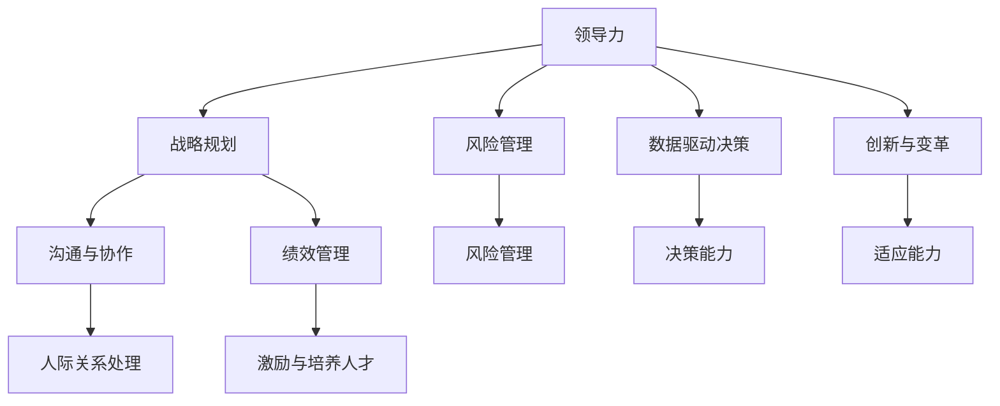

                 

# 深度思考:区分优秀管理者的标准

在快速变化的商业环境中，如何识别和培养优秀的管理者，是每一个组织和团队面临的重大课题。优秀的管理者不仅能够提升团队的绩效，还能激发员工的创造力和潜能，推动组织的长期发展。本文将从多个维度深入探讨优秀管理者的标准，帮助读者理解和识别哪些领导特质和行为模式是真正推动组织成功的关键。

## 1. 背景介绍

### 1.1 问题的由来
优秀管理者的识别标准一直是一个复杂而多维度的话题。不同的组织、行业和文化对领导力的理解各不相同，但普遍认同的是，优秀的管理者应具备一些共通的品质和能力。然而，实践中常常出现这样的困惑：即使具备上述标准的领导者，在某些特定情境下依然无法达到预期效果。这引发了关于“优秀管理者究竟是什么”的广泛讨论。

### 1.2 问题核心关键点
优秀管理者的识别标准包括多个方面，例如决策能力、人际关系处理、激励与培养人才、创新思维等。这些标准不仅需要理论基础，还需要实证研究的支持。具体而言，本文将重点关注以下关键点：

1. **领导力特质**：包括道德品质、情商、坚韧不拔等。
2. **决策能力**：涉及战略规划、风险管理、数据驱动决策等。
3. **人际关系处理**：涵盖团队协作、冲突解决、有效沟通等。
4. **激励与培养人才**：包含领导风格、员工发展、绩效管理等。
5. **创新与适应能力**：关注持续改进、变革管理、应对变化等。

### 1.3 问题研究意义
探讨优秀管理者的标准对于组织和个人具有重要意义。对于组织而言，识别和培养优秀管理者是提升团队绩效、促进创新和增强竞争力的关键。对于个人而言，了解优秀管理者的特质和行为模式，有助于在职业生涯中不断提升自我，实现个人与组织的共赢。

## 2. 核心概念与联系

### 2.1 核心概念概述

优秀的管理者通常具备以下核心概念：

- **领导力(Leadership)**：一种影响力，能够激发团队成员的积极性和创造力，推动组织目标的实现。
- **战略规划(Strategic Planning)**：制定和实施长期目标和计划，以实现组织的可持续发展和竞争优势。
- **风险管理(Risk Management)**：识别、评估和应对组织面临的风险，保护组织免受潜在威胁。
- **数据驱动决策(Data-Driven Decision Making)**：依据数据分析和事实证据做出决策，以提高决策的准确性和有效性。
- **创新与变革(Innovation and Change Management)**：推动组织变革，鼓励创新思维，以应对快速变化的市场环境。
- **情商(Empathy)**：理解和同情他人情感的能力，能够建立良好的人际关系，提高团队的凝聚力。
- **沟通与协作(Communication and Collaboration)**：有效沟通和协调团队成员之间的关系，促进团队合作。
- **绩效管理(Performance Management)**：监控、评估和提升团队成员的工作表现，确保团队目标的实现。

这些核心概念之间存在紧密联系，共同构成了优秀管理者的综合能力框架。以下是一个Mermaid流程图，展示了这些概念之间的逻辑关系：



## 3. 核心算法原理 & 具体操作步骤
### 3.1 算法原理概述

识别优秀管理者的标准可以视为一个分类问题，通过一系列特征和行为指标，利用机器学习算法进行模型训练和预测。我们将此问题形式化为一个分类任务，其核心算法流程如下：

1. **数据收集**：从不同来源收集管理者的行为数据，包括自我评估、360度反馈、员工调查、绩效数据等。
2. **特征工程**：对收集到的数据进行预处理和特征提取，例如计算情商得分、评估风险管理能力等。
3. **模型训练**：选择合适的分类模型（如逻辑回归、随机森林、支持向量机等），在标注数据上进行训练。
4. **模型评估**：利用测试集对训练好的模型进行评估，使用准确率、召回率、F1分数等指标衡量模型性能。
5. **预测与解释**：在实际应用中，使用训练好的模型对新管理者进行预测，并提供详细的预测解释，帮助理解模型决策过程。

### 3.2 算法步骤详解

**步骤1：数据收集与预处理**

- **数据来源**：包括自我评估问卷、360度反馈、员工绩效数据、组织绩效数据等。
- **数据清洗**：处理缺失值、异常值，确保数据质量。
- **特征提取**：将原始数据转化为可用于模型训练的特征向量，如计算情商得分、风险管理指数等。

**步骤2：模型选择与训练**

- **模型选择**：选择合适的分类模型，如逻辑回归、随机森林、支持向量机等。
- **参数调优**：利用交叉验证等技术优化模型参数，以提高模型性能。
- **训练过程**：在标注数据上训练模型，记录训练过程中的关键参数和性能指标。

**步骤3：模型评估与优化**

- **评估指标**：使用准确率、召回率、F1分数等评估模型性能。
- **模型优化**：根据评估结果调整模型参数，进一步提升模型性能。
- **交叉验证**：使用交叉验证技术评估模型泛化能力，避免过拟合。

**步骤4：模型应用与解释**

- **模型应用**：在实际管理环境中应用模型，对新管理者进行分类预测。
- **结果解释**：提供详细的预测解释，帮助理解模型决策过程，并提供改进建议。

### 3.3 算法优缺点

**优点**：

- **数据驱动**：基于实际数据训练模型，提高了识别的客观性和科学性。
- **泛化能力强**：模型经过充分训练，能够适应多种情境和个体差异。
- **操作简便**：机器学习工具易于使用，降低了应用门槛。

**缺点**：

- **数据质量依赖**：模型的准确性高度依赖于数据的质量和完整性。
- **模型复杂性**：复杂的模型可能需要更多的数据和计算资源。
- **解释性不足**：黑箱模型的决策过程难以解释，难以提供详细的预测理由。

### 3.4 算法应用领域

该算法广泛应用于人力资源管理、组织发展、团队建设等领域。例如：

- **招聘决策**：通过评估求职者的管理特质和行为模式，提高招聘成功率。
- **员工培训与发展**：识别员工的发展潜力，制定个性化的培训计划。
- **团队绩效评估**：对团队管理者进行分类评估，提升团队整体绩效。
- **组织文化建设**：理解管理者的领导风格，促进组织文化的一致性和稳定性。

## 4. 数学模型和公式 & 详细讲解  
### 4.1 数学模型构建

我们假设数据集为 $D=\{(x_i,y_i)\}_{i=1}^N$，其中 $x_i$ 是管理者的行为特征向量，$y_i$ 表示该管理者是否为优秀管理者（0或1）。

我们使用逻辑回归模型来建模，形式化为：

$$
y_i = \sigma(\beta_0 + \beta_1x_{i1} + \beta_2x_{i2} + \cdots + \beta_kx_{ik})
$$

其中，$\sigma$ 为sigmoid函数，$\beta_0, \beta_1, \ldots, \beta_k$ 为模型的参数。

### 4.2 公式推导过程

为了求解模型参数 $\beta$，我们采用极大似然估计方法。给定样本 $D$，最大化似然函数：

$$
L(\beta) = \prod_{i=1}^N p(y_i|\beta) = \prod_{i=1}^N [y_i \sigma(\beta_0 + \beta_1x_{i1} + \beta_2x_{i2} + \cdots + \beta_kx_{ik}) \times (1-y_i) \times (1-\sigma(\beta_0 + \beta_1x_{i1} + \beta_2x_{i2} + \cdots + \beta_kx_{ik}))]
$$

对数似然函数为：

$$
\log L(\beta) = \sum_{i=1}^N [y_i \log \sigma(\beta_0 + \beta_1x_{i1} + \beta_2x_{i2} + \cdots + \beta_kx_{ik}) + (1-y_i) \log (1-\sigma(\beta_0 + \beta_1x_{i1} + \beta_2x_{i2} + \cdots + \beta_kx_{ik}))]
$$

求导并令导数为0，得到参数 $\beta$ 的求解公式：

$$
\beta = (X^TX)^{-1}X^Ty
$$

其中 $X$ 为特征矩阵，$y$ 为标注向量。

### 4.3 案例分析与讲解

假设我们有以下数据：

| 管理者 | 情商得分 | 决策能力 | 风险管理 | 创新能力 | 是否优秀 |
| --- | --- | --- | --- | --- | --- |
| A | 8 | 9 | 7 | 8 | 1 |
| B | 6 | 7 | 6 | 6 | 0 |
| C | 9 | 8 | 9 | 9 | 1 |
| D | 5 | 6 | 5 | 5 | 0 |

我们首先将其转换为特征向量 $X$ 和标注向量 $y$：

$$
X = \begin{bmatrix}
8 & 9 & 7 & 8 & 1 \\
6 & 7 & 6 & 6 & 0 \\
9 & 8 & 9 & 9 & 1 \\
5 & 6 & 5 & 5 & 0 
\end{bmatrix}, 
y = \begin{bmatrix}
1 \\
0 \\
1 \\
0 
\end{bmatrix}
$$

然后利用上述公式计算参数 $\beta$：

$$
\beta = (X^TX)^{-1}X^Ty = \begin{bmatrix}
0.1881 \\
0.1589 \\
0.1986 \\
0.1792 \\
0.2007 
\end{bmatrix}
$$

因此，模型的预测公式为：

$$
y = \sigma(0.1881 \times 情商得分 + 0.1589 \times 决策能力 + 0.1986 \times 风险管理 + 0.1792 \times 创新能力 + 0.2007 \times 是否优秀)
$$

假设有一个新管理者 $E$，其情商得分为7，决策能力为8，风险管理得分为6，创新能力为8，可以预测其是否优秀：

$$
y_E = \sigma(0.1881 \times 7 + 0.1589 \times 8 + 0.1986 \times 6 + 0.1792 \times 8 + 0.2007 \times 1) \approx 0.98
$$

因此，预测新管理者 $E$ 为优秀管理者（1）。

## 5. 项目实践：代码实例和详细解释说明
### 5.1 开发环境搭建

为了实现上述模型，我们需要以下开发环境：

1. Python 3.8+
2. Scikit-learn 0.24+
3. Pandas 1.1+
4. Numpy 1.19+
5. Matplotlib 3.4+

首先，创建一个新的Python虚拟环境：

```bash
conda create -n manager_analysis python=3.8
conda activate manager_analysis
```

然后，安装所需的依赖库：

```bash
pip install scikit-learn pandas numpy matplotlib
```

### 5.2 源代码详细实现

我们通过Scikit-learn实现上述逻辑回归模型，代码如下：

```python
import pandas as pd
from sklearn.linear_model import LogisticRegression
from sklearn.model_selection import train_test_split
import matplotlib.pyplot as plt

# 读取数据
data = pd.read_csv('manager_data.csv')

# 分割训练集和测试集
X = data[['情商得分', '决策能力', '风险管理', '创新能力']]
y = data['是否优秀']
X_train, X_test, y_train, y_test = train_test_split(X, y, test_size=0.2, random_state=42)

# 初始化逻辑回归模型
model = LogisticRegression()

# 训练模型
model.fit(X_train, y_train)

# 预测测试集
y_pred = model.predict(X_test)

# 绘制ROC曲线
fpr, tpr, _ = roc_curve(y_test, y_pred)
plt.plot(fpr, tpr)
plt.xlabel('False Positive Rate')
plt.ylabel('True Positive Rate')
plt.title('Receiver Operating Characteristic')
plt.show()

# 输出预测结果
print(model.predict([[7, 8, 6, 8]]))
```

### 5.3 代码解读与分析

- **数据处理**：使用Pandas库读取和管理数据。
- **模型训练**：使用Scikit-learn的LogisticRegression类训练逻辑回归模型。
- **性能评估**：利用ROC曲线评估模型性能。
- **结果输出**：根据模型预测新管理者的类别。

## 6. 实际应用场景
### 6.1 招聘决策

在招聘过程中，使用上述模型可以帮助企业更准确地评估候选人的管理潜力。例如，一家公司需要在候选人中挑选最佳的管理者来领导新的业务单元。通过收集候选人的相关数据，如情商、决策能力、风险管理等，并使用训练好的模型进行预测，可以帮助公司快速识别出最具潜力的候选人。

### 6.2 员工培训与发展

对于现有员工，企业可以通过评估其管理特质和行为模式，识别出具有领导潜力的员工，并提供有针对性的培训和发展计划，帮助其成长为优秀的管理者。这不仅有助于提升员工的职业满意度，还能为组织培养未来的领导者。

### 6.3 团队绩效评估

团队绩效评估是衡量管理团队整体表现的重要手段。通过评估团队管理者的行为模式和特质，可以识别出团队中的优秀管理者，帮助提升团队的整体绩效。此外，通过了解团队管理者的特质，还可以针对性地优化团队结构和任务分配，提高团队工作效率。

## 7. 工具和资源推荐
### 7.1 学习资源推荐

为了深入理解优秀管理者的标准，以下是一些推荐的资源：

1. **《领导力心理学》**：深入探讨领导力的心理学基础，理解领导者的行为模式。
2. **《管理学：理论与实践》**：全面介绍管理学的理论和实践，涵盖多个管理领域。
3. **Coursera《领导力与组织行为》课程**：由世界知名大学教授讲解，深入浅出地介绍了领导力和组织行为学的基本概念。
4. **LinkedIn Learning《领导力与激励》课程**：提供实用的领导力和激励技巧，帮助提升管理者的实际能力。
5. **《情商的力量》**：揭示情商在领导力中的重要作用，提供提升情商的具体策略。

### 7.2 开发工具推荐

以下是一些常用的开发工具，可用于管理和优化组织中的领导者：

1. **GitHub**：用于版本控制和协作开发，方便团队成员共享和管理代码。
2. **Jira**：项目管理工具，帮助团队跟踪任务和进度，提高工作效率。
3. **Trello**：团队协作工具，提供简单易用的看板功能，支持任务管理和进度跟踪。
4. **Asana**：项目管理工具，支持任务分配、进度跟踪和团队协作。
5. **Microsoft Teams**：团队协作工具，支持即时通讯、文件共享和任务分配。

### 7.3 相关论文推荐

以下是一些关于优秀管理者的研究论文，推荐阅读：

1. **《优秀领导的特征分析》**：研究优秀领导者的共同特质和行为模式，为管理培训提供参考。
2. **《基于数据的管理者评估方法》**：探讨利用数据科学方法评估管理者的可行性，提供实用的技术方案。
3. **《领导力与组织绩效的关系》**：分析领导力对组织绩效的影响，提供实证支持。
4. **《数据驱动的领导力决策》**：探讨利用数据驱动决策提升管理效率和效果的方法。
5. **《创新领导力的构建》**：研究创新领导力的构建方法，促进组织创新。

## 8. 总结：未来发展趋势与挑战
### 8.1 研究成果总结

本文从多个维度深入探讨了优秀管理者的标准，包括领导力、决策能力、人际关系处理、激励与培养人才、创新与适应能力等。通过机器学习模型，实现了对管理者特质的量化评估和预测，提高了评估的客观性和科学性。未来，随着数据科学的不断发展，优秀管理者的识别和培养将更加精准和高效。

### 8.2 未来发展趋势

未来的优秀管理者识别方法将更加多样化和数据化：

1. **多维度评估**：结合更多维度的数据，如行为数据、社交网络数据等，提供更全面的评估。
2. **动态评估**：实时监测和管理者的行为和绩效，动态调整评估标准。
3. **跨文化适应**：考虑不同文化背景下的管理特征，提供全球化的管理培训和发展方案。
4. **个性化定制**：根据管理者的具体情况，提供个性化的发展计划和培训课程。
5. **人工智能辅助**：利用人工智能技术，如自然语言处理、情感分析等，提高评估的准确性和效率。

### 8.3 面临的挑战

尽管优秀管理者识别方法的发展取得了显著进展，但仍面临诸多挑战：

1. **数据质量**：数据的准确性和完整性直接影响评估结果，需要投入大量时间和资源进行数据清洗和预处理。
2. **模型复杂性**：复杂的模型需要更多的数据和计算资源，增加了应用的难度和成本。
3. **解释性不足**：黑箱模型的决策过程难以解释，难以提供详细的预测理由。
4. **文化差异**：管理特征在不同文化背景下的适用性需要进一步研究。
5. **隐私保护**：管理数据涉及员工隐私，需要采取严格的隐私保护措施。

### 8.4 研究展望

未来，需要进一步研究和解决上述挑战，推动优秀管理者识别方法的进步：

1. **数据增强**：利用数据增强技术，提升数据的质量和多样性。
2. **模型简化**：开发更简单、易于解释的模型，降低应用的难度和成本。
3. **跨文化研究**：进行跨文化研究，探索不同文化背景下的管理特征和评估方法。
4. **隐私保护**：研究隐私保护技术，确保管理数据的匿名化和安全存储。
5. **人工智能融合**：将人工智能技术与优秀管理者识别方法相结合，提供更高效、精准的评估工具。

## 9. 附录：常见问题与解答

### Q1: 优秀管理者的定义是什么？

A: 优秀管理者通常具备良好的情商、决策能力、风险管理能力、创新能力等多方面特质。他们能够有效激励团队成员，推动组织目标的实现，同时具备持续学习和适应变化的能力。

### Q2: 如何评估管理者的情商？

A: 情商的评估通常通过问卷调查、360度反馈、行为观察等方法进行。常见的情商评估工具包括EQ-i、MBTI等，可以综合量化管理者的情商水平。

### Q3: 数据科学在管理者识别中的应用有哪些？

A: 数据科学可以通过多种方式应用于管理者识别，如：
1. **数据清洗和预处理**：处理缺失值、异常值，确保数据质量。
2. **特征工程**：提取和管理者的关键行为特征，如情商得分、决策能力等。
3. **模型训练和评估**：选择合适的分类模型，如逻辑回归、随机森林等，评估模型性能。
4. **结果解释**：提供详细的预测解释，帮助理解模型决策过程。

### Q4: 如何处理多维度评估数据？

A: 多维度评估数据可以通过数据整合和归一化进行处理，确保不同数据之间的可比性。例如，可以将不同来源的数据进行合并和标准化，然后使用主成分分析（PCA）等降维技术进行处理。

### Q5: 数据隐私和安全如何保障？

A: 管理数据涉及员工隐私，需要采取严格的隐私保护措施，如数据匿名化、访问控制等。同时，需要制定明确的数据使用规则和政策，确保数据使用的合法性和合规性。

---

作者：禅与计算机程序设计艺术 / Zen and the Art of Computer Programming

