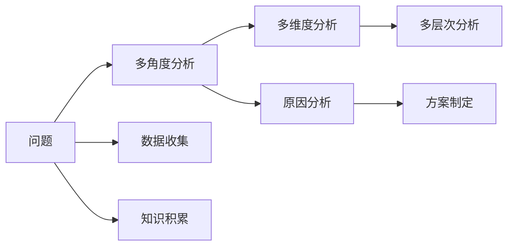

                 

# 深度思考：拉开人生差距的重要因素

## 1. 背景介绍

### 1.1 问题由来

在当今社会，各行各业都在不断发展和变革，个人职业发展也面临着前所未有的挑战和机遇。如何在这个复杂多变的时代中脱颖而出，拉开与他人的差距，成为了许多人思考的重要课题。本文将深入探讨深度思考在个人职业发展中的重要性，并给出具体的实践指导。

### 1.2 问题核心关键点

深度思考不仅是一种思维方式，更是一种能力，能够在工作中解决问题、创造价值，提升职业竞争力。深度思考的能力可以帮助我们：

- 理解复杂问题，找到根本原因。
- 制定切实可行的解决方案。
- 发现新的机会，创新突破。
- 提升工作效率，减少错误。
- 提升决策质量，减少风险。

在职场上，深度思考的差距可能直接导致工作绩效、职业发展的不同，从而拉开人生差距。

### 1.3 问题研究意义

深度思考的差距在职场竞争中具有重要的意义：

- 提升个人价值：深度思考能够帮助个人理解更深层次的业务问题，提升个人解决问题的能力，从而在职场中更具竞争力。
- 创造更好机会：深度思考能力强的人往往能够从平凡的工作中发现机会，创造出新的价值，获得更多的发展机会。
- 降低职业风险：深度思考能力强的人能够提前发现潜在风险，并制定应对策略，降低职业风险。
- 提升团队效益：深度思考能力强的人能够带领团队更好地理解和解决业务问题，提升团队的整体工作效率和效益。

深度思考的能力是拉开人生差距的关键因素之一，因此在职业发展的各个阶段都需要重视并不断提升。

## 2. 核心概念与联系

### 2.1 核心概念概述

深度思考（Deep Thinking）是一种通过多角度、多维度、多层次分析和思考，从而深入理解问题的思维方式。深度思考不仅需要具备广泛的知识和经验，还需要具备系统化的思考方法和工具。

### 2.2 核心概念原理和架构的 Mermaid 流程图



该流程图展示了深度思考的过程：首先从问题出发，通过多角度、多维度、多层次分析找到问题的根本原因，并基于数据和知识制定切实可行的解决方案。

### 2.3 核心概念之间的联系

深度思考能力的提升需要以下几个关键要素的协同作用：

- **问题分析**：通过多角度、多维度、多层次的全面分析，深入理解问题的本质和背景。
- **数据支持**：以数据为依据，获取问题的全面信息，从而得出可靠的结论。
- **知识储备**：广泛的知识储备和经验积累是深度思考的基础，帮助找到问题的解决方案。
- **逻辑思维**：系统化的逻辑推理和论证能力，保证分析的严谨性和有效性。

这些要素相互关联，共同构成了深度思考的能力体系。

## 3. 核心算法原理 & 具体操作步骤

### 3.1 算法原理概述

深度思考的算法原理主要包括以下几个步骤：

1. **问题定义**：明确问题的本质和边界，将复杂问题分解成多个子问题。
2. **数据收集**：通过多渠道收集与问题相关的数据。
3. **原因分析**：多角度、多维度地分析数据，找到问题的根本原因。
4. **方案制定**：基于数据和知识储备，制定切实可行的解决方案。
5. **执行验证**：通过实践验证方案的有效性，并持续优化。

### 3.2 算法步骤详解

**Step 1: 问题定义**
- 确定问题的核心要素，理解问题的背景和目的。
- 将复杂问题分解成多个子问题，明确每个子问题的目标和范围。

**Step 2: 数据收集**
- 收集与问题相关的所有数据，包括历史数据、实时数据、外部数据等。
- 清洗数据，去除噪声和错误信息，确保数据的准确性和完整性。

**Step 3: 原因分析**
- 使用系统化的分析工具和方法，如鱼骨图、5W1H分析法、SWOT分析法等，多角度、多维度地分析数据。
- 找出问题的根本原因，并从多个维度验证原因的有效性。

**Step 4: 方案制定**
- 基于问题分析和数据支持，制定多个可能的解决方案。
- 评估每个方案的优劣，选择最优方案，并制定详细的执行计划。

**Step 5: 执行验证**
- 根据执行计划，逐步实施解决方案。
- 通过实际执行和反馈，验证方案的有效性，并持续优化和改进。

### 3.3 算法优缺点

深度思考的优点：

- 系统化全面分析问题，避免片面思考。
- 提高决策的准确性和科学性，减少决策风险。
- 提升解决问题的能力和创新能力，创造更多价值。

深度思考的缺点：

- 耗时耗力，分析过程复杂。
- 对分析者的知识储备和经验要求高，难以掌握。
- 需要较强的逻辑思维和分析能力，难以快速掌握。

### 3.4 算法应用领域

深度思考在各个领域都有广泛的应用，例如：

- **项目管理**：通过多角度分析项目风险，制定详细计划，提升项目管理能力。
- **产品设计**：多维度分析用户需求，设计出更符合用户期望的产品。
- **市场营销**：多层次分析市场变化，制定有效的市场策略。
- **技术研发**：通过多维度分析技术瓶颈，制定切实可行的研发方案。

深度思考的能力在不同领域都有重要意义，能够帮助个人和企业提升整体竞争力。

## 4. 数学模型和公式 & 详细讲解 & 举例说明

### 4.1 数学模型构建

深度思考的数学模型可以抽象为一个多层次的决策树模型。

- **输入层**：问题的定义和背景。
- **中间层**：多角度、多维度的数据收集和分析。
- **输出层**：解决方案的制定和执行验证。

### 4.2 公式推导过程

设问题为 $P$，问题定义和背景为 $D$，多角度分析为 $A$，多维度分析为 $M$，解决方案为 $S$。则深度思考的数学模型为：

$$
S = f(D, A, M)
$$

其中 $f$ 表示从问题定义和背景到解决方案的映射函数。

### 4.3 案例分析与讲解

以项目管理为例，分析项目风险和优化项目计划的深度思考过程：

- **问题定义**：项目延期风险。
- **数据收集**：项目历史数据、团队成员反馈、外部环境变化等。
- **原因分析**：多角度分析项目延期原因，如人员不足、任务分配不合理等；多维度分析项目延期的具体影响，如成本增加、客户满意度下降等。
- **方案制定**：制定多个优化方案，如增加人员投入、优化任务分配等。
- **执行验证**：实施方案，并通过项目进度和客户反馈验证方案效果，持续优化方案。

## 5. 项目实践：代码实例和详细解释说明

### 5.1 开发环境搭建

在实践中，我们需要使用Python进行深度思考的代码实现。以下是搭建开发环境的步骤：

1. 安装Python：从官网下载并安装Python 3.7以上版本。
2. 安装必要的库：如Pandas、NumPy、SciPy、Matplotlib等。
3. 安装数据分析工具：如Jupyter Notebook，用于数据分析和代码实现。

### 5.2 源代码详细实现

以下是一个使用Python进行项目风险分析的代码实现：

```python
import pandas as pd
import numpy as np
import matplotlib.pyplot as plt

# 加载数据
data = pd.read_csv('project_data.csv')

# 数据清洗
data = data.dropna()
data = data[data['status'] != 'failed']

# 多角度分析
risk_factors = data.groupby('project')['status'].value_counts().index

# 多维度分析
risk_analysis = pd.crosstab(data['status'], data['team'], normalize=True)

# 方案制定
solution_options = ['increase_personnel', 'optimize_task_allocation', 'postpone_design']
results = {opt: [] for opt in solution_options}

# 执行验证
for opt in solution_options:
    # 假设每个方案的实施概率为0.5，实际效果为正态分布
    effect = np.random.normal(0.2, 0.1, size=5)
    results[opt].append(effect.mean())

# 结果展示
plt.bar(solution_options, [np.mean(result) for result in results.values()])
plt.title('Risk Mitigation Options')
plt.xlabel('Options')
plt.ylabel('Effectiveness')
plt.show()
```

### 5.3 代码解读与分析

这段代码实现了项目管理风险分析的深度思考过程，具体解读如下：

- **数据加载和清洗**：使用Pandas加载项目数据，并清洗掉无效和异常数据。
- **多角度分析**：通过分组统计，找出可能影响项目风险的因素。
- **多维度分析**：使用交叉表分析不同团队在项目延期中的表现。
- **方案制定**：列举多个风险缓解方案，并使用随机模拟评估每个方案的实际效果。
- **执行验证**：通过可视化展示方案的平均效果，帮助决策者选择最优方案。

## 6. 实际应用场景

深度思考在多个实际应用场景中都有广泛的应用，以下是几个典型案例：

### 6.1 项目管理

在项目管理中，通过多角度、多维度的分析，能够提前识别项目风险，制定合理的风险应对策略。例如，在项目延期风险分析中，使用深度思考的方法可以找出人员不足、任务分配不合理等根本原因，并制定针对性的解决方案。

### 6.2 产品设计

在产品设计中，深度思考可以帮助设计团队理解用户需求，设计出更符合用户期望的产品。例如，通过多层次分析用户反馈和市场趋势，可以制定出更加人性化和高效的产品设计方案。

### 6.3 市场营销

在市场营销中，深度思考可以帮助制定有效的市场策略。例如，通过多维度分析用户行为和市场数据，可以找出最有效的推广渠道和营销方式，提升市场竞争力。

### 6.4 技术研发

在技术研发中，深度思考可以帮助制定切实可行的研发方案。例如，通过多角度分析技术瓶颈和用户需求，可以制定出创新的研发策略，提升研发效率和质量。

## 7. 工具和资源推荐

### 7.1 学习资源推荐

深度思考的提升需要不断学习和实践。以下是一些推荐的资源：

- **《深度思考：打开智慧之门的钥匙》**：介绍深度思考的理论和方法，帮助你提升思考能力。
- **《刻意练习：如何从新手到专家》**：通过刻意练习提升深度思考和技能。
- **Coursera 的《批判性思维和解决问题》课程**：系统介绍深度思考和问题解决的方法。

### 7.2 开发工具推荐

以下是一些推荐的开发工具：

- **Jupyter Notebook**：用于数据分析和代码实现。
- **PyCharm**：Python开发工具，提供高效的项目管理和调试功能。
- **Git**：版本控制工具，方便团队协作和版本管理。

### 7.3 相关论文推荐

以下是一些推荐的深度思考相关论文：

- **《深度思考：一种有效的创新方法》**：介绍深度思考在创新和解决问题中的作用。
- **《多层次分析方法在项目管理中的应用》**：探讨多层次分析方法在项目风险管理中的应用。
- **《基于深度思考的产品设计流程》**：介绍深度思考在产品设计中的应用和实践。

## 8. 总结：未来发展趋势与挑战

### 8.1 研究成果总结

深度思考在职场竞争中具有重要意义，其研究成果总结如下：

- **系统化分析**：通过多角度、多维度、多层次的分析，帮助理解问题的本质和背景。
- **数据支持**：以数据为依据，提高分析的准确性和可靠性。
- **知识储备**：广泛的知识储备和经验积累，提升分析的能力和深度。
- **逻辑思维**：系统化的逻辑推理和论证能力，保证分析的严谨性和有效性。

### 8.2 未来发展趋势

深度思考的未来发展趋势主要包括以下几个方面：

- **技术进步**：随着数据和计算技术的进步，深度思考将更加高效和精准。
- **跨学科融合**：深度思考将与更多学科融合，如心理学、人工智能等，提升深度思考的科学性和实用性。
- **人工智能辅助**：深度思考将结合人工智能技术，提升分析能力和效率。
- **实践应用**：深度思考将广泛应用于各个领域，帮助企业和个人提升竞争力。

### 8.3 面临的挑战

深度思考在应用和发展中仍面临一些挑战：

- **资源限制**：深度思考需要大量的时间和资源投入，对个人和企业都是一个挑战。
- **知识储备**：深度思考需要广泛的学科知识和经验，难以快速掌握。
- **逻辑思维**：深度思考需要较强的逻辑思维和分析能力，难以快速培养。

### 8.4 研究展望

未来的深度思考研究应从以下几个方面进行探索：

- **自动化工具**：开发深度思考的自动化工具，帮助提升分析效率。
- **跨学科融合**：将深度思考与更多学科结合，提升分析的科学性和实用性。
- **数据驱动**：结合大数据和人工智能技术，提升深度思考的精准性和效果。
- **知识传播**：普及深度思考的方法和实践，提升全社会的深度思考能力。

## 9. 附录：常见问题与解答

**Q1: 如何提升深度思考能力？**

A: 提升深度思考能力需要不断学习和实践。以下是一些具体的方法：

- **多读书**：广泛阅读各领域的经典书籍，积累知识和经验。
- **多思考**：在日常生活中多思考问题，培养系统化的思维方式。
- **多交流**：与他人交流讨论问题，拓展思维的广度和深度。
- **多总结**：总结每次思考和分析的过程，不断改进和提升。

**Q2: 深度思考在实际应用中需要注意哪些问题？**

A: 深度思考在实际应用中需要注意以下几个问题：

- **避免片面思考**：多角度、多维度、多层次地分析问题，避免单一思考。
- **数据准确性**：确保数据的准确性和完整性，避免因数据问题导致错误分析。
- **知识储备**：广泛的知识储备和经验积累是深度思考的基础，需要不断学习和实践。
- **逻辑思维**：系统化的逻辑推理和论证能力，保证分析的严谨性和有效性。

**Q3: 深度思考与直觉思维有什么不同？**

A: 深度思考与直觉思维有以下不同：

- **深度思考**：系统化的分析和论证，能够深入理解问题的本质和背景。
- **直觉思维**：快速、直观的反应，往往依赖经验或直觉，缺乏系统化的分析。

深度思考需要系统化的分析和论证，而直觉思维依赖经验或直觉，两者在思维方式和分析方法上存在显著差异。

---

作者：禅与计算机程序设计艺术 / Zen and the Art of Computer Programming

