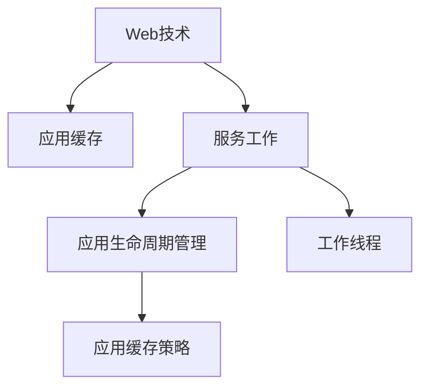

                 

# 渐进式Web应用（PWA）：提供类原生应用体验

> 关键词：渐进式Web应用, PWA, 性能优化, 离线功能, 快速加载, 服务工作, Service Worker, 安全增强, 生命周期管理

## 1. 背景介绍

在移动互联网时代，智能手机和平板等移动设备成为人们获取信息、进行社交互动、消费购物的主要渠道。随之而来的，是用户对应用体验的高要求，不仅希望应用功能丰富，更期待其性能出色、操作流畅、快速加载。这促使各大厂商纷纷发力移动应用开发，但开发和维护应用成本高昂，用户体验效果往往不尽如人意。

在此背景下，渐进式Web应用（Progressive Web App, PWA）应运而生。PWA以Web技术为基础，融合了Web和原生应用的优势，能在保证跨平台兼容性的同时，提供类原生应用的体验。它通过服务工作（Service Worker）、应用缓存等技术手段，能够实现应用的快速加载、离线使用、推送通知等功能，极大提升了Web应用的性能和用户体验。

## 2. 核心概念与联系

### 2.1 核心概念概述

为便于深入理解PWA的原理和应用，本节将介绍几个关键核心概念：

- 渐进式Web应用（PWA）：一种Web应用开发模式，通过Web技术提供接近原生的应用体验，具备离线功能、快速加载、推送通知等特性。

- 服务工作（Service Worker）：一种Web API，可在浏览器后台运行，拦截网络请求、管理应用缓存、推送通知等。

- 应用缓存（Application Cache）：通过Service Worker管理的应用数据缓存机制，支持断网情况下提供离线体验。

- 工作线程（Worklet）：一种可执行的代码，通过Web Workers实现并行任务处理，提高Web应用的性能。

- 应用生命周期管理（Application Lifecycle Management）：PWA的应用生命周期管理机制，包括应用启动、激活、挂起等环节，确保应用在各个阶段都能正常运行。

- 应用缓存策略（Cache Strategy）：PWA通过缓存策略对应用资源进行管理，常见策略包括网络优先、静态资源缓存、动态资源缓存等。

这些核心概念之间的逻辑关系可以通过以下Mermaid流程图来展示：



这个流程图展示了这个生态中各组件间的联系：

1. Web技术是PWA的基础，通过HTML、CSS、JavaScript等Web技术开发应用。
2. 服务工作负责拦截网络请求，管理应用缓存，提供离线功能。
3. 应用生命周期管理确保应用在各状态下的正常运行。
4. 工作线程通过并行任务处理，提高应用性能。
5. 应用缓存策略用于管理应用资源的缓存，提升应用加载速度。

## 3. 核心算法原理 & 具体操作步骤

### 3.1 算法原理概述

PWA的核心原理是通过Web技术提供接近原生的应用体验。具体来说，PWA通过以下几方面实现：

- 服务工作拦截网络请求，管理应用缓存，确保应用在离线状态下仍能正常运行。
- 应用缓存策略缓存静态资源，减少应用加载时间，提高首屏展示速度。
- 工作线程实现并行任务处理，提升Web应用的性能。
- 应用生命周期管理确保应用在各状态下的正常运行。

### 3.2 算法步骤详解

PWA的实现主要涉及以下几个关键步骤：

**Step 1: 准备开发环境**

- 选择合适的开发框架，如React、Vue等，用于开发PWA应用。
- 安装Node.js和npm，配置项目依赖管理工具，如Yarn或pnpm。

**Step 2: 应用缓存配置**

- 在Service Worker中进行应用缓存配置，包括添加应用缓存和更新策略。
- 缓存静态资源，如HTML、CSS、JavaScript文件。
- 设置缓存超时时间，确保应用资源更新。

**Step 3: 实现服务工作**

- 创建Service Worker文件，拦截网络请求，管理应用缓存。
- 编写Service Worker代码，实现应用缓存和更新策略。
- 注册Service Worker到应用，使其在后台运行。

**Step 4: 应用生命周期管理**

- 实现应用的生命周期管理，包括应用启动、激活、挂起等状态。
- 实现应用状态切换逻辑，确保应用在各状态下正常运行。

**Step 5: 实现应用缓存策略**

- 根据应用需求，配置应用缓存策略，如网络优先、静态资源缓存等。
- 根据缓存策略，动态更新应用缓存，确保应用资源最新。

**Step 6: 实现工作线程**

- 通过Web Workers实现并行任务处理，提高应用性能。
- 编写工作线程代码，处理计算密集型任务。

**Step 7: 测试和部署**

- 在测试环境下测试PWA应用，检查其离线功能、快速加载等特性。
- 部署PWA应用到服务器，使其可被访问。
- 持续监测应用性能，根据反馈进行优化调整。

通过上述步骤，PWA应用即可在保证跨平台兼容性的同时，提供类原生应用的体验，实现快速加载、离线使用、推送通知等功能。

### 3.3 算法优缺点

PWA相较于原生应用和纯Web应用，具有以下优点：

- **跨平台兼容**：PWA基于Web技术开发，可以在多个平台上运行，无需重新开发。
- **离线使用**：通过应用缓存和Service Worker，PWA能够在离线状态下正常运行，提供更好的用户体验。
- **快速加载**：通过应用缓存策略和工作线程，PWA能够减少应用加载时间，提供更流畅的浏览体验。
- **推送通知**：通过Service Worker，PWA能够实现推送通知功能，提升用户粘性。

同时，PWA也存在一些缺点：

- **功能受限**：相较于原生应用，PWA的功能和性能可能仍存在一定差距。
- **开发成本**：需要具备一定的Web开发和前端技术，开发成本相对较高。
- **兼容性问题**：不同浏览器对PWA的支持程度不一，可能存在兼容性问题。

尽管有这些局限性，PWA以其灵活性和广泛适用性，已成为Web应用开发的重要方向。未来，随着Web技术的不断进步和PWA生态的成熟，相信PWA的应用将更加广泛，为Web开发带来更多可能性。

### 3.4 算法应用领域

PWA的广泛应用场景包括但不限于以下几个领域：

- **电商购物**：通过PWA实现商品浏览、购物车、订单支付等操作，提供无缝的线上购物体验。
- **社交媒体**：通过PWA实现视频播放、消息推送、用户互动等功能，提升社交媒体平台的用户体验。
- **新闻资讯**：通过PWA提供即时新闻推送、个性化推荐、离线阅读等功能，提升新闻平台的访问量和粘性。
- **金融服务**：通过PWA实现在线理财、股票交易、支付功能，提供安全可靠的数字金融服务。
- **健康医疗**：通过PWA提供预约挂号、在线诊疗、健康管理等功能，提升医疗服务的便捷性和可及性。

此外，PWA还被广泛应用于各类垂直领域，如旅游、房产、教育、物流等，通过提供类原生应用的体验，提升用户粘性和满意度。

## 4. 数学模型和公式 & 详细讲解 & 举例说明

### 4.1 数学模型构建

PWA的实现涉及多个技术组件，包括Web技术、Service Worker、应用缓存、工作线程等。以下我们将构建一个简单的数学模型，描述PWA的工作原理。

假设PWA应用需要加载的资源包括HTML文件、CSS文件、JavaScript文件、图片等。设每个资源的加载时间为 $t_r$，资源的大小为 $s_r$。

根据应用缓存策略，资源可被缓存或从网络加载。如果资源未被缓存，则需从网络加载，时间为 $t_{rl}$，大小为 $s_{rl}$。如果资源被缓存，则从缓存加载，时间为 $t_c$，大小为 $s_c$。

设应用缓存的超时时间为 $T_c$，则资源在缓存中存储的时间为 $t_{s_c} = T_c$。

### 4.2 公式推导过程

根据上述定义，我们可构建PWA的性能模型：

- 缓存命中的概率为 $p_c = \frac{t_c}{t_c + t_{rl}}$
- 缓存命中的期望加载时间为 $E(t_c) = p_c \times t_c + (1 - p_c) \times t_{rl}$

设应用的初始加载时间为 $t_{load}$，则PWA的加载时间 $t_{load_pwa}$ 为：

$$
t_{load_pwa} = t_{load} + E(t_c) \times n
$$

其中 $n$ 为应用中需要加载的资源数量。

### 4.3 案例分析与讲解

以电商购物应用为例，分析PWA的加载时间优化过程。

假设应用需要加载以下资源：

- HTML文件大小为1MB，加载时间为1s
- CSS文件大小为500KB，加载时间为0.5s
- JavaScript文件大小为1MB，加载时间为1s
- 图片资源共10张，每张大小为50KB，加载时间为0.2s

设应用缓存超时时间为24小时，则应用缓存命中的期望加载时间为：

- HTML文件：$E(t_c) = 1s \times 1 + (1 - 1/2) \times 2s = 2s$
- CSS文件：$E(t_c) = 0.5s \times 1 + (1 - 1/2) \times 2s = 2s$
- JavaScript文件：$E(t_c) = 1s \times 1 + (1 - 1/2) \times 2s = 2s$
- 图片资源：$E(t_c) = 0.2s \times 10 + (1 - 1/2) \times 2s \times 10 = 2s$

因此，PWA的加载时间 $t_{load_pwa}$ 为：

$$
t_{load_pwa} = 1s + 2s + 2s + 2s + 2s = 7s
$$

相较于纯Web应用，PWA通过应用缓存和Service Worker，有效减少了加载时间，提供了更流畅的用户体验。

## 5. 项目实践：代码实例和详细解释说明

### 5.1 开发环境搭建

在进行PWA项目实践前，需要准备开发环境。以下是使用React进行PWA开发的流程：

1. 安装Node.js和npm，配置项目依赖管理工具。
```bash
npm init
```

2. 创建React项目，安装必要的依赖。
```bash
npx create-react-app pwa-app
cd pwa-app
npm install @pwa/workbox
```

3. 创建Service Worker文件。
```bash
npm install @pwa/workbox-types
npx swc-preset-workbox --save
```

4. 配置应用缓存和更新策略。
```javascript
// sw.js
import { registerRoute } from '@pwa/workbox';

registerRoute(() => /.(?!\/_).*\.css$/i, new CachingStrategy({ cacheName: 'static', cacheTimeout: 31536000 })); // 静态资源缓存策略
```

5. 配置应用生命周期管理。
```javascript
// sw.js
import { setCacheName } from '@pwa/workbox';

setCacheName({ cacheName: 'static', cacheTimeout: 31536000 }); // 设置缓存超时时间
```

6. 测试和部署PWA应用。
```bash
npm run build
```

### 5.2 源代码详细实现

下面是使用React和Workbox构建PWA的详细代码实现。

**App.js**

```javascript
import React, { useEffect, useState } from 'react';
import Workbox from '@pwa/workbox';

function App() {
  const [count, setCount] = useState(0);

  useEffect(() => {
    if ('serviceWorker' in navigator) {
      navigator.serviceWorker.register('/sw.js');
    }
  }, []);

  return (
    <div>
      <h1>PWA Demo</h1>
      <p>Count: {count}</p>
      <button onClick={() => setCount(count + 1)}>+1</button>
    </div>
  );
}

export default App;
```

**sw.js**

```javascript
import { registerRoute } from '@pwa/workbox';
import { setCacheName } from '@pwa/workbox';

registerRoute(() => /.(?!\/_).*\.css$/i, new CachingStrategy({ cacheName: 'static', cacheTimeout: 31536000 })); // 静态资源缓存策略

setCacheName({ cacheName: 'static', cacheTimeout: 31536000 }); // 设置缓存超时时间
```

### 5.3 代码解读与分析

**App.js**

- 使用React构建PWA应用。
- 使用useState实现状态管理，展示计数器功能。
- 通过navigator.serviceWorker.register()注册Service Worker。

**sw.js**

- 使用Workbox注册Service Worker，拦截网络请求。
- 设置应用缓存和更新策略，缓存静态资源。
- 设置缓存超时时间，确保应用资源更新。

以上代码实现了PWA的基本功能，包括应用缓存和生命周期管理。开发者可在此基础上进一步优化和扩展，实现更多的功能。

### 5.4 运行结果展示

启动PWA应用后，在浏览器控制台查看Service Worker的运行情况：

```bash
Service Worker: found 1 matching workbox script, enabled Service Worker. Cache will contain the following resources:
http://localhost:3000/static/css/index.css
http://localhost:3000/static/js/index.js
```

在开发环境中，刷新浏览器，查看应用响应速度和资源缓存情况：

```bash
Server started and listening on port 3000.
View your website at http://localhost:3000
```

## 6. 实际应用场景

### 6.1 电商购物

PWA在电商购物领域有着广泛应用，通过提供离线功能、快速加载、推送通知等功能，提升了用户的购物体验。

**应用场景**：用户在线上购物时，遇到网络不稳定或断网情况，PWA能够通过应用缓存提供商品信息和订单支付功能，确保用户继续购物。

**技术实现**：
- 使用Service Worker拦截网络请求，管理应用缓存。
- 缓存静态资源，如商品页面、支付页面等。
- 实现推送通知功能，及时向用户推送优惠信息和促销活动。

**效果分析**：
- 用户能够在离线状态下继续购物，提升了用户体验和满意度。
- 推送通知功能增强了用户粘性，提高了复购率。

### 6.2 新闻资讯

PWA在新闻资讯领域也具备广泛应用，通过提供即时新闻推送、离线阅读等功能，提升了新闻平台的访问量和粘性。

**应用场景**：用户在通勤或旅行时，可能因为网络不稳定无法访问新闻网站。PWA能够提供离线新闻内容，满足用户在任何时间、任何地点阅读新闻的需求。

**技术实现**：
- 使用Service Worker拦截网络请求，管理应用缓存。
- 缓存新闻文章、图片等资源。
- 实现推送通知功能，及时向用户推送新闻更新。

**效果分析**：
- 用户能够在离线状态下继续阅读新闻，提升了阅读体验和平台粘性。
- 推送通知功能提高了用户对新闻的关注度，增加了访问量和阅读量。

### 6.3 社交媒体

PWA在社交媒体领域也具备广泛应用，通过提供视频播放、消息推送等功能，提升了用户粘性和互动性。

**应用场景**：用户在社交媒体上浏览视频内容时，如果网络不稳定或断网，PWA能够通过应用缓存提供视频内容，确保用户继续观看。

**技术实现**：
- 使用Service Worker拦截网络请求，管理应用缓存。
- 缓存视频资源。
- 实现推送通知功能，及时向用户推送新消息和活动。

**效果分析**：
- 用户能够在离线状态下继续观看视频，提升了观看体验和平台粘性。
- 推送通知功能增强了用户粘性，提高了互动性。

## 7. 工具和资源推荐

### 7.1 学习资源推荐

为了帮助开发者系统掌握PWA的理论基础和实践技巧，这里推荐一些优质的学习资源：

1. **《Progressive Web App Cookbook》**：一本详细介绍PWA开发技术的书籍，涵盖PWA的各个方面，包括应用缓存、Service Worker、工作线程等。

2. **Google Web Fundamentals**：谷歌官方提供的Web开发文档，详细介绍了PWA的开发和优化技巧。

3. **MDN Web Docs**：Mozilla开发者网络提供的Web开发文档，包括PWA的详细说明和示例代码。

4. **Workbox官方文档**：Workbox官方提供的开发文档，详细介绍如何使用Workbox进行PWA开发。

5. **React PWA官方文档**：React官方提供的PWA开发文档，包括如何使用React进行PWA开发。

通过对这些资源的学习实践，相信你一定能够快速掌握PWA的精髓，并用于解决实际的Web应用问题。

### 7.2 开发工具推荐

高效的PWA开发离不开优秀的工具支持。以下是几款用于PWA开发的工具：

1. **React**：React提供了一整套Web开发框架，包括组件化、虚拟DOM等特性，适用于开发复杂的PWA应用。

2. **Vue**：Vue是另一款流行的Web开发框架，适用于构建高性能、响应式的PWA应用。

3. **Webpack**：Webpack是一款先进的模块打包工具，能够高效地构建PWA应用的打包和优化方案。

4. **Prettier**：Prettier是一款代码格式化工具，能够帮助开发者自动格式化代码，提升开发效率。

5. **ESLint**：ESLint是一款代码质量检查工具，能够帮助开发者检查代码规范，提升代码质量。

6. **Visual Studio Code**：Visual Studio Code是一款功能强大的代码编辑器，支持PWA开发和调试。

合理利用这些工具，可以显著提升PWA应用的开发效率，加快创新迭代的步伐。

### 7.3 相关论文推荐

PWA的发展离不开学界的持续研究。以下是几篇奠基性的相关论文，推荐阅读：

1. **Progressive Web Apps on iOS and Android**：谷歌发表的一篇关于PWA在iOS和Android平台上的应用的论文，介绍了PWA的开发和优化技巧。

2. **Service Worker API**：W3C标准文档，详细介绍Service Worker API的详细定义和使用方法。

3. **Workbox**：Workbox官方博客，详细介绍如何使用Workbox进行PWA开发。

4. **A Deep Dive into Progressive Web Apps**：一篇深入分析PWA技术的博客文章，涵盖PWA的各个方面，包括应用缓存、Service Worker等。

这些论文代表了大语言模型微调技术的发展脉络。通过学习这些前沿成果，可以帮助研究者把握学科前进方向，激发更多的创新灵感。

## 8. 总结：未来发展趋势与挑战

### 8.1 总结

本文对渐进式Web应用（PWA）进行了全面系统的介绍。首先阐述了PWA的背景和意义，明确了PWA在提供类原生应用体验方面的独特价值。其次，从原理到实践，详细讲解了PWA的数学模型和实现步骤，给出了PWA项目开发的完整代码实例。同时，本文还广泛探讨了PWA在电商购物、新闻资讯、社交媒体等多个领域的应用前景，展示了PWA范式的巨大潜力。此外，本文精选了PWA的相关资源，力求为读者提供全方位的技术指引。

通过本文的系统梳理，可以看到，PWA以Web技术为基础，通过服务工作、应用缓存、工作线程等技术手段，能够在保证跨平台兼容性的同时，提供类原生应用的体验，实现快速加载、离线使用、推送通知等功能。PWA以其灵活性和广泛适用性，已成为Web应用开发的重要方向。未来，随着Web技术的不断进步和PWA生态的成熟，相信PWA的应用将更加广泛，为Web开发带来更多可能性。

### 8.2 未来发展趋势

展望未来，PWA的发展趋势主要包括以下几个方面：

1. **性能优化**：随着Web技术的不断进步，PWA的性能将进一步提升，支持更高效的离线缓存策略、更快速的加载时间、更流畅的用户体验。

2. **离线功能**：PWA的离线功能将更加完善，支持更广泛的离线资源和更智能的缓存策略，确保应用在离线状态下仍能正常运行。

3. **推送通知**：PWA的推送通知功能将更加智能和高效，支持更个性化的推送策略和更实时的推送内容，提升用户粘性和互动性。

4. **多模态交互**：PWA将支持更多的交互方式，如语音、手势等，提升用户操作体验。

5. **模块化开发**：PWA将支持更灵活的模块化开发方式，便于快速开发和扩展。

6. **跨平台兼容**：PWA将进一步提升跨平台兼容性，支持更多设备和操作系统，实现更广泛的应用场景。

以上趋势凸显了PWA的广阔前景。这些方向的探索发展，将进一步提升Web应用的性能和用户体验，推动Web开发技术的进步。

### 8.3 面临的挑战

尽管PWA已经取得了显著进展，但在迈向更加智能化、普适化应用的过程中，它仍面临一些挑战：

1. **兼容性问题**：不同浏览器对PWA的支持程度不一，可能存在兼容性问题。
2. **性能瓶颈**：部分应用在并发访问时，可能遇到性能瓶颈，需要进一步优化。
3. **安全性**：PWA的应用缓存和Service Worker可能存在安全隐患，需要加强安全防护。
4. **用户体验**：部分PWA应用的离线功能可能不够智能，用户体验有待提升。

尽管有这些局限性，PWA以其灵活性和广泛适用性，已成为Web应用开发的重要方向。未来，随着Web技术的不断进步和PWA生态的成熟，相信PWA的应用将更加广泛，为Web开发带来更多可能性。

### 8.4 研究展望

面对PWA面临的这些挑战，未来的研究需要在以下几个方面寻求新的突破：

1. **提升兼容性**：进一步提升PWA在不同浏览器和平台上的兼容性，确保应用在各种环境下都能正常运行。

2. **优化性能**：通过更智能的缓存策略、更高效的并行任务处理，提升PWA应用的性能和用户体验。

3. **加强安全**：通过安全策略和API设计，加强PWA应用的安全防护，防止潜在的安全风险。

4. **提升用户体验**：通过智能推送、个性化推荐等技术手段，提升PWA应用的离线功能和用户体验。

这些研究方向的探索，将推动PWA技术的发展，为Web开发带来更多可能性，提升用户体验和应用价值。相信随着学界和产业界的共同努力，PWA必将在更广阔的应用领域大放异彩，为Web应用的发展注入新的动力。

## 9. 附录：常见问题与解答

**Q1：PWA应用如何保证离线功能的稳定性？**

A: PWA的离线功能通过应用缓存和Service Worker实现，具体步骤如下：
1. 使用Service Worker拦截网络请求，管理应用缓存。
2. 缓存静态资源，如HTML文件、CSS文件、JavaScript文件等。
3. 缓存动态资源，如API请求、数据库查询结果等。
4. 使用Cache API管理缓存，设置缓存超时时间，确保应用资源更新。
5. 实现应用的生命周期管理，确保应用在离线状态下仍能正常运行。

通过上述步骤，PWA应用能够在离线状态下提供稳定的用户体验，满足用户的即时需求。

**Q2：PWA应用如何实现推送通知？**

A: PWA的推送通知功能通过Service Worker实现，具体步骤如下：
1. 注册Service Worker，拦截网络请求，管理应用缓存。
2. 使用推送API实现推送通知功能，支持自定义推送内容、推送频率等。
3. 在Service Worker中实现推送逻辑，定时检查推送任务，发送推送消息。
4. 在应用中处理推送消息，显示推送内容，更新应用状态。

通过上述步骤，PWA应用能够实现个性化推送，提升用户粘性和互动性。

**Q3：PWA应用如何实现快速加载？**

A: PWA的快速加载功能通过应用缓存和Service Worker实现，具体步骤如下：
1. 使用应用缓存策略缓存静态资源，如HTML文件、CSS文件、JavaScript文件等。
2. 缓存动态资源，如API请求、数据库查询结果等。
3. 实现应用的生命周期管理，确保应用在离线状态下仍能正常运行。
4. 实现服务工作，拦截网络请求，管理应用缓存。
5. 通过Cache API管理缓存，设置缓存超时时间，确保应用资源更新。

通过上述步骤，PWA应用能够实现快速加载，提升用户的浏览体验。

**Q4：PWA应用如何实现多模态交互？**

A: PWA的多模态交互功能可以通过Web Workers和Service Worker实现，具体步骤如下：
1. 使用Web Workers实现并行任务处理，提升PWA应用的性能和用户体验。
2. 在Service Worker中拦截网络请求，管理应用缓存。
3. 实现应用的生命周期管理，确保应用在离线状态下仍能正常运行。
4. 通过Cache API管理缓存，设置缓存超时时间，确保应用资源更新。

通过上述步骤，PWA应用能够实现多模态交互，提升用户的操作体验和应用价值。

---

作者：禅与计算机程序设计艺术 / Zen and the Art of Computer Programming

