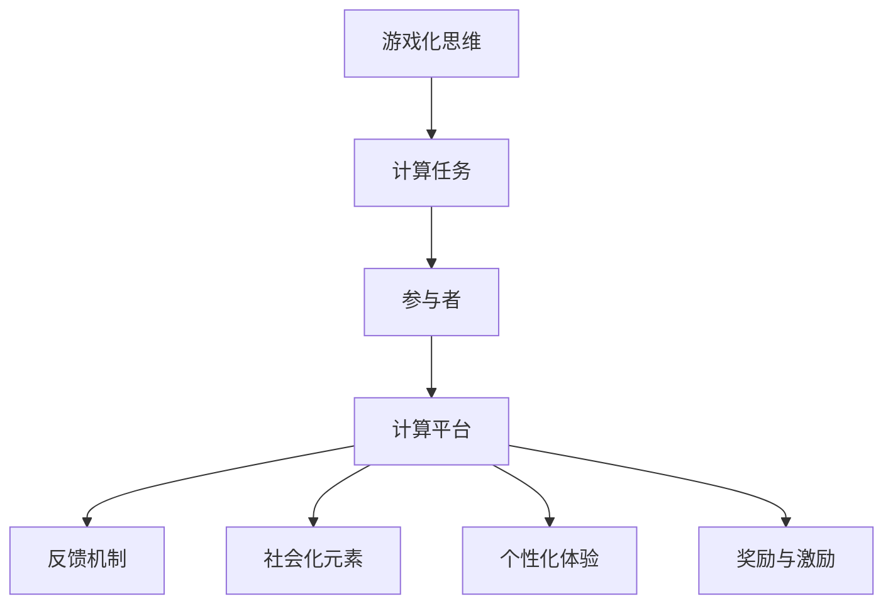

                 

# 游戏化思维：让参与人类计算变得更有趣

## 1. 背景介绍

### 1.1 问题由来
随着计算技术的飞速发展，计算不再是一项单纯的任务，而逐渐成为一项需要人类参与和协作的复杂活动。尤其是在大数据、复杂系统仿真、人工智能等高复杂度领域，计算任务的完成越来越依赖于人机协同。然而，人类的计算参与度往往不高，这成为了制约技术发展的一大瓶颈。如何通过游戏化手段激发人们的计算参与热情，提升人机协作的效率，成为了当前计算领域的一大研究课题。

### 1.2 问题核心关键点
游戏化思维的核心在于通过设计类似游戏的方式来吸引人类参与计算任务，使其在互动过程中获得乐趣和成就感。具体而言，关键点包括：

- **任务设计**：将计算任务设计成有趣、具有挑战性的游戏，以激发参与者的兴趣。
- **反馈机制**：及时给予参与者正向反馈，增强其持续参与的意愿。
- **社会化元素**：引入竞争、合作等社会化元素，提升参与者之间的互动和协作。
- **个性化体验**：根据参与者的技能和偏好，提供个性化的任务和难度设置。
- **奖励与激励**：通过积分、排名、徽章等形式，提供激励机制，促进持续参与。

游戏化思维不仅在商业领域得到广泛应用，如电子游戏、社交媒体等，也被引入到科研和工程领域，如数据分析、科学计算、工程仿真等，提高了计算任务的效率和质量。

### 1.3 问题研究意义
研究游戏化思维的计算参与机制，对于推动计算技术的普及和应用，提升人机协同的效率，具有重要意义：

1. **降低参与门槛**：通过游戏化设计，使得计算任务更加易于理解和参与，降低技术门槛。
2. **提高参与度**：游戏化元素的设计，使得计算任务变得有趣，吸引更多人参与其中。
3. **增强协同效果**：社会化元素的引入，提升了参与者之间的协作和互动，促进了共同进步。
4. **优化资源分配**：通过激励机制，引导资源更高效地分配，提升整体计算能力。
5. **提升用户体验**：个性化体验的设计，使得计算任务更贴合用户需求，提升满意度。
6. **加速技术落地**：游戏化思维的应用，加速了计算技术在各行业中的普及和应用。

## 2. 核心概念与联系

### 2.1 核心概念概述

为更好地理解游戏化思维在计算参与中的应用，本节将介绍几个密切相关的核心概念：

- **游戏化思维**：通过设计类似游戏的方式来吸引人类参与，以增强计算任务的趣味性和参与度。
- **计算任务**：需要人类参与解决的复杂问题，如数据分析、模拟仿真、算法优化等。
- **参与者**：参与计算任务的人员，可以是科研人员、工程师、学生、志愿者等。
- **计算平台**：提供计算任务和交互环境的技术平台，如在线协作平台、编程社区、科研数据库等。
- **反馈机制**：计算平台提供的正向反馈，如奖励、积分、徽章等，以增强参与者持续参与的意愿。
- **社会化元素**：计算任务中引入的竞争、合作等元素，以提升参与者之间的互动和协作。
- **个性化体验**：根据参与者的技能和偏好，提供个性化的任务和难度设置，以提升参与者的体验和满意度。
- **奖励与激励**：通过积分、排名、徽章等形式，提供激励机制，促进持续参与和贡献。

这些核心概念之间的逻辑关系可以通过以下Mermaid流程图来展示：



这个流程图展示了一系列的关联过程：

1. **游戏化思维**：设计类似游戏的方式来吸引参与者。
2. **计算任务**：参与者需要解决的复杂问题。
3. **参与者**：完成任务的人员。
4. **计算平台**：提供任务的交互环境。
5. **反馈机制**：增强参与者持续参与的激励。
6. **社会化元素**：提升互动和协作。
7. **个性化体验**：根据参与者需求设计任务。
8. **奖励与激励**：促进持续参与和贡献。

这些概念共同构成了游戏化思维在计算参与中的应用框架，使得复杂计算任务变得有趣和可接受。

## 3. 核心算法原理 & 具体操作步骤
### 3.1 算法原理概述

基于游戏化思维的计算参与机制，其实质上是一个通过设计游戏规则和激励机制，吸引和引导人类参与计算任务的过程。其核心思想是：通过游戏化的设计，将计算任务转化为具有挑战性和趣味性的游戏，激发参与者的兴趣和参与热情，同时通过正向反馈和激励机制，增强其持续参与的意愿。

形式化地，假设计算任务为 $T$，参与者集合为 $P$，计算平台为 $E$，则游戏化参与过程可以表示为：

$$
P = \mathop{\arg\min}_{P} \sum_{t \in T} \sum_{p \in P} \mathcal{L}(t,p,E)
$$

其中 $\mathcal{L}$ 为参与者在任务 $t$ 上的损失函数，衡量其完成任务的质量和效率。通过优化参与者集合 $P$ 和平台 $E$，最小化整体损失函数，使得参与者在参与过程中获得最优的体验和激励。

### 3.2 算法步骤详解

基于游戏化思维的计算参与机制，通常包括以下几个关键步骤：

**Step 1: 设计计算任务** 
- 根据计算任务的特点，设计有趣、具有挑战性的游戏规则。
- 将计算任务分解为若干子任务，使其可玩性强，且能够逐步提升难度。
- 引入积分、排名、徽章等激励机制，增强参与者的动力。

**Step 2: 开发计算平台** 
- 开发或选择支持计算任务的游戏化平台，如在线协作平台、编程社区等。
- 实现任务提交、反馈获取、评分系统等功能模块。
- 确保平台具备良好的用户体验，方便参与者操作和协作。

**Step 3: 引入社会化元素** 
- 在任务中引入竞争、合作等社会化元素，提升参与者之间的互动和协作。
- 设立团队合作任务，鼓励参与者之间交流和协作。
- 提供排行榜、比拼等功能，增加参与者的竞争意识。

**Step 4: 实施个性化体验** 
- 根据参与者的技能和偏好，提供个性化的任务和难度设置。
- 使用推荐系统，推送适合参与者的任务和挑战。
- 根据参与者的表现，动态调整任务难度和奖励机制。

**Step 5: 运行和优化** 
- 在平台上发布计算任务，吸引参与者参与。
- 实时监测参与者的表现和反馈，优化任务和平台设计。
- 持续更新任务和规则，保持参与者的兴趣和动力。

### 3.3 算法优缺点

基于游戏化思维的计算参与机制，具有以下优点：
1. 提高参与度：通过游戏化设计，使计算任务变得有趣，吸引更多人参与。
2. 增强协同效果：社会化元素的引入，提升了参与者之间的互动和协作。
3. 降低门槛：设计易于理解和参与的游戏规则，降低技术门槛。
4. 提升效率：通过激励机制，引导资源更高效地分配，提升整体计算能力。
5. 优化资源分配：通过激励机制，引导资源更高效地分配，提升整体计算能力。

同时，该方法也存在一定的局限性：
1. 需要精心设计：游戏化设计需要耗费大量时间和精力，尤其是任务的分解和规则的设定。
2. 维护成本高：平台的持续维护和优化需要投入大量人力和资源。
3. 多样性不足：不同任务的游戏化设计可能存在差异，需要针对性地设计和开发。
4. 激励机制复杂：如何设计和实现合理的激励机制，还需进一步研究和实践。

尽管存在这些局限性，但就目前而言，游戏化思维的应用仍然是提升计算参与度的重要手段。未来相关研究的重点在于如何进一步降低设计成本，提高平台的灵活性和扩展性，同时兼顾激励机制的合理性和可持续性。

### 3.4 算法应用领域

基于游戏化思维的计算参与机制，已经在众多领域得到应用，包括但不限于：

- **科学研究**：在复杂系统仿真、生物信息学、天文学等领域，通过游戏化任务设计，吸引科研人员参与数据分析和模拟。
- **工程技术**：在工程仿真、软件开发、机械设计等领域，通过游戏化任务，提升工程师的设计和开发能力。
- **教育培训**：在在线教育、职业培训、技能提升等领域，通过游戏化任务，提升学生的学习兴趣和效果。
- **医疗健康**：在电子病历分析、健康数据分析等领域，通过游戏化任务，增强医生和研究者的分析能力。
- **公共服务**：在城市管理、社会治理、环境保护等领域，通过游戏化任务，提升公众的参与度和环保意识。

此外，在游戏化思维的应用中，也有一些成功的案例，如Zooniverse平台、Amazon Mechanical Turk等，通过将计算任务转化为有趣的游戏，成功吸引了大量志愿者参与，提升了整体计算能力和数据收集质量。

## 4. 数学模型和公式 & 详细讲解 & 举例说明
### 4.1 数学模型构建

为了更好地理解游戏化思维在计算参与中的应用，本节将使用数学语言对游戏化参与机制进行严格的刻画。

假设计算任务为 $T$，参与者为 $P$，计算平台为 $E$。参与者在任务 $t$ 上的表现可以用向量 $x_t \in \mathbb{R}^n$ 表示，其中 $n$ 为任务特征维度。参与者在任务 $t$ 上的表现向量 $x_t$ 与平台 $E$ 的反馈向量 $y_t \in \mathbb{R}^m$ 之间的损失函数 $\ell(x_t,y_t)$ 可以表示为：

$$
\ell(x_t,y_t) = \sum_{i=1}^m w_i \cdot (y_{ti} - f(x_{ti}))
$$

其中 $f$ 为模型的预测函数，$w_i$ 为反馈向量的权重，$i$ 为反馈向量的下标。

参与者在任务 $t$ 上的得分 $s_t$ 可以表示为：

$$
s_t = \sum_{i=1}^m w_i \cdot f(x_{ti}) - \sum_{i=1}^m w_i \cdot \log f(x_{ti})
$$

参与者在平台 $E$ 上的总得分 $S$ 可以表示为：

$$
S = \sum_{t \in T} s_t
$$

根据平台 $E$ 和任务 $T$ 的特点，设计游戏化任务和激励机制，可以通过优化参与者集合 $P$ 和平台 $E$，最小化整体损失函数，使得参与者在参与过程中获得最优的体验和激励。

### 4.2 公式推导过程

以下我们以在线学习平台为例，推导游戏化参与机制的数学模型和相关公式。

假设在线学习平台有 $M$ 门课程，每门课程 $j$ 的内容可以用向量 $x_{j} \in \mathbb{R}^n$ 表示，学生 $i$ 在课程 $j$ 上的表现向量 $x_{ij} \in \mathbb{R}^n$ 与平台的反馈向量 $y_{ij} \in \mathbb{R}^m$ 之间的损失函数 $\ell(x_{ij},y_{ij})$ 可以表示为：

$$
\ell(x_{ij},y_{ij}) = \sum_{i=1}^m w_i \cdot (y_{ij} - f(x_{ij}))
$$

其中 $f$ 为模型的预测函数，$w_i$ 为反馈向量的权重，$i$ 为反馈向量的下标。

学生 $i$ 在课程 $j$ 上的得分 $s_{ij}$ 可以表示为：

$$
s_{ij} = \sum_{i=1}^m w_i \cdot f(x_{ij}) - \sum_{i=1}^m w_i \cdot \log f(x_{ij})
$$

学生在平台 $E$ 上的总得分 $S$ 可以表示为：

$$
S = \sum_{j \in J} \sum_{i=1}^N s_{ij}
$$

其中 $N$ 为学生总数，$J$ 为课程集合。

为了吸引学生参与学习，平台 $E$ 设计了以下游戏化激励机制：
- **积分奖励**：学生每完成一门课程并获得一定分数，系统给予积分奖励。
- **排行榜显示**：平台展示学习积分排行榜，激励学生通过积分排名，获得荣誉和奖励。
- **课程任务**：平台将课程任务分解为多个子任务，学生完成每个子任务后获得积分。
- **团队合作**：学生可以组队完成课程任务，通过团队合作提升学习效果，获取更多积分。

通过这些游戏化激励机制，平台可以最大化学生的学习兴趣和参与度，提升整体学习效果。

### 4.3 案例分析与讲解

**案例分析：Zooniverse平台**

Zooniverse 是一个大规模科学实验协作平台，通过将科学任务转化为有趣的游戏，成功吸引了大量志愿者参与。平台的计算任务包括图像分类、生物数据标注等，每项任务都被设计成有趣的小游戏，吸引了来自全球的科学家和爱好者参与。

具体而言，Zooniverse 的设计包括以下几个关键点：
1. **任务分解**：将复杂的科学任务分解为简单易行的游戏任务，如图像分类、标注物种等。
2. **积分奖励**：完成每项任务后，系统给予积分奖励，鼓励参与者继续完成任务。
3. **排行榜显示**：平台展示志愿者完成任务的排行榜，激励参与者提高效率和准确度。
4. **社会化元素**：参与者可以组队完成任务，通过团队协作提升效果，获取更多积分。
5. **个性化体验**：根据参与者的偏好和技能，推送适合的任务，提升参与者的体验和满意度。

通过这些设计，Zooniverse 平台不仅成功地吸引了大量志愿者参与，还在多个科学领域取得了显著成果，如天文观测、生物分类等。

## 5. 项目实践：代码实例和详细解释说明
### 5.1 开发环境搭建

在进行游戏化思维的计算参与实践前，我们需要准备好开发环境。以下是使用Python进行Flask开发的环境配置流程：

1. 安装Anaconda：从官网下载并安装Anaconda，用于创建独立的Python环境。

2. 创建并激活虚拟环境：
```bash
conda create -n flask-env python=3.8 
conda activate flask-env
```

3. 安装Flask：
```bash
pip install flask
```

4. 安装Werkzeug：
```bash
pip install werkzeug
```

5. 安装SQLAlchemy：
```bash
pip install sqlalchemy
```

6. 安装Flask-RESTful：
```bash
pip install flask-restful
```

7. 安装Flask-SocketIO：
```bash
pip install flask-socketio
```

8. 安装Jinja2：
```bash
pip install jinja2
```

完成上述步骤后，即可在`flask-env`环境中开始开发实践。

### 5.2 源代码详细实现

这里我们以在线学习平台为例，给出使用Flask框架实现游戏化参与机制的代码实现。

首先，定义课程和学生的数据模型：

```python
from sqlalchemy import create_engine, Column, Integer, String, Float
from sqlalchemy.ext.declarative import declarative_base
from sqlalchemy.orm import sessionmaker

Base = declarative_base()

class Course(Base):
    __tablename__ = 'courses'
    id = Column(Integer, primary_key=True)
    name = Column(String(50))
    description = Column(String(200))
    duration = Column(Integer)
    score = Column(Float)
    tasks = Column(String(200))

class Student(Base):
    __tablename__ = 'students'
    id = Column(Integer, primary_key=True)
    name = Column(String(50))
    email = Column(String(50))
    scores = Column(String(200))
    teams = Column(String(200))

engine = create_engine('sqlite:///:memory:')
Base.metadata.create_all(engine)
Session = sessionmaker(bind=engine)
```

然后，定义学生和课程的交互逻辑：

```python
from flask import Flask, render_template, request
from flask_restful import Resource, Api
from flask_socketio import SocketIO

app = Flask(__name__)
api = Api(app)
socketio = SocketIO(app)

# 添加课程任务
@app.route('/add_task', methods=['POST'])
def add_task():
    data = request.get_json()
    course_id = data['course_id']
    task_name = data['task_name']
    task_description = data['task_description']
    task_score = data['task_score']
    course = session.query(Course).filter_by(id=course_id).first()
    tasks = course.tasks
    tasks += f"{task_name}:{task_score}:{task_description}"
    course.tasks = tasks
    session.commit()
    return 'Task added successfully'

# 获取课程任务
@app.route('/get_tasks', methods=['GET'])
def get_tasks():
    course_id = request.args.get('course_id')
    course = session.query(Course).filter_by(id=course_id).first()
    tasks = course.tasks
    return tasks

# 提交任务
@app.route('/submit_task', methods=['POST'])
def submit_task():
    data = request.get_json()
    course_id = data['course_id']
    task_id = data['task_id']
    task_score = data['task_score']
    student = session.query(Student).filter_by(id=data['student_id']).first()
    scores = student.scores
    scores += f"{task_id}:{task_score}"
    student.scores = scores
    session.commit()
    return 'Task submitted successfully'

# 获取学生积分
@app.route('/get_score', methods=['GET'])
def get_score():
    student_id = request.args.get('student_id')
    student = session.query(Student).filter_by(id=student_id).first()
    scores = student.scores
    return scores

# 排行榜展示
@app.route('/ranking', methods=['GET'])
def ranking():
    students = session.query(Student).order_by(Student.score.desc()).all()
    return render_template('ranking.html', students=students)

# 实时更新积分
@app.route('/update_score', methods=['POST'])
def update_score():
    data = request.get_json()
    student_id = data['student_id']
    task_id = data['task_id']
    task_score = data['task_score']
    student = session.query(Student).filter_by(id=student_id).first()
    scores = student.scores
    scores += f"{task_id}:{task_score}"
    student.scores = scores
    session.commit()
    return 'Score updated successfully'

# 显示排行榜
@app.route('/show_ranking', methods=['GET'])
def show_ranking():
    students = session.query(Student).order_by(Student.score.desc()).all()
    return render_template('show_ranking.html', students=students)

# 创建Flask-RESTful资源
class TaskResource(Resource):
    def get(self):
        tasks = get_tasks()
        return tasks

    def post(self):
        return add_task()

class ScoreResource(Resource):
    def get(self):
        scores = get_score()
        return scores

class RankingResource(Resource):
    def get(self):
        ranking = ranking()
        return ranking

# 创建Flask-RESTful API
api.add_resource(TaskResource, '/tasks')
api.add_resource(ScoreResource, '/scores')
api.add_resource(RankingResource, '/ranking')

# 创建Flask-SocketIO事件处理
@socketio.on('submit_task')
def handle_submit_task(event):
    submit_task(event['course_id'], event['task_id'], event['task_score'])

# 启动Flask应用
if __name__ == '__main__':
    app.run(debug=True)
```

以上代码实现了Flask应用的基本框架，包括课程和学生的数据模型、交互逻辑和游戏化激励机制。开发者可以根据具体需求，进一步扩展和优化。

### 5.3 代码解读与分析

让我们再详细解读一下关键代码的实现细节：

**Flask应用的基本框架**：
- 创建SQLite数据库，定义课程和学生的数据模型。
- 定义Flask应用的路由和事件处理函数。
- 创建Flask-RESTful资源，实现数据的增删改查。
- 创建Flask-SocketIO事件处理，实时更新学生的积分和排行榜。

**数据库模型定义**：
- `Course`模型：定义课程的基本信息，包括课程名称、描述、时长、评分等。
- `Student`模型：定义学生的基本信息，包括学生姓名、邮箱、积分等。

**路由函数实现**：
- `/add_task`：添加课程任务，将任务信息保存到数据库。
- `/get_tasks`：获取课程任务，返回数据库中存储的任务信息。
- `/submit_task`：提交任务，将学生积分保存到数据库。
- `/get_score`：获取学生积分，返回数据库中存储的学生积分信息。
- `/ranking`：展示排行榜，按积分排序，返回排行榜信息。
- `/update_score`：实时更新学生积分，按提交任务的信息更新积分。
- `/show_ranking`：展示实时排行榜，按积分排序，返回排行榜信息。

**Flask-RESTful资源**：
- `TaskResource`：定义任务资源，包括获取任务和添加任务。
- `ScoreResource`：定义积分资源，包括获取积分。
- `RankingResource`：定义排行榜资源，包括展示排行榜。

**Flask-SocketIO事件处理**：
- `handle_submit_task`：定义事件处理函数，实时处理提交任务的事件，更新学生积分和排行榜。

可以看出，通过Flask框架的简洁设计，开发者可以很方便地实现游戏化参与机制的各个环节，包括任务提交、积分更新、排行榜展示等。同时，通过SocketIO的实时传输机制，可以实现任务提交和积分更新的实时更新，进一步提升用户体验。

## 6. 实际应用场景
### 6.1 智能城市管理

在智能城市管理中，通过游戏化思维可以将复杂的决策任务转化为有趣的计算参与活动，提升市民的参与度和满意度。具体而言，可以设计如下场景：

1. **实时交通管理**：通过实时数据分析，识别交通拥堵区域和原因。市民可以通过手机应用参与数据分析，提交自己的观察和判断，帮助优化交通管理决策。
2. **环境监测**：通过空气质量、水质等数据的实时分析，市民可以参与环境监测任务，提交数据和预测结果，获取积分和奖励。
3. **公共设施管理**：通过市民对公共设施的使用情况进行实时反馈，优化公共设施的运营和管理。市民可以参与设施使用情况的调查，获取积分和荣誉。

通过这些游戏化设计，不仅可以提升市民的参与度，还能增强市民对城市管理的理解和支持，实现人机协同的智能城市管理。

### 6.2 环境保护行动

环境保护行动需要大量的数据收集和分析，如何吸引公众参与环境保护，是一个重要的挑战。通过游戏化思维，可以设计一些有趣的活动，激励公众参与环境保护任务：

1. **环保任务竞赛**：设计各种有趣的环保任务，如垃圾分类、节能减排等，吸引公众参与。通过积分奖励、排行榜展示等方式，激励公众积极参与环保任务。
2. **数据收集竞赛**：通过设计有趣的数据收集任务，如空气质量监测、水质分析等，吸引公众参与。公众可以通过手机应用提交数据，获取积分和奖励，提升公众对环境保护的认识和参与度。
3. **知识竞赛**：通过设计环保知识竞赛，提升公众的环保意识和知识水平。通过问答、抢答等方式，吸引公众参与，获取积分和奖励。

这些游戏化活动不仅能够提升公众的环保意识和参与度，还能收集大量的数据，为环境保护提供有力支持。

### 6.3 科学实验研究

在科学研究中，通过游戏化思维可以将复杂的实验任务转化为有趣的计算参与活动，吸引科研人员参与实验数据分析和设计。具体而言，可以设计如下场景：

1. **数据标注竞赛**：通过设计有趣的数据标注任务，如图像分类、物种标注等，吸引科研人员参与。通过积分奖励、排行榜展示等方式，激励科研人员积极参与数据标注任务。
2. **实验设计竞赛**：通过设计有趣的实验设计任务，如科学实验方案设计、数据挖掘任务等，吸引科研人员参与。通过积分奖励、排行榜展示等方式，激励科研人员积极参与实验设计任务。
3. **实验结果分析**：通过设计有趣的实验结果分析任务，如数据分析、结果验证等，吸引科研人员参与。通过积分奖励、排行榜展示等方式，激励科研人员积极参与实验结果分析任务。

通过这些游戏化设计，不仅可以提升科研人员的参与度，还能加速科学研究的进程，推动科学研究的创新和发展。

## 7. 工具和资源推荐
### 7.1 学习资源推荐

为了帮助开发者系统掌握游戏化思维在计算参与中的应用，这里推荐一些优质的学习资源：

1. 《游戏化设计：让计算参与变得有趣》系列博文：由游戏化设计专家撰写，深入浅出地介绍了游戏化设计的基本原理和实践技巧。

2. 《计算参与设计与实践》课程：斯坦福大学开设的计算参与设计课程，有Lecture视频和配套作业，带你入门计算参与设计的基本概念和经典案例。

3. 《游戏化设计实战》书籍：Game Designer的著作，全面介绍了游戏化设计的工具、技术和方法，是游戏化思维应用的重要参考。

4. Flask官方文档：Flask框架的官方文档，提供了丰富的API和模板库，是游戏化思维应用开发的必备资料。

5. SocketIO官方文档：SocketIO框架的官方文档，提供了实时通信的详细讲解和样例代码，是游戏化应用实时通信的必备资源。

通过对这些资源的学习实践，相信你一定能够快速掌握游戏化思维的精髓，并用于解决实际的计算参与问题。
###  7.2 开发工具推荐

高效的开发离不开优秀的工具支持。以下是几款用于游戏化思维计算参与开发的常用工具：

1. Flask：基于Python的开源Web框架，简单易用，适合快速迭代研究。

2. SocketIO：实时通信的Web框架，提供高效的WebSocket通信支持，适合游戏化应用的数据实时传输。

3. SQLAlchemy：Python ORM库，提供数据库操作的高级抽象，适合游戏化应用的数据管理和存储。

4. Jinja2：Python的模板引擎，提供强大的模板渲染功能，适合游戏化应用的页面生成和展示。

5. Pygame：Python的图形游戏库，提供丰富的游戏设计和开发工具，适合游戏化应用的设计和开发。

6. Pyglet：Python的游戏开发库，提供图形渲染和游戏开发支持，适合游戏化应用的设计和开发。

合理利用这些工具，可以显著提升游戏化思维计算参与任务的开发效率，加快创新迭代的步伐。

### 7.3 相关论文推荐

游戏化思维的计算参与技术源于学界的持续研究。以下是几篇奠基性的相关论文，推荐阅读：

1. Gamification Design Principles and Practices（游戏化设计原理与实践）：Nicholas Lauk和Martin D Broadcast，系统总结了游戏化设计的核心原理和实践方法，为游戏化应用提供了理论基础。

2. How to Measure Success in Gamification（如何评估游戏化设计的成功）：Richard M. Kemp，介绍了游戏化设计评估的关键指标和方法，帮助开发者评估游戏化设计的有效性。

3. Gamification as a Behavioral Interface Design Technique（游戏化作为行为界面设计技术）：Joseph Thompson，探讨了游戏化在行为界面设计中的应用，为游戏化设计提供了新的思路和方法。

4. Motivational Effects of Gamification in Healthcare（游戏化在医疗健康中的应用效果）：Thomas C. Goff等人，研究了游戏化在医疗健康中的应用效果，为游戏化设计提供了实际案例和效果评估。

5. Gamification for Effective Learning and Training（游戏化在教育和培训中的应用）：John Kapp，介绍了游戏化在教育和培训中的应用效果，为游戏化设计提供了实际案例和效果评估。

这些论文代表了大规模计算参与机制的研究进展，通过学习这些前沿成果，可以帮助研究者把握学科前进方向，激发更多的创新灵感。

## 8. 总结：未来发展趋势与挑战

### 8.1 总结

本文对游戏化思维在计算参与中的应用进行了全面系统的介绍。首先阐述了游戏化思维的背景和意义，明确了游戏化设计在提升计算参与度、增强协同效果、降低技术门槛等方面的独特价值。其次，从原理到实践，详细讲解了游戏化参与的数学模型和关键步骤，给出了游戏化参与任务开发的完整代码实例。同时，本文还广泛探讨了游戏化思维在智能城市管理、环境保护、科学研究等多个领域的应用前景，展示了游戏化思维的广阔应用范围。此外，本文精选了游戏化思维的各类学习资源，力求为开发者提供全方位的技术指引。

通过本文的系统梳理，可以看到，游戏化思维的应用在游戏化计算参与中已经取得了显著成效，提升了计算任务的参与度和效率，拓展了计算任务的边界。未来，伴随游戏化思维的不断演进，结合最新的人工智能技术和方法，游戏化计算参与机制将更加灵活、高效、智能，成为推动计算技术普及和应用的重要手段。

### 8.2 未来发展趋势

展望未来，游戏化思维的计算参与机制将呈现以下几个发展趋势：

1. **自动化设计**：通过人工智能技术，自动生成游戏化任务和规则，降低设计成本。
2. **动态调整**：根据参与者的反馈和行为数据，动态调整任务难度和激励机制，提升用户体验。
3. **跨平台整合**：通过云计算和移动端技术，实现跨平台的游戏化参与，提升参与者的便捷性和覆盖范围。
4. **个性化推荐**：通过推荐系统，根据参与者的偏好和技能，推荐适合的游戏化任务，提升参与者的满意度和兴趣。
5. **多模态整合**：将游戏化任务与图像、视频、音频等多模态数据整合，提升游戏化任务的丰富性和多样性。
6. **社会化学习**：通过社交网络平台，实现游戏化任务的社交互动和协作，提升整体参与效果。

这些趋势凸显了游戏化思维在计算参与中的潜力和应用前景。这些方向的探索发展，必将进一步提升计算任务的参与度和效果，为计算技术的普及和应用带来新的契机。

### 8.3 面临的挑战

尽管游戏化思维的应用已经取得了显著成效，但在迈向更加智能化、普适化应用的过程中，它仍面临着诸多挑战：

1. **设计成本高**：游戏化设计需要耗费大量时间和精力，尤其是任务的分解和规则的设定。如何降低设计成本，提高设计效率，还需进一步研究和实践。
2. **多样性不足**：不同任务的游戏化设计可能存在差异，需要针对性地设计和开发。如何提高设计的灵活性和扩展性，还需进一步研究和实践。
3. **激励机制复杂**：如何设计和实现合理的激励机制，还需进一步研究和实践。
4. **用户体验不一致**：不同平台和应用的用户体验可能存在差异，如何提升用户体验的一致性和满意度，还需进一步研究和实践。
5. **数据隐私和安全**：参与者的数据隐私和安全问题，如何保障参与者的数据隐私和安全，还需进一步研究和实践。
6. **平台整合难度**：如何将游戏化任务整合到不同的计算平台和应用中，还需进一步研究和实践。

尽管存在这些挑战，但就目前而言，游戏化思维的应用仍然是提升计算参与度的重要手段。未来相关研究的重点在于如何进一步降低设计成本，提高平台的灵活性和扩展性，同时兼顾激励机制的合理性和可持续性。

### 8.4 研究展望

面对游戏化思维面临的种种挑战，未来的研究需要在以下几个方面寻求新的突破：

1. **自动化设计**：通过人工智能技术，自动生成游戏化任务和规则，降低设计成本。
2. **动态调整**：根据参与者的反馈和行为数据，动态调整任务难度和激励机制，提升用户体验。
3. **跨平台整合**：通过云计算和移动端技术，实现跨平台的游戏化参与，提升参与者的便捷性和覆盖范围。
4. **个性化推荐**：通过推荐系统，根据参与者的偏好和技能，推荐适合的游戏化任务，提升参与者的满意度和兴趣。
5. **多模态整合**：将游戏化任务与图像、视频、音频等多模态数据整合，提升游戏化任务的丰富性和多样性。
6. **社会化学习**：通过社交网络平台，实现游戏化任务的社交互动和协作，提升整体参与效果。

这些研究方向凸显了游戏化思维在计算参与中的潜力和应用前景。这些方向的探索发展，必将进一步提升计算任务的参与度和效果，为计算技术的普及和应用带来新的契机。

## 9. 附录：常见问题与解答

**Q1：游戏化思维是否适用于所有计算任务？**

A: 游戏化思维适用于绝大多数计算任务，尤其是那些需要大量数据收集和分析的任务。对于数据量较小或复杂度较低的任务，可能需要结合其他方法进行优化。

**Q2：如何设计游戏化任务？**

A: 设计游戏化任务需要考虑以下几个关键因素：
1. **趣味性**：任务设计要尽量有趣、具有挑战性，吸引参与者持续参与。
2. **可玩性**：任务要易于理解和操作，降低参与者的技术门槛。
3. **多样性**：任务要丰富多样，避免单一和乏味。
4. **动态调整**：任务难度和激励机制要能够根据参与者的表现动态调整，提升参与者的兴趣和动力。
5. **社会化元素**：任务中引入竞争、合作等社会化元素，提升参与者之间的互动和协作。

**Q3：游戏化思维在实际应用中面临哪些问题？**

A: 游戏化思维在实际应用中面临以下问题：
1. **设计成本高**：游戏化设计需要耗费大量时间和精力，尤其是任务的分解和规则的设定。
2. **多样性不足**：不同任务的游戏化设计可能存在差异，需要针对性地设计和开发。
3. **激励机制复杂**：如何设计和实现合理的激励机制，还需进一步研究和实践。
4. **用户体验不一致**：不同平台和应用的用户体验可能存在差异，如何提升用户体验的一致性和满意度，还需进一步研究和实践。
5. **数据隐私和安全**：参与者的数据隐私和安全问题，如何保障参与者的数据隐私和安全，还需进一步研究和实践。
6. **平台整合难度**：如何将游戏化任务整合到不同的计算平台和应用中，还需进一步研究和实践。

**Q4：如何衡量游戏化设计的成功？**

A: 衡量游戏化设计的成功可以从以下几个方面考虑：
1. **参与度**：参与者的数量和参与频率，衡量任务设计的吸引力和趣味性。
2. **任务完成率**：参与者完成任务的数量和完成质量，衡量任务的难度和可玩性。
3. **用户满意度**：通过调查问卷等方式，衡量参与者对任务设计的满意度和体验。
4. **任务反馈**：参与者对任务设计的反馈和建议，衡量任务设计的灵活性和改进空间。
5. **数据质量**：参与者提交的数据质量和准确度，衡量任务设计的有效性。

通过综合衡量这些指标，可以评估游戏化设计的成功与否，并不断优化和改进。

---

作者：禅与计算机程序设计艺术 / Zen and the Art of Computer Programming

