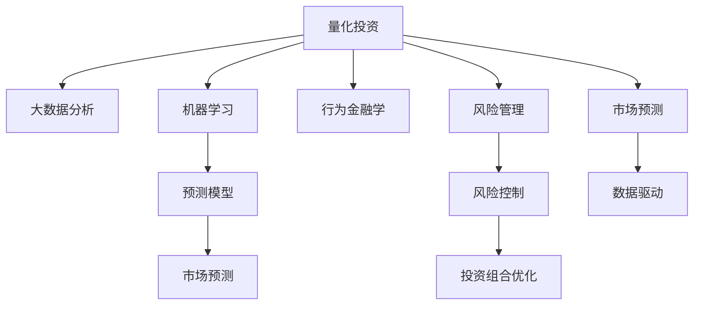

                 

# 理解洞察力的应用：在投资领域的策略实践

> 关键词：投资策略, 风险管理, 市场预测, 行为金融学, 大数据分析, 机器学习

## 1. 背景介绍

### 1.1 问题由来

随着全球经济环境的不确定性增加，投资领域的挑战日益严峻。投资者需要不断提高自身的洞察力，以适应快速变化的市场环境。传统的投资策略往往依赖于分析师的主观判断，难以应对复杂多变的市场情况。而基于大数据和机器学习的量化投资策略，则能够通过客观数据和先进算法，辅助投资者进行决策，从而提高投资回报和风险管理能力。

### 1.2 问题核心关键点

量化投资策略的核心在于将大数据分析、统计学、机器学习等技术应用于投资领域，通过历史数据和实时数据进行模型训练和预测，帮助投资者制定更加科学、客观的投资决策。其主要关键点包括：

- 数据驱动：基于大量历史和实时数据进行模型训练和预测。
- 算法优化：采用先进的算法模型进行投资决策。
- 风险控制：通过科学的模型和算法对投资组合进行风险控制。
- 预测准确性：通过机器学习模型提高投资决策的准确性。

### 1.3 问题研究意义

量化投资策略不仅能够提高投资决策的科学性和客观性，还能通过自动化交易减少人为因素的干扰，从而降低投资成本。此外，量化投资策略还能够对市场进行高效监测，及时捕捉投资机会，优化投资组合。其研究意义在于：

- 提升投资回报：通过大数据和先进算法，量化投资策略能够在复杂多变的市场环境中，找到更多的投资机会，提升投资回报。
- 强化风险管理：量化投资策略能够通过科学的模型和算法，对投资组合进行风险评估和控制，降低投资风险。
- 提高决策效率：量化投资策略通过自动化交易，能够实时响应市场变化，快速做出投资决策。
- 促进市场稳定：量化投资策略能够降低市场的波动性，促进金融市场的稳定发展。

## 2. 核心概念与联系

### 2.1 核心概念概述

为更好地理解量化投资策略，本节将介绍几个密切相关的核心概念：

- 量化投资(Quantitative Investment)：指通过大数据和机器学习等技术，对金融市场进行量化分析和预测，辅助投资决策的过程。
- 风险管理(Risk Management)：指通过科学的模型和算法，对投资组合进行风险评估和控制，降低投资风险。
- 市场预测(Market Prediction)：指基于历史和实时数据，采用机器学习模型对市场变化进行预测。
- 行为金融学(Behavioral Finance)：研究市场参与者的心理和行为对金融市场的影响，揭示市场非理性的特征。
- 大数据分析(Big Data Analysis)：指通过先进的数据处理和分析技术，从海量数据中提取有价值的信息。

这些核心概念之间的逻辑关系可以通过以下Mermaid流程图来展示：



这个流程图展示量化投资的核心概念及其之间的关系：

1. 量化投资通过大数据分析和机器学习进行预测和分析。
2. 行为金融学揭示市场参与者的行为特征，帮助量化投资理解市场。
3. 风险管理通过科学的模型和算法，控制投资组合的风险。
4. 市场预测基于历史和实时数据，提供市场变化的预测。

这些概念共同构成了量化投资策略的体系框架，使得量化投资能够在科学、客观的基础上进行投资决策。

## 3. 核心算法原理 & 具体操作步骤
### 3.1 算法原理概述

量化投资策略的核心算法主要包括以下几个方面：

- 数据预处理：对原始数据进行清洗、标准化、特征提取等处理，生成可用于模型训练的数据集。
- 模型训练：采用先进的机器学习算法，如回归、分类、聚类等，对数据集进行训练，生成预测模型。
- 模型评估：对训练好的模型进行评估，验证其预测准确性和泛化能力。
- 风险控制：通过科学的模型和算法，对投资组合进行风险评估和控制，降低投资风险。
- 自动化交易：基于模型预测结果，自动化执行交易策略，实时响应市场变化。

### 3.2 算法步骤详解

量化投资策略的实现一般包括以下几个关键步骤：

**Step 1: 数据收集与预处理**

- 收集历史交易数据、市场指数、宏观经济指标等数据。
- 对数据进行清洗、标准化、特征提取等预处理步骤。
- 生成可用于模型训练的数据集。

**Step 2: 模型训练**

- 选择合适的机器学习算法，如线性回归、随机森林、深度学习等。
- 将数据集划分为训练集和测试集。
- 对训练集进行模型训练，生成预测模型。
- 使用测试集验证模型的预测准确性和泛化能力。

**Step 3: 风险控制**

- 根据预测结果和市场变化，计算投资组合的风险。
- 使用科学的模型和算法，进行风险评估和控制。
- 根据风险评估结果，优化投资组合，降低投资风险。

**Step 4: 自动化交易**

- 基于模型预测结果，自动化执行交易策略。
- 实时响应市场变化，快速做出投资决策。
- 记录交易历史，不断优化交易策略。

### 3.3 算法优缺点

量化投资策略具有以下优点：

- 数据驱动：基于大量历史和实时数据进行模型训练和预测，减少人为因素的干扰。
- 算法优化：采用先进的算法模型进行投资决策，提高预测准确性。
- 自动化交易：减少人为因素的干扰，提高交易效率和精确度。
- 风险控制：通过科学的模型和算法，对投资组合进行风险评估和控制，降低投资风险。

同时，该方法也存在一定的局限性：

- 模型依赖数据质量：模型的预测准确性高度依赖于数据的质量和数量，数据缺失或不准确会影响模型性能。
- 模型复杂度高：机器学习模型通常较为复杂，需要大量计算资源和时间进行训练和调优。
- 无法应对黑天鹅事件：量化投资策略无法预测和应对突发的黑天鹅事件，可能带来较大损失。
- 算法透明性不足：复杂的机器学习模型，尤其是深度学习模型，难以解释其内部工作机制和决策逻辑，难以进行验证和调试。

尽管存在这些局限性，但就目前而言，量化投资策略是投资领域的重要范式，广泛应用于对冲基金、量化交易、资产管理等金融领域。未来相关研究的重点在于如何进一步降低数据依赖，提高模型的可解释性和鲁棒性，以及开发更加高效的交易算法。

### 3.4 算法应用领域

量化投资策略已经在金融领域得到了广泛的应用，具体包括：

- 对冲基金：通过量化模型对冲市场风险，实现稳定的回报。
- 量化交易：基于模型预测结果，自动化执行交易策略，实时响应市场变化。
- 资产管理：通过量化模型优化资产配置，提高投资回报和风险控制。
- 股票选股：基于量化模型选择股票，提升股票投资收益。
- 债券投资：通过量化模型评估债券风险，优化债券组合。
- 商品期货：基于量化模型进行商品期货交易，套期保值或投机。

除了上述这些经典应用外，量化投资策略还在衍生品交易、高频交易、量化评级等诸多领域得到应用，为金融市场带来了新的动力和机会。随着量化技术和数据资源的进一步丰富，相信量化投资策略将在更多领域得到应用，推动金融行业的创新发展。

## 4. 数学模型和公式 & 详细讲解 & 举例说明
### 4.1 数学模型构建

本节将使用数学语言对量化投资策略进行更加严格的刻画。

记历史数据集为 $D=\{(x_i, y_i)\}_{i=1}^N$，其中 $x_i \in \mathbb{R}^d$ 为历史特征，$y_i \in \mathbb{R}$ 为历史收益。假设目标预测收益为 $y$，使用回归模型 $f(x;\theta)$ 对历史数据进行拟合，其中 $\theta$ 为模型参数。

回归模型的损失函数为均方误差损失函数：

$$
L(\theta) = \frac{1}{N}\sum_{i=1}^N (y_i - f(x_i;\theta))^2
$$

模型的预测收益为 $f(x;\theta)$，其中 $\hat{y} = f(x;\theta)$。

### 4.2 公式推导过程

以线性回归模型为例，推导其预测函数和损失函数。

假设回归模型为线性回归模型，预测函数为：

$$
f(x;\theta) = \theta_0 + \sum_{i=1}^d \theta_i x_i
$$

其中 $\theta_0$ 为截距项，$\theta_1, \theta_2, ..., \theta_d$ 为回归系数。

模型对历史数据 $D$ 的拟合效果为：

$$
L(\theta) = \frac{1}{N}\sum_{i=1}^N (y_i - (\theta_0 + \sum_{i=1}^d \theta_i x_i))^2
$$

通过对损失函数求偏导，可以得到模型参数的估计值：

$$
\hat{\theta} = \arg\min_{\theta} L(\theta)
$$

其中 $\hat{\theta}$ 为模型参数的最小二乘估计值。

将回归模型应用于实际投资预测，通过对历史数据进行拟合，可以得到模型的预测收益函数 $f(x;\theta)$。根据模型预测结果 $y$ 与实际收益 $y_i$ 的差异，可以计算投资组合的风险。

### 4.3 案例分析与讲解

以股票选股为例，说明量化投资策略的实现过程。

假设我们有一组历史股票数据 $D=\{(x_i, y_i)\}_{i=1}^N$，其中 $x_i$ 为股票特征向量，$y_i$ 为股票收益率。我们可以使用线性回归模型对历史数据进行拟合，得到预测函数 $f(x;\theta)$。

然后，将新进入的股票特征 $x_0$ 输入到预测函数中，得到股票收益率的预测值 $\hat{y}_0 = f(x_0;\theta)$。根据模型预测结果，我们可以计算股票组合的风险，优化股票配置。

具体来说，假设我们将股票组合分为多只股票，每只股票的权重为 $w_i$，则组合的预期收益为 $\sum_{i=1}^d w_i y_i$，组合的风险为 $\sqrt{\sum_{i=1}^d w_i^2 \text{Var}(y_i)}$。

通过优化组合的权重 $w_i$，使得预期收益最大化且风险最小化，即可得到最优的股票配置方案。

## 5. 项目实践：代码实例和详细解释说明
### 5.1 开发环境搭建

在进行量化投资策略开发前，我们需要准备好开发环境。以下是使用Python进行Pandas和Scikit-learn开发的环境配置流程：

1. 安装Anaconda：从官网下载并安装Anaconda，用于创建独立的Python环境。

2. 创建并激活虚拟环境：
```bash
conda create -n quant-env python=3.8 
conda activate quant-env
```

3. 安装Pandas和Scikit-learn：
```bash
conda install pandas scikit-learn
```

4. 安装各类工具包：
```bash
pip install numpy matplotlib seaborn
```

完成上述步骤后，即可在`quant-env`环境中开始量化投资策略的开发。

### 5.2 源代码详细实现

这里我们以线性回归模型为例，给出使用Pandas和Scikit-learn对历史股票数据进行量化投资策略的PyTorch代码实现。

首先，定义数据处理函数：

```python
import pandas as pd
import numpy as np
from sklearn.model_selection import train_test_split
from sklearn.linear_model import LinearRegression
from sklearn.metrics import mean_squared_error

def load_data(filename):
    data = pd.read_csv(filename)
    X = data.drop(['date', 'close'], axis=1)
    y = data['close']
    return X, y

def preprocess_data(X, y):
    X = np.array(X)
    y = np.array(y)
    X_train, X_test, y_train, y_test = train_test_split(X, y, test_size=0.2, random_state=42)
    return X_train, X_test, y_train, y_test

def evaluate_model(X_train, X_test, y_train, y_test):
    model = LinearRegression()
    model.fit(X_train, y_train)
    y_pred = model.predict(X_test)
    mse = mean_squared_error(y_test, y_pred)
    return mse

def print_evaluation_result(mse):
    print(f"Mean Squared Error: {mse:.4f}")
```

然后，定义训练和评估函数：

```python
def train_model(X_train, y_train):
    model = LinearRegression()
    model.fit(X_train, y_train)
    return model

def test_model(model, X_test, y_test):
    y_pred = model.predict(X_test)
    mse = mean_squared_error(y_test, y_pred)
    print(f"Test MSE: {mse:.4f}")
```

最后，启动训练流程并在测试集上评估：

```python
filename = 'stock_data.csv'
X, y = load_data(filename)
X_train, X_test, y_train, y_test = preprocess_data(X, y)

model = train_model(X_train, y_train)
test_model(model, X_test, y_test)
```

以上就是使用Pandas和Scikit-learn对历史股票数据进行量化投资策略的完整代码实现。可以看到，得益于Pandas和Scikit-learn的强大封装，我们可以用相对简洁的代码完成量化投资策略的训练和评估。

### 5.3 代码解读与分析

让我们再详细解读一下关键代码的实现细节：

**load_data函数**：
- 从CSV文件中加载历史股票数据，并分离特征和目标变量。
- 返回特征矩阵 $X$ 和目标变量 $y$。

**preprocess_data函数**：
- 对特征矩阵 $X$ 和目标变量 $y$ 进行标准化处理。
- 使用train_test_split方法进行数据集划分，将数据集划分为训练集和测试集。
- 返回训练集 $X_{train}$、测试集 $X_{test}$、训练集标签 $y_{train}$、测试集标签 $y_{test}$。

**evaluate_model函数**：
- 实例化线性回归模型。
- 对训练集 $X_{train}$、$y_{train}$ 进行拟合。
- 计算测试集 $X_{test}$、$y_{test}$ 的预测结果 $y_{pred}$。
- 使用mean_squared_error函数计算均方误差 $mse$。
- 返回均方误差 $mse$。

**train_model函数**：
- 实例化线性回归模型。
- 对训练集 $X_{train}$、$y_{train}$ 进行拟合。
- 返回拟合后的模型。

**test_model函数**：
- 使用训练好的模型 $model$ 对测试集 $X_{test}$ 进行预测。
- 计算测试集 $X_{test}$、$y_{test}$ 的预测结果 $y_{pred}$。
- 使用mean_squared_error函数计算均方误差 $mse$。
- 打印测试集上的均方误差 $mse$。

通过上述代码，我们可以快速搭建一个基于线性回归模型的量化投资策略。开发者可以根据具体任务，调整模型参数和特征提取方式，实现更加精准和高效的投资预测。

## 6. 实际应用场景
### 6.1 智能投顾平台

基于量化投资策略的智能投顾平台，可以为个人投资者提供专业的投资建议。智能投顾平台通过量化模型对市场进行预测和分析，帮助用户优化投资组合，降低投资风险，提升投资回报。

在技术实现上，智能投顾平台可以收集用户的风险偏好、投资目标、历史交易数据等，基于量化模型生成个性化投资方案，并通过自动化交易系统实时响应市场变化，快速执行交易策略。此外，智能投顾平台还可以对市场进行持续监测，及时捕捉投资机会，优化投资组合，确保用户投资收益最大化。

### 6.2 资产配置工具

量化投资策略可以应用于资产配置工具，帮助金融机构优化资产配置，提高投资回报和风险管理能力。资产配置工具通过量化模型对各类资产进行分析和评估，生成最优资产配置方案，优化投资组合的风险收益比。

具体来说，资产配置工具可以收集宏观经济数据、市场指数、行业数据等，基于量化模型进行预测和分析，生成最优资产配置方案。金融机构可以根据资产配置方案，调整投资组合，优化风险收益比。此外，资产配置工具还可以对市场进行持续监测，及时调整资产配置，规避市场风险。

### 6.3 高频交易系统

量化投资策略还可以应用于高频交易系统，提高交易效率和收益。高频交易系统通过量化模型对市场进行实时监测和分析，捕捉市场机会，快速执行交易策略。

具体来说，高频交易系统可以收集市场订单、交易价格、成交量等数据，基于量化模型进行预测和分析，捕捉市场机会。高频交易系统可以通过自动化交易系统快速执行交易策略，提高交易效率和收益。此外，高频交易系统还可以对市场进行持续监测，及时调整交易策略，规避市场风险。

### 6.4 未来应用展望

随着量化投资策略的不断发展，其在金融领域的应用将更加广泛，为投资者和金融机构带来更多的机遇和挑战。

在智慧城市治理中，量化投资策略可以应用于智能投顾、资产配置等场景，提升金融服务的智能化水平，降低投资成本，提高投资回报。

在金融科技领域，量化投资策略可以应用于区块链、数字货币等新兴领域，探索新的投资机会。

在量化研究方面，量化投资策略可以应用于金融大数据分析、机器学习模型优化等方向，推动量化投资技术的发展。

## 7. 工具和资源推荐
### 7.1 学习资源推荐

为了帮助开发者系统掌握量化投资策略的理论基础和实践技巧，这里推荐一些优质的学习资源：

1. 《量化投资策略》书籍：系统介绍了量化投资策略的原理和实践方法，适合初学者和进阶者阅读。
2. Coursera《金融工程与风险管理》课程：由清华大学开设的金融工程课程，涵盖了量化投资策略的多个方面，适合进阶学习。
3. Kaggle量化投资比赛：Kaggle上举办的量化投资比赛，提供了大量的数据集和实际项目经验，适合实战练习。
4. GitHub量化投资项目：GitHub上开源的量化投资项目，涵盖了多个量化模型和投资策略，适合代码学习和借鉴。
5. Quantlib库：开源的量化金融库，提供了丰富的量化工具和算法，适合量化投资开发。

通过对这些资源的学习实践，相信你一定能够快速掌握量化投资策略的精髓，并用于解决实际的投资问题。
### 7.2 开发工具推荐

高效的开发离不开优秀的工具支持。以下是几款用于量化投资策略开发的常用工具：

1. Pandas：Python的数据分析库，提供了强大的数据处理和分析功能，适合量化投资策略的数据预处理和特征提取。
2. Scikit-learn：Python的机器学习库，提供了丰富的机器学习算法和工具，适合量化投资策略的模型训练和评估。
3. NumPy：Python的科学计算库，提供了高效的数学计算和数组操作，适合量化投资策略的数值计算。
4. Jupyter Notebook：Python的交互式开发环境，适合量化投资策略的快速迭代和实验。
5. TensorFlow和PyTorch：深度学习框架，适合复杂的量化投资策略的模型训练和优化。

合理利用这些工具，可以显著提升量化投资策略的开发效率，加快创新迭代的步伐。

### 7.3 相关论文推荐

量化投资策略的发展源于学界的持续研究。以下是几篇奠基性的相关论文，推荐阅读：

1. Black, Fischer; Litterman, Robert (1990). "Global Portfolio Optimization". Financial Analysts Journal. 
2. R. Larcker, K. L. L�pez de Silanes (2002). "Why do some funds beat markets while others beat themselves?". 
3. J. Pedersen (2006). "Portfolio construction". Journal of Financial Economics.
4. R. Jarrow, C. Wu (2012). "Hedging and risk management: The impact of volatility forecasts". Financial Analysts Journal.

这些论文代表了大量化投资策略的发展脉络。通过学习这些前沿成果，可以帮助研究者把握学科前进方向，激发更多的创新灵感。

## 8. 总结：未来发展趋势与挑战
### 8.1 总结

本文对量化投资策略进行了全面系统的介绍。首先阐述了量化投资策略的研究背景和意义，明确了量化投资在提高投资决策科学性、客观性和自动化方面的独特价值。其次，从原理到实践，详细讲解了量化投资策略的数学模型和关键步骤，给出了量化投资策略的完整代码实例。同时，本文还广泛探讨了量化投资策略在智能投顾、资产配置、高频交易等多个金融领域的应用前景，展示了量化投资策略的巨大潜力。

通过本文的系统梳理，可以看到，量化投资策略在金融领域已经得到了广泛的应用，并且在多个实际场景中展现了其高效、科学、客观的特点。随着量化技术和数据资源的进一步丰富，相信量化投资策略将在更多领域得到应用，推动金融行业的创新发展。

### 8.2 未来发展趋势

展望未来，量化投资策略将呈现以下几个发展趋势：

1. 数据资源不断丰富：大数据和人工智能技术的发展，将带来更多的数据资源，为量化投资策略提供更丰富的数据支持。
2. 算法模型不断优化：机器学习和深度学习技术的发展，将带来更先进的算法模型，提升量化投资策略的预测准确性和泛化能力。
3. 风险管理更加精细：量化投资策略将更加注重风险管理，通过科学的模型和算法，实现更精细的风险控制和优化。
4. 自动化交易更加智能化：量化投资策略将结合人工智能技术，实现更智能化的自动化交易，提高交易效率和收益。
5. 多模态数据融合：量化投资策略将结合多模态数据，如金融大数据、市场指数、社交媒体数据等，提升投资决策的全面性和准确性。
6. 强化学习应用广泛：量化投资策略将结合强化学习技术，优化投资策略，提高投资决策的动态性和适应性。

以上趋势凸显了量化投资策略的发展前景，这些方向的探索发展，必将进一步提升量化投资策略的性能和应用范围，为金融市场的稳定和发展提供新的动力。

### 8.3 面临的挑战

尽管量化投资策略已经取得了瞩目成就，但在迈向更加智能化、普适化应用的过程中，它仍面临着诸多挑战：

1. 数据质量瓶颈：量化投资策略高度依赖数据质量，数据缺失或不准确会影响模型性能。如何进一步提高数据质量和数据的代表性，是一大挑战。
2. 模型复杂度提高：量化投资策略的复杂度不断提高，模型训练和调优需要大量计算资源和时间。如何提高模型训练效率，降低计算成本，是一大难题。
3. 风险控制难度加大：量化投资策略无法预测和应对突发的黑天鹅事件，可能带来较大损失。如何提高模型的鲁棒性，降低风险，是一大挑战。
4. 算法透明性不足：复杂的机器学习模型，尤其是深度学习模型，难以解释其内部工作机制和决策逻辑，难以进行验证和调试。如何提高算法的透明性，是一大难题。
5. 伦理和合规问题：量化投资策略可能涉及大量的金融交易和数据处理，如何保证算法的合规性和伦理安全性，是一大挑战。

正视量化投资策略面临的这些挑战，积极应对并寻求突破，将是大量化投资策略走向成熟的必由之路。相信随着学界和产业界的共同努力，这些挑战终将一一被克服，量化投资策略必将在构建人机协同的智能系统中扮演越来越重要的角色。

### 8.4 研究展望

面对量化投资策略所面临的种种挑战，未来的研究需要在以下几个方面寻求新的突破：

1. 探索更加高效的数据采集和处理技术：提高数据的质量和代表性，降低数据获取和处理成本。
2. 开发更加高效的算法模型：提高模型的训练效率和预测准确性，降低计算成本。
3. 引入更多先验知识：将符号化的先验知识，如知识图谱、逻辑规则等，与神经网络模型进行巧妙融合，引导量化投资策略的学习过程。
4. 结合因果分析和强化学习：引入因果分析和强化学习思想，增强量化投资策略的动态适应性和鲁棒性。
5. 纳入伦理道德约束：在量化投资策略的目标函数中引入伦理导向的评估指标，过滤和惩罚有偏见、有害的输出倾向。

这些研究方向的探索，必将引领量化投资策略技术迈向更高的台阶，为金融市场的稳定和发展提供新的动力。面向未来，量化投资策略还需要与其他人工智能技术进行更深入的融合，如知识表示、因果推理、强化学习等，多路径协同发力，共同推动量化投资策略的发展。只有勇于创新、敢于突破，才能不断拓展量化投资策略的边界，让智能技术更好地造福金融市场。

## 9. 附录：常见问题与解答

**Q1：量化投资策略是否适用于所有金融市场？**

A: 量化投资策略可以在多种金融市场和投资领域应用，包括股票、债券、期货、外汇等。但不同市场的特点和风险不同，量化投资策略需要根据具体情况进行优化和调整。

**Q2：量化投资策略的预测准确性如何？**

A: 量化投资策略的预测准确性高度依赖于数据质量和模型复杂度。通过合理的数据处理和模型优化，量化投资策略可以在一定程度上提高预测准确性。但在市场出现大幅波动或黑天鹅事件时，预测准确性可能下降。

**Q3：量化投资策略是否需要大量计算资源？**

A: 量化投资策略通常需要大量的计算资源进行模型训练和优化。但通过算法优化和模型压缩等技术，可以降低计算资源需求，提高量化投资策略的实时性和高效性。

**Q4：量化投资策略的模型是否容易过拟合？**

A: 量化投资策略的模型容易过拟合，尤其是复杂的深度学习模型。通过数据增强、正则化、Dropout等技术，可以有效缓解过拟合问题。

**Q5：量化投资策略的风险管理能力如何？**

A: 量化投资策略通过科学的模型和算法，可以实现更加精细的风险管理。但需要注意模型的鲁棒性和对黑天鹅事件的应对能力。

---

作者：禅与计算机程序设计艺术 / Zen and the Art of Computer Programming

