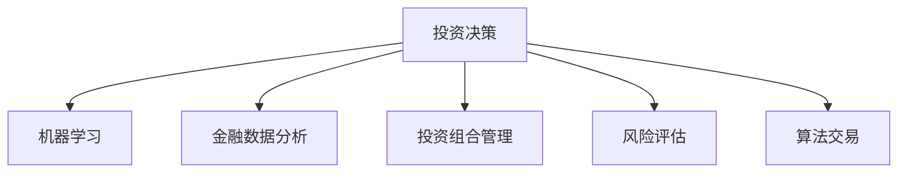

                 

# 理解洞察力的应用：在投资领域的策略实践

> 关键词：投资决策, 机器学习, 金融数据分析, 投资组合管理, 风险评估, 算法交易

## 1. 背景介绍

### 1.1 问题由来
投资决策是金融市场中最为复杂和重要的问题之一，其关键在于如何通过分析市场数据，预测未来走势，从而做出最优的投资策略。传统的投资决策依赖于人类经验和直觉，但受限于个人能力和市场信息量，难以在复杂多变的金融环境中做出准确决策。随着人工智能技术的兴起，机器学习和数据分析逐渐成为投资决策中不可或缺的一部分。

### 1.2 问题核心关键点
机器学习和大数据分析为投资决策带来了新的视角和工具，但其核心挑战在于：
- 如何通过模型构建有效的金融数据表示。
- 如何利用机器学习算法对海量数据进行高效处理和分析。
- 如何设计合理的投资策略，并在实际交易中执行。
- 如何评估模型风险和预测精度，确保决策的稳健性。
- 如何应对市场变化和政策风险，保证策略的持续有效性。

### 1.3 问题研究意义
本文旨在探索利用机器学习和数据分析来增强投资决策过程，特别是通过洞察力挖掘金融数据中隐藏的规律和趋势，以提高投资决策的准确性和效率。具体研究内容包括：
- 构建金融数据表示，挖掘市场特征。
- 设计基于机器学习的投资策略，进行量化投资。
- 评估和优化投资策略，提升投资组合表现。
- 探索算法交易在实际应用中的挑战和解决方案。

## 2. 核心概念与联系

### 2.1 核心概念概述

为更好地理解基于机器学习的投资决策方法，本节将介绍几个关键概念：

- 投资决策(Investment Decision Making)：投资者通过分析市场信息和自身目标，选择最优的投资标的、数量和时点，以实现收益最大化和风险最小化。
- 机器学习(Machine Learning)：通过数据驱动的方法，让计算机系统从数据中学习规律，并进行预测和决策。
- 金融数据分析(Financial Data Analysis)：对市场数据和公司财务数据进行分析，挖掘潜在的投资机会和风险。
- 投资组合管理(Portfolio Management)：通过构建和调整投资组合，分散风险，提高收益。
- 风险评估(Risk Assessment)：分析投资决策中的不确定性和潜在风险，进行风险管理和控制。
- 算法交易(Algorithmic Trading)：利用自动化算法执行交易决策，提高交易效率和降低人为误差。

这些核心概念之间的逻辑关系可以通过以下Mermaid流程图来展示：



这个流程图展示了投资决策过程中各概念之间的相互作用和关系：

1. 投资决策通过金融数据分析，挖掘市场特征和机会。
2. 机器学习通过对海量数据的学习，提供精准的预测和决策支持。
3. 投资组合管理通过构建最优组合，分散风险并提升收益。
4. 风险评估对投资决策进行风险控制，保证策略稳健。
5. 算法交易通过自动化执行策略，提高交易效率。

这些概念共同构成了投资决策的框架，使得投资者能够基于数据和算法，进行更科学、高效的投资管理。

## 3. 核心算法原理 & 具体操作步骤
### 3.1 算法原理概述

基于机器学习的投资决策，其核心思想是通过构建金融数据表示和模型，学习市场规律，并应用于投资决策中。具体步骤如下：

1. 数据预处理：收集和整理市场数据、公司财务数据、新闻和社交媒体信息等，并进行数据清洗和特征工程，构建有效的金融数据表示。
2. 模型构建：选择合适的机器学习算法，如回归、分类、聚类、深度学习等，构建预测模型，学习金融市场的规律。
3. 策略设计：将学习到的模型应用于投资决策中，设计投资策略，进行量化投资。
4. 策略优化：通过回测和测试，评估策略的性能，并进行参数调整和策略优化。
5. 策略执行：在实际交易中，利用算法交易执行策略，进行自动化投资。

### 3.2 算法步骤详解

以股票投资决策为例，给出机器学习投资策略的详细步骤：

**Step 1: 数据预处理**

- 收集股票价格、交易量、市值、财务报表、新闻、社交媒体评论等数据。
- 清洗数据，处理缺失值、异常值和重复数据。
- 特征工程：构建技术指标（如移动平均线、RSI等）、基本面指标（如市盈率、市净率等），并进行标准化处理。

**Step 2: 模型构建**

- 选择合适的机器学习算法，如线性回归、逻辑回归、随机森林、梯度提升树等，用于预测股票价格变化。
- 使用历史数据训练模型，学习价格变化的规律和趋势。
- 交叉验证，评估模型的泛化能力。

**Step 3: 策略设计**

- 将训练好的模型应用于股票投资决策中，设计投资策略。
- 策略可以基于价格变化预测，进行买入、卖出、持有等操作。
- 考虑市场波动和交易成本，设计风险控制机制。

**Step 4: 策略优化**

- 使用历史数据进行回测，评估策略的绩效。
- 根据回测结果，调整模型参数和策略规则。
- 使用测试集验证优化后的策略效果。

**Step 5: 策略执行**

- 利用算法交易执行优化后的投资策略。
- 监控市场动态，及时调整策略。

### 3.3 算法优缺点

基于机器学习的投资决策方法具有以下优点：

- 数据驱动：通过分析海量金融数据，挖掘市场规律，提供精准的决策支持。
- 自动化执行：利用算法交易，快速高效地执行投资策略，减少人为误差。
- 量化分析：通过严格的数学模型和统计测试，提高投资决策的科学性和稳健性。

同时，该方法也存在一些局限性：

- 模型依赖：模型效果受限于数据质量和特征工程，数据偏差可能导致决策失误。
- 市场变化：金融市场复杂多变，模型可能难以适应新的市场环境。
- 数据隐私：金融数据涉及敏感信息，数据隐私和安全问题需要特别注意。
- 交易成本：算法交易可能增加交易成本，影响策略的实际收益。

尽管存在这些局限性，但就目前而言，基于机器学习的投资决策方法仍是大规模应用中的重要手段。未来相关研究的重点在于如何进一步提升模型的泛化能力、降低交易成本，同时兼顾数据隐私和安全性等因素。

### 3.4 算法应用领域

基于机器学习的投资决策方法在金融市场中被广泛应用，覆盖了以下多个领域：

- 股票投资：利用机器学习预测股票价格变化，进行股票买卖决策。
- 期货交易：通过预测期货价格，进行期货套利和投机。
- 期权交易：利用机器学习进行期权定价和风险管理。
- 外汇交易：分析外汇市场数据，进行外汇买卖决策。
- 固定收益投资：通过机器学习预测利率和债券价格变化，进行债券投资。
- 量化对冲：利用机器学习构建复杂的对冲策略，降低系统性风险。

除了以上经典应用外，基于机器学习的投资决策方法还被创新性地应用到更多场景中，如量化风险管理、高频交易、资产配置等，为金融市场带来了全新的活力。

## 4. 数学模型和公式 & 详细讲解 & 举例说明

### 4.1 数学模型构建

本节将使用数学语言对基于机器学习的投资决策过程进行更加严格的刻画。

记投资策略为 $f: \mathcal{X} \rightarrow \mathcal{Y}$，其中 $\mathcal{X}$ 为输入特征，$\mathcal{Y}$ 为输出行动（如买入、卖出、持有）。假设训练集为 $D=\{(x_i,y_i)\}_{i=1}^N$，其中 $x_i$ 为第 $i$ 个样本的特征向量，$y_i$ 为对应的投资行动。

定义模型 $f$ 在训练集 $D$ 上的经验风险为：

$$
\mathcal{L}(f)=\frac{1}{N}\sum_{i=1}^N\ell(f(x_i),y_i)
$$

其中 $\ell$ 为损失函数，用于衡量模型预测和实际行动之间的差异。常见的损失函数包括0-1损失、交叉熵损失等。

### 4.2 公式推导过程

以线性回归模型为例，推导模型的损失函数和参数更新公式。

设模型 $f(x)=w_0 + \sum_{j=1}^d w_j x_j$，其中 $w_0, w_1, ..., w_d$ 为模型参数。假设训练集 $D=\{(x_i,y_i)\}_{i=1}^N$，则经验风险为：

$$
\mathcal{L}(w)=\frac{1}{N}\sum_{i=1}^N(y_i - f(x_i))^2
$$

通过最小二乘法，求导并设置梯度为零，得到参数更新公式：

$$
w \leftarrow w - \frac{\alpha}{N}\sum_{i=1}^N(y_i - f(x_i))x_i
$$

其中 $\alpha$ 为学习率。

### 4.3 案例分析与讲解

以下以股票价格预测为例，展示线性回归模型在实际应用中的实现过程。

假设我们有一个历史股票价格数据集，包含每日收盘价 $y$ 和成交量 $x_1$、市盈率 $x_2$ 等特征。通过线性回归模型 $f(x) = w_0 + w_1 x_1 + w_2 x_2$ 对价格变化进行预测。

**数据预处理：**
- 收集股票历史价格、成交量、市盈率等数据，并进行清洗和标准化。

**模型训练：**
- 使用历史数据训练线性回归模型，学习价格变化的规律。
- 通过交叉验证，评估模型泛化能力，选择合适的超参数。

**策略设计：**
- 根据模型预测，设计投资策略，如基于预测价格变化进行买入或卖出决策。
- 考虑市场波动和交易成本，设置止损和止盈机制。

**策略优化：**
- 使用历史数据进行回测，评估策略绩效。
- 根据回测结果，调整模型参数和策略规则。
- 使用测试集验证优化后的策略效果。

**策略执行：**
- 利用算法交易执行优化后的投资策略。
- 监控市场动态，及时调整策略。

## 5. 项目实践：代码实例和详细解释说明
### 5.1 开发环境搭建

在进行投资决策实践前，我们需要准备好开发环境。以下是使用Python进行机器学习和金融数据分析的环境配置流程：

1. 安装Anaconda：从官网下载并安装Anaconda，用于创建独立的Python环境。

2. 创建并激活虚拟环境：
```bash
conda create -n finance-env python=3.8 
conda activate finance-env
```

3. 安装必要的库：
```bash
conda install pandas numpy scikit-learn statsmodels matplotlib seaborn
```

4. 安装机器学习库：
```bash
pip install scikit-learn xgboost lightgbm pytorch
```

5. 安装金融数据分析库：
```bash
pip install yfinance pycandle
```

6. 安装可视化库：
```bash
pip install plotly
```

完成上述步骤后，即可在`finance-env`环境中开始投资决策实践。

### 5.2 源代码详细实现

下面我们以股票价格预测为例，给出使用Python和机器学习库进行投资决策的代码实现。

首先，定义数据处理函数：

```python
import yfinance as yf
import pandas as pd
import numpy as np

def get_ticker_data(ticker, start_date, end_date):
    data = yf.Ticker(ticker)
    return data.history(period='1d', start=start_date, end=end_date)
```

然后，加载股票数据并进行预处理：

```python
ticker = 'AAPL'
start_date = '2020-01-01'
end_date = '2021-12-31'
data = get_ticker_data(ticker, start_date, end_date)
data = data.dropna().reset_index(drop=True)
```

接着，定义特征工程函数：

```python
def create_features(data):
    features = []
    features.append(data['Close'].pct_change())
    features.append(data['Volume'])
    features.append(data['Price_to_Earnings_Ratio'])
    features.append(data['Price_to_Book_Ratio'])
    return pd.DataFrame(features, columns=['PClose', 'Volume', 'PE', 'PB'])
```

然后，构建线性回归模型并进行训练：

```python
from sklearn.linear_model import LinearRegression
from sklearn.model_selection import train_test_split
from sklearn.metrics import mean_squared_error

X = create_features(data)
y = data['PClose']
X_train, X_test, y_train, y_test = train_test_split(X, y, test_size=0.2, random_state=42)

model = LinearRegression()
model.fit(X_train, y_train)

y_pred = model.predict(X_test)
mse = mean_squared_error(y_test, y_pred)
print('MSE:', mse)
```

最后，使用训练好的模型进行股票价格预测，并设计投资策略：

```python
def predict_price(data, model):
    features = create_features(data)
    prediction = model.predict(features)
    return prediction

data_new = get_ticker_data(ticker, end_date, end_date + pd.DateOffset(days=1))
features_new = create_features(data_new)
prediction = predict_price(features_new, model)
if prediction > data_new['PClose']:
    strategy = 'buy'
else:
    strategy = 'sell'

print('Prediction:', prediction)
print('Strategy:', strategy)
```

以上就是使用Python和机器学习库进行投资决策的完整代码实现。可以看到，通过构建简单的线性回归模型，我们可以对股票价格进行预测，并据此设计投资策略。

### 5.3 代码解读与分析

让我们再详细解读一下关键代码的实现细节：

**数据预处理函数**：
- `get_ticker_data`函数：从Yahoo Finance API获取指定股票的历史价格数据，并进行清洗和标准化。
- `create_features`函数：对历史价格数据进行特征工程，构建技术指标和基本面指标，用于模型训练。

**模型训练和预测函数**：
- 使用历史价格数据构建特征集 `X` 和目标变量 `y`。
- 通过 `train_test_split` 函数将数据集分为训练集和测试集。
- 使用 `LinearRegression` 构建线性回归模型，并通过训练集进行拟合。
- 在测试集上进行预测，并使用 `mean_squared_error` 计算预测误差。

**投资策略函数**：
- `predict_price`函数：将新数据集 `data_new` 进行特征工程，并使用训练好的模型进行价格预测。
- 根据预测结果和当前股价，设计买入或卖出的投资策略。

代码实现展示了机器学习在投资决策中的应用流程：数据预处理、模型训练、策略设计、策略执行。尽管这个例子非常简单，但基本逻辑已经涵盖了从数据获取到策略执行的全过程。

## 6. 实际应用场景

### 6.1 量化投资组合管理

量化投资组合管理通过机器学习算法对市场数据进行分析和建模，构建最优的投资组合，分散风险，提升收益。以下是一个简单的量化投资组合管理流程：

**Step 1: 数据收集和预处理**
- 收集市场指数、股票价格、基金净值等数据。
- 清洗和标准化数据，处理缺失值和异常值。

**Step 2: 特征工程**
- 构建技术指标（如移动平均线、RSI等）。
- 提取基本面指标（如市盈率、市净率等）。

**Step 3: 模型构建**
- 选择合适的机器学习算法（如随机森林、梯度提升树等）。
- 使用历史数据训练模型，学习市场规律。

**Step 4: 投资组合设计**
- 根据模型预测，构建最优投资组合。
- 设计风险控制机制，如分散投资、止损止盈等。

**Step 5: 策略执行**
- 在实际投资中，利用算法交易执行投资组合策略。
- 监控市场动态，及时调整投资组合。

### 6.2 算法交易

算法交易通过自动化的算法执行投资决策，提高交易效率和降低人为误差。以下是一个简单的算法交易流程：

**Step 1: 策略设计**
- 设计基于市场分析的策略，如趋势跟踪、套利等。
- 考虑市场波动和交易成本，设置止损和止盈机制。

**Step 2: 策略回测**
- 使用历史数据进行回测，评估策略的绩效。
- 根据回测结果，调整策略参数。

**Step 3: 策略优化**
- 使用测试集验证优化后的策略效果。
- 设置交易信号和交易规则，进行自动化交易。

**Step 4: 策略执行**
- 在实际交易中，利用算法交易执行策略。
- 监控市场动态，及时调整策略。

### 6.3 风险管理

风险管理通过机器学习算法对投资决策中的不确定性和潜在风险进行评估，进行风险控制和预警。以下是一个简单的风险管理流程：

**Step 1: 数据收集和预处理**
- 收集历史数据、市场波动等数据。
- 清洗和标准化数据，处理缺失值和异常值。

**Step 2: 风险评估**
- 使用机器学习算法（如回归、分类等）进行风险评估。
- 通过历史数据，学习市场波动和风险特征。

**Step 3: 风险控制**
- 根据风险评估结果，设计风险控制策略。
- 设置止损和止盈机制，进行风险控制。

**Step 4: 风险预警**
- 监控市场动态，及时预警潜在风险。
- 调整策略参数，进行风险应对。

## 7. 工具和资源推荐
### 7.1 学习资源推荐

为了帮助开发者系统掌握基于机器学习的投资决策的理论基础和实践技巧，这里推荐一些优质的学习资源：

1. 《Python for Finance》书籍：由Stefan Jansen编写，全面介绍了Python在金融数据分析和投资决策中的应用。
2. Coursera《Quantitative Financial Economics》课程：由Khan Academy提供，涵盖金融市场和投资决策的基本理论和模型。
3. QuantConnect开源平台：提供丰富的学习资源和实践环境，支持使用Python进行量化投资策略开发。
4. QuantConnect社区：包含大量量化策略和研究论文，可以从中学习经验和灵感。

通过对这些资源的学习实践，相信你一定能够快速掌握基于机器学习的投资决策的精髓，并用于解决实际的投资问题。

### 7.2 开发工具推荐

高效的开发离不开优秀的工具支持。以下是几款用于投资决策开发的常用工具：

1. Python：Python作为数据科学和机器学习的通用语言，适合进行金融数据分析和投资决策开发。
2. Pandas：Python的数据处理库，方便进行数据清洗和特征工程。
3. NumPy：Python的科学计算库，支持高效的矩阵运算和统计分析。
4. Scikit-learn：Python的机器学习库，提供了丰富的算法和工具。
5. TensorFlow：Google开源的深度学习框架，支持复杂模型的构建和训练。
6. QuantConnect：量化投资开发平台，支持Python和C#开发，提供丰富的市场数据和回测环境。

合理利用这些工具，可以显著提升投资决策开发的效率，加快创新迭代的步伐。

### 7.3 相关论文推荐

投资决策的机器学习应用涉及众多研究领域，以下是几篇奠基性的相关论文，推荐阅读：

1. "A Simple Introduction to the Bootstrap and the Jackknife"（Bootstrap方法介绍）：Robert S. Wichern, 1985年
2. "The Jackknife and Bootstrap for General Statistics"（Jackknife方法介绍）：Edward L. Lehmann, 1981年
3. "The Elements of Statistical Learning"（统计学习元素）：Tibshirani等，2009年
4. "Machine Learning in Finance: A Survey"（金融中的机器学习）：Gros, 2018年
5. "Quantitative Financial Economics"（量化金融经济）：Khan Academy，2010年

这些论文代表了大规模应用机器学习于投资决策的研究脉络。通过学习这些前沿成果，可以帮助研究者把握学科前进方向，激发更多的创新灵感。

## 8. 总结：未来发展趋势与挑战

### 8.1 总结

本文对基于机器学习的投资决策方法进行了全面系统的介绍。首先阐述了投资决策的机器学习背景和意义，明确了机器学习在量化投资、算法交易和风险管理中的关键作用。其次，从原理到实践，详细讲解了投资决策的数学模型和关键步骤，给出了投资决策任务开发的完整代码实例。同时，本文还广泛探讨了投资决策在量化投资组合管理、算法交易和风险管理等多个领域的实际应用场景，展示了机器学习在投资决策中的强大潜力。此外，本文精选了投资决策的学习资源，力求为读者提供全方位的技术指引。

通过本文的系统梳理，可以看到，基于机器学习的投资决策方法正在成为量化投资中的重要工具，极大地提升了投资决策的科学性和效率。未来，伴随深度学习、强化学习等技术的不断发展，基于机器学习的投资决策技术必将在投资决策中发挥更加重要的作用。

### 8.2 未来发展趋势

展望未来，基于机器学习的投资决策技术将呈现以下几个发展趋势：

1. 深度学习的应用：随着深度学习模型的发展，神经网络在投资决策中的应用将逐渐普及。深度学习模型能够处理更复杂的非线性关系，提升投资决策的准确性。
2. 强化学习的应用：通过强化学习算法，投资决策可以更加智能化，自动调整策略以适应市场变化。
3. 多模态数据融合：将金融市场中的多种数据（如价格、新闻、社交媒体等）进行融合，提升投资决策的信息利用率。
4. 跨市场和跨资产的决策：通过多市场、多资产的数据融合，实现跨市场的投资决策，提升投资组合的多样性和稳健性。
5. 实时决策和动态调整：利用实时数据进行决策，动态调整投资策略，提高投资决策的灵活性和效率。
6. 持续学习和自适应：通过不断学习新数据和新知识，提升投资决策的适应性和持续有效性。

以上趋势凸显了机器学习在投资决策中的广阔前景。这些方向的探索发展，必将进一步提升投资决策的科学性和效率，为投资者带来更多的投资机会和收益。

### 8.3 面临的挑战

尽管基于机器学习的投资决策技术已经取得了显著进展，但在迈向更加智能化、普适化应用的过程中，仍面临诸多挑战：

1. 数据质量问题：金融市场数据复杂多变，数据质量对模型效果影响较大，需要特别注意数据清洗和处理。
2. 模型泛化能力：现有模型可能难以适应新的市场环境和数据分布，需要不断优化和调整。
3. 交易成本和风险：算法交易可能增加交易成本，同时需要考虑投资组合的波动性和风险控制。
4. 法律和合规问题：金融市场具有严格的监管要求，投资决策的机器学习应用需要符合相关法规和标准。
5. 算法安全和隐私：投资决策中的算法可能面临安全攻击和数据泄露的风险，需要加强安全防护和隐私保护。

正视投资决策面临的这些挑战，积极应对并寻求突破，将是大规模应用机器学习于投资决策的关键。相信随着学界和产业界的共同努力，这些挑战终将一一被克服，机器学习在投资决策中的应用必将更加广泛和深入。

### 8.4 研究展望

面对机器学习在投资决策中面临的挑战，未来的研究需要在以下几个方面寻求新的突破：

1. 提升数据质量：开发更高效的数据清洗和处理算法，提升金融市场数据的可用性和可靠性。
2. 增强模型泛化能力：研究更高效的深度学习模型和优化算法，提高模型的泛化性和适应性。
3. 降低交易成本：探索更高效的算法交易策略，降低交易成本，提升投资决策的实际收益。
4. 优化风险管理：开发更精准的风险评估和控制模型，提高投资组合的风险管理能力。
5. 强化算法安全：研究安全防护技术，防止算法攻击和数据泄露，确保投资决策的可靠性和安全性。
6. 探索多模态数据融合：研究多模态数据融合技术，提升投资决策的信息利用率。

这些研究方向将引领机器学习在投资决策中的进一步发展，为投资者提供更科学、高效、稳健的投资决策支持。

## 9. 附录：常见问题与解答

**Q1：投资决策中的机器学习是否需要大量标注数据？**

A: 投资决策中的机器学习通常依赖于大量的历史数据，而非标注数据。由于金融市场数据具有较高的实时性和多样性，标注数据获取难度较大。因此，机器学习在投资决策中的应用，更多依赖于历史数据的挖掘和分析。

**Q2：如何选择合适的机器学习算法？**

A: 选择合适的机器学习算法需要考虑以下几个方面：
- 数据类型和特征：不同类型的数据适合不同的算法。例如，时间序列数据适合ARIMA等算法，分类问题适合随机森林等算法。
- 数据规模和维度：数据规模和维度对算法的要求不同。例如，大规模数据适合深度学习模型，高维度数据适合降维算法。
- 计算资源和效率：计算资源和效率对算法的选择也有影响。例如，深度学习模型计算资源需求高，但模型效果好；随机森林等算法计算资源需求低，但模型效果相对简单。

**Q3：机器学习在投资决策中的主要优势是什么？**

A: 机器学习在投资决策中的主要优势包括：
- 数据驱动：通过分析海量历史数据，挖掘市场规律，提供精准的决策支持。
- 自动化执行：利用算法交易，快速高效地执行投资策略，减少人为误差。
- 量化分析：通过严格的数学模型和统计测试，提高投资决策的科学性和稳健性。

尽管存在这些优势，但机器学习在投资决策中仍需考虑数据质量、模型泛化能力、交易成本和风险控制等问题，才能真正发挥其潜力。

**Q4：如何评估投资策略的绩效？**

A: 评估投资策略的绩效通常需要考虑以下几个指标：
- 回测表现：使用历史数据进行回测，评估策略的收益和风险。
- 测试表现：使用未参与历史数据的测试集进行测试，验证策略的泛化能力。
- 实际表现：在实际交易中执行策略，监控实际收益和风险。

综合考虑这些指标，可以全面评估投资策略的绩效，并进行优化调整。

**Q5：机器学习在投资决策中是否需要人工干预？**

A: 机器学习在投资决策中的应用，通常需要结合人工干预。机器学习算法可以提供数据驱动的决策支持，但最终的决策仍需要人类专家进行评估和调整。例如，在交易信号生成后，需要人类专家进行风险评估和交易执行，确保决策的稳健性和安全性。

---

作者：禅与计算机程序设计艺术 / Zen and the Art of Computer Programming

