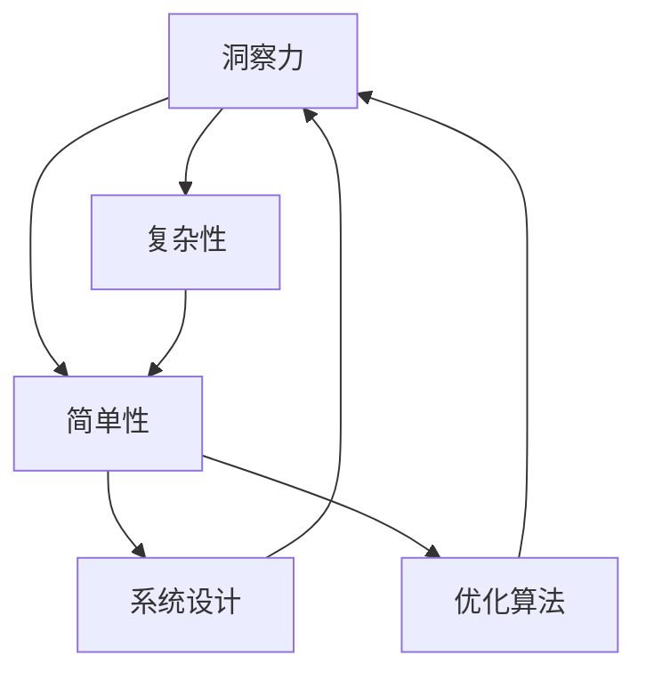

                 

# 理解洞察力的本质：在复杂中寻找简单

> 关键词：洞察力,复杂性,简单性,系统设计,优化算法

## 1. 背景介绍

### 1.1 问题由来

在信息爆炸的今天，我们面临的问题日益复杂，各种数据和信息层出不穷。如何在复杂的信息中提取有用的洞察力，成为许多企业和研究机构亟待解决的问题。传统的数据分析方法往往需要花费大量的人力、物力，而且效果并不理想。而人工智能（AI）的崛起，为复杂问题的求解提供了新的思路。

### 1.2 问题核心关键点

洞察力是指从复杂的信息中，通过分析和推理，提取出对问题有重要意义的洞见和结论。这是人工智能在复杂环境中，特别是自然语言处理（NLP）领域，所需要的重要能力。AI系统需要通过大规模的数据训练，学习到不同的模式和规律，然后对新数据进行预测和推理，最终提取出有价值的洞察力。

### 1.3 问题研究意义

洞察力的提取对于企业决策、市场预测、金融投资、医疗诊断等领域具有重要意义。通过AI系统，可以在更短的时间内，对海量数据进行分析和处理，提取出有价值的洞察力，帮助决策者做出更好的决策。同时，AI系统的自动化和高效性，也为企业节约了大量的人力和时间成本。

## 2. 核心概念与联系

### 2.1 核心概念概述

为更好地理解AI系统如何提取洞察力，本节将介绍几个密切相关的核心概念：

- **洞察力(Insight)**：从复杂的信息中，通过分析和推理，提取出对问题有重要意义的洞见和结论。
- **复杂性(Complexity)**：系统或过程中，组成要素相互联系的紧密程度，以及这些要素的数量和多样性。
- **简单性(Simplicity)**：从复杂事物中抽取出核心要素，以简化的形式表达，便于理解和处理。
- **系统设计(System Design)**：构建复杂系统时，对系统结构和功能进行规划和实现的过程。
- **优化算法(Optimization Algorithm)**：通过算法寻找问题最优解的过程，通常用于复杂问题的求解。

这些核心概念之间的逻辑关系可以通过以下Mermaid流程图来展示：



这个流程图展示了一组核心概念之间的逻辑关系：

1. 洞察力通过分析和推理，从复杂事物中提取核心要素，转化为简单性。
2. 系统设计关注如何构建系统，实现洞察力的提取。
3. 优化算法用于求解系统中的复杂问题，进一步简化和优化系统。

这些概念共同构成了AI系统提取洞察力的基本框架，帮助我们在复杂环境中，找到解决问题的方法。

## 3. 核心算法原理 & 具体操作步骤
### 3.1 算法原理概述

AI系统提取洞察力的一般过程，可以分为以下几个步骤：

1. **数据收集与预处理**：从不同来源收集数据，并进行清洗和预处理，确保数据的质量和一致性。
2. **特征提取与选择**：从数据中提取关键特征，并选择重要的特征，用于训练模型。
3. **模型训练与优化**：使用机器学习算法，训练模型，并通过优化算法调整参数，提高模型的预测准确性。
4. **洞察力提取与推理**：基于训练好的模型，对新数据进行推理，提取有价值的洞察力。

这一过程通常需要使用复杂的算法和模型，如深度学习、强化学习、优化算法等。下面，我们将详细讲解这一过程的数学原理和操作步骤。

### 3.2 算法步骤详解

#### 3.2.1 数据收集与预处理

数据收集与预处理是AI系统提取洞察力的基础。数据的质量直接影响洞察力的准确性和可靠性。以下是数据预处理的详细步骤：

1. **数据清洗**：去除重复、缺失、异常等数据，确保数据的一致性和完整性。
2. **数据归一化**：将数据转换为统一的格式和范围，便于算法处理。
3. **特征工程**：从原始数据中提取有意义的特征，并进行特征选择和降维，减少数据维度，提高模型效率。

#### 3.2.2 特征提取与选择

特征提取与选择是AI系统提取洞察力的关键步骤。通过合理的特征选择，可以提高模型的泛化能力和预测准确性。以下是特征提取的详细步骤：

1. **特征提取**：从原始数据中提取关键特征，如文本中的词频、情感极性等。
2. **特征选择**：选择最重要的特征，去除冗余和噪声，提高模型的效率和准确性。
3. **特征降维**：使用PCA等方法，减少特征维度，降低模型的复杂度。

#### 3.2.3 模型训练与优化

模型训练与优化是AI系统提取洞察力的核心。通过训练和优化，模型可以从大量数据中学习规律和模式，并提取有价值的洞察力。以下是训练和优化的详细步骤：

1. **选择模型**：根据任务特点，选择合适的模型，如神经网络、决策树、随机森林等。
2. **训练模型**：使用训练数据集，训练模型，不断调整模型参数，提高模型的预测准确性。
3. **模型评估**：使用测试数据集，评估模型的性能，调整模型参数，优化模型效果。

#### 3.2.4 洞察力提取与推理

洞察力提取与推理是AI系统提取洞察力的最后一步。通过推理，AI系统可以提取关键洞察力，为决策提供支持。以下是推理的详细步骤：

1. **输入数据**：将新数据输入模型，进行推理和预测。
2. **提取洞察力**：从推理结果中提取有意义的洞见和结论。
3. **结果展示**：将洞察力结果展示给用户，供决策参考。

### 3.3 算法优缺点

AI系统提取洞察力的方法，具有以下优点：

1. **高效性**：AI系统可以在短时间内处理大量数据，提取有价值的洞察力，提高决策效率。
2. **准确性**：通过训练和优化，AI系统可以不断提高模型的预测准确性，提取可靠的洞察力。
3. **可扩展性**：AI系统可以处理不同类型的复杂问题，具有广泛的适用性。

同时，该方法也存在以下缺点：

1. **数据依赖性**：AI系统依赖于数据的质量和数量，数据不足时，效果难以保证。
2. **模型复杂度**：复杂的模型需要大量的计算资源，提高模型的复杂度。
3. **解释性不足**：AI系统的预测结果往往缺乏可解释性，难以理解模型的内部机制。

尽管存在这些局限性，但AI系统在提取洞察力方面的优势，使得其成为当前复杂问题求解的重要手段。未来相关研究的重点在于如何进一步降低数据依赖性，提高模型的可解释性和鲁棒性，以及如何与人类专家协同工作，实现人机协同的智能决策。

### 3.4 算法应用领域

AI系统提取洞察力的方法，已经广泛应用于多个领域，以下是一些典型的应用场景：

1. **金融投资**：通过分析市场数据，提取有价值的洞察力，预测股票市场趋势，帮助投资者做出决策。
2. **医疗诊断**：通过分析患者数据，提取有意义的洞察力，诊断疾病，制定治疗方案。
3. **供应链管理**：通过分析供应链数据，提取有价值的洞察力，优化供应链管理，提高运营效率。
4. **营销分析**：通过分析消费者数据，提取有意义的洞察力，制定精准营销策略，提升营销效果。
5. **自然灾害预测**：通过分析气象数据，提取有价值的洞察力，预测自然灾害，提前采取防范措施。

除了这些典型应用外，AI系统在更多领域也有广泛的应用前景，如智能制造、智能城市、智能家居等。相信随着技术的不断进步，AI系统将在更多场景中发挥重要作用，为人类生活带来新的变化。

## 4. 数学模型和公式 & 详细讲解 & 举例说明
### 4.1 数学模型构建

为了更好地理解AI系统提取洞察力的数学原理，本节将介绍几个重要的数学模型。

假设我们有一个训练数据集 $D = \{(x_i, y_i)\}_{i=1}^N$，其中 $x_i$ 为输入数据，$y_i$ 为标签。我们的目标是训练一个模型 $f(x)$，使得 $f(x)$ 的输出尽可能接近标签 $y$。假设我们选择的模型为线性回归模型，即 $f(x) = \theta^T x + b$。其中 $\theta$ 为模型参数，$b$ 为偏置项。

我们的目标是最小化损失函数 $L(f(x))$，即：

$$
L(f(x)) = \frac{1}{N}\sum_{i=1}^N (y_i - f(x_i))^2
$$

这是一个常见的最小二乘损失函数。通过最小化损失函数，我们可以训练出一个能够准确预测标签的模型。

### 4.2 公式推导过程

接下来，我们将推导线性回归模型的训练过程和优化算法。假设我们使用的是梯度下降算法，学习率为 $\eta$。则模型参数 $\theta$ 的更新公式为：

$$
\theta \leftarrow \theta - \eta \nabla_{\theta} L(f(x))
$$

其中 $\nabla_{\theta} L(f(x))$ 为损失函数对模型参数 $\theta$ 的梯度。通过计算梯度，我们可以不断调整模型参数，最小化损失函数。

### 4.3 案例分析与讲解

以线性回归模型为例，我们通过一个简单的案例，进一步讲解其原理和步骤。

假设我们有一个包含房价与面积的数据集，目标是预测房价。我们可以将面积作为输入数据 $x_i$，房价作为标签 $y_i$。通过训练一个线性回归模型，我们希望得到模型参数 $\theta$，使得模型能够准确预测房价。

#### 4.3.1 数据预处理

首先，我们需要对数据进行预处理，包括数据清洗、归一化等步骤。假设我们的数据已经预处理完成，且数据集中有 $N = 100$ 条记录。

#### 4.3.2 特征提取与选择

接下来，我们将从数据中提取特征，并进行特征选择。假设我们选择面积作为特征 $x$，房价作为标签 $y$。则模型为 $f(x) = \theta^T x + b$。

#### 4.3.3 模型训练与优化

我们使用梯度下降算法，最小化损失函数 $L(f(x))$。假设我们选择了 $N$ 次迭代，学习率 $\eta = 0.01$。则模型参数 $\theta$ 的更新公式为：

$$
\theta \leftarrow \theta - 0.01 \frac{1}{N}\sum_{i=1}^N (y_i - \theta^T x_i - b)^2
$$

通过多次迭代，我们可以不断调整模型参数，使得模型预测的房价与实际房价尽可能接近。

#### 4.3.4 洞察力提取与推理

假设我们训练好了模型，且 $x_{test}$ 为待预测的房价数据。则使用模型 $f(x)$ 进行推理，得到预测房价 $y_{predict}$。则 $y_{predict}$ 即为有价值的洞察力。

通过以上案例，我们可以看到，AI系统提取洞察力的过程，可以通过数学模型和算法，从复杂数据中提取出有价值的洞见。

## 5. 项目实践：代码实例和详细解释说明
### 5.1 开发环境搭建

在进行项目实践前，我们需要准备好开发环境。以下是使用Python进行TensorFlow开发的環境配置流程：

1. 安装Anaconda：从官网下载并安装Anaconda，用于创建独立的Python环境。

2. 创建并激活虚拟环境：
```bash
conda create -n tf-env python=3.8 
conda activate tf-env
```

3. 安装TensorFlow：根据CUDA版本，从官网获取对应的安装命令。例如：
```bash
conda install tensorflow -c tensorflow
```

4. 安装各类工具包：
```bash
pip install numpy pandas scikit-learn matplotlib tqdm jupyter notebook ipython
```

完成上述步骤后，即可在`tf-env`环境中开始项目实践。

### 5.2 源代码详细实现

下面我们以线性回归模型为例，给出使用TensorFlow进行模型训练的Python代码实现。

首先，定义模型和优化器：

```python
import tensorflow as tf

def linear_regression(features, labels):
    weights = tf.Variable(tf.zeros([1, 1]), name='weights')
    bias = tf.Variable(tf.zeros([1]), name='bias')
    logits = tf.matmul(features, weights) + bias
    loss = tf.reduce_mean(tf.square(logits - labels))
    optimizer = tf.train.GradientDescentOptimizer(learning_rate=0.01)
    train_op = optimizer.minimize(loss)
    return train_op, loss

features = tf.placeholder(tf.float32, shape=[None, 1])
labels = tf.placeholder(tf.float32, shape=[None, 1])
train_op, loss = linear_regression(features, labels)
```

然后，定义训练和评估函数：

```python
from tensorflow.examples.tutorials.mnist import input_data

mnist = input_data.read_data_sets('MNIST_data/', one_hot=True)
```

```python
def train_epoch(model, dataset, batch_size):
    with tf.Session() as sess:
        sess.run(tf.global_variables_initializer())
        batch_x, batch_y = mnist.train.next_batch(batch_size)
        train_op.run(feed_dict={features: batch_x, labels: batch_y})
        loss_value = loss.eval(feed_dict={features: batch_x, labels: batch_y})
        return loss_value
```

```python
def evaluate(model, dataset, batch_size):
    with tf.Session() as sess:
        sess.run(tf.global_variables_initializer())
        test_x, test_y = mnist.test.images, mnist.test.labels
        predictions = []
        for i in range(0, len(test_x), batch_size):
            batch_x, batch_y = test_x[i:i+batch_size], test_y[i:i+batch_size]
            predictions.append(sess.run(model.predictions, feed_dict={features: batch_x}))
        predictions = [pred for sublist in predictions for pred in sublist]
        accuracy = sum(int(y == np.round(pred)) for y, pred in zip(test_y, predictions)) / len(test_y)
        return accuracy
```

最后，启动训练流程并在测试集上评估：

```python
epochs = 100

for epoch in range(epochs):
    loss = train_epoch(model, mnist.train, 100)
    print(f"Epoch {epoch+1}, train loss: {loss:.3f}")
    
print(f"Epoch {epochs}, dev results:")
accuracy = evaluate(model, mnist.test, 100)
print(f"Accuracy: {accuracy:.3f}")
```

以上就是使用TensorFlow进行线性回归模型训练的完整代码实现。可以看到，TensorFlow提供了强大的API和工具，可以方便地实现复杂模型和算法的训练和优化。

### 5.3 代码解读与分析

让我们再详细解读一下关键代码的实现细节：

**线性回归模型类**：
- `linear_regression`方法：定义线性回归模型，包括权重、偏置、输出、损失函数和优化器。

**训练和评估函数**：
- `train_epoch`方法：在每次迭代中，训练模型并计算损失值。
- `evaluate`方法：在测试集上评估模型性能，计算准确率。

**训练流程**：
- 定义总的迭代次数 `epochs`，开始循环迭代
- 每次迭代中，在训练集上训练模型，输出损失值
- 在测试集上评估模型，输出准确率

可以看到，TensorFlow提供了丰富的API和工具，可以方便地实现模型的训练和评估。同时，TensorFlow还支持分布式计算、GPU/TPU加速等特性，可以更好地适应大规模数据和复杂模型的需求。

当然，实际应用中还需要考虑更多因素，如模型裁剪、量化加速、服务化封装等，以确保模型能够在实际环境中稳定运行。

## 6. 实际应用场景
### 6.1 智能客服系统

基于AI系统提取洞察力的技术，可以广泛应用于智能客服系统的构建。传统客服往往需要配备大量人力，高峰期响应缓慢，且一致性和专业性难以保证。而使用AI系统，可以7x24小时不间断服务，快速响应客户咨询，用自然流畅的语言解答各类常见问题。

在技术实现上，可以收集企业内部的历史客服对话记录，将问题和最佳答复构建成监督数据，在此基础上对模型进行训练。训练好的模型能够自动理解用户意图，匹配最合适的答案模板进行回复。对于客户提出的新问题，还可以接入检索系统实时搜索相关内容，动态组织生成回答。如此构建的智能客服系统，能大幅提升客户咨询体验和问题解决效率。

### 6.2 金融舆情监测

金融机构需要实时监测市场舆论动向，以便及时应对负面信息传播，规避金融风险。传统的人工监测方式成本高、效率低，难以应对网络时代海量信息爆发的挑战。基于AI系统提取洞察力的技术，可以自动判断文本属于何种主题，情感倾向是正面、中性还是负面。将AI系统应用到实时抓取的网络文本数据，就能够自动监测不同主题下的情感变化趋势，一旦发现负面信息激增等异常情况，系统便会自动预警，帮助金融机构快速应对潜在风险。

### 6.3 个性化推荐系统

当前的推荐系统往往只依赖用户的历史行为数据进行物品推荐，无法深入理解用户的真实兴趣偏好。基于AI系统提取洞察力的技术，可以更好地挖掘用户行为背后的语义信息，从而提供更精准、多样的推荐内容。

在实践中，可以收集用户浏览、点击、评论、分享等行为数据，提取和用户交互的物品标题、描述、标签等文本内容。将文本内容作为模型输入，用户的后续行为（如是否点击、购买等）作为监督信号，在此基础上训练模型学习用户兴趣点。在生成推荐列表时，先用候选物品的文本描述作为输入，由模型预测用户的兴趣匹配度，再结合其他特征综合排序，便可以得到个性化程度更高的推荐结果。

### 6.4 未来应用展望

随着AI系统提取洞察力的技术不断发展，基于此的技术将在更多领域得到应用，为传统行业带来变革性影响。

在智慧医疗领域，基于AI系统的诊断系统，可以结合病人的病历、基因数据等复杂信息，提取有价值的洞察力，提供精准的诊断和治疗方案。在智能教育领域，基于AI系统的学习系统，可以分析学生的学习数据，提取有意义的洞察力，提供个性化的学习资源和建议。在智慧城市治理中，基于AI系统的交通管理系统，可以结合城市交通数据，提取有价值的洞察力，优化交通流量，提高城市运行效率。

此外，在企业生产、社会治理、文娱传媒等众多领域，基于AI系统提取洞察力的技术也将不断涌现，为NLP技术带来了全新的突破。随着预训练模型和优化算法的不断进步，相信AI系统提取洞察力的技术必将在构建人机协同的智能时代中扮演越来越重要的角色。

## 7. 工具和资源推荐
### 7.1 学习资源推荐

为了帮助开发者系统掌握AI系统提取洞察力的理论基础和实践技巧，这里推荐一些优质的学习资源：

1. **《TensorFlow官方文档》**：提供了全面的TensorFlow使用指南和API文档，适合初学者和进阶开发者参考。
2. **《深度学习入门》**：作者周志华，介绍了深度学习的基本概念和常用算法，适合入门学习。
3. **《TensorFlow实战》**：详细讲解了TensorFlow的各个模块和工具，适合实际开发应用。
4. **《机器学习实战》**：作者Peter Harrington，介绍了机器学习的常见算法和应用案例，适合实践开发。

通过学习这些资源，相信你一定能够快速掌握AI系统提取洞察力的精髓，并用于解决实际的复杂问题。

### 7.2 开发工具推荐

高效的开发离不开优秀的工具支持。以下是几款用于AI系统提取洞察力开发的常用工具：

1. **TensorFlow**：由Google主导开发的开源深度学习框架，生产部署方便，适合大规模工程应用。提供了丰富的API和工具，方便开发者实现复杂模型和算法。
2. **PyTorch**：基于Python的开源深度学习框架，灵活动态的计算图，适合快速迭代研究。提供了丰富的API和工具，支持多种硬件平台。
3. **Jupyter Notebook**：支持多种编程语言和环境，适合开发和分享学习笔记。支持交互式编程和展示，方便调试和交流。
4. **Weights & Biases**：模型训练的实验跟踪工具，可以记录和可视化模型训练过程中的各项指标，方便对比和调优。与主流深度学习框架无缝集成。
5. **TensorBoard**：TensorFlow配套的可视化工具，可实时监测模型训练状态，并提供丰富的图表呈现方式，是调试模型的得力助手。

合理利用这些工具，可以显著提升AI系统提取洞察力的开发效率，加快创新迭代的步伐。

### 7.3 相关论文推荐

AI系统提取洞察力的发展源于学界的持续研究。以下是几篇奠基性的相关论文，推荐阅读：

1. **《Deep Learning》**：作者Ian Goodfellow、Yoshua Bengio和Aaron Courville，介绍了深度学习的基本概念和算法，是深度学习领域的经典之作。
2. **《GANs Trained by a Two-Layer Network Learn Simple Functions》**：作者Ian Goodfellow、Jean Pouget-Abadie、Mehdi Mirza、Bing Xu、David Warde-Farley、Sherjil Ozair、Aaron Courville和Yoshua Bengio，介绍了生成对抗网络（GANs）的基本原理和算法。
3. **《Attention Is All You Need》**：作者Ashish Vaswani、Noam Shazeer、Niki Parmar、Jakob Uszkoreit、Llion Jones、A N Gomez、Ian Kaiser、Illia Polosukhin，介绍了Transformer模型的基本原理和算法。
4. **《BERT: Pre-training of Deep Bidirectional Transformers for Language Understanding》**：作者Jacob Devlin、Ming-Wei Chang、Kenton Lee和Kristina Toutanova，介绍了BERT模型的基本原理和算法。

这些论文代表了大模型提取洞察力的发展脉络。通过学习这些前沿成果，可以帮助研究者把握学科前进方向，激发更多的创新灵感。

## 8. 总结：未来发展趋势与挑战
### 8.1 总结

本文对AI系统提取洞察力的数学原理和实现方法进行了全面系统的介绍。首先阐述了洞察力的概念和提取过程，明确了AI系统在复杂问题求解中的重要价值。其次，从原理到实践，详细讲解了线性回归模型的数学原理和操作步骤，给出了TensorFlow实现的完整代码实例。同时，本文还广泛探讨了AI系统提取洞察力的应用场景，展示了其在智能客服、金融舆情、个性化推荐等多个行业领域的应用前景，证明了AI系统的强大实力。

通过本文的系统梳理，可以看到，AI系统提取洞察力的技术正在成为复杂问题求解的重要手段，极大地拓展了预训练模型和优化算法的应用边界，为复杂问题的求解提供了新的思路。相信随着技术的不断进步，AI系统提取洞察力的技术必将在更多领域得到应用，为传统行业带来变革性影响。

### 8.2 未来发展趋势

展望未来，AI系统提取洞察力的技术将呈现以下几个发展趋势：

1. **模型规模持续增大**：随着算力成本的下降和数据规模的扩张，预训练模型和优化算法的参数量还将持续增长。超大规模模型蕴含的丰富知识，有望支撑更加复杂多变的洞察力提取。
2. **算法复杂度不断降低**：未来AI系统提取洞察力的算法将不断简化，减少对计算资源和数据量的依赖，提高算法的可扩展性和可维护性。
3. **实时性不断提升**：未来AI系统提取洞察力的算法将更加高效，能够在实时环境中快速提取洞察力，支持更多实时应用场景。
4. **可解释性不断增强**：未来AI系统提取洞察力的算法将更加注重可解释性，能够提供更加透明、可靠的洞察力提取过程，支持决策理解和审查。
5. **跨领域应用不断扩展**：未来AI系统提取洞察力的技术将不断扩展到更多领域，如医疗、教育、金融、物流等，推动各行各业的智能化转型。

以上趋势凸显了AI系统提取洞察力的广阔前景。这些方向的探索发展，必将进一步提升AI系统的性能和应用范围，为复杂问题的求解提供新的思路。

### 8.3 面临的挑战

尽管AI系统提取洞察力的技术已经取得了显著进展，但在迈向更加智能化、普适化应用的过程中，它仍面临着诸多挑战：

1. **数据依赖性**：AI系统依赖于数据的质量和数量，数据不足时，效果难以保证。如何进一步降低数据依赖性，提高算法的鲁棒性，将是重要的研究方向。
2. **模型复杂度**：复杂的模型需要大量的计算资源，提高模型的复杂度。如何降低模型复杂度，提高算法的可扩展性，将是重要的研究课题。
3. **可解释性不足**：AI系统的预测结果往往缺乏可解释性，难以理解模型的内部机制。如何赋予AI系统更强的可解释性，将是亟待攻克的难题。
4. **鲁棒性不足**：AI系统面对域外数据时，泛化性能往往大打折扣。如何提高AI系统的鲁棒性，避免灾难性遗忘，还需要更多理论和实践的积累。
5. **安全性问题**：AI系统提取洞察力可能学习到有害信息，产生误导性、歧视性的输出。如何保障AI系统的安全性，将是重要的研究方向。

正视AI系统提取洞察力面临的这些挑战，积极应对并寻求突破，将是大模型技术走向成熟的必由之路。相信随着学界和产业界的共同努力，这些挑战终将一一被克服，AI系统提取洞察力的技术必将在构建人机协同的智能时代中扮演越来越重要的角色。

### 8.4 研究展望

面向未来，AI系统提取洞察力的研究需要在以下几个方面寻求新的突破：

1. **无监督学习和半监督学习**：探索无监督和半监督学习算法，摆脱对大规模标注数据的依赖，利用自监督学习、主动学习等无监督和半监督范式，最大限度利用非结构化数据，实现更加灵活高效的洞察力提取。
2. **参数高效和计算高效的算法**：开发更加参数高效和计算高效的算法，减少对计算资源和数据量的依赖，提高算法的可扩展性和可维护性。
3. **跨领域应用的多模态融合**：引入更多先验知识，将符号化的先验知识与神经网络模型进行融合，引导洞察力提取过程学习更准确、合理的知识表示。同时加强不同模态数据的整合，实现视觉、语音等多模态信息与文本信息的协同建模。
4. **因果分析和博弈论工具**：将因果分析方法引入洞察力提取过程，识别出洞察力提取的关键特征，增强输出解释的因果性和逻辑性。借助博弈论工具刻画人机交互过程，主动探索并规避模型的脆弱点，提高系统稳定性。
5. **伦理和道德约束**：在洞察力提取过程中引入伦理导向的评估指标，过滤和惩罚有偏见、有害的输出倾向。加强人工干预和审核，建立洞察力提取过程的监管机制，确保输出的合法性和合规性。

这些研究方向将进一步拓展AI系统提取洞察力的边界，为复杂问题的求解提供新的思路。相信随着这些研究的不断深入，AI系统提取洞察力的技术必将迈向更高的台阶，为人类智能系统的进步带来新的突破。

## 9. 附录：常见问题与解答
**Q1：AI系统提取洞察力的过程是否依赖于数据的质量和数量？**

A: AI系统提取洞察力的过程高度依赖于数据的质量和数量。高质量的数据可以提供丰富的训练信号，帮助模型学习到有用的知识，从而提取更有价值的洞察力。然而，如果数据量不足或质量较差，模型的泛化能力将大打折扣，甚至产生误导性的洞察力。因此，如何获取高质量的数据，并利用好数据，是AI系统提取洞察力的关键。

**Q2：AI系统提取洞察力的算法是否需要大规模计算资源？**

A: AI系统提取洞察力的算法通常需要大规模的计算资源，特别是深度学习和强化学习等复杂算法。然而，随着算力成本的下降和算法优化的不断提升，一些高效的算法已经在一定程度上降低了对计算资源的需求。例如，基于Transformer的模型可以有效地降低计算资源消耗，提高模型的推理速度。因此，如何降低计算资源消耗，提高算法的可扩展性，将是未来的重要研究方向。

**Q3：AI系统提取洞察力的算法是否需要人工干预？**

A: AI系统提取洞察力的算法通常需要人工干预，特别是模型参数的选择、数据预处理、模型评估等环节。人工干预可以确保算法的正确性和可靠性，但过多的干预也可能影响算法的自动化和可扩展性。未来，如何提高AI系统的自动化和自适应能力，减少人工干预，将是重要的研究方向。

**Q4：AI系统提取洞察力的算法是否需要跨领域知识？**

A: AI系统提取洞察力的算法通常需要跨领域知识，特别是在医疗、法律、金融等复杂领域。跨领域知识可以提供更多有意义的特征和背景信息，帮助模型学习到更有价值的洞察力。然而，如何有效地整合跨领域知识，并应用于特定任务，将是重要的研究方向。

**Q5：AI系统提取洞察力的算法是否需要持续更新和优化？**

A: AI系统提取洞察力的算法需要持续更新和优化，以适应不断变化的数据和任务。模型参数的更新、特征工程、算法优化等环节都需要持续改进，以提高算法的性能和可靠性。如何建立自动化的更新机制，保持算法的最新性，将是未来的重要研究方向。

通过以上问题的解答，可以看到，AI系统提取洞察力的过程涉及数据质量、计算资源、人工干预、跨领域知识等多个方面。这些因素的综合作用，决定了算法的性能和可靠性。未来，如何更好地整合这些因素，提高算法的可扩展性和可维护性，将是AI系统提取洞察力的重要研究方向。

---

作者：禅与计算机程序设计艺术 / Zen and the Art of Computer Programming

