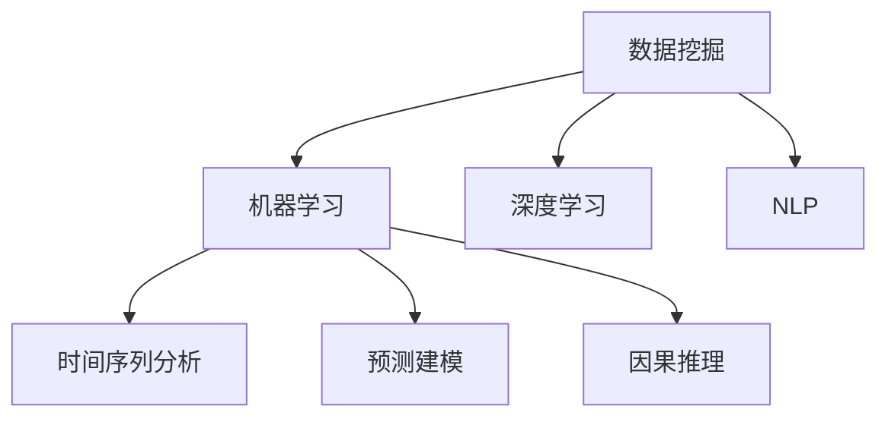

                 

# 理解洞察力的本质：在复杂中寻找规律

在人工智能(AI)和数据科学领域，洞察力是指从大量复杂数据中提取有价值信息和洞见的能力。这种能力对于解决实际问题、优化决策和提升业务效率至关重要。本文旨在深入探讨洞察力的本质，并介绍一些在实际应用中常用的方法和技术，帮助读者理解如何在复杂数据中寻找规律，并利用这些规律做出更明智的决策。

## 1. 背景介绍

### 1.1 问题由来

随着大数据和人工智能技术的发展，从各种数据源中提取有价值信息的能力变得愈发重要。企业、政府机构和其他组织面临着海量数据，如何从中挖掘出有意义的信息和洞见，成为了信息时代的重要挑战。洞察力不仅可以帮助决策者理解过去和现在的趋势，还能预测未来，为制定更好的战略和政策提供依据。

### 1.2 问题核心关键点

洞察力的核心关键点包括：
1. **数据多样性**：数据的类型和来源多种多样，包括文本、图像、视频、传感器数据等。
2. **数据规模**：数据量级从TB到PB，甚至更高，数据处理和存储成为挑战。
3. **数据质量**：数据质量参差不齐，存在噪声、不完整、不准确等问题。
4. **洞察提取**：从大量数据中提取有价值的洞见，需要处理复杂性和不确定性。
5. **决策支持**：将洞察转化为实际行动，支持业务决策和战略规划。

### 1.3 问题研究意义

洞察力的研究不仅具有理论意义，对于实际应用也具有重要价值：
1. **优化决策**：通过分析历史和实时数据，洞察力能够帮助决策者更好地理解问题和机会。
2. **提升效率**：洞察力可以揭示业务流程中的瓶颈，帮助优化流程，提高效率。
3. **降低风险**：洞察力能够识别潜在的风险和威胁，帮助提前采取措施。
4. **增强竞争力**：洞察力是企业竞争力的重要组成部分，能够帮助企业在激烈的市场竞争中脱颖而出。

## 2. 核心概念与联系

### 2.1 核心概念概述

要理解洞察力的本质，首先需要明确一些关键概念：

1. **数据挖掘(Data Mining)**：从数据集中发现有价值的模式、规律和趋势的过程。
2. **机器学习(Machine Learning)**：利用算法让计算机从数据中学习规律，并应用到新数据中。
3. **深度学习(Deep Learning)**：一种特殊类型的机器学习，利用多层次神经网络来处理复杂数据。
4. **自然语言处理(Natural Language Processing, NLP)**：使计算机能够理解、处理和生成人类语言的技术。
5. **时间序列分析(Time Series Analysis)**：分析时间序列数据，以揭示趋势、周期和异常。
6. **预测建模(Predictive Modeling)**：利用历史数据预测未来事件或结果。
7. **因果推理(Causal Inference)**：理解事件之间的因果关系，以做出更加准确的预测。

这些概念之间存在紧密联系，共同构成了洞察力的基础框架。例如，数据挖掘和机器学习是获取洞察力的主要工具，深度学习和NLP技术可以处理复杂的数据类型和格式，时间序列分析和预测建模用于分析时间相关数据，因果推理则帮助理解事件之间的内在联系。

### 2.2 核心概念原理和架构的 Mermaid 流程图(Mermaid 流程节点中不要有括号、逗号等特殊字符)



这个流程图展示了数据挖掘、机器学习、深度学习、NLP、时间序列分析、预测建模和因果推理之间的联系。

## 3. 核心算法原理 & 具体操作步骤

### 3.1 算法原理概述

洞察力的获取通常涉及以下步骤：

1. **数据收集**：从各种数据源（如传感器、数据库、网络等）收集数据。
2. **数据清洗和预处理**：清洗数据，处理缺失值、异常值，进行特征工程。
3. **数据探索性分析**：使用统计学方法和可视化技术，探索数据特性和分布。
4. **模型训练和优化**：选择合适的模型，训练和优化模型参数。
5. **洞察提取和分析**：利用模型提取有价值的洞见，并进行深入分析。
6. **决策支持**：将洞察力转化为实际行动，支持业务决策。

### 3.2 算法步骤详解

#### 3.2.1 数据收集和预处理

数据收集通常涉及多种数据源，如日志文件、数据库、社交媒体、传感器数据等。数据的预处理包括：
- 数据清洗：去除噪声、处理缺失值、异常值。
- 特征工程：提取、选择和构建特征，为模型训练做准备。

#### 3.2.2 数据探索性分析

数据探索性分析（Exploratory Data Analysis, EDA）有助于理解数据的基本特性和分布。常用的EDA技术包括：
- 描述性统计：计算均值、中位数、标准差等。
- 数据可视化：使用图表（如直方图、散点图、箱线图）展示数据分布和关系。
- 相关性分析：使用皮尔逊相关系数或斯皮尔曼等级相关性系数计算变量之间的相关性。

#### 3.2.3 模型训练和优化

模型训练和优化是获取洞察力的核心步骤。选择合适的模型和算法，通过交叉验证、网格搜索等方法进行调参。常用的模型包括：
- 线性回归、决策树、随机森林、支持向量机（SVM）等传统机器学习模型。
- 深度神经网络、卷积神经网络（CNN）、循环神经网络（RNN）、长短期记忆网络（LSTM）等深度学习模型。
- 时间序列模型，如ARIMA、季节性ARIMA等。

#### 3.2.4 洞察提取和分析

洞察提取通常涉及两个主要步骤：
- 模型训练：使用历史数据训练模型，获取洞察力。
- 洞察分析：利用统计学和可视化技术，分析模型输出，提取有价值的洞见。

### 3.3 算法优缺点

#### 3.3.1 优点

1. **自动化和高效性**：机器学习和深度学习模型可以自动提取和分析数据，大大提高效率。
2. **复杂性处理**：深度学习模型特别擅长处理复杂和非结构化数据，如自然语言、图像等。
3. **可解释性**：现代解释性方法可以帮助理解模型的决策过程。
4. **灵活性**：可以根据不同的业务需求和数据特性，灵活选择和调整模型。

#### 3.3.2 缺点

1. **数据依赖性**：模型的性能高度依赖于数据的质量和代表性。
2. **过拟合风险**：复杂模型可能过拟合训练数据，导致泛化能力差。
3. **模型复杂性**：深度学习模型结构复杂，训练和调参难度大。
4. **计算资源需求高**：深度学习模型需要大量计算资源进行训练和优化。

### 3.4 算法应用领域

洞察力在多个领域都有广泛应用，例如：

- **金融行业**：利用洞察力进行风险评估、市场预测、欺诈检测等。
- **医疗行业**：通过洞察力提高诊断准确性、治疗方案优化、药物研发等。
- **零售行业**：用于消费者行为分析、库存管理、定价策略优化等。
- **制造业**：用于生产流程优化、质量控制、设备维护预测等。
- **交通运输**：用于交通流量预测、路径规划、事故预防等。

## 4. 数学模型和公式 & 详细讲解 & 举例说明

### 4.1 数学模型构建

#### 4.1.1 线性回归模型

线性回归模型是最基本的预测模型之一，用于建立一个自变量与因变量之间的线性关系。模型可以表示为：

$$
y = \beta_0 + \beta_1x_1 + \beta_2x_2 + \ldots + \beta_nx_n + \epsilon
$$

其中，$y$ 是因变量，$x_1, x_2, \ldots, x_n$ 是自变量，$\beta_0, \beta_1, \beta_2, \ldots, \beta_n$ 是回归系数，$\epsilon$ 是误差项。

#### 4.1.2 梯度下降算法

梯度下降算法用于求解线性回归模型的最优参数。梯度下降的更新公式为：

$$
\theta_j = \theta_j - \alpha \frac{\partial L(\theta)}{\partial \theta_j}
$$

其中，$\theta_j$ 是参数向量中的第 $j$ 个元素，$\alpha$ 是学习率，$L(\theta)$ 是损失函数，$\frac{\partial L(\theta)}{\partial \theta_j}$ 是损失函数对参数 $\theta_j$ 的偏导数。

### 4.2 公式推导过程

#### 4.2.1 最小二乘法

线性回归模型中的最小二乘法用于求解最优参数 $\theta$，使损失函数 $L(\theta)$ 最小化。损失函数可以表示为：

$$
L(\theta) = \frac{1}{2N} \sum_{i=1}^N (y_i - \hat{y}_i)^2
$$

其中，$N$ 是样本数量，$y_i$ 是实际观测值，$\hat{y}_i$ 是模型预测值。

通过求解 $L(\theta)$ 的偏导数，可以得到参数更新公式：

$$
\hat{\theta} = (X^TX)^{-1}X^Ty
$$

其中，$X$ 是自变量矩阵，$y$ 是因变量向量。

### 4.3 案例分析与讲解

#### 4.3.1 股票价格预测

假设有一组历史股票价格数据，我们想要预测未来股价。可以使用线性回归模型进行预测。首先进行数据清洗和特征工程，然后使用最小二乘法训练模型，最后利用模型预测未来股价。

## 5. 项目实践：代码实例和详细解释说明

### 5.1 开发环境搭建

#### 5.1.1 Python环境搭建

1. 安装Anaconda：从官网下载并安装Anaconda，用于创建独立的Python环境。

2. 创建并激活虚拟环境：
```bash
conda create -n myenv python=3.8
conda activate myenv
```

3. 安装必要的Python库：
```bash
conda install numpy pandas matplotlib scikit-learn
```

4. 安装深度学习库：
```bash
conda install tensorflow keras
```

### 5.2 源代码详细实现

#### 5.2.1 线性回归模型

```python
import numpy as np
import pandas as pd
import matplotlib.pyplot as plt
from sklearn.linear_model import LinearRegression
from sklearn.metrics import mean_squared_error, r2_score

# 加载数据
data = pd.read_csv('stock_prices.csv')

# 数据清洗和预处理
X = data[['open', 'high', 'low', 'volume']] # 自变量
y = data['close'] # 因变量
X = np.array(X)
y = np.array(y)

# 划分训练集和测试集
X_train, X_test = X[:500], X[500:]
y_train, y_test = y[:500], y[500:]

# 训练模型
model = LinearRegression()
model.fit(X_train, y_train)

# 预测并评估模型
y_pred = model.predict(X_test)
mse = mean_squared_error(y_test, y_pred)
rmse = np.sqrt(mse)
r2 = r2_score(y_test, y_pred)

# 可视化
plt.plot(y_test, label='Actual')
plt.plot(y_pred, label='Predicted')
plt.legend()
plt.show()

# 输出评估结果
print('RMSE:', rmse)
print('R2 Score:', r2)
```

#### 5.2.2 时间序列模型

```python
import pandas as pd
import matplotlib.pyplot as plt
from statsmodels.tsa.arima_model import ARIMA
from sklearn.metrics import mean_squared_error, r2_score

# 加载数据
data = pd.read_csv('sales_data.csv')

# 数据清洗和预处理
X = data['Sales']
X = np.array(X)
y = np.array(X)

# 划分训练集和测试集
X_train, X_test = X[:500], X[500:]
y_train, y_test = y[:500], y[500:]

# 训练模型
model = ARIMA(X_train, order=(5, 1, 0))
model_fit = model.fit()

# 预测并评估模型
y_pred = model_fit.predict(start=len(X_train), end=len(X_train) + len(X_test) - 1)
mse = mean_squared_error(y_test, y_pred)
rmse = np.sqrt(mse)
r2 = r2_score(y_test, y_pred)

# 可视化
plt.plot(y_test, label='Actual')
plt.plot(y_pred, label='Predicted')
plt.legend()
plt.show()

# 输出评估结果
print('RMSE:', rmse)
print('R2 Score:', r2)
```

### 5.3 代码解读与分析

#### 5.3.1 线性回归模型

代码中首先加载数据，然后进行数据清洗和预处理。使用`LinearRegression`类训练模型，并通过均方误差和决定系数评估模型性能。最后绘制预测值和实际值对比图。

#### 5.3.2 时间序列模型

代码中首先加载数据，然后进行数据清洗和预处理。使用`ARIMA`模型训练时间序列模型，并通过均方误差和决定系数评估模型性能。最后绘制预测值和实际值对比图。

### 5.4 运行结果展示

运行上述代码，可以得到模型预测值和实际值的对比图，并输出均方误差和决定系数。

## 6. 实际应用场景

### 6.1 金融行业

金融行业可以利用洞察力进行风险评估、市场预测和欺诈检测。例如，可以使用机器学习模型分析历史交易数据，预测股票价格，识别潜在的市场趋势和风险。

### 6.2 医疗行业

医疗行业可以利用洞察力提高诊断准确性、优化治疗方案和加速药物研发。例如，通过分析患者历史数据，预测病情发展趋势，制定个性化的治疗方案。

### 6.3 零售行业

零售行业可以利用洞察力进行消费者行为分析、库存管理和定价策略优化。例如，通过分析销售数据，识别客户偏好，优化产品组合和定价策略。

### 6.4 制造业

制造业可以利用洞察力进行生产流程优化、质量控制和设备维护预测。例如，通过分析设备运行数据，预测设备故障，优化生产流程，提高生产效率。

### 6.5 交通运输

交通运输行业可以利用洞察力进行交通流量预测、路径规划和事故预防。例如，通过分析交通数据，预测交通流量，优化交通路线，减少交通事故。

## 7. 工具和资源推荐

### 7.1 学习资源推荐

为了帮助开发者系统掌握洞察力的获取和应用，这里推荐一些优质的学习资源：

1. 《Python数据分析与统计建模》：涵盖了Python数据分析的基本方法和统计建模技术，适合初学者入门。
2. 《深度学习》：Ian Goodfellow等人合著的经典教材，全面介绍了深度学习的基础和应用。
3. 《Python机器学习》：使用Python实现机器学习算法的详细教程，适合实战学习。
4. 《Data Science from Scratch》：Jake VanderPlas的入门级数据科学教程，涵盖了数据处理、可视化、机器学习等。
5. 《机器学习实战》：Peter Harrington的实战教程，通过具体案例讲解机器学习算法。

### 7.2 开发工具推荐

为了提高开发效率，以下是一些常用的开发工具：

1. Jupyter Notebook：用于编写和执行Python代码，支持交互式计算和数据可视化。
2. Scikit-learn：Python机器学习库，提供了丰富的数据处理和模型训练工具。
3. TensorFlow和Keras：深度学习库，支持复杂模型的构建和训练。
4. Pandas：数据处理库，提供了高效的数据清洗和分析功能。
5. Matplotlib和Seaborn：数据可视化库，支持各种图表的绘制。

### 7.3 相关论文推荐

为了深入理解洞察力的获取和应用，以下是一些相关领域的经典论文：

1. "Data Mining, Statistical Learning, and Statistical Inference"：Tibshirani的综述论文，详细介绍了数据挖掘和统计学习的基础。
2. "Deep Learning"：Goodfellow等人的经典教材，全面介绍了深度学习的基础和应用。
3. "The Elements of Statistical Learning"：Hastie等人的经典教材，介绍了统计学习方法。
4. "Predictive Modeling with Linear Models"：Hoerl和Kennard的论文，介绍了线性回归模型的应用。
5. "Causal Inference in Statistics, Social, and Biomedical Sciences"：Hernán和Robins的教材，介绍了因果推理的基础。

## 8. 总结：未来发展趋势与挑战

### 8.1 研究成果总结

本文探讨了洞察力的本质和获取方法，并介绍了一些常用的技术。通过学习本文，读者可以理解如何在复杂数据中寻找规律，并利用这些规律做出更好的决策。

### 8.2 未来发展趋势

洞察力的获取和应用将随着技术的进步和数据的丰富而不断发展：
1. **自动化和智能化**：未来洞察力的获取将更加自动化和智能化，利用更先进的算法和更强大的计算资源。
2. **跨领域应用**：洞察力将在更多领域得到应用，如医疗、金融、零售等。
3. **实时性和交互性**：洞察力将更加实时和交互性，通过实时数据分析和反馈，动态调整决策。
4. **多模态数据融合**：洞察力将融合多模态数据，利用图像、文本、传感器等多种数据源，获得更全面的洞见。
5. **因果推理**：洞察力将更加注重因果推理，理解事件之间的内在联系，做出更加准确的预测。

### 8.3 面临的挑战

尽管洞察力的获取和应用在不断进步，但仍面临诸多挑战：
1. **数据质量和多样性**：数据的准确性和多样性仍是制约洞察力获取的重要因素。
2. **计算资源**：复杂模型的训练和优化需要大量的计算资源，如何优化计算效率是一个挑战。
3. **模型复杂性**：深度学习模型的复杂性增加了理解和解释的难度。
4. **隐私和伦理**：数据隐私和伦理问题需引起重视，避免数据滥用。
5. **技术门槛**：技术门槛较高，需要具备相关知识才能应用洞察力。

### 8.4 研究展望

未来的研究将在以下几个方面寻求突破：
1. **无监督和半监督学习**：通过无监督和半监督学习，减少对标注数据的依赖，提高洞察力获取的效率。
2. **知识图谱**：利用知识图谱等结构化数据，增强洞察力的解释性和可理解性。
3. **跨领域迁移学习**：通过跨领域迁移学习，提升模型的泛化能力和应用范围。
4. **联邦学习**：利用联邦学习技术，保护数据隐私，提高模型训练的安全性。
5. **因果推理**：结合因果推理方法，增强洞察力的可解释性和决策依据的可靠性。

## 9. 附录：常见问题与解答

### 9.1 Q1: 什么是洞察力？

A: 洞察力是指从大量复杂数据中提取有价值信息和洞见的能力。它涉及数据挖掘、机器学习、深度学习等多种技术，是决策支持的重要工具。

### 9.2 Q2: 如何在复杂数据中寻找规律？

A: 在复杂数据中寻找规律，通常涉及数据清洗、特征工程、模型训练和优化等步骤。选择合适的模型和算法，进行数据分析和可视化，提取有价值的洞见。

### 9.3 Q3: 洞察力在金融行业的应用有哪些？

A: 在金融行业，洞察力可用于风险评估、市场预测和欺诈检测。通过分析历史交易数据，预测股票价格，识别市场趋势和风险。

### 9.4 Q4: 时间序列模型的应用有哪些？

A: 时间序列模型可用于预测股票价格、销售数据、交通流量等。通过分析历史数据，预测未来趋势和结果。

### 9.5 Q5: 深度学习在洞察力获取中的应用有哪些？

A: 深度学习可用于处理复杂的非结构化数据，如自然语言、图像等。通过构建深度神经网络，提取有价值的洞见。

---

作者：禅与计算机程序设计艺术 / Zen and the Art of Computer Programming

