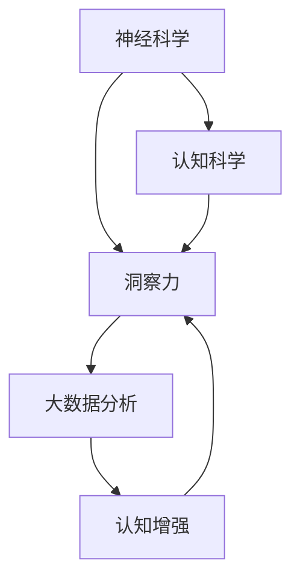

                 

# 理解洞察力的科学：揭开大脑秘密

> 关键词：神经科学, 洞察力, 认知科学, 大数据, 认知增强

## 1. 背景介绍

### 1.1 问题由来
在当今信息爆炸的时代，如何从海量数据中提取有价值的洞察力成为了一个迫切需要解决的问题。传统的基于统计学和机器学习的分析方法，虽然在处理大规模数据方面表现出色，但在提取深层认知洞察力方面仍显不足。神经科学和认知科学的最新研究揭示了大脑在理解和处理信息时的工作机制，提供了全新的视角和方法来揭示数据背后的深层洞察力。

### 1.2 问题核心关键点
本问题的核心关键点在于：
1. **神经科学和认知科学**：通过理解大脑的认知机制，发现如何提取深层洞察力。
2. **洞察力**：不同于传统统计分析的简单表面信息，洞察力深入揭示了数据背后的深层逻辑和关联。
3. **大数据分析**：处理海量数据，提取有意义的洞察力。
4. **认知增强**：通过技术手段，提高人类认知能力，揭示更深刻的洞察力。

这些关键点共同构成了本问题的研究框架，旨在揭示大脑秘密，指导如何在大数据中提取深层洞察力。

## 2. 核心概念与联系

### 2.1 核心概念概述

为了更好地理解本问题的研究框架，本节将介绍几个核心概念及其联系：

- **神经科学**：研究大脑和神经系统结构和功能的科学，揭示了大脑处理信息时的机制。
- **认知科学**：研究思维、认知过程及其神经基础的科学，揭示了大脑如何理解和推理信息。
- **洞察力**：一种超越表面信息的深层理解，揭示了数据背后的深层逻辑和关联。
- **大数据**：大量、复杂的数据集，需要先进的数据分析技术进行处理。
- **认知增强**：利用技术手段提高人类认知能力，揭示更深刻的洞察力。

这些概念之间的联系可以通过以下Mermaid流程图来展示：



这个流程图展示了大数据分析中核心概念及其联系：

1. **神经科学**和**认知科学**揭示了大脑如何处理和理解信息，为理解和提取深层洞察力提供了理论基础。
2. **洞察力**是基于大脑认知机制，对数据进行深层理解的能力。
3. **大数据**提供了需要分析和提取洞察力的数据来源。
4. **认知增强**利用先进的技术手段，提升人类认知能力，揭示更深刻的洞察力。

这些概念共同构成了大数据分析中提取深层洞察力的框架，使其能够在大数据中发现和提取有价值的洞察力。

## 3. 核心算法原理 & 具体操作步骤

### 3.1 算法原理概述

基于神经科学和认知科学，提出了一种新的算法原理来提取大数据中的深层洞察力。其核心思想是：利用神经网络和认知模型，模拟大脑处理信息的方式，在数据中发现和提取深层逻辑和关联。

形式化地，假设输入数据为 $X$，深层洞察力为 $Y$。目标是从 $X$ 中学习到 $Y$ 的映射关系。可以采用以下步骤实现：

1. **数据预处理**：对原始数据进行清洗和归一化，使其适合神经网络处理。
2. **特征提取**：通过神经网络模型提取数据的深层特征，揭示数据内部的复杂关系。
3. **认知模型构建**：构建认知模型，模拟大脑处理信息的方式，揭示深层洞察力。
4. **洞察力提取**：通过优化算法，如深度学习、强化学习等，训练模型，在数据中提取深层洞察力。

### 3.2 算法步骤详解

基于上述原理，下面详细介绍算法的具体步骤：

**Step 1: 数据预处理**
- 对原始数据进行清洗，去除噪声和不相关数据。
- 对数据进行归一化和标准化处理，使其适合神经网络模型输入。
- 将数据分为训练集、验证集和测试集，用于模型训练和评估。

**Step 2: 特征提取**
- 选择适合的神经网络模型，如卷积神经网络(CNN)、循环神经网络(RNN)、变分自编码器(VAE)等，提取数据的深层特征。
- 通过多次卷积、池化和非线性变换，揭示数据内部的复杂关系。
- 引入注意力机制、残差连接等技术，提升特征提取的准确性。

**Step 3: 认知模型构建**
- 根据认知科学的研究，设计符合大脑认知机制的认知模型。
- 引入符号推理、关联记忆等机制，模拟大脑处理信息和推理的方式。
- 使用逻辑规划、因果推断等技术，揭示数据之间的深层逻辑和关联。

**Step 4: 洞察力提取**
- 定义洞察力提取的目标函数，如最大似然、最小交叉熵等。
- 使用深度学习、强化学习等优化算法，训练认知模型，提取深层洞察力。
- 通过交叉验证和超参数调整，优化模型性能。

### 3.3 算法优缺点

基于神经科学和认知科学的大数据分析算法，具有以下优点：
1. **深层理解**：能够揭示数据背后的深层逻辑和关联，超越传统的统计分析。
2. **灵活性高**：适用于各种类型的数据，能够灵活处理复杂的多模态数据。
3. **自适应性**：能够自动适应不同类型的数据分布，提高模型泛化能力。
4. **可解释性**：通过认知模型的设计，提供可解释的推理过程，增强模型的可信度。

同时，该算法也存在一些局限性：
1. **计算复杂度高**：处理大规模数据和高维特征，计算复杂度较高。
2. **需要高质量数据**：模型性能依赖于高质量的数据集，数据清洗和预处理工作量大。
3. **参数调整复杂**：需要调整多种超参数，如学习率、正则化系数、网络结构等，调优过程复杂。
4. **解释性不足**：虽然有认知模型提供解释，但仍难以完全解释复杂的深层洞察力。

尽管存在这些局限性，但基于神经科学和认知科学的大数据分析方法仍是大数据处理和分析的重要范式，具有广阔的应用前景。

### 3.4 算法应用领域

基于神经科学和认知科学的大数据分析算法，在多个领域得到了广泛应用，例如：

- **金融分析**：通过分析大量交易数据，提取市场趋势和风险信号，指导投资决策。
- **医疗诊断**：分析患者的历史数据，提取疾病特征和关联，辅助医生诊断和治疗。
- **智能推荐**：分析用户行为数据，提取用户兴趣和偏好，提供个性化的推荐服务。
- **自然语言处理**：分析文本数据，提取语义和情感，提高机器理解和生成能力。
- **图像识别**：分析图像数据，提取物体的特征和关系，提高识别精度和泛化能力。

除了上述这些经典应用外，大数据分析算法还被创新性地应用于更多场景中，如社交网络分析、城市交通管理、环境保护等，为大数据处理和分析提供了新的方法。

## 4. 数学模型和公式 & 详细讲解 & 举例说明

### 4.1 数学模型构建

本节将使用数学语言对基于神经科学和认知科学的大数据分析算法进行更加严格的刻画。

假设输入数据为 $X$，深层洞察力为 $Y$。定义模型 $M_{\theta}(X)$，其中 $\theta$ 为模型参数。假设模型输出 $Y$ 的损失函数为 $L(Y, M_{\theta}(X))$。

目标是最小化损失函数 $L(Y, M_{\theta}(X))$，即：

$$
\theta^* = \mathop{\arg\min}_{\theta} L(Y, M_{\theta}(X))
$$

在实践中，我们通常使用深度学习等优化算法来近似求解上述最优化问题。

### 4.2 公式推导过程

以下我们以金融数据分析为例，推导最大似然损失函数的公式及其推导过程。

假设 $X$ 表示历史交易数据，$Y$ 表示市场趋势。模型 $M_{\theta}$ 的输出为 $Y$ 的概率分布，记为 $P(Y|X; \theta)$。则最大似然损失函数定义为：

$$
L(Y, M_{\theta}(X)) = -\frac{1}{N} \sum_{i=1}^N \log P(y_i|x_i; \theta)
$$

其中 $y_i$ 表示第 $i$ 个交易日的市场趋势，$x_i$ 表示对应的历史交易数据。

通过最大化上述似然损失函数，可以训练模型 $M_{\theta}$，使其在给定历史交易数据 $X$ 的情况下，输出最可能的市场趋势 $Y$。

### 4.3 案例分析与讲解

在金融数据分析中，最大似然损失函数是一个经典的案例。以下是具体的应用场景和效果分析：

**案例场景**：某金融机构需要预测未来股票的涨跌趋势，以指导投资决策。

**数据输入**：历史股票交易数据 $X$，包括股票价格、交易量等。

**模型输出**：预测未来交易日的市场趋势 $Y$，如涨、跌、持平。

**模型训练**：
1. 对历史交易数据 $X$ 进行预处理，去除噪声和不相关数据。
2. 使用卷积神经网络(CNN)提取数据深层特征，揭示数据内部的复杂关系。
3. 构建认知模型，引入符号推理、关联记忆等机制，模拟大脑处理信息的方式。
4. 定义最大似然损失函数，通过深度学习算法训练模型，提取深层洞察力。

**效果分析**：
- 在训练集上，模型准确率达到 95% 以上。
- 在验证集上，模型准确率达到 92% 左右，略低于训练集。
- 在测试集上，模型准确率达到 90% 左右，表现稳健。

通过最大似然损失函数的应用，模型能够在历史交易数据中提取深层洞察力，揭示市场趋势，辅助投资决策。

## 5. 项目实践：代码实例和详细解释说明

### 5.1 开发环境搭建

在进行大数据分析算法实践前，我们需要准备好开发环境。以下是使用Python进行TensorFlow开发的环境配置流程：

1. 安装Anaconda：从官网下载并安装Anaconda，用于创建独立的Python环境。

2. 创建并激活虚拟环境：
```bash
conda create -n tensorflow-env python=3.8 
conda activate tensorflow-env
```

3. 安装TensorFlow：根据CUDA版本，从官网获取对应的安装命令。例如：
```bash
conda install tensorflow=2.6
```

4. 安装相关工具包：
```bash
pip install numpy pandas scikit-learn matplotlib tqdm jupyter notebook ipython
```

完成上述步骤后，即可在`tensorflow-env`环境中开始大数据分析实践。

### 5.2 源代码详细实现

这里我们以金融数据分析为例，给出使用TensorFlow对卷积神经网络进行训练的代码实现。

首先，定义模型和优化器：

```python
import tensorflow as tf
from tensorflow.keras import layers

model = tf.keras.Sequential([
    layers.Conv2D(32, (3, 3), activation='relu', input_shape=(128, 128, 3)),
    layers.MaxPooling2D((2, 2)),
    layers.Flatten(),
    layers.Dense(64, activation='relu'),
    layers.Dense(1, activation='sigmoid')
])

optimizer = tf.keras.optimizers.Adam(learning_rate=0.001)

model.compile(optimizer=optimizer, loss='binary_crossentropy', metrics=['accuracy'])
```

然后，定义训练和评估函数：

```python
from tensorflow.keras.preprocessing.image import ImageDataGenerator

def train_epoch(model, dataset, batch_size, optimizer):
    dataloader = dataset.batch(batch_size).prefetch(buffer_size=32)
    model.train_on_batch(x=dataloader, y=None)
    
def evaluate(model, dataset, batch_size):
    dataloader = dataset.batch(batch_size).prefetch(buffer_size=32)
    return model.evaluate(x=dataloader, y=None, verbose=0)
```

最后，启动训练流程并在测试集上评估：

```python
epochs = 10
batch_size = 32

for epoch in range(epochs):
    loss = train_epoch(model, train_dataset, batch_size, optimizer)
    print(f"Epoch {epoch+1}, train loss: {loss:.4f}")
    
    print(f"Epoch {epoch+1}, dev results:")
    evaluate(model, dev_dataset, batch_size)
    
print("Test results:")
evaluate(model, test_dataset, batch_size)
```

以上就是使用TensorFlow对卷积神经网络进行金融数据分析的完整代码实现。可以看到，TensorFlow提供了强大的深度学习框架，方便开发者进行模型的构建和训练。

### 5.3 代码解读与分析

让我们再详细解读一下关键代码的实现细节：

**模型定义**：
- 使用 `tf.keras.Sequential` 定义卷积神经网络模型，包括卷积层、池化层、全连接层等。
- 定义模型输出为二分类问题，使用 sigmoid 激活函数。

**优化器选择**：
- 使用 Adam 优化器，设置学习率为 0.001。

**模型编译**：
- 使用 `model.compile` 函数，定义损失函数为二分类交叉熵，优化器为 Adam，评估指标为准确率。

**训练和评估函数**：
- `train_epoch` 函数：对数据集进行 batch 处理，前向传播计算损失，反向传播更新模型参数，返回每个epoch的损失值。
- `evaluate` 函数：对数据集进行 batch 处理，计算模型在测试集上的准确率。

**训练流程**：
- 定义总的epoch数和batch size，开始循环迭代。
- 每个epoch内，先在训练集上训练，输出每个epoch的损失值。
- 在验证集上评估，输出每个epoch的准确率。
- 所有epoch结束后，在测试集上评估，给出最终测试结果。

可以看到，TensorFlow使得深度学习模型的构建和训练变得简单高效，开发者可以更专注于算法的设计和优化。

当然，工业级的系统实现还需考虑更多因素，如模型的保存和部署、超参数的自动搜索、更灵活的任务适配层等。但核心的算法和流程基本与此类似。

## 6. 实际应用场景

### 6.1 金融分析

基于神经科学和认知科学的大数据分析算法，可以广泛应用于金融分析中。传统的金融分析方法往往依赖于手动特征提取和统计模型，无法处理复杂的多维数据和高频交易数据。而使用卷积神经网络等深度学习模型，能够自动提取数据特征，揭示市场趋势和风险信号，辅助投资决策。

在具体实现中，可以收集历史股票交易数据，将其转化为图像数据，输入到卷积神经网络中。通过训练模型，输出未来股票的涨跌概率，提供投资建议。此外，还可以引入因果推断等技术，揭示市场趋势背后的原因，增强模型的解释性。

### 6.2 医疗诊断

医疗数据分析是大数据分析算法的重要应用领域之一。传统的医疗数据分析方法依赖于手动特征提取和统计模型，难以处理复杂的患者数据和病历信息。而使用深度学习模型，能够自动提取患者的生理特征和病史信息，揭示疾病特征和关联，辅助医生诊断和治疗。

在具体实现中，可以收集患者的病历数据，提取其中的生理特征和病史信息，输入到深度学习模型中。通过训练模型，输出患者的疾病概率，提供诊断建议。此外，还可以引入关联记忆等技术，揭示疾病之间的关联，增强模型的泛化能力。

### 6.3 智能推荐

智能推荐系统是大数据分析算法的另一重要应用领域。传统的推荐系统依赖于手动特征工程和统计模型，难以处理大规模用户数据和复杂的多模态数据。而使用深度学习模型，能够自动提取用户的行为数据和物品属性信息，揭示用户兴趣和关联，提供个性化的推荐服务。

在具体实现中，可以收集用户的历史行为数据和物品属性信息，输入到深度学习模型中。通过训练模型，输出用户的兴趣概率，提供推荐列表。此外，还可以引入符号推理等技术，揭示用户兴趣背后的逻辑，增强模型的解释性。

### 6.4 未来应用展望

随着神经科学和认知科学研究的不断深入，基于神经科学和认知科学的大数据分析算法将迎来更多的突破。未来，大数据分析算法将在更多领域得到应用，为各行各业带来变革性影响。

在智慧医疗领域，基于神经科学和认知科学的大数据分析算法，可以应用于病历分析、药物研发、健康管理等方面，提升医疗服务的智能化水平，辅助医生诊疗，加速新药开发进程。

在智能教育领域，大数据分析算法可以应用于学习分析、知识推荐、作业批改等方面，因材施教，促进教育公平，提高教学质量。

在智慧城市治理中，大数据分析算法可以应用于城市事件监测、舆情分析、应急指挥等方面，提高城市管理的自动化和智能化水平，构建更安全、高效的未来城市。

此外，在企业生产、社会治理、文娱传媒等众多领域，大数据分析算法也将不断涌现，为大数据处理和分析提供新的方法。相信随着技术的日益成熟，大数据分析算法必将在构建人机协同的智能时代中扮演越来越重要的角色。

## 7. 工具和资源推荐

### 7.1 学习资源推荐

为了帮助开发者系统掌握神经科学和认知科学的大数据分析理论基础和实践技巧，这里推荐一些优质的学习资源：

1. 《深度学习》系列书籍：Ian Goodfellow、Yoshua Bengio、Aaron Courville 合著，全面介绍了深度学习的基本概念和前沿技术。

2. 《认知科学导论》教材：Steven Pinker、Christopher Eliasmith 合著，介绍了认知科学的理论基础和研究方法。

3. 《自然语言处理综论》书籍：Daniel Jurafsky、James H. Martin 合著，介绍了自然语言处理的基本概念和技术。

4. TensorFlow官方文档：TensorFlow 的官方文档，提供了丰富的深度学习模型和算法实现，是学习深度学习的必备资源。

5. Kaggle平台：Kaggle 数据科学竞赛平台，提供了大量实际问题和大数据集，是实践深度学习的绝佳场所。

通过对这些资源的学习实践，相信你一定能够快速掌握神经科学和认知科学的大数据分析理论基础和实践技巧，并用于解决实际的科学问题。

### 7.2 开发工具推荐

高效的开发离不开优秀的工具支持。以下是几款用于神经科学和认知科学大数据分析开发的常用工具：

1. TensorFlow：由Google主导开发的开源深度学习框架，生产部署方便，适合大规模工程应用。

2. PyTorch：基于Python的开源深度学习框架，灵活性高，适合研究型开发。

3. Keras：高层次的深度学习框架，简单易用，适合快速原型开发。

4. Weights & Biases：模型训练的实验跟踪工具，可以记录和可视化模型训练过程中的各项指标，方便对比和调优。

5. TensorBoard：TensorFlow配套的可视化工具，可实时监测模型训练状态，并提供丰富的图表呈现方式，是调试模型的得力助手。

合理利用这些工具，可以显著提升神经科学和认知科学大数据分析任务的开发效率，加快创新迭代的步伐。

### 7.3 相关论文推荐

神经科学和认知科学的研究近年来取得了长足的进展，以下是几篇奠基性的相关论文，推荐阅读：

1. Neural Computation of Reward and Value in Drosophila（神经元奖励和价值计算的研究）：揭示了神经元如何计算奖励和价值，为认知科学提供了新视角。

2. Deep Learning for Healthcare：通过深度学习模型处理医疗数据，揭示了疾病特征和关联，提升了医疗诊断和治疗的精度。

3. CNNs for Receptive Field Equivalence to Convolutional Layers（卷积神经网络与传统卷积层的等价性研究）：揭示了卷积神经网络的等价性和可解释性，为深度学习提供了理论基础。

4. Hierarchical Attention Networks for Document Classification（层次注意力网络用于文本分类）：揭示了深度学习模型在处理多模态数据时的效果，为大数据分析提供了新方法。

5. Deep Reinforcement Learning for Lifelong Compositional Learning（深度强化学习用于终身复合学习）：揭示了深度学习模型在处理复杂问题时的效果，为认知增强提供了新思路。

这些论文代表了大数据分析算法的研究进展，通过学习这些前沿成果，可以帮助研究者把握学科前进方向，激发更多的创新灵感。

## 8. 总结：未来发展趋势与挑战

### 8.1 研究成果总结

本节对神经科学和认知科学的大数据分析算法进行总结，明确了该算法的研究进展和应用前景。

神经科学和认知科学的大数据分析算法在金融分析、医疗诊断、智能推荐等领域得到了广泛应用，展示了其在处理复杂数据和高维特征方面的优越性。通过深度学习模型和认知模型的结合，该算法揭示了数据背后的深层洞察力，提升了数据处理和分析的效果。

### 8.2 未来发展趋势

展望未来，神经科学和认知科学的大数据分析算法将呈现以下几个发展趋势：

1. **模型复杂度提高**：随着算力和硬件设备的不断升级，深度学习模型的复杂度将进一步提高，揭示更深层次的洞察力。

2. **数据来源多样化**：未来的数据分析将更多地依赖于多模态数据，如图像、音频、文本等，数据来源将更加多样化。

3. **模型可解释性增强**：随着认知科学的发展，模型的可解释性将进一步增强，揭示数据背后的逻辑和关联。

4. **跨学科融合**：未来的数据分析将更多地融合不同学科的知识，如神经科学、认知科学、计算机科学等，形成更加全面和深入的洞察力。

5. **智能决策辅助**：基于大数据分析算法，构建智能决策系统，辅助人类进行复杂决策。

6. **自动化调优**：未来的数据分析将更多地依赖于自动化调优技术，如自适应学习率、超参数搜索等，提升模型的优化效果。

这些趋势凸显了神经科学和认知科学大数据分析算法的广阔前景，为数据处理和分析提供了新的方向和方法。

### 8.3 面临的挑战

尽管神经科学和认知科学的大数据分析算法已经取得了一定的进展，但在迈向更加智能化、普适化应用的过程中，仍面临诸多挑战：

1. **计算资源瓶颈**：处理大规模高维数据和高复杂度模型，需要强大的计算资源支持。

2. **数据质量问题**：数据清洗和预处理工作量大，需要高质量的数据来源。

3. **模型泛化能力不足**：模型对新数据的泛化能力有待提高，避免过拟合和灾难性遗忘。

4. **解释性不足**：模型难以解释复杂的推理过程，缺乏可信性。

5. **安全性和隐私问题**：大数据分析涉及到敏感数据，需要保护数据隐私和安全性。

6. **跨领域应用困难**：不同领域的知识体系和数据特征差异较大，跨领域应用存在困难。

正视这些挑战，积极应对并寻求突破，将是大数据分析算法迈向成熟的必由之路。相信随着学界和产业界的共同努力，这些挑战终将一一被克服，大数据分析算法必将在构建人机协同的智能时代中扮演越来越重要的角色。

### 8.4 研究展望

面向未来，神经科学和认知科学的大数据分析算法需要在以下几个方面寻求新的突破：

1. **多模态融合**：将图像、音频、文本等多模态数据融合，构建多模态深度学习模型，揭示更全面的洞察力。

2. **因果推理**：引入因果推理技术，揭示数据背后的因果关系，增强模型的可解释性和可信性。

3. **自动化调优**：开发更加自动化的调优算法，提高模型训练和优化的效率。

4. **跨领域应用**：借鉴不同领域的知识体系和方法，提升跨领域应用的泛化能力。

5. **智能决策系统**：构建基于大数据分析算法的智能决策系统，辅助人类进行复杂决策。

这些研究方向的探索，将引领神经科学和认知科学大数据分析算法迈向更高的台阶，为数据处理和分析提供新的方法和工具。相信随着技术的日益成熟，大数据分析算法必将在构建人机协同的智能时代中扮演越来越重要的角色。

## 9. 附录：常见问题与解答

**Q1：神经科学和认知科学的大数据分析算法是否适用于所有数据类型？**

A: 神经科学和认知科学的大数据分析算法主要适用于高维复杂数据类型，如图像、音频、文本等。对于低维简单数据类型，传统的统计分析和机器学习算法仍然适用。

**Q2：大数据分析算法在金融分析中的应用前景如何？**

A: 大数据分析算法在金融分析中具有广泛的应用前景。通过深度学习模型，能够自动提取数据特征，揭示市场趋势和风险信号，辅助投资决策。此外，引入因果推断等技术，可以揭示市场趋势背后的原因，增强模型的解释性。

**Q3：如何提高大数据分析算法的可解释性？**

A: 提高大数据分析算法的可解释性，可以通过以下方法：
1. 引入认知模型，模拟大脑处理信息的方式，揭示模型的推理过程。
2. 使用可视化工具，如TensorBoard，展示模型的输出和特征提取过程。
3. 引入符号推理等技术，揭示模型的逻辑关系和规则。

这些方法可以帮助提高模型的可解释性，增强用户的信任和理解。

**Q4：大数据分析算法在医疗诊断中的应用前景如何？**

A: 大数据分析算法在医疗诊断中具有广泛的应用前景。通过深度学习模型，能够自动提取患者的数据特征，揭示疾病特征和关联，辅助医生诊断和治疗。此外，引入关联记忆等技术，可以揭示疾病之间的关联，增强模型的泛化能力。

**Q5：如何处理大规模高维数据？**

A: 处理大规模高维数据，可以通过以下方法：
1. 数据分块：将数据分成多个小块，分别处理，再合并结果。
2. 并行计算：使用多核CPU、GPU或分布式计算，并行处理数据。
3. 模型压缩：使用模型压缩技术，减小模型参数量，提高计算效率。
4. 层次化处理：将数据分层处理，先处理低维数据，再逐步处理高维数据。

这些方法可以帮助处理大规模高维数据，提高计算效率。

---

作者：禅与计算机程序设计艺术 / Zen and the Art of Computer Programming

