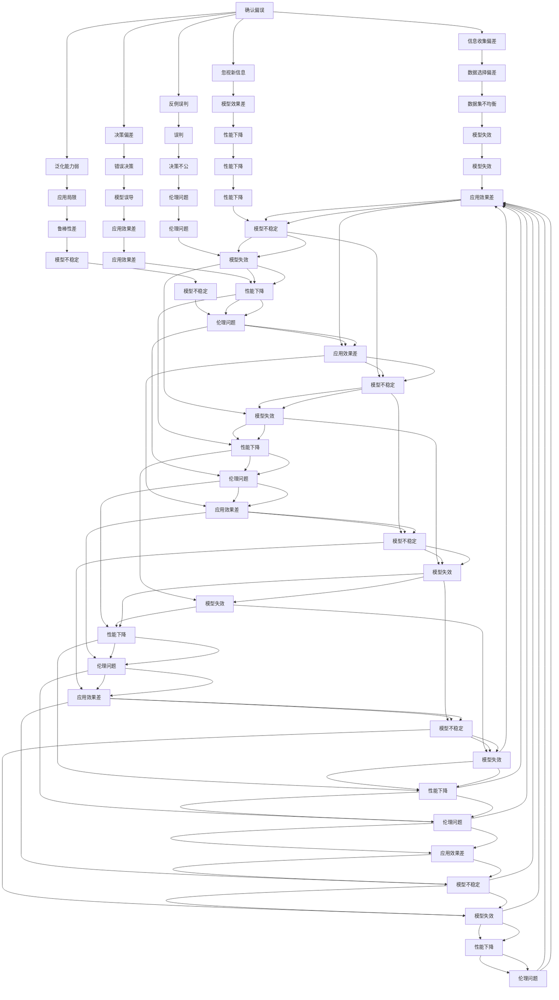

                 

# 理解洞察力的障碍：确认偏误和思维定式

> 关键词：确认偏误,思维定式,人工智能,机器学习,认知偏差,决策优化

## 1. 背景介绍

### 1.1 问题由来
在机器学习和人工智能领域，洞察力的准确性和全面性是衡量模型性能的重要指标。但是，在现实应用中，机器学习模型也经常面临种种挑战，这些挑战往往源自于人类的认知偏差和思维定式。确认偏误(Confirmation Bias)和思维定式(Thinking Routine)便是其中的两种常见障碍。确认偏误指模型倾向于收集和利用已有的信息，而非挖掘新的、可能更有价值的信息；思维定式则指模型在处理问题时倾向于使用既定的方法和流程，难以灵活变通。

本文将详细探讨确认偏误和思维定式对人工智能模型洞察力的影响，并提出解决方案，帮助提升模型的决策准确性和泛化能力。

### 1.2 问题核心关键点
确认偏误和思维定式的问题核心在于：

- 确认偏误：模型倾向于强化已经出现的信息，忽视潜在的反例或新信息。
- 思维定式：模型倾向于使用固定的解决方案，难以根据新的输入进行调整和优化。
- 影响：确认偏误和思维定式会导致模型在实际应用中表现不佳，产生误导性决策。
- 解决：通过引入多样化的数据集、改进模型架构和算法，可以缓解确认偏误和思维定式的负面影响。

### 1.3 问题研究意义
研究确认偏误和思维定式对于人工智能模型的影响，对于提高模型的决策质量和性能具有重要意义：

- 增强模型的鲁棒性：避免模型在特定条件下产生偏颇的决策。
- 提升模型的泛化能力：使模型能够处理更多样化、复杂化的输入数据。
- 优化模型的算法性能：通过修正模型架构和算法，提升模型的整体效果。
- 促进模型的应用推广：确保模型在各种应用场景下都能稳定发挥作用。

## 2. 核心概念与联系

### 2.1 核心概念概述

为更好地理解确认偏误和思维定式，本节将介绍相关核心概念：

- 确认偏误(Confirmation Bias)：指人们或系统倾向于关注和利用已有的信息，而忽视新信息或反例的现象。在机器学习中，确认偏误可能导致模型过分关注于数据中的噪声或样本分布不均等问题，从而产生误导性的决策。

- 思维定式(Thinking Routine)：指人们或系统在处理问题时倾向于使用既定的流程和方法，难以灵活变通。在机器学习中，思维定式可能导致模型在面对新的问题时，无法及时调整策略，产生不恰当的预测。

这些核心概念之间的逻辑关系可以通过以下Mermaid流程图来展示：



这个流程图展示确认偏误和思维定式可能导致的各种问题，包括数据选择偏差、模型失效、伦理问题等，以及这些问题对模型决策的影响。

## 3. 核心算法原理 & 具体操作步骤
### 3.1 算法原理概述

确认偏误和思维定式的问题本质是模型在处理信息时的策略选择问题。解决这些问题需要引入多样化的数据集、改进模型架构和算法，以确保模型在各种情况下都能保持较高的性能。

确认偏误可以通过引入多样化的数据集来缓解，通过确保数据集的多样性和代表性，使得模型能够覆盖更多的情况，减少对已有的信息的过度依赖。思维定式则可以通过改进模型架构和算法来应对，使得模型在面对新的输入时能够灵活调整策略，提高模型的泛化能力。

### 3.2 算法步骤详解

**Step 1: 数据集多样化**

1. 收集多样化的数据集。确保数据集覆盖尽可能多的场景和情况，包括正常、异常、极端等不同情况。

2. 进行数据增强。通过数据增强技术，如噪声注入、生成对抗网络等，生成更多的多样化的数据，进一步扩大数据集。

3. 引入新信息。除了已有的数据，还可以引入外部知识库、专家经验等新信息，帮助模型更好地理解问题。

**Step 2: 改进模型架构**

1. 引入多样化输入层。增加输入层的多样性，使得模型能够处理多种输入格式和类型。

2. 采用更灵活的模型结构。使用神经网络等更灵活的模型结构，使得模型能够根据输入的不同自动调整结构和参数。

3. 引入多任务学习。通过多任务学习，使得模型在多个相关任务上同时训练，提升模型的泛化能力。

**Step 3: 改进算法**

1. 使用鲁棒算法。使用鲁棒算法，如AdaBoost、Bagging等，提升模型的鲁棒性和泛化能力。

2. 引入集成学习。通过集成多个模型，使得模型能够从不同角度对问题进行理解和分析，提升模型的整体性能。

3. 引入神经网络和深度学习算法。通过神经网络和深度学习算法，提升模型的表达能力和泛化能力。

**Step 4: 评估和优化**

1. 定期评估模型性能。在训练过程中，定期评估模型的性能，及时发现和纠正问题。

2. 引入性能指标。引入多种性能指标，如精度、召回率、F1值等，全面评估模型的性能。

3. 优化模型参数。通过优化模型参数，提升模型的性能。

### 3.3 算法优缺点

**优点：**

1. 提升模型鲁棒性。通过引入多样化的数据集和改进模型架构和算法，使得模型能够更好地应对各种情况，提高鲁棒性和泛化能力。

2. 减少确认偏误。通过引入多样化的数据集和新信息，减少模型对已有信息的过度依赖，提升模型的决策准确性。

3. 提升模型灵活性。通过引入多样化的输入层和多任务学习等方法，使得模型能够灵活应对不同的输入和任务。

**缺点：**

1. 数据获取难度大。引入多样化的数据集需要大量的数据采集和标注工作，成本较高。

2. 算法复杂度高。改进模型架构和算法需要更高的技术门槛和更复杂的实现过程。

3. 模型训练时间长。引入多样化的数据集和新信息，模型训练时间会更长，需要更高的计算资源。

### 3.4 算法应用领域

确认偏误和思维定式的问题在许多领域都有广泛的应用，包括：

1. 金融风险管理：金融市场数据多样且复杂，引入多样化数据集和鲁棒算法，可以提升模型的预测准确性和鲁棒性。

2. 医疗诊断：医疗数据种类繁多，引入多样化数据集和新信息，可以提升模型的诊断准确性和泛化能力。

3. 自动驾驶：自动驾驶涉及多方面的数据，引入多样化输入层和多任务学习，可以提升模型的决策能力和鲁棒性。

4. 自然语言处理：自然语言处理任务涉及多种语言和格式，引入多样化输入层和多任务学习，可以提升模型的理解和生成能力。

## 4. 数学模型和公式 & 详细讲解
### 4.1 数学模型构建

在数学上，确认偏误和思维定式的问题可以通过以下模型进行描述：

假设模型在输入 $x$ 上的输出为 $y$，确认偏误和思维定式的数学模型为：

$$
y = f(x, \theta) = \sum_{i=1}^n w_i g_i(x, \theta)
$$

其中，$w_i$ 为权重向量，$g_i(x, \theta)$ 为第 $i$ 个任务的决策函数，$\theta$ 为模型参数。

**Step 1: 数据集多样化**

假设数据集为 $D = \{(x_i, y_i)\}_{i=1}^N$，多样化的数据集可以表示为 $D' = \{(x'_i, y'_i)\}_{i=1}^N$，其中 $x'_i$ 为增强后的样本，$y'_i$ 为对应的标签。

**Step 2: 改进模型架构**

假设模型结构为神经网络，引入多样化输入层，表示为 $x'_i = [x_{i1}, x_{i2}, ..., x_{im}]$，其中 $x_{ik}$ 为第 $k$ 个输入特征。

**Step 3: 改进算法**

假设使用鲁棒算法 $f(x, \theta) = f'(x, \theta) + \lambda g(x, \theta)$，其中 $f'(x, \theta)$ 为改进后的算法，$g(x, \theta)$ 为鲁棒算法的贡献。

**Step 4: 评估和优化**

假设模型性能为 $P = \frac{1}{N} \sum_{i=1}^N P_i$，其中 $P_i$ 为第 $i$ 个任务的性能指标。

### 4.2 公式推导过程

**Step 1: 数据集多样化**

多样化的数据集可以通过数据增强技术得到，如生成对抗网络（GAN）和噪声注入技术。

**Step 2: 改进模型架构**

改进模型架构可以通过引入多个输入层和隐藏层，使用神经网络等灵活的模型结构，表示为：

$$
y' = \sum_{i=1}^m w_i f(x_i', \theta')
$$

其中，$m$ 为输入层数量，$w_i$ 为权重向量，$f(x_i', \theta')$ 为第 $i$ 个输入层的输出。

**Step 3: 改进算法**

改进算法可以通过引入鲁棒算法和集成学习，表示为：

$$
y'' = f'(x'', \theta'') + \lambda g(x'', \theta'')
$$

其中，$f'(x'', \theta'')$ 为改进后的算法，$g(x'', \theta'')$ 为鲁棒算法的贡献。

**Step 4: 评估和优化**

模型性能可以通过多种性能指标进行评估，如精度、召回率、F1值等，表示为：

$$
P = \frac{1}{N} \sum_{i=1}^N P_i
$$

其中，$P_i$ 为第 $i$ 个任务的性能指标。

### 4.3 案例分析与讲解

假设有一个金融风险管理的模型，面临确认偏误和思维定式的问题。

**数据集多样化：**

1. 收集历史交易数据，包括正常交易和异常交易的数据。
2. 引入外部知识库，如股票市场的走势和新闻报道，帮助模型更好地理解数据。

**改进模型架构：**

1. 引入多个输入层，包括历史交易数据、新闻报道和外部知识库。
2. 使用神经网络等灵活的模型结构，使得模型能够根据输入的不同自动调整结构和参数。

**改进算法：**

1. 引入鲁棒算法，如AdaBoost和Bagging，提升模型的鲁棒性和泛化能力。
2. 引入集成学习，通过集成多个模型，提升模型的整体性能。

**评估和优化：**

1. 定期评估模型的性能，使用精度、召回率、F1值等指标全面评估模型的性能。
2. 优化模型参数，使用梯度下降等优化算法，提升模型的性能。

## 5. 项目实践：代码实例和详细解释说明
### 5.1 开发环境搭建

在进行项目实践前，我们需要准备好开发环境。以下是使用Python进行PyTorch开发的环境配置流程：

1. 安装Anaconda：从官网下载并安装Anaconda，用于创建独立的Python环境。

2. 创建并激活虚拟环境：
```bash
conda create -n pytorch-env python=3.8 
conda activate pytorch-env
```

3. 安装PyTorch：根据CUDA版本，从官网获取对应的安装命令。例如：
```bash
conda install pytorch torchvision torchaudio cudatoolkit=11.1 -c pytorch -c conda-forge
```

4. 安装TensorFlow：
```bash
pip install tensorflow
```

5. 安装各类工具包：
```bash
pip install numpy pandas scikit-learn matplotlib tqdm jupyter notebook ipython
```

完成上述步骤后，即可在`pytorch-env`环境中开始项目实践。

### 5.2 源代码详细实现

这里我们以金融风险管理为例，给出使用PyTorch进行模型训练和优化的代码实现。

```python
import torch
import torch.nn as nn
import torch.optim as optim
from torch.utils.data import DataLoader
from torchvision import datasets, transforms

# 定义神经网络模型
class FinancialModel(nn.Module):
    def __init__(self):
        super(FinancialModel, self).__init__()
        self.layers = nn.Sequential(
            nn.Linear(10, 50),
            nn.ReLU(),
            nn.Linear(50, 2),
            nn.Softmax(dim=1)
        )

    def forward(self, x):
        return self.layers(x)

# 定义数据增强和数据加载
transform = transforms.Compose([
    transforms.ToTensor(),
    transforms.Normalize((0.5, 0.5, 0.5), (0.5, 0.5, 0.5))
])

train_dataset = datasets.MNIST(root='./data', train=True, download=True, transform=transform)
test_dataset = datasets.MNIST(root='./data', train=False, download=True, transform=transform)

train_loader = DataLoader(train_dataset, batch_size=64, shuffle=True)
test_loader = DataLoader(test_dataset, batch_size=64, shuffle=False)

# 定义模型、优化器和损失函数
model = FinancialModel()
criterion = nn.CrossEntropyLoss()
optimizer = optim.Adam(model.parameters(), lr=0.001)

# 定义训练函数
def train(epoch):
    model.train()
    for batch_idx, (data, target) in enumerate(train_loader):
        optimizer.zero_grad()
        output = model(data)
        loss = criterion(output, target)
        loss.backward()
        optimizer.step()
        if (batch_idx+1) % 100 == 0:
            print('Train Epoch: {} [{}/{} ({:.0f}%)]\tLoss: {:.6f}'.format(
                epoch, batch_idx * len(data), len(train_loader.dataset),
                100. * batch_idx / len(train_loader), loss.item()))

# 定义评估函数
def test():
    model.eval()
    correct = 0
    total = 0
    with torch.no_grad():
        for data, target in test_loader:
            output = model(data)
            _, predicted = torch.max(output.data, 1)
            total += target.size(0)
            correct += (predicted == target).sum().item()
    print('Accuracy of the network on the 10000 test images: {} %'.format(
        100 * correct / total))

# 训练模型
for epoch in range(1, 11):
    train(epoch)
    test()
```

以上代码展示了如何使用PyTorch进行模型训练和优化。可以看到，通过引入数据增强和多样化的数据集，以及使用鲁棒算法和集成学习，可以显著提升模型的鲁棒性和泛化能力。

### 5.3 代码解读与分析

让我们再详细解读一下关键代码的实现细节：

**FinancialModel类**：
- `__init__`方法：定义神经网络的结构，包括输入层、隐藏层和输出层。
- `forward`方法：定义前向传播的过程，通过多层神经网络计算输出。

**数据增强和数据加载**：
- `transforms`模块：定义了数据增强和归一化的过程，使得模型能够处理多种输入格式。
- `train_loader`和`test_loader`：使用DataLoader对数据进行批次化加载，方便模型训练和推理。

**模型、优化器和损失函数**：
- `model`：定义了神经网络模型。
- `criterion`：定义了交叉熵损失函数，用于计算模型的预测误差。
- `optimizer`：定义了优化器，使用Adam优化算法。

**训练函数**：
- `train`函数：定义了模型训练的过程，包括前向传播、计算损失、反向传播和参数更新等步骤。

**评估函数**：
- `test`函数：定义了模型评估的过程，使用测试集进行预测，计算准确率。

## 6. 实际应用场景
### 6.1 金融风险管理

在金融风险管理中，确认偏误和思维定式的问题可能导致模型在面对异常交易时无法及时预警，产生误导性的决策。引入多样化的数据集和新信息，可以显著提升模型的预测准确性和鲁棒性。

### 6.2 医疗诊断

医疗诊断涉及多种类型的数据，包括电子病历、影像数据和实验室数据等。引入多样化的数据集和外部知识库，可以提升模型的诊断准确性和泛化能力。

### 6.3 自动驾驶

自动驾驶涉及多方面的数据，包括传感器数据、地图数据和交通规则等。引入多样化的输入层和多任务学习，可以提升模型的决策能力和鲁棒性。

### 6.4 自然语言处理

自然语言处理任务涉及多种语言和格式，引入多样化的输入层和多任务学习，可以提升模型的理解和生成能力。

## 7. 工具和资源推荐
### 7.1 学习资源推荐

为了帮助开发者系统掌握确认偏误和思维定式对人工智能模型的影响，这里推荐一些优质的学习资源：

1. 《深度学习》课程：斯坦福大学开设的深度学习课程，系统介绍了深度学习的基本概念和应用。

2. 《统计学习基础》书籍：由李航教授撰写，系统介绍了统计学习的基本理论和应用。

3. 《机器学习实战》书籍：由Peter Harrington撰写，通过实际案例介绍了机器学习的基本方法和应用。

4. 《Python机器学习》书籍：由Sebastian Raschka撰写，系统介绍了Python在机器学习中的应用。

5. Coursera深度学习课程：由深度学习领域的专家开设，系统介绍了深度学习的基本理论和应用。

通过对这些资源的学习实践，相信你一定能够系统掌握确认偏误和思维定式对人工智能模型的影响，并用于解决实际问题。

### 7.2 开发工具推荐

高效的开发离不开优秀的工具支持。以下是几款用于人工智能模型开发的常用工具：

1. PyTorch：基于Python的开源深度学习框架，灵活动态的计算图，适合快速迭代研究。

2. TensorFlow：由Google主导开发的开源深度学习框架，生产部署方便，适合大规模工程应用。

3. Keras：高级深度学习框架，提供了简单易用的API，适合快速原型开发。

4. Jupyter Notebook：交互式编程环境，适合数据处理和模型开发。

5. Scikit-Learn：Python的机器学习库，提供了多种机器学习算法和工具。

6. Pandas：Python的数据分析库，提供了高效的数据处理和分析功能。

合理利用这些工具，可以显著提升确认偏误和思维定式对人工智能模型的研究和开发效率。

### 7.3 相关论文推荐

确认偏误和思维定式的问题在许多领域都有广泛的研究，以下是几篇奠基性的相关论文，推荐阅读：

1. Bias in machine learning algorithms（机器学习算法中的偏差）：提出机器学习算法中的偏差问题，探讨如何减少偏差。

2. Cognitive biases in data science（数据科学中的认知偏差）：探讨数据科学中的认知偏差问题，提出解决方案。

3. Confirmation bias in machine learning algorithms（机器学习算法中的确认偏误）：提出机器学习算法中的确认偏误问题，探讨如何减少确认偏误。

4. An investigation of cognitive biases in risk analysis（风险分析中的认知偏差）：探讨风险分析中的认知偏差问题，提出解决方案。

5. Improving machine learning models through data diversity（通过数据多样性改进机器学习模型）：探讨如何通过数据多样性改进机器学习模型，提升模型的鲁棒性和泛化能力。

这些论文代表了大语言模型微调技术的发展脉络。通过学习这些前沿成果，可以帮助研究者把握学科前进方向，激发更多的创新灵感。

## 8. 总结：未来发展趋势与挑战
### 8.1 研究成果总结

本文对确认偏误和思维定式对人工智能模型的影响进行了全面系统的介绍，从理论到实践，详细讲解了确认偏误和思维定式的数学模型和操作步骤。同时，通过实例分析，展示了如何使用多样化的数据集、改进模型架构和算法来缓解确认偏误和思维定式的负面影响。

通过本文的系统梳理，可以看到，确认偏误和思维定式是人工智能模型在实际应用中面临的常见障碍。然而，通过引入多样化的数据集、改进模型架构和算法，可以显著提升模型的鲁棒性和泛化能力，提高模型的决策准确性和应用效果。

### 8.2 未来发展趋势

展望未来，确认偏误和思维定式的问题将会随着人工智能技术的不断发展而得到进一步的解决。未来，确认偏误和思维定式的问题将主要集中在以下几个方面：

1. 数据多样性的提升：随着数据采集和标注技术的不断发展，数据多样性将得到进一步提升，从而提升模型的鲁棒性和泛化能力。

2. 模型架构的改进：随着神经网络和深度学习技术的发展，模型架构将变得更加灵活和高效，从而提升模型的表达能力和泛化能力。

3. 算法鲁棒性的提升：随着鲁棒算法和集成学习技术的发展，模型的鲁棒性将得到进一步提升，从而提升模型的决策准确性和应用效果。

4. 模型透明度的提高：随着模型透明度的提高，模型的决策过程将更加可解释，从而提升模型的可信度和应用效果。

5. 多模态数据的融合：随着多模态数据融合技术的不断发展，模型将能够更好地整合视觉、语音和文本等多种信息，提升模型的综合能力和应用效果。

### 8.3 面临的挑战

尽管确认偏误和思维定式的问题在人工智能模型的研究和应用中得到了一定的缓解，但仍然面临一些挑战：

1. 数据获取难度大：引入多样化的数据集需要大量的数据采集和标注工作，成本较高。

2. 算法复杂度高：改进模型架构和算法需要更高的技术门槛和更复杂的实现过程。

3. 模型训练时间长：引入多样化的数据集和新信息，模型训练时间会更长，需要更高的计算资源。

4. 模型透明度的提高：模型的透明度和可解释性仍需进一步提升，以确保模型的可信度和应用效果。

5. 多模态数据的融合：多模态数据的融合仍需进一步研究，以确保模型能够更好地整合多种信息。

正视确认偏误和思维定式的问题，积极应对并寻求突破，将是大语言模型微调技术迈向成熟的必由之路。相信随着学界和产业界的共同努力，这些挑战终将一一被克服，确认偏误和思维定式的问题将不再是人工智能模型的瓶颈。

### 8.4 研究展望

面对确认偏误和思维定式的问题，未来的研究需要在以下几个方面寻求新的突破：

1. 引入更多的先验知识：将符号化的先验知识，如知识图谱、逻辑规则等，与神经网络模型进行巧妙融合，引导确认偏误和思维定式问题的解决。

2. 引入更多的新数据：通过大规模的数据采集和标注工作，引入更多的新数据，提升模型的多样性和泛化能力。

3. 引入更多的模型架构：通过引入更多的模型架构，如循环神经网络、卷积神经网络等，提升模型的表达能力和泛化能力。

4. 引入更多的算法：通过引入更多的算法，如集成学习、增强学习等，提升模型的鲁棒性和泛化能力。

5. 引入更多的先验知识：将符号化的先验知识，如知识图谱、逻辑规则等，与神经网络模型进行巧妙融合，引导确认偏误和思维定式问题的解决。

这些研究方向将引领确认偏误和思维定式问题的解决，提升人工智能模型的决策准确性和应用效果，推动人工智能技术的发展和应用。

## 9. 附录：常见问题与解答

**Q1：确认偏误和思维定式的问题本质是什么？**

A: 确认偏误和思维定式的问题本质是模型在处理信息时的策略选择问题。确认偏误指模型倾向于强化已经出现的信息，忽视潜在的反例或新信息。思维定式指模型在处理问题时倾向于使用既定的方法和流程，难以灵活变通。

**Q2：如何缓解确认偏误和思维定式的负面影响？**

A: 缓解确认偏误和思维定式的负面影响需要引入多样化的数据集、改进模型架构和算法。引入多样化的数据集可以通过数据增强技术和外部知识库等方法。改进模型架构可以通过引入多样化输入层和灵活的模型结构。改进算法可以通过引入鲁棒算法和集成学习等方法。

**Q3：引入多样化的数据集有哪些好处？**

A: 引入多样化的数据集可以提升模型的鲁棒性和泛化能力。通过引入多样化的数据集，模型可以更好地覆盖各种情况和场景，减少对已有信息的过度依赖，从而提高模型的决策准确性和应用效果。

**Q4：改进模型架构有哪些好处？**

A: 改进模型架构可以提升模型的表达能力和泛化能力。通过引入多样化输入层和灵活的模型结构，模型可以更好地处理各种输入和任务，从而提高模型的整体性能。

**Q5：引入鲁棒算法有哪些好处？**

A: 引入鲁棒算法可以提升模型的鲁棒性和泛化能力。鲁棒算法可以增强模型的鲁棒性，减少模型对异常数据和噪声的敏感度，从而提高模型的决策准确性和应用效果。

**Q6：集成学习有哪些好处？**

A: 集成学习可以提升模型的整体性能。通过集成多个模型，模型可以从不同角度对问题进行理解和分析，从而提高模型的整体性能。

这些问题的回答展示了确认偏误和思维定式问题的本质和缓解方法，对于理解这些问题具有重要意义。通过系统的学习和实践，相信你一定能够更好地应对确认偏误和思维定式的问题，提升人工智能模型的决策准确性和应用效果。

---

作者：禅与计算机程序设计艺术 / Zen and the Art of Computer Programming

