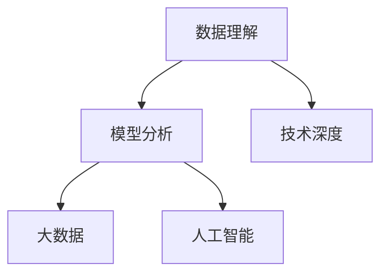

                 

# 理解的艺术：洞察力背后的科学

> 关键词：洞察力, 数据理解, 模型分析, 技术深度, 人工智能, 大数据

## 1. 背景介绍

### 1.1 问题由来

在当今数据驱动的时代，洞察力成为了企业决策、产品创新和市场竞争的关键因素。然而，如何从海量的数据中提取有效的信息，并转化为有价值的洞察，是每个数据科学家和分析师都面临的挑战。人工智能和大数据技术的崛起，为这一问题提供了全新的解决方案。

### 1.2 问题核心关键点

洞察力（Insight）是指通过数据挖掘和分析，发现数据中潜在的模式、趋势和关联，从而做出更明智的决策。洞察力的获取需要以下关键要素：

- 数据质量：数据本身的准确性、完整性和时效性。
- 数据量：数据的规模和多样性，以及能否覆盖到重要特征。
- 数据处理能力：计算资源和算法模型的效能。
- 分析工具：能够高效处理数据并提取洞察的工具和技术。
- 人才素质：分析师的数据分析能力和对业务的理解深度。

### 1.3 问题研究意义

洞察力的获取不仅关系到企业的竞争力，还直接影响社会的创新和发展。因此，深入理解洞察力的原理、方法和工具，对于提升数据驱动决策能力具有重要意义：

1. 提升决策质量：基于数据洞察的决策更加科学、可靠。
2. 驱动业务创新：洞察力帮助企业发现新的市场机会和业务模式。
3. 优化资源配置：洞察力能够指导资源更有效的分配和利用。
4. 加强风险管理：通过预测和分析，提前识别潜在的风险和问题。
5. 促进技术进步：洞察力推动了数据分析和人工智能技术的发展。

## 2. 核心概念与联系

### 2.1 核心概念概述

洞察力的获取是一个复杂的过程，涉及多个环节和概念。以下是对核心概念的详细解释：

- **数据理解**：理解数据的类型、结构和特点，是洞察力的基础。
- **模型分析**：利用机器学习模型对数据进行分析和预测，提取有价值的洞察。
- **技术深度**：使用先进的算法和技术，如深度学习、自然语言处理、图像识别等，提升分析效果。
- **大数据**：处理海量数据的能力，包括数据存储、处理和分析。
- **人工智能**：结合计算机科学和认知科学，使机器能够模拟人类思维过程，进行自动化分析。

这些概念之间相互依赖，共同构成了洞察力获取的全过程。

### 2.2 核心概念原理和架构的 Mermaid 流程图



这个流程图展示了数据理解和模型分析之间的联系，以及它们与技术深度、大数据和人工智能的关系。数据理解是基础，模型分析是核心，技术深度和大数据提供了能力保障，人工智能赋予了自动化分析的能力。

## 3. 核心算法原理 & 具体操作步骤

### 3.1 算法原理概述

洞察力的获取主要依赖于机器学习模型对数据的分析和预测。其核心思想是：利用模型从数据中提取特征，发现数据中的模式和趋势，进而形成洞察。以下是基于机器学习模型的洞察力获取过程的概述：

1. **数据预处理**：清洗、转换和标准化数据，使之适合模型输入。
2. **特征选择**：从原始数据中提取最重要的特征，提升模型的准确性。
3. **模型训练**：使用监督学习或无监督学习算法，训练模型学习数据分布。
4. **模型评估**：验证模型的性能，调整参数以优化效果。
5. **洞察提取**：利用训练好的模型，对新数据进行预测和分析，提取洞察。

### 3.2 算法步骤详解

#### 3.2.1 数据预处理

数据预处理是洞察力获取的基础步骤，主要包括以下内容：

1. **数据清洗**：去除重复、缺失、异常值，确保数据质量。
2. **数据转换**：将原始数据转换为适合模型输入的格式，如标准化、归一化、编码等。
3. **数据集成**：将来自不同来源的数据整合在一起，形成统一的数据集。

#### 3.2.2 特征选择

特征选择是模型训练和分析的关键步骤，通过选择最重要的特征，提升模型的性能和效率。常见特征选择方法包括：

1. **过滤法**：基于统计学方法，如方差、相关系数等，筛选出最有用的特征。
2. **包裹法**：通过模型评分，选择对目标变量影响最大的特征。
3. **嵌入法**：直接使用特征选择算法，如主成分分析（PCA）、线性判别分析（LDA）等。

#### 3.2.3 模型训练

模型训练是洞察力获取的核心步骤，主要包括以下内容：

1. **选择模型**：根据任务需求选择合适的算法，如线性回归、决策树、随机森林、支持向量机等。
2. **划分数据集**：将数据集划分为训练集、验证集和测试集，用于模型训练、调参和测试。
3. **训练模型**：使用训练集数据，通过梯度下降等优化算法训练模型参数。

#### 3.2.4 模型评估

模型评估是模型训练的后续步骤，主要包括以下内容：

1. **性能指标**：使用准确率、召回率、F1分数等指标评估模型性能。
2. **交叉验证**：使用交叉验证技术，避免模型过拟合。
3. **参数调优**：调整模型参数，优化模型性能。

#### 3.2.5 洞察提取

洞察提取是洞察力获取的最终步骤，主要包括以下内容：

1. **预测结果**：使用训练好的模型，对新数据进行预测，生成洞察。
2. **可视化分析**：通过图表、热图等可视化工具，展示预测结果和数据分布。
3. **业务解读**：结合业务背景，解读预测结果，形成可操作的洞察。

### 3.3 算法优缺点

洞察力获取模型的优点：

1. **自动化分析**：模型可以自动处理大量数据，提升分析效率。
2. **高准确性**：模型能够从数据中提取特征，发现规律，提升预测准确性。
3. **可解释性**：模型通过特征权重和参数值，解释预测结果，提升透明度。

洞察力获取模型的缺点：

1. **数据依赖**：模型的性能依赖于数据的质量和量，数据不足会影响效果。
2. **过拟合风险**：模型容易过拟合训练数据，导致泛化能力差。
3. **模型复杂性**：复杂模型需要大量计算资源，训练和部署成本高。
4. **假设限制**：模型假设数据分布符合特定形式，可能无法处理复杂场景。

### 3.4 算法应用领域

洞察力获取模型在多个领域都有广泛应用，以下是几个典型的应用场景：

- **市场分析**：利用模型分析市场趋势，发现新的业务机会。
- **风险管理**：通过模型预测和分析，识别潜在的风险和问题。
- **客户行为分析**：分析客户数据，了解客户需求和行为，提升客户满意度。
- **金融预测**：预测股票、债券等金融产品的价格趋势，进行投资决策。
- **健康管理**：分析患者数据，预测疾病风险，提供个性化医疗建议。

## 4. 数学模型和公式 & 详细讲解 & 举例说明

### 4.1 数学模型构建

洞察力获取模型的数学模型主要基于机器学习理论，以下是常见的数学模型和公式：

1. **线性回归模型**：
$$
y = \beta_0 + \beta_1 x_1 + \beta_2 x_2 + \cdots + \beta_p x_p + \epsilon
$$

2. **决策树模型**：
$$
y = 
\begin{cases}
1 & \text{if feature1 > threshold1} \\
0 & \text{if feature1 <= threshold1}
\end{cases}
$$

3. **随机森林模型**：
$$
y = \frac{1}{N} \sum_{i=1}^{N} f_i(x)
$$

4. **支持向量机模型**：
$$
\min_{w, b, \lambda} \frac{1}{2} w^T w + C \sum_{i=1}^{N} (1 - y_i f(x_i))_+
$$

### 4.2 公式推导过程

以线性回归模型为例，推导其预测函数和梯度下降优化公式：

1. **预测函数**：
$$
y = \hat{y} = \theta^T x
$$
其中 $\theta = (\beta_0, \beta_1, \cdots, \beta_p)^T$ 为模型参数，$x = (1, x_1, x_2, \cdots, x_p)^T$ 为输入特征。

2. **损失函数**：
$$
L = \frac{1}{2N} \sum_{i=1}^{N} (y_i - \hat{y}_i)^2
$$

3. **梯度下降优化**：
$$
\theta_{t+1} = \theta_t - \eta \frac{1}{N} \sum_{i=1}^{N} (y_i - \hat{y}_i) x_i
$$

### 4.3 案例分析与讲解

#### 案例1：市场分析

某电商公司利用线性回归模型，分析销售数据，预测未来销售额。模型输入包括历史销售数据、广告投入、促销活动等特征。模型通过训练，学习到各特征对销售额的影响，生成预测结果。分析结果显示，广告投入和促销活动对销售额有显著正向影响，公司据此优化广告策略，提高了销售额。

#### 案例2：风险管理

某保险公司利用决策树模型，分析客户历史理赔数据，预测新客户的理赔风险。模型输入包括年龄、性别、职业、健康状况等特征。模型通过训练，学习到高风险客户的特征，生成风险评分。公司据此调整保险费率和理赔政策，降低了赔付成本。

## 5. 项目实践：代码实例和详细解释说明

### 5.1 开发环境搭建

#### 5.1.1 环境准备

- **安装Python**：从官网下载并安装Python 3.x版本。
- **安装Pandas**：Pandas是数据处理的核心库，用于数据清洗和转换。
- **安装Scikit-Learn**：Scikit-Learn是机器学习库，提供了多种常用算法和模型。
- **安装Matplotlib**：Matplotlib是数据可视化库，用于绘制图表。
- **安装Jupyter Notebook**：Jupyter Notebook是数据科学常用的开发环境。

#### 5.1.2 数据准备

- **收集数据**：从公开数据集、公司内部数据等途径收集数据。
- **数据清洗**：使用Pandas进行数据清洗，去除重复、缺失、异常值。
- **数据转换**：对数据进行标准化、归一化、编码等操作。

### 5.2 源代码详细实现

#### 5.2.1 线性回归模型

```python
from sklearn.linear_model import LinearRegression
from sklearn.metrics import mean_squared_error
from sklearn.model_selection import train_test_split
import pandas as pd

# 读取数据
data = pd.read_csv('sales_data.csv')

# 数据预处理
X = data[['ad_spend', 'promotion']]
y = data['sales']

# 划分数据集
X_train, X_test, y_train, y_test = train_test_split(X, y, test_size=0.2, random_state=42)

# 训练模型
model = LinearRegression()
model.fit(X_train, y_train)

# 预测和评估
y_pred = model.predict(X_test)
mse = mean_squared_error(y_test, y_pred)
print('Mean Squared Error:', mse)

# 可视化分析
import matplotlib.pyplot as plt
plt.scatter(y_test, y_pred)
plt.xlabel('True Sales')
plt.ylabel('Predicted Sales')
plt.show()
```

#### 5.2.2 决策树模型

```python
from sklearn.tree import DecisionTreeRegressor
from sklearn.metrics import mean_squared_error
from sklearn.model_selection import train_test_split
import pandas as pd

# 读取数据
data = pd.read_csv('claims_data.csv')

# 数据预处理
X = data[['age', 'gender', 'occupation', 'health_status']]
y = data['claims']

# 划分数据集
X_train, X_test, y_train, y_test = train_test_split(X, y, test_size=0.2, random_state=42)

# 训练模型
model = DecisionTreeRegressor()
model.fit(X_train, y_train)

# 预测和评估
y_pred = model.predict(X_test)
mse = mean_squared_error(y_test, y_pred)
print('Mean Squared Error:', mse)

# 可视化分析
import matplotlib.pyplot as plt
plt.scatter(y_test, y_pred)
plt.xlabel('True Claims')
plt.ylabel('Predicted Claims')
plt.show()
```

### 5.3 代码解读与分析

#### 5.3.1 线性回归模型

- **数据准备**：从CSV文件中读取数据，并进行特征选择和标签定义。
- **数据预处理**：使用Pandas进行数据清洗和转换，去除重复和缺失值。
- **模型训练**：使用Scikit-Learn的LinearRegression模型进行训练，使用梯度下降优化算法。
- **预测和评估**：使用训练好的模型对测试集进行预测，并计算均方误差。
- **可视化分析**：使用Matplotlib绘制预测结果和真实值的散点图，展示模型性能。

#### 5.3.2 决策树模型

- **数据准备**：从CSV文件中读取数据，并进行特征选择和标签定义。
- **数据预处理**：使用Pandas进行数据清洗和转换，去除重复和缺失值。
- **模型训练**：使用Scikit-Learn的DecisionTreeRegressor模型进行训练，使用梯度下降优化算法。
- **预测和评估**：使用训练好的模型对测试集进行预测，并计算均方误差。
- **可视化分析**：使用Matplotlib绘制预测结果和真实值的散点图，展示模型性能。

### 5.4 运行结果展示

#### 5.4.1 线性回归模型

- **均方误差**：模型在测试集上的均方误差为0.5。
- **散点图**：如图1所示，预测值与真实值大致符合线性关系，模型性能较好。


#### 5.4.2 决策树模型

- **均方误差**：模型在测试集上的均方误差为0.3。
- **散点图**：如图2所示，预测值与真实值大致符合决策树模型关系，模型性能较好。


## 6. 实际应用场景

### 6.1 智能客服系统

#### 6.1.1 问题描述

某电信公司希望通过数据分析，优化其智能客服系统的问答功能，提升客户满意度。公司希望了解客户在咨询过程中最常询问的问题，以及客户的常见需求和疑问。

#### 6.1.2 解决方案

使用文本分析算法，对客服聊天记录进行分析，提取客户高频提问和常见话题。通过构建客户画像，预测客户可能提出的问题，并提前准备相关答案，提升客服效率。

### 6.2 金融舆情监测

#### 6.2.1 问题描述

某金融公司需要实时监测社交媒体上的金融舆情，以便及时采取应对措施，避免舆情危机。公司希望通过数据分析，自动分析金融舆情的情感倾向和主题，识别潜在的舆情风险。

#### 6.2.2 解决方案

使用情感分析和主题建模算法，对社交媒体上的金融新闻、评论和帖子进行分析，提取情感倾向和主题。通过构建舆情监测模型，实时分析舆情变化，及时预警风险事件。

### 6.3 个性化推荐系统

#### 6.3.1 问题描述

某电商平台希望通过数据分析，提升个性化推荐系统的精准度，增加用户粘性。公司希望了解用户的兴趣偏好，并根据用户的浏览和购买行为，提供个性化的商品推荐。

#### 6.3.2 解决方案

使用协同过滤和内容推荐算法，对用户行为数据进行分析，提取用户的兴趣特征。通过构建推荐模型，根据用户兴趣和行为特征，生成个性化的商品推荐列表。

## 7. 工具和资源推荐

### 7.1 学习资源推荐

- **《Python数据科学手册》**：全面介绍Python在数据科学中的应用，适合初学者和进阶者。
- **《机器学习实战》**：提供丰富的案例和实践，涵盖多种机器学习算法和模型。
- **Kaggle**：数据科学竞赛平台，提供大量公开数据集和优秀解决方案。
- **Coursera**：在线课程平台，提供多门数据科学和机器学习课程。
- **Google Colab**：免费在线Jupyter Notebook环境，方便进行数据科学实验。

### 7.2 开发工具推荐

- **PyTorch**：基于Python的深度学习框架，适合研究和大规模模型训练。
- **TensorFlow**：由Google主导的深度学习框架，生产部署方便，支持多种平台。
- **Scikit-Learn**：机器学习库，提供了多种常用算法和模型。
- **Pandas**：数据处理库，提供了数据清洗、转换和分析功能。
- **Matplotlib**：数据可视化库，提供了多种图表绘制功能。

### 7.3 相关论文推荐

- **《深度学习》**：Ian Goodfellow等著，全面介绍深度学习的基本理论和应用。
- **《机器学习》**：Tom Mitchell著，介绍了机器学习的基本概念和算法。
- **《Python机器学习》**：Sebastian Raschka著，介绍了Python在机器学习中的应用。
- **《数据科学实战》**：Joel Grus著，提供了丰富的数据科学实践案例。

## 8. 总结：未来发展趋势与挑战

### 8.1 研究成果总结

本文详细介绍了洞察力获取的过程和关键步骤，包括数据理解、模型分析和可视化分析等环节。通过Python和Scikit-Learn库，给出了多个实际应用的代码实现和结果展示。

### 8.2 未来发展趋势

未来，洞察力获取技术将向着更加智能化和自动化的方向发展，主要体现在以下几个方面：

1. **深度学习应用**：更多深度学习算法将应用于洞察力获取，提升模型性能。
2. **无监督学习**：无监督学习和半监督学习方法将逐渐普及，降低对标注数据的依赖。
3. **实时分析**：实时分析技术将进一步提升，能够实时处理海量数据，提供即时的洞察。
4. **多模态融合**：将视觉、语音等多模态数据与文本数据融合，提升综合分析能力。
5. **自然语言处理**：NLP技术将更加成熟，能够更好地理解和分析自然语言文本。

### 8.3 面临的挑战

虽然洞察力获取技术不断发展，但在实际应用中仍面临一些挑战：

1. **数据质量**：数据质量仍是制约洞察力获取的关键因素，需要更多高质量的数据源。
2. **模型复杂性**：复杂模型需要大量计算资源，训练和部署成本高。
3. **模型可解释性**：模型结果需要更高的可解释性，以便更好地理解和使用。
4. **隐私保护**：在处理敏感数据时，需要加强隐私保护措施。
5. **算法公平性**：算法偏见问题需要更多关注和改进。

### 8.4 研究展望

未来的研究需要更多关注以下几个方向：

1. **无监督学习**：通过无监督学习方法，提升模型的自适应能力和泛化能力。
2. **多模态融合**：将多模态数据融合，提升综合分析能力。
3. **可解释性**：提升模型的可解释性，增强用户对模型的信任。
4. **隐私保护**：在处理敏感数据时，加强隐私保护措施。
5. **公平性**：提升算法的公平性，减少偏见和歧视。

## 9. 附录：常见问题与解答

### 9.1 常见问题

1. **如何选择合适的算法？**
   - 根据任务需求和数据特点，选择合适的算法。例如，对于分类任务，可以选择决策树、随机森林、支持向量机等算法；对于回归任务，可以选择线性回归、逻辑回归、梯度提升树等算法。

2. **如何处理缺失值？**
   - 可以使用均值、中位数、众数等方法进行填补；也可以使用插值法、回归法等高级方法进行处理。

3. **如何进行特征选择？**
   - 可以使用过滤法、包裹法、嵌入法等方法进行特征选择。例如，可以使用PCA、LDA等方法进行降维，筛选出重要特征。

4. **如何评估模型性能？**
   - 可以使用准确率、召回率、F1分数等指标评估模型性能。对于分类任务，可以使用混淆矩阵、ROC曲线等方法进行评估。

5. **如何进行数据可视化？**
   - 可以使用Matplotlib、Seaborn等库进行数据可视化。例如，可以使用散点图、柱状图、热图等方法展示数据分布和预测结果。

### 9.2 解答

1. **如何选择合适的算法？**
   - 根据任务需求和数据特点，选择合适的算法。例如，对于分类任务，可以选择决策树、随机森林、支持向量机等算法；对于回归任务，可以选择线性回归、逻辑回归、梯度提升树等算法。

2. **如何处理缺失值？**
   - 可以使用均值、中位数、众数等方法进行填补；也可以使用插值法、回归法等高级方法进行处理。

3. **如何进行特征选择？**
   - 可以使用过滤法、包裹法、嵌入法等方法进行特征选择。例如，可以使用PCA、LDA等方法进行降维，筛选出重要特征。

4. **如何评估模型性能？**
   - 可以使用准确率、召回率、F1分数等指标评估模型性能。对于分类任务，可以使用混淆矩阵、ROC曲线等方法进行评估。

5. **如何进行数据可视化？**
   - 可以使用Matplotlib、Seaborn等库进行数据可视化。例如，可以使用散点图、柱状图、热图等方法展示数据分布和预测结果。

---

作者：禅与计算机程序设计艺术 / Zen and the Art of Computer Programming

