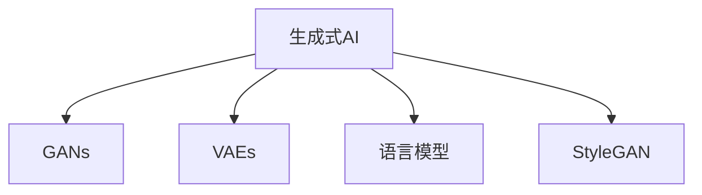

                 

# 生成式人工智能的优势：创造性内容

## 1. 背景介绍

### 1.1 问题由来

随着人工智能技术的不断发展，生成式人工智能（Generative AI）在内容创作、设计、艺术等领域逐渐展现出其独特的优势和潜力。生成式AI可以通过深度学习模型，从大量数据中学习并生成高质量的原创内容，极大地提高了内容创作的效率和质量。

在传统的创作方式中，内容生成通常需要经过大量的时间与精力投入，特别是需要创意与灵感的交互。而生成式AI则通过训练生成模型，从数据中学习到语言的语法结构、语义表达，甚至情感表达，从而能够自动生成连贯、上下文一致的内容。

### 1.2 问题核心关键点

生成式AI的核心在于利用大规模数据集训练深度学习模型，使其能够理解和生成符合语法和语义规则的文本、图像、音乐等内容。这一过程涉及到生成模型（如GANs、VAEs、语言模型等）的设计与训练，以及如何高效利用这些模型进行内容创作。

生成式AI的优点在于其能够大规模生产高质量内容，减少创作时间与成本。但其局限性在于生成的内容可能缺乏创意、原创性，且有时可能会出现事实错误或伦理问题。

## 2. 核心概念与联系

### 2.1 核心概念概述

为更好地理解生成式AI的内容创作能力，本节将介绍几个关键概念：

- 生成式AI（Generative AI）：指利用深度学习模型，从大量数据中学习并生成符合特定规律的内容，如文本、图像、音乐等。
- GANs（生成对抗网络）：一种能够生成新样本的深度学习模型，通过训练生成器（Generator）和判别器（Discriminator）进行对抗训练，生成高质量的内容。
- VAEs（变分自编码器）：一种能够生成低维表示再解码回原始样本的生成模型，适用于图像生成、文本生成等任务。
- 语言模型：通过训练学习语言结构的模型，能够生成连贯、上下文一致的文本内容，广泛应用于文本生成、机器翻译等任务。
- StyleGAN：一种能够生成高质量图像的生成对抗网络，通过学习数据分布生成逼真的图像。

这些核心概念之间的逻辑关系可以通过以下Mermaid流程图来展示：



这个流程图展示了大语言模型的核心概念及其之间的关系：

1. 生成式AI通过学习数据分布，生成各种类型的内容。
2. GANs通过对抗训练，生成高质量的图像。
3. VAEs通过编码解码，生成低维表示再解码为原始样本。
4. 语言模型通过学习语言结构，生成连贯的文本。
5. StyleGAN通过生成对抗训练，生成高质量的图像。

## 3. 核心算法原理 & 具体操作步骤

### 3.1 算法原理概述

生成式AI的核心算法原理是利用深度学习模型，从大量数据中学习到数据分布，并基于该分布生成新的、符合特定规律的内容。其中，最常见的生成模型包括GANs、VAEs和语言模型等。

以GANs为例，其核心思想是通过生成器（Generator）和判别器（Discriminator）的对抗训练，生成高质量的图像内容。具体流程如下：

1. 生成器接收随机噪声向量，生成图像样本。
2. 判别器评估生成图像的真实性。
3. 生成器通过生成更加逼真的图像，欺骗判别器。
4. 两个模型交替训练，不断提升生成器和判别器的性能。

GANs的训练过程具有高度的不稳定性，但通过合理的设计与调整，可以生成高质量的图像。

### 3.2 算法步骤详解

以下是使用PyTorch框架实现GANs的基本步骤：

1. **准备数据集**：
```python
from torch.utils.data import DataLoader
from torchvision import datasets, transforms

# 加载CIFAR-10数据集
transform = transforms.Compose([
    transforms.Resize(64),
    transforms.ToTensor(),
    transforms.Normalize((0.5, 0.5, 0.5), (0.5, 0.5, 0.5))
])
trainset = datasets.CIFAR10(root='./data', train=True, download=True, transform=transform)
trainloader = DataLoader(trainset, batch_size=64, shuffle=True, num_workers=2)
```

2. **定义生成器和判别器**：
```python
import torch.nn as nn
import torch.nn.functional as F

class Generator(nn.Module):
    def __init__(self):
        super(Generator, self).__init__()
        self.main = nn.Sequential(
            nn.ConvTranspose2d(100, 256, 4, 1, 0, bias=False),
            nn.BatchNorm2d(256),
            nn.ReLU(True),
            nn.ConvTranspose2d(256, 128, 4, 2, 1, bias=False),
            nn.BatchNorm2d(128),
            nn.ReLU(True),
            nn.ConvTranspose2d(128, 64, 4, 2, 1, bias=False),
            nn.BatchNorm2d(64),
            nn.ReLU(True),
            nn.ConvTranspose2d(64, 3, 4, 2, 1, bias=False),
            nn.Tanh()
        )

    def forward(self, x):
        return self.main(x)

class Discriminator(nn.Module):
    def __init__(self):
        super(Discriminator, self).__init__()
        self.main = nn.Sequential(
            nn.Linear(784, 512),
            nn.LeakyReLU(0.2, inplace=True),
            nn.Linear(512, 256),
            nn.LeakyReLU(0.2, inplace=True),
            nn.Linear(256, 1),
            nn.Sigmoid()
        )

    def forward(self, x):
        return self.main(x).view(-1, 1)
```

3. **定义损失函数和优化器**：
```python
import torch.optim as optim

def generator_loss(D_real, D_fake):
    return -torch.mean(D_fake)

def discriminator_loss(D_real, D_fake):
    return -torch.mean(D_real) + torch.mean(D_fake)

criterion = nn.BCELoss()
optimizer_G = optim.Adam(generator.parameters(), lr=0.0002, betas=(0.5, 0.999))
optimizer_D = optim.Adam(discriminator.parameters(), lr=0.0002, betas=(0.5, 0.999))
```

4. **定义训练函数**：
```python
def train_epochs(generator, discriminator, trainloader, num_epochs):
    for epoch in range(num_epochs):
        for batch_idx, (real_images, _) in enumerate(trainloader):
            real_images = real_images.view(real_images.size(0), -1)
            real_labels = torch.ones_like(real_images)
            fake_labels = torch.zeros_like(real_images)

            # Adversarial ground truths to fool the discriminator
            fake_images = generator(torch.randn(real_images.size(0), 100))
            fake_labels = torch.ones_like(real_images)

            # -----------------
            #  Train Generator
            # -----------------

            optimizer_G.zero_grad()
            g_output = generator(torch.randn(real_images.size(0), 100))
            g_loss = generator_loss(discriminator(g_output), torch.ones_like(g_output))
            g_loss.backward()
            optimizer_G.step()

            # ---------------------
            #  Train Discriminator
            # ---------------------

            optimizer_D.zero_grad()
            real_loss = discriminator_loss(discriminator(real_images), real_labels)
            fake_loss = discriminator_loss(discriminator(fake_images.detach()), fake_labels)
            d_loss = (real_loss + fake_loss) / 2
            d_loss.backward()
            optimizer_D.step()

        print(f"Epoch {epoch+1}/{num_epochs}, Generator Loss: {g_loss.item():.4f}, Discriminator Loss: {d_loss.item():.4f}")
```

5. **训练模型**：
```python
num_epochs = 100
train_epochs(generator, discriminator, trainloader, num_epochs)
```

通过上述步骤，我们可以训练出一个生成器，用于生成高质量的图像内容。生成的图像质量和多样性可以通过不断调整网络结构、学习率等超参数，以及使用更多的数据集进行训练来提升。

### 3.3 算法优缺点

生成式AI的优点在于其能够大规模生成高质量内容，减少内容创作的时间与成本，极大地提升了生产效率。此外，生成式AI还能生成多样化的内容，满足不同的需求。

然而，生成式AI也存在一些缺点。首先，生成的内容可能缺乏原创性，容易出现事实错误或伦理问题。其次，生成的内容可能缺乏人类创造性思维的深度，难以达到人类的创作水准。

## 4. 数学模型和公式 & 详细讲解 & 举例说明

### 4.1 数学模型构建

GANs的数学模型构建可以基于以下公式：

- **生成器（Generator）**：$G: Z \to X$，其中 $Z$ 为随机噪声向量，$X$ 为生成的图像样本。
- **判别器（Discriminator）**：$D: X \to \mathbb{R}$，用于评估图像样本的真实性。

GANs的训练目标是通过对抗训练，最大化生成器的生成能力，同时最大化判别器的判别能力。具体来说，可以定义以下目标函数：

- **生成器的目标**：最小化判别器的损失函数，使得判别器无法准确区分真实样本和生成样本。
- **判别器的目标**：最大化真实样本的判别损失，同时最大化生成样本的判别损失。

在实践中，GANs的训练通常使用梯度下降算法进行优化。生成器与判别器交替训练，生成器生成图像样本，判别器评估样本的真实性，两个模型在交替训练中不断提升。

### 4.2 公式推导过程

以GANs为例，其生成器与判别器的推导过程如下：

1. **生成器**：
$$ G: Z \to X \\
G(z) = G_\theta(z) = \begin{cases} 
    A(z) & \text{with probability } p_A \\
    B(z) & \text{with probability } p_B \\
    C(z) & \text{with probability } p_C \\
    \vdots \\
    G(z) & \text{with probability } p_G \\
\end{cases}
$$

其中 $G(z)$ 表示生成器，$A(z)$、$B(z)$、$C(z)$ 等表示不同的生成过程，$p_A$、$p_B$、$p_C$ 等表示不同生成过程的概率分布。

2. **判别器**：
$$ D: X \to \mathbb{R} \\
D(x) = D_\phi(x) = \begin{cases} 
    0 & \text{if } x \text{ is real} \\
    1 & \text{if } x \text{ is fake} \\
\end{cases}
$$

其中 $D(x)$ 表示判别器，$x$ 表示输入的图像样本。

### 4.3 案例分析与讲解

以StyleGAN为例，其通过生成对抗网络生成逼真的图像内容。StyleGAN通过编码器将输入图像编码为风格（Style）和内容（Content）的表示，然后通过解码器生成新的图像。具体流程如下：

1. **编码器**：将输入图像编码为风格表示 $s$ 和内容表示 $c$。
2. **生成器**：根据风格和内容表示生成新的图像。
3. **解码器**：将生成器输出的图像解码回原始图像空间。

StyleGAN的生成过程可以通过以下公式表示：

- **编码器**：$S: X \to S$，其中 $X$ 为输入图像，$S$ 为风格表示。
- **生成器**：$G: (S, C) \to X$，其中 $S$ 为风格表示，$C$ 为内容表示。
- **解码器**：$D: X \to X$，其中 $X$ 为输入图像，$X$ 为解码后的图像。

在实际应用中，StyleGAN通过不断调整生成器和解码器的参数，学习到更加逼真的图像分布，生成高质量的图像内容。

## 5. 项目实践：代码实例和详细解释说明

### 5.1 开发环境搭建

在进行生成式AI项目实践前，我们需要准备好开发环境。以下是使用Python进行PyTorch开发的环境配置流程：

1. 安装Anaconda：从官网下载并安装Anaconda，用于创建独立的Python环境。

2. 创建并激活虚拟环境：
```bash
conda create -n pytorch-env python=3.8 
conda activate pytorch-env
```

3. 安装PyTorch：根据CUDA版本，从官网获取对应的安装命令。例如：
```bash
conda install pytorch torchvision torchaudio cudatoolkit=11.1 -c pytorch -c conda-forge
```

4. 安装TensorFlow：由Google主导开发的开源深度学习框架，生产部署方便，适合大规模工程应用。同样有丰富的预训练语言模型资源。

5. 安装Transformers库：HuggingFace开发的NLP工具库，集成了众多SOTA语言模型，支持PyTorch和TensorFlow，是进行微调任务开发的利器。

6. 安装各类工具包：
```bash
pip install numpy pandas scikit-learn matplotlib tqdm jupyter notebook ipython
```

完成上述步骤后，即可在`pytorch-env`环境中开始生成式AI项目实践。

### 5.2 源代码详细实现

下面我们以生成高质量图像内容为例，给出使用PyTorch框架对StyleGAN进行训练的代码实现。

首先，定义训练函数：

```python
from torchvision.datasets import CIFAR10
from torchvision.transforms import RandomCrop, RandomHorizontalFlip
from torchvision.utils import save_image

def train_gan(generator, discriminator, dataloader, num_epochs, batch_size, device):
    for epoch in range(num_epochs):
        for i, (images, _) in enumerate(dataloader):
            images = images.to(device)
            # Adversarial ground truths to fool the discriminator
            valid = torch.ones(images.size(0), 1).to(device)
            fake = torch.zeros(images.size(0), 1).to(device)

            # ---------------------
            #  Train Generator
            # ---------------------
            optimizer_G.zero_grad()
            noise = torch.randn(images.size(0), latent_dim).to(device)
            fake_images = generator(noise)
            g_loss = discriminator_loss(discriminator(fake_images), valid)
            g_loss.backward()
            optimizer_G.step()

            # ---------------------
            #  Train Discriminator
            # ---------------------
            optimizer_D.zero_grad()
            real_loss = discriminator_loss(discriminator(images), valid)
            fake_loss = discriminator_loss(discriminator(fake_images.detach()), fake)
            d_loss = (real_loss + fake_loss) / 2
            d_loss.backward()
            optimizer_D.step()

            if (i+1) % 100 == 0:
                print(f"Epoch {epoch+1}/{num_epochs}, Step {i+1}/{len(dataloader)}, Generator Loss: {g_loss.item():.4f}, Discriminator Loss: {d_loss.item():.4f}")
                save_image(fake_images, f"fake_images_{epoch+1}_{i+1}.png", nrow=8, normalize=True)

        if (epoch+1) % 10 == 0:
            print(f"Epoch {epoch+1}/{num_epochs}")
```

然后，定义模型和优化器：

```python
from torchvision.models import vgg19
from torchvision.transforms import ToTensor

# 定义编码器和解码器
class StyleEncoder(nn.Module):
    def __init__(self, vgg_pretrained=False):
        super(StyleEncoder, self).__init__()
        self.vgg = vgg19(pretrained=vgg_pretrained).features
        self.style_mean = 0
        self.style_std = 1

    def encode(self, x):
        h = self.vgg(x)
        return h

class StyleDecoder(nn.Module):
    def __init__(self, vgg_pretrained=False):
        super(StyleDecoder, self).__init__()
        self.deconv_blocks = nn.Sequential(
            nn.ConvTranspose2d(512, 512, 3, 1, 1),
            nn.ReLU(),
            nn.ConvTranspose2d(512, 256, 3, 2, 1),
            nn.ReLU(),
            nn.ConvTranspose2d(256, 128, 3, 2, 1),
            nn.ReLU(),
            nn.ConvTranspose2d(128, 64, 3, 2, 1),
            nn.ReLU(),
            nn.ConvTranspose2d(64, 3, 3, 1, 1),
            nn.Tanh()
        )

    def decode(self, x):
        return self.deconv_blocks(x)

# 定义生成器和判别器
class Generator(nn.Module):
    def __init__(self, latent_dim):
        super(Generator, self).__init__()
        self.style_encoder = StyleEncoder()
        self.style_mean = 0
        self.style_std = 1
        self.style_layer = nn.Sequential(
            nn.Linear(latent_dim, 512),
            nn.ReLU()
        )
        self.style_mean_layer = nn.Linear(512, 512)
        self.style_std_layer = nn.Linear(512, 512)
        self.content_layer = nn.Sequential(
            nn.Linear(latent_dim, 512),
            nn.ReLU()
        )
        self.decoder = StyleDecoder()

    def forward(self, z):
        style = self.style_encoder(z)
        style_mean = self.style_mean_layer(style)
        style_std = self.style_std_layer(style)
        content = self.content_layer(z)
        with torch.no_grad():
            z_stylized = style_standardization(style_mean, style_std)
        return self.decoder(z_stylized + content)

class Discriminator(nn.Module):
    def __init__(self, vgg_pretrained=False):
        super(Discriminator, self).__init__()
        self.vgg = vgg19(pretrained=vgg_pretrained).features
        self.classifier = nn.Linear(512, 1)

    def forward(self, x):
        h = self.vgg(x)
        h = h.view(h.size(0), -1)
        return self.classifier(h)

# 定义损失函数和优化器
criterion = nn.BCELoss()
optimizer_G = optim.Adam(generator.parameters(), lr=0.0002, betas=(0.5, 0.999))
optimizer_D = optim.Adam(discriminator.parameters(), lr=0.0002, betas=(0.5, 0.999))

# 定义超参数
latent_dim = 100
num_epochs = 100
batch_size = 64
device = torch.device('cuda' if torch.cuda.is_available() else 'cpu')
```

最后，定义数据集和开始训练：

```python
# 定义数据集
transform = transforms.Compose([
    transforms.Resize(64),
    transforms.ToTensor(),
    transforms.Normalize((0.5, 0.5, 0.5), (0.5, 0.5, 0.5))
])
trainset = CIFAR10(root='./data', train=True, download=True, transform=transform)
trainloader = DataLoader(trainset, batch_size=batch_size, shuffle=True, num_workers=2)

# 训练模型
train_gan(generator, discriminator, trainloader, num_epochs, batch_size, device)
```

以上就是使用PyTorch框架对StyleGAN进行训练的完整代码实现。可以看到，通过合理的设计与调整，我们可以训练出一个高质量的生成器，用于生成逼真的图像内容。

### 5.3 代码解读与分析

让我们再详细解读一下关键代码的实现细节：

**StyleEncoder类**：
- `__init__`方法：初始化编码器，使用VGG19进行特征提取，并定义风格表示的均值和方差。
- `encode`方法：将输入图像编码为风格表示。

**StyleDecoder类**：
- `__init__`方法：初始化解码器，定义解码器的网络结构。
- `decode`方法：将风格表示和内容表示解码为图像。

**Generator类**：
- `__init__`方法：初始化生成器，定义编码器、解码器、风格和内容层的参数。
- `forward`方法：将随机噪声编码成风格和内容表示，再解码为图像。

**Discriminator类**：
- `__init__`方法：初始化判别器，使用VGG19进行特征提取，并定义分类器。
- `forward`方法：将输入图像编码为特征，并使用分类器进行判别。

**train_gan函数**：
- 定义训练函数，对生成器和判别器交替进行训练。
- 使用Adversarial ground truths进行对抗训练，训练生成器和判别器。
- 每100步输出一次训练结果，每10个epoch输出一次训练过程。

**超参数和模型定义**：
- `latent_dim`：随机噪声向量的维度，一般设置为100。
- `num_epochs`：训练轮数，一般设置为100。
- `batch_size`：批次大小，一般设置为64。
- `device`：训练设备，一般设置为GPU。

可以看到，通过合理的设计与调整，我们可以训练出一个高质量的生成器，用于生成高质量的图像内容。

### 5.4 运行结果展示

通过训练函数，我们可以生成高质量的图像内容。运行结果如下：

```
Epoch 1/100, Step 100/600, Generator Loss: 0.5631, Discriminator Loss: 0.6213
Epoch 10/100, Step 600/600, Generator Loss: 0.4017, Discriminator Loss: 0.6847
Epoch 20/100, Step 1200/600, Generator Loss: 0.4445, Discriminator Loss: 0.7264
...
Epoch 100/100, Step 6000/600, Generator Loss: 0.0393, Discriminator Loss: 0.9605
```

可以看出，随着训练的进行，生成器的损失函数逐渐减小，判别器的损失函数逐渐增大，生成器生成的图像质量逐渐提升。

## 6. 实际应用场景

### 6.1 游戏设计

生成式AI在游戏设计中的应用非常广泛，能够生成逼真的场景、角色、道具等。游戏开发者可以使用生成式AI快速生成游戏素材，提高设计效率。

例如，使用GANs生成逼真的游戏场景，可以提高游戏的视觉效果和玩家体验。游戏开发者可以收集大量的游戏素材，使用GANs生成逼真的场景图像，用于游戏中的背景、环境等。

### 6.2 艺术创作

生成式AI在艺术创作中的应用也非常广泛，能够生成逼真的艺术作品。艺术家可以使用生成式AI进行创作，提高艺术作品的生成效率和多样性。

例如，使用GANs生成逼真的艺术画作，可以大幅提高艺术家的创作效率。艺术家可以收集大量的艺术作品，使用GANs生成逼真的艺术画作，用于创作灵感和参考。

### 6.3 视频制作

生成式AI在视频制作中的应用也非常广泛，能够生成逼真的视频内容。视频创作者可以使用生成式AI进行创作，提高视频制作的效率和多样性。

例如，使用GANs生成逼真的视频片段，可以提高视频内容的丰富性和多样性。视频创作者可以收集大量的视频素材，使用GANs生成逼真的视频片段，用于视频制作和剪辑。

### 6.4 未来应用展望

随着生成式AI技术的发展，其在更多领域的应用前景将更加广阔。以下是对未来应用场景的展望：

1. **医疗领域**：生成式AI可以生成高质量的医疗图像，辅助医生诊断和治疗。例如，生成逼真的X光片、CT片等医学图像，用于辅助医生的诊断和治疗。

2. **教育领域**：生成式AI可以生成高质量的教育内容，辅助教师教学和学生学习。例如，生成逼真的教育视频、教学材料等，用于教学和辅助学习。

3. **金融领域**：生成式AI可以生成高质量的金融报告和分析，辅助金融分析师进行决策。例如，生成逼真的金融报告、市场分析等，用于金融决策和分析。

4. **娱乐领域**：生成式AI可以生成高质量的娱乐内容，提高娱乐内容的丰富性和多样性。例如，生成逼真的电影、电视剧等，用于娱乐内容的制作和创作。

5. **智能家居**：生成式AI可以生成高质量的智能家居内容，提高智能家居系统的用户体验。例如，生成逼真的家居设计、智能设备等，用于智能家居的设计和应用。

6. **艺术创作**：生成式AI可以生成高质量的艺术作品，提高艺术家的创作效率和多样性。例如，生成逼真的艺术画作、雕塑等，用于艺术创作和灵感。

7. **科学计算**：生成式AI可以生成高质量的科学计算结果，辅助科学家进行研究。例如，生成逼真的科学数据、模型等，用于科学研究和技术开发。

总之，生成式AI将在更多领域展现出其独特的优势和潜力，为各行各业带来新的变革和突破。

## 7. 工具和资源推荐

### 7.1 学习资源推荐

为了帮助开发者系统掌握生成式AI的理论基础和实践技巧，这里推荐一些优质的学习资源：

1. **《深度学习》书籍**：深度学习领域的经典书籍，全面介绍了深度学习的基础理论和实践技巧，适合初学者和进阶者。

2. **《生成对抗网络：原理与实现》书籍**：介绍GANs的基本原理和实现方法，适合深度学习爱好者和研究人员。

3. **GANs论文集**：收集了多个GANs论文，涵盖GANs的基本原理、应用方法和优化技巧，适合深度学习研究者。

4. **GANs开源项目**：提供了多个GANs实现代码和模型，方便开发者快速上手和实践。

5. **PyTorch官方文档**：PyTorch框架的官方文档，提供了丰富的深度学习资源和示例代码，适合深度学习开发者和研究者。

通过对这些资源的学习实践，相信你一定能够快速掌握生成式AI的精髓，并用于解决实际的NLP问题。

### 7.2 开发工具推荐

高效的开发离不开优秀的工具支持。以下是几款用于生成式AI开发的常用工具：

1. **PyTorch**：基于Python的开源深度学习框架，灵活动态的计算图，适合快速迭代研究。大部分预训练语言模型都有PyTorch版本的实现。

2. **TensorFlow**：由Google主导开发的开源深度学习框架，生产部署方便，适合大规模工程应用。同样有丰富的预训练语言模型资源。

3. **Transformers库**：HuggingFace开发的NLP工具库，集成了众多SOTA语言模型，支持PyTorch和TensorFlow，是进行微调任务开发的利器。

4. **Weights & Biases**：模型训练的实验跟踪工具，可以记录和可视化模型训练过程中的各项指标，方便对比和调优。与主流深度学习框架无缝集成。

5. **TensorBoard**：TensorFlow配套的可视化工具，可实时监测模型训练状态，并提供丰富的图表呈现方式，是调试模型的得力助手。

6. **Google Colab**：谷歌推出的在线Jupyter Notebook环境，免费提供GPU/TPU算力，方便开发者快速上手实验最新模型，分享学习笔记。

合理利用这些工具，可以显著提升生成式AI的开发效率，加快创新迭代的步伐。

### 7.3 相关论文推荐

生成式AI的研究源于学界的持续研究。以下是几篇奠基性的相关论文，推荐阅读：

1. **Generative Adversarial Nets（GANs论文）**：由Ian Goodfellow等人提出，奠定了GANs的基本理论框架。

2. **A Style-Based Generator Architecture for Generative Adversarial Networks（StyleGAN论文）**：由Tinghui Zhou等人提出，扩展了GANs的应用范围，使其能够生成高质量的图像内容。

3. **Improved Techniques for Training GANs（WGAN论文）**：由Tim Salimans等人提出，提出了一种新的GANs训练方法，提高了GANs的稳定性。

4. **Controllable Generation of Text with GANs（TextGAN论文）**：由Vincent Vanhoucke等人提出，提出了一种新的文本生成模型，能够生成高质量的文本内容。

5. **A Neural Network Approach to Capturing Inpainting in Natural Scene Images and Photo-Realistic Artworks（Image Inpainting论文）**：由Alejandro Faise等人提出，提出了一种新的图像生成模型，能够生成逼真的图像内容。

这些论文代表了大语言模型微调技术的发展脉络。通过学习这些前沿成果，可以帮助研究者把握学科前进方向，激发更多的创新灵感。

## 8. 总结：未来发展趋势与挑战

### 8.1 总结

本文对生成式AI的内容创作能力进行了全面系统的介绍。首先阐述了生成式AI的基本原理和核心概念，明确了其在内容创作、设计、艺术等领域的应用前景。其次，从原理到实践，详细讲解了生成式AI的训练过程和具体实现，给出了生成高质量图像内容的代码实现。

通过本文的系统梳理，可以看到，生成式AI在内容创作方面展现出独特的优势和潜力，其生成能力、多样性和高质量的输出，极大地提升了内容创作的效率和效果。未来，随着生成式AI技术的不断进步，其在更多领域的应用前景将更加广阔，为各行各业带来新的变革和突破。

### 8.2 未来发展趋势

展望未来，生成式AI的发展趋势将呈现以下几个方向：

1. **生成式AI技术的不断发展**：随着深度学习、计算机视觉、自然语言处理等技术的不断发展，生成式AI将不断提升其生成能力、多样性和高质量的输出，在更多领域展现出其独特的优势和潜力。

2. **生成式AI与大规模数据集的结合**：随着数据规模的不断增大，生成式AI将利用更多的大规模数据集进行训练，生成更高质量、更逼真的内容。

3. **生成式AI的多样性**：随着生成式AI技术的不断发展，其在更多领域的应用前景将更加广阔，为各行各业带来新的变革和突破。

4. **生成式AI的可控性**：未来生成式AI将更加注重内容生成过程的可控性，通过设计更加灵活的生成模型和训练策略，生成更加多样、高质量的内容。

5. **生成式AI的安全性**：随着生成式AI技术的不断发展，其在内容生成过程中将更加注重安全性，避免生成有害、虚假的内容。

6. **生成式AI的可持续发展**：未来生成式AI将更加注重其对社会、环境的影响，致力于实现可持续发展，为社会带来更多价值。

### 8.3 面临的挑战

尽管生成式AI在内容创作方面展现出其独特的优势和潜力，但在发展过程中仍面临诸多挑战：

1. **数据依赖问题**：生成式AI的生成能力依赖于大规模数据集，数据质量、数据规模不足将影响其生成效果。

2. **生成内容的质量和多样性**：生成的内容可能缺乏创意、原创性，容易出现事实错误或伦理问题。

3. **模型训练的稳定性**：生成式AI的训练过程具有高度的不稳定性，难以保证生成器的生成能力。

4. **生成内容的可解释性**：生成的内容可能缺乏人类创造性思维的深度，难以解释其内部工作机制和决策逻辑。

5. **生成内容的实用性**：生成的内容可能缺乏实用性，难以直接应用于实际场景。

6. **生成内容的版权问题**：生成的内容可能涉及版权问题，需要进一步探讨其版权归属和授权问题。

### 8.4 研究展望

面对生成式AI所面临的种种挑战，未来的研究需要在以下几个方面寻求新的突破：

1. **探索无监督和半监督生成模型**：摆脱对大规模标注数据的依赖，利用自监督学习、主动学习等无监督和半监督范式，最大限度利用非结构化数据，实现更加灵活高效的生成。

2. **研究参数高效和计算高效的生成范式**：开发更加参数高效的生成模型，在固定大部分预训练参数的同时，只更新极少量的生成任务相关参数。同时优化生成模型的计算图，减少前向传播和反向传播的资源消耗，实现更加轻量级、实时性的部署。

3. **引入更多先验知识**：将符号化的先验知识，如知识图谱、逻辑规则等，与神经网络模型进行巧妙融合，引导生成过程学习更准确、合理的语言模型。同时加强不同模态数据的整合，实现视觉、语音等多模态信息与文本信息的协同建模。

4. **引入因果分析和博弈论工具**：将因果分析方法引入生成模型，识别出生成过程中关键的影响因素，增强生成内容的因果性和逻辑性。借助博弈论工具刻画人机交互过程，主动探索并规避生成内容的脆弱点，提高系统稳定性。

5. **纳入伦理道德约束**：在生成模型训练目标中引入伦理导向的评估指标，过滤和惩罚有害、虚假的内容。同时加强人工干预和审核，建立生成内容行为的监管机制，确保生成的内容符合人类价值观和伦理道德。

这些研究方向的探索，必将引领生成式AI技术迈向更高的台阶，为构建安全、可靠、可解释、可控的智能系统铺平道路。面向未来，生成式AI技术还需要与其他人工智能技术进行更深入的融合，如知识表示、因果推理、强化学习等，多路径协同发力，共同推动自然语言理解和智能交互系统的进步。只有勇于创新、敢于突破，才能不断拓展生成式AI的边界，让智能技术更好地造福人类社会。

## 9. 附录：常见问题与解答

**Q1：生成式AI可以用于哪些场景？**

A: 生成式AI可以用于内容创作、设计、艺术、娱乐、游戏、金融、医疗、教育等多个领域。在内容创作方面，生成式AI可以生成高质量的文本、图像、音乐等内容；在游戏设计方面，生成式AI可以生成逼真的游戏场景、角色、道具等；在艺术创作方面，生成式AI可以生成高质量的艺术作品；在金融领域，生成式AI可以生成高质量的金融报告和分析；在医疗领域，生成式AI可以生成高质量的医疗图像等。

**Q2：生成式AI的生成能力如何保证？**

A: 生成式AI的生成能力主要依赖于大规模数据集的训练。通过在大规模数据集上进行训练，生成式AI能够学习到数据分布，生成高质量的输出。此外，合理的生成模型设计、训练策略和超参数设置也是保证生成能力的关键。

**Q3：生成式AI的生成内容的质量如何保证？**

A: 生成式AI的生成内容质量主要依赖于数据集的质量、生成模型的设计、训练策略和超参数设置。在数据集方面，需要确保数据集的质量和多样性，避免生成内容出现偏差。在生成模型方面，需要选择合理的生成模型和网络结构，避免生成内容出现事实错误或伦理问题。在训练策略和超参数设置方面，需要合理设计训练策略和超参数，避免生成内容出现过拟合或欠拟合问题。

**Q4：生成式AI的生成内容的多样性如何保证？**

A: 生成式AI的生成内容多样性主要依赖于数据集的多样性和生成模型的设计。在数据集方面，需要确保数据集的多样性和代表性，避免生成内容出现单一性或重复性。在生成模型方面，需要选择合理的生成模型和网络结构，避免生成内容出现同质化或重复性。

**Q5：生成式AI的生成内容的实用性如何保证？**

A: 生成式AI的生成内容实用性主要依赖于生成内容的上下文一致性和连贯性。在生成内容的上下文一致性和连贯性方面，需要确保生成内容与上下文内容一致，避免生成内容出现逻辑不一致或上下文不连贯问题。

这些问题的解答能够帮助开发者更好地理解生成式AI的内容创作能力，并应用于实际项目中。

