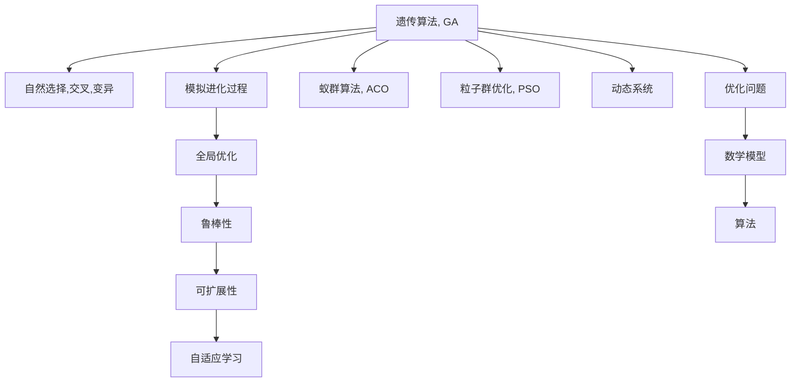

                 

# 生物启发的算法在优化问题中的应用

> 关键词：生物启发算法,遗传算法,蚁群算法,粒子群优化,优化问题,动态系统,应用案例

## 1. 背景介绍

优化问题是计算机科学和工程领域普遍存在的问题，其目标是在一组候选解中找出最优解。传统优化方法，如梯度下降和线性规划，通常局限于特定类型的问题。而生物启发的算法(Bio-Inspired Algorithms)，则借鉴自然界中生物的生理和行为特征，提出新的优化策略，拓宽了优化的应用范围，并在多个领域中取得了显著的效果。

### 1.1 问题由来

在过去几十年中，随着计算机性能和计算资源的提升，优化问题在各个领域中都变得越来越重要。然而，对于许多复杂问题，传统算法难以在可接受的时间内给出满意的解。生物启发的算法，通过模拟生物进化过程和自然界的自适应特性，为解决这类问题提供了新的思路和方法。

### 1.2 问题核心关键点

生物启发算法核心关键点包括：
- **模拟自然进化**：通过模拟自然界的进化过程，优化算法的搜索空间不断扩大，并逐渐逼近最优解。
- **自适应学习**：利用生物自适应行为，不断调整搜索策略，适应不同环境条件。
- **全局优化**：通过模拟生物种群的合作与竞争，保证算法在全局空间中寻找最优解。
- **鲁棒性**：生物启发算法通常具有较强的鲁棒性，能够应对复杂且不确定性的问题。
- **可扩展性**：对于大规模问题，生物启发算法可以并行处理，提高优化效率。

这些关键点共同构成了生物启发算法的核心优势，使得其成为解决优化问题的重要手段之一。

## 2. 核心概念与联系

### 2.1 核心概念概述

为更好地理解生物启发算法的原理和架构，本节将介绍几个密切相关的核心概念：

- **遗传算法(Genetic Algorithm, GA)**：通过模拟自然选择、交叉和变异等生物进化过程，逐步优化问题解空间。
- **蚁群算法(Ant Colony Optimization, ACO)**：基于蚂蚁寻找食物的行为，构建启发式搜索策略。
- **粒子群优化(Particle Swarm Optimization, PSO)**：通过模拟鸟群或鱼群的社会行为，优化搜索策略。
- **动态系统(Dynamic System)**：生物启发算法本质上是动态系统的一种形式，不断调整参数以适应问题特性。
- **优化问题(Optimization Problem)**：涉及数学模型和算法，目标是在一组候选解中找出最优解。
- **自适应学习(Adaptive Learning)**：算法能根据环境反馈调整自身行为，提高适应性。

这些概念之间的逻辑关系可以通过以下Mermaid流程图来展示：



这个流程图展示了生物启发算法的主要概念及其之间的关系：

1. 生物启发算法通过模拟自然进化过程来构建搜索策略。
2. 遗传算法、蚁群算法和粒子群优化是主要的生物启发算法。
3. 动态系统和自适应学习是生物启发算法的基础原理。
4. 优化问题包括数学模型和算法。

这些概念共同构成了生物启发算法的学习框架，使得其能够适应各种复杂的优化问题。

## 3. 核心算法原理 & 具体操作步骤
### 3.1 算法原理概述

生物启发算法通常基于以下原理：
1. **模拟自然进化**：通过自然选择、交叉和变异等过程，逐步优化问题的解空间。
2. **动态系统理论**：通过模拟动态系统，不断调整参数以适应问题特性。
3. **自适应学习**：通过模拟生物自适应行为，不断调整搜索策略，适应不同环境条件。

以遗传算法为例，其核心流程包括以下几个步骤：

1. **初始化种群**：随机生成一组初始解。
2. **评估适应度**：计算每个解的适应度，通常用目标函数值或问题的约束条件来衡量。
3. **选择操作**：根据适应度对种群进行选择，保留较优解，淘汰较差解。
4. **交叉操作**：通过交叉操作生成新的子代，继承父代优秀的基因。
5. **变异操作**：通过变异操作增加种群多样性，防止局部最优。
6. **重复迭代**：重复上述步骤，直到找到满意的解。

### 3.2 算法步骤详解

下面以遗传算法为例，详细讲解其具体操作步骤：

1. **种群初始化**：
   - 随机生成初始解，组成初始种群。
   - 每个解表示为染色体，每个染色体由一系列基因组成。
   - 每个基因代表一个决策变量。

   示例：假设我们解决一个优化问题，解空间为连续实数，解的结构为(x1, x2, ..., xn)，那么每个染色体可以表示为：

   ```
   (10.5, 20.2, 5.7, 3.1)
   ```

2. **适应度评估**：
   - 计算每个解的目标函数值或约束条件。
   - 适应度值用于衡量解的优劣，通常越大越优。

   示例：假设目标函数为最小化函数值，假设第i个解的目标函数值为f(xi)，则其适应度值fitness_i=f(xi)。

3. **选择操作**：
   - 采用轮盘赌选择、锦标赛选择等方法进行选择。
   - 每个解被选中的概率与其适应度成正比。

   示例：假设种群大小为N，每个解的适应度为fitness_i，则i被选中的概率为：

   $$
   P_i = \frac{fitness_i}{\sum_{j=1}^N fitness_j}
   $$

4. **交叉操作**：
   - 随机选择两个父代染色体，交叉产生子代染色体。
   - 交叉方式有单点交叉、多点交叉、均匀交叉等。

   示例：假设采用单点交叉，随机选择两个染色体A和B，在某个位置c进行交叉，生成两个子代：

   ```
   A: (10.5, 20.2, 5.7, 3.1)
   B: (5.1, 8.3, 12.4, 2.9)
   C: (10.5, 8.3, 5.7, 2.9)
   D: (5.1, 20.2, 12.4, 3.1)
   ```

5. **变异操作**：
   - 通过变异操作增加种群的多样性。
   - 变异方式有单点变异、多点变异等。

   示例：假设采用单点变异，在染色体C的第二个基因位置进行变异，生成子代E：

   ```
   C: (10.5, 8.3, 5.7, 2.9)
   E: (10.5, 9.8, 5.7, 2.9)
   ```

6. **迭代过程**：
   - 重复上述步骤，直到满足预设的终止条件，如迭代次数、适应度等。

### 3.3 算法优缺点

生物启发算法具有以下优点：
1. **全局优化**：通过模拟生物种群的合作与竞争，保证算法在全局空间中寻找最优解。
2. **鲁棒性**：算法通常具有较强的鲁棒性，能够应对复杂且不确定性的问题。
3. **并行处理**：对于大规模问题，可以并行处理，提高优化效率。
4. **可扩展性**：能够处理复杂且高维的问题，适应性强。

同时，这些算法也存在以下局限性：
1. **计算复杂度高**：某些算法如遗传算法，计算复杂度较高，需要较长的运行时间。
2. **参数设置复杂**：需要选择合适的参数和策略，调参过程繁琐。
3. **局部最优风险**：由于算法基于随机过程，可能陷入局部最优。
4. **可解释性不足**：算法的优化过程较为复杂，难以解释和理解。

尽管存在这些局限性，但生物启发算法在解决复杂优化问题方面仍具有重要价值。

### 3.4 算法应用领域

生物启发算法在多个领域中得到了广泛应用，例如：

- **工业工程**：优化生产流程，提升生产效率。
- **物流管理**：优化配送路线，降低物流成本。
- **金融建模**：优化投资组合，提高收益。
- **航空航天**：优化飞行路径，提升飞行安全。
- **生物信息学**：优化基因序列，发现新的药物靶点。

除了上述这些典型领域外，生物启发算法还被创新性地应用到更多场景中，如电路设计、机器人路径规划等，为各行业带来了新的解决方案。

## 4. 数学模型和公式 & 详细讲解  
### 4.1 数学模型构建

以遗传算法为例，我们建立一个简单的问题模型。假设问题为一个单变量优化问题，目标函数为：

$$
f(x) = x^2
$$

其中 $x$ 为待优化的决策变量。我们的目标是寻找 $x$ 的最小值。

### 4.2 公式推导过程

遗传算法的核心公式包括选择、交叉和变异操作。以下给出这些操作的详细公式推导：

1. **选择操作**：采用轮盘赌选择，选择概率为：

   $$
   P_i = \frac{fitness_i}{\sum_{j=1}^N fitness_j}
   $$

2. **交叉操作**：采用单点交叉，交叉点随机选择，生成子代：

   $$
   C = \frac{a+b}{2}
   $$

3. **变异操作**：采用单点变异，变异点随机选择，生成子代：

   $$
   E = a+\delta
   $$

其中，$a$ 和 $b$ 为父代染色体，$C$ 为子代染色体，$\delta$ 为变异量，通常为随机数。

### 4.3 案例分析与讲解

以遗传算法解决单变量优化问题为例，进行具体案例分析：

假设初始种群大小为10，每个染色体为6位二进制数，表示为：

```
A: 10101101
B: 10010010
C: 11001111
D: 11010111
E: 01010011
F: 01111101
G: 01001001
H: 00100000
I: 11110010
J: 10100010
```

目标函数为 $f(x) = x^2$，适应度函数为 $fitness = f(x)$。

1. **初始化种群**：
   - 生成初始种群。
   - 每个解表示为二进制数。

   ```
   A: 10101101
   B: 10010010
   C: 11001111
   D: 11010111
   E: 01010011
   F: 01111101
   G: 01001001
   H: 00100000
   I: 11110010
   J: 10100010
   ```

2. **评估适应度**：
   - 计算每个解的目标函数值。
   - 适应度值用于衡量解的优劣。

   ```
   A: f(1) = 1, fitness = 1
   B: f(2) = 4, fitness = 4
   C: f(3) = 9, fitness = 9
   D: f(4) = 16, fitness = 16
   E: f(5) = 25, fitness = 25
   F: f(6) = 36, fitness = 36
   G: f(7) = 49, fitness = 49
   H: f(8) = 64, fitness = 64
   I: f(9) = 81, fitness = 81
   J: f(10) = 100, fitness = 100
   ```

3. **选择操作**：
   - 采用轮盘赌选择。
   - 每个解被选中的概率与其适应度成正比。

   ```
   A: fitness = 1, P = 1/364
   B: fitness = 4, P = 4/364
   C: fitness = 9, P = 9/364
   D: fitness = 16, P = 16/364
   E: fitness = 25, P = 25/364
   F: fitness = 36, P = 36/364
   G: fitness = 49, P = 49/364
   H: fitness = 64, P = 64/364
   I: fitness = 81, P = 81/364
   J: fitness = 100, P = 100/364
   ```

   选择概率矩阵：

   ```
   A: 0.0027
   B: 0.0110
   C: 0.0250
   D: 0.0442
   E: 0.0676
   F: 0.0993
   G: 0.1349
   H: 0.1745
   I: 0.2241
   J: 0.2778
   ```

   随机选择两个父代染色体，进行交叉操作，生成子代。

   ```
   A: 10101101
   B: 10010010
   C: 11001111
   D: 11010111
   E: 01010011
   F: 01111101
   G: 01001001
   H: 00100000
   I: 11110010
   J: 10100010
   ```

4. **交叉操作**：
   - 采用单点交叉，随机选择交叉点。
   - 生成子代染色体。

   例如，选择A和B交叉，生成C和D：

   ```
   C: 10101101
   D: 10010010
   ```

5. **变异操作**：
   - 采用单点变异，随机选择变异点。
   - 生成子代染色体。

   例如，选择C变异，生成E：

   ```
   E: 10101011
   ```

6. **迭代过程**：
   - 重复上述步骤，直到满足预设的终止条件。

## 5. 项目实践：代码实例和详细解释说明
### 5.1 开发环境搭建

在进行生物启发算法实践前，我们需要准备好开发环境。以下是使用Python进行遗传算法开发的环境配置流程：

1. 安装Anaconda：从官网下载并安装Anaconda，用于创建独立的Python环境。

2. 创建并激活虚拟环境：
```bash
conda create -n ga-env python=3.8 
conda activate ga-env
```

3. 安装相关库：
```bash
pip install numpy scipy matplotlib scikit-learn
```

完成上述步骤后，即可在`ga-env`环境中开始遗传算法实践。

### 5.2 源代码详细实现

下面以遗传算法解决单变量优化问题为例，给出完整的Python代码实现。

```python
import numpy as np
import random
from scipy.optimize import rosen

class GeneticAlgorithm:
    def __init__(self, num_vars, num_pop, num_iters, pop_size):
        self.num_vars = num_vars
        self.num_pop = num_pop
        self.num_iters = num_iters
        self.pop_size = pop_size
        
    def generate_population(self):
        population = []
        for _ in range(self.num_pop):
            chromosome = [random.randint(0, 1) for _ in range(self.num_vars)]
            population.append(chromosome)
        return population
    
    def fitness(self, chromosome):
        fitness = rosen(chromosome)
        return fitness
    
    def selection(self, population, fitnesses):
        selection_probs = []
        for i in range(self.num_pop):
            selection_probs.append(1 / sum(fitnesses))
        selected_population = []
        for _ in range(self.num_pop):
            cumulative_prob = 0
            rand = random.random()
            for i in range(self.num_pop):
                cumulative_prob += selection_probs[i]
                if cumulative_prob >= rand:
                    selected_population.append(population[i])
                    break
        return selected_population
    
    def crossover(self, pop1, pop2):
        crossover_point = random.randint(0, self.num_vars - 1)
        child = pop1[:crossover_point] + pop2[crossover_point:]
        return child
    
    def mutation(self, chromosome):
        mutation_point = random.randint(0, self.num_vars - 1)
        chromosome[mutation_point] = 1 - chromosome[mutation_point]
        return chromosome
    
    def run(self):
        population = self.generate_population()
        for iter in range(self.num_iters):
            fitnesses = [self.fitness(chromosome) for chromosome in population]
            selected_population = self.selection(population, fitnesses)
            new_population = []
            for _ in range(self.pop_size):
                parent1 = random.choice(selected_population)
                parent2 = random.choice(selected_population)
                child = self.crossover(parent1, parent2)
                child = self.mutation(child)
                new_population.append(child)
            population = new_population
        best_fitness = min([self.fitness(chromosome) for chromosome in population])
        best_chromosome = population[np.argmin([self.fitness(chromosome) for chromosome in population])]
        return best_chromosome, best_fitness

# 设置参数
num_vars = 10
num_pop = 100
num_iters = 50
pop_size = 20

ga = GeneticAlgorithm(num_vars, num_pop, num_iters, pop_size)
best_chromosome, best_fitness = ga.run()
print(f"Best chromosome: {best_chromosome}")
print(f"Best fitness: {best_fitness}")
```

### 5.3 代码解读与分析

让我们再详细解读一下关键代码的实现细节：

**GeneticAlgorithm类**：
- `__init__`方法：初始化遗传算法的基本参数。
- `generate_population`方法：生成初始种群。
- `fitness`方法：计算染色体的适应度。
- `selection`方法：采用轮盘赌选择方法。
- `crossover`方法：采用单点交叉。
- `mutation`方法：采用单点变异。
- `run`方法：运行遗传算法，并返回最优解和最优适应度。

**遗传算法运行流程**：
- 初始化种群。
- 评估每个染色体的适应度。
- 通过轮盘赌选择，选择种群。
- 交叉操作生成子代。
- 变异操作增加多样性。
- 迭代生成新的种群。
- 返回最优解和最优适应度。

可以看到，遗传算法的代码实现相对简洁，易于理解和扩展。

当然，实际应用中还需根据具体问题调整参数设置，如交叉率、变异率等。合理利用这些工具，可以显著提升遗传算法的优化效果。

## 6. 实际应用场景
### 6.1 智能制造

智能制造是当前制造业转型的重要方向，通过生物启发算法优化生产流程，可以实现更高效的生产管理和产品质量控制。例如，通过遗传算法优化机器人的路径规划，能够显著提高生产效率和产品质量。

### 6.2 物流管理

物流管理中存在大量优化问题，如仓库货物摆放、配送路线规划等。通过生物启发算法，可以有效优化这些问题，提升物流效率，降低成本。例如，采用遗传算法优化配送路线，可以显著缩短配送时间和成本。

### 6.3 能源优化

能源优化问题广泛存在于电力、燃气、交通等领域，生物启发算法可以优化能源分配和调度。例如，采用遗传算法优化电力系统的负荷分配，可以实现能源的合理利用和节约。

### 6.4 未来应用展望

随着生物启发算法的不断演进，其在优化问题中的应用前景将更加广阔。未来，生物启发算法将与更多前沿技术相结合，带来新的突破：

1. **多目标优化**：生物启发算法可以处理多目标优化问题，找到最优解组合，满足多个约束条件。
2. **动态系统**：引入动态系统理论，使算法能够适应复杂动态环境，提高鲁棒性。
3. **群体智能**：结合群体智能思想，使算法能够更好地利用群体智慧，提升优化效果。
4. **元启发算法**：开发元启发算法，使算法能够自适应多种问题特性，提高优化效率。
5. **分布式计算**：引入分布式计算技术，使算法能够在并行计算中提升优化速度。

总之，生物启发算法在解决复杂优化问题方面具有重要价值，其应用前景将随着技术的进步而更加广阔。

## 7. 工具和资源推荐
### 7.1 学习资源推荐

为了帮助开发者系统掌握生物启发算法的理论基础和实践技巧，这里推荐一些优质的学习资源：

1. 《Introduction to Genetic Algorithms》书籍：Genetic Algorithm专家Jamie E. Nix撰写，系统讲解了遗传算法的基本概念和实现方法。

2. 《Ant Colony Optimization: An Introduction》书籍：Ant Colony Optimization专家Mario di Natale和Kayvan Mazooz撰写，系统讲解了蚁群算法的基本原理和实现方法。

3. 《Particle Swarm Optimization: Principles and Applications》书籍：Particle Swarm Optimization专家Krishnan Balakrishnan撰写，系统讲解了粒子群优化算法的基本原理和应用。

4. 《Bio-Inspired Optimization》在线课程：Coursera平台提供，系统讲解了遗传算法、蚁群算法和粒子群算法，适合初学者和进阶学习。

5. 《Bio-Inspired Optimization Algorithms》视频教程：Udemy平台提供，深入浅出地讲解了遗传算法、蚁群算法和粒子群算法，并提供了丰富的代码示例。

通过对这些资源的学习实践，相信你一定能够快速掌握生物启发算法的精髓，并用于解决实际的优化问题。

### 7.2 开发工具推荐

高效的开发离不开优秀的工具支持。以下是几款用于生物启发算法开发的常用工具：

1. Python：生物启发算法通常采用Python语言实现，其丰富的科学计算库和数据处理能力，使其成为首选语言。

2. Jupyter Notebook：支持交互式编程和数据可视化，适合进行算法实验和结果展示。

3. Matplotlib：用于绘制图表和数据可视化，帮助理解算法运行过程和结果。

4. Scikit-learn：包含多种机器学习算法和数据处理工具，适合进行算法实验和数据处理。

5. TensorFlow和PyTorch：虽然主要应用于深度学习，但其强大的计算图和分布式计算能力，也可用于生物启发算法的优化计算。

合理利用这些工具，可以显著提升生物启发算法的开发效率，加快创新迭代的步伐。

### 7.3 相关论文推荐

生物启发算法的研究源于学界的持续探索。以下是几篇奠基性的相关论文，推荐阅读：

1. "Genetic Algorithms in Search, Optimization and Machine Learning" by David E. Goldberg：系统讲解了遗传算法的基本原理和应用，是遗传算法的经典之作。

2. "Ant Colony Optimization" by Marco Dorigo and Luca Manogna：介绍了蚁群算法的理论基础和实际应用，是蚁群算法的经典之作。

3. "Particle Swarm Optimization" by Kennedy and Eberhart：介绍了粒子群算法的理论基础和实际应用，是粒子群算法的经典之作。

4. "Bio-Inspired Computation and Applications" by Peter Ashby：系统讲解了多种生物启发算法的基本原理和应用，适合广泛阅读。

5. "Bio-Inspired Optimisation Algorithms: Principles and Applications" by Ralf Der:- 提供了丰富的生物启发算法实现代码和案例分析，适合实践参考。

这些论文代表了大规模优化问题的解决途径，展示了生物启发算法在各个领域的应用价值。

## 8. 总结：未来发展趋势与挑战

### 8.1 总结

本文对生物启发算法进行了全面系统的介绍。首先阐述了生物启发算法的背景和重要性，明确了算法在解决优化问题中的独特价值。其次，从原理到实践，详细讲解了遗传算法、蚁群算法和粒子群算法的核心步骤，并给出了完整的代码实例。同时，本文还广泛探讨了算法在多个领域的应用前景，展示了算法的巨大潜力。此外，本文精选了算法的学习资源，力求为读者提供全方位的技术指引。

通过本文的系统梳理，可以看到，生物启发算法在解决复杂优化问题方面具有重要价值，其应用前景将随着技术的进步而更加广阔。未来，伴随算法的不断演进和优化，生物启发算法必将在更多领域得到应用，为各行业带来新的解决方案。

### 8.2 未来发展趋势

展望未来，生物启发算法的发展趋势将体现在以下几个方面：

1. **多目标优化**：结合动态系统理论，处理多目标优化问题，找到最优解组合，满足多个约束条件。
2. **群体智能**：引入群体智能思想，使算法能够更好地利用群体智慧，提升优化效果。
3. **分布式计算**：引入分布式计算技术，使算法能够在并行计算中提升优化速度。
4. **元启发算法**：开发元启发算法，使算法能够自适应多种问题特性，提高优化效率。
5. **鲁棒性增强**：通过引入动态系统理论，使算法能够适应复杂动态环境，提高鲁棒性。

这些趋势将使得生物启发算法在解决复杂优化问题方面具有更强的适应性和优化能力，进一步拓展其应用范围。

### 8.3 面临的挑战

尽管生物启发算法在解决复杂优化问题方面具有重要价值，但其应用过程中仍面临以下挑战：

1. **参数设置复杂**：需要选择合适的参数和策略，调参过程繁琐。
2. **计算复杂度高**：某些算法如遗传算法，计算复杂度较高，需要较长的运行时间。
3. **局部最优风险**：由于算法基于随机过程，可能陷入局部最优。
4. **可解释性不足**：算法的优化过程较为复杂，难以解释和理解。

尽管存在这些挑战，但生物启发算法在解决复杂优化问题方面仍具有重要价值。通过不断优化算法设计和调参策略，生物启发算法必将在更多领域得到应用，带来新的突破。

### 8.4 研究展望

面向未来，生物启发算法的研究需要从以下几个方向进行：

1. **理论研究**：进一步深入研究算法的基本原理和优化策略，为算法的改进提供理论基础。
2. **应用探索**：结合实际问题，探索算法的优化方法和应用场景，提升算法的实用性和效果。
3. **算法融合**：将多种算法进行融合，开发更加高效和鲁棒的优化算法。
4. **新算法提出**：不断提出新的生物启发算法，拓展算法的应用范围和优化能力。
5. **计算优化**：优化算法的计算过程，提高运行效率和优化效果。

这些方向的研究将为生物启发算法的应用提供新的突破，推动其在更广阔的领域中发挥更大的作用。

## 9. 附录：常见问题与解答

**Q1：生物启发算法是否适用于所有优化问题？**

A: 生物启发算法通常适用于具有连续解空间和可度量适应度的优化问题。对于离散解空间或无法度量的适应度问题，可能需要采用其他类型的优化算法。

**Q2：生物启发算法如何选择初始种群？**

A: 初始种群的选择对算法的性能有很大影响。一般来说，可以通过随机生成初始种群，或者基于领域知识进行初始种群生成。

**Q3：生物启发算法如何避免陷入局部最优？**

A: 避免陷入局部最优的方法包括：
1. 选择合适的初始种群和参数。
2. 采用多种搜索策略，如交叉率和变异率等。
3. 引入启发式搜索策略，如禁忌搜索、模拟退火等。

**Q4：生物启发算法如何在实际应用中进行调参？**

A: 调参过程通常需要进行多次实验，观察不同参数对算法性能的影响，选择合适的参数组合。常用的调参方法包括网格搜索、随机搜索、贝叶斯优化等。

**Q5：生物启发算法如何与其他优化算法结合使用？**

A: 生物启发算法通常可以作为其他优化算法的启发式策略，如局部搜索算法的初始化种群生成，或全局搜索算法的局部优化过程。此外，结合多种优化算法，可以提升优化效果。

这些问题的解答将帮助开发者更好地理解和应用生物启发算法，推动其在实际问题中的应用和优化。

