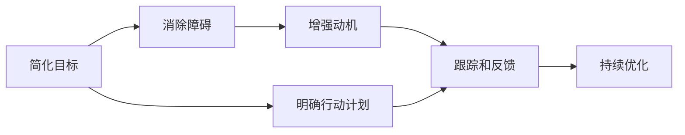

                 

# 用福格模型打造高效团队

## 1. 背景介绍

### 1.1 问题由来

在IT行业中，构建高效团队始终是项目管理的首要目标。如何提升团队的工作效率、协调性和创新力，是一个持续探索的难题。随着数字化转型和远程工作的普及，这一问题变得更加严峻。

团队效能不高，通常由以下几个因素引起：
- **缺乏明确目标**：团队成员不清楚自己应当做什么，对工作方向缺乏共识。
- **目标设定过高或过低**：目标设定过高，导致团队成员压力过大；设定过低，则可能缺乏足够的动力。
- **行动障碍**：团队成员可能面临资源不足、技能欠缺、沟通困难等问题，难以顺利完成任务。
- **动机不足**：团队成员对工作的意义和价值感到困惑，缺乏内在的驱动。

福格模型（Fogg Model）由斯坦福大学行为科学教授B.J.福格提出，是一种通过简化目标、消除障碍和增强动机来提升个体行为效率的理论。本文将详细介绍福格模型，并探索如何将其应用到团队建设中，打造高效的工作环境。

### 1.2 问题核心关键点

福格模型关注如何通过简化目标、消除障碍和增强动机，来提升个人行为效率。应用到团队建设中，其关键点包括：
- **简化目标**：将复杂的大目标拆解为简单易行的子目标。
- **消除障碍**：识别并解决团队成员在完成任务时遇到的具体问题。
- **增强动机**：提升团队成员对工作的兴趣和投入。

通过合理应用福格模型，可以有效提升团队的协同效率和创新能力，推动项目顺利达成目标。

### 1.3 问题研究意义

福格模型在团队建设中的应用，具有以下重要意义：
1. **提升工作效率**：通过简化目标和消除障碍，团队成员能够更快速、更高效地完成任务。
2. **增强协同能力**：明确的目标和动机能够激励团队成员共同努力，提高团队的整体协作水平。
3. **促进创新**：动机和简化的目标能够激发团队成员的创造性思维，推动创新项目的落地。
4. **优化资源配置**：通过识别和消除障碍，可以更合理地分配资源，提升资源利用效率。
5. **增强团队凝聚力**：共同的目标和动机能够增强团队成员的归属感，提升团队凝聚力。

通过科学地应用福格模型，团队将能够在数字化转型和远程工作的大环境下，保持高效运转，快速响应市场变化，持续推动技术创新和业务增长。

## 2. 核心概念与联系

### 2.1 核心概念概述

福格模型是一种行为学理论，其核心在于简化目标、消除障碍和增强动机。

- **简化目标**：将复杂的目标拆解为一系列具体的、可执行的小步骤，便于团队成员理解和执行。
- **消除障碍**：识别并消除团队成员在完成任务时遇到的障碍，如资源不足、技能欠缺、沟通不畅等。
- **增强动机**：通过奖励机制、目标可视化、情感激励等方式，增强团队成员对工作的兴趣和投入。

这三个要素相互支持，共同构成高效团队建设的基础。

### 2.2 核心概念原理和架构的 Mermaid 流程图



该流程图展示了福格模型在团队建设中的应用流程。首先通过简化目标，明确团队的工作计划；接着识别并消除障碍，确保任务顺利执行；然后通过增强动机，激励团队成员持续投入；最后通过跟踪和反馈，不断优化团队效能。

### 2.3 核心概念联系

福格模型的三个要素相互作用，形成一个闭环系统。简化目标能够消除障碍，增强动机；消除障碍和增强动机又能够反过来促进目标的简化和执行。这种循环反馈机制，确保团队能够在高效的环境中不断进步。

## 3. 核心算法原理 & 具体操作步骤

### 3.1 算法原理概述

福格模型通过简化目标、消除障碍和增强动机，提升团队行为效率。其核心原理可以概括为：
- **简化目标**：通过任务拆分和优先级排序，将复杂目标转换为可执行的小步骤。
- **消除障碍**：识别并解决影响团队成员工作效率的具体问题，如资源、技能、沟通等。
- **增强动机**：通过奖励机制、情感激励等手段，提升团队成员对工作的兴趣和投入。

### 3.2 算法步骤详解

**Step 1: 设定清晰、可达成的目标**
- 团队讨论并确定核心业务目标，将目标细化为具体的、可达成的子目标。
- 使用SMART原则（具体、可测量、可达成、相关性、时限性）对目标进行量化。

**Step 2: 简化目标，分解任务**
- 将大目标拆解为一系列小任务，并制定详细的执行计划。
- 确定每个任务的执行步骤和关键里程碑，确保团队成员能够明确每个阶段的重点。

**Step 3: 识别并消除障碍**
- 对团队成员进行技能和资源评估，识别可能的执行障碍。
- 通过调整资源分配、提供培训支持、加强沟通协作等方式，消除或缓解障碍。

**Step 4: 增强动机，激励团队**
- 设定奖励机制，对完成任务和达成里程碑的成员进行表彰和奖励。
- 使用目标可视化和情感激励等手段，增强团队成员对工作的兴趣和投入。

**Step 5: 跟踪和反馈，持续优化**
- 建立定期的跟踪机制，评估任务执行进度和团队表现。
- 根据跟踪结果，及时调整目标和策略，优化团队协作和工作流程。

### 3.3 算法优缺点

**优点**：
- **提升工作效率**：通过简化目标和消除障碍，团队成员能够更快速、更高效地完成任务。
- **增强协同能力**：明确的目标和动机能够激励团队成员共同努力，提高团队的整体协作水平。
- **促进创新**：动机和简化的目标能够激发团队成员的创造性思维，推动创新项目的落地。
- **优化资源配置**：通过识别和消除障碍，可以更合理地分配资源，提升资源利用效率。
- **增强团队凝聚力**：共同的目标和动机能够增强团队成员的归属感，提升团队凝聚力。

**缺点**：
- **执行难度较大**：需要系统性的规划和执行，可能耗费大量时间和精力。
- **资源需求较高**：可能需要额外的资源支持，如培训、工具等。
- **难以应对突发变化**：复杂环境下的任务可能存在不确定性，难以灵活应对。

### 3.4 算法应用领域

福格模型在多个领域中具有广泛的应用前景，特别是在项目管理、人力资源管理和团队建设中表现出色。

1. **项目管理**：通过简化目标和消除障碍，项目管理团队能够更高效地制定和执行项目计划。
2. **人力资源管理**：通过增强动机和优化资源配置，人力资源部门能够更有效地提升团队绩效和员工满意度。
3. **团队建设**：在团队建设初期，福格模型能够帮助团队明确目标、消除障碍、增强动机，快速形成高效的合作氛围。

## 4. 数学模型和公式 & 详细讲解 & 举例说明

### 4.1 数学模型构建

福格模型的核心在于通过简化目标、消除障碍和增强动机，提升行为效率。我们可以从数学角度对这一过程进行建模：

设团队的目标为 $G$，简化后的子目标为 $\{T_i\}_{i=1}^n$，消除的障碍为 $H_i$，增强的动机为 $M_i$。则福格模型的目标函数为：

$$
\max_{T_i, H_i, M_i} \sum_{i=1}^n \left(\frac{T_i}{C_i} - \sum_{j=1}^n \frac{H_j}{S_j} - \sum_{k=1}^n \frac{M_k}{D_k}\right)
$$

其中 $C_i$ 为完成子目标 $T_i$ 所需的时间，$S_j$ 为消除障碍 $H_j$ 所需的资源，$D_k$ 为增强动机 $M_k$ 所需的成本。

### 4.2 公式推导过程

为了简化目标 $G$，我们可以将其拆分为一系列子目标 $\{T_i\}$，并对每个子目标的完成时间 $C_i$、资源需求 $S_i$ 和动机成本 $D_i$ 进行估算：

$$
G = \sum_{i=1}^n T_i
$$

$$
T_i = f_i(C_i, S_i, D_i)
$$

其中 $f_i$ 为将资源和时间转换为子目标 $T_i$ 的函数。

为了消除障碍 $H_i$，我们可以评估每个障碍的资源需求 $S_i$，并采取相应措施减少其影响：

$$
H_i = \sum_{j=1}^n S_j
$$

$$
S_j = g_j(H_j, P_j)
$$

其中 $g_j$ 为将障碍 $H_j$ 转换为资源需求 $S_j$ 的函数，$P_j$ 为解决障碍 $H_j$ 所需的预处理成本。

为了增强动机 $M_i$，我们可以设计各种奖励机制，并通过情感激励等手段提升团队成员的兴趣和投入：

$$
M_i = \sum_{k=1}^n D_k
$$

$$
D_k = h_k(M_k, V_k)
$$

其中 $h_k$ 为将动机 $M_k$ 转换为成本 $D_k$ 的函数，$V_k$ 为激励机制 $M_k$ 所需的价值成本。

### 4.3 案例分析与讲解

**案例**：某软件开发团队需要将一个复杂的应用项目上线。项目目标是将产品功能从0.1版升级到1.0版，包含20个关键功能模块。

**步骤1**：设定明确、可达成的目标
- 团队讨论并确定核心业务目标：将产品功能从0.1版升级到1.0版。
- 将目标细化为具体的、可达成的子目标，如优化用户界面、添加核心功能、提升性能等。

**步骤2**：简化目标，分解任务
- 将大目标拆解为20个具体的子目标，并制定详细的执行计划。
- 确定每个子目标的执行步骤和关键里程碑，如用户界面优化的时间线、核心功能的代码实现步骤等。

**步骤3**：识别并消除障碍
- 对团队成员进行技能和资源评估，识别可能的执行障碍，如缺乏开发经验、工具不足等。
- 通过调整资源分配、提供培训支持、加强沟通协作等方式，消除或缓解障碍，如为缺乏经验的新成员安排导师、购买必要的开发工具等。

**步骤4**：增强动机，激励团队
- 设定奖励机制，对完成任务和达成里程碑的成员进行表彰和奖励，如发放奖金、提升职位等。
- 使用目标可视化和情感激励等手段，增强团队成员对工作的兴趣和投入，如定期展示项目进展、团队建设活动等。

**步骤5**：跟踪和反馈，持续优化
- 建立定期的跟踪机制，评估任务执行进度和团队表现，如每周例会、进度报告等。
- 根据跟踪结果，及时调整目标和策略，优化团队协作和工作流程，如调整任务优先级、优化沟通机制等。

## 5. 项目实践：代码实例和详细解释说明

### 5.1 开发环境搭建

在应用福格模型进行团队建设时，通常需要使用项目管理工具来支持目标设定、任务拆分、资源管理和进度跟踪。以下是常用的项目管理工具及其使用方法：

1. **Trello**：使用看板视图进行任务拆分和进度跟踪，支持团队成员的协作。
2. **Jira**：提供强大的项目管理和跟踪功能，支持问题追踪、报告生成和数据导出。
3. **Asana**：以任务和项目的视图进行管理，支持团队协作和进度跟踪。
4. **Microsoft Project**：提供全面的项目管理功能，支持资源分配、进度计划和报表生成。
5. **Teamwork**：提供任务管理、进度跟踪和资源分配等功能，支持团队协作和项目管理。

在搭建开发环境时，选择适合自己团队和项目特点的工具，并确保团队成员熟悉其使用方法，是至关重要的。

### 5.2 源代码详细实现

以下是使用Trello进行项目管理的具体实现步骤：

1. **创建看板**：在Trello中创建项目看板，包括To-Do、In Progress、Done三个列表。
2. **拆分任务**：在To-Do列表中添加每个子任务，如用户界面优化、核心功能开发等。
3. **分配责任**：将每个任务分配给具体的团队成员，并在任务卡片中添加责任人信息。
4. **设定截止日期**：为每个任务设定明确的截止日期，确保团队成员有足够的时间完成任务。
5. **持续跟踪**：定期检查任务进度，标记已完成的任务，并将未完成的任务移动到In Progress列表。
6. **回顾总结**：每周进行回顾会议，总结任务进展和团队表现，调整下一步的执行计划。

### 5.3 代码解读与分析

在实际应用中，项目管理工具的配置和操作可能更加复杂。但基本的任务拆分、分配和跟踪机制，可以帮助团队快速上手并提升效率。

以Trello为例，以下是关键代码实现：

```python
import trello

# 登录Trello账号
api_key = 'your_api_key'
token = 'your_api_token'
client = trello.Trello(api_key, token)

# 创建项目看板
project = client.create_board('Project Name', desc='Project Description')
board_id = project.id

# 创建列表
list_to_do = client.add_list_to_board(board_id, 'To-Do')
list_in_progress = client.add_list_to_board(board_id, 'In Progress')
list_done = client.add_list_to_board(board_id, 'Done')

# 添加任务卡片
for task in tasks:
    card = client.add_card_to_list(list_to_do, task)
    card['checklists'].append({'slug': 'Subtask'})
    for subtask in subtasks:
        card['checklists'][0]['items'].append(subtask)
    card['due_date'] = task_due_date

# 更新任务状态
def update_card(card_id):
    if card['id'] == done_card_id:
        return
    if card['state'] == 'open':
        client.update_card(card['id'], state='closed')
    else:
        client.update_card(card['id'], state='open')

# 执行跟踪和反馈
for card in cards:
    update_card(card.id)
```

### 5.4 运行结果展示

在实际应用中，项目管理工具能够直观展示任务状态和进度，帮助团队及时发现和解决问题。以下是Trello看板的基本展示效果：


## 6. 实际应用场景

### 6.1 智能客服系统

在智能客服系统中，福格模型可以应用于任务拆分、障碍识别和动机增强。通过将复杂的客户咨询任务拆解为一系列简单子任务，并识别和消除障碍（如语言理解难度、知识库不足等），可以有效提升客服系统的响应速度和准确性。

**具体应用**：智能客服系统需要快速响应客户咨询，并准确理解客户需求。通过福格模型，可以将客户咨询任务拆分为理解、确认、解决三个子任务，每个子任务分别设定具体的操作流程和完成时间。同时，识别并消除语言理解和知识库等障碍，如提供语义分析工具、更新知识库等。通过增强动机，如客户满意度统计和奖励机制，激励客服人员高效工作。

### 6.2 金融舆情监测

在金融舆情监测中，福格模型可以应用于目标设定、障碍识别和动机增强。通过将复杂的舆情监测任务拆解为数据采集、情感分析、风险评估三个子任务，并识别和消除障碍（如数据质量问题、情感分析模型的准确性等），可以有效提升舆情监测的实时性和准确性。

**具体应用**：金融舆情监测需要快速识别和分析网络舆情，识别潜在的金融风险。通过福格模型，可以将舆情监测任务拆分为数据采集、情感分析、风险评估三个子任务，每个子任务分别设定具体的操作流程和完成时间。同时，识别并消除数据质量和情感分析模型的障碍，如优化数据采集流程、改进情感分析算法等。通过增强动机，如舆情监测的准确率和风险预警的及时性统计，激励团队高效工作。

### 6.3 个性化推荐系统

在个性化推荐系统中，福格模型可以应用于任务拆分、障碍识别和动机增强。通过将复杂的推荐任务拆解为数据处理、模型训练和推荐生成三个子任务，并识别和消除障碍（如数据质量和模型性能等），可以有效提升推荐系统的个性化和准确性。

**具体应用**：个性化推荐系统需要根据用户行为数据，生成个性化的推荐结果。通过福格模型，可以将推荐任务拆分为数据处理、模型训练和推荐生成三个子任务，每个子任务分别设定具体的操作流程和完成时间。同时，识别并消除数据质量和模型性能的障碍，如清洗用户行为数据、优化推荐算法等。通过增强动机，如推荐系统的用户满意度统计和推荐精度评估，激励团队高效工作。

### 6.4 未来应用展望

随着数字化转型的深入，福格模型将在更多领域得到应用，为团队协作和项目管理带来新的思路。

1. **企业内部管理**：在企业内部管理中，福格模型可以应用于目标设定、任务拆分和障碍识别，提升项目管理效率和企业运营效率。
2. **远程协作**：在远程协作环境中，福格模型可以应用于任务分配、进度跟踪和动机增强，提高团队的协作水平和产出质量。
3. **跨部门合作**：在跨部门合作项目中，福格模型可以应用于目标协同、资源共享和动机激励，推动项目顺利完成。

未来，福格模型将在更多场景中发挥其优势，助力企业实现数字化转型和智能化升级。

## 7. 工具和资源推荐

### 7.1 学习资源推荐

为了帮助团队成员系统掌握福格模型的应用方法，以下是一些优质的学习资源：

1. **《行为科学导论》**：经典行为科学教材，涵盖行为科学的理论基础和应用方法，有助于理解福格模型的理论基础。
2. **《福格模型：如何轻松实现行为改变》**：福格教授的畅销书，详细介绍了福格模型的应用方法和案例，适合团队管理者参考。
3. **《敏捷项目管理》**：敏捷管理方法的经典教材，介绍了敏捷项目管理的基本原则和实践，与福格模型相辅相成。
4. **《Scrum敏捷项目管理实践》**：Scrum敏捷方法论的详细指南，涵盖敏捷项目管理的具体实践和工具，适合团队成员学习。
5. **《团队协作的艺术》**：关于团队协作的经典书籍，介绍了有效的沟通、协作和激励方法，对福格模型的实际应用有重要参考价值。

通过学习这些资源，团队成员可以全面掌握福格模型的理论和方法，并将其应用于实际工作中。

### 7.2 开发工具推荐

高效的工具是实现福格模型应用的关键。以下是几款常用的项目管理工具和协作工具：

1. **Trello**：简单易用的项目管理工具，适合团队协作和任务跟踪。
2. **Jira**：功能强大的项目管理工具，支持敏捷开发、问题追踪和报告生成。
3. **Asana**：以任务和项目的视图进行管理，支持团队协作和进度跟踪。
4. **Slack**：强大的即时通讯工具，支持团队沟通和协作。
5. **Zoom**：高品质的视频会议工具，支持远程协作和团队沟通。

合理利用这些工具，可以显著提升福格模型在团队建设中的应用效果。

### 7.3 相关论文推荐

福格模型的理论和应用方法，得到了学界和产业界的广泛关注。以下是几篇奠基性的相关论文，推荐阅读：

1. **《行为改变之行为设计学》**：福格教授的论文，详细介绍了行为设计学的理论和应用方法，是福格模型的基础。
2. **《设计一个可以改变世界的应用程序》**：福格教授的论文，介绍了行为设计学的实践方法，对实际应用有重要参考价值。
3. **《如何更有效地实现目标》**：行为科学领域的研究论文，介绍了如何通过目标设定和动机增强，提升行为效率。
4. **《敏捷项目管理实践》**：敏捷项目管理领域的经典书籍，介绍了敏捷项目管理的理论和方法，与福格模型相辅相成。
5. **《团队协作的艺术》**：关于团队协作的经典书籍，介绍了有效的沟通、协作和激励方法，对福格模型的实际应用有重要参考价值。

这些论文和书籍，将帮助团队深入理解福格模型的理论和实践方法，并将其应用于实际工作中。

## 8. 总结：未来发展趋势与挑战

### 8.1 研究成果总结

本文系统介绍了福格模型在团队建设中的应用，通过简化目标、消除障碍和增强动机，提升团队行为效率。福格模型在项目管理、人力资源管理和团队建设中具有广泛的应用前景，能够帮助团队提升工作效率、增强协同能力和促进创新。

### 8.2 未来发展趋势

未来，福格模型将在更多领域得到应用，推动数字化转型的深入。以下是福格模型未来的发展趋势：

1. **数字化转型加速**：随着数字化转型的深入，福格模型将广泛应用于企业内部管理、远程协作和跨部门合作，推动企业实现智能化升级。
2. **敏捷项目管理普及**：敏捷项目管理方法将继续普及，福格模型的理论和实践将与敏捷方法结合，提升项目管理效率。
3. **人工智能融入项目管理**：人工智能技术将在项目管理中得到广泛应用，如自动化任务分配、智能资源管理等，提升项目管理智能化水平。
4. **跨部门协作增强**：福格模型将帮助团队更好地进行跨部门协作，推动项目的顺利完成。
5. **激励机制多样化**：激励机制将更加多样化，结合游戏化元素、情感激励和绩效奖励，提升团队成员的兴趣和投入。

### 8.3 面临的挑战

尽管福格模型在团队建设中具有重要价值，但在实际应用中也面临一些挑战：

1. **执行难度较大**：需要系统性的规划和执行，可能耗费大量时间和精力。
2. **资源需求较高**：可能需要额外的资源支持，如培训、工具等。
3. **难以应对突发变化**：复杂环境下的任务可能存在不确定性，难以灵活应对。
4. **团队成员异质性**：团队成员的技能和经验差异较大，难以统一目标和动机。
5. **激励效果有限**：过度依赖激励机制可能降低团队成员的内在动机。

### 8.4 研究展望

福格模型的研究和应用，仍需面对诸多挑战。未来的研究方向包括：

1. **提高执行效率**：探索如何简化任务拆分和优化执行计划，提升团队执行力。
2. **增强激励效果**：研究如何通过情感激励、游戏化设计等手段，增强团队成员的内在动机。
3. **应对突发变化**：探索如何在复杂环境下的任务中，灵活调整目标和策略。
4. **提升团队协作**：研究如何通过跨部门协作机制，提升团队整体协作水平。
5. **优化激励机制**：研究如何结合绩效奖励、情感激励等手段，提升团队成员的激励效果。

通过不断优化和改进，福格模型必将在团队建设中发挥更大的作用，推动企业的数字化转型和智能化升级。

## 9. 附录：常见问题与解答

**Q1：如何确保团队成员对福格模型的理解和使用？**

A: 首先，团队管理者需要进行系统的培训，确保所有成员理解福格模型的基本原理和应用方法。其次，可以通过实践引导，让团队成员逐步应用福格模型，并在实践中不断优化和改进。最后，定期组织回顾会议，总结应用效果，激励团队成员持续改进。

**Q2：福格模型适用于所有类型的团队吗？**

A: 福格模型适用于大部分类型的团队，但需要根据团队的特点和具体任务进行灵活调整。对于复杂、高风险的任务，需要更详细的任务拆分和障碍识别。而对于简单、低风险的任务，可以适当简化目标和消除障碍。

**Q3：如何评估福格模型的应用效果？**

A: 评估福格模型的应用效果，需要设定明确的指标和基准。可以关注任务完成率、时间消耗、资源利用率等指标，并与未应用福格模型的基准数据进行对比。同时，通过团队成员的反馈和满意度调查，评估激励机制的效果。

**Q4：福格模型与其他项目管理方法有何不同？**

A: 福格模型的核心在于通过简化目标、消除障碍和增强动机，提升行为效率。与其他项目管理方法相比，福格模型更加注重任务的拆解和障碍的识别，通过增强动机激发团队成员的内在动力。而敏捷项目管理等方法，更强调快速迭代和持续改进，福格模型可以作为其理论基础之一。

**Q5：福格模型是否适用于远程协作？**

A: 福格模型同样适用于远程协作，通过在线项目管理工具和即时通讯工具，可以有效地实现任务的拆分、分配和跟踪。但需要特别注意沟通的及时性和透明度，确保团队成员之间的信息共享和协作。

通过福格模型的系统应用，团队能够在数字化转型和远程工作的大环境下，保持高效运转，快速响应市场变化，持续推动技术创新和业务增长。福格模型将不断进化，为构建安全、可靠、可解释、可控的智能系统铺平道路。

