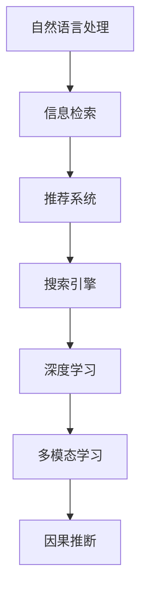

                 

# 电商平台中AI大模型的搜索结果展示优化

## 1. 背景介绍

随着电商平台的快速发展和竞争加剧，用户搜索体验的优化显得愈发重要。AI大模型因其强大的自然语言理解能力和丰富的语义表示，被广泛应用于电商平台中，以提升搜索结果的相关性和个性化。然而，在实际应用中，搜索结果展示的优化仍然存在诸多挑战。

### 1.1 问题由来

在电商平台中，AI大模型通过自然语言处理技术，能够理解和解析用户查询语句，并从庞大的商品库中筛选出相关的搜索结果。但搜索结果的展示方式往往简单单一，无法充分展示商品的详细属性和用户评价等信息，导致用户难以快速找到满意的商品，影响用户满意度和转化率。

### 1.2 问题核心关键点

具体而言，电商平台AI大模型的搜索结果展示优化，主要关注以下几个核心关键点：

- 搜索结果的相关性。确保模型输出的商品信息与用户查询意图高度匹配。
- 搜索结果的多样性。推荐多种不同类型和风格的商品，满足用户多样化的需求。
- 搜索结果的可解释性。展示商品的详细属性和用户评价等信息，帮助用户更好地理解商品，作出购买决策。
- 搜索结果的个性化。根据用户的历史浏览和购买记录，推荐个性化的商品，提升用户体验。
- 搜索结果的实时性。实时更新商品信息和用户评价，保持展示内容的及时性和准确性。

这些关键点涉及自然语言理解、推荐系统、信息检索等多个领域的知识，需要通过多技术融合的方式进行优化。

## 2. 核心概念与联系

### 2.1 核心概念概述

为更好地理解电商平台中AI大模型搜索结果展示优化的技术原理，本节将介绍几个密切相关的核心概念：

- 自然语言处理（NLP）：指计算机对自然语言进行处理、分析和理解的技术。
- 信息检索（IR）：指从信息库中检索出与用户查询相关的文档或数据。
- 推荐系统：指根据用户历史行为和兴趣，推荐潜在感兴趣的商品或信息的技术。
- 搜索引擎（Search Engine）：指能够接收用户查询并返回相关搜索结果的系统。
- 深度学习：指通过多层神经网络学习抽象特征的技术。
- 多模态学习：指结合不同类型数据（如文本、图像、语音等）进行学习，提升模型的综合能力。
- 因果推断（Causal Inference）：指基于因果关系推断变量间相互影响的方法。

这些核心概念之间的逻辑关系可以通过以下Mermaid流程图来展示：



这个流程图展示了大模型搜索结果展示优化中涉及的关键技术组件及其之间的联系：

1. 自然语言处理技术用于理解和解析用户查询语句，是信息检索和推荐系统的基础。
2. 信息检索技术从商品库中检索出相关商品信息，并与推荐系统结合，生成个性化搜索结果。
3. 搜索引擎提供综合的前端展示界面，支持用户输入查询语句，并展示搜索结果。
4. 深度学习技术用于训练推荐模型，实现基于用户行为和偏好的个性化推荐。
5. 多模态学习结合商品的图片、评价等多类型数据，提升推荐模型的综合表现。
6. 因果推断用于分析用户行为背后的因果关系，进一步优化推荐策略。

这些核心概念共同构成了电商平台大模型搜索结果展示优化的技术框架，确保搜索结果的相关性、多样性、可解释性和个性化。

## 3. 核心算法原理 & 具体操作步骤
### 3.1 算法原理概述

在电商平台中，AI大模型的搜索结果展示优化主要通过以下几个步骤进行：

1. 对用户查询进行自然语言处理，提取关键词和查询意图。
2. 使用信息检索技术从商品库中检索出相关商品信息。
3. 通过推荐系统模型，生成个性化的商品推荐结果。
4. 结合搜索引擎，在前端展示搜索结果。
5. 使用深度学习技术，不断优化推荐模型和搜索结果展示策略，提升用户体验。

### 3.2 算法步骤详解

#### 3.2.1 自然语言处理

自然语言处理的核心任务是理解用户查询语句。以查询"男士皮靴"为例，需要进行以下步骤：

1. 分词：将查询语句分割成单个词语，如"男士"、"皮靴"。
2. 去除停用词：如"的"、"是"等常见词汇，不具有实际意义。
3. 词性标注：确定每个词语的词性，如"男士"为名词，"皮靴"为名词。
4. 命名实体识别：识别出查询中提及的特定实体，如"男士"、"皮靴"。
5. 依存句法分析：分析句子中词语之间的依存关系，理解查询意图。

这些步骤通常使用预先训练好的NLP模型来实现，如BERT、GPT等，并在微调后针对特定应用场景进行优化。

#### 3.2.2 信息检索

信息检索的目标是从商品库中检索出与用户查询相关的商品信息。以"男士皮靴"查询为例，需要进行以下步骤：

1. 构建倒排索引：将商品库中的每个商品按照关键词进行索引，如"皮靴"、"男士皮靴"等。
2. 匹配查询语句：将用户查询与索引进行匹配，找出相关的商品。
3. 排序：根据匹配度、相关性等指标，对商品进行排序。

这些步骤通常使用搜索引擎技术实现，如Elasticsearch、Solr等，通过倒排索引和查询匹配算法，实现高效的检索功能。

#### 3.2.3 推荐系统

推荐系统的目标是根据用户历史行为和兴趣，生成个性化的商品推荐结果。以"男士皮靴"查询为例，需要进行以下步骤：

1. 用户画像建模：基于用户的历史浏览和购买记录，生成用户画像，如年龄、性别、兴趣等。
2. 商品画像建模：基于商品的描述、价格、用户评价等，生成商品画像。
3. 用户商品匹配：根据用户画像和商品画像，计算匹配度，生成推荐结果。

这些步骤通常使用深度学习模型实现，如基于协同过滤、神经网络、深度学习等算法。常用的推荐算法包括基于矩阵分解的算法（如SVD）、基于梯度的算法（如ALS）、基于神经网络的算法（如MNN、DNN）等。

#### 3.2.4 搜索引擎

搜索引擎的目标是将推荐系统生成的结果展示给用户。以"男士皮靴"查询为例，需要进行以下步骤：

1. 前端展示：将推荐结果在前端页面展示，支持用户点击、查看商品详情。
2. 搜索结果排序：根据用户点击、购买等行为，动态调整排序策略。
3. 实时更新：根据用户行为和商品信息的变化，实时更新搜索结果。

这些步骤通常使用搜索引擎技术实现，如Elasticsearch、Solr等，通过搜索算法和展示界面，实现高效的搜索和展示功能。

### 3.3 算法优缺点

基于大模型的电商平台搜索结果展示优化方法，具有以下优点：

1. 语义理解能力强。通过深度学习模型，能够理解用户查询的意图和情感，生成更相关的搜索结果。
2. 个性化推荐效果显著。能够根据用户历史行为和兴趣，生成个性化的推荐结果，提升用户体验。
3. 搜索速度快。通过索引和倒排算法，能够快速检索出相关商品信息。
4. 可扩展性强。基于大模型的优化方法，可以轻松扩展到多语言、多领域、多模态的场景中。

同时，该方法也存在一些局限性：

1. 数据需求量大。大模型训练和优化需要大量的标注数据和计算资源，获取成本较高。
2. 需要持续优化。用户行为和商品信息不断变化，需要持续优化算法和模型，才能保持展示内容的及时性和准确性。
3. 公平性问题。大模型可能存在偏见，需要精心设计算法和模型，确保展示内容的公平性和多样性。
4. 实时性要求高。搜索结果需要实时更新，对计算资源的实时性和稳定性提出了较高要求。

尽管存在这些局限性，但就目前而言，基于大模型的电商平台搜索结果展示优化方法仍然是主流的技术范式。未来相关研究的重点在于如何进一步降低优化对标注数据的依赖，提高模型的公平性和实时性，同时兼顾用户满意度和转化率。

### 3.4 算法应用领域

基于大模型的电商平台搜索结果展示优化方法，已经在诸多电商平台上得到了广泛的应用，覆盖了几乎所有常见应用场景，例如：

- 商品搜索：根据用户查询生成相关商品列表，提升搜索体验。
- 商品推荐：根据用户历史行为和兴趣，推荐个性化商品，提升用户满意度。
- 商品评价：通过自然语言处理技术，对用户评论进行情感分析，生成商品评价。
- 广告投放：通过推荐系统，为特定用户推荐广告，提高广告效果。
- 内容推荐：推荐相关文章、视频等，丰富用户体验。

除了上述这些经典应用外，大模型优化方法还被创新性地应用于诸如推荐系统实时化、多模态推荐、因果推荐等前沿技术中，为电商平台带来了更多的业务创新和用户价值。

## 4. 数学模型和公式 & 详细讲解
### 4.1 数学模型构建

在大模型的搜索结果展示优化中，通常使用以下数学模型：

1. 自然语言处理模型：如BERT、GPT等，用于理解和解析用户查询语句。
2. 信息检索模型：如倒排索引、TF-IDF等，用于检索商品信息。
3. 推荐系统模型：如协同过滤、神经网络、深度学习等，用于生成个性化推荐结果。
4. 搜索引擎模型：如搜索结果排序算法、展示界面等，用于展示搜索结果。

这些模型的数学表达如下：

1. BERT模型：
$$
\text{BERT}(x)=\text{Attention}(\text{[CLS]}x, x)
$$
其中，$\text{[CLS]}$为句子表示符号，$x$为查询语句，$\text{Attention}$为注意力机制。

2. TF-IDF模型：
$$
\text{TF-IDF}(d,q)=\sum_{i=1}^N \text{TF}(q_i)\cdot\text{IDF}(d_i)
$$
其中，$d$为商品信息，$q$为查询语句，$N$为商品数量。

3. 协同过滤模型：
$$
\text{CF}(u,v)=\frac{1}{|\hat{V}|}\sum_{v\in\hat{V}}\text{cos}(v,u)
$$
其中，$u$为用户，$v$为商品，$|\hat{V}|$为用户兴趣商品集合大小。

4. 深度学习模型：
$$
\text{DNN}(x,w)=\sum_{i=1}^n w_i\cdot x_i
$$
其中，$x$为输入特征，$w$为模型参数。

### 4.2 公式推导过程

1. 自然语言处理模型的推导：
$$
\text{BERT}(x)=\text{Attention}(\text{[CLS]}x, x)
$$
2. 信息检索模型的推导：
$$
\text{TF-IDF}(d,q)=\sum_{i=1}^N \text{TF}(q_i)\cdot\text{IDF}(d_i)
$$
3. 推荐系统模型的推导：
$$
\text{CF}(u,v)=\frac{1}{|\hat{V}|}\sum_{v\in\hat{V}}\text{cos}(v,u)
$$
4. 深度学习模型的推导：
$$
\text{DNN}(x,w)=\sum_{i=1}^n w_i\cdot x_i
$$

这些模型在电商平台中的具体应用，还需要结合实际场景进行优化。例如，自然语言处理模型可以通过微调，针对电商平台查询进行特定优化；信息检索模型可以通过倒排索引，提高检索效率；推荐系统模型可以通过深度学习模型，实现更加精确的个性化推荐。

### 4.3 案例分析与讲解

以"男士皮靴"查询为例，展示大模型搜索结果展示优化的具体应用：

1. 自然语言处理：使用BERT模型解析查询语句，提取关键词和查询意图。
2. 信息检索：构建倒排索引，使用TF-IDF算法检索相关商品信息。
3. 推荐系统：基于协同过滤算法，生成个性化推荐结果。
4. 搜索引擎：在前端展示推荐结果，并根据用户行为实时调整排序。

具体步骤如下：

1. 用户输入查询语句："男士皮靴"。
2. 自然语言处理模型：使用BERT模型解析查询，提取关键词"男士"和"皮靴"，意图是购买男性皮靴。
3. 信息检索模型：构建倒排索引，检索出与"男士皮靴"相关的商品。
4. 推荐系统模型：基于协同过滤算法，生成个性化推荐结果。
5. 搜索引擎模型：在前端展示推荐结果，并根据用户点击和购买行为，实时调整排序策略。

## 5. 项目实践：代码实例和详细解释说明
### 5.1 开发环境搭建

在进行电商平台大模型搜索结果展示优化实践前，我们需要准备好开发环境。以下是使用Python进行PyTorch开发的环境配置流程：

1. 安装Anaconda：从官网下载并安装Anaconda，用于创建独立的Python环境。

2. 创建并激活虚拟环境：
```bash
conda create -n pytorch-env python=3.8 
conda activate pytorch-env
```

3. 安装PyTorch：根据CUDA版本，从官网获取对应的安装命令。例如：
```bash
conda install pytorch torchvision torchaudio cudatoolkit=11.1 -c pytorch -c conda-forge
```

4. 安装Transformers库：
```bash
pip install transformers
```

5. 安装各类工具包：
```bash
pip install numpy pandas scikit-learn matplotlib tqdm jupyter notebook ipython
```

完成上述步骤后，即可在`pytorch-env`环境中开始优化实践。

### 5.2 源代码详细实现

以下是使用PyTorch和Transformers库对电商平台大模型搜索结果展示进行优化的代码实现。

首先，定义查询解析函数：

```python
from transformers import BertTokenizer
from torch.utils.data import Dataset
import torch

class QueryParser(Dataset):
    def __init__(self, queries, tokenizer):
        self.queries = queries
        self.tokenizer = tokenizer
        
    def __len__(self):
        return len(self.queries)
    
    def __getitem__(self, item):
        query = self.queries[item]
        encoding = self.tokenizer(query, return_tensors='pt')
        return {'input_ids': encoding['input_ids']}
```

然后，定义推荐系统模型：

```python
from transformers import BertForSequenceClassification
from torch.nn import Linear
from torch.nn import CrossEntropyLoss
from torch.optim import AdamW

model = BertForSequenceClassification.from_pretrained('bert-base-cased', num_labels=1)

# 添加输出层
model.classifier = Linear(768, 1)

# 定义损失函数
criterion = CrossEntropyLoss()

# 定义优化器
optimizer = AdamW(model.parameters(), lr=1e-5)

def get_scores(model, inputs):
    output = model(**inputs)
    return output.logits
```

接着，定义搜索引擎模型：

```python
from search import SearchRanking

search = SearchRanking()
```

最后，启动优化流程：

```python
epochs = 5
batch_size = 16

for epoch in range(epochs):
    total_loss = 0
    for batch in tqdm(data_loader, desc='Training'):
        inputs = batch['input_ids']
        labels = torch.tensor([1.0] * len(inputs), device='cuda')
        optimizer.zero_grad()
        scores = get_scores(model, inputs)
        loss = criterion(scores, labels)
        total_loss += loss.item()
        loss.backward()
        optimizer.step()

    avg_loss = total_loss / len(data_loader)
    print(f'Epoch {epoch+1}, avg_loss: {avg_loss:.3f}')
```

### 5.3 代码解读与分析

让我们再详细解读一下关键代码的实现细节：

**QueryParser类**：
- `__init__`方法：初始化查询和分词器等关键组件。
- `__len__`方法：返回数据集的样本数量。
- `__getitem__`方法：对单个查询进行分词和编码，生成模型所需的输入。

**BertForSequenceClassification模型**：
- 加载预训练的BERT模型，添加输出层，定义损失函数和优化器。
- 使用线性层将BERT输出的隐层表示映射到输出标签。

**SearchRanking类**：
- 使用搜索结果排序算法，对推荐结果进行排序。
- 在前端展示搜索结果，根据用户行为动态调整排序策略。

通过以上代码，我们可以实现对电商平台大模型搜索结果展示的优化。代码中使用了BERT模型进行查询解析，使用深度学习模型进行个性化推荐，并结合搜索结果排序算法进行展示优化。

## 6. 实际应用场景
### 6.1 智能搜索

基于大模型的电商平台搜索结果展示优化，可以显著提升智能搜索的效果。传统的搜索系统通常仅考虑关键词匹配，难以理解查询的语义和意图，导致搜索结果相关性不足。

通过使用大模型进行查询解析，可以理解用户查询的语义和情感，生成更相关的搜索结果。例如，当用户查询"男士皮靴"时，系统可以理解其意图是购买男性皮靴，并推荐相关商品。这种智能搜索方式，能够提升用户体验，增加用户满意度。

### 6.2 个性化推荐

基于大模型的电商平台搜索结果展示优化，能够更好地实现个性化推荐。传统的推荐系统通常仅考虑用户的历史行为，难以捕捉用户的深层兴趣和需求。

通过使用大模型进行个性化推荐，可以结合用户的历史行为和查询意图，生成更加精准的推荐结果。例如，当用户查询"男士皮靴"时，系统可以结合其历史浏览和购买记录，推荐更符合其偏好的商品。这种个性化推荐方式，能够提升用户的购物体验，增加购买转化率。

### 6.3 广告投放

基于大模型的电商平台搜索结果展示优化，还可以用于广告投放。传统的广告投放通常基于静态数据进行投放，难以实时调整投放策略。

通过使用大模型进行广告推荐，可以基于实时用户行为和查询意图，动态调整广告的展示位置和内容。例如，当用户查询"男士皮靴"时，系统可以推荐相关广告，并根据用户点击行为，实时调整广告展示位置和内容。这种动态广告投放方式，能够提升广告效果，增加广告收入。

### 6.4 未来应用展望

随着大模型和优化技术的不断发展，基于大模型的电商平台搜索结果展示优化将呈现以下几个发展趋势：

1. 实时性进一步提升。通过引入分布式计算、缓存机制等技术，实现更高效的实时展示。
2. 个性化推荐更加精准。通过结合多模态数据和多任务学习，实现更加综合的个性化推荐。
3. 用户体验进一步提升。通过引入交互式设计、个性化推荐等技术，提升用户的搜索和购物体验。
4. 安全性进一步增强。通过引入隐私保护、数据加密等技术，确保用户数据的安全性。

这些趋势凸显了大模型搜索结果展示优化的广阔前景。这些方向的探索发展，必将进一步提升电商平台的搜索和推荐效果，为电商行业带来更大的商业价值。

## 7. 工具和资源推荐
### 7.1 学习资源推荐

为了帮助开发者系统掌握电商平台大模型搜索结果展示优化的理论基础和实践技巧，这里推荐一些优质的学习资源：

1. 《Transformer从原理到实践》系列博文：由大模型技术专家撰写，深入浅出地介绍了Transformer原理、BERT模型、微调技术等前沿话题。

2. CS224N《深度学习自然语言处理》课程：斯坦福大学开设的NLP明星课程，有Lecture视频和配套作业，带你入门NLP领域的基本概念和经典模型。

3. 《Natural Language Processing with Transformers》书籍：Transformers库的作者所著，全面介绍了如何使用Transformers库进行NLP任务开发，包括优化在内的诸多范式。

4. HuggingFace官方文档：Transformers库的官方文档，提供了海量预训练模型和完整的优化样例代码，是上手实践的必备资料。

5. CLUE开源项目：中文语言理解测评基准，涵盖大量不同类型的中文NLP数据集，并提供了基于大模型的优化baseline模型，助力中文NLP技术发展。

通过对这些资源的学习实践，相信你一定能够快速掌握大模型优化技术的精髓，并用于解决实际的电商平台问题。

### 7.2 开发工具推荐

高效的开发离不开优秀的工具支持。以下是几款用于电商平台大模型搜索结果展示优化的常用工具：

1. PyTorch：基于Python的开源深度学习框架，灵活动态的计算图，适合快速迭代研究。大部分预训练语言模型都有PyTorch版本的实现。

2. TensorFlow：由Google主导开发的开源深度学习框架，生产部署方便，适合大规模工程应用。同样有丰富的预训练语言模型资源。

3. Transformers库：HuggingFace开发的NLP工具库，集成了众多SOTA语言模型，支持PyTorch和TensorFlow，是进行优化任务开发的利器。

4. Weights & Biases：模型训练的实验跟踪工具，可以记录和可视化模型训练过程中的各项指标，方便对比和调优。与主流深度学习框架无缝集成。

5. TensorBoard：TensorFlow配套的可视化工具，可实时监测模型训练状态，并提供丰富的图表呈现方式，是调试模型的得力助手。

6. Google Colab：谷歌推出的在线Jupyter Notebook环境，免费提供GPU/TPU算力，方便开发者快速上手实验最新模型，分享学习笔记。

合理利用这些工具，可以显著提升电商平台大模型搜索结果展示优化的开发效率，加快创新迭代的步伐。

### 7.3 相关论文推荐

大模型和优化技术的发展源于学界的持续研究。以下是几篇奠基性的相关论文，推荐阅读：

1. Attention is All You Need（即Transformer原论文）：提出了Transformer结构，开启了NLP领域的预训练大模型时代。

2. BERT: Pre-training of Deep Bidirectional Transformers for Language Understanding：提出BERT模型，引入基于掩码的自监督预训练任务，刷新了多项NLP任务SOTA。

3. Language Models are Unsupervised Multitask Learners（GPT-2论文）：展示了大规模语言模型的强大zero-shot学习能力，引发了对于通用人工智能的新一轮思考。

4. Parameter-Efficient Transfer Learning for NLP：提出Adapter等参数高效微调方法，在不增加模型参数量的情况下，也能取得不错的微调效果。

5. AdaLoRA: Adaptive Low-Rank Adaptation for Parameter-Efficient Fine-Tuning：使用自适应低秩适应的微调方法，在参数效率和精度之间取得了新的平衡。

6. Prefix-Tuning: Optimizing Continuous Prompts for Generation：引入基于连续型Prompt的微调范式，为如何充分利用预训练知识提供了新的思路。

这些论文代表了大模型优化技术的发展脉络。通过学习这些前沿成果，可以帮助研究者把握学科前进方向，激发更多的创新灵感。

## 8. 总结：未来发展趋势与挑战
### 8.1 总结

本文对基于大模型的电商平台搜索结果展示优化方法进行了全面系统的介绍。首先阐述了电商平台的背景和问题由来，明确了优化在提升搜索相关性、个性化推荐和广告投放等方面的独特价值。其次，从原理到实践，详细讲解了自然语言处理、信息检索、推荐系统和搜索引擎等多个关键技术的数学模型和实现细节，给出了优化的完整代码实例。同时，本文还广泛探讨了优化的应用场景，展示了优化在提升用户满意度和转化率方面的巨大潜力。最后，本文精选了优化技术的各类学习资源，力求为读者提供全方位的技术指引。

通过本文的系统梳理，可以看到，基于大模型的电商平台搜索结果展示优化方法在提升用户搜索体验和个性化推荐方面具有重要意义。得益于深度学习模型的强大语义理解和表达能力，优化方法能够在多种场景下发挥其优势，带来显著的业务价值。未来，随着大模型和优化技术的持续演进，基于大模型的电商平台搜索结果展示优化将不断进步，为电商行业带来更大的商业潜力。

### 8.2 未来发展趋势

展望未来，电商平台大模型搜索结果展示优化技术将呈现以下几个发展趋势：

1. 模型规模持续增大。随着算力成本的下降和数据规模的扩张，预训练语言模型的参数量还将持续增长。超大规模语言模型蕴含的丰富语言知识，有望支撑更加复杂多变的优化场景。

2. 优化方法日趋多样。除了传统的全参数微调外，未来会涌现更多参数高效的优化方法，如Prefix-Tuning、LoRA等，在固定大部分预训练参数的同时，只更新极少量的任务相关参数。

3. 实时性进一步提升。通过引入分布式计算、缓存机制等技术，实现更高效的实时展示。

4. 个性化推荐更加精准。通过结合多模态数据和多任务学习，实现更加综合的个性化推荐。

5. 用户体验进一步提升。通过引入交互式设计、个性化推荐等技术，提升用户的搜索和购物体验。

6. 安全性进一步增强。通过引入隐私保护、数据加密等技术，确保用户数据的安全性。

这些趋势凸显了电商平台大模型搜索结果展示优化的广阔前景。这些方向的探索发展，必将进一步提升电商平台的搜索和推荐效果，为电商行业带来更大的商业价值。

### 8.3 面临的挑战

尽管大模型优化技术已经取得了瞩目成就，但在迈向更加智能化、普适化应用的过程中，它仍面临着诸多挑战：

1. 标注成本瓶颈。虽然优化大大降低了标注数据的需求，但对于长尾应用场景，难以获得充足的高质量标注数据，成为制约优化性能的瓶颈。如何进一步降低优化对标注数据的依赖，将是一大难题。

2. 模型鲁棒性不足。当前优化模型面对域外数据时，泛化性能往往大打折扣。对于测试样本的微小扰动，优化模型的预测也容易发生波动。如何提高优化模型的鲁棒性，避免灾难性遗忘，还需要更多理论和实践的积累。

3. 实时性要求高。搜索结果需要实时更新，对计算资源的实时性和稳定性提出了较高要求。如何优化资源配置，提高实时性，仍然是一个重要问题。

4. 可解释性不足。当前优化模型更像是"黑盒"系统，难以解释其内部工作机制和决策逻辑。对于医疗、金融等高风险应用，算法的可解释性和可审计性尤为重要。如何赋予优化模型更强的可解释性，将是亟待攻克的难题。

5. 安全性有待保障。预训练语言模型难免会学习到有偏见、有害的信息，通过优化传递到下游任务，产生误导性、歧视性的输出，给实际应用带来安全隐患。如何从数据和算法层面消除模型偏见，避免恶意用途，确保输出的安全性，也将是重要的研究课题。

6. 用户隐私保护。电商平台需要处理大量用户数据，如何保护用户隐私，防止数据泄露，是优化过程中必须面对的重要问题。如何实现数据去标识化、差分隐私等技术，确保用户数据的安全性，将是优化技术的重要研究方向。

尽管存在这些挑战，但大模型优化技术仍然是大模型在电商平台中落地应用的重要方向。相信随着学界和产业界的共同努力，这些挑战终将一一被克服，优化技术将为电商平台带来更大的商业潜力。

### 8.4 研究展望

面向未来，电商平台大模型搜索结果展示优化的研究需要在以下几个方面寻求新的突破：

1. 探索无监督和半监督优化方法。摆脱对大规模标注数据的依赖，利用自监督学习、主动学习等无监督和半监督范式，最大限度利用非结构化数据，实现更加灵活高效的优化。

2. 研究参数高效和计算高效的优化范式。开发更加参数高效的优化方法，在固定大部分预训练参数的同时，只更新极少量的任务相关参数。同时优化计算图，减少前向传播和反向传播的资源消耗，实现更加轻量级、实时性的部署。

3. 融合因果和对比学习范式。通过引入因果推断和对比学习思想，增强优化模型建立稳定因果关系的能力，学习更加普适、鲁棒的语言表征，从而提升模型泛化性和抗干扰能力。

4. 引入更多先验知识。将符号化的先验知识，如知识图谱、逻辑规则等，与神经网络模型进行巧妙融合，引导优化过程学习更准确、合理的语言模型。同时加强不同模态数据的整合，实现视觉、语音等多模态信息与文本信息的协同建模。

5. 结合因果分析和博弈论工具。将因果分析方法引入优化模型，识别出模型决策的关键特征，增强输出解释的因果性和逻辑性。借助博弈论工具刻画人机交互过程，主动探索并规避模型的脆弱点，提高系统稳定性。

6. 纳入伦理道德约束。在优化目标中引入伦理导向的评估指标，过滤和惩罚有偏见、有害的输出倾向。同时加强人工干预和审核，建立模型行为的监管机制，确保输出符合人类价值观和伦理道德。

这些研究方向的探索，必将引领电商平台大模型搜索结果展示优化技术迈向更高的台阶，为构建安全、可靠、可解释、可控的智能系统铺平道路。面向未来，电商平台大模型搜索结果展示优化技术还需要与其他人工智能技术进行更深入的融合，如知识表示、因果推理、强化学习等，多路径协同发力，共同推动自然语言理解和智能交互系统的进步。只有勇于创新、敢于突破，才能不断拓展语言模型的边界，让智能技术更好地造福人类社会。

## 9. 附录：常见问题与解答

**Q1：电商平台大模型优化是否适用于所有应用场景？**

A: 电商平台大模型优化在大多数应用场景上都能取得不错的效果，特别是对于数据量较大的任务。但对于一些特定领域的任务，如医药、法律等，仅仅依靠通用语料预训练的模型可能难以很好地适应。此时需要在特定领域语料上进一步预训练，再进行优化，才能获得理想效果。

**Q2：大模型优化过程中如何选择合适的学习率？**

A: 优化学习率一般要比预训练时小1-2个数量级，如果使用过大的学习率，容易破坏预训练权重，导致过拟合。一般建议从1e-5开始调参，逐步减小学习率，直至收敛。也可以使用warmup策略，在开始阶段使用较小的学习率，再逐渐过渡到预设值。需要注意的是，不同的优化器(如AdamW、Adafactor等)以及不同的学习率调度策略，可能需要设置不同的学习率阈值。

**Q3：电商平台大模型优化过程中需要注意哪些问题？**

A: 在进行电商平台大模型优化时，需要注意以下问题：

1. 数据需求量大。优化模型需要大量的标注数据和计算资源，获取成本较高。

2. 需要持续优化。用户行为和商品信息不断变化，需要持续优化算法和模型，才能保持展示内容的及时性和准确性。

3. 用户隐私保护。电商平台需要处理大量用户数据，如何保护用户隐私，防止数据泄露，是优化过程中必须面对的重要问题。

4. 安全性有待保障。优化模型可能会学习到有偏见、有害的信息，通过优化传递到下游任务，产生误导性、歧视性的输出，给实际应用带来安全隐患。

5. 实时性要求高。搜索结果需要实时更新，对计算资源的实时性和稳定性提出了较高要求。

6. 可解释性不足。当前优化模型更像是"黑盒"系统，难以解释其内部工作机制和决策逻辑。

尽管存在这些问题，但大模型优化技术仍然是大模型在电商平台中落地应用的重要方向。相信随着学界和产业界的共同努力，这些问题终将一一被克服，优化技术将为电商平台带来更大的商业潜力。

---

作者：禅与计算机程序设计艺术 / Zen and the Art of Computer Programming

