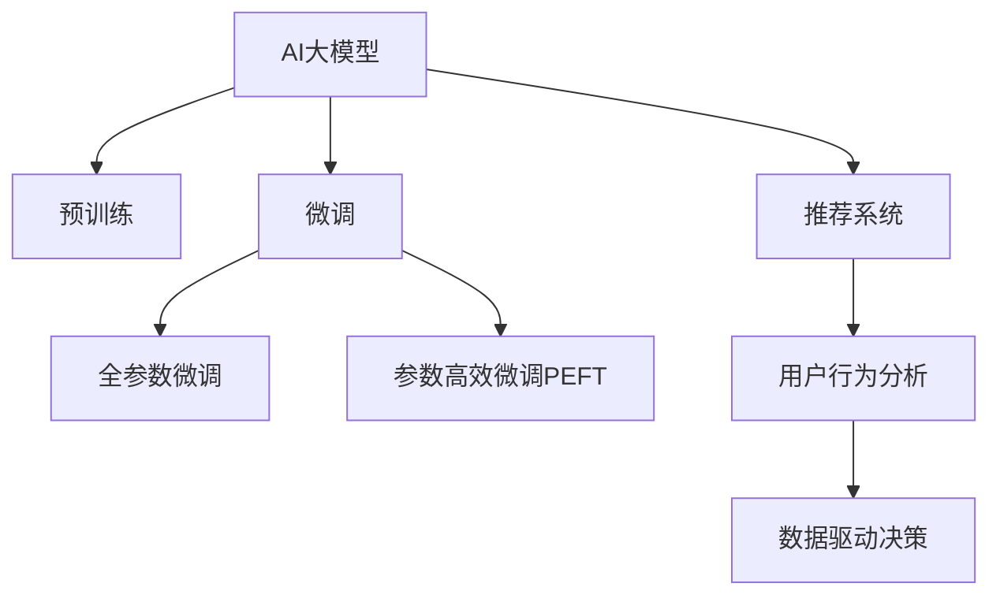

                 

# 电商平台中的AI大模型：从数据到决策

> 关键词：电商平台, AI大模型, 自然语言处理(NLP), 机器学习, 推荐系统, 用户行为分析, 数据驱动决策

## 1. 背景介绍

### 1.1 问题由来
在数字化转型的背景下，电商平台正面临激烈的市场竞争和不断变化的消费者需求。如何利用人工智能技术，洞察用户行为，提升推荐系统的个性化和精准度，已成为电商平台提升用户满意度和业务增长的重要课题。传统的推荐系统依赖规则和特征工程，难以全面捕捉用户行为和动态变化的市场趋势。而近年来兴起的AI大模型，则通过深度学习和大数据分析，有望突破这一瓶颈。

### 1.2 问题核心关键点
AI大模型在电商平台中的应用，核心在于通过自然语言处理(NLP)、机器学习等技术，从海量用户行为数据中挖掘出有价值的知识，构建个性化的用户画像，并据此进行精准推荐和数据驱动决策。其关键点包括：

- 数据采集与处理：构建高效的数据采集、清洗和标注机制，获取高质量的用户行为数据。
- 预训练与微调：使用预训练大模型作为初始化参数，通过有监督的微调方法，优化模型在特定电商平台任务上的性能。
- 推荐系统构建：利用微调后的模型，构建个性化的推荐算法，提升用户体验和平台转化率。
- 用户行为分析：通过分析用户行为数据，理解用户偏好和需求，制定有效的市场策略。
- 数据驱动决策：基于用户行为数据和推荐结果，实时调整平台运营策略，提高决策的精准度和效率。

### 1.3 问题研究意义
AI大模型在电商平台中的应用，将对用户购物体验、平台运营效率和业务增长产生深远影响：

1. **提升用户体验**：通过精准推荐和个性化定制，满足用户个性化需求，提升购物满意度。
2. **优化运营效率**：利用AI技术自动化分析用户行为数据，降低运营成本，提高决策速度。
3. **驱动业务增长**：借助智能推荐和数据驱动决策，增强平台竞争力，吸引更多用户和增加交易量。
4. **推动技术创新**：驱动NLP、推荐系统等前沿技术在电商平台的应用，促进技术进步。
5. **赋能行业升级**：将AI技术广泛应用于零售、物流、金融等多个领域，推动传统行业的数字化转型。

## 2. 核心概念与联系

### 2.1 核心概念概述

为更好地理解AI大模型在电商平台中的应用，本节将介绍几个密切相关的核心概念：

- **AI大模型(AI Large Model)**：基于深度学习和大数据分析，通过大规模无标签数据进行预训练，学习通用语言表示，具备强大的自然语言理解和生成能力。
- **预训练(Pre-training)**：指在大规模无标签文本数据上，通过自监督学习任务训练通用语言模型的过程。常见的预训练任务包括言语建模、掩码语言模型等。
- **微调(Fine-tuning)**：指在预训练模型的基础上，使用有标签的数据集进行有监督学习，优化模型在特定任务上的性能。
- **推荐系统(Recommendation System)**：通过分析和理解用户行为和偏好，为用户推荐感兴趣的商品和服务。
- **用户行为分析(User Behavior Analysis)**：利用AI技术，从用户行为数据中提取有价值的信息，洞察用户需求和行为规律。
- **数据驱动决策(Data-driven Decision Making)**：基于数据分析和AI模型，进行智能决策，优化运营策略和业务流程。

这些核心概念之间的逻辑关系可以通过以下Mermaid流程图来展示：



这个流程图展示了大模型在电商平台中的应用框架，其中：

1. AI大模型通过预训练获得基础能力。
2. 微调是对预训练模型进行任务特定的优化，可以分为全参数微调和参数高效微调（PEFT）。
3. 推荐系统利用微调后的模型进行个性化推荐。
4. 用户行为分析通过分析用户数据，洞察用户需求。
5. 数据驱动决策基于用户行为数据和推荐结果，进行智能决策。

这些概念共同构成了AI大模型在电商平台中的应用框架，使其能够高效地从数据中提取知识，优化推荐和决策流程。

## 3. 核心算法原理 & 具体操作步骤
### 3.1 算法原理概述

在电商平台中，AI大模型主要通过自然语言处理(NLP)和机器学习技术，从用户行为数据中挖掘知识，构建用户画像，并据此进行精准推荐和数据驱动决策。其核心算法原理包括：

- **预训练**：使用大规模无标签文本数据对大模型进行预训练，学习通用的语言表示。
- **微调**：在预训练模型的基础上，使用有标签的数据集进行有监督学习，优化模型在电商平台特定任务上的性能。
- **推荐系统**：利用微调后的模型，构建推荐算法，根据用户行为数据生成个性化推荐结果。
- **用户行为分析**：从用户行为数据中提取特征，分析用户兴趣和行为模式。
- **数据驱动决策**：基于用户行为数据和推荐结果，实时调整平台运营策略，提高决策的精准度和效率。

### 3.2 算法步骤详解

AI大模型在电商平台中的应用一般包括以下几个关键步骤：

**Step 1: 数据采集与处理**
- 设计数据采集方案，从电商平台获取用户行为数据。
- 清洗数据，去除噪声和无关信息。
- 数据标注，为推荐任务生成监督信号。

**Step 2: 预训练与微调**
- 选择合适的预训练语言模型，如BERT、GPT-2等，进行预训练。
- 使用预训练模型作为初始化参数，对推荐系统任务进行微调。
- 选择优化器、学习率、批大小等参数，进行模型训练。

**Step 3: 推荐系统构建**
- 设计推荐算法，如协同过滤、内容推荐等。
- 利用微调后的模型生成推荐结果。
- 评估推荐算法的效果，进行模型调优。

**Step 4: 用户行为分析**
- 收集用户行为数据，如浏览历史、购买记录、评价反馈等。
- 使用NLP技术，从文本数据中提取用户兴趣和行为模式。
- 进行用户画像构建和行为分析，为推荐和决策提供依据。

**Step 5: 数据驱动决策**
- 根据用户画像和行为分析结果，制定市场策略和运营方案。
- 实时监控平台运营效果，调整策略。
- 利用AI模型进行智能决策，优化业务流程。

### 3.3 算法优缺点

使用AI大模型进行电商平台推荐和决策，具有以下优点：

- **高效性**：预训练大模型具备强大的数据处理能力，能够快速从大量数据中提取知识。
- **精准性**：通过微调和大模型，推荐系统能够更加精准地匹配用户需求，提高转化率。
- **灵活性**：AI大模型可以适应多种推荐任务和决策场景，灵活应用。
- **可解释性**：通过用户行为分析，可以洞察用户需求，增强推荐和决策的透明度。

同时，该方法也存在一定的局限性：

- **数据质量依赖**：推荐和决策的效果很大程度上取决于数据的质量和数量，获取高质量数据成本较高。
- **模型复杂性**：预训练大模型参数众多，模型训练和推理耗时较长。
- **对抗性风险**：AI模型可能被恶意用户攻击，存在数据安全和隐私风险。
- **公平性问题**：大模型可能学习到用户偏见，导致推荐和决策结果的不公平。

尽管存在这些局限性，但AI大模型在电商平台中的应用已展现出巨大潜力，成为推动平台智能化升级的重要技术手段。

### 3.4 算法应用领域

AI大模型在电商平台中的应用已经涵盖了推荐系统、用户行为分析、数据驱动决策等多个领域，具体包括：

- **推荐系统**：利用用户行为数据，生成个性化推荐结果，提高用户购物体验。
- **用户画像**：构建用户画像，了解用户兴趣和行为模式，制定精准的市场策略。
- **智能客服**：利用自然语言处理技术，提供智能客服，提升客户满意度。
- **价格优化**：基于用户行为数据和市场趋势，进行价格动态调整，提升销量。
- **库存管理**：通过预测用户需求，优化库存管理，减少缺货和库存积压。
- **风险控制**：利用用户行为数据，进行欺诈检测和风险预警，保障交易安全。

除了上述这些经典应用外，AI大模型还被创新性地应用于供应链管理、物流优化、个性化营销等领域，为电商平台带来了全新的运营模式和技术突破。

## 4. 数学模型和公式 & 详细讲解 & 举例说明

### 4.1 数学模型构建

在电商平台中，AI大模型主要用于推荐系统和用户行为分析。以推荐系统为例，其核心任务是预测用户对商品感兴趣的概率，可以使用伯努利分布来建模：

设用户对商品 $i$ 感兴趣的概率为 $p_i$，则推荐系统的目标是最小化预测误差，即：

$$
\min_{p_i} \frac{1}{N} \sum_{i=1}^N \ell(p_i, y_i)
$$

其中 $y_i$ 为实际用户行为，$\ell$ 为损失函数，如二分类交叉熵。

### 4.2 公式推导过程

以协同过滤推荐算法为例，其基本思想是通过分析用户和商品的历史互动数据，预测用户对新商品感兴趣的概率。具体步骤如下：

1. 计算用户 $u$ 对商品 $i$ 的协同过滤评分 $p_{ui}$：
$$
p_{ui} = \mathbf{u}^T \mathbf{v}_i
$$
其中 $\mathbf{u}$ 为用户 $u$ 的特征向量，$\mathbf{v}_i$ 为商品 $i$ 的特征向量。

2. 将协同过滤评分作为预测结果 $p_i$：
$$
p_i = \sum_{u=1}^U \alpha_u p_{ui}
$$
其中 $\alpha_u$ 为用户权重。

3. 利用伯努利分布对预测结果进行二分类：
$$
y_i \sim \text{Bernoulli}(p_i)
$$

将上述公式代入推荐系统目标函数，得：

$$
\min_{p_i} \frac{1}{N} \sum_{i=1}^N \ell(y_i, \text{Bernoulli}(p_i))
$$

其中 $\ell$ 为二分类交叉熵损失函数。

### 4.3 案例分析与讲解

以亚马逊的推荐系统为例，其核心在于利用用户的浏览和购买数据，构建用户画像，从而进行精准推荐。具体步骤如下：

1. 数据采集：从亚马逊的电商平台上获取用户的浏览历史、购买记录、评价反馈等数据。

2. 数据预处理：对原始数据进行清洗、去重和格式转换，生成结构化的推荐数据集。

3. 预训练：使用大规模无标签文本数据对BERT模型进行预训练，学习通用的语言表示。

4. 微调：在预训练模型的基础上，使用亚马逊的标注数据集进行微调，优化模型在推荐任务上的性能。

5. 推荐系统构建：利用微调后的BERT模型，构建协同过滤推荐算法，生成个性化推荐结果。

6. 用户行为分析：从用户的浏览和购买数据中提取特征，构建用户画像，洞察用户兴趣和行为模式。

7. 数据驱动决策：根据用户画像和行为分析结果，制定市场策略和运营方案，优化推荐和决策流程。

## 5. 项目实践：代码实例和详细解释说明

### 5.1 开发环境搭建

在进行推荐系统开发前，我们需要准备好开发环境。以下是使用Python进行PyTorch开发的环境配置流程：

1. 安装Anaconda：从官网下载并安装Anaconda，用于创建独立的Python环境。

2. 创建并激活虚拟环境：
```bash
conda create -n pytorch-env python=3.8 
conda activate pytorch-env
```

3. 安装PyTorch：根据CUDA版本，从官网获取对应的安装命令。例如：
```bash
conda install pytorch torchvision torchaudio cudatoolkit=11.1 -c pytorch -c conda-forge
```

4. 安装Transformers库：
```bash
pip install transformers
```

5. 安装各类工具包：
```bash
pip install numpy pandas scikit-learn matplotlib tqdm jupyter notebook ipython
```

完成上述步骤后，即可在`pytorch-env`环境中开始推荐系统实践。

### 5.2 源代码详细实现

下面我们以协同过滤推荐系统为例，给出使用Transformers库对BERT模型进行推荐开发的PyTorch代码实现。

首先，定义推荐任务的数据处理函数：

```python
from transformers import BertTokenizer
from torch.utils.data import Dataset
import torch

class RecommendationDataset(Dataset):
    def __init__(self, user_item_ratings, user_ids, item_ids, tokenizer, max_len=128):
        self.user_item_ratings = user_item_ratings
        self.user_ids = user_ids
        self.item_ids = item_ids
        self.tokenizer = tokenizer
        self.max_len = max_len
        
    def __len__(self):
        return len(self.user_item_ratings)
    
    def __getitem__(self, item):
        user_id = self.user_ids[item]
        item_id = self.item_ids[item]
        rating = self.user_item_ratings[item]
        
        user_input = [f"User {user_id} has rated item {item_id} as {rating}."]
        item_input = [f"Item {item_id} is rated as {rating}."]
        
        user_text = ' '.join(user_input)
        item_text = ' '.join(item_input)
        
        encoding = self.tokenizer(user_text, return_tensors='pt', max_length=self.max_len, padding='max_length', truncation=True)
        input_ids = encoding['input_ids'][0]
        attention_mask = encoding['attention_mask'][0]
        
        item_input_ids = [item_id]
        item_input_attention_mask = [1]
        
        item_input = [f"Item {item_id} is rated as {rating}."]
        item_text = ' '.join(item_input)
        
        item_encoding = self.tokenizer(item_text, return_tensors='pt', max_length=self.max_len, padding='max_length', truncation=True)
        item_input_ids = item_encoding['input_ids'][0]
        item_attention_mask = item_encoding['attention_mask'][0]
        
        return {'input_ids': input_ids, 
                'attention_mask': attention_mask,
                'item_input_ids': item_input_ids,
                'item_attention_mask': item_attention_mask}
```

然后，定义模型和优化器：

```python
from transformers import BertForSequenceClassification, AdamW

model = BertForSequenceClassification.from_pretrained('bert-base-cased', num_labels=2)

optimizer = AdamW(model.parameters(), lr=2e-5)
```

接着，定义训练和评估函数：

```python
from torch.utils.data import DataLoader
from tqdm import tqdm
from sklearn.metrics import precision_recall_fscore_support

device = torch.device('cuda') if torch.cuda.is_available() else torch.device('cpu')
model.to(device)

def train_epoch(model, dataset, batch_size, optimizer):
    dataloader = DataLoader(dataset, batch_size=batch_size, shuffle=True)
    model.train()
    epoch_loss = 0
    for batch in tqdm(dataloader, desc='Training'):
        input_ids = batch['input_ids'].to(device)
        attention_mask = batch['attention_mask'].to(device)
        item_input_ids = batch['item_input_ids'].to(device)
        item_attention_mask = batch['item_attention_mask'].to(device)
        model.zero_grad()
        outputs = model(input_ids, attention_mask=attention_mask, labels=torch.tensor(1))
        loss = outputs.loss
        epoch_loss += loss.item()
        loss.backward()
        optimizer.step()
    return epoch_loss / len(dataloader)

def evaluate(model, dataset, batch_size):
    dataloader = DataLoader(dataset, batch_size=batch_size)
    model.eval()
    preds, labels = [], []
    with torch.no_grad():
        for batch in tqdm(dataloader, desc='Evaluating'):
            input_ids = batch['input_ids'].to(device)
            attention_mask = batch['attention_mask'].to(device)
            item_input_ids = batch['item_input_ids'].to(device)
            item_attention_mask = batch['item_attention_mask'].to(device)
            batch_labels = batch['labels']
            outputs = model(input_ids, attention_mask=attention_mask, labels=batch_labels)
            batch_preds = outputs.logits.argmax(dim=2).to('cpu').tolist()
            batch_labels = batch_labels.to('cpu').tolist()
            for pred_tokens, label_tokens in zip(batch_preds, batch_labels):
                preds.append(pred_tokens[:len(label_tokens)])
                labels.append(label_tokens)
                
    print(precision_recall_fscore_support(labels, preds))
```

最后，启动训练流程并在测试集上评估：

```python
epochs = 5
batch_size = 16

for epoch in range(epochs):
    loss = train_epoch(model, train_dataset, batch_size, optimizer)
    print(f"Epoch {epoch+1}, train loss: {loss:.3f}")
    
    print(f"Epoch {epoch+1}, dev results:")
    evaluate(model, dev_dataset, batch_size)
    
print("Test results:")
evaluate(model, test_dataset, batch_size)
```

以上就是使用PyTorch对BERT进行协同过滤推荐系统的完整代码实现。可以看到，得益于Transformers库的强大封装，我们可以用相对简洁的代码完成BERT模型的加载和推荐系统开发。

### 5.3 代码解读与分析

让我们再详细解读一下关键代码的实现细节：

**RecommendationDataset类**：
- `__init__`方法：初始化用户行为数据、用户id、商品id等关键组件。
- `__len__`方法：返回数据集的样本数量。
- `__getitem__`方法：对单个样本进行处理，将文本输入编码为token ids，将商品id和评分输入生成列表，并进行定长padding，最终返回模型所需的输入。

**训练和评估函数**：
- 使用PyTorch的DataLoader对数据集进行批次化加载，供模型训练和推理使用。
- 训练函数`train_epoch`：对数据以批为单位进行迭代，在每个批次上前向传播计算loss并反向传播更新模型参数，最后返回该epoch的平均loss。
- 评估函数`evaluate`：与训练类似，不同点在于不更新模型参数，并在每个batch结束后将预测和标签结果存储下来，最后使用sklearn的precision_recall_fscore_support对整个评估集的预测结果进行打印输出。

**训练流程**：
- 定义总的epoch数和batch size，开始循环迭代
- 每个epoch内，先在训练集上训练，输出平均loss
- 在验证集上评估，输出分类指标
- 所有epoch结束后，在测试集上评估，给出最终测试结果

可以看到，PyTorch配合Transformers库使得BERT推荐系统的代码实现变得简洁高效。开发者可以将更多精力放在数据处理、模型改进等高层逻辑上，而不必过多关注底层的实现细节。

当然，工业级的系统实现还需考虑更多因素，如模型的保存和部署、超参数的自动搜索、更灵活的任务适配层等。但核心的微调范式基本与此类似。

## 6. 实际应用场景
### 6.1 智能推荐

智能推荐系统是电商平台的核心功能之一。AI大模型通过微调，能够从用户行为数据中挖掘出更丰富的知识，构建更加个性化的推荐结果。

以亚马逊的推荐系统为例，其基本原理是利用用户的浏览和购买数据，构建用户画像，然后通过协同过滤算法，预测用户对商品感兴趣的概率。微调后的BERT模型作为特征提取器，能够高效地从文本数据中提取用户行为特征，提升推荐算法的精度。

### 6.2 用户行为分析

用户行为分析是电商平台优化运营策略的重要依据。AI大模型能够从用户行为数据中提取有价值的信息，洞察用户需求和行为模式。

以京东的用户行为分析为例，其核心在于利用用户的浏览历史、购买记录和评价反馈，构建用户画像，然后通过情感分析等技术，理解用户对商品的情感倾向和需求。微调后的BERT模型能够从用户评论中提取情感信息，帮助企业制定更精准的市场策略。

### 6.3 实时定价

实时定价是电商平台提高转化率和盈利能力的重要手段。AI大模型通过微调，能够从用户行为数据中预测市场需求，进行动态价格调整。

以携程的实时定价系统为例，其基本原理是利用用户的预订数据，构建用户画像，然后通过时间序列分析等技术，预测未来的订单量。微调后的BERT模型作为特征提取器，能够高效地从文本数据中提取订单特征，提高价格预测的准确性。

### 6.4 未来应用展望

随着AI大模型的不断进步，其在电商平台中的应用将变得更加广泛和深入。未来，AI大模型有望在以下几个方面实现新的突破：

1. **个性化推荐**：利用多模态数据融合，构建更加精准的个性化推荐系统，提升用户购物体验。
2. **智能客服**：结合自然语言处理和大模型，提供更加智能的客服服务，提升客户满意度。
3. **智能物流**：利用AI技术，优化库存管理和物流配送，提高供应链效率。
4. **数据驱动决策**：通过深度学习和大数据分析，制定更科学的市场策略和运营方案。
5. **隐私保护**：采用差分隐私等技术，保护用户数据隐私，增强平台安全性。
6. **多领域应用**：将AI大模型应用于金融、医疗、教育等多个领域，推动技术创新。

## 7. 工具和资源推荐
### 7.1 学习资源推荐

为了帮助开发者系统掌握AI大模型在电商平台中的应用，这里推荐一些优质的学习资源：

1. 《深度学习理论与实践》系列博文：深度学习领域专家撰写，涵盖深度学习、NLP、推荐系统等核心技术。

2. CS244《深度学习基础》课程：斯坦福大学开设的深度学习入门课程，内容系统全面，适合初学者入门。

3. 《Python深度学习》书籍：全面介绍Python深度学习框架和算法，包含推荐系统、用户行为分析等应用案例。

4. TensorFlow官方文档：TensorFlow深度学习框架的官方文档，提供丰富的API和样例代码。

5. HuggingFace官方文档：Transformers库的官方文档，提供详细的预训练模型介绍和微调示例。

6. Kaggle：数据科学竞赛平台，提供大量数据集和模型代码，适合实战练习。

通过对这些资源的学习实践，相信你一定能够快速掌握AI大模型在电商平台中的应用，并用于解决实际的推荐和决策问题。

### 7.2 开发工具推荐

高效的开发离不开优秀的工具支持。以下是几款用于AI大模型推荐系统开发的常用工具：

1. PyTorch：基于Python的开源深度学习框架，灵活动态的计算图，适合快速迭代研究。大部分预训练语言模型都有PyTorch版本的实现。

2. TensorFlow：由Google主导开发的开源深度学习框架，生产部署方便，适合大规模工程应用。同样有丰富的预训练语言模型资源。

3. Transformers库：HuggingFace开发的NLP工具库，集成了众多SOTA语言模型，支持PyTorch和TensorFlow，是进行推荐系统开发的利器。

4. Weights & Biases：模型训练的实验跟踪工具，可以记录和可视化模型训练过程中的各项指标，方便对比和调优。与主流深度学习框架无缝集成。

5. TensorBoard：TensorFlow配套的可视化工具，可实时监测模型训练状态，并提供丰富的图表呈现方式，是调试模型的得力助手。

6. Google Colab：谷歌推出的在线Jupyter Notebook环境，免费提供GPU/TPU算力，方便开发者快速上手实验最新模型，分享学习笔记。

合理利用这些工具，可以显著提升AI大模型推荐系统的开发效率，加快创新迭代的步伐。

### 7.3 相关论文推荐

AI大模型在电商平台中的应用源于学界的持续研究。以下是几篇奠基性的相关论文，推荐阅读：

1. Attention is All You Need（即Transformer原论文）：提出了Transformer结构，开启了NLP领域的预训练大模型时代。

2. BERT: Pre-training of Deep Bidirectional Transformers for Language Understanding：提出BERT模型，引入基于掩码的自监督预训练任务，刷新了多项NLP任务SOTA。

3. Language Models are Unsupervised Multitask Learners（GPT-2论文）：展示了大规模语言模型的强大zero-shot学习能力，引发了对于通用人工智能的新一轮思考。

4. Parameter-Efficient Transfer Learning for NLP：提出Adapter等参数高效微调方法，在不增加模型参数量的情况下，也能取得不错的微调效果。

5. Adaptative LRA: Adaptive Low-Rank Adaptation for Parameter-Efficient Fine-Tuning：使用自适应低秩适应的微调方法，在参数效率和精度之间取得了新的平衡。

这些论文代表了大语言模型推荐系统的发展脉络。通过学习这些前沿成果，可以帮助研究者把握学科前进方向，激发更多的创新灵感。

## 8. 总结：未来发展趋势与挑战

### 8.1 总结

本文对AI大模型在电商平台中的应用进行了全面系统的介绍。首先阐述了AI大模型的背景和重要性，明确了其在电商平台推荐和决策中的应用价值。其次，从原理到实践，详细讲解了预训练与微调、推荐系统构建、用户行为分析等关键环节，给出了推荐系统开发的完整代码实例。同时，本文还探讨了AI大模型在电商平台的广泛应用场景，展示了其在推荐、定价、客服等方面的潜力。

通过本文的系统梳理，可以看到，AI大模型在电商平台中的应用，将对用户购物体验、平台运营效率和业务增长产生深远影响。借助AI大模型，电商平台能够从海量数据中挖掘知识，优化推荐和决策流程，提升运营效率和用户满意度。未来，伴随AI大模型的不断进步，其在电商平台中的应用将变得更加广泛和深入，推动电商行业向智能化、个性化方向发展。

### 8.2 未来发展趋势

展望未来，AI大模型在电商平台中的应用将呈现以下几个发展趋势：

1. **多模态融合**：结合文本、图像、视频等多模态数据，构建更加精准的推荐系统，提升用户购物体验。
2. **个性化推荐**：利用用户行为数据和上下文信息，实现更加个性化的推荐，满足用户多样化需求。
3. **智能客服**：结合自然语言处理和大模型，提供更加智能的客服服务，提升客户满意度。
4. **实时定价**：利用AI技术，实现动态价格调整，提高转化率和盈利能力。
5. **数据驱动决策**：通过深度学习和大数据分析，制定更科学的市场策略和运营方案。
6. **隐私保护**：采用差分隐私等技术，保护用户数据隐私，增强平台安全性。
7. **多领域应用**：将AI大模型应用于金融、医疗、教育等多个领域，推动技术创新。

### 8.3 面临的挑战

尽管AI大模型在电商平台中的应用已经取得了显著成果，但在迈向更加智能化、普适化应用的过程中，它仍面临着诸多挑战：

1. **数据质量瓶颈**：推荐和决策的效果很大程度上取决于数据的质量和数量，获取高质量数据成本较高。如何进一步降低数据依赖，提升数据采集和标注效率，将是一大难题。
2. **模型复杂性**：预训练大模型参数众多，模型训练和推理耗时较长。如何优化模型结构和算法，提高计算效率，是未来研究的重要方向。
3. **公平性和偏见**：大模型可能学习到用户偏见，导致推荐和决策结果的不公平。如何消除模型偏见，增强推荐系统的公平性，还需要更多的探索和实践。
4. **对抗性攻击**：AI大模型可能被恶意用户攻击，存在数据安全和隐私风险。如何加强对抗性防御，保护用户数据安全，将是重要的研究方向。
5. **可解释性不足**：AI模型缺乏可解释性，难以解释其内部工作机制和决策逻辑。对于医疗、金融等高风险应用，算法的可解释性和可审计性尤为重要。
6. **计算资源限制**：大规模语言模型训练和推理需要高性能计算资源，如何优化资源使用，提高系统可扩展性，还需要更多的探索。

尽管存在这些挑战，但AI大模型在电商平台中的应用已经展现出巨大潜力，成为推动平台智能化升级的重要技术手段。未来，伴随预训练语言模型和推荐系统的不断演进，相信NLP技术将在更广阔的应用领域大放异彩，深刻影响人类的生产生活方式。

### 8.4 研究展望

面对AI大模型在电商平台中面临的诸多挑战，未来的研究需要在以下几个方面寻求新的突破：

1. **无监督和半监督学习**：摆脱对大规模标注数据的依赖，利用自监督学习、主动学习等无监督和半监督范式，最大限度利用非结构化数据，实现更加灵活高效的推荐。
2. **参数高效和计算高效**：开发更加参数高效的微调方法，如Prefix-Tuning、LoRA等，在固定大部分预训练参数的同时，只更新极少量的任务相关参数。同时优化模型计算图，减少前向传播和反向传播的资源消耗，实现更加轻量级、实时性的部署。
3. **多模态融合**：结合文本、图像、视频等多模态数据，构建更加精准的推荐系统，提升用户购物体验。
4. **公平性和偏见**：在模型训练目标中引入伦理导向的评估指标，过滤和惩罚有偏见、有害的输出倾向。同时加强人工干预和审核，建立模型行为的监管机制，确保输出符合人类价值观和伦理道德。
5. **隐私保护**：采用差分隐私等技术，保护用户数据隐私，增强平台安全性。
6. **知识融合与迁移**：将符号化的先验知识，如知识图谱、逻辑规则等，与神经网络模型进行巧妙融合，引导微调过程学习更准确、合理的语言模型。

这些研究方向的探索，必将引领AI大模型推荐系统技术迈向更高的台阶，为电商平台提供更加智能、高效、安全的推荐和决策服务。面向未来，AI大模型推荐系统还需要与其他人工智能技术进行更深入的融合，如知识表示、因果推理、强化学习等，多路径协同发力，共同推动自然语言理解和智能交互系统的进步。只有勇于创新、敢于突破，才能不断拓展语言模型的边界，让智能技术更好地造福人类社会。

## 9. 附录：常见问题与解答

**Q1：AI大模型在电商平台中的应用是否适用于所有推荐任务？**

A: AI大模型在电商平台中的应用，主要适用于数据量较大的推荐任务。但对于一些数据量较小、特征维度较低的任务，如标签推荐等，微调的效果可能不如传统的协同过滤等算法。

**Q2：如何选择预训练语言模型进行推荐系统微调？**

A: 选择合适的预训练语言模型，需要考虑模型的预训练任务、参数量、计算资源等因素。BERT和GPT-2是常用的预训练语言模型，可以根据具体任务需求进行选择。

**Q3：微调过程中如何优化超参数？**

A: 优化超参数可以使用网格搜索、贝叶斯优化等方法，寻找最佳的模型参数组合。也可以使用自动化调参工具，如Hyperopt、Ray Tune等，快速探索超参数空间。

**Q4：如何处理用户行为数据的不平衡问题？**

A: 用户行为数据的不平衡问题可以通过重采样、生成对抗网络等技术进行处理。此外，可以利用加权损失函数等方法，平衡不同类别样本的损失权重。

**Q5：如何在推荐系统中应用多模态数据融合技术？**

A: 多模态数据融合技术可以将文本、图像、视频等多种数据源的信息融合在一起，提高推荐系统的精准度。具体方法包括特征拼接、注意力机制等。

这些问题的解答，希望能够帮助你更好地理解和应用AI大模型在电商平台中的推荐和决策。

