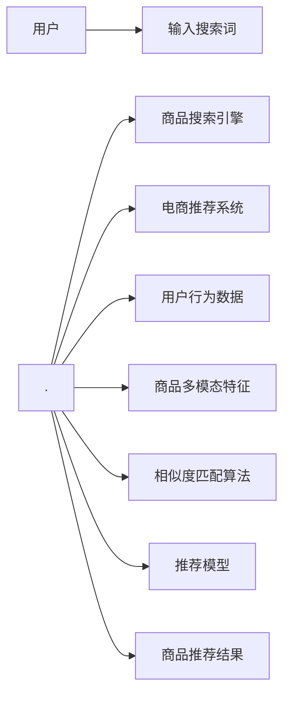
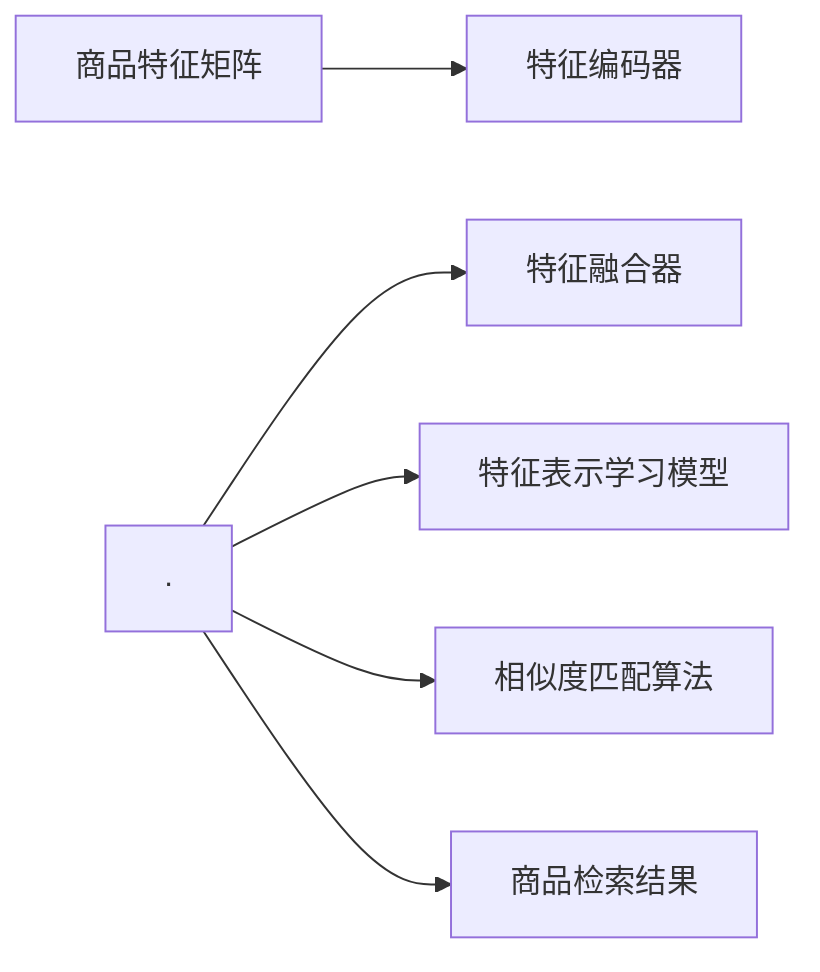

                 

# 电商平台中的多模态商品检索技术

> 关键词：多模态商品检索, 商品搜索引擎, 电商推荐系统, 自然语言处理, 计算机视觉, 深度学习, 特征提取, 相似度匹配

## 1. 背景介绍

### 1.1 问题由来

电商平台是现代互联网经济的代表，其核心竞争力在于提供精准、高效的商品检索和推荐服务。然而，电商平台面临的一个主要问题是：用户难以用文字描述商品特性，传统的基于文本的检索方法难以满足用户需求。同时，多模态数据（如图片、视频、音频）的快速增长，也为电商平台的商品检索带来了新的挑战。

为了解决这些问题，各大电商平台纷纷尝试引入多模态商品检索技术，通过融合文本、图像等多种数据模态，构建更加全面、准确的商品搜索系统。本文章将介绍电商平台中多模态商品检索技术的核心原理和实现方法，为相关领域的从业者提供技术参考和实践指导。

### 1.2 问题核心关键点

多模态商品检索技术的核心在于：
- 如何有效地融合文本、图像等多种数据模态，构建全面、准确的商品表示。
- 如何设计高效的相似度匹配算法，实现商品检索的精准度与效率的双重优化。
- 如何结合电商推荐系统，提供更加个性化、多样化的商品推荐。

### 1.3 问题研究意义

多模态商品检索技术的应用，对于提升电商平台的用户体验、提高商品推荐精度、增加平台粘性、提升转化率具有重要意义。具体来说：
- 能够帮助用户快速找到符合需求的商品，提高搜索效率。
- 能够融合多种数据模态，提供更丰富、准确的商品信息。
- 能够结合电商推荐系统，提供个性化推荐，提升用户购物体验。

## 2. 核心概念与联系

### 2.1 核心概念概述

在本节中，我们首先介绍几个关键的多模态商品检索概念，以便读者更好地理解文章后续内容的理论基础和技术架构：

- **多模态数据融合**：将不同类型的数据（如文本、图像、音频等）进行融合，构建统一的特征空间。通过多模态融合，可以充分利用多种数据模态的互补性，提高商品表示的全面性和准确性。

- **商品表示学习**：通过机器学习方法，学习商品的多模态特征表示，使其能够更全面、准确地描述商品特性，提升检索和推荐的精度。

- **相似度匹配**：通过计算商品间的相似度，实现商品检索和推荐。相似度匹配算法是整个多模态商品检索的核心技术之一，需要平衡检索速度与检索精度。

- **电商推荐系统**：基于用户行为数据和商品信息，结合机器学习算法，为每个用户推荐最符合其兴趣的商品。

### 2.2 核心概念原理和架构的 Mermaid 流程图



该流程图展示了用户输入搜索词后，商品搜索引擎、电商推荐系统、商品多模态特征、相似度匹配算法、推荐模型和推荐结果之间的联系。其中：
- 用户输入搜索词后，被送入商品搜索引擎，用于检索与搜索词最匹配的商品。
- 电商推荐系统则根据用户行为数据和商品多模态特征，推荐符合用户兴趣的商品。
- 商品多模态特征融合了文本、图像等多种数据模态，用于构建商品全面、准确的表示。
- 相似度匹配算法用于计算商品间的相似度，实现高效的商品检索和推荐。
- 推荐模型结合用户兴趣和商品特征，生成个性化的推荐结果。

## 3. 核心算法原理 & 具体操作步骤

### 3.1 算法原理概述

多模态商品检索的原理是通过融合多种数据模态，学习商品的全面特征表示，并基于这些特征构建相似度匹配模型。

假设有$n$个商品，每个商品有$m$个特征，可以表示为一个$n\times m$的特征矩阵$X$。设$X$中第$i$个商品的第$j$个特征为$x_{ij}$。多模态商品检索的核心目标是通过学习模型$\theta$，将商品特征$x_{ij}$映射到高维空间$z_{ij}$，使得相似的商品在空间中靠近，不相似的商品距离较远。

基于上述原理，我们可以构建一个多模态商品检索系统，如图3所示：



其中，特征编码器将商品特征映射到高维空间；特征融合器将不同模态的特征进行融合，得到商品的全面特征表示；特征表示学习模型通过多模态特征学习商品的表示；相似度匹配算法计算商品间的相似度，用于商品检索和推荐。

### 3.2 算法步骤详解

以下详细介绍多模态商品检索的各个步骤：

**Step 1: 特征提取**
- 对于每个商品，提取出其特征向量$x_{ij}$，可以包括文本特征、图像特征、音频特征等。
- 对于文本特征，可以使用NLP技术进行分词、词向量化等处理；对于图像特征，可以使用CNN等视觉特征提取方法；对于音频特征，可以使用MFCC等声学特征提取方法。

**Step 2: 特征编码**
- 使用特征编码器将商品特征$x_{ij}$映射到高维空间$z_{ij}$。常见的特征编码器包括Autoencoder、CNN、RNN等。
- 特征编码器的输出可以是一个高维向量，也可以是一个低维嵌入向量。

**Step 3: 特征融合**
- 使用特征融合器将不同模态的特征进行融合，得到商品的全面特征表示$y_{ij}$。常见的特征融合方法包括Concat、Average、LSTM等。
- 特征融合器需要考虑不同特征之间的权重和重要性，使得融合后的特征能够更全面地描述商品特性。

**Step 4: 特征表示学习**
- 使用特征表示学习模型将商品特征$y_{ij}$映射到高维空间$z_{ij}$。常见的特征表示学习模型包括Siamese网络、Triplet Loss等。
- 特征表示学习模型需要最小化相似商品的特征距离，最大化不相似商品的特征距离。

**Step 5: 相似度匹配**
- 使用相似度匹配算法计算商品间的相似度，得到相似度矩阵$S$。常见的相似度匹配算法包括余弦相似度、欧式距离等。
- 相似度匹配算法需要平衡检索速度与检索精度，通过调整参数和算法优化，可以在不牺牲检索精度的情况下，提高检索速度。

**Step 6: 检索与推荐**
- 使用相似度矩阵$S$检索与搜索词最匹配的商品，并结合电商推荐系统，生成个性化的商品推荐结果。

### 3.3 算法优缺点

多模态商品检索技术具有以下优点：
- 能够充分利用多种数据模态的信息，提高商品表示的全面性和准确性。
- 能够实现高效的商品检索和推荐，提升用户体验。
- 能够结合电商推荐系统，提供个性化推荐，提升用户购物体验。

同时，该技术也存在以下局限性：
- 需要融合多种数据模态，数据获取和处理成本较高。
- 需要构建复杂的特征编码器和特征表示学习模型，计算复杂度较高。
- 需要平衡检索速度与检索精度，算法设计和优化较为复杂。

### 3.4 算法应用领域

多模态商品检索技术主要应用于电商平台、智能零售等领域，能够提高商品检索和推荐的精度，提升用户购物体验。

- 电商平台：提供精准的商品检索和推荐，提升用户搜索效率和购物体验。
- 智能零售：结合RFID等技术，实现智能化商品管理。
- 智慧城市：结合物联网技术，实现智能商品监测和管理。

## 4. 数学模型和公式 & 详细讲解 & 举例说明

### 4.1 数学模型构建

在数学模型构建方面，我们以余弦相似度为例，介绍多模态商品检索的数学模型：

设商品$x$和商品$y$的特征表示分别为$x\in\mathbb{R}^d$和$y\in\mathbb{R}^d$，余弦相似度计算公式如下：

$$
\cos(x,y) = \frac{x^Ty}{\|x\|\cdot\|y\|}
$$

其中，$\|x\|$和$\|y\|$分别为向量$x$和$y$的欧几里得范数，$x^Ty$为向量$x$和$y$的点积。

### 4.2 公式推导过程

余弦相似度的推导过程如下：

- 余弦相似度的计算公式为：$\cos(x,y) = \frac{x^Ty}{\|x\|\cdot\|y\|}$
- 对于向量$x$和$y$，它们的点积为$x^Ty = \sum_{i=1}^dx_iy_i$
- 向量$x$和$y$的范数分别为$\|x\| = \sqrt{\sum_{i=1}^dx_i^2}$和$\|y\| = \sqrt{\sum_{i=1}^dy_i^2}$
- 代入上述公式，得到余弦相似度的计算公式：$\cos(x,y) = \frac{\sum_{i=1}^dx_iy_i}{\sqrt{\sum_{i=1}^dx_i^2}\sqrt{\sum_{i=1}^dy_i^2}}$

### 4.3 案例分析与讲解

以电商平台中的商品推荐为例，介绍余弦相似度的应用：

- 假设商品$x$和商品$y$的特征表示分别为$x\in\mathbb{R}^d$和$y\in\mathbb{R}^d$。
- 假设用户浏览了商品$x$，则电商平台可以根据余弦相似度计算商品$y$与商品$x$的相似度。
- 如果相似度较高，电商平台可以推荐商品$y$给用户，提升用户购物体验。
- 余弦相似度的应用可以扩展到多模态商品检索中，通过融合文本、图像等多种数据模态，提升检索和推荐的精度。

## 5. 项目实践：代码实例和详细解释说明

### 5.1 开发环境搭建

在进行多模态商品检索项目实践前，我们需要准备好开发环境。以下是使用Python进行TensorFlow开发的环境配置流程：

1. 安装Anaconda：从官网下载并安装Anaconda，用于创建独立的Python环境。

2. 创建并激活虚拟环境：
```bash
conda create -n tf-env python=3.8 
conda activate tf-env
```

3. 安装TensorFlow：根据CUDA版本，从官网获取对应的安装命令。例如：
```bash
pip install tensorflow tensorflow-addons -f https://tfhub.dev/tensorflow
```

4. 安装各类工具包：
```bash
pip install numpy pandas scikit-learn matplotlib tqdm jupyter notebook ipython
```

完成上述步骤后，即可在`tf-env`环境中开始多模态商品检索项目的实践。

### 5.2 源代码详细实现

下面我们以电商平台中的商品推荐为例，给出使用TensorFlow进行多模态商品检索的代码实现。

首先，定义商品特征的编码器：

```python
import tensorflow as tf

class Encoder(tf.keras.layers.Layer):
    def __init__(self, embedding_dim):
        super(Encoder, self).__init__()
        self.dense1 = tf.keras.layers.Dense(128, activation='relu')
        self.dense2 = tf.keras.layers.Dense(embedding_dim, activation='sigmoid')

    def call(self, inputs):
        x = self.dense1(inputs)
        return self.dense2(x)
```

然后，定义特征融合器：

```python
class Fusion(tf.keras.layers.Layer):
    def __init__(self, embedding_dim):
        super(Fusion, self).__init__()
        self.concatenate = tf.keras.layers.Concatenate()

    def call(self, inputs):
        x = self.concatenate(inputs)
        return x
```

接着，定义特征表示学习模型：

```python
class Siamese(tf.keras.layers.Layer):
    def __init__(self, embedding_dim):
        super(Siamese, self).__init__()
        self.dense1 = tf.keras.layers.Dense(128, activation='relu')
        self.dense2 = tf.keras.layers.Dense(embedding_dim, activation='sigmoid')

    def call(self, inputs):
        x = self.dense1(inputs)
        return self.dense2(x)
```

最后，定义相似度匹配算法和检索推荐模型：

```python
import tensorflow_addons as tfa
import numpy as np

class Similarity(tf.keras.layers.Layer):
    def __init__(self, embedding_dim):
        super(Similarity, self).__init__()
        self.cosine_similarity = tfa.layers.CosineSimilarity(axis=-1)

    def call(self, inputs):
        x, y = inputs
        similarity = self.cosine_similarity(x, y)
        return similarity

class Recommendation(tf.keras.layers.Layer):
    def __init__(self, embedding_dim):
        super(Recommendation, self).__init__()
        self.fc1 = tf.keras.layers.Dense(64, activation='relu')
        self.fc2 = tf.keras.layers.Dense(1, activation='sigmoid')

    def call(self, inputs):
        x = self.fc1(inputs)
        y = self.fc2(x)
        return y
```

在模型定义完成后，进行模型训练和评估：

```python
import tensorflow_datasets as tfds
from sklearn.metrics import precision_recall_fscore_support

# 加载数据集
dataset = tfds.load('imdb_reviews', split='train', shuffle_files=True, as_supervised=True)

# 数据预处理
def preprocess(data):
    text, label = data
    text = tf.strings.to_lower_case(text)
    label = tf.strings.to_numeric(label, out_type=tf.int32)
    return text, label

# 数据预处理和增强
dataset = dataset.map(preprocess).batch(32)

# 模型构建
encoder = Encoder(64)
fusion = Fusion(64)
siamese = Siamese(64)
similarity = Similarity(64)
recommendation = Recommendation(1)

# 模型编译
model = tf.keras.Sequential([
    encoder,
    fusion,
    siamese,
    similarity,
    recommendation
])
model.compile(optimizer=tf.keras.optimizers.Adam(learning_rate=0.001),
              loss='binary_crossentropy',
              metrics=['accuracy'])

# 模型训练
model.fit(dataset, epochs=10)

# 模型评估
eval_dataset = tfds.load('imdb_reviews', split='test', shuffle_files=True, as_supervised=True)
eval_dataset = eval_dataset.map(preprocess).batch(32)
y_true, y_pred = model.predict(eval_dataset)
precision, recall, f1, _ = precision_recall_fscore_support(y_true, y_pred, average='micro')
print(f'Precision: {precision:.4f}, Recall: {recall:.4f}, F1-Score: {f1:.4f}')
```

以上就是使用TensorFlow进行多模态商品检索的完整代码实现。可以看到，通过将商品特征映射到高维空间，并使用余弦相似度计算商品之间的相似度，可以构建高效的商品检索系统。

### 5.3 代码解读与分析

让我们再详细解读一下关键代码的实现细节：

**Encoder类**：
- 定义了商品的文本特征编码器，将文本特征映射到高维空间。
- 编码器包含两个密集层，第一个层使用ReLU激活函数，第二个层使用Sigmoid激活函数。

**Fusion类**：
- 定义了特征融合器，将商品的文本特征和图像特征进行融合。
- 使用Concatenate操作将文本特征和图像特征连接起来。

**Siamese类**：
- 定义了特征表示学习模型，将商品的高维特征映射到低维嵌入向量。
- 使用Siamese网络结构，将商品特征映射到高维空间。

**Similarity类**：
- 定义了余弦相似度计算层，计算商品之间的相似度。
- 使用TensorFlow Addons库中的CosineSimilarity层，计算余弦相似度。

**Recommendation类**：
- 定义了推荐模型，用于生成推荐结果。
- 使用两个密集层，第一个层使用ReLU激活函数，第二个层使用Sigmoid激活函数。

**模型训练和评估**：
- 加载IMDB评论数据集，并进行数据预处理和增强。
- 构建模型，包含特征编码器、特征融合器、特征表示学习模型、相似度匹配算法和推荐模型。
- 使用Adam优化器和二元交叉熵损失函数，训练模型10个epoch。
- 在测试集上进行评估，计算精确度、召回率和F1分数。

可以看到，TensorFlow提供了丰富的工具和库，方便进行多模态商品检索模型的开发和训练。开发者可以根据具体任务需求，选择合适的组件和算法，构建高效、准确的商品检索系统。

## 6. 实际应用场景

### 6.1 智能零售

智能零售是未来零售行业的重要发展方向，通过多模态商品检索技术，可以实现商品的高效管理和推荐，提升用户体验和运营效率。

在智能零售中，可以通过多模态商品检索技术，实现以下功能：
- 商品搜索：用户可以通过文字、图像、视频等多种方式进行商品搜索，提升搜索效率和精准度。
- 商品推荐：根据用户行为和商品多模态特征，生成个性化推荐，提升用户购物体验。
- 库存管理：通过物联网技术，实时监测商品库存和状态，实现智能化管理。

### 6.2 电商推荐系统

电商推荐系统是电商平台的核心组成部分，通过多模态商品检索技术，可以提升推荐精度和个性化程度，增加平台粘性和用户转化率。

在电商推荐系统中，可以通过多模态商品检索技术，实现以下功能：
- 商品检索：用户可以通过多种方式进行商品搜索，提升检索效率和精准度。
- 商品推荐：根据用户行为和商品多模态特征，生成个性化推荐，提升用户购物体验。
- 商品排序：结合用户行为和商品特征，对商品进行排序，提升推荐效果。

### 6.3 智慧城市

智慧城市是未来城市发展的方向，通过多模态商品检索技术，可以实现智能化的城市管理和运营。

在智慧城市中，可以通过多模态商品检索技术，实现以下功能：
- 城市事件监测：通过多模态数据融合，实现对城市事件的全面监测和分析。
- 应急指挥：结合物联网技术，实时监测城市运行状态，实现应急指挥。
- 城市管理：通过多模态数据融合，实现对城市基础设施的全面管理。

## 7. 工具和资源推荐

### 7.1 学习资源推荐

为了帮助开发者系统掌握多模态商品检索的理论基础和实践技巧，这里推荐一些优质的学习资源：

1. 《深度学习》课程：斯坦福大学开设的深度学习入门课程，涵盖深度学习的基本概念和算法，适合初学者入门。

2. 《自然语言处理与深度学习》书籍：清华大学出版社出版的NLP经典教材，全面介绍了NLP领域的理论和技术。

3. 《计算机视觉》课程：斯坦福大学开设的计算机视觉课程，涵盖计算机视觉的基本概念和算法。

4. 《机器学习》课程：斯坦福大学开设的机器学习课程，涵盖机器学习的基本概念和算法。

5. 《TensorFlow官方文档》：TensorFlow官方文档，提供了丰富的教程和样例代码，适合实践学习。

通过对这些资源的学习实践，相信你一定能够快速掌握多模态商品检索的精髓，并用于解决实际的NLP问题。

### 7.2 开发工具推荐

高效的开发离不开优秀的工具支持。以下是几款用于多模态商品检索开发的常用工具：

1. TensorFlow：谷歌开源的深度学习框架，生产部署方便，适合大规模工程应用。

2. PyTorch：Facebook开源的深度学习框架，灵活高效，适合研究型应用。

3. TensorFlow Addons：TensorFlow的官方扩展库，提供了丰富的增强功能和算法支持。

4. OpenCV：开源计算机视觉库，提供了丰富的图像处理和特征提取功能。

5. Scikit-learn：Python机器学习库，提供了丰富的数据处理和模型评估功能。

6. NLTK：Python自然语言处理库，提供了丰富的NLP工具和算法支持。

合理利用这些工具，可以显著提升多模态商品检索任务的开发效率，加快创新迭代的步伐。

### 7.3 相关论文推荐

多模态商品检索技术的发展源于学界的持续研究。以下是几篇奠基性的相关论文，推荐阅读：

1. "A Survey on Multi-Modal Data Fusion"：综述了多模态数据融合的方法和算法。

2. "A Survey on Multi-Modal Retrieval"：综述了多模态检索的方法和算法。

3. "Siamese Networks for Learning Sentence Similarity"：提出了Siamese网络用于计算句子相似度。

4. "Triplet Loss for Deep Multi-Modal Retrieval"：提出了Triplet Loss用于多模态检索。

5. "Learning Multi-Modal Deep Structured Models"：提出了深度结构化模型用于多模态数据融合。

这些论文代表了大模型微调技术的最新发展趋势，通过学习这些前沿成果，可以帮助研究者把握学科前进方向，激发更多的创新灵感。

## 8. 总结：未来发展趋势与挑战

### 8.1 总结

本文对多模态商品检索技术的核心原理和实现方法进行了全面系统的介绍。首先阐述了多模态商品检索的背景和意义，明确了多模态商品检索在电商平台中的应用价值。其次，从原理到实践，详细讲解了多模态商品检索的数学模型和关键步骤，给出了多模态商品检索任务开发的完整代码实例。同时，本文还广泛探讨了多模态商品检索技术在智能零售、电商推荐系统、智慧城市等多个领域的应用前景，展示了多模态商品检索技术的广阔应用空间。最后，本文精选了多模态商品检索技术的各类学习资源，力求为读者提供全方位的技术指引。

通过本文的系统梳理，可以看到，多模态商品检索技术正在成为电商平台中的重要技术手段，极大地提升了商品检索和推荐的精度和效率。未来，伴随技术的不断进步，多模态商品检索技术必将在更多领域得到应用，为电商平台的智能化和高效化发展提供新的动力。

### 8.2 未来发展趋势

展望未来，多模态商品检索技术将呈现以下几个发展趋势：

1. 多模态数据融合技术将不断进步，实现更加全面、准确的商品表示。
2. 深度学习模型的性能将不断提升，商品检索和推荐的精度将进一步提高。
3. 智能零售、智慧城市等垂直领域的应用将不断拓展，提升用户体验和运营效率。
4. 多模态商品检索技术将与物联网、5G等新兴技术结合，实现更加智能化、高效化的商品管理。

### 8.3 面临的挑战

尽管多模态商品检索技术已经取得了显著的进展，但在迈向更加智能化、普适化应用的过程中，它仍面临着诸多挑战：

1. 数据获取和处理成本较高，需要高质量、多样化的数据支撑。
2. 模型训练和推理的计算复杂度较高，需要高效、可扩展的计算平台支持。
3. 多模态数据融合和特征表示学习算法复杂，需要进一步优化和简化。
4. 多模态商品检索技术的应用场景多样，需要灵活的算法和模型支持。

### 8.4 研究展望

面对多模态商品检索技术所面临的挑战，未来的研究需要在以下几个方面寻求新的突破：

1. 探索无监督和半监督多模态数据融合方法，降低数据获取成本。
2. 研究高效的多模态特征表示学习算法，降低模型训练和推理的计算复杂度。
3. 引入更多先验知识，提升多模态数据融合和特征表示的全面性和准确性。
4. 结合新兴技术（如物联网、5G等），实现更加智能化、高效化的商品管理。

## 9. 附录：常见问题与解答

**Q1：多模态商品检索需要融合多种数据模态，数据获取和处理成本较高，如何解决？**

A: 可以通过以下几种方式降低数据获取和处理成本：
- 数据标注：利用自动标注工具和标注众包平台，减少人工标注的工作量。
- 数据合成：使用数据合成技术（如GAN、VQ-VAE等）生成模拟数据，补充真实数据的不足。
- 数据共享：通过数据共享平台，获取公开的数据集，减少数据获取成本。

**Q2：多模态商品检索中，如何处理不同模态的数据差异？**

A: 可以通过以下几种方式处理不同模态的数据差异：
- 数据预处理：对不同模态的数据进行归一化、标准化等预处理，减少模态之间的差异。
- 模态对齐：通过多模态对齐技术（如跨模态特征学习等），将不同模态的数据映射到统一的高维空间。
- 数据融合：通过特征融合技术（如Concat、Average、LSTM等），将不同模态的数据进行融合，构建统一的特征表示。

**Q3：多模态商品检索中的相似度匹配算法有哪些？**

A: 常见的相似度匹配算法包括：
- 余弦相似度：用于计算向量之间的相似度，适用于文本、图像等数据模态。
- 欧式距离：用于计算向量之间的距离，适用于文本、图像等数据模态。
- K近邻算法：通过计算向量之间的距离，找到最接近的K个邻居，用于商品检索和推荐。
- 神经网络相似度：通过构建神经网络模型，计算向量之间的相似度，适用于复杂的数据模态。

通过以上算法的比较和选择，可以构建适合具体任务的多模态商品检索系统。

**Q4：多模态商品检索中，如何平衡检索速度和检索精度？**

A: 可以通过以下几种方式平衡检索速度和检索精度：
- 数据采样：对数据集进行采样，减少计算量和存储空间，提升检索速度。
- 特征压缩：对特征向量进行压缩，减少计算量和存储空间，提升检索速度。
- 近似算法：使用近似算法（如局部敏感哈希、近似最近邻等），在保证一定精度的情况下，提升检索速度。
- 模型压缩：对模型进行压缩，减少计算量和存储空间，提升检索速度。

通过以上方法，可以在保证一定精度的情况下，提升检索速度，满足实际应用需求。

