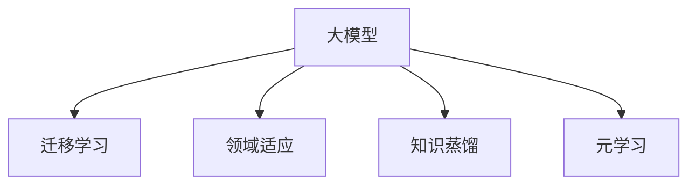
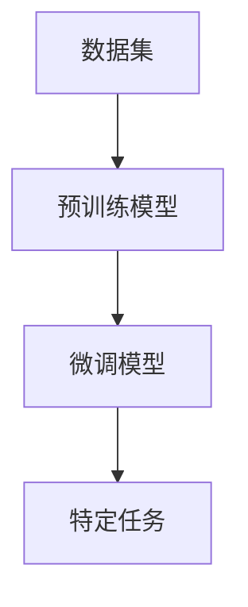

                 

# 电商平台中的大模型迁移学习技术

## 1. 背景介绍

### 1.1 问题由来

电商平台在快速发展的过程中，面临着复杂多样的用户需求和海量交易数据的挑战。为了更好地理解用户行为、优化推荐系统、提高转化率，平台需要构建精准的用户画像，预测用户的购买意向，提供个性化的商品推荐。

传统的机器学习模型，如线性回归、逻辑回归、决策树等，往往依赖于手工设计的特征，难以捕捉到用户行为的复杂特征。相比之下，基于深度学习的大模型在处理高维数据时具有出色的表现，可以通过端到端训练学习到数据的复杂特征。

在电商领域，大模型技术已经被广泛应用在用户画像构建、个性化推荐、异常检测等方面，显著提升了平台的运营效率和用户体验。本文将重点介绍电商平台中常用的迁移学习技术，探讨其原理和实践方法。

### 1.2 问题核心关键点

迁移学习是机器学习领域的一个重要技术，指将在一个领域学习到的知识迁移到另一个领域。在电商平台中，迁移学习主要用于以下几个方面：

1. 用户画像构建：通过从用户历史行为数据中学习到的知识，构建用户画像，帮助了解用户偏好和需求。
2. 商品推荐：利用用户画像和商品属性信息，进行商品推荐，提升转化率和用户体验。
3. 异常检测：通过从正常行为数据中学习到的知识，检测异常交易行为，防范欺诈风险。

本节将系统介绍大模型迁移学习技术，帮助读者理解其原理和应用场景，并总结其优缺点。

## 2. 核心概念与联系

### 2.1 核心概念概述

本节将介绍几个与大模型迁移学习相关的核心概念，并解释它们之间的联系。

- 大模型(Large Models)：指拥有数十亿甚至上百亿参数的深度神经网络模型，如BERT、GPT等。这些模型通过在大规模数据上预训练，学习到了丰富的语义和上下文信息。
- 迁移学习(Transfer Learning)：指将一个领域学习到的知识，迁移到另一个相关领域的应用。大模型通过迁移学习可以更好地适应电商平台的特定任务，提升模型的性能。
- 领域适应(Domain Adaptation)：指将在大规模数据集上训练的模型，适应到小规模、特定领域的数据集。这种技术有助于解决数据不平衡问题，提升模型在特定领域的效果。
- 知识蒸馏(Knowledge Distillation)：指通过将大模型的知识蒸馏到小模型中，提升小模型的性能。电商平台的推荐系统常使用知识蒸馏技术，将大模型的隐含知识迁移到轻量级模型中，提升模型的运行速度和效率。
- 元学习(Meta-Learning)：指在少量数据上进行快速适应和学习的技术。在电商推荐系统中，元学习可以用于快速适应用户偏好的变化，提高推荐系统的时效性和准确性。

这些概念之间的逻辑关系可以通过以下Mermaid流程图来展示：



这个流程图展示了大模型迁移学习的核心概念及其之间的关系：

1. 大模型通过预训练获得基础能力。
2. 迁移学习通过微调、知识蒸馏等技术，将大模型的知识迁移到特定任务中。
3. 领域适应帮助模型更好地适应特定领域的数据。
4. 元学习通过少量数据快速适应新任务，提升模型的适应性和时效性。

## 3. 核心算法原理 & 具体操作步骤

### 3.1 算法原理概述

在电商平台中，大模型的迁移学习一般包括两个阶段：预训练和微调。

- 预训练：在大规模无标签数据上，使用大模型进行预训练，学习到丰富的语义和上下文信息。预训练模型可以是自监督学习的BERT、GPT等，也可以是大规模监督学习的GPT-3、GPT-J等。
- 微调：将预训练模型迁移到特定任务中，通过有标签数据进行微调，提升模型在特定任务上的性能。微调可以是全参数微调，也可以采用参数高效微调技术，只更新少量模型参数。

整个迁移学习流程如下图所示：



其中，预训练模型在无标签数据上预训练，学习到通用的特征表示。微调模型通过特定任务的数据进行微调，学习到特定领域的知识。最终，微调模型可以用于电商平台的推荐、搜索、客服等多种场景。

### 3.2 算法步骤详解

大模型的迁移学习一般包括以下几个关键步骤：

**Step 1: 数据准备和预处理**

- 收集电商平台的交易数据、用户行为数据等，准备训练集、验证集和测试集。
- 对数据进行预处理，如清洗、归一化、分词、编码等，确保数据格式符合模型的输入要求。
- 对用户画像、商品信息、交易行为等数据进行标注，为微调模型提供监督信号。

**Step 2: 选择预训练模型**

- 选择合适的预训练模型，如BERT、GPT等，作为迁移学习的基础模型。
- 对预训练模型进行微调，选择适当的微调任务，如分类、回归、生成等。
- 设置微调模型的超参数，如学习率、批大小、迭代轮数等。

**Step 3: 执行微调**

- 将微调任务的数据集输入模型，使用梯度下降等优化算法进行训练。
- 在验证集上定期评估模型性能，根据性能指标决定是否触发Early Stopping。
- 重复上述步骤直至满足预设的迭代轮数或Early Stopping条件。

**Step 4: 模型部署**

- 将微调后的模型部署到电商平台的推荐、搜索、客服等多种场景中。
- 实时接收用户输入，对输入数据进行预处理，输入微调模型进行推理。
- 根据模型的输出，生成个性化的推荐、搜索结果或响应，提升用户体验。

### 3.3 算法优缺点

大模型的迁移学习具有以下优点：

1. 高效性：通过迁移学习，可以在少量有标签数据上进行微调，节省了大量的标注成本。
2. 泛化能力：大模型在预训练阶段学习到的通用特征，有助于提高微调模型在特定任务上的泛化能力。
3. 可扩展性：迁移学习技术可以应用于电商平台的多个场景，提升平台的整体性能。
4. 多样性：通过微调和知识蒸馏等技术，可以构建多样化的模型，满足不同业务需求。

同时，迁移学习也存在一些缺点：

1. 数据依赖：微调效果依赖于标注数据的质量和数量，高质量标注数据的获取成本较高。
2. 泛化能力有限：当目标任务与预训练数据的分布差异较大时，迁移学习的性能提升有限。
3. 可解释性不足：大模型通常被视为"黑盒"，难以解释其内部工作机制和决策逻辑。
4. 训练成本高：大模型在预训练阶段需要大量的计算资源和存储资源，训练成本较高。

尽管存在这些局限性，但就目前而言，大模型的迁移学习仍是电商平台中广泛应用的技术范式。未来相关研究的重点在于如何进一步降低迁移学习的标注数据依赖，提高模型的泛化能力和可解释性。

### 3.4 算法应用领域

大模型的迁移学习在电商平台中的应用非常广泛，涵盖了以下几个领域：

1. **用户画像构建**：通过微调预训练模型，从用户历史行为数据中学习到用户偏好和需求，构建用户画像。用户画像可以用于个性化推荐、广告投放、客户服务等多个场景。
2. **商品推荐系统**：利用用户画像和商品属性信息，进行商品推荐，提升转化率和用户体验。推荐系统可以通过微调模型，学习到商品的语义表示，生成更精准的推荐结果。
3. **异常检测**：通过微调预训练模型，从正常行为数据中学习到异常检测知识，检测欺诈交易、虚假广告等行为，提升平台安全性。
4. **广告投放**：通过微调模型，学习到广告投放的规律和特征，提升广告的点击率和转化率。
5. **客户服务**：通过微调预训练模型，学习到语言生成和对话理解的知识，构建智能客服系统，提升客户服务质量。

## 4. 数学模型和公式 & 详细讲解 & 举例说明

### 4.1 数学模型构建

在电商平台中，大模型的迁移学习通常涉及以下几个数学模型：

- **预训练模型**：如BERT、GPT等，通过在大规模数据上进行预训练，学习到通用的特征表示。
- **微调模型**：通过特定任务的数据进行微调，学习到特定领域的知识。
- **损失函数**：如交叉熵损失、均方误差损失等，用于衡量模型预测与真实标签之间的差异。

假设预训练模型为 $M_{\theta}$，微调任务为 $T$，微调数据集为 $D=\{(x_i, y_i)\}_{i=1}^N$，其中 $x_i$ 为输入数据，$y_i$ 为标签。微调模型的损失函数为 $\mathcal{L}(\theta)$，表示模型预测结果与真实标签之间的差距。

### 4.2 公式推导过程

以二分类任务为例，假设微调模型 $M_{\theta}$ 在输入 $x$ 上的输出为 $\hat{y}=M_{\theta}(x) \in [0,1]$，表示样本属于正类的概率。真实标签 $y \in \{0,1\}$。则二分类交叉熵损失函数定义为：

$$
\ell(M_{\theta}(x),y) = -[y\log \hat{y} + (1-y)\log (1-\hat{y})]
$$

将其代入经验风险公式，得：

$$
\mathcal{L}(\theta) = -\frac{1}{N}\sum_{i=1}^N [y_i\log M_{\theta}(x_i)+(1-y_i)\log(1-M_{\theta}(x_i))]
$$

根据链式法则，损失函数对参数 $\theta_k$ 的梯度为：

$$
\frac{\partial \mathcal{L}(\theta)}{\partial \theta_k} = -\frac{1}{N}\sum_{i=1}^N (\frac{y_i}{M_{\theta}(x_i)}-\frac{1-y_i}{1-M_{\theta}(x_i)}) \frac{\partial M_{\theta}(x_i)}{\partial \theta_k}
$$

其中 $\frac{\partial M_{\theta}(x_i)}{\partial \theta_k}$ 可进一步递归展开，利用自动微分技术完成计算。

### 4.3 案例分析与讲解

以下以商品推荐系统为例，给出使用大模型进行微调的数学模型构建和公式推导：

假设电商平台的商品推荐任务为 $T$，用户行为数据集为 $D=\{(x_i, y_i)\}_{i=1}^N$，其中 $x_i$ 为商品的属性信息，$y_i$ 为用户的购买行为标签。

- **预训练模型**：使用BERT等大模型作为预训练模型，对商品属性进行编码，学习到商品的语义表示。
- **微调模型**：在商品推荐任务上对预训练模型进行微调，学习到商品的推荐特征。
- **损失函数**：使用均方误差损失，衡量推荐结果与用户购买行为之间的差距。

根据上述假设，微调模型的损失函数为：

$$
\mathcal{L}(\theta) = \frac{1}{N}\sum_{i=1}^N (y_i - \hat{y}_i)^2
$$

其中，$\hat{y}_i$ 为模型对商品 $x_i$ 的推荐结果，$y_i$ 为用户的购买行为标签。

微调模型的输出为商品 $x_i$ 的推荐概率 $\hat{y}_i$，其计算公式为：

$$
\hat{y}_i = \sigma(W_{out} x_i + b_{out})
$$

其中，$W_{out}$ 和 $b_{out}$ 为输出层的权重和偏置，$\sigma$ 为激活函数。

通过上述模型和公式，电商平台的商品推荐系统可以通过微调大模型，学习到商品的推荐特征，生成个性化的推荐结果。

## 5. 项目实践：代码实例和详细解释说明

### 5.1 开发环境搭建

在进行大模型迁移学习实践前，我们需要准备好开发环境。以下是使用Python进行TensorFlow开发的环境配置流程：

1. 安装Anaconda：从官网下载并安装Anaconda，用于创建独立的Python环境。

2. 创建并激活虚拟环境：
```bash
conda create -n tf-env python=3.8 
conda activate tf-env
```

3. 安装TensorFlow：根据CUDA版本，从官网获取对应的安装命令。例如：
```bash
conda install tensorflow -c pytorch -c conda-forge
```

4. 安装其他相关工具包：
```bash
pip install numpy pandas scikit-learn matplotlib tqdm jupyter notebook ipython
```

完成上述步骤后，即可在`tf-env`环境中开始迁移学习实践。

### 5.2 源代码详细实现

这里我们以商品推荐系统为例，给出使用TensorFlow对BERT模型进行微调的代码实现。

首先，定义推荐任务的数据处理函数：

```python
from transformers import BertTokenizer
from tensorflow.keras.preprocessing.sequence import pad_sequences

class RecommendationDataset:
    def __init__(self, features, labels, tokenizer, max_len=128):
        self.features = features
        self.labels = labels
        self.tokenizer = tokenizer
        self.max_len = max_len
        
    def __len__(self):
        return len(self.features)
    
    def __getitem__(self, item):
        features = self.features[item]
        label = self.labels[item]
        
        encoding = self.tokenizer(features, return_tensors='pt', max_length=self.max_len, padding='max_length', truncation=True)
        input_ids = encoding['input_ids'][0]
        attention_mask = encoding['attention_mask'][0]
        labels = label
        
        # 对token-wise的标签进行编码
        encoded_labels = [label] * self.max_len
        labels = pad_sequences([encoded_labels], maxlen=self.max_len, padding='post', truncating='post')
        
        return {'input_ids': input_ids, 
                'attention_mask': attention_mask,
                'labels': labels}
```

然后，定义模型和优化器：

```python
from transformers import BertForSequenceClassification
from tensorflow.keras.optimizers import Adam

model = BertForSequenceClassification.from_pretrained('bert-base-cased', num_labels=2)

optimizer = Adam(model.parameters(), learning_rate=2e-5)
```

接着，定义训练和评估函数：

```python
from tensorflow.keras.metrics import BinaryCrossentropy
from tensorflow.keras.callbacks import EarlyStopping

def train_epoch(model, dataset, batch_size, optimizer):
    dataloader = tf.data.Dataset.from_generator(lambda: dataset, output_signature={'input_ids': tf.TensorSpec((None, max_len), tf.int32),
                                                                              'attention_mask': tf.TensorSpec((None,), tf.int32),
                                                                              'labels': tf.TensorSpec((None,), tf.int32)})
    
    model.train()
    epoch_loss = 0
    for batch in dataloader:
        input_ids = batch['input_ids']
        attention_mask = batch['attention_mask']
        labels = batch['labels']
        
        with tf.GradientTape() as tape:
            outputs = model(input_ids, attention_mask=attention_mask, return_dict=True)
            loss = outputs.loss
            epoch_loss += loss
        
        grads = tape.gradient(loss, model.parameters())
        optimizer.apply_gradients(zip(grads, model.parameters()))
    
    return epoch_loss / len(dataloader)

def evaluate(model, dataset, batch_size):
    dataloader = tf.data.Dataset.from_generator(lambda: dataset, output_signature={'input_ids': tf.TensorSpec((None, max_len), tf.int32),
                                                                              'attention_mask': tf.TensorSpec((None,), tf.int32),
                                                                              'labels': tf.TensorSpec((None,), tf.int32)})
    
    model.eval()
    metrics = BinaryCrossentropy()
    preds, labels = [], []
    for batch in dataloader:
        input_ids = batch['input_ids']
        attention_mask = batch['attention_mask']
        labels = batch['labels']
        
        outputs = model(input_ids, attention_mask=attention_mask, return_dict=True)
        preds.append(outputs.logits.numpy())
        labels.append(labels.numpy())
    
    print(metrics(labels, preds))
```

最后，启动训练流程并在测试集上评估：

```python
epochs = 5
batch_size = 16

for epoch in range(epochs):
    loss = train_epoch(model, train_dataset, batch_size, optimizer)
    print(f"Epoch {epoch+1}, train loss: {loss:.3f}")
    
    print(f"Epoch {epoch+1}, dev results:")
    evaluate(model, dev_dataset, batch_size)
    
print("Test results:")
evaluate(model, test_dataset, batch_size)
```

以上就是使用TensorFlow对BERT进行商品推荐任务微调的完整代码实现。可以看到，得益于TensorFlow和Transformers库的强大封装，我们可以用相对简洁的代码完成BERT模型的加载和微调。

### 5.3 代码解读与分析

让我们再详细解读一下关键代码的实现细节：

**RecommendationDataset类**：
- `__init__`方法：初始化特征、标签、分词器等关键组件。
- `__len__`方法：返回数据集的样本数量。
- `__getitem__`方法：对单个样本进行处理，将特征编码成token ids，将标签编码为数字，并进行定长padding，最终返回模型所需的输入。

**标签编码**：
- 使用pad_sequences函数对标签进行定长处理，确保模型输入的维度一致。

**训练和评估函数**：
- 使用TensorFlow的DataLoader对数据集进行批次化加载，供模型训练和推理使用。
- 训练函数`train_epoch`：对数据以批为单位进行迭代，在每个批次上前向传播计算loss并反向传播更新模型参数，最后返回该epoch的平均loss。
- 评估函数`evaluate`：与训练类似，不同点在于不更新模型参数，并在每个batch结束后将预测和标签结果存储下来，最后使用metrics函数对整个评估集的预测结果进行打印输出。

**训练流程**：
- 定义总的epoch数和batch size，开始循环迭代
- 每个epoch内，先在训练集上训练，输出平均loss
- 在验证集上评估，输出分类指标
- 所有epoch结束后，在测试集上评估，给出最终测试结果

可以看到，TensorFlow配合Transformers库使得BERT微调的代码实现变得简洁高效。开发者可以将更多精力放在数据处理、模型改进等高层逻辑上，而不必过多关注底层的实现细节。

当然，工业级的系统实现还需考虑更多因素，如模型的保存和部署、超参数的自动搜索、更灵活的任务适配层等。但核心的迁移学习范式基本与此类似。

## 6. 实际应用场景

### 6.1 智能推荐系统

智能推荐系统是电商平台中最为核心的功能之一。通过分析用户历史行为和实时数据，推荐系统可以精准地向用户推荐商品，提升用户的购物体验和转化率。

在推荐系统中，大模型的迁移学习可以用于以下几个方面：

- **用户画像构建**：通过微调预训练模型，学习到用户行为的语义表示，构建用户画像。用户画像可以用于推荐算法的训练和优化。
- **商品推荐算法**：利用用户画像和商品属性信息，进行商品推荐，生成个性化的推荐结果。
- **冷启动问题**：对于新用户或新商品，由于缺乏历史行为数据，无法构建准确的推荐结果。通过迁移学习，可以利用已有数据快速适应用户或商品，解决冷启动问题。

### 6.2 实时监控和预警

电商平台需要实时监控交易行为，检测异常交易、欺诈行为等，保障平台安全。

在实时监控系统中，大模型的迁移学习可以用于以下几个方面：

- **异常检测**：通过微调预训练模型，从正常交易数据中学习到异常交易的特征，检测异常交易行为。
- **实时预警**：当检测到异常交易行为时，及时生成预警信息，提醒相关人员进行处理。
- **欺诈防范**：利用迁移学习技术，从历史交易数据中学习到欺诈行为的特征，提前防范欺诈风险。

### 6.3 客户服务

智能客服系统可以提升电商平台的用户体验，解决用户咨询和问题。

在智能客服系统中，大模型的迁移学习可以用于以下几个方面：

- **对话理解**：通过微调预训练模型，学习到用户输入的语义表示，理解用户意图。
- **自然语言生成**：利用预训练语言模型，生成自然流畅的对话回复。
- **知识库整合**：通过迁移学习，将电商平台的商品信息、客服政策等整合到知识库中，提升客服系统的知识水平。

## 7. 工具和资源推荐

### 7.1 学习资源推荐

为了帮助开发者系统掌握大模型迁移学习技术的理论基础和实践技巧，这里推荐一些优质的学习资源：

1. 《深度学习》系列教材：斯坦福大学Andrew Ng教授的经典教材，全面介绍了深度学习的基本原理和应用。
2. 《自然语言处理入门与实践》：清华大学自然语言处理实验室编写的教材，介绍了NLP的基本概念和常用技术。
3. 《TensorFlow实战》：TensorFlow官方文档和开发社区推荐的实战教程，提供了丰富的代码示例和实战经验。
4. 《自然语言处理工具包》：介绍常用的NLP工具库，如NLTK、spaCy等，帮助开发者快速上手开发。
5. Kaggle：全球最大的数据科学竞赛平台，提供了丰富的数据集和任务，帮助开发者实践和提升技能。

通过对这些资源的学习实践，相信你一定能够快速掌握大模型迁移学习的精髓，并用于解决实际的电商问题。

### 7.2 开发工具推荐

高效的开发离不开优秀的工具支持。以下是几款用于大模型迁移学习开发的常用工具：

1. TensorFlow：由Google主导开发的开源深度学习框架，生产部署方便，适合大规模工程应用。提供了丰富的预训练语言模型资源。
2. PyTorch：基于Python的开源深度学习框架，灵活动态的计算图，适合快速迭代研究。大部分预训练语言模型都有PyTorch版本的实现。
3. HuggingFace Transformers库：Google开发的NLP工具库，集成了众多SOTA语言模型，支持TensorFlow和PyTorch，是进行迁移学习开发的利器。
4. Weights & Biases：模型训练的实验跟踪工具，可以记录和可视化模型训练过程中的各项指标，方便对比和调优。与主流深度学习框架无缝集成。
5. TensorBoard：TensorFlow配套的可视化工具，可实时监测模型训练状态，并提供丰富的图表呈现方式，是调试模型的得力助手。
6. Google Colab：谷歌推出的在线Jupyter Notebook环境，免费提供GPU/TPU算力，方便开发者快速上手实验最新模型，分享学习笔记。

合理利用这些工具，可以显著提升大模型迁移学习任务的开发效率，加快创新迭代的步伐。

### 7.3 相关论文推荐

大模型迁移学习技术的发展源于学界的持续研究。以下是几篇奠基性的相关论文，推荐阅读：

1. Attention is All You Need：提出了Transformer结构，开启了NLP领域的预训练大模型时代。
2. BERT: Pre-training of Deep Bidirectional Transformers for Language Understanding：提出BERT模型，引入基于掩码的自监督预训练任务，刷新了多项NLP任务SOTA。
3. Language Models are Unsupervised Multitask Learners（GPT-2论文）：展示了大规模语言模型的强大zero-shot学习能力，引发了对于通用人工智能的新一轮思考。
4. Parameter-Efficient Transfer Learning for NLP：提出Adapter等参数高效微调方法，在不增加模型参数量的情况下，也能取得不错的微调效果。
5. Knowledge Distillation：介绍知识蒸馏技术，通过将大模型的知识蒸馏到小模型中，提升小模型的性能。
6. Meta-Learning：介绍元学习技术，通过少量数据快速适应新任务，提升模型的适应性和时效性。

这些论文代表了大模型迁移学习技术的发展脉络。通过学习这些前沿成果，可以帮助研究者把握学科前进方向，激发更多的创新灵感。

## 8. 总结：未来发展趋势与挑战

### 8.1 总结

本文对电商平台中的大模型迁移学习技术进行了全面系统的介绍。首先阐述了迁移学习技术在电商平台中的重要性和应用场景，明确了其在用户画像构建、商品推荐、异常检测等方面的独特价值。其次，从原理到实践，详细讲解了迁移学习的数学模型和关键步骤，给出了迁移学习任务开发的完整代码实例。同时，本文还广泛探讨了迁移学习技术在智能推荐系统、实时监控和预警、客户服务等多个领域的应用前景，展示了迁移学习技术的广阔前景。

通过本文的系统梳理，可以看到，大模型的迁移学习技术在电商平台中具有广泛的应用潜力，极大地提升了电商平台的运营效率和用户体验。未来，随着大模型和迁移学习技术的进一步发展，将有望在更多领域带来变革性影响。

### 8.2 未来发展趋势

展望未来，大模型的迁移学习技术将呈现以下几个发展趋势：

1. **多模态学习**：将视觉、语音、文本等多种模态的信息融合在一起，构建多模态推荐系统和实时监控系统，提升模型的感知能力和决策能力。
2. **自监督学习**：通过无监督学习，从大规模数据中学习到通用的知识表示，应用于迁移学习中，进一步提升模型的泛化能力和适应性。
3. **元学习**：通过少量数据快速适应新任务，提升推荐系统、监控系统等领域的实时性和适应性。
4. **知识蒸馏**：将大模型的知识蒸馏到小模型中，提升小模型的性能和效率，适用于资源受限的场景。
5. **联邦学习**：在分布式环境中，通过模型参数的共享和更新，提升模型的隐私保护和安全性，适用于金融、医疗等领域。

这些趋势将推动大模型迁移学习技术在更广泛的领域中落地应用，带来更高的性能和更强的实用性。

### 8.3 面临的挑战

尽管大模型的迁移学习技术在电商平台中已经取得了显著成果，但在实际应用中，仍面临着一些挑战：

1. **数据质量和分布**：迁移学习的效果依赖于标注数据的质量和分布，高质量标注数据的获取成本较高。如何优化数据标注流程，提升数据质量和分布的合理性，是未来需要解决的重要问题。
2. **计算资源和存储成本**：大模型的迁移学习需要大量的计算资源和存储资源，对平台和系统的资源配置提出了高要求。如何优化模型的计算图和存储结构，降低资源消耗，提升效率，是未来需要研究的关键方向。
3. **模型的可解释性**：大模型通常被视为"黑盒"，难以解释其内部工作机制和决策逻辑。如何提升模型的可解释性，提供更好的决策依据，是未来需要研究的重要方向。
4. **模型的公平性和鲁棒性**：大模型可能存在偏见和鲁棒性不足的问题，影响模型的公平性和安全性。如何设计公平、鲁棒的模型，避免偏见和攻击，是未来需要研究的关键方向。
5. **模型的实时性和响应性**：电商平台需要实时处理用户输入，生成推荐结果或响应。如何提升模型的实时性和响应性，减少响应延迟，是未来需要研究的重要方向。

这些挑战需要我们持续关注和解决，推动大模型迁移学习技术向更加高效、公平、可解释、可控的方向发展。

### 8.4 研究展望

面对大模型迁移学习技术面临的挑战，未来的研究需要在以下几个方面寻求新的突破：

1. **自监督学习**：通过无监督学习，从大规模数据中学习到通用的知识表示，应用于迁移学习中，进一步提升模型的泛化能力和适应性。
2. **元学习**：通过少量数据快速适应新任务，提升推荐系统、监控系统等领域的实时性和适应性。
3. **知识蒸馏**：将大模型的知识蒸馏到小模型中，提升小模型的性能和效率，适用于资源受限的场景。
4. **联邦学习**：在分布式环境中，通过模型参数的共享和更新，提升模型的隐私保护和安全性，适用于金融、医疗等领域。
5. **多模态学习**：将视觉、语音、文本等多种模态的信息融合在一起，构建多模态推荐系统和实时监控系统，提升模型的感知能力和决策能力。

这些研究方向的探索将推动大模型迁移学习技术迈向更高的台阶，为构建安全、可靠、可解释、可控的智能系统铺平道路。面向未来，大模型迁移学习技术还需要与其他人工智能技术进行更深入的融合，如知识表示、因果推理、强化学习等，多路径协同发力，共同推动自然语言理解和智能交互系统的进步。只有勇于创新、敢于突破，才能不断拓展语言模型的边界，让智能技术更好地造福人类社会。

## 9. 附录：常见问题与解答

**Q1：大模型的迁移学习是否适用于所有电商平台？**

A: 大模型的迁移学习在大多数电商平台上都能取得不错的效果，特别是对于数据量较大的平台。但对于一些小型或新兴电商平台，由于数据规模较小，模型效果可能不尽理想。此时需要根据平台特点，优化数据标注流程，提升数据质量，或者采用预训练+微调的方式，利用通用大模型先进行预训练，再在特定任务上进行微调。

**Q2：如何选择合适的迁移学习模型？**

A: 选择迁移学习模型需要考虑以下几个因素：
1. 任务类型：根据任务类型选择合适的预训练模型，如分类任务使用BERT，生成任务使用GPT等。
2. 数据规模：对于数据量较小的平台，可以使用轻量级模型，如DistilBERT、TinyBERT等，以降低计算资源消耗。
3. 性能要求：对于高性能要求的任务，如实时推荐、实时监控等，可以使用预训练模型，如BERT、GPT等，以提升性能。
4. 可解释性要求：对于需要可解释性的任务，如客户服务、客服政策制定等，可以使用预训练模型，如BERT、GPT等，以提升模型的可解释性。

**Q3：迁移学习在电商平台中的应用有哪些？**

A: 迁移学习在电商平台中的应用非常广泛，涵盖了以下几个方面：
1. 用户画像构建：通过微调预训练模型，学习到用户行为的语义表示，构建用户画像。用户画像可以用于推荐算法的训练和优化。
2. 商品推荐算法：利用用户画像和商品属性信息，进行商品推荐，生成个性化的推荐结果。
3. 冷启动问题：对于新用户或新商品，由于缺乏历史行为数据，无法构建准确的推荐结果。通过迁移学习，可以利用已有数据快速适应用户或商品，解决冷启动问题。
4. 实时监控和预警：通过微调预训练模型，从正常交易数据中学习到异常交易的特征，检测异常交易行为。
5. 客户服务：通过微调预训练模型，学习到用户输入的语义表示，理解用户意图。

**Q4：迁移学习与传统的机器学习相比，有何优势？**

A: 迁移学习相比传统的机器学习有以下优势：
1. 数据依赖小：迁移学习可以在少量有标签数据上进行微调，节省了大量的标注成本。
2. 泛化能力强：迁移学习利用预训练模型学习到的通用特征，可以提升模型在特定任务上的泛化能力。
3. 适应性强：迁移学习可以适应不同的电商平台，提升平台的整体性能。
4. 高效性：迁移学习可以通过微调现有模型，快速适应新任务，提升模型的开发效率。

这些优势使得迁移学习在电商平台中得到了广泛应用。

**Q5：迁移学习在电商平台中需要注意哪些问题？**

A: 迁移学习在电商平台中需要注意以下几个问题：
1. 数据标注成本：迁移学习依赖于高质量的数据标注，数据标注成本较高。
2. 模型泛化能力：迁移学习的效果依赖于预训练模型的泛化能力，当目标任务与预训练数据的分布差异较大时，迁移学习的性能提升有限。
3. 计算资源消耗：迁移学习需要大量的计算资源和存储资源，对平台和系统的资源配置提出了高要求。
4. 模型可解释性：大模型通常被视为"黑盒"，难以解释其内部工作机制和决策逻辑。
5. 模型的公平性和鲁棒性：大模型可能存在偏见和鲁棒性不足的问题，影响模型的公平性和安全性。

这些问题是迁移学习在实际应用中需要关注和解决的关键问题。

通过本文的系统梳理，可以看到，大模型的迁移学习技术在电商平台中具有广泛的应用潜力，极大地提升了电商平台的运营效率和用户体验。未来，随着大模型和迁移学习技术的进一步发展，将有望在更多领域带来变革性影响。

