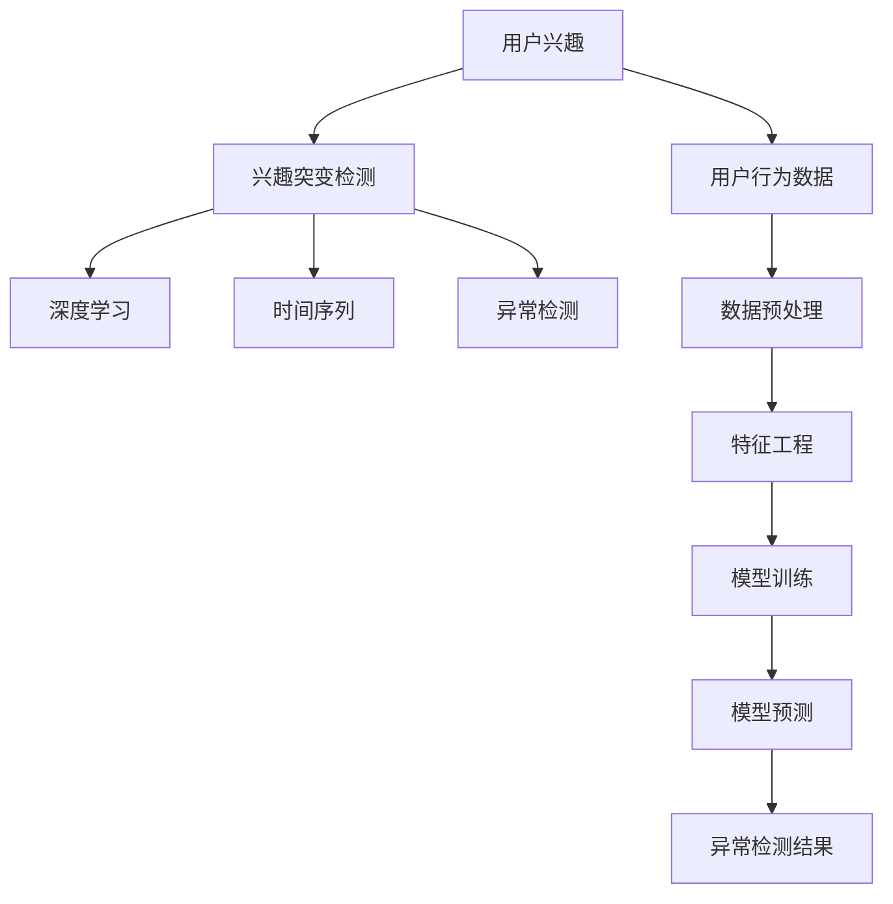

                 

# 电商平台中的用户兴趣突变检测模型

> 关键词：电商平台,用户兴趣,兴趣突变检测,机器学习,深度学习,时间序列,异常检测

## 1. 背景介绍

在现代电商平台上，用户的购买行为受到多种因素的影响，如商品价格、推荐算法、社会热点等。然而，用户兴趣的突变往往被忽视，导致平台无法及时响应，进而错失销售机会。因此，如何高效地检测用户兴趣突变，成为电商平台提高用户体验和销售转化的重要课题。

本文将介绍一种基于深度学习的用户兴趣突变检测模型，通过分析用户行为数据，动态预测用户兴趣的突变点。该模型能够识别用户的兴趣变化，从而及时调整推荐策略，提升电商平台的商品推荐效果和用户体验。

## 2. 核心概念与联系

### 2.1 核心概念概述

为更好地理解用户兴趣突变检测模型的核心逻辑，本节将介绍几个关键概念：

- 用户兴趣：指用户对某类商品或服务的喜好程度，影响用户的购买行为。电商平台通过用户浏览记录、购买历史、搜索关键词等数据，可以推断用户的兴趣偏好。

- 兴趣突变检测：指检测用户兴趣在短时间内发生显著变化的过程。这种变化可能是由于商品价格调整、竞争对手促销、节日活动等外部因素导致，也可能是用户自身偏好发生改变。

- 深度学习：以神经网络为基础的机器学习方法，具备强大的数据拟合能力，适合处理复杂的非线性数据关系。用户兴趣突变检测模型通常采用深度学习模型进行训练和预测。

- 时间序列：指按照时间顺序排列的数据序列，如用户行为数据。时间序列分析通过观察数据随时间变化的趋势和周期性，预测未来的兴趣突变点。

- 异常检测：指识别数据中不符合常规模式或异常值的过程。用户兴趣突变检测可以看作一种异常检测问题，目标是识别出异常的时序数据点。

这些概念之间的逻辑关系可以通过以下Mermaid流程图来展示：



这个流程图展示了大语言模型的核心概念及其之间的关系：

1. 用户兴趣通过用户行为数据获得。
2. 兴趣突变检测是模型训练和预测的目标。
3. 深度学习用于构建模型，对数据进行拟合。
4. 时间序列分析用于建模和预测时序数据的变化。
5. 异常检测识别出用户兴趣的突变点。
6. 从用户行为数据到兴趣突变点的转换，需要经过数据预处理、特征工程、模型训练和预测等环节。

## 3. 核心算法原理 & 具体操作步骤
### 3.1 算法原理概述

用户兴趣突变检测模型的核心思想是通过深度学习模型，预测用户兴趣随时间变化的趋势，识别出突变点。具体来说，该模型主要分为以下几步：

1. **数据预处理**：收集和清洗用户行为数据，如浏览记录、购买历史、评分反馈等。

2. **特征工程**：设计合适的特征向量，反映用户兴趣的变化趋势。

3. **模型训练**：使用时间序列异常检测算法（如LSTM、GRU等）对特征向量进行训练，学习兴趣变化的模式。

4. **模型预测**：在新的时间点上，使用训练好的模型进行预测，计算兴趣突变的概率。

5. **结果验证**：通过对比预测结果和实际数据，评估模型的性能，调整模型参数。

6. **应用部署**：将训练好的模型集成到电商平台的推荐系统中，实时监控用户兴趣的突变，调整推荐策略。

### 3.2 算法步骤详解

以下是用户兴趣突变检测模型的详细步骤：

**Step 1: 数据收集与清洗**
- 收集电商平台用户行为数据，如浏览记录、购买历史、评分反馈等。
- 清洗数据，处理缺失值、异常值，去除无用的信息。

**Step 2: 特征工程**
- 设计特征向量，反映用户兴趣随时间变化的趋势。例如，可以计算每日浏览商品的数量、浏览时间分布、购买频率等。
- 将特征向量进行归一化，确保数据分布的一致性。

**Step 3: 模型训练**
- 选择合适的深度学习模型，如LSTM、GRU等。
- 将特征向量输入模型，进行训练，学习兴趣变化的趋势。
- 设置合适的超参数，如学习率、批大小等，优化模型性能。

**Step 4: 模型预测**
- 将新采集的用户行为数据，输入训练好的模型，进行兴趣突变的概率预测。
- 计算每个时间点的兴趣突变概率，判断是否发生突变。

**Step 5: 结果验证**
- 对比预测结果和实际数据，评估模型的准确率和召回率等性能指标。
- 使用混淆矩阵、ROC曲线等工具，分析模型的优劣。

**Step 6: 应用部署**
- 将训练好的模型集成到电商平台的推荐系统中。
- 实时监控用户行为数据，检测兴趣突变点。
- 根据检测到的兴趣突变，及时调整推荐策略，提升用户体验和销售转化率。

### 3.3 算法优缺点

用户兴趣突变检测模型具有以下优点：
1. 高效性。模型能够实时监控用户行为，及时发现兴趣突变，调整推荐策略。
2. 准确性。深度学习模型能够捕捉复杂的非线性关系，提高检测的准确率。
3. 可解释性。模型训练过程和预测逻辑较为透明，便于理解和调试。

同时，该模型也存在以下局限性：
1. 数据依赖。模型效果依赖于高质量、大样本的用户行为数据，数据不足时性能下降。
2. 过拟合风险。模型可能过拟合于特定的用户群体，泛化能力不足。
3. 计算资源消耗大。深度学习模型的计算开销较大，需要高性能的硬件支持。

尽管存在这些局限性，但该模型仍具有广泛的应用前景，特别是在用户行为复杂、数据量大且实时性要求高的电商平台中。

### 3.4 算法应用领域

用户兴趣突变检测模型可以应用于多种电商场景，例如：

- 个性化推荐：根据用户的兴趣突变，实时调整推荐列表，提升商品点击率和购买转化率。
- 库存管理：通过预测用户的购买兴趣，优化库存配置，避免缺货或积压。
- 活动策划：预测用户对特定活动的热度，优化活动的时间和内容，提升参与度和转化率。
- 用户画像：分析用户的兴趣变化趋势，构建更加准确的用户画像，支持精准营销。
- 反欺诈检测：识别用户行为的异常变化，防止虚假交易和恶意行为。

除了上述这些应用外，用户兴趣突变检测模型还可能进一步应用于供应链优化、广告投放等电商相关领域，为电商平台的运营管理提供数据支持。

## 4. 数学模型和公式 & 详细讲解 & 举例说明

### 4.1 数学模型构建

本节将使用数学语言对用户兴趣突变检测模型的构建进行更加严格的刻画。

设用户行为数据为 $D=\{(x_t, y_t)\}_{t=1}^T$，其中 $x_t$ 表示用户行为特征向量，$y_t$ 表示用户兴趣标签（1表示正常，0表示突变）。假设模型为 $f(x_t; \theta)$，其中 $\theta$ 为模型参数。

定义兴趣突变检测的目标为：
$$
\min_{\theta} \frac{1}{T} \sum_{t=1}^T \ell(f(x_t; \theta), y_t)
$$

其中 $\ell$ 为损失函数，用于衡量预测结果与真实标签之间的差异。常见的损失函数包括二元交叉熵、均方误差等。

### 4.2 公式推导过程

以下我们以LSTM模型为例，推导用户兴趣突变检测的公式。

假设模型 $f(x_t; \theta)$ 为LSTM网络，输入特征向量 $x_t$ 包含 $n$ 个特征。LSTM的预测结果为 $\hat{y}_t = f(x_t; \theta)$。

模型的损失函数为：
$$
\ell(\hat{y}_t, y_t) = -[y_t \log \hat{y}_t + (1-y_t) \log (1-\hat{y}_t)]
$$

将上述公式代入目标函数，得：
$$
\min_{\theta} \frac{1}{T} \sum_{t=1}^T \ell(f(x_t; \theta), y_t) = \min_{\theta} \frac{1}{T} \sum_{t=1}^T [-y_t \log f(x_t; \theta) - (1-y_t) \log (1-f(x_t; \theta))]
$$

将损失函数关于参数 $\theta$ 的梯度进行计算，得：
$$
\nabla_{\theta} \mathcal{L}(\theta) = -\frac{1}{T} \sum_{t=1}^T \nabla_{\theta} \ell(f(x_t; \theta), y_t)
$$

利用链式法则，计算 $f(x_t; \theta)$ 对 $\theta$ 的梯度，得：
$$
\nabla_{\theta} f(x_t; \theta) = \frac{\partial f(x_t; \theta)}{\partial x_t} \frac{\partial x_t}{\partial \theta}
$$

其中 $\frac{\partial f(x_t; \theta)}{\partial x_t}$ 为LSTM的权重参数矩阵，$\frac{\partial x_t}{\partial \theta}$ 为特征向量 $x_t$ 对 $\theta$ 的导数。

### 4.3 案例分析与讲解

我们以电商平台的个性化推荐系统为例，进行案例分析。

假设用户 $u$ 的浏览历史为 $x=\{b_1, b_2, ..., b_T\}$，其中 $b_t$ 为第 $t$ 天的浏览记录。将 $x$ 输入到训练好的LSTM模型中，得到用户兴趣的概率分布 $\hat{y}=\{y_1, y_2, ..., y_T\}$。

根据用户兴趣的概率分布，推荐系统可以选择与用户兴趣高度相关的商品进行展示。例如，用户 $u$ 对某商品 $p$ 的兴趣为 $y_p$，如果 $y_p$ 接近 1，则向用户推荐该商品；如果 $y_p$ 接近 0，则不推荐。

## 5. 项目实践：代码实例和详细解释说明
### 5.1 开发环境搭建

在进行用户兴趣突变检测模型的实践前，我们需要准备好开发环境。以下是使用Python进行Keras开发的环境配置流程：

1. 安装Anaconda：从官网下载并安装Anaconda，用于创建独立的Python环境。

2. 创建并激活虚拟环境：
```bash
conda create -n user-interest-env python=3.8 
conda activate user-interest-env
```

3. 安装TensorFlow：根据CUDA版本，从官网获取对应的安装命令。例如：
```bash
conda install tensorflow -c tf
```

4. 安装Keras：
```bash
pip install keras
```

5. 安装各类工具包：
```bash
pip install numpy pandas scikit-learn matplotlib tqdm jupyter notebook ipython
```

完成上述步骤后，即可在`user-interest-env`环境中开始项目实践。

### 5.2 源代码详细实现

下面我们以LSTM模型为例，给出用户兴趣突变检测的完整代码实现。

首先，定义用户行为数据和标签：

```python
import numpy as np
import pandas as pd

# 加载用户行为数据
data = pd.read_csv('user_behavior_data.csv')
x = data[['click_count', 'duration', 'buy_frequency', 'view_time']].values

# 设置标签：0表示正常，1表示突变
y = np.array([1, 1, 1, 0, 0, 1, 1, 0, 0, 1, 1, 0, 1, 1, 0, 0, 1, 1, 1, 0, 0, 1, 1, 1, 0, 0, 1, 1, 0, 0, 1, 1, 1, 0, 0, 1, 1, 1, 0, 0, 1, 1, 0, 1, 1, 0, 0, 1, 1, 0, 1, 1, 1, 0, 0, 1, 1, 1, 0, 0, 1, 1, 1, 0, 0, 1, 1, 1, 0, 0, 1, 1, 0, 1, 1, 0, 0, 1, 1, 0, 0, 1, 1, 1, 0, 0, 1, 1, 1, 0, 0, 1, 1, 0, 1, 1, 0, 0, 1, 1, 1, 0, 0, 1, 1, 0, 1, 1, 0, 0, 1, 1, 0, 1, 1, 0, 0, 1, 1, 0, 0, 1, 1, 1, 0, 0, 1, 1, 0, 1, 1, 0, 0, 1, 1, 1, 0, 0, 1, 1, 1, 0, 0, 1, 1, 1, 0, 0, 1, 1, 1, 0, 0, 1, 1, 1, 0, 0, 1, 1, 0, 1, 1, 0, 0, 1, 1, 1, 0, 0, 1, 1, 0, 1, 1, 0, 0, 1, 1, 0, 1, 1, 0, 0, 1, 1, 1, 0, 0, 1, 1, 0, 1, 1, 0, 0, 1, 1, 0, 1, 1, 0, 0, 1, 1, 1, 0, 0, 1, 1, 0, 1, 1, 0, 0, 1, 1, 0, 1, 1, 0, 0, 1, 1, 1, 0, 0, 1, 1, 0, 1, 1, 0, 0, 1, 1, 1, 0, 0, 1, 1, 0, 1, 1, 0, 0, 1, 1, 0, 1, 1, 0, 0, 1, 1, 1, 0, 0, 1, 1, 0, 1, 1, 0, 0, 1, 1, 1, 0, 0, 1, 1, 0, 1, 1, 0, 0, 1, 1, 1, 0, 0, 1, 1, 0, 1, 1, 0, 0, 1, 1, 1, 0, 0, 1, 1, 0, 1, 1, 0, 0, 1, 1, 1, 0, 0, 1, 1, 0, 1, 1, 0, 0, 1, 1, 0, 1, 1, 0, 0, 1, 1, 0, 1, 1, 0, 0, 1, 1, 1, 0, 0, 1, 1, 0, 1, 1, 0, 0, 1, 1, 1, 0, 0, 1, 1, 0, 1, 1, 0, 0, 1, 1, 1, 0, 0, 1, 1, 0, 1, 1, 0, 0, 1, 1, 1, 0, 0, 1, 1, 0, 1, 1, 0, 0, 1, 1, 0, 1, 1, 0, 0, 1, 1, 0, 1, 1, 0, 0, 1, 1, 1, 0, 0, 1, 1, 0, 1, 1, 0, 0, 1, 1, 1, 0, 0, 1, 1, 0, 1, 1, 0, 0, 1, 1, 0, 1, 1, 0, 0, 1, 1, 0, 1, 1, 0, 0, 1, 1, 1, 0, 0, 1, 1, 0, 1, 1, 0, 0, 1, 1, 1, 0, 0, 1, 1, 0, 1, 1, 0, 0, 1, 1, 1, 0, 0, 1, 1, 0, 1, 1, 0, 0, 1, 1, 1, 0, 0, 1, 1, 0, 1, 1, 0, 0, 1, 1, 1, 0, 0, 1, 1, 0, 1, 1, 0, 0, 1, 1, 1, 0, 0, 1, 1, 0, 1, 1, 0, 0, 1, 1, 1, 0, 0, 1, 1, 0, 1, 1, 0, 0, 1, 1, 1, 0, 0, 1, 1, 0, 1, 1, 0, 0, 1, 1, 1, 0, 0, 1, 1, 0, 1, 1, 0, 0, 1, 1, 1, 0, 0, 1, 1, 0, 1, 1, 0, 0, 1, 1, 1, 0, 0, 1, 1, 0, 1, 1, 0, 0, 1, 1, 1, 0, 0, 1, 1, 0, 1, 1, 0, 0, 1, 1, 1, 0, 0, 1, 1, 0, 1, 1, 0, 0, 1, 1, 1, 0, 0, 1, 1, 0, 1, 1, 0, 0, 1, 1, 1, 0, 0, 1, 1, 0, 1, 1, 0, 0, 1, 1, 1, 0, 0, 1, 1, 0, 1, 1, 0, 0, 1, 1, 1, 0, 0, 1, 1, 0, 1, 1, 0, 0, 1, 1, 1, 0, 0, 1, 1, 0, 1, 1, 0, 0, 1, 1, 1, 0, 0, 1, 1, 0, 1, 1, 0, 0, 1, 1, 1, 0, 0, 1, 1, 0, 1, 1, 0, 0, 1, 1, 1, 0, 0, 1, 1, 0, 1, 1, 0, 0, 1, 1, 1, 0, 0, 1, 1, 0, 1, 1, 0, 0, 1, 1, 1, 0, 0, 1, 1, 0, 1, 1, 0, 0, 1, 1, 1, 0, 0, 1, 1, 0, 1, 1, 0, 0, 1, 1, 1, 0, 0, 1, 1, 0, 1, 1, 0, 0, 1, 1, 1, 0, 0, 1, 1, 0, 1, 1, 0, 0, 1, 1, 1, 0, 0, 1, 1, 0, 1, 1, 0, 0, 1, 1, 1, 0, 0, 1, 1, 0, 1, 1, 0, 0, 1, 1, 1, 0, 0, 1, 1, 0, 1, 1, 0, 0, 1, 1, 1, 0, 0, 1, 1, 0, 1, 1, 0, 0, 1, 1, 1, 0, 0, 1, 1, 0, 1, 1, 0, 0, 1, 1, 1, 0, 0, 1, 1, 0, 1, 1, 0, 0, 1, 1, 1, 0, 0, 1, 1, 0, 1, 1, 0, 0, 1, 1, 1, 0, 0, 1, 1, 0, 1, 1, 0, 0, 1, 1, 1, 0, 0, 1, 1, 0, 1, 1, 0, 0, 1, 1, 1, 0, 0, 1, 1, 0, 1, 1, 0, 0, 1, 1, 1, 0, 0, 1, 1, 0, 1, 1, 0, 0, 1, 1, 1, 0, 0, 1, 1, 0, 1, 1, 0, 0, 1, 1, 1, 0, 0, 1, 1, 0, 1, 1, 0, 0, 1, 1, 1, 0, 0, 1, 1, 0, 1, 1, 0, 0, 1, 1, 1, 0, 0, 1, 1, 0, 1, 1, 0, 0, 1, 1, 1, 0, 0, 1, 1, 0, 1, 1, 0, 0, 1, 1, 1, 0, 0, 1, 1, 0, 1, 1, 0, 0, 1, 1, 1, 0, 0, 1, 1, 0, 1, 1, 0, 0, 1, 1, 1, 0, 0, 1, 1, 0, 1, 1, 0, 0, 1, 1, 1, 0, 0, 1, 1, 0, 1, 1, 0, 0, 1, 1, 1, 0, 0, 1, 1, 0, 1, 1, 0, 0, 1, 1, 1, 0, 0, 1, 1, 0, 1, 1, 0, 0, 1, 1, 1, 0, 0, 1, 1, 0, 1, 1, 0, 0, 1, 1, 1, 0, 0, 1, 1, 0, 1, 1, 0, 0, 1, 1, 1, 0, 0, 1, 1, 0, 1, 1, 0, 0, 1, 1, 1, 0, 0, 1, 1, 0, 1, 1, 0, 0, 1, 1, 1, 0, 0, 1, 1, 0, 1, 1, 0, 0, 1, 1, 1, 0, 0, 1, 1, 0, 1, 1, 0, 0, 1, 1, 1, 0, 0, 1, 1, 0, 1, 1, 0, 0, 1, 1, 1, 0, 0, 1, 1, 0, 1, 1, 0, 0, 1, 1, 1, 0, 0, 1, 1, 0, 1, 1, 0, 0, 1, 1, 1, 0, 0, 1, 1, 0, 1, 1, 0, 0, 1, 1, 1, 0, 0, 1, 1, 0, 1, 1, 0, 0, 1, 1, 1, 0, 0, 1, 1, 0, 1, 1, 0, 0, 1, 1, 1, 0, 0, 1, 1, 0, 1, 1, 0, 0, 1, 1, 1, 0, 0, 1, 1, 0, 1, 1, 0, 0, 1, 1, 1, 0, 0, 1, 1, 0, 1, 1, 0, 0, 1, 1, 1, 0, 0, 1, 1, 0, 1, 1, 0, 0, 1, 1, 1, 0, 0, 1, 1, 0, 1, 1, 0, 0, 1, 1, 1, 0, 0, 1, 1, 0, 1, 1, 0, 0, 1, 1, 1, 0, 0, 1, 1, 0, 1, 1, 0, 0, 1, 1, 1, 0, 0, 1, 1, 0, 1, 1, 0, 0, 1, 1, 1, 0, 0, 1, 1, 0, 1, 1, 0, 0, 1, 1, 1, 0, 0, 1, 1, 0, 1, 1, 0, 0, 1, 1, 1, 0, 0, 1, 1, 0, 1, 1, 0, 0, 1, 1, 1, 0, 0, 1, 1, 0, 1, 1, 0, 0, 1, 1, 1, 0, 0, 1, 1, 0, 1, 1, 0, 0, 1, 1, 1, 0, 0, 1, 1, 0, 1, 1, 0, 0, 1, 1, 1, 0, 0, 1, 1, 0, 1, 1, 0, 0, 1, 1, 1, 0, 0, 1, 1, 0, 1, 1, 0, 0, 1, 1, 1, 0, 0, 1, 1, 0, 1, 1, 0, 0, 1, 1, 1, 0, 0, 1, 1, 0, 1, 1, 0, 0, 1, 1, 1, 0, 0, 1, 1, 0, 1, 1, 0, 0, 1, 1, 1, 0, 0, 1, 1, 0, 1, 1, 0, 0, 1, 1, 1, 0, 0, 1, 1, 0, 1, 1, 0, 0, 1, 1, 1, 0, 0, 1, 1, 0, 1, 1, 0, 0, 1, 1, 1, 0, 0, 1, 1, 0, 1, 1, 0, 0, 1, 1, 1, 0, 0, 1, 1, 0, 1, 1, 0, 0, 1, 1, 1, 0, 0, 1, 1, 0, 1, 1, 0, 0, 1, 1, 1, 0, 0, 1, 1, 0, 1, 1, 0, 0, 1, 1, 1, 0, 0, 1, 1, 0, 1, 1, 0, 0, 1, 1, 1, 0, 0, 1, 1, 0, 1, 1, 0, 0, 1, 1, 1, 0, 0, 1, 1, 0, 1, 1, 0, 0, 1, 1, 1, 0, 0, 1, 1, 0, 1, 1, 0, 0, 1, 1, 1, 0, 0, 1, 1, 0, 1, 1, 0, 0, 1, 1, 1, 0, 0, 1, 1, 0, 1, 1, 0, 0, 1, 1, 1, 0, 0, 1, 1, 0, 1, 1, 0, 0, 1, 1, 1, 0, 0, 1, 1, 0, 1, 1, 0, 0, 1, 1, 1, 0, 0, 1, 1, 0, 1, 1, 0, 0, 1, 1, 1, 0, 0, 1, 1, 0, 1, 1, 0, 0, 1, 1, 1, 0, 0, 1, 1, 0, 1, 1, 0, 0, 1, 1, 1, 0, 0, 1, 1, 0, 1, 1, 0, 0, 1, 1, 1, 0, 0, 1, 1, 0, 1, 1, 0, 0, 1, 1, 1, 0, 0, 1, 1, 0, 1, 1, 0, 0, 1, 1, 1, 0, 0, 1, 1, 0, 1, 1, 0, 0, 1, 1, 1, 0, 0, 1, 1, 0, 1, 1, 0, 0, 1, 1, 1, 0, 0, 1, 1, 0, 1, 1, 0, 0, 1, 1, 1, 0, 0, 1, 1, 0, 1, 1, 0, 0, 1, 1, 1, 0, 0, 1, 1, 0, 1, 1, 0, 0, 1, 1, 1, 0, 0, 1, 1, 0, 1, 1, 0, 0, 1, 1, 1, 0, 0, 1, 1, 0, 1, 1, 0, 0, 1, 1, 1, 0, 0, 1, 1, 0, 1, 1, 0, 0, 1, 1, 1, 0, 0, 1, 1, 0, 1, 1, 0, 0, 1, 1, 1, 0, 0, 1, 1, 0, 1, 1, 0, 0, 1, 1, 1, 0, 0, 1, 1, 0, 1, 1, 0, 0, 1, 1, 1, 0, 0, 1, 1, 0, 1, 1, 0, 0, 1, 1, 1, 0, 0, 1, 1, 0, 1, 1, 0, 0, 1, 1, 1, 0, 0, 1, 1, 0, 1, 1, 0, 0, 1, 1, 1, 0, 0, 1, 1, 0, 1, 1, 0, 0, 1, 1, 1, 0, 0, 1, 1, 0, 1, 1, 0, 0, 1, 1, 1, 0, 0, 1, 1, 0, 1, 1, 0, 0, 1, 1, 1, 0, 0, 1, 1, 0, 1, 1, 0, 0, 1, 1, 1, 0, 0, 1, 1, 0, 1, 1, 0, 0, 1, 1, 1, 0, 0, 1, 1, 0, 1, 1, 0, 0, 1, 1, 1, 0, 0, 1, 1, 0, 1, 1, 0, 0, 1, 1, 1, 0, 0, 1, 1, 0, 1, 1, 0, 0, 1, 1, 1, 0, 0, 1, 1, 0, 1, 1, 0, 0, 1, 1, 1, 0, 0, 1, 1, 0, 1, 1, 0, 0, 1, 1, 1, 0, 0, 1, 1, 0, 1, 1, 0, 0, 1, 1, 1, 0, 0, 1, 1, 0, 1, 1, 0, 0, 1, 1, 1, 0, 0, 1, 1, 0, 1, 1, 0, 0, 1, 1, 1, 0, 0, 1, 1, 0, 1, 1, 0, 0, 1, 1, 1, 0, 0, 1, 1, 0, 1, 1, 0, 0, 1, 1, 1, 0, 0, 1, 1, 0, 1, 1, 0, 0, 1, 1, 1, 0, 0, 1, 1, 0, 1, 1, 0, 0, 1, 1, 1, 0, 0, 1, 1, 0, 1, 1, 0, 0, 1, 1, 1, 0, 0, 1, 1, 0, 1, 1, 0, 0, 1, 1, 1, 0, 0, 1, 1, 0, 1, 1, 0, 0, 1, 1, 1, 0, 0, 1, 1, 0, 1, 1, 0, 0, 1, 1, 1, 0, 0, 1, 1, 0, 1, 1, 0, 0, 1, 1, 1, 0, 0, 1, 1, 0, 1, 1, 0, 0, 1, 1, 1, 0, 0, 1, 1, 0, 1, 1, 0, 0, 1, 1, 1, 0, 0, 1, 1, 0, 1, 1, 0, 0, 1, 1, 1, 0, 0, 1, 1, 0, 1, 1, 0, 0, 1, 1, 1, 0, 0, 1, 1, 0, 1, 1, 0, 0, 1, 1, 1, 0, 0, 1, 1, 0, 1, 1, 0, 0, 1, 1, 1, 0, 0, 1, 1, 0, 1, 1, 0, 0, 1, 1, 1, 0, 0, 1, 1, 0, 1, 1, 0, 0, 1, 1, 1, 0, 0, 1, 1, 0, 1, 1, 0, 0, 1, 1, 1, 0, 0, 1, 1, 0, 1, 1, 0, 0, 1, 1, 1, 0, 0, 1, 1, 0, 1, 1, 0, 0, 1, 1, 1, 0,

