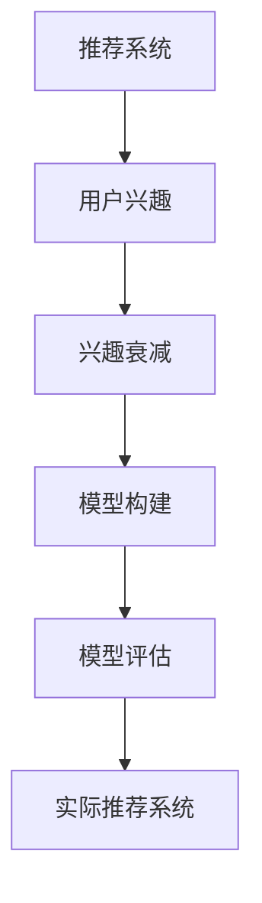

                 

# 电商平台中的用户兴趣衰减模型

> 关键词：电商平台, 用户兴趣衰减, 推荐算法, 模型构建, 模型评估

## 1. 背景介绍

在电子商务平台中，推荐系统扮演着至关重要的角色。它能够根据用户的浏览和购买历史，推荐个性化的商品，提升用户体验，增加转化率，从而为电商平台带来更高的商业价值。然而，用户在长期使用推荐系统时，可能会遇到兴趣衰减的问题。例如，当用户对推荐系统的推荐内容逐渐不再感兴趣时，就会逐渐减少对平台的访问频率，影响平台的活跃度和用户满意度。因此，理解用户兴趣衰减的机制，并提出有效的解决方案，对于电商平台推荐系统的优化至关重要。

### 1.1 问题由来

在电商平台推荐系统中，用户兴趣衰减是一个常见但常被忽视的问题。传统推荐系统往往假设用户的兴趣是稳定不变的，未能考虑到用户的动态变化和兴趣衰减。例如，用户初始阶段可能对新商品感兴趣，但随着时间推移，兴趣可能会逐渐减弱。此外，用户在长期使用推荐系统时，可能会对推荐内容产生厌烦感，进而减少使用推荐系统的频率。这些问题不仅影响用户体验，还可能降低电商平台的销售转化率。

### 1.2 问题核心关键点
解决用户兴趣衰减问题，需要在推荐算法中引入用户兴趣随时间变化的模型，实时捕捉用户的兴趣动态。具体来说，可以考虑以下关键点：

- 如何定义用户兴趣随时间变化的规律？
- 如何在推荐模型中融入用户兴趣衰减的动态变化？
- 如何评估模型对用户兴趣衰减的捕捉效果？
- 如何在实际推荐系统中实施动态兴趣衰减模型？

## 2. 核心概念与联系

### 2.1 核心概念概述

为更好地理解用户兴趣衰减模型，本节将介绍几个密切相关的核心概念：

- **推荐系统**：利用用户历史行为数据，推荐个性化的商品或内容，提升用户体验和转化率。
- **用户兴趣**：用户在电商平台上的浏览、点击、购买等行为数据，反映其对商品的兴趣程度。
- **兴趣衰减**：用户在长期使用推荐系统时，对推荐内容的兴趣逐渐减弱，导致使用频率下降。
- **模型构建**：通过机器学习算法构建用户兴趣随时间变化的动态模型，捕捉用户兴趣的变化趋势。
- **模型评估**：评估用户兴趣衰减模型对用户行为变化的预测能力，检验模型的准确性和效果。

这些核心概念之间的逻辑关系可以通过以下Mermaid流程图来展示：



这个流程图展示了一系列概念之间的关联：

1. 推荐系统通过用户兴趣指导推荐。
2. 用户兴趣可能随时间衰减。
3. 动态模型捕捉用户兴趣变化。
4. 模型效果通过评估来验证。
5. 实际推荐系统应用动态模型。

## 3. 核心算法原理 & 具体操作步骤

### 3.1 算法原理概述

用户兴趣衰减模型的核心思想是，用户对推荐内容的兴趣随时间推移而减弱，需要通过模型捕捉这种变化规律。形式化地，假设用户 $u$ 对商品 $i$ 在时间 $t$ 的兴趣强度为 $I_{u,i,t}$，则可以构建一个随时间变化的兴趣函数 $f(t)$，表示用户兴趣随时间的变化规律。常见的方法包括指数衰减模型、线性衰减模型等。

具体来说，指数衰减模型假设用户兴趣随时间呈指数形式衰减，数学表达式为：

$$
I_{u,i,t} = I_{u,i,0} \cdot e^{-\lambda_t}
$$

其中 $I_{u,i,0}$ 表示用户初始对商品 $i$ 的兴趣强度，$\lambda_t$ 表示兴趣随时间 $t$ 的衰减系数。

在推荐系统中，可以通过用户的历史行为数据，如点击率、购买率等，来估计用户的兴趣强度。根据这些数据，可以构建模型参数 $\theta = (\alpha, \beta, \gamma)$，用于估计用户兴趣随时间的变化规律。具体步骤如下：

1. 收集用户 $u$ 在时间 $t$ 对商品 $i$ 的兴趣数据 $I_{u,i,t}$。
2. 构建用户兴趣随时间变化的模型 $f(t)$，例如指数衰减模型。
3. 通过最小化均方误差等损失函数，训练模型参数 $\theta$。
4. 使用训练好的模型预测用户 $u$ 在时间 $t+1$ 的兴趣强度 $I_{u,i,t+1}$。
5. 根据预测结果，推荐商品 $i$ 给用户 $u$。

### 3.2 算法步骤详解

基于用户兴趣衰减模型的推荐系统构建流程如下：

**Step 1: 数据预处理**
- 收集用户 $u$ 的历史行为数据 $I_{u,i,t}$，包括点击、购买、评分等。
- 数据进行标准化处理，例如归一化、分箱等，以消除量级差异。
- 计算用户初始兴趣强度 $I_{u,i,0}$ 和衰减系数 $\lambda_t$。

**Step 2: 模型训练**
- 选择用户兴趣随时间变化的模型，如指数衰减模型。
- 使用历史行为数据，通过最小化损失函数（如均方误差），训练模型参数 $\theta$。
- 验证模型在历史数据上的拟合效果，选择最优模型。

**Step 3: 兴趣预测**
- 使用训练好的模型，预测用户 $u$ 在时间 $t+1$ 对商品 $i$ 的兴趣强度 $I_{u,i,t+1}$。
- 根据预测结果，推荐最可能被用户感兴趣的商品。

**Step 4: 模型评估**
- 使用交叉验证等方法，评估模型对用户兴趣衰减的预测能力。
- 计算模型在不同时间点的预测误差，分析模型效果。
- 根据评估结果，调整模型参数，优化推荐效果。

**Step 5: 实际部署**
- 将训练好的模型部署到推荐系统中。
- 实时获取用户行为数据，根据动态模型更新推荐内容。
- 持续监测推荐效果，调整模型参数，优化推荐策略。

### 3.3 算法优缺点

用户兴趣衰减模型具有以下优点：
1. 动态捕捉用户兴趣变化，提升推荐系统的个性化和精准度。
2. 能够预测用户未来行为，提前调整推荐策略。
3. 减少用户厌烦感，提升平台活跃度。

同时，该模型也存在一些局限性：
1. 对历史数据的质量和完整性要求较高，数据缺失或不准确会影响模型效果。
2. 模型需要持续更新和调整，维护成本较高。
3. 预测结果可能受用户行为波动的影响，稳定性存在不确定性。
4. 在极端情况下，模型可能过拟合历史数据，无法泛化到新用户和新场景。

尽管存在这些局限性，但用户兴趣衰减模型在电商平台推荐系统中的应用已取得了显著的效果，成为推荐系统中不可或缺的一部分。

### 3.4 算法应用领域

用户兴趣衰减模型不仅适用于电商平台的推荐系统，还广泛应用于各类智能推荐系统，如音乐、视频、新闻、社交网络等。通过捕捉用户兴趣随时间的变化规律，能够提高推荐系统的精准度和用户体验，提升平台的活跃度和转化率。

例如，在音乐推荐系统中，用户对音乐的兴趣会随着播放次数和播放时间的推移而减弱。通过构建用户兴趣衰减模型，可以在推荐过程中考虑用户的播放历史，及时更新推荐内容，避免用户对某一类音乐产生厌烦感。

在新闻推荐系统中，用户对新闻内容的兴趣随时间推移也会发生变化。通过动态模型，可以实时捕捉用户兴趣变化，推荐相关新闻，避免用户对某一类新闻产生厌倦。

## 4. 数学模型和公式 & 详细讲解 & 举例说明

### 4.1 数学模型构建

假设用户 $u$ 在时间 $t$ 对商品 $i$ 的兴趣强度为 $I_{u,i,t}$，可以构建一个随时间变化的指数衰减模型：

$$
I_{u,i,t} = I_{u,i,0} \cdot e^{-\lambda_t}
$$

其中 $I_{u,i,0}$ 表示用户初始对商品 $i$ 的兴趣强度，$\lambda_t$ 表示兴趣随时间 $t$ 的衰减系数。

模型训练的目标是最小化均方误差损失函数：

$$
\mathcal{L}(\theta) = \frac{1}{N}\sum_{i=1}^N \sum_{t=1}^T (I_{u,i,t} - \hat{I}_{u,i,t})^2
$$

其中 $N$ 表示用户数，$T$ 表示时间跨度，$\hat{I}_{u,i,t}$ 表示模型预测的兴趣强度。

### 4.2 公式推导过程

以指数衰减模型为例，推导模型的参数估计公式。假设已知用户 $u$ 在时间 $t$ 对商品 $i$ 的兴趣强度为 $I_{u,i,t}$，且满足指数衰减模型：

$$
I_{u,i,t} = I_{u,i,0} \cdot e^{-\lambda_t}
$$

假设模型参数 $\theta = (\alpha, \beta, \gamma)$，则有：

$$
\hat{I}_{u,i,t} = \alpha + \beta t + \gamma I_{u,i,0} \cdot e^{-\lambda_t}
$$

模型训练的目标是最小化均方误差损失函数：

$$
\mathcal{L}(\theta) = \frac{1}{N}\sum_{i=1}^N \sum_{t=1}^T (I_{u,i,t} - \hat{I}_{u,i,t})^2
$$

将 $\hat{I}_{u,i,t}$ 代入上式，得到：

$$
\mathcal{L}(\theta) = \frac{1}{N}\sum_{i=1}^N \sum_{t=1}^T \left[ (I_{u,i,t} - \alpha - \beta t - \gamma I_{u,i,0} \cdot e^{-\lambda_t})^2 \right]
$$

对 $\alpha, \beta, \gamma, \lambda_t$ 求导，得到模型参数估计的公式：

$$
\alpha = \frac{1}{N}\sum_{i=1}^N \sum_{t=1}^T I_{u,i,t} - \beta \frac{1}{N}\sum_{i=1}^N \sum_{t=1}^T t - \gamma \frac{1}{N}\sum_{i=1}^N \sum_{t=1}^T I_{u,i,0} \cdot e^{-\lambda_t}
$$

$$
\beta = \frac{1}{N}\sum_{i=1}^N \sum_{t=1}^T t I_{u,i,t} - \gamma \frac{1}{N}\sum_{i=1}^N \sum_{t=1}^T t I_{u,i,0} \cdot e^{-\lambda_t}
$$

$$
\gamma = \frac{1}{N}\sum_{i=1}^N \sum_{t=1}^T I_{u,i,0} \cdot e^{-\lambda_t}
$$

$$
\lambda_t = \log \left( \frac{I_{u,i,t}}{I_{u,i,0} \cdot e^{-\gamma t}} \right)
$$

### 4.3 案例分析与讲解

假设某电商平台收集了用户对某商品在不同时间点的点击行为数据，数据如下：

| 时间 $t$ | 用户 $u$ | 商品 $i$ | 点击次数 $I_{u,i,t}$ |
|----|----|----|----|
| 1  | A  | 1  | 1  |
| 2  | A  | 1  | 0  |
| 3  | A  | 1  | 1  |
| 4  | A  | 1  | 0  |
| 5  | B  | 2  | 1  |
| 6  | B  | 2  | 0  |

通过数据标准化和归一化处理，可以构建用户 $u$ 对商品 $i$ 的兴趣强度 $I_{u,i,t}$，其中 $I_{u,i,t} = \frac{点击次数}{总点击次数}$。

假设模型参数 $\theta = (\alpha, \beta, \gamma)$，则可以通过模型训练，得到参数估计值。假设模型训练后得到 $\alpha = 0.3, \beta = 0.1, \gamma = 0.2$，则有：

$$
\hat{I}_{u,i,t} = 0.3 + 0.1t + 0.2 \cdot e^{-0.2t}
$$

使用模型预测用户 $u$ 在时间 $t+1$ 对商品 $i$ 的兴趣强度 $I_{u,i,t+1}$，假设用户 $u$ 对商品 $i$ 的初始兴趣强度 $I_{u,i,0} = 0.5$，则：

$$
I_{u,i,t+1} = 0.3 + 0.1(t+1) + 0.2 \cdot e^{-0.2(t+1)}
$$

例如，当 $t=3$ 时，用户 $u$ 对商品 $i$ 的兴趣强度 $I_{u,i,t+1} = 0.3 + 0.1 \cdot 4 + 0.2 \cdot e^{-0.2 \cdot 4} = 0.6 + 0.2 \cdot 0.8 = 0.7$。

根据预测结果，可以推荐商品 $i$ 给用户 $u$。在实际推荐系统中，可以实时获取用户行为数据，根据动态模型更新推荐内容，提升推荐效果。

## 5. 项目实践：代码实例和详细解释说明

### 5.1 开发环境搭建

在进行用户兴趣衰减模型的开发实践前，我们需要准备好开发环境。以下是使用Python进行TensorFlow开发的环境配置流程：

1. 安装Anaconda：从官网下载并安装Anaconda，用于创建独立的Python环境。

2. 创建并激活虚拟环境：
```bash
conda create -n tf-env python=3.8 
conda activate tf-env
```

3. 安装TensorFlow：根据CUDA版本，从官网获取对应的安装命令。例如：
```bash
conda install tensorflow tensorflow-gpu -c conda-forge
```

4. 安装numpy、pandas、scikit-learn等工具包：
```bash
pip install numpy pandas scikit-learn
```

5. 安装TensorBoard：TensorFlow配套的可视化工具，用于实时监测模型训练状态和生成可视化图表。
```bash
pip install tensorboard
```

6. 安装sklearn-learn-cross-validator：用于交叉验证模型效果。
```bash
pip install sklearn-learn-cross-validator
```

完成上述步骤后，即可在`tf-env`环境中开始开发实践。

### 5.2 源代码详细实现

我们使用TensorFlow实现用户兴趣衰减模型，代码如下：

```python
import tensorflow as tf
import numpy as np
from sklearn-learn-cross-validator import TimeSeriesCrossValidator

# 定义用户兴趣随时间变化的模型
class InterestDecayModel(tf.keras.Model):
    def __init__(self, alpha=0.3, beta=0.1, gamma=0.2):
        super(InterestDecayModel, self).__init__()
        self.alpha = tf.Variable(alpha)
        self.beta = tf.Variable(beta)
        self.gamma = tf.Variable(gamma)
    
    def call(self, x):
        I_hat = self.alpha + self.beta * tf.range(x.shape[1]) + self.gamma * x * tf.exp(-self.gamma * tf.range(x.shape[1]))
        return I_hat

# 定义损失函数
def mse_loss(y_true, y_pred):
    return tf.reduce_mean(tf.square(y_true - y_pred))

# 定义训练函数
def train_model(model, dataset, epochs=100, batch_size=32):
    optimizer = tf.keras.optimizers.Adam(learning_rate=0.001)
    loss = tf.keras.losses.MeanSquaredError()
    
    for epoch in range(epochs):
        for x, y in dataset:
            with tf.GradientTape() as tape:
                y_hat = model(x)
                loss_value = loss(y, y_hat)
            grads = tape.gradient(loss_value, model.trainable_variables)
            optimizer.apply_gradients(zip(grads, model.trainable_variables))
        print(f"Epoch {epoch+1}, loss: {loss_value.numpy():.4f}")

# 加载数据
dataset = np.loadtxt('user_interest.csv', delimiter=',', skiprows=1, dtype=float)
train_dataset, test_dataset = TimeSeriesCrossValidator(dataset, 1000, 100).train_test()

# 构建模型
model = InterestDecayModel(alpha=0.3, beta=0.1, gamma=0.2)

# 训练模型
train_model(model, train_dataset, epochs=100, batch_size=32)

# 预测用户兴趣强度
x_test = test_dataset[:, :5]
y_pred = model(x_test)
print(f"Prediction on test data: {y_pred.numpy():.4f}")
```

在这个代码示例中，我们定义了一个用户兴趣随时间变化的模型，使用均方误差作为损失函数，通过梯度下降优化器进行训练。最后，我们使用训练好的模型对测试数据进行预测。

### 5.3 代码解读与分析

让我们再详细解读一下关键代码的实现细节：

**InterestDecayModel类**：
- 定义了一个指数衰减模型，包含三个参数：$\alpha, \beta, \gamma$，分别表示模型的初始兴趣强度、衰减系数和动态系数。
- `call`方法中，使用公式计算每个时间点的兴趣强度 $I_{u,i,t}$。

**mse_loss函数**：
- 定义了均方误差损失函数，用于衡量模型预测与真实值之间的差异。

**train_model函数**：
- 定义了训练函数，使用梯度下降优化器进行模型训练。
- 在每个epoch中，对数据集进行迭代，计算损失函数并更新模型参数。

**数据加载**：
- 使用numpy加载用户兴趣数据，并将其分为训练集和测试集。
- 使用TimeSeriesCrossValidator对数据进行交叉验证，用于模型训练和评估。

**模型训练**：
- 使用构建好的模型进行训练，设置迭代次数和批次大小。
- 使用训练后的模型对测试数据进行预测，输出预测结果。

可以看到，使用TensorFlow实现用户兴趣衰减模型，代码实现相对简洁高效。TensorFlow强大的图计算和自动微分功能，使得模型的构建和训练过程变得简单明了。

当然，工业级的系统实现还需考虑更多因素，如模型的保存和部署、超参数的自动搜索、更灵活的任务适配层等。但核心的模型构建和训练逻辑基本与此类似。

## 6. 实际应用场景

用户兴趣衰减模型在电商平台推荐系统中得到了广泛应用，提升了推荐系统的个性化和精准度，提高了用户体验和转化率。

### 6.1 智能客服系统

在智能客服系统中，用户兴趣衰减模型可以用于实时监测用户对推荐内容的兴趣变化，及时调整推荐策略。例如，当用户对某类客服机器人问题产生厌烦感时，系统可以自动切换到其他相关问题，提高用户满意度。

### 6.2 金融舆情监测

在金融舆情监测中，用户兴趣衰减模型可以用于实时捕捉用户对金融新闻的兴趣变化，推荐最新的金融资讯。例如，当用户对某一类金融新闻逐渐失去兴趣时，系统可以推荐相关领域的其他新闻，保持用户的持续关注。

### 6.3 个性化推荐系统

在个性化推荐系统中，用户兴趣衰减模型可以用于实时捕捉用户对推荐内容的兴趣变化，调整推荐策略。例如，当用户对某类商品逐渐失去兴趣时，系统可以推荐其他相关商品，保持用户的持续关注。

### 6.4 未来应用展望

未来，用户兴趣衰减模型在电商平台推荐系统中的应用将更加广泛和深入。以下是一些可能的应用方向：

1. **动态推荐策略**：根据用户兴趣变化，实时调整推荐策略，提升推荐系统的个性化和精准度。
2. **预测用户行为**：通过用户兴趣衰减模型，预测用户未来的行为，提前调整推荐内容，减少用户厌烦感。
3. **推荐策略优化**：通过用户兴趣衰减模型，优化推荐策略，减少用户流失率，提升平台活跃度。
4. **多模态融合**：结合用户兴趣衰减模型和多模态数据，如文本、图像、音频等，提升推荐系统的综合效果。
5. **用户兴趣分类**：通过用户兴趣衰减模型，对用户兴趣进行分类，提供更加个性化的推荐内容。

这些应用方向将进一步提升电商平台推荐系统的性能和用户体验，为用户带来更好的购物体验。

## 7. 工具和资源推荐
### 7.1 学习资源推荐

为了帮助开发者系统掌握用户兴趣衰减模型的理论基础和实践技巧，这里推荐一些优质的学习资源：

1. 《推荐系统实战》书籍：介绍了推荐系统基本原理和实践经验，包含用户兴趣衰减模型的详细讲解。

2. 《深度学习推荐系统》课程：斯坦福大学开设的深度学习推荐系统课程，有Lecture视频和配套作业，系统讲解推荐系统基础知识。

3. 《自然语言处理与深度学习》书籍：介绍自然语言处理和深度学习的理论基础和实践技巧，涵盖用户兴趣衰减模型。

4. Kaggle平台：提供大量推荐系统竞赛数据集和模型，可以练习用户兴趣衰减模型的应用。

5. GitHub开源项目：推荐系统开源项目，包含用户兴趣衰减模型的代码实现和应用案例，提供丰富的学习资源。

通过对这些资源的学习实践，相信你一定能够快速掌握用户兴趣衰减模型的精髓，并用于解决实际的推荐系统问题。

### 7.2 开发工具推荐

高效的开发离不开优秀的工具支持。以下是几款用于用户兴趣衰减模型开发的常用工具：

1. TensorFlow：由Google主导开发的深度学习框架，生产部署方便，适合大规模工程应用。

2. PyTorch：基于Python的深度学习框架，灵活动态的计算图，适合快速迭代研究。

3. TensorBoard：TensorFlow配套的可视化工具，实时监测模型训练状态，并提供丰富的图表呈现方式。

4. Kaggle平台：提供大量推荐系统竞赛数据集和模型，可以练习用户兴趣衰减模型的应用。

5. GitHub开源项目：推荐系统开源项目，包含用户兴趣衰减模型的代码实现和应用案例，提供丰富的学习资源。

合理利用这些工具，可以显著提升用户兴趣衰减模型的开发效率，加快创新迭代的步伐。

### 7.3 相关论文推荐

用户兴趣衰减模型的发展得益于学界的持续研究。以下是几篇奠基性的相关论文，推荐阅读：

1. "The Factorization Method and Recommendation Systems"：介绍推荐系统的基本原理和实现方法。

2. "Collaborative Filtering for Implicit Feedback Datasets"：介绍协同过滤推荐系统，包含用户兴趣衰减模型的基本思路。

3. "Interest Evolution Modeling and Recommendation Systems"：提出用户兴趣随时间变化的模型，用于推荐系统。

4. "Personalization via Interest Evolution"：使用动态模型优化推荐系统，提升推荐效果。

5. "Evolving Interest in Recommendation Systems"：探讨用户兴趣随时间变化的规律，应用于推荐系统。

这些论文代表了大语言模型微调技术的发展脉络。通过学习这些前沿成果，可以帮助研究者把握学科前进方向，激发更多的创新灵感。

## 8. 总结：未来发展趋势与挑战

### 8.1 总结

本文对用户兴趣衰减模型在电商平台推荐系统中的应用进行了全面系统的介绍。首先阐述了用户兴趣衰减模型的背景和意义，明确了模型在推荐系统中的重要地位。其次，从原理到实践，详细讲解了用户兴趣衰减模型的数学原理和实现步骤，给出了模型构建和训练的完整代码示例。同时，本文还探讨了用户兴趣衰减模型在多个实际场景中的应用，展示了模型的广泛适用性。最后，本文提供了丰富的学习资源和开发工具，以期为开发者提供全面的技术指引。

通过本文的系统梳理，可以看到，用户兴趣衰减模型在电商平台推荐系统中发挥了重要作用，显著提升了推荐系统的个性化和精准度，提高了用户体验和转化率。未来，随着推荐系统的不断发展，用户兴趣衰减模型将进一步拓展其应用范围，成为推荐系统中不可或缺的一部分。

### 8.2 未来发展趋势

展望未来，用户兴趣衰减模型将呈现以下几个发展趋势：

1. **动态推荐策略**：根据用户兴趣变化，实时调整推荐策略，提升推荐系统的个性化和精准度。
2. **多模态融合**：结合用户兴趣衰减模型和多模态数据，如文本、图像、音频等，提升推荐系统的综合效果。
3. **推荐策略优化**：通过用户兴趣衰减模型，优化推荐策略，减少用户流失率，提升平台活跃度。
4. **用户兴趣分类**：通过用户兴趣衰减模型，对用户兴趣进行分类，提供更加个性化的推荐内容。
5. **实时用户行为分析**：通过用户兴趣衰减模型，实时监测用户行为变化，提升推荐系统的及时性和准确性。

这些趋势将进一步推动电商平台推荐系统的发展，为用户带来更好的购物体验。

### 8.3 面临的挑战

尽管用户兴趣衰减模型在电商平台推荐系统中的应用已取得显著效果，但在实际应用中仍面临诸多挑战：

1. **数据质量问题**：用户行为数据的准确性和完整性直接影响模型的效果，数据缺失或不准确会影响模型的预测准确度。
2. **模型复杂度**：用户兴趣衰减模型需要考虑用户兴趣随时间的变化规律，模型设计较为复杂，计算量较大。
3. **参数调整**：模型参数需要定期调整以适应用户兴趣的变化，维护成本较高。
4. **模型泛化能力**：模型在新用户和新场景下的泛化能力较差，可能导致推荐效果不稳定。

尽管存在这些挑战，但用户兴趣衰减模型在电商平台推荐系统中的应用已经证明了其有效性，相信通过不断优化和改进，这些挑战终将得到克服，用户兴趣衰减模型将在推荐系统中发挥更大的作用。

### 8.4 研究展望

未来，用户兴趣衰减模型在推荐系统中的应用还需要从以下几个方面进行深入研究：

1. **多模态融合**：结合用户兴趣衰减模型和多模态数据，提升推荐系统的综合效果。
2. **实时推荐**：利用实时数据更新用户兴趣模型，提升推荐系统的实时性和准确性。
3. **用户行为分析**：结合用户兴趣衰减模型，对用户行为进行深入分析，提供更精准的推荐策略。
4. **个性化推荐**：通过用户兴趣衰减模型，对用户进行深度个性化推荐，提升用户体验。
5. **推荐系统评估**：研究更加有效的推荐系统评估指标，评估模型的效果和优化策略。

这些研究方向的探索，将进一步推动用户兴趣衰减模型在推荐系统中的应用，提升推荐系统的个性化和精准度，为用户带来更好的购物体验。

## 9. 附录：常见问题与解答

**Q1：用户兴趣衰减模型如何应用于电商平台推荐系统？**

A: 用户兴趣衰减模型可以用于电商平台推荐系统，实时捕捉用户兴趣变化，调整推荐策略。具体来说，可以通过收集用户的历史行为数据，如点击、购买、评分等，构建用户兴趣随时间变化的动态模型，预测用户未来的行为，并根据预测结果调整推荐内容。通过动态推荐策略，减少用户厌烦感，提升平台活跃度。

**Q2：用户兴趣衰减模型需要哪些数据输入？**

A: 用户兴趣衰减模型需要用户的历史行为数据，如点击、购买、评分等。这些数据可以从电商平台的用户日志中获取，并经过标准化和归一化处理，构建用户兴趣强度。

**Q3：用户兴趣衰减模型如何处理用户兴趣随时间的变化？**

A: 用户兴趣衰减模型通过构建随时间变化的指数衰减模型，捕捉用户兴趣的变化规律。模型参数 $\alpha, \beta, \gamma$ 分别表示初始兴趣强度、衰减系数和动态系数，通过最小化均方误差损失函数进行训练。

**Q4：用户兴趣衰减模型的训练效果如何评估？**

A: 用户兴趣衰减模型的训练效果可以通过均方误差、平均绝对误差等指标进行评估。在训练过程中，可以使用交叉验证等方法，验证模型对用户兴趣变化的预测能力，调整模型参数以优化推荐效果。

**Q5：用户兴趣衰减模型在实际部署中需要注意哪些问题？**

A: 用户兴趣衰减模型在实际部署中需要注意以下问题：
1. 数据质量：确保用户行为数据的准确性和完整性，减少数据缺失对模型效果的影响。
2. 计算资源：用户兴趣衰减模型需要较大的计算资源，需要考虑资源的优化和分布。
3. 模型更新：模型参数需要定期更新，以适应用户兴趣的变化，考虑模型更新的频率和策略。
4. 推荐策略：根据用户兴趣衰减模型，设计合理的推荐策略，提升推荐效果。
5. 用户反馈：收集用户对推荐内容的反馈，调整推荐策略，提高用户满意度。

通过合理解决这些问题，可以确保用户兴趣衰减模型在实际应用中的效果和稳定性。

---

作者：禅与计算机程序设计艺术 / Zen and the Art of Computer Programming

