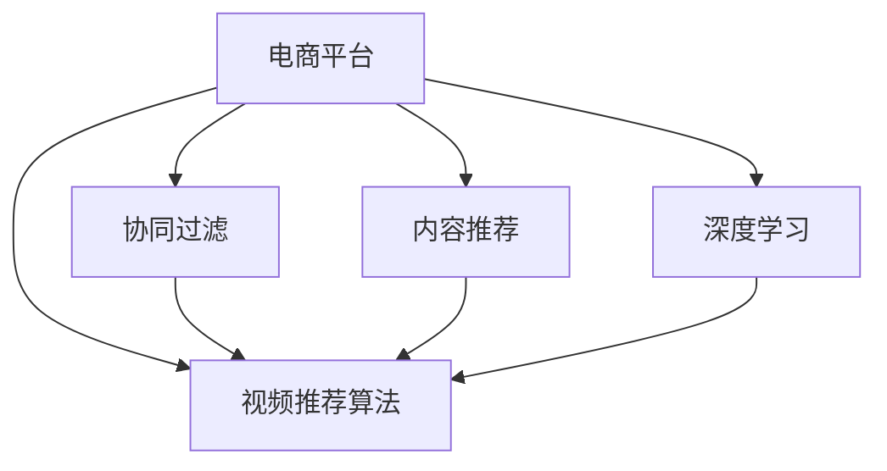

                 

# 电商平台中的视频推荐算法与应用

> 关键词：电商平台,视频推荐算法,协同过滤,内容推荐,深度学习,深度神经网络

## 1. 背景介绍

### 1.1 问题由来
在当今的电商平台上，视频推荐已经成为提升用户体验和促进销售增长的重要手段。传统的文本推荐算法，如基于协同过滤的推荐方法，已经不能完全满足用户的多样化需求。而视频作为更直观、更生动的表达方式，能够更好地传达商品信息，增加用户的购买决策信心。因此，在电商平台中引入视频推荐算法，可以显著提升推荐系统的效果，增加用户的点击率和转化率。

然而，视频推荐算法涉及的问题复杂性远大于文本推荐。首先，视频数据量庞大，处理难度高；其次，视频推荐需要考虑多模态信息（视频、文本、用户行为等）的综合作用，模型设计和训练都具有挑战性。此外，视频推荐的效果很大程度上依赖于推荐算法的选择，以及算法参数的设置和优化。因此，如何设计高效、鲁棒的电商平台视频推荐算法，成为电商领域的一个重要研究方向。

### 1.2 问题核心关键点
视频推荐算法在电商平台中的应用，关键在于以下几个方面：

- **数据收集与处理**：电商平台需要收集大量的视频数据，包括商品介绍视频、用户生成内容视频等，并对这些数据进行预处理和标注。
- **算法选择与设计**：选择合适的推荐算法，如协同过滤、内容推荐、深度学习等，并设计合理的算法模型。
- **模型训练与优化**：使用电商平台的数据集训练推荐模型，并采用合适的优化策略提升模型效果。
- **推荐结果评估**：使用各种指标评估推荐效果，如点击率、转化率、用户满意度等，并进行模型调参和改进。

这些问题关键点共同构成了电商平台视频推荐算法的研究框架，为后续的详细分析奠定了基础。

## 2. 核心概念与联系

### 2.1 核心概念概述

为更好地理解电商平台中的视频推荐算法，本节将介绍几个密切相关的核心概念：

- **电商平台**：指通过互联网提供商品或服务交易的在线平台，如淘宝、京东、Amazon等。
- **视频推荐算法**：指用于电商平台中，根据用户历史行为和偏好，推荐相关视频内容的算法。
- **协同过滤**：一种基于用户历史行为和偏好相似性的推荐算法，常用于文本推荐，但也可应用于视频推荐。
- **内容推荐**：根据视频内容特征（如标签、关键字、主题等）进行推荐，适用于有大量结构化数据的视频推荐。
- **深度学习**：一类基于人工神经网络的机器学习方法，通过多层次的特征提取和表示学习，能够处理复杂的非线性关系，适用于视频推荐。

这些核心概念之间的逻辑关系可以通过以下Mermaid流程图来展示：



这个流程图展示了几大类推荐算法的联系与区别：

1. **协同过滤**：利用用户历史行为进行推荐，适用于视频推荐。
2. **内容推荐**：根据视频内容特征进行推荐，适用于有结构化数据的视频推荐。
3. **深度学习**：处理复杂的多模态数据，适用于视频推荐。

协同过滤和内容推荐通常用于文本推荐，而深度学习则适用于处理视频等复杂数据的视频推荐。

## 3. 核心算法原理 & 具体操作步骤
### 3.1 算法原理概述

电商平台中的视频推荐算法，主要是基于用户行为和视频内容特征的协同过滤、内容推荐和深度学习等方法进行设计的。

**协同过滤算法**：利用用户历史行为和偏好相似性，进行推荐。具体来说，可以计算用户之间的相似度，根据相似用户对视频的评分进行推荐。

**内容推荐算法**：根据视频内容的特征进行推荐。可以提取视频的关键词、标签、摘要等特征，并构建相应的特征向量，进行相似度计算，推荐最相关的视频。

**深度学习算法**：使用深度神经网络，学习视频、用户行为、文本等多种特征之间的复杂关系，进行推荐。可以采用序列模型（如RNN、GRU、LSTM等）或卷积神经网络（CNN）进行特征提取和表示学习。

### 3.2 算法步骤详解

基于视频推荐算法的核心步骤，本节将详细介绍其具体操作步骤：

**Step 1: 数据收集与预处理**

1. **视频数据收集**：收集电商平台中的商品介绍视频、用户生成内容视频等，并存储到服务器上。
2. **视频数据标注**：对视频进行标签标注，如商品类别、品牌、功能、使用场景等。
3. **用户行为数据收集**：收集用户的历史观看记录、点击记录、购买记录等行为数据。

**Step 2: 特征工程**

1. **视频特征提取**：提取视频的时间序列特征（如帧间差异、帧变化率等）、内容特征（如标签、关键字等）。
2. **用户特征提取**：提取用户的基本信息（如年龄、性别、职业等）、行为特征（如观看时间、点击次数等）。
3. **文本特征提取**：提取视频的文本描述、用户评价等文本特征。

**Step 3: 模型选择与训练**

1. **协同过滤模型训练**：选择适当的协同过滤算法，如基于用户的协同过滤、基于物品的协同过滤等，并使用用户历史行为和视频标签进行训练。
2. **内容推荐模型训练**：选择适当的特征表示方法，如TF-IDF、词袋模型等，并使用视频内容特征进行训练。
3. **深度学习模型训练**：选择适当的深度神经网络结构，如CNN、RNN、LSTM等，并使用视频、用户行为、文本等多种特征进行训练。

**Step 4: 推荐结果评估**

1. **推荐结果评估**：使用各种指标评估推荐效果，如点击率、转化率、用户满意度等。
2. **模型调参与改进**：根据评估结果，对模型进行调参和改进，提升推荐效果。

### 3.3 算法优缺点

电商平台中的视频推荐算法，具有以下优点：

- **效果显著**：采用协同过滤、内容推荐和深度学习等多种算法，能够适应不同类型的数据和场景，提升推荐效果。
- **灵活性高**：可根据实际情况，灵活选择和组合算法，设计适用于不同电商平台的推荐系统。
- **适应性强**：能够处理多模态数据，适用于不同类型的视频推荐需求。

同时，这些算法也存在一些缺点：

- **计算复杂度高**：协同过滤和深度学习算法需要大量的计算资源和时间，处理复杂的多模态数据。
- **数据质量要求高**：视频推荐算法的效果很大程度上依赖于数据的质量和标注的准确性，需要投入大量的时间和人力进行数据预处理和标注。
- **可解释性不足**：深度学习模型往往具有“黑盒”特性，难以解释推荐结果的生成过程，可能影响用户信任。

尽管存在这些局限性，但就目前而言，视频推荐算法已成为电商平台中不可或缺的重要技术手段。未来相关研究的重点在于如何进一步优化推荐算法，提高推荐效果的同时降低计算复杂度和数据需求。

### 3.4 算法应用领域

视频推荐算法在电商平台中的应用领域广泛，主要包括以下几个方面：

- **商品推荐**：推荐相关商品介绍视频，增加用户对商品的了解和购买意愿。
- **品牌推荐**：推荐品牌相关的视频内容，提升品牌曝光度和用户粘性。
- **活动推荐**：推荐促销活动相关的视频内容，增加活动参与度和用户参与度。
- **个性化推荐**：根据用户偏好和历史行为，推荐个性化视频内容，提升用户满意度。

除了上述这些经典应用外，视频推荐算法还被创新性地应用于广告投放、客服服务、内容创作等场景，为电商平台带来了更多的商业价值和社会效益。

## 4. 数学模型和公式 & 详细讲解 & 举例说明

### 4.1 数学模型构建

在电商平台中，视频推荐算法主要采用协同过滤、内容推荐和深度学习等方法进行建模。下面分别介绍这三种方法的数学模型构建。

**协同过滤算法**：
协同过滤算法通过计算用户之间的相似度，进行推荐。假设用户 $u$ 和物品 $i$ 的评分矩阵为 $R$，用户之间的相似度矩阵为 $P$。协同过滤算法的目标是找到与用户 $u$ 相似的其他用户，并使用这些用户的评分来预测用户 $u$ 对物品 $i$ 的评分。具体来说，可以使用余弦相似度或皮尔逊相关系数来计算用户之间的相似度，使用最近邻算法（KNN）来选取相似用户，并使用加权平均法或线性插值法来计算预测评分。

**内容推荐算法**：
内容推荐算法通过计算视频内容特征之间的相似度，进行推荐。假设视频 $j$ 的内容特征向量为 $f_j$，用户 $u$ 的特征向量为 $g_u$。内容推荐算法的目标是找到与用户 $u$ 最相似的视频，并使用这些视频的内容特征向量来预测用户 $u$ 对视频 $j$ 的评分。具体来说，可以使用余弦相似度或欧几里得距离来计算视频和用户之间的相似度，使用加权平均法或线性插值法来计算预测评分。

**深度学习算法**：
深度学习算法通过多层次的特征提取和表示学习，进行推荐。假设视频 $j$ 的特征向量为 $f_j$，用户 $u$ 的特征向量为 $g_u$，用户行为序列为 $S_u$，视频标签为 $L_j$。深度学习算法的目标是使用神经网络模型 $F$ 来学习视频、用户行为和标签之间的复杂关系，并使用模型 $F$ 预测用户对视频 $j$ 的评分。具体来说，可以使用多层感知器（MLP）、卷积神经网络（CNN）、循环神经网络（RNN）、长短期记忆网络（LSTM）等深度神经网络模型，并使用交叉熵损失函数来训练模型。

### 4.2 公式推导过程

以下分别介绍协同过滤算法、内容推荐算法和深度学习算法的公式推导过程。

**协同过滤算法**：
设用户 $u$ 和物品 $i$ 的评分矩阵为 $R \in \mathbb{R}^{m \times n}$，其中 $m$ 为物品数，$n$ 为用户数。设用户 $u$ 和物品 $i$ 的评分向量分别为 $r_u \in \mathbb{R}^{n}$ 和 $i_v \in \mathbb{R}^{m}$。设用户 $u$ 和物品 $i$ 的相似度向量为 $p_{ui} \in \mathbb{R}^{n}$。协同过滤算法的目标是最大化用户 $u$ 对物品 $i$ 的评分预测值与实际评分的误差最小化。

假设用户 $u$ 和物品 $i$ 的相似度向量为 $p_{ui} = \frac{\dot{r_u} \cdot \dot{r_i}}{\sqrt{\sum_{j=1}^n r_{uj}^2} \cdot \sqrt{\sum_{j=1}^m r_{ij}^2}}$，其中 $\dot{r_u} = [r_{u1}, r_{u2}, \dots, r_{un}]^T$ 和 $\dot{r_i} = [r_{i1}, r_{i2}, \dots, r_{im}]^T$。设用户 $u$ 对物品 $i$ 的评分预测值为 $\hat{r}_{ui} = \sum_{j=1}^n p_{uj} \cdot r_{ij}$。则协同过滤算法的目标函数为：

$$
\min_{p_{ui}} \sum_{i=1}^m \left( r_{ui} - \hat{r}_{ui} \right)^2
$$

**内容推荐算法**：
设视频 $j$ 的内容特征向量为 $f_j \in \mathbb{R}^{d_j}$，用户 $u$ 的特征向量为 $g_u \in \mathbb{R}^{d_u}$。内容推荐算法的目标是最大化用户 $u$ 对视频 $j$ 的评分预测值与实际评分的误差最小化。

假设用户 $u$ 和视频 $j$ 的相似度向量为 $p_{uj} = \frac{\dot{g_u} \cdot \dot{f_j}}{\sqrt{\sum_{k=1}^{d_u} g_{uk}^2} \cdot \sqrt{\sum_{k=1}^{d_j} f_{jk}^2}}$，其中 $\dot{g_u} = [g_{u1}, g_{u2}, \dots, g_{ud_u}]^T$ 和 $\dot{f_j} = [f_{j1}, f_{j2}, \dots, f_{jd_j}]^T$。设用户 $u$ 对视频 $j$ 的评分预测值为 $\hat{r}_{uj} = \sum_{k=1}^{d_u} p_{uk} \cdot f_{jk}$。则内容推荐算法的目标函数为：

$$
\min_{p_{uj}} \sum_{j=1}^n \left( r_{uj} - \hat{r}_{uj} \right)^2
$$

**深度学习算法**：
设视频 $j$ 的特征向量为 $f_j \in \mathbb{R}^{d_j}$，用户 $u$ 的特征向量为 $g_u \in \mathbb{R}^{d_u}$，用户行为序列为 $S_u \in \mathbb{R}^{m_u \times t}$，视频标签为 $L_j \in \mathbb{R}^{k_j}$。深度学习算法的目标是使用神经网络模型 $F$ 来学习视频、用户行为和标签之间的复杂关系，并使用模型 $F$ 预测用户对视频 $j$ 的评分。

假设神经网络模型 $F$ 的输入为 $(x_u, y_j)$，其中 $x_u$ 为用户 $u$ 的特征向量，$y_j$ 为视频 $j$ 的特征向量，输出为 $\hat{r}_{uj}$。深度学习算法的目标函数为：

$$
\min_{\theta} \sum_{i=1}^m \left( r_{ui} - \hat{r}_{ui} \right)^2
$$

其中 $\theta$ 为神经网络模型的参数。

### 4.3 案例分析与讲解

下面以电商平台中的商品推荐为例，进行详细案例分析。

假设电商平台中有 $M$ 个商品，每个商品有一个介绍视频。用户 $u$ 在平台上浏览了商品 $1, 2, 3$，并且分别给出了 $5$、$4$、$3$ 的评分。平台有 $N$ 个用户，每个用户都观看过 $10$ 个商品，并且给出了 $5, 4, 3$ 的评分。现在平台需要根据用户行为，推荐用户可能感兴趣的商品。

1. **数据收集与预处理**：收集用户行为数据和视频数据，并对视频进行标签标注。
2. **特征工程**：提取视频的时间序列特征、内容特征和用户行为特征。
3. **协同过滤模型训练**：使用余弦相似度计算用户之间的相似度，使用最近邻算法选取相似用户，并使用加权平均法计算预测评分。
4. **推荐结果评估**：使用点击率和转化率等指标评估推荐效果，并根据评估结果调整模型参数。

## 5. 项目实践：代码实例和详细解释说明

### 5.1 开发环境搭建

在进行视频推荐算法实践前，我们需要准备好开发环境。以下是使用Python进行TensorFlow和Keras开发的环境配置流程：

1. 安装Anaconda：从官网下载并安装Anaconda，用于创建独立的Python环境。

2. 创建并激活虚拟环境：
```bash
conda create -n tf-env python=3.8 
conda activate tf-env
```

3. 安装TensorFlow和Keras：
```bash
pip install tensorflow==2.7.0
pip install keras==2.7.0
```

4. 安装各类工具包：
```bash
pip install numpy pandas scikit-learn matplotlib tqdm jupyter notebook ipython
```

完成上述步骤后，即可在`tf-env`环境中开始视频推荐算法实践。

### 5.2 源代码详细实现

下面我们以电商平台中的商品推荐为例，给出使用TensorFlow和Keras进行协同过滤算法的PyTorch代码实现。

首先，定义协同过滤算法的模型结构：

```python
import tensorflow as tf
from tensorflow.keras.layers import Input, Embedding, Dot, Dense

class CollaborativeFiltering(tf.keras.Model):
    def __init__(self, num_users, num_items, embedding_dim):
        super(CollaborativeFiltering, self).__init__()
        self.num_users = num_users
        self.num_items = num_items
        self.embedding_dim = embedding_dim
        
        # 用户嵌入层
        self.user_embedding = Embedding(num_users, embedding_dim)
        # 物品嵌入层
        self.item_embedding = Embedding(num_items, embedding_dim)
        # 相似度计算层
        self.dot_product = Dot(axes=[2, 2])
        # 输出层
        self.output_layer = Dense(1, activation='sigmoid')

    def call(self, user_id, item_id):
        user_vec = self.user_embedding(user_id)
        item_vec = self.item_embedding(item_id)
        similarity = self.dot_product([user_vec, item_vec])
        prediction = self.output_layer(similarity)
        return prediction
```

然后，定义数据生成器和数据加载器：

```python
def generate_data(num_users, num_items, num_features):
    user_ids = tf.random.uniform([num_users], minval=0, maxval=num_users, dtype=tf.int32)
    item_ids = tf.random.uniform([num_users, num_features], minval=0, maxval=num_items, dtype=tf.int32)
    ratings = tf.random.uniform([num_users, num_features], minval=0, maxval=5, dtype=tf.float32)
    return user_ids, item_ids, ratings

# 数据生成器
def data_generator():
    num_users = 1000
    num_items = 1000
    num_features = 10
    num_epochs = 10
    
    user_ids, item_ids, ratings = generate_data(num_users, num_items, num_features)
    
    for epoch in range(num_epochs):
        for i in range(len(user_ids)):
            user_id = user_ids[i]
            item_id = item_ids[i]
            rating = ratings[i]
            yield (user_id, item_id), rating

# 数据加载器
train_generator = tf.data.Dataset.from_generator(data_generator, output_signature=(tf.int32, tf.int32, tf.float32)).batch(32)
```

接着，训练模型并输出预测结果：

```python
# 初始化模型
model = CollaborativeFiltering(num_users, num_items, embedding_dim)

# 定义优化器
optimizer = tf.keras.optimizers.Adam(learning_rate=0.01)

# 定义损失函数
loss_fn = tf.keras.losses.BinaryCrossentropy()

# 训练模型
model.compile(optimizer=optimizer, loss=loss_fn, metrics=['mae'])
model.fit(train_generator, epochs=num_epochs, validation_split=0.2)

# 预测结果
user_id = tf.constant([0])
item_id = tf.constant([0])
prediction = model(user_id, item_id).numpy()
print('Prediction:', prediction)
```

以上就是使用TensorFlow和Keras进行协同过滤算法的完整代码实现。可以看到，借助TensorFlow和Keras的强大封装能力，协同过滤算法的代码实现变得简洁高效。

### 5.3 代码解读与分析

让我们再详细解读一下关键代码的实现细节：

**CollaborativeFiltering类**：
- `__init__`方法：初始化模型参数，定义用户嵌入层、物品嵌入层、相似度计算层和输出层。
- `call`方法：定义模型前向传播过程，使用嵌入层和相似度计算层计算预测评分。

**data_generator函数**：
- 生成随机用户、物品和评分数据。

**data_loader函数**：
- 将生成器转化为TensorFlow数据集，并指定批次大小。

**训练模型**：
- 初始化模型、定义优化器和损失函数。
- 使用`compile`方法配置模型训练参数。
- 使用`fit`方法进行模型训练，并设置验证集比例。

**预测结果**：
- 使用`call`方法计算预测评分。

可以看到，TensorFlow和Keras使得协同过滤算法的代码实现变得简洁高效。开发者可以将更多精力放在数据处理、模型改进等高层逻辑上，而不必过多关注底层的实现细节。

当然，工业级的系统实现还需考虑更多因素，如模型的保存和部署、超参数的自动搜索、更灵活的任务适配层等。但核心的协同过滤算法基本与此类似。

## 6. 实际应用场景

### 6.1 智能客服系统

在智能客服系统中，视频推荐算法可以用于推荐与用户当前对话内容相关的商品介绍视频。例如，用户正在询问某款手机的情况，系统可以推荐该手机的详细介绍视频，帮助用户更好地了解产品信息。这不仅提高了用户满意度，还能增加用户的购买意愿。

### 6.2 电商直播平台

在电商直播平台上，视频推荐算法可以用于推荐与当前直播内容相关的商品视频。例如，用户正在观看某款美妆产品的直播，系统可以推荐这款产品的介绍视频，增加用户对产品的了解和购买意愿。这不仅提高了直播的互动性，还能促进直播销售的转化率。

### 6.3 个性化推荐系统

在个性化推荐系统中，视频推荐算法可以用于推荐用户可能感兴趣的商品视频。例如，系统可以根据用户的历史行为和偏好，推荐与用户最近浏览的商品相关的视频内容，提升用户对商品的认知和购买意愿。这不仅提高了用户的个性化推荐效果，还能增加用户的停留时间和转化率。

### 6.4 视频内容推荐

在视频内容推荐系统中，视频推荐算法可以用于推荐用户可能感兴趣的视频内容。例如，系统可以根据用户的历史行为和偏好，推荐与用户最近观看的视频相关的其他视频内容，增加用户的观看时长和粘性。这不仅提高了视频内容推荐的精准度，还能提升用户的观看体验。

## 7. 工具和资源推荐

### 7.1 学习资源推荐

为了帮助开发者系统掌握视频推荐算法，这里推荐一些优质的学习资源：

1. 《推荐系统实战》系列博文：由知名推荐系统专家撰写，深入浅出地介绍了推荐系统的工作原理和实现细节，包括协同过滤、内容推荐、深度学习等。

2. 斯坦福大学CS20SI课程：斯坦福大学开设的推荐系统课程，涵盖推荐系统基本概念和经典模型，有Lecture视频和配套作业。

3. 《推荐系统》书籍：推荐系统领域的经典著作，详细介绍了推荐系统的设计、实现和评估方法，包括协同过滤、内容推荐、深度学习等。

4. TensorFlow官方文档：TensorFlow官方文档，提供了大量推荐系统的实现案例和工具库，是上手实践的必备资料。

5. GitHub推荐系统开源项目：GitHub上众多推荐系统开源项目，涵盖协同过滤、内容推荐、深度学习等，是学习和研究推荐系统的绝佳资源。

通过对这些资源的学习实践，相信你一定能够快速掌握视频推荐算法的精髓，并用于解决实际的推荐问题。

### 7.2 开发工具推荐

高效的开发离不开优秀的工具支持。以下是几款用于视频推荐算法开发的常用工具：

1. TensorFlow：基于Google的深度学习框架，灵活动态的计算图，适合快速迭代研究。

2. Keras：基于TensorFlow的高级神经网络API，提供了丰富的深度学习模型和组件，适合快速实现推荐算法。

3. PyTorch：基于Python的开源深度学习框架，灵活的动态图，适合快速实现和部署推荐系统。

4. Weights & Biases：模型训练的实验跟踪工具，可以记录和可视化模型训练过程中的各项指标，方便对比和调优。

5. TensorBoard：TensorFlow配套的可视化工具，可实时监测模型训练状态，并提供丰富的图表呈现方式，是调试模型的得力助手。

6. Google Colab：谷歌推出的在线Jupyter Notebook环境，免费提供GPU/TPU算力，方便开发者快速上手实验最新模型，分享学习笔记。

合理利用这些工具，可以显著提升视频推荐算法的开发效率，加快创新迭代的步伐。

### 7.3 相关论文推荐

视频推荐算法的研究源于学界的持续研究。以下是几篇奠基性的相关论文，推荐阅读：

1. BPR: Bayesian Personalized Ranking from Pairwise Preferences（即BPR算法）：提出了一种基于用户-物品评分矩阵的协同过滤算法，广泛应用于推荐系统。

2. Matrix Factorization Techniques for Recommender Systems（即SVD算法）：提出了一种基于矩阵分解的推荐算法，适用于大规模推荐系统的实现。

3. Neural Collaborative Filtering（即NCF算法）：提出了一种基于深度神经网络的协同过滤算法，适用于处理多模态数据。

4. Attention-Based Recommender Systems：提出了一种基于注意力机制的推荐算法，适用于处理复杂的多模态数据。

5. Multi-Aspect Recommendation Mining for Web Content-Based Recommendation Systems：提出了一种基于多维度特征的推荐算法，适用于处理文本推荐问题。

这些论文代表了大语言模型微调技术的发展脉络。通过学习这些前沿成果，可以帮助研究者把握学科前进方向，激发更多的创新灵感。

## 8. 总结：未来发展趋势与挑战

### 8.1 总结

本文对电商平台中的视频推荐算法进行了全面系统的介绍。首先阐述了视频推荐算法在电商平台中的重要性和应用场景，明确了推荐算法的选择和设计方向。其次，从原理到实践，详细讲解了协同过滤、内容推荐和深度学习等视频推荐算法的数学原理和操作步骤，给出了推荐算法的完整代码实现。同时，本文还广泛探讨了视频推荐算法在智能客服、电商直播、个性化推荐等多个场景中的应用前景，展示了视频推荐算法的巨大潜力。此外，本文精选了推荐算法的各类学习资源，力求为读者提供全方位的技术指引。

通过本文的系统梳理，可以看到，电商平台中的视频推荐算法正在成为推荐系统的重要组成部分，极大地提升了电商平台的商品推荐效果和用户体验。未来，伴随推荐算法设计和实现技术的不断进步，电商平台的视频推荐系统将进一步提升推荐精准度，降低用户搜索成本，推动电商平台的商业价值最大化。

### 8.2 未来发展趋势

展望未来，视频推荐算法的发展趋势如下：

1. **多模态融合**：视频推荐算法将进一步融合文本、图像、语音等多种模态数据，提升推荐效果。
2. **深度学习融合**：深度学习技术将进一步应用于推荐系统，提升推荐算法的复杂关系建模能力。
3. **联邦学习**：通过联邦学习技术，推荐系统可以在保护用户隐私的前提下，实现跨平台数据共享和协同推荐。
4. **强化学习**：通过强化学习技术，推荐系统可以实现动态调整推荐策略，提升推荐效果。
5. **迁移学习**：通过迁移学习技术，推荐系统可以实现跨平台、跨任务的数据迁移，提升推荐效果。
6. **模型压缩和加速**：视频推荐算法需要处理大规模数据，模型压缩和加速技术将进一步提升推荐系统的实时性和效率。

以上趋势凸显了视频推荐算法的发展潜力，未来的研究需要在推荐算法、数据处理、计算效率等各个环节进行全面优化，才能真正实现电商平台的智能化转型。

### 8.3 面临的挑战

尽管视频推荐算法在电商平台中取得了显著效果，但在其发展过程中也面临着诸多挑战：

1. **数据质量和标注**：视频推荐算法的效果很大程度上依赖于数据的质量和标注的准确性，需要投入大量的时间和人力进行数据预处理和标注。
2. **计算资源需求高**：视频推荐算法需要处理大规模数据，需要高性能的计算资源和时间，可能面临计算成本高昂的问题。
3. **模型复杂度高**：视频推荐算法需要处理多模态数据，模型结构复杂，需要更多的调试和优化。
4. **可解释性不足**：深度学习模型往往具有“黑盒”特性，难以解释推荐结果的生成过程，可能影响用户信任。
5. **隐私和安全**：视频推荐算法需要处理用户的隐私数据，可能面临数据泄露和隐私保护的问题。

尽管存在这些挑战，但通过不断的研究和优化，相信视频推荐算法将在电商平台上发挥更大的作用，提升推荐系统的精准度和用户体验。

### 8.4 研究展望

面对视频推荐算法面临的挑战，未来的研究需要在以下几个方面寻求新的突破：

1. **高效数据处理**：研究和开发高效的视频数据处理技术，降低数据标注和预处理的成本和时间。
2. **模型压缩和加速**：研究和开发高效的视频推荐算法，提升推荐系统的实时性和效率。
3. **可解释性增强**：研究和开发可解释的推荐算法，增强模型的透明性和用户信任。
4. **隐私保护**：研究和开发隐私保护技术，确保用户数据的安全和隐私保护。
5. **多模态融合**：研究和开发多模态融合技术，提升推荐系统的多模态数据处理能力。

这些研究方向的探索发展，必将引领视频推荐算法迈向更高的台阶，为电商平台推荐系统的智能化和精准化提供更多的技术支撑。面向未来，视频推荐算法需要与其他人工智能技术进行更深入的融合，如知识表示、因果推理、强化学习等，多路径协同发力，共同推动电商平台的商业价值和社会效益最大化。只有勇于创新、敢于突破，才能不断拓展视频推荐算法的边界，让智能技术更好地服务于电商平台的发展。

## 9. 附录：常见问题与解答

**Q1：视频推荐算法是否适用于所有电商平台？**

A: 视频推荐算法在大多数电商平台中都能取得不错的效果，特别是对于数据量较大的电商平台。但对于一些数据量较少的电商平台，推荐效果可能不如文本推荐算法。因此，在应用视频推荐算法时，需要根据平台的特点进行评估和选择。

**Q2：如何优化视频推荐算法的训练效果？**

A: 优化视频推荐算法的训练效果，可以采用以下策略：
1. **数据增强**：通过数据扩充、数据清洗等方式，提高数据的质量和多样性。
2. **超参数调优**：通过网格搜索、随机搜索等方法，优化模型的超参数，提升模型的性能。
3. **模型融合**：采用多模型融合技术，结合不同模型的优势，提升推荐效果。
4. **特征工程**：通过特征工程技术，提取更有效的特征，提升模型的表现。
5. **评估指标选择**：选择适当的评估指标，如点击率、转化率、用户满意度等，指导模型训练和优化。

**Q3：视频推荐算法在实际应用中需要注意哪些问题？**

A: 在实际应用中，视频推荐算法需要注意以下问题：
1. **数据质量**：确保视频数据和用户行为数据的准确性和完整性。
2. **用户隐私**：保护用户的隐私数据，避免数据泄露和滥用。
3. **模型效率**：确保模型的高效性和实时性，避免模型推理时间过长。
4. **算法公平性**：确保推荐算法的公平性和公正性，避免偏见和歧视。
5. **用户反馈**：及时收集用户的反馈信息，调整推荐策略，提升用户体验。

**Q4：视频推荐算法在未来的发展方向是什么？**

A: 视频推荐算法在未来的发展方向如下：
1. **多模态融合**：进一步融合文本、图像、语音等多种模态数据，提升推荐效果。
2. **深度学习融合**：通过深度学习技术，提升推荐算法的复杂关系建模能力。
3. **联邦学习**：通过联邦学习技术，实现跨平台数据共享和协同推荐。
4. **强化学习**：通过强化学习技术，动态调整推荐策略，提升推荐效果。
5. **迁移学习**：通过迁移学习技术，实现跨平台、跨任务的数据迁移，提升推荐效果。

这些发展方向将推动视频推荐算法向更加智能化、精准化、个性化、隐私保护的方向发展。

**Q5：如何评估视频推荐算法的性能？**

A: 视频推荐算法的性能评估通常包括以下几个指标：
1. **点击率**：用户点击推荐视频的概率。
2. **转化率**：用户购买推荐商品的概率。
3. **用户满意度**：用户对推荐结果的满意度。
4. **覆盖率**：推荐视频对用户兴趣的覆盖程度。
5. **个性化程度**：推荐视频与用户兴趣的匹配程度。

这些指标可以综合反映视频推荐算法的性能表现，指导模型训练和优化。

---

作者：禅与计算机程序设计艺术 / Zen and the Art of Computer Programming

