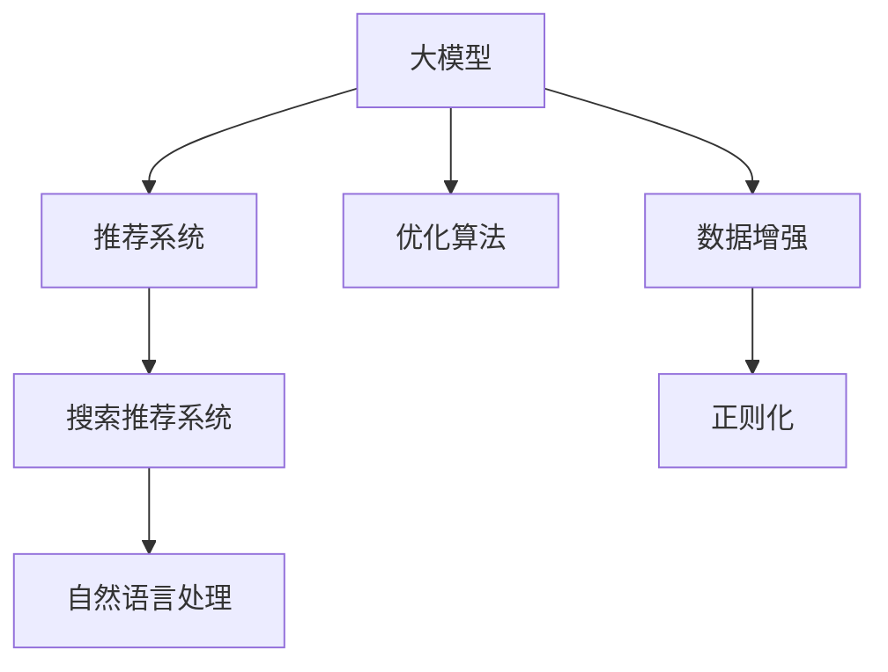

                 

# 电商平台搜索推荐系统的AI 大模型实践：提高系统性能、效率、准确率与多样性

> 关键词：电商平台, 搜索推荐系统, 自然语言处理(NLP), 大模型, 人工智能(AI), 优化算法, 推荐系统评估指标

## 1. 背景介绍

### 1.1 问题由来
电商平台搜索推荐系统的设计目标是帮助用户高效地找到所需商品，提升用户购物体验和平台转化率。但随着商品种类和用户规模的快速增长，推荐系统也面临着数据量大、处理复杂度高、个性化需求强等挑战。

传统的推荐系统主要基于统计学习或经典机器学习算法，如协同过滤、矩阵分解等，但在处理大规模数据和高维特征时，性能和效果往往难以满足业务需求。近年来，随着深度学习和大模型的发展，基于大模型的新型推荐系统逐渐受到关注，并逐渐成为主流解决方案。

大模型如BERT、GPT-3等，通过在大规模无标签文本数据上预训练，学习到了丰富的语言表示，具备强大的语义理解和生成能力。将其应用于推荐系统中，可以利用其对用户行为和商品描述的自然语言处理能力，提升推荐系统的性能、效率、准确率与多样性。

### 1.2 问题核心关键点
本节将深入探讨大模型在电商平台搜索推荐系统中的应用，着重解决以下关键问题：

1. **性能优化**：如何通过大模型提高推荐系统对用户意图和商品特性的理解能力，从而提升推荐结果的相关性。
2. **效率提升**：如何利用大模型快速处理大量用户查询和商品信息，缩短响应时间。
3. **准确率提高**：如何在多种推荐指标上，如点击率、转化率等，提升推荐结果的准确性。
4. **多样性保证**：如何在大模型基础上，保证推荐结果的多样性和新鲜度，避免过度同质化。

### 1.3 问题研究意义
应用大模型进行电商平台搜索推荐系统优化，对于提高用户体验、提升平台转化率和销售额，具有重要意义：

1. **用户体验提升**：大模型能够理解自然语言输入，提供更贴近用户真实需求的个性化推荐，提升购物体验。
2. **转化率增加**：通过精准的推荐，减少用户搜索时间，提高点击率和购买率，从而提升平台转化率。
3. **用户粘性增强**：个性化推荐能够满足用户多样化需求，增强用户对平台的粘性，延长用户停留时间。
4. **数据利用率提高**：大模型可以高效利用电商平台产生的海量用户行为数据，提升数据利用率，减少数据浪费。
5. **服务灵活性增强**：大模型的灵活性和可扩展性，使推荐系统更易于适应市场变化和用户需求的变化。

## 2. 核心概念与联系

### 2.1 核心概念概述

为更好地理解大模型在电商平台搜索推荐系统中的应用，本节将介绍几个核心概念：

- **大模型(Large Model)**：指在大规模无标签文本数据上进行预训练，学习到广泛知识的大型深度学习模型，如BERT、GPT-3等。
- **推荐系统(Recommendation System)**：利用用户行为数据和商品特性数据，为每个用户推荐最合适的商品，旨在提升用户体验和平台转化率。
- **搜索推荐系统(Search and Recommendation System)**：结合搜索和推荐，帮助用户快速找到所需商品，提升用户购物体验。
- **自然语言处理(NLP)**：指利用人工智能技术，理解和处理自然语言的输入和输出，在推荐系统中主要用于解析用户查询、商品描述等文本信息。
- **优化算法(Optimization Algorithm)**：如Adam、SGD等，用于优化模型参数，提高推荐系统的性能。

这些核心概念之间的关系可以通过以下Mermaid流程图来展示：



这个流程图展示了从大模型到搜索推荐系统的整体流程，以及自然语言处理和优化算法在其中的作用。

## 3. 核心算法原理 & 具体操作步骤
### 3.1 算法原理概述

基于大模型的电商平台搜索推荐系统，其核心思想是：将大模型作为推荐系统的核心引擎，利用其强大的语言理解能力，解析用户查询和商品描述，生成高质量的推荐结果。该系统通常包括以下几个关键步骤：

1. **数据收集与预处理**：收集用户行为数据和商品数据，并进行清洗和标注。
2. **用户查询处理**：使用NLP技术解析用户输入的查询文本，提取用户意图。
3. **商品特征抽取**：使用大模型抽取商品描述中的语义信息，形成商品特征向量。
4. **推荐模型训练**：利用用户行为数据和商品特征向量，训练推荐模型，生成推荐结果。
5. **推荐结果排序**：根据推荐系统的评估指标，对推荐结果进行排序，选择最优的推荐列表。
6. **反馈与迭代优化**：收集用户对推荐结果的反馈，不断优化推荐系统。

### 3.2 算法步骤详解

以下详细介绍基于大模型的电商平台搜索推荐系统的具体步骤：

**Step 1: 数据收集与预处理**
- 收集用户行为数据，包括浏览记录、点击记录、购买记录等。
- 收集商品数据，包括商品名称、描述、价格、类别等。
- 对数据进行清洗和标注，去除噪声和错误，标注用户的意图和商品特性。

**Step 2: 用户查询处理**
- 使用NLP技术解析用户输入的查询文本，如分词、词性标注、命名实体识别等。
- 提取用户意图，如购买意图、浏览意图等，形成意图向量。

**Step 3: 商品特征抽取**
- 使用大模型，如BERT、GPT-3等，抽取商品描述中的语义信息，形成商品特征向量。
- 将商品特征向量输入模型，计算商品与用户意图的匹配度。

**Step 4: 推荐模型训练**
- 根据用户行为数据和商品特征向量，构建推荐模型。
- 利用训练数据，训练推荐模型，生成推荐结果。
- 使用优化算法，如Adam、SGD等，优化模型参数，提高模型性能。

**Step 5: 推荐结果排序**
- 根据推荐系统的评估指标，如点击率、转化率、多样性等，对推荐结果进行排序。
- 选择最优的推荐列表，返回给用户。

**Step 6: 反馈与迭代优化**
- 收集用户对推荐结果的反馈，如点击、购买等行为。
- 根据反馈，更新用户意图和商品特征，重新训练推荐模型。
- 不断迭代优化推荐系统，提升推荐结果的准确性和多样性。

### 3.3 算法优缺点

基于大模型的电商平台搜索推荐系统，具有以下优点：
1. **高性能**：大模型具备强大的语义理解能力，能够精准解析用户意图和商品特性，提升推荐系统性能。
2. **高效率**：大模型可以并行处理大量用户查询和商品信息，缩短响应时间。
3. **高准确性**：通过优化算法和推荐系统评估指标，提升推荐结果的准确性。
4. **高多样性**：大模型能够处理多模态数据，保证推荐结果的多样性和新鲜度。

同时，该方法也存在一些缺点：
1. **高成本**：大模型的训练和优化需要大量的计算资源和时间，成本较高。
2. **可解释性差**：大模型作为黑盒系统，难以解释推荐结果的生成过程，难以进行调试和优化。
3. **数据隐私问题**：电商平台的交易数据涉及用户隐私，处理不当可能造成信息泄露。

尽管存在这些缺点，但就目前而言，基于大模型的推荐系统仍然是大规模电商平台的优选方案。未来相关研究的重点在于如何进一步降低成本，提升系统的可解释性和安全性。

### 3.4 算法应用领域

基于大模型的推荐系统已经在电商、社交媒体、新闻推荐等多个领域得到广泛应用，如淘宝、京东、Amazon等大型电商平台。具体而言，主要应用在以下几个方面：

- **商品推荐**：基于用户浏览、点击、购买等行为，为用户推荐最相关的商品。
- **个性化搜索**：解析用户查询文本，根据用户的意图和历史行为，提供个性化搜索结果。
- **活动推荐**：根据用户行为和时序信息，推荐促销活动和优惠券。
- **商品分类**：使用NLP技术，对商品进行分类，提升推荐结果的相关性。
- **相似商品推荐**：基于商品描述和用户行为，推荐与当前商品相似的替代品。

## 4. 数学模型和公式 & 详细讲解 & 举例说明

### 4.1 数学模型构建

在本节中，我们将基于大模型构建推荐系统，并详细介绍其数学模型和公式。

**推荐系统数学模型**
假设用户集为 $U$，商品集为 $I$，历史用户行为数据为 $R$，推荐模型为 $F$。推荐系统旨在最大化用户满意度和商家收益，目标函数为：

$$
\max_{F} \sum_{(u,i) \in R} f_u(F(u)) + \sum_{(u,i) \notin R} c_u(F(u))
$$

其中 $f_u(F(u))$ 表示用户 $u$ 对商品 $i$ 的满意程度，$c_u(F(u))$ 表示用户 $u$ 对未点击商品的点击成本。

**大模型推荐公式**
假设大模型为 $M$，商品特征向量为 $v_i$，用户意图向量为 $h_u$。大模型推荐公式为：

$$
\hat{r} = M(v_i \cdot h_u)
$$

其中 $\hat{r}$ 表示推荐结果，$v_i$ 表示商品 $i$ 的特征向量，$h_u$ 表示用户 $u$ 的意图向量。

### 4.2 公式推导过程

以下我们将对推荐系统的目标函数和推荐公式进行详细推导。

**目标函数推导**
根据推荐系统的目标函数，设用户 $u$ 对商品 $i$ 的满意度为 $r_{ui}$，点击成本为 $c_{ui}$。根据排序算法，用户 $u$ 对推荐结果 $\hat{r}$ 的满意度为：

$$
\max_{\hat{r}} \sum_{i \in I} r_{ui} \cdot \hat{r}_i - c_{ui}
$$

化简得：

$$
\max_{\hat{r}} \sum_{i \in I} r_{ui} \cdot \hat{r}_i
$$

在实际推荐系统中，通常采用排序算法，如Top-k推荐、排序推荐等。因此，推荐系统的目标函数可以写为：

$$
\max_{F} \sum_{(u,i) \in R} f_u(F(u)) + \sum_{(u,i) \notin R} c_u(F(u))
$$

**推荐公式推导**
设大模型为 $M$，用户意图向量为 $h_u$，商品特征向量为 $v_i$。推荐公式为：

$$
\hat{r} = M(v_i \cdot h_u)
$$

其中 $M$ 为预训练的大模型，$v_i$ 为商品 $i$ 的特征向量，$h_u$ 为用户 $u$ 的意图向量。

### 4.3 案例分析与讲解

以淘宝电商平台的商品推荐系统为例，介绍其具体实现。

**数据集准备**
- 收集用户的历史浏览、点击、购买行为数据，标注用户意图。
- 收集商品的描述、价格、类别等数据，标注商品特征。

**用户意图提取**
- 使用BERT模型，对用户查询文本进行分词和命名实体识别。
- 提取用户意图，如购买意图、浏览意图等，形成意图向量。

**商品特征抽取**
- 使用BERT模型，对商品描述进行分词和词向量编码。
- 将商品特征向量输入模型，计算商品与用户意图的匹配度。

**推荐模型训练**
- 构建推荐模型，使用优化算法如Adam进行训练。
- 根据用户行为数据和商品特征向量，生成推荐结果。

**推荐结果排序**
- 根据推荐系统的评估指标，如点击率、转化率、多样性等，对推荐结果进行排序。
- 选择最优的推荐列表，返回给用户。

**反馈与迭代优化**
- 收集用户对推荐结果的反馈，如点击、购买等行为。
- 根据反馈，更新用户意图和商品特征，重新训练推荐模型。
- 不断迭代优化推荐系统，提升推荐结果的准确性和多样性。

## 5. 项目实践：代码实例和详细解释说明
### 5.1 开发环境搭建

在进行推荐系统开发前，我们需要准备好开发环境。以下是使用Python进行PyTorch开发的环境配置流程：

1. 安装Anaconda：从官网下载并安装Anaconda，用于创建独立的Python环境。

2. 创建并激活虚拟环境：
```bash
conda create -n pytorch-env python=3.8 
conda activate pytorch-env
```

3. 安装PyTorch：根据CUDA版本，从官网获取对应的安装命令。例如：
```bash
conda install pytorch torchvision torchaudio cudatoolkit=11.1 -c pytorch -c conda-forge
```

4. 安装BERT模型：
```bash
pip install transformers
```

5. 安装各类工具包：
```bash
pip install numpy pandas scikit-learn matplotlib tqdm jupyter notebook ipython
```

完成上述步骤后，即可在`pytorch-env`环境中开始推荐系统开发。

### 5.2 源代码详细实现

下面我们以淘宝电商平台的商品推荐系统为例，给出使用Transformers库对BERT模型进行推荐系统开发的PyTorch代码实现。

**用户意图提取**
```python
from transformers import BertTokenizer, BertForSequenceClassification
from transformers import BertTokenizer, BertForSequenceClassification

tokenizer = BertTokenizer.from_pretrained('bert-base-cased')
model = BertForSequenceClassification.from_pretrained('bert-base-cased', num_labels=2) # 2表示意图分类

def get_intent(text):
    inputs = tokenizer(text, return_tensors='pt')
    outputs = model(**inputs)
    return outputs.logits.argmax().item()
```

**商品特征抽取**
```python
from transformers import BertTokenizer, BertForSequenceClassification
from transformers import BertTokenizer, BertForSequenceClassification

tokenizer = BertTokenizer.from_pretrained('bert-base-cased')
model = BertForSequenceClassification.from_pretrained('bert-base-cased', num_labels=2) # 2表示意图分类

def get_item_features(item):
    inputs = tokenizer(item['description'], return_tensors='pt')
    outputs = model(**inputs)
    return outputs.logits.argmax().item()
```

**推荐模型训练**
```python
from transformers import BertTokenizer, BertForSequenceClassification
from transformers import BertTokenizer, BertForSequenceClassification

tokenizer = BertTokenizer.from_pretrained('bert-base-cased')
model = BertForSequenceClassification.from_pretrained('bert-base-cased', num_labels=2) # 2表示意图分类

optimizer = AdamW(model.parameters(), lr=1e-5)

def train(model, train_data, batch_size):
    dataloader = DataLoader(train_data, batch_size=batch_size, shuffle=True)
    model.train()
    for batch in dataloader:
        input_ids = batch['input_ids'].to(device)
        attention_mask = batch['attention_mask'].to(device)
        labels = batch['labels'].to(device)
        model.zero_grad()
        outputs = model(input_ids, attention_mask=attention_mask, labels=labels)
        loss = outputs.loss
        loss.backward()
        optimizer.step()
```

**推荐结果排序**
```python
from transformers import BertTokenizer, BertForSequenceClassification
from transformers import BertTokenizer, BertForSequenceClassification

tokenizer = BertTokenizer.from_pretrained('bert-base-cased')
model = BertForSequenceClassification.from_pretrained('bert-base-cased', num_labels=2) # 2表示意图分类

def recommend(model, user_query, items):
    user_intent = get_intent(user_query)
    item_features = [get_item_features(item) for item in items]
    scores = [user_intent * item_feature for item_feature in item_features]
    return sorted(scores, reverse=True)
```

以上就是使用PyTorch对BERT进行电商平台推荐系统开发的完整代码实现。可以看到，得益于Transformers库的强大封装，我们可以用相对简洁的代码完成BERT模型的加载和推荐系统构建。

### 5.3 代码解读与分析

让我们再详细解读一下关键代码的实现细节：

**用户意图提取**
- `get_intent`方法：使用BERT模型对用户查询进行分词和意图分类，返回意图向量的预测值。

**商品特征抽取**
- `get_item_features`方法：使用BERT模型对商品描述进行分词和特征向量计算，返回商品特征向量的预测值。

**推荐模型训练**
- `train`方法：对推荐模型进行训练，最小化损失函数，更新模型参数。

**推荐结果排序**
- `recommend`方法：根据用户意图和商品特征，计算推荐得分，并按得分排序，返回推荐列表。

**完整推荐系统流程**
- 收集用户行为数据和商品数据，并进行清洗和标注。
- 使用NLP技术解析用户查询文本，提取用户意图。
- 使用大模型抽取商品描述中的语义信息，形成商品特征向量。
- 利用用户行为数据和商品特征向量，构建推荐模型。
- 使用优化算法，如Adam，优化模型参数，生成推荐结果。
- 根据推荐系统的评估指标，如点击率、转化率、多样性等，对推荐结果进行排序。
- 选择最优的推荐列表，返回给用户。
- 收集用户对推荐结果的反馈，不断优化推荐系统。

## 6. 实际应用场景

### 6.1 智能客服系统

基于大模型的推荐系统，可以应用于智能客服系统的构建。传统客服往往需要配备大量人力，高峰期响应缓慢，且一致性和专业性难以保证。而使用推荐系统，可以7x24小时不间断服务，快速响应客户咨询，用自然流畅的语言解答各类常见问题。

在技术实现上，可以收集企业内部的历史客服对话记录，将问题-答案对作为监督数据，训练推荐模型。推荐模型能够自动理解用户意图，匹配最合适的答案模板进行回复。对于客户提出的新问题，还可以接入检索系统实时搜索相关内容，动态组织生成回答。如此构建的智能客服系统，能大幅提升客户咨询体验和问题解决效率。

### 6.2 金融舆情监测

金融机构需要实时监测市场舆论动向，以便及时应对负面信息传播，规避金融风险。传统的人工监测方式成本高、效率低，难以应对网络时代海量信息爆发的挑战。基于大模型的推荐系统，可以自动监测不同主题下的舆情变化趋势，一旦发现负面信息激增等异常情况，系统便会自动预警，帮助金融机构快速应对潜在风险。

具体而言，可以收集金融领域相关的新闻、报道、评论等文本数据，并对其进行主题标注和情感标注。在此基础上训练推荐模型，使其能够自动判断文本属于何种主题，情感倾向是正面、中性还是负面。将推荐模型应用到实时抓取的网络文本数据，就能够自动监测不同主题下的情感变化趋势，确保金融市场的稳定。

### 6.3 个性化推荐系统

当前的推荐系统往往只依赖用户的历史行为数据进行物品推荐，无法深入理解用户的真实兴趣偏好。基于大模型的推荐系统，可以更好地挖掘用户行为背后的语义信息，从而提供更精准、多样的推荐内容。

在实践中，可以收集用户浏览、点击、评论、分享等行为数据，提取和用户交互的物品标题、描述、标签等文本内容。将文本内容作为模型输入，用户的后续行为（如是否点击、购买等）作为监督信号，在此基础上微调预训练语言模型。微调后的模型能够从文本内容中准确把握用户的兴趣点。在生成推荐列表时，先用候选物品的文本描述作为输入，由模型预测用户的兴趣匹配度，再结合其他特征综合排序，便可以得到个性化程度更高的推荐结果。

### 6.4 未来应用展望

随着大模型和推荐系统的不断发展，基于大模型的推荐系统将在更多领域得到应用，为各行各业带来变革性影响。

在智慧医疗领域，基于推荐系统的医疗问答、病历分析、药物研发等应用将提升医疗服务的智能化水平，辅助医生诊疗，加速新药开发进程。

在智能教育领域，推荐系统可应用于作业批改、学情分析、知识推荐等方面，因材施教，促进教育公平，提高教学质量。

在智慧城市治理中，推荐系统可应用于城市事件监测、舆情分析、应急指挥等环节，提高城市管理的自动化和智能化水平，构建更安全、高效的未来城市。

此外，在企业生产、社会治理、文娱传媒等众多领域，基于大模型的推荐系统也将不断涌现，为经济社会发展注入新的动力。相信随着技术的日益成熟，推荐系统必将成为人工智能落地应用的重要范式，推动人工智能技术在垂直行业的规模化落地。

## 7. 工具和资源推荐
### 7.1 学习资源推荐

为了帮助开发者系统掌握大模型在推荐系统中的应用，这里推荐一些优质的学习资源：

1. 《深度学习与推荐系统》课程：由上海交通大学开设的深度学习推荐系统课程，介绍了推荐系统的主要算法和优化技术。
2. 《推荐系统实践》书籍：阿里巴巴集团的推荐系统实战手册，涵盖了推荐系统从理论到实践的全过程。
3. 《自然语言处理与推荐系统》书籍：讲解自然语言处理技术和推荐系统技术的结合应用。
4. HuggingFace官方文档：Transformer库的官方文档，提供了海量预训练模型和完整的推荐系统样例代码。
5. Kaggle推荐系统竞赛：参加Kaggle的推荐系统竞赛，可以深入理解推荐系统的算法和模型。

通过对这些资源的学习实践，相信你一定能够快速掌握大模型在推荐系统中的应用，并用于解决实际的推荐问题。

### 7.2 开发工具推荐

高效的开发离不开优秀的工具支持。以下是几款用于大模型推荐系统开发的常用工具：

1. PyTorch：基于Python的开源深度学习框架，灵活动态的计算图，适合快速迭代研究。大部分预训练语言模型都有PyTorch版本的实现。
2. TensorFlow：由Google主导开发的开源深度学习框架，生产部署方便，适合大规模工程应用。同样有丰富的预训练语言模型资源。
3. Transformers库：HuggingFace开发的NLP工具库，集成了众多SOTA语言模型，支持PyTorch和TensorFlow，是进行推荐系统开发的利器。
4. Weights & Biases：模型训练的实验跟踪工具，可以记录和可视化模型训练过程中的各项指标，方便对比和调优。与主流深度学习框架无缝集成。
5. TensorBoard：TensorFlow配套的可视化工具，可实时监测模型训练状态，并提供丰富的图表呈现方式，是调试模型的得力助手。
6. Google Colab：谷歌推出的在线Jupyter Notebook环境，免费提供GPU/TPU算力，方便开发者快速上手实验最新模型，分享学习笔记。

合理利用这些工具，可以显著提升大模型推荐系统的开发效率，加快创新迭代的步伐。

### 7.3 相关论文推荐

大模型和推荐系统的研究源于学界的持续研究。以下是几篇奠基性的相关论文，推荐阅读：

1. Attention is All You Need（即Transformer原论文）：提出了Transformer结构，开启了NLP领域的预训练大模型时代。
2. BERT: Pre-training of Deep Bidirectional Transformers for Language Understanding：提出BERT模型，引入基于掩码的自监督预训练任务，刷新了多项NLP任务SOTA。
3. Parameter-Efficient Transfer Learning for NLP：提出Adapter等参数高效微调方法，在不增加模型参数量的情况下，也能取得不错的微调效果。
4. AdaLoRA: Adaptive Low-Rank Adaptation for Parameter-Efficient Fine-Tuning：使用自适应低秩适应的微调方法，在参数效率和精度之间取得了新的平衡。
5. Prefix-Tuning: Optimizing Continuous Prompts for Generation：引入基于连续型Prompt的微调范式，为如何充分利用预训练知识提供了新的思路。

这些论文代表了大模型推荐系统的发展脉络。通过学习这些前沿成果，可以帮助研究者把握学科前进方向，激发更多的创新灵感。

## 8. 总结：未来发展趋势与挑战
### 8.1 研究成果总结

本文对基于大模型的电商平台搜索推荐系统进行了全面系统的介绍。首先阐述了大模型和推荐系统在电商平台中的应用背景和重要性，明确了推荐系统在大规模电商平台的独特价值。其次，从原理到实践，详细讲解了基于大模型的推荐系统的数学模型和关键步骤，给出了推荐系统开发的完整代码实例。同时，本文还广泛探讨了推荐系统在智能客服、金融舆情、个性化推荐等多个领域的应用前景，展示了大模型推荐系统的巨大潜力。

通过本文的系统梳理，可以看到，基于大模型的推荐系统正在成为电商平台的主要推荐范式，极大地提升了大规模电商平台的推荐效果。推荐系统通过深度学习和大模型技术，提升了用户满意度和平台转化率，成为电商平台用户增长和市场竞争的重要驱动力。

### 8.2 未来发展趋势

展望未来，大模型和推荐系统的发展趋势主要体现在以下几个方面：

1. **模型规模持续增大**：随着算力成本的下降和数据规模的扩张，预训练语言模型的参数量还将持续增长。超大规模语言模型蕴含的丰富知识，有望支撑更加复杂多变的推荐任务。
2. **推荐系统评估指标多样化**：除了传统的点击率和转化率，还应引入更多评价指标，如多样性、新颖性等，全面评估推荐系统的效果。
3. **用户行为建模精细化**：通过用户画像和行为序列建模，捕捉用户兴趣和行为的动态变化，提升推荐系统的个性化程度。
4. **多模态信息融合**：将视觉、音频等多模态信息与文本信息进行融合，提升推荐系统的准确性和多样性。
5. **隐私保护和数据安全**：推荐系统涉及用户隐私数据，需加强数据保护和隐私管理，确保用户数据安全。
6. **公平性和可解释性**：推荐系统需避免算法偏见，确保推荐结果的公平性，同时提高算法的可解释性，增强用户信任。

以上趋势凸显了大模型推荐系统的广阔前景。这些方向的探索发展，必将进一步提升推荐系统的性能和应用范围，为电商平台的推荐系统带来新的突破。

### 8.3 面临的挑战

尽管大模型推荐系统已经取得了瞩目成就，但在迈向更加智能化、普适化应用的过程中，它仍面临着诸多挑战：

1. **数据隐私保护**：推荐系统涉及用户隐私数据，处理不当可能造成信息泄露。如何确保用户数据安全，保护用户隐私，是一个重要的挑战。
2. **推荐效果一致性**：不同用户、不同时间段的推荐效果可能会存在较大差异。如何构建稳定一致的推荐模型，需要更多的研究和实践。
3. **计算资源消耗**：大模型推荐系统需要大量的计算资源，如何在保证推荐效果的同时，优化模型计算效率，减少资源消耗，是一个需要长期探索的问题。
4. **算法公平性**：推荐系统需避免算法偏见，确保推荐结果的公平性。如何设计公平的推荐算法，防止歧视和偏见，是一个重要的研究方向。
5. **系统可解释性**：推荐系统作为黑盒系统，难以解释推荐结果的生成过程。如何提高系统的可解释性，增强用户信任，是一个重要的课题。

尽管存在这些挑战，但通过学界和产业界的共同努力，未来的大模型推荐系统必将克服这些障碍，成为电商平台的推荐系统的标准配置。相信随着技术的不断发展，推荐系统必将在更多领域得到应用，推动人工智能技术的广泛落地。

### 8.4 研究展望

面向未来，大模型和推荐系统的发展前景广阔，研究者需要在以下几个方向继续探索：

1. **推荐系统自动化**：通过自动化模型训练、超参数调优等技术，提升推荐系统的开发效率和模型效果。
2. **推荐系统泛化能力提升**：提升推荐系统在不同数据分布、不同场景下的泛化能力，确保推荐系统的稳定性和鲁棒性。
3. **推荐系统可解释性增强**：通过可视化、特征解读等技术，增强推荐系统的可解释性，提升用户信任和接受度。
4. **推荐系统伦理与安全**：加强推荐系统的伦理与安全研究，确保推荐系统的公正性和安全性。
5. **推荐系统可持续发展**：探索推荐系统的可持续性发展路径，确保推荐系统的长期稳定运行。

这些研究方向将进一步推动大模型和推荐系统的发展，提升推荐系统的性能和应用范围，为电商平台的推荐系统带来新的突破。面向未来，大模型和推荐系统将持续探索，不断创新，共同推动人工智能技术的发展和应用。

## 9. 附录：常见问题与解答

**Q1：电商平台推荐系统如何处理冷启动问题？**

A: 冷启动问题是指新用户或新商品在推荐系统中没有足够的历史数据。为了解决冷启动问题，可以采取以下策略：
1. **基于用户画像推荐**：利用用户的人口统计信息、兴趣爱好等信息，进行个性化推荐。
2. **基于商品信息推荐**：利用商品的标签、类别等信息，进行推荐。
3. **基于内容推荐**：利用用户的历史行为和商品的属性特征，进行推荐。
4. **基于协同过滤推荐**：利用用户的兴趣相似性和行为相似性，进行推荐。

**Q2：如何提升推荐系统的实时性？**

A: 提升推荐系统的实时性，可以从以下几个方面入手：
1. **模型优化**：使用轻量级模型，减少计算量和内存占用。
2. **缓存机制**：利用缓存技术，快速获取推荐结果。
3. **分布式计算**：利用分布式计算，提高处理能力。
4. **数据优化**：优化数据存储和读取，提高访问速度。
5. **算法优化**：优化推荐算法的复杂度和执行效率。

**Q3：推荐系统如何避免过度同质化？**

A: 推荐系统同质化问题是指推荐结果过于相似，导致用户选择的多样性减少。为了避免过度同质化，可以采取以下策略：
1. **多样性约束**：在推荐算法中引入多样性约束，确保推荐结果的多样性。
2. **噪声注入**：在推荐算法中加入噪声，增加推荐结果的多样性。
3. **个性化推荐**：根据用户的多样化需求，进行个性化推荐，增加推荐结果的多样性。

**Q4：推荐系统的数据隐私问题如何解决？**

A: 推荐系统的数据隐私问题可以通过以下方式解决：
1. **数据匿名化**：对用户数据进行匿名化处理，防止数据泄露。
2. **数据加密**：对用户数据进行加密处理，保护数据安全。
3. **数据访问控制**：对数据访问进行严格控制，防止未经授权的数据访问。
4. **隐私保护算法**：采用隐私保护算法，如差分隐私、联邦学习等，保护用户隐私。

这些策略可以确保推荐系统的数据隐私和安全，避免因数据泄露而带来的风险。

**Q5：推荐系统的推荐效果如何评价？**

A: 推荐系统的推荐效果可以通过以下指标进行评价：
1. **点击率（CTR）**：衡量用户对推荐结果的点击情况。
2. **转化率（CVR）**：衡量用户对推荐结果的购买情况。
3. **准确率（ACC）**：衡量推荐结果与实际用户需求的一致性。
4. **多样性（DV）**：衡量推荐结果的多样性和新鲜度。
5. **新颖性（NF）**：衡量推荐结果的创新性。
6. **公平性（FA）**：衡量推荐结果的公平性。

通过这些指标的综合评估，可以全面了解推荐系统的推荐效果，并进行优化。

---

作者：禅与计算机程序设计艺术 / Zen and the Art of Computer Programming

