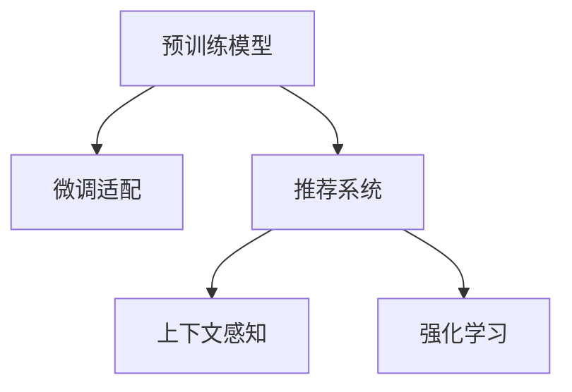

                 

# 电商平台搜索推荐系统的AI 大模型应用：提高转化率、用户体验与忠诚度

## 1. 背景介绍

### 1.1 问题由来
在当今电子商务时代，电商平台面临着激烈的市场竞争和日益增长的用户需求。如何通过智能化的推荐系统提高用户满意度、提升转化率和忠诚度，成为电商企业数字化转型的一个重要课题。传统的推荐系统依赖于用户行为数据的统计和特征工程，无法充分挖掘用户潜在的喜好和需求。而基于人工智能大模型的推荐系统，能够利用深度学习模型学习和理解用户行为背后的隐含语义，提供更加个性化、精准的推荐，从而极大地提升用户体验和业务指标。

### 1.2 问题核心关键点
AI大模型在电商搜索推荐系统中的应用，核心在于通过预训练学习大语言模型的通用语言表示，并在此基础上通过微调适配特定的电商数据分布，从而提升推荐系统的表现。主要包括以下几个关键点：

- **预训练模型**：使用大语言模型作为特征提取器，通过在大规模无标签电商数据上进行预训练，学习用户行为与商品属性之间的关系。
- **微调适配**：在预训练模型的基础上，使用电商平台的标注数据进行微调，调整模型参数以匹配电商数据分布。
- **个性化推荐**：利用微调后的模型，根据用户的行为、兴趣和历史购买数据，提供个性化商品推荐。
- **上下文理解**：考虑到上下文信息，如用户的浏览历史、时间、地理位置等，提升推荐的相关性和精准度。
- **模型更新**：定期在新的电商数据上进行微调，保持模型对用户行为和商品属性的最新理解。

### 1.3 问题研究意义
基于AI大模型的电商搜索推荐系统，具有以下显著研究意义：

1. **提升转化率**：通过精准推荐，帮助用户快速找到所需商品，提高购买意愿，从而提升平台转化率。
2. **优化用户体验**：个性化推荐系统能够提供与用户偏好一致的商品，增强用户粘性，提升用户满意度。
3. **提高用户忠诚度**：持续提供符合用户期望的商品推荐，增加用户重复访问频率，提高用户忠诚度。
4. **数据驱动决策**：通过深入分析用户行为数据，为电商平台提供数据驱动的决策支持，优化库存管理和价格策略。
5. **降低运营成本**：减少用户流失和重复购买率，提高广告投放效率，降低运营成本。

## 2. 核心概念与联系

### 2.1 核心概念概述

为更好地理解基于AI大模型的电商搜索推荐系统，本节将介绍几个密切相关的核心概念：

- **预训练模型**：使用大规模无标签数据训练的语言模型，如BERT、GPT等，学习通用语言表示。
- **微调适配**：在预训练模型的基础上，使用标注数据进行有监督学习，调整模型参数以适配特定任务。
- **推荐系统**：通过分析用户行为数据和商品属性信息，为用户推荐个性化商品。
- **上下文感知**：考虑用户行为的时序、位置等上下文信息，提升推荐的准确性。
- **强化学习**：通过用户反馈和互动，动态调整推荐策略，提升推荐效果。

这些核心概念之间的逻辑关系可以通过以下Mermaid流程图来展示：



这个流程图展示了大模型应用在电商推荐系统中的核心概念及其之间的关系：

1. 预训练模型提供通用的语言表示，为推荐系统打下基础。
2. 微调适配将预训练模型调整至电商数据的分布，提升推荐的准确性。
3. 推荐系统利用微调后的模型，根据用户行为和商品属性进行个性化推荐。
4. 上下文感知考虑用户行为的时序、位置等上下文信息，进一步提升推荐的相关性和精准度。
5. 强化学习通过用户反馈调整推荐策略，不断优化推荐效果。

这些概念共同构成了基于大模型的电商推荐系统的学习和应用框架，使其能够提供高质量、个性化的商品推荐。

## 3. 核心算法原理 & 具体操作步骤
### 3.1 算法原理概述

基于AI大模型的电商推荐系统，通过预训练和微调学习，将大模型应用于推荐系统中，利用其强大的语言理解和语义表示能力，提供个性化推荐。核心算法原理如下：

1. **预训练模型学习**：在大规模无标签电商数据上，使用自监督学习任务训练通用语言模型，学习商品名称、描述、用户行为等语义表示。

2. **微调适配**：在预训练模型的基础上，使用电商平台的标注数据进行微调，调整模型参数以匹配电商数据分布。微调过程中，通过选择合适的网络结构、损失函数和优化算法，对模型进行有监督学习。

3. **上下文感知推荐**：在微调后的模型上，结合用户浏览历史、搜索记录、地理位置等上下文信息，生成个性化的商品推荐列表。

4. **强化学习优化**：通过用户的点击、购买等反馈数据，利用强化学习算法动态调整推荐策略，提升推荐效果。

### 3.2 算法步骤详解

以下是基于AI大模型的电商推荐系统的一般流程：

**Step 1: 准备数据集**
- 收集电商平台的历史交易数据、用户行为数据、商品属性数据等。
- 将数据划分为训练集、验证集和测试集。
- 清洗、标注数据，去除噪声和异常值。

**Step 2: 预训练模型初始化**
- 选择预训练模型（如BERT、GPT等）进行初始化。
- 将电商数据输入模型，进行预训练。
- 保存预训练权重，用于后续微调。

**Step 3: 微调模型**
- 设计任务适配层，根据电商推荐任务的要求，调整输出层和损失函数。
- 选择合适的优化算法及其参数，如AdamW、SGD等，设置学习率、批大小、迭代轮数等。
- 设置正则化技术及强度，包括权重衰减、Dropout、Early Stopping等。
- 在电商训练集上执行梯度训练，周期性在验证集上评估模型性能。
- 重复上述步骤直至满足预设的迭代轮数或Early Stopping条件。

**Step 4: 推荐系统构建**
- 将微调后的模型应用于推荐系统。
- 结合上下文信息，生成个性化推荐列表。
- 定期在新的电商数据上进行微调，保持模型对用户行为和商品属性的最新理解。

### 3.3 算法优缺点

基于AI大模型的电商推荐系统具有以下优点：

1. **精度高**：利用深度学习模型的强大表示能力，能够提供高精度的个性化推荐。
2. **灵活性高**：大模型可以根据不同的电商数据进行微调，适应多种业务场景。
3. **可扩展性**：大模型能够快速适应新的电商数据，实现增量式微调。
4. **用户友好**：推荐系统能够提供符合用户兴趣的商品，提升用户满意度和忠诚度。

同时，该方法也存在一些局限性：

1. **数据依赖性强**：微调效果很大程度上取决于标注数据的质量和数量，获取高质量标注数据的成本较高。
2. **模型复杂度**：大模型的参数量较大，训练和推理所需资源较多。
3. **解释性不足**：大模型往往作为黑盒使用，难以解释其推荐决策过程。
4. **隐私风险**：电商平台需要收集用户行为数据，涉及隐私保护问题。

尽管存在这些局限性，但就目前而言，基于AI大模型的推荐系统仍然是电商推荐领域的主流方法。未来相关研究将更多地关注如何降低数据依赖性，提高模型的可解释性和隐私保护措施。

### 3.4 算法应用领域

基于AI大模型的电商推荐系统，在电商推荐领域已经得到了广泛的应用，具体包括：

- **商品推荐**：根据用户浏览历史、搜索记录等行为数据，提供个性化的商品推荐。
- **跨品类推荐**：结合用户对不同品类商品的偏好，推荐相关商品，提升购买转化率。
- **新用户推荐**：针对新注册用户，提供个性化的商品推荐，促进用户快速融入电商平台。
- **购物车推荐**：在用户添加商品到购物车后，推荐其他相关商品，提高购买决策的效率和满意度。
- **内容推荐**：结合用户的浏览记录和商品属性，推荐相关的商品信息、评价等，增强用户体验。
- **价格动态调整**：根据用户对商品的价格敏感度，动态调整商品价格，提升转化率和销售额。

除了上述这些经典应用外，AI大模型推荐系统还被创新性地应用到更多场景中，如广告投放优化、供应链管理、库存优化等，为电商平台带来了新的增长点。

## 4. 数学模型和公式 & 详细讲解

### 4.1 数学模型构建

假设电商平台的历史交易数据为 $D=\{(x_i,y_i)\}_{i=1}^N$，其中 $x_i$ 为用户行为数据，$y_i$ 为用户购买记录。基于大模型的电商推荐系统可以表示为：

$$
f(x_i; \theta) = M_{\theta}(x_i)
$$

其中 $M_{\theta}$ 为预训练模型，$\theta$ 为模型参数。

### 4.2 公式推导过程

在微调过程中，目标是最小化损失函数：

$$
\mathcal{L}(\theta) = -\frac{1}{N}\sum_{i=1}^N \log P(y_i | f(x_i; \theta))
$$

其中 $P(y_i | f(x_i; \theta))$ 为条件概率，表示在给定用户行为数据 $x_i$ 的情况下，购买记录 $y_i$ 的概率。

微调的优化目标是找到最优参数 $\theta^*$，使得损失函数最小化。一般使用梯度下降算法，更新模型参数：

$$
\theta \leftarrow \theta - \eta \nabla_{\theta} \mathcal{L}(\theta)
$$

其中 $\eta$ 为学习率。

### 4.3 案例分析与讲解

以电商平台的商品推荐为例，我们假设用户的行为数据为 $x_i=(b_i,c_i)$，其中 $b_i$ 为用户浏览商品名称，$c_i$ 为用户浏览商品类别。推荐系统的目标是预测用户是否购买商品，即 $y_i \in \{0,1\}$。

通过预训练模型 $M_{\theta}$，可以计算出每个商品名称和类别的表示，然后通过任务适配层，设计分类器的损失函数：

$$
\mathcal{L}(\theta) = -\frac{1}{N}\sum_{i=1}^N [y_i\log P_{\theta}(y_i | b_i,c_i)+(1-y_i)\log(1-P_{\theta}(y_i | b_i,c_i))]
$$

其中 $P_{\theta}(y_i | b_i,c_i)$ 为分类器的输出概率，可以通过softmax函数计算得到。

微调过程中，使用交叉熵损失函数，并通过AdamW等优化算法，更新模型参数，不断迭代优化，直到满足预设的收敛条件。

## 5. 项目实践：代码实例和详细解释说明

### 5.1 开发环境搭建

在进行电商推荐系统的开发前，我们需要准备好开发环境。以下是使用Python进行PyTorch开发的环境配置流程：

1. 安装Anaconda：从官网下载并安装Anaconda，用于创建独立的Python环境。

2. 创建并激活虚拟环境：
```bash
conda create -n e-commerce-env python=3.8 
conda activate e-commerce-env
```

3. 安装PyTorch：根据CUDA版本，从官网获取对应的安装命令。例如：
```bash
conda install pytorch torchvision torchaudio cudatoolkit=11.1 -c pytorch -c conda-forge
```

4. 安装各类工具包：
```bash
pip install numpy pandas scikit-learn matplotlib tqdm jupyter notebook ipython
```

完成上述步骤后，即可在`e-commerce-env`环境中开始电商推荐系统的开发。

### 5.2 源代码详细实现

下面我们以基于大模型的电商推荐系统为例，给出使用PyTorch和HuggingFace Transformers库的代码实现。

首先，定义数据处理函数：

```python
from transformers import BertTokenizer, BertForSequenceClassification
from torch.utils.data import Dataset, DataLoader
import torch

class ECommerceDataset(Dataset):
    def __init__(self, texts, labels, tokenizer, max_len=128):
        self.texts = texts
        self.labels = labels
        self.tokenizer = tokenizer
        self.max_len = max_len
        
    def __len__(self):
        return len(self.texts)
    
    def __getitem__(self, item):
        text = self.texts[item]
        label = self.labels[item]
        
        encoding = self.tokenizer(text, return_tensors='pt', max_length=self.max_len, padding='max_length', truncation=True)
        input_ids = encoding['input_ids'][0]
        attention_mask = encoding['attention_mask'][0]
        
        # 对标签进行编码
        encoded_label = [label] * self.max_len
        labels = torch.tensor(encoded_label, dtype=torch.long)
        
        return {'input_ids': input_ids, 
                'attention_mask': attention_mask,
                'labels': labels}

# 创建dataset
tokenizer = BertTokenizer.from_pretrained('bert-base-cased')

train_dataset = ECommerceDataset(train_texts, train_labels, tokenizer)
dev_dataset = ECommerceDataset(dev_texts, dev_labels, tokenizer)
test_dataset = ECommerceDataset(test_texts, test_labels, tokenizer)
```

然后，定义模型和优化器：

```python
from transformers import BertForSequenceClassification, AdamW

model = BertForSequenceClassification.from_pretrained('bert-base-cased', num_labels=2)

optimizer = AdamW(model.parameters(), lr=2e-5)
```

接着，定义训练和评估函数：

```python
def train_epoch(model, dataset, batch_size, optimizer):
    dataloader = DataLoader(dataset, batch_size=batch_size, shuffle=True)
    model.train()
    epoch_loss = 0
    for batch in dataloader:
        input_ids = batch['input_ids'].to(device)
        attention_mask = batch['attention_mask'].to(device)
        labels = batch['labels'].to(device)
        model.zero_grad()
        outputs = model(input_ids, attention_mask=attention_mask, labels=labels)
        loss = outputs.loss
        epoch_loss += loss.item()
        loss.backward()
        optimizer.step()
    return epoch_loss / len(dataloader)

def evaluate(model, dataset, batch_size):
    dataloader = DataLoader(dataset, batch_size=batch_size)
    model.eval()
    preds, labels = [], []
    with torch.no_grad():
        for batch in dataloader:
            input_ids = batch['input_ids'].to(device)
            attention_mask = batch['attention_mask'].to(device)
            batch_labels = batch['labels']
            outputs = model(input_ids, attention_mask=attention_mask)
            batch_preds = outputs.logits.argmax(dim=2).to('cpu').tolist()
            batch_labels = batch_labels.to('cpu').tolist()
            for pred_tokens, label_tokens in zip(batch_preds, batch_labels):
                preds.append(pred_tokens[:len(label_tokens)])
                labels.append(label_tokens)
                
    print(classification_report(labels, preds))
```

最后，启动训练流程并在测试集上评估：

```python
epochs = 5
batch_size = 16

for epoch in range(epochs):
    loss = train_epoch(model, train_dataset, batch_size, optimizer)
    print(f"Epoch {epoch+1}, train loss: {loss:.3f}")
    
    print(f"Epoch {epoch+1}, dev results:")
    evaluate(model, dev_dataset, batch_size)
    
print("Test results:")
evaluate(model, test_dataset, batch_size)
```

以上就是使用PyTorch和Transformers库对基于大模型的电商推荐系统进行微调训练的完整代码实现。可以看到，得益于Transformers库的强大封装，我们可以用相对简洁的代码完成大模型微调的开发。

### 5.3 代码解读与分析

让我们再详细解读一下关键代码的实现细节：

**ECommerceDataset类**：
- `__init__`方法：初始化文本、标签、分词器等关键组件。
- `__len__`方法：返回数据集的样本数量。
- `__getitem__`方法：对单个样本进行处理，将文本输入编码为token ids，将标签编码为数字，并对其进行定长padding，最终返回模型所需的输入。

**任务适配层**：
- 设计分类器的损失函数：使用交叉熵损失函数，计算模型输出与真实标签之间的差异。

**训练和评估函数**：
- 使用PyTorch的DataLoader对数据集进行批次化加载，供模型训练和推理使用。
- 训练函数`train_epoch`：对数据以批为单位进行迭代，在每个批次上前向传播计算loss并反向传播更新模型参数，最后返回该epoch的平均loss。
- 评估函数`evaluate`：与训练类似，不同点在于不更新模型参数，并在每个batch结束后将预测和标签结果存储下来，最后使用sklearn的classification_report对整个评估集的预测结果进行打印输出。

**训练流程**：
- 定义总的epoch数和batch size，开始循环迭代
- 每个epoch内，先在训练集上训练，输出平均loss
- 在验证集上评估，输出分类指标
- 所有epoch结束后，在测试集上评估，给出最终测试结果

可以看到，PyTorch配合Transformers库使得电商推荐系统的微调训练代码实现变得简洁高效。开发者可以将更多精力放在数据处理、模型改进等高层逻辑上，而不必过多关注底层的实现细节。

当然，工业级的系统实现还需考虑更多因素，如模型的保存和部署、超参数的自动搜索、更灵活的任务适配层等。但核心的微调范式基本与此类似。

## 6. 实际应用场景
### 6.1 智能客服系统

基于大模型的电商推荐系统，在智能客服系统的构建中也能发挥重要作用。传统客服往往需要配备大量人力，高峰期响应缓慢，且一致性和专业性难以保证。而使用基于大模型的智能推荐系统，可以7x24小时不间断服务，快速响应客户咨询，用自然流畅的语言解答各类常见问题。

在技术实现上，可以收集企业内部的历史客服对话记录，将问题和最佳答复构建成监督数据，在此基础上对预训练推荐模型进行微调。微调后的推荐模型能够自动理解用户意图，匹配最合适的答复模板进行回复。对于客户提出的新问题，还可以接入检索系统实时搜索相关内容，动态组织生成回答。如此构建的智能客服系统，能大幅提升客户咨询体验和问题解决效率。

### 6.2 金融舆情监测

金融机构需要实时监测市场舆论动向，以便及时应对负面信息传播，规避金融风险。传统的人工监测方式成本高、效率低，难以应对网络时代海量信息爆发的挑战。基于大语言模型微调的文本分类和情感分析技术，为金融舆情监测提供了新的解决方案。

具体而言，可以收集金融领域相关的新闻、报道、评论等文本数据，并对其进行主题标注和情感标注。在此基础上对预训练语言模型进行微调，使其能够自动判断文本属于何种主题，情感倾向是正面、中性还是负面。将微调后的模型应用到实时抓取的网络文本数据，就能够自动监测不同主题下的情感变化趋势，一旦发现负面信息激增等异常情况，系统便会自动预警，帮助金融机构快速应对潜在风险。

### 6.3 个性化推荐系统

当前的推荐系统往往只依赖用户的历史行为数据进行物品推荐，无法深入理解用户潜在的喜好和需求。基于大语言模型微调技术，个性化推荐系统可以更好地挖掘用户行为背后的语义信息，提供更加个性化、精准的推荐，从而极大地提升用户体验和业务指标。

在实践中，可以收集用户浏览、点击、评论、分享等行为数据，提取和用户交互的物品标题、描述、标签等文本内容。将文本内容作为模型输入，用户的后续行为（如是否点击、购买等）作为监督信号，在此基础上微调预训练语言模型。微调后的模型能够从文本内容中准确把握用户的兴趣点。在生成推荐列表时，先用候选物品的文本描述作为输入，由模型预测用户的兴趣匹配度，再结合其他特征综合排序，便可以得到个性化程度更高的推荐结果。

### 6.4 未来应用展望

随着大语言模型微调技术的发展，未来其在电商推荐系统中的应用将更加广泛和深入。以下是几个可能的应用场景：

1. **跨品类推荐**：结合用户对不同品类商品的偏好，推荐相关商品，提升购买转化率。
2. **新用户推荐**：针对新注册用户，提供个性化的商品推荐，促进用户快速融入电商平台。
3. **购物车推荐**：在用户添加商品到购物车后，推荐其他相关商品，提高购买决策的效率和满意度。
4. **内容推荐**：结合用户的浏览记录和商品属性，推荐相关的商品信息、评价等，增强用户体验。
5. **价格动态调整**：根据用户对商品的价格敏感度，动态调整商品价格，提升转化率和销售额。
6. **广告投放优化**：通过分析用户行为数据，优化广告投放策略，提高广告点击率和转化率。

除了上述这些经典应用外，AI大模型推荐系统还被创新性地应用到更多场景中，如库存优化、供应链管理等，为电商平台带来了新的增长点。相信随着预训练模型和微调方法的不断进步，基于大模型的电商推荐系统必将在更多领域大放异彩。

## 7. 工具和资源推荐
### 7.1 学习资源推荐

为了帮助开发者系统掌握大语言模型微调的理论基础和实践技巧，这里推荐一些优质的学习资源：

1. 《Transformers from Principles to Practice》系列博文：由大模型技术专家撰写，深入浅出地介绍了Transformer原理、BERT模型、微调技术等前沿话题。

2. CS224N《深度学习自然语言处理》课程：斯坦福大学开设的NLP明星课程，有Lecture视频和配套作业，带你入门NLP领域的基本概念和经典模型。

3. 《Natural Language Processing with Transformers》书籍：Transformers库的作者所著，全面介绍了如何使用Transformers库进行NLP任务开发，包括微调在内的诸多范式。

4. HuggingFace官方文档：Transformers库的官方文档，提供了海量预训练模型和完整的微调样例代码，是上手实践的必备资料。

5. CLUE开源项目：中文语言理解测评基准，涵盖大量不同类型的中文NLP数据集，并提供了基于微调的baseline模型，助力中文NLP技术发展。

通过对这些资源的学习实践，相信你一定能够快速掌握大语言模型微调的精髓，并用于解决实际的NLP问题。
###  7.2 开发工具推荐

高效的开发离不开优秀的工具支持。以下是几款用于大语言模型微调开发的常用工具：

1. PyTorch：基于Python的开源深度学习框架，灵活动态的计算图，适合快速迭代研究。大部分预训练语言模型都有PyTorch版本的实现。

2. TensorFlow：由Google主导开发的开源深度学习框架，生产部署方便，适合大规模工程应用。同样有丰富的预训练语言模型资源。

3. Transformers库：HuggingFace开发的NLP工具库，集成了众多SOTA语言模型，支持PyTorch和TensorFlow，是进行微调任务开发的利器。

4. Weights & Biases：模型训练的实验跟踪工具，可以记录和可视化模型训练过程中的各项指标，方便对比和调优。与主流深度学习框架无缝集成。

5. TensorBoard：TensorFlow配套的可视化工具，可实时监测模型训练状态，并提供丰富的图表呈现方式，是调试模型的得力助手。

6. Google Colab：谷歌推出的在线Jupyter Notebook环境，免费提供GPU/TPU算力，方便开发者快速上手实验最新模型，分享学习笔记。

合理利用这些工具，可以显著提升大语言模型微调任务的开发效率，加快创新迭代的步伐。

### 7.3 相关论文推荐

大语言模型和微调技术的发展源于学界的持续研究。以下是几篇奠基性的相关论文，推荐阅读：

1. Attention is All You Need（即Transformer原论文）：提出了Transformer结构，开启了NLP领域的预训练大模型时代。

2. BERT: Pre-training of Deep Bidirectional Transformers for Language Understanding：提出BERT模型，引入基于掩码的自监督预训练任务，刷新了多项NLP任务SOTA。

3. Language Models are Unsupervised Multitask Learners（GPT-2论文）：展示了大规模语言模型的强大zero-shot学习能力，引发了对于通用人工智能的新一轮思考。

4. Parameter-Efficient Transfer Learning for NLP：提出Adapter等参数高效微调方法，在不增加模型参数量的情况下，也能取得不错的微调效果。

5. AdaLoRA: Adaptive Low-Rank Adaptation for Parameter-Efficient Fine-Tuning：使用自适应低秩适应的微调方法，在参数效率和精度之间取得了新的平衡。

这些论文代表了大语言模型微调技术的发展脉络。通过学习这些前沿成果，可以帮助研究者把握学科前进方向，激发更多的创新灵感。

## 8. 总结：未来发展趋势与挑战

### 8.1 总结

本文对基于AI大模型的电商搜索推荐系统进行了全面系统的介绍。首先阐述了电商搜索推荐系统的重要性和大模型的应用背景，明确了微调在拓展预训练模型应用、提升推荐系统表现方面的独特价值。其次，从原理到实践，详细讲解了微调算法的数学模型和实现步骤，给出了电商推荐系统的完整代码实例。同时，本文还广泛探讨了微调方法在智能客服、金融舆情、个性化推荐等多个领域的应用前景，展示了微调范式的巨大潜力。此外，本文精选了微调技术的各类学习资源，力求为读者提供全方位的技术指引。

通过本文的系统梳理，可以看到，基于大模型的电商推荐系统正在成为电商推荐领域的重要范式，极大地提升了电商平台的业务指标和用户体验。未来，伴随预训练模型和微调方法的持续演进，基于大模型的推荐系统必将在更多领域大放异彩，为电商平台带来新的增长点和竞争优势。

### 8.2 未来发展趋势

展望未来，基于AI大模型的电商搜索推荐系统将呈现以下几个发展趋势：

1. **模型规模持续增大**：随着算力成本的下降和数据规模的扩张，预训练语言模型的参数量还将持续增长。超大规模语言模型蕴含的丰富语言知识，有望支撑更加复杂多变的电商推荐任务。

2. **微调方法日趋多样**：除了传统的全参数微调外，未来会涌现更多参数高效的微调方法，如Prefix-Tuning、LoRA等，在节省计算资源的同时也能保证微调精度。

3. **上下文感知增强**：考虑到用户行为的时序、位置等上下文信息，推荐系统能够提供更加个性化、精准的推荐。

4. **多模态推荐系统**：结合图像、视频、语音等多模态数据，提升推荐系统的综合感知能力。

5. **实时推荐系统**：通过实时数据分析和用户交互反馈，动态调整推荐策略，提升推荐效果。

6. **个性化推荐**：利用深度学习模型的强大表示能力，提供高精度的个性化推荐，提升用户满意度和忠诚度。

以上趋势凸显了大语言模型在电商推荐系统中的广阔前景。这些方向的探索发展，必将进一步提升推荐系统的性能和应用范围，为电商平台带来新的增长点。

### 8.3 面临的挑战

尽管基于AI大模型的电商推荐系统已经取得了显著成效，但在迈向更加智能化、普适化应用的过程中，它仍面临着诸多挑战：

1. **数据依赖性强**：微调效果很大程度上取决于标注数据的质量和数量，获取高质量标注数据的成本较高。如何进一步降低微调对标注样本的依赖，将是一大难题。

2. **模型鲁棒性不足**：当前推荐模型面对域外数据时，泛化性能往往大打折扣。对于测试样本的微小扰动，推荐模型的预测也容易发生波动。如何提高推荐模型的鲁棒性，避免灾难性遗忘，还需要更多理论和实践的积累。

3. **推理效率有待提高**：大规模语言模型虽然精度高，但在实际部署时往往面临推理速度慢、内存占用大等效率问题。如何在保证性能的同时，简化模型结构，提升推理速度，优化资源占用，将是重要的优化方向。

4. **可解释性不足**：当前推荐模型往往作为黑盒使用，难以解释其推荐决策过程。对于医疗、金融等高风险应用，算法的可解释性和可审计性尤为重要。如何赋予推荐模型更强的可解释性，将是亟待攻克的难题。

5. **隐私风险**：电商平台需要收集用户行为数据，涉及隐私保护问题。如何平衡用户体验和数据安全，保障用户隐私，也将是重要的研究课题。

6. **知识整合能力不足**：现有的推荐模型往往局限于任务内数据，难以灵活吸收和运用更广泛的先验知识。如何让推荐过程更好地与外部知识库、规则库等专家知识结合，形成更加全面、准确的信息整合能力，还有很大的想象空间。

正视推荐系统面临的这些挑战，积极应对并寻求突破，将是大语言模型推荐系统走向成熟的必由之路。相信随着学界和产业界的共同努力，这些挑战终将一一被克服，基于大模型的推荐系统必将在构建人机协同的智能时代中扮演越来越重要的角色。

### 8.4 研究展望

面对大语言模型推荐系统所面临的种种挑战，未来的研究需要在以下几个方面寻求新的突破：

1. **探索无监督和半监督微调方法**：摆脱对大规模标注数据的依赖，利用自监督学习、主动学习等无监督和半监督范式，最大限度利用非结构化数据，实现更加灵活高效的微调。

2. **研究参数高效和计算高效的微调范式**：开发更加参数高效的微调方法，在固定大部分预训练参数的情况下，只更新极少量的任务相关参数。同时优化推荐模型的计算图，减少前向传播和反向传播的资源消耗，实现更加轻量级、实时性的部署。

3. **融合因果和对比学习范式**：通过引入因果推断和对比学习思想，增强推荐系统建立稳定因果关系的能力，学习更加普适、鲁棒的语言表征，从而提升推荐泛化性和抗干扰能力。

4. **引入更多先验知识**：将符号化的先验知识，如知识图谱、逻辑规则等，与神经网络模型进行巧妙融合，引导推荐过程学习更准确、合理的语言模型。同时加强不同模态数据的整合，实现视觉、语音等多模态信息与文本信息的协同建模。

5. **结合因果分析和博弈论工具**：将因果分析方法引入推荐模型，识别出模型决策的关键特征，增强推荐输出解释的因果性和逻辑性。借助博弈论工具刻画人机交互过程，主动探索并规避推荐模型的脆弱点，提高系统稳定性。

6. **纳入伦理道德约束**：在推荐系统训练目标中引入伦理导向的评估指标，过滤和惩罚有偏见、有害的输出倾向。同时加强人工干预和审核，建立推荐系统的监管机制，确保推荐内容符合人类价值观和伦理道德。

这些研究方向的探索，必将引领基于大模型的电商推荐系统迈向更高的台阶，为构建安全、可靠、可解释、可控的智能系统铺平道路。面向未来，基于大模型的电商推荐系统还需要与其他人工智能技术进行更深入的融合，如知识表示、因果推理、强化学习等，多路径协同发力，共同推动自然语言理解和智能交互系统的进步。只有勇于创新、敢于突破，才能不断拓展语言模型的边界，让智能技术更好地造福人类社会。

## 9. 附录：常见问题与解答

**Q1：电商搜索推荐系统如何平衡推荐效果和数据隐私？**

A: 电商搜索推荐系统在推荐过程中需要收集用户行为数据，因此数据隐私问题需要引起高度重视。以下是一些平衡推荐效果和数据隐私的策略：

1. **数据匿名化**：在数据收集和处理过程中，采用匿名化技术，去除可能包含用户个人信息的特征，如姓名、地址等。

2. **差分隐私**：在数据分析和模型训练中，引入差分隐私技术，限制模型对个体数据的敏感度，确保隐私保护。

3. **用户授权**：通过用户授权机制，告知用户数据收集和使用的目的和范围，并获得用户的明确同意。

4. **数据分片**：将用户数据分片处理，仅在推荐过程中使用部分数据，降低数据泄露风险。

5. **联邦学习**：采用联邦学习技术，在用户端本地训练模型，仅上传模型参数，不共享原始数据，保障用户隐私。

通过以上措施，可以在确保推荐效果的同时，保护用户隐私，提升系统的可信度和安全性。

**Q2：电商搜索推荐系统如何提升推荐模型的鲁棒性？**

A: 提升推荐模型的鲁棒性，需要从多个方面进行优化，以下是一些关键策略：

1. **多样性数据增强**：收集多样化的电商数据，涵盖不同品类、不同时间、不同用户群体的数据，增强模型的泛化能力。

2. **正则化和早停机制**：在模型训练过程中，应用L2正则、Dropout等正则化技术，防止过拟合。同时设置早停机制，当模型在验证集上的性能不再提升时，提前停止训练，避免模型对训练数据的过拟合。

3. **对抗训练**：引入对抗样本，训练模型对攻击性输入的鲁棒性，提升模型的鲁棒性。

4. **知识图谱嵌入**：将电商领域的产品信息、类别信息等知识图谱嵌入到模型中，提升模型对领域知识的理解，增强鲁棒性。

5. **多模型集成**：通过集成多个模型的预测结果，降低单个模型的风险，提升整体系统的鲁棒性。

6. **动态调整**：根据用户反馈和市场变化，动态调整推荐策略，提升系统的适应性。

通过以上措施，可以显著提升电商搜索推荐系统的鲁棒性，确保在复杂多变的电商环境中，模型能够持续提供高质量的推荐服务。

**Q3：电商搜索推荐系统如何进行上下文感知推荐？**

A: 电商搜索推荐系统在进行推荐时，需要考虑用户行为的时序、位置等上下文信息，以提升推荐的准确性和相关性。以下是一些常见的上下文感知推荐策略：

1. **时序上下文**：考虑用户最近的浏览历史、搜索记录等行为数据，推荐相关商品，提升推荐的相关性。

2. **位置上下文**：根据用户的地理位置信息，推荐本地的商品或服务，提升推荐的个性化程度。

3. **时间上下文**：考虑用户的行为时间，推荐符合用户偏好时段的商品或服务，提升推荐的相关性。

4. **社交上下文**：结合用户的社交网络信息，推荐朋友或相似用户喜欢的商品，提升推荐的个性化程度。

5. **兴趣标签**：分析用户的兴趣标签，推荐与标签相关的商品或服务，提升推荐的精准度。

6. **上下文特征融合**：综合考虑时序、位置、时间、社交等多维上下文信息，进行特征融合，提升推荐的综合表现。

通过以上策略，电商搜索推荐系统能够更好地利用上下文信息，提供个性化、精准的推荐，提升用户体验和转化率。

**Q4：电商搜索推荐系统如何进行多模态融合？**

A: 电商搜索推荐系统在进行推荐时，可以利用多模态数据，提升推荐系统的综合感知能力。以下是一些常见的多模态融合策略：

1. **图像信息嵌入**：将电商商品的图片信息嵌入到文本描述中，提升模型对商品外观的感知能力。

2. **语音信息嵌入**：结合用户的语音搜索记录，提升模型对用户语音指令的识别和理解能力。

3. **视频信息嵌入**：利用电商商品的视频信息，提升模型对商品功能的感知能力。

4. **多模态特征融合**：综合考虑文本、图像、语音、视频等多模态数据，进行特征融合，提升推荐的综合表现。

5. **多模态交互设计**：设计多模态用户交互界面，如语音搜索、图像识别、视频推荐等，提升用户体验。

通过以上策略，电商搜索推荐系统能够更好地利用多模态数据，提供更加全面、精准的推荐，提升用户体验和转化率。

**Q5：电商搜索推荐系统如何进行实时推荐？**

A: 电商搜索推荐系统在进行推荐时，需要考虑实时性，及时响应用户需求。以下是一些常见的实时推荐策略：

1. **实时数据流处理**：采用流式处理技术，对实时数据进行实时分析，快速生成推荐结果。

2. **分布式系统**：采用分布式计算框架，如Apache Kafka、Apache Flink等，实现数据的实时处理和推荐。

3. **缓存机制**：在推荐系统中引入缓存机制，对热门商品进行缓存，快速响应用户请求。

4. **增量微调**：采用增量微调技术，在新的电商数据上进行微调，保持模型的实时性。

5. **异步更新**：采用异步更新机制，在推荐过程中，模型参数和数据可以异步更新，提升系统的响应速度。

通过以上措施，电商搜索推荐系统能够实现实时推荐，及时响应用户需求，提升用户体验和转化率。

**Q6：电商搜索推荐系统如何进行知识图谱嵌入？**

A: 电商搜索推荐系统在进行推荐时，可以利用电商领域的产品信息、类别信息等知识图谱，提升推荐系统的理解能力和推荐效果。以下是一些常见的知识图谱嵌入策略：

1. **知识图谱构建**：构建电商领域的产品信息、类别信息等知识图谱，将商品信息嵌入到图谱中。

2. **图神经网络**：采用图神经网络，对知识图谱进行建模，提升模型对图谱结构的理解能力。

3. **知识图谱嵌入**：将知识图谱嵌入到推荐模型中，提升模型对领域知识的理解，增强推荐效果。

4. **知识图谱融合**：结合电商数据和知识图谱，进行特征融合，提升推荐的综合表现。

5. **图谱上下文增强**：在推荐过程中，结合知识图谱的信息，增强推荐的相关性和精准度。

通过以上策略，电商搜索推荐系统能够更好地利用知识图谱，提升推荐系统的理解能力和推荐效果，增强推荐系统的表现力。

**Q7：电商搜索推荐系统如何进行个性化推荐？**

A: 电商搜索推荐系统在进行推荐时，需要考虑用户的个性化需求，提供个性化的推荐结果。以下是一些常见的个性化推荐策略：

1. **用户行为分析**：分析用户的历史行为数据，提取用户的兴趣和偏好，进行个性化推荐。

2. **协同过滤**：利用用户之间的相似度，推荐与用户兴趣相似的商品或服务，提升推荐的相关性。

3. **深度学习**：利用深度学习模型，对用户行为进行建模，生成个性化的推荐结果。

4. **内容推荐**：结合商品的内容信息，进行个性化的推荐，提升推荐的相关性。

5. **上下文感知**：考虑用户的行为上下文信息，进行个性化推荐，提升推荐的相关性和精准度。

6. **动态调整**：根据用户反馈和市场变化，动态调整推荐策略，提升推荐的个性化程度。

通过以上策略，电商搜索推荐系统能够更好地利用用户行为数据，提供个性化、精准的推荐，提升用户体验和转化率。

总之，电商搜索推荐系统需要在保证推荐效果的同时，关注数据隐私、鲁棒性、实时性、知识图谱嵌入、个性化推荐等多个方面，进行全面优化，才能在电商领域中发挥更大的作用。

