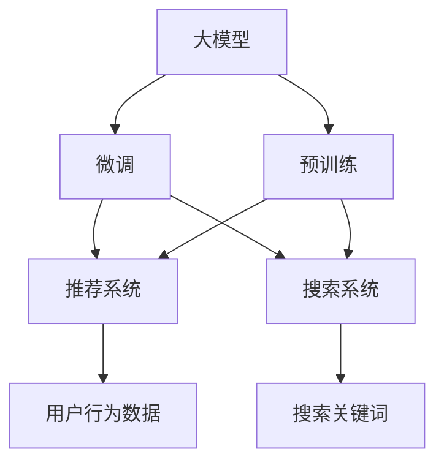

                 

# 电商平台的AI 大模型应用：搜索推荐系统是核心，数据质量是关键

在当今的互联网时代，电商平台作为最重要的电商基础设施之一，面临着越来越多的挑战和机遇。为了更好地适应市场的变化，各大电商平台纷纷引入人工智能技术，通过智能搜索推荐系统，提升用户体验，增加用户粘性，提升销售转化率。本文将详细探讨如何利用大模型技术，结合电商平台的实际应用场景，实现搜索推荐系统的优化，并强调数据质量在搜索推荐系统中的核心地位。

## 1. 背景介绍

随着电商市场竞争的加剧，用户对电商平台的要求也越来越高。在繁杂的搜索结果中如何快速找到自己需要的商品，成为电商平台亟需解决的问题。传统的搜索推荐算法往往需要大量的人工干预和复杂的特征工程，而基于大模型的智能搜索推荐系统，则能够通过学习大量的用户行为数据，直接提升搜索推荐的准确性和用户体验。

大模型技术的应用，最早可以追溯到Google的BERT模型，通过在大规模语料上进行预训练，学习通用的语言表示，并结合特定任务的微调，应用于搜索推荐等任务中，极大地提升了模型的表现。随后，OpenAI的GPT系列模型，以及Facebook的MUM模型等，也逐步应用于电商平台的搜索推荐系统，带来了显著的效果提升。

本文将以电商平台的智能搜索推荐系统为例，探讨如何利用大模型技术，优化搜索推荐系统，并强调数据质量的重要性。

## 2. 核心概念与联系

### 2.1 核心概念概述

在探讨大模型应用于电商平台的搜索推荐系统时，我们需要理解以下几个关键概念：

- **大模型（Large Model）**：以Transformer为代表的大规模预训练语言模型，通过在大规模无标签数据上进行预训练，学习到丰富的语言知识。

- **预训练（Pre-training）**：在大规模无标签数据上，通过自监督学习任务训练通用语言模型。预训练使得模型学习到语言的通用表示。

- **微调（Fine-tuning）**：在预训练模型的基础上，使用下游任务的少量标注数据，通过有监督学习优化模型在特定任务上的性能。

- **推荐系统（Recommendation System）**：通过分析用户的行为数据和物品的特征信息，为用户提供个性化的商品推荐。

- **搜索系统（Search System）**：根据用户输入的关键词，快速匹配最相关的商品。

- **数据质量（Data Quality）**：数据是推荐和搜索系统的基础，数据质量直接决定模型的性能。

这些概念之间的逻辑关系可以通过以下Mermaid流程图来展示：



这个流程图展示了大模型的核心概念及其之间的关系：

1. 大模型通过预训练获得基础能力。
2. 微调对预训练模型进行任务特定的优化，应用于推荐系统和搜索系统。
3. 推荐系统分析用户行为数据，生成个性化推荐。
4. 搜索系统匹配搜索关键词，返回相关商品。

## 3. 核心算法原理 & 具体操作步骤

### 3.1 算法原理概述

电商平台的智能搜索推荐系统通常基于用户行为数据和商品特征数据进行建模，旨在通过学习这些数据，预测用户可能感兴趣的商品，并提供快速、准确的搜索结果。大模型在此过程中扮演了重要的角色，具体原理如下：

1. **预训练**：使用大规模无标签数据，训练一个通用的语言模型，学习到通用的语言知识。
2. **微调**：根据电商平台的特定任务，如搜索推荐等，使用少量标注数据对预训练模型进行微调，优化模型在特定任务上的性能。
3. **推荐系统**：在微调后的模型基础上，结合用户行为数据，生成个性化的推荐。
4. **搜索系统**：在微调后的模型基础上，结合搜索关键词，快速匹配相关商品。

### 3.2 算法步骤详解

基于大模型的电商平台的搜索推荐系统构建，通常包括以下几个关键步骤：

**Step 1: 准备数据集**
- 收集电商平台的搜索数据和用户行为数据，包括用户的点击、浏览、购买等行为数据。
- 对数据进行清洗和预处理，去除噪声和缺失值。
- 划分训练集、验证集和测试集，供模型训练和评估使用。

**Step 2: 构建模型架构**
- 选择合适的预训练模型，如BERT、GPT等，作为推荐和搜索系统的基础。
- 根据电商平台的实际需求，设计相应的微调任务和输出层，如分类、回归、排序等。
- 选择合适的优化器、损失函数和超参数，进行模型训练。

**Step 3: 微调模型**
- 在预训练模型基础上，使用电商平台的标注数据进行微调。
- 设置合适的学习率、批大小和迭代轮数。
- 应用正则化技术，防止过拟合。
- 在验证集上评估模型性能，根据性能指标决定是否调整超参数。

**Step 4: 部署模型**
- 将微调后的模型部署到电商平台的推荐和搜索系统中。
- 实时处理用户的搜索和推荐请求，返回相应的搜索结果和推荐列表。
- 持续收集用户反馈和行为数据，对模型进行动态更新。

### 3.3 算法优缺点

大模型应用于电商平台的搜索推荐系统，具有以下优点：

- **高效性**：大模型能够处理大规模数据，通过预训练和微调，可以快速适应电商平台的特定任务。
- **准确性**：大模型能够学习到丰富的语言知识，通过微调，能够提升推荐和搜索的准确性。
- **泛化能力**：大模型具有较强的泛化能力，能够适应不同商品和用户的多样化需求。
- **可扩展性**：大模型可以在多种场景下进行应用，如商品搜索、智能客服、个性化推荐等。

同时，大模型也存在一些局限性：

- **依赖标注数据**：微调过程需要大量标注数据，获取高质量标注数据的成本较高。
- **模型复杂性**：大模型的复杂度高，训练和推理成本较大。
- **数据隐私**：电商平台的推荐和搜索系统涉及用户隐私数据，如何保护数据安全是一个重要问题。
- **模型解释性**：大模型的决策过程难以解释，缺乏透明性和可解释性。

### 3.4 算法应用领域

大模型在电商平台的推荐和搜索系统中的应用，已经得到了广泛的应用和验证。以下是几个典型的应用领域：

- **商品推荐**：通过学习用户行为数据和商品特征，生成个性化的推荐列表，提升用户满意度。
- **搜索排序**：根据用户的搜索关键词，快速匹配最相关的商品，提升搜索效率。
- **智能客服**：通过微调大模型，构建智能客服系统，提升用户交互体验。
- **数据增强**：利用大模型的语言生成能力，对商品描述进行增强，提升搜索结果的相关性。

## 4. 数学模型和公式 & 详细讲解 & 举例说明

### 4.1 数学模型构建

电商平台的搜索推荐系统，通常基于深度学习模型进行构建。以商品推荐为例，我们可以构建一个深度学习模型，以用户行为数据和商品特征为输入，预测用户可能感兴趣的商品。

假设输入为$x$，表示用户的搜索关键词和行为数据，输出为$y$，表示用户可能感兴趣的商品。模型为$f_{\theta}$，其中$\theta$为模型参数。则推荐模型的目标是最小化预测误差：

$$
\min_{\theta} \mathbb{E}[\ell(f_{\theta}(x),y)]
$$

其中$\ell$为损失函数，通常为交叉熵损失。

### 4.2 公式推导过程

以二分类任务为例，推荐模型的输出为二元概率分布，即预测用户是否对商品感兴趣。假设模型的输出为$\hat{y}=f_{\theta}(x)$，则二分类交叉熵损失函数为：

$$
\ell(f_{\theta}(x),y) = -[y\log \hat{y} + (1-y)\log(1-\hat{y})]
$$

将其代入期望损失函数，得：

$$
\mathcal{L}(\theta) = \mathbb{E}[\ell(f_{\theta}(x),y)]
$$

在实践中，我们通常使用基于梯度的优化算法，如AdamW、SGD等，来近似求解上述最优化问题。设$\eta$为学习率，$\lambda$为正则化系数，则参数的更新公式为：

$$
\theta \leftarrow \theta - \eta \nabla_{\theta}\mathcal{L}(\theta) - \eta\lambda\theta
$$

其中 $\nabla_{\theta}\mathcal{L}(\theta)$ 为损失函数对参数 $\theta$ 的梯度，可通过反向传播算法高效计算。

### 4.3 案例分析与讲解

假设我们有一个包含用户行为数据和商品特征的数据集，包含100,000个样本，其中每个样本包含5个特征和1个标签（0或1）。我们希望构建一个二分类模型，预测用户是否对商品感兴趣。

首先，我们需要将数据集划分为训练集、验证集和测试集。然后，选择合适的预训练模型，如BERT或GPT，进行微调。假设我们选择了BERT模型，微调的过程如下：

1. 将数据集输入BERT模型，得到模型输出。
2. 计算交叉熵损失，并进行反向传播，更新模型参数。
3. 在验证集上评估模型性能，调整超参数。
4. 在测试集上评估模型性能，并部署模型。

在实际应用中，我们通常会使用自动化工具，如HuggingFace的Transformers库，来进行模型的构建和微调。以HuggingFace的BERT模型为例，微调的过程可以非常简单：

```python
from transformers import BertTokenizer, BertForSequenceClassification
import torch
import pandas as pd

# 数据加载
train_data = pd.read_csv('train.csv')
test_data = pd.read_csv('test.csv')

# 模型定义
tokenizer = BertTokenizer.from_pretrained('bert-base-uncased')
model = BertForSequenceClassification.from_pretrained('bert-base-uncased', num_labels=2)

# 数据预处理
def preprocess_text(text):
    tokens = tokenizer.encode_plus(text, max_length=256, truncation=True, padding='max_length', return_tensors='pt')
    return tokens['input_ids'], tokens['attention_mask']

# 训练过程
def train_epoch(model, data_loader, optimizer):
    model.train()
    total_loss = 0
    for batch in data_loader:
        input_ids, attention_mask = batch
        labels = batch['labels']
        outputs = model(input_ids, attention_mask=attention_mask, labels=labels)
        loss = outputs.loss
        total_loss += loss.item()
        optimizer.zero_grad()
        loss.backward()
        optimizer.step()
    return total_loss / len(data_loader)

# 模型评估
def evaluate(model, data_loader):
    model.eval()
    total_loss = 0
    predictions, labels = [], []
    with torch.no_grad():
        for batch in data_loader:
            input_ids, attention_mask = batch
            labels = batch['labels']
            outputs = model(input_ids, attention_mask=attention_mask)
            predictions.append(outputs.logits.argmax(dim=1).tolist())
            labels.append(labels.tolist())
        print(classification_report(labels, predictions))
```

## 5. 项目实践：代码实例和详细解释说明

### 5.1 开发环境搭建

在进行模型微调前，我们需要准备好开发环境。以下是使用Python进行PyTorch开发的环境配置流程：

1. 安装Anaconda：从官网下载并安装Anaconda，用于创建独立的Python环境。

2. 创建并激活虚拟环境：
```bash
conda create -n pytorch-env python=3.8 
conda activate pytorch-env
```

3. 安装PyTorch：根据CUDA版本，从官网获取对应的安装命令。例如：
```bash
conda install pytorch torchvision torchaudio cudatoolkit=11.1 -c pytorch -c conda-forge
```

4. 安装Transformers库：
```bash
pip install transformers
```

5. 安装各类工具包：
```bash
pip install numpy pandas scikit-learn matplotlib tqdm jupyter notebook ipython
```

完成上述步骤后，即可在`pytorch-env`环境中开始模型微调实践。

### 5.2 源代码详细实现

下面我们以商品推荐为例，给出使用Transformers库对BERT模型进行微调的PyTorch代码实现。

首先，定义推荐任务的数据处理函数：

```python
from transformers import BertTokenizer
from torch.utils.data import Dataset
import torch

class RecommendationDataset(Dataset):
    def __init__(self, user_feats, item_feats, user_labels, tokenizer, max_len=128):
        self.user_feats = user_feats
        self.item_feats = item_feats
        self.user_labels = user_labels
        self.tokenizer = tokenizer
        self.max_len = max_len
        
    def __len__(self):
        return len(self.user_feats)
    
    def __getitem__(self, item):
        user_features = self.user_feats[item]
        item_features = self.item_feats[item]
        
        # 拼接用户和商品特征
        sequence = [user_features, item_features]
        sequence = sequence + [[0]] * (self.max_len - len(sequence))
        sequence = torch.tensor(sequence, dtype=torch.long)
        
        # 对token-wise的标签进行编码
        encoded_tags = [label2id[label] for label in self.user_labels] 
        encoded_tags.extend([label2id['0']] * (self.max_len - len(encoded_tags)))
        labels = torch.tensor(encoded_tags, dtype=torch.long)
        
        return {'sequence': sequence, 
                'labels': labels}

# 标签与id的映射
label2id = {'0': 0, '1': 1}
id2label = {v: k for k, v in label2id.items()}

# 创建dataset
tokenizer = BertTokenizer.from_pretrained('bert-base-cased')

train_dataset = RecommendationDataset(train_user_feats, train_item_feats, train_user_labels, tokenizer)
dev_dataset = RecommendationDataset(dev_user_feats, dev_item_feats, dev_user_labels, tokenizer)
test_dataset = RecommendationDataset(test_user_feats, test_item_feats, test_user_labels, tokenizer)
```

然后，定义模型和优化器：

```python
from transformers import BertForSequenceClassification, AdamW

model = BertForSequenceClassification.from_pretrained('bert-base-cased', num_labels=len(label2id))

optimizer = AdamW(model.parameters(), lr=2e-5)
```

接着，定义训练和评估函数：

```python
from torch.utils.data import DataLoader
from tqdm import tqdm
from sklearn.metrics import classification_report

device = torch.device('cuda') if torch.cuda.is_available() else torch.device('cpu')
model.to(device)

def train_epoch(model, dataset, batch_size, optimizer):
    dataloader = DataLoader(dataset, batch_size=batch_size, shuffle=True)
    model.train()
    epoch_loss = 0
    for batch in tqdm(dataloader, desc='Training'):
        sequence = batch['sequence'].to(device)
        labels = batch['labels'].to(device)
        model.zero_grad()
        outputs = model(sequence)
        loss = outputs.loss
        epoch_loss += loss.item()
        loss.backward()
        optimizer.step()
    return epoch_loss / len(dataloader)

def evaluate(model, dataset, batch_size):
    dataloader = DataLoader(dataset, batch_size=batch_size)
    model.eval()
    preds, labels = [], []
    with torch.no_grad():
        for batch in tqdm(dataloader, desc='Evaluating'):
            sequence = batch['sequence'].to(device)
            labels = batch['labels']
            batch_preds = model(sequence).logits.argmax(dim=1).to('cpu').tolist()
            batch_labels = labels.to('cpu').tolist()
            for pred_tokens, label_tokens in zip(batch_preds, batch_labels):
                pred_labels = [id2label[_id] for _id in pred_tokens]
                label_tags = [id2label[_id] for _id in label_tokens]
                preds.append(pred_labels[:len(label_tags)])
                labels.append(label_tags)
                
    print(classification_report(labels, preds))
```

最后，启动训练流程并在测试集上评估：

```python
epochs = 5
batch_size = 16

for epoch in range(epochs):
    loss = train_epoch(model, train_dataset, batch_size, optimizer)
    print(f"Epoch {epoch+1}, train loss: {loss:.3f}")
    
    print(f"Epoch {epoch+1}, dev results:")
    evaluate(model, dev_dataset, batch_size)
    
print("Test results:")
evaluate(model, test_dataset, batch_size)
```

以上就是使用PyTorch对BERT进行商品推荐任务微调的完整代码实现。可以看到，得益于Transformers库的强大封装，我们可以用相对简洁的代码完成BERT模型的加载和微调。

### 5.3 代码解读与分析

让我们再详细解读一下关键代码的实现细节：

**RecommendationDataset类**：
- `__init__`方法：初始化用户特征、商品特征、标签等关键组件。
- `__len__`方法：返回数据集的样本数量。
- `__getitem__`方法：对单个样本进行处理，将用户和商品特征拼接成sequence，将标签编码为数字，并对其进行定长padding，最终返回模型所需的输入。

**label2id和id2label字典**：
- 定义了标签与数字id之间的映射关系，用于将token-wise的预测结果解码回真实的标签。

**训练和评估函数**：
- 使用PyTorch的DataLoader对数据集进行批次化加载，供模型训练和推理使用。
- 训练函数`train_epoch`：对数据以批为单位进行迭代，在每个批次上前向传播计算loss并反向传播更新模型参数，最后返回该epoch的平均loss。
- 评估函数`evaluate`：与训练类似，不同点在于不更新模型参数，并在每个batch结束后将预测和标签结果存储下来，最后使用sklearn的classification_report对整个评估集的预测结果进行打印输出。

**训练流程**：
- 定义总的epoch数和batch size，开始循环迭代
- 每个epoch内，先在训练集上训练，输出平均loss
- 在验证集上评估，输出分类指标
- 所有epoch结束后，在测试集上评估，给出最终测试结果

可以看到，PyTorch配合Transformers库使得BERT微调的代码实现变得简洁高效。开发者可以将更多精力放在数据处理、模型改进等高层逻辑上，而不必过多关注底层的实现细节。

当然，工业级的系统实现还需考虑更多因素，如模型的保存和部署、超参数的自动搜索、更灵活的任务适配层等。但核心的微调范式基本与此类似。

## 6. 实际应用场景

### 6.1 智能推荐系统

智能推荐系统是电商平台的核心，通过学习用户行为数据，为用户推荐可能感兴趣的商品，提升用户体验，增加销售转化率。大模型在此过程中扮演了重要的角色，能够通过微调，提升推荐系统的准确性和个性化程度。

在具体实现中，可以将用户行为数据（如浏览、点击、购买等）作为输入，商品特征（如价格、评分、品牌等）作为输出，训练一个二分类模型，预测用户是否对商品感兴趣。通过微调大模型，可以显著提升推荐系统的性能，生成更加个性化的推荐结果。

### 6.2 智能搜索系统

智能搜索系统是电商平台的重要组成部分，通过快速匹配用户搜索关键词，返回最相关的商品，提升搜索效率。大模型在此过程中同样具有重要作用，能够通过微调，提升搜索系统的匹配准确性。

在具体实现中，可以将用户搜索关键词作为输入，商品特征作为输出，训练一个分类模型，预测商品是否与搜索关键词相关。通过微调大模型，可以显著提升搜索系统的召回率和相关性，提高用户满意度。

### 6.3 数据增强

数据增强是提高模型泛化能力的重要手段，大模型在这方面也有着重要的应用。通过微调大模型，可以生成更多的训练数据，提升模型的泛化能力。

在具体实现中，可以将商品的描述文本作为输入，生成新的文本描述，扩展训练集。例如，可以通过将商品描述进行回译、改写等方式，生成新的文本描述，增强模型的泛化能力。

### 6.4 未来应用展望

随着大模型和微调方法的不断发展，未来搜索推荐系统将具备更加强大的能力，具体展望如下：

1. **跨领域推荐**：未来推荐系统将具备跨领域推荐能力，能够将电商商品推荐与金融产品、旅游服务等其他领域推荐进行整合，提供更加多元化的服务。

2. **实时推荐**：通过微调大模型，推荐系统能够实时动态调整推荐内容，提升用户粘性。

3. **个性化推荐**：推荐系统将更加注重个性化推荐，根据用户的行为数据和反馈，动态调整推荐策略，提升推荐效果。

4. **多模态推荐**：推荐系统将能够整合视觉、语音等多模态数据，提供更加全面的推荐服务。

5. **上下文感知推荐**：推荐系统将能够感知用户的上下文环境，如地理位置、时间、天气等，提供更加贴合用户需求的推荐。

6. **动态需求推荐**：推荐系统将能够根据市场需求变化，动态调整推荐策略，提升推荐系统的适应性。

## 7. 工具和资源推荐

### 7.1 学习资源推荐

为了帮助开发者系统掌握大模型应用于电商平台的搜索推荐系统的理论基础和实践技巧，这里推荐一些优质的学习资源：

1. 《Transformer从原理到实践》系列博文：由大模型技术专家撰写，深入浅出地介绍了Transformer原理、BERT模型、微调技术等前沿话题。

2. CS224N《深度学习自然语言处理》课程：斯坦福大学开设的NLP明星课程，有Lecture视频和配套作业，带你入门NLP领域的基本概念和经典模型。

3. 《Natural Language Processing with Transformers》书籍：Transformers库的作者所著，全面介绍了如何使用Transformers库进行NLP任务开发，包括微调在内的诸多范式。

4. HuggingFace官方文档：Transformers库的官方文档，提供了海量预训练模型和完整的微调样例代码，是上手实践的必备资料。

5. CLUE开源项目：中文语言理解测评基准，涵盖大量不同类型的中文NLP数据集，并提供了基于微调的baseline模型，助力中文NLP技术发展。

通过对这些资源的学习实践，相信你一定能够快速掌握大模型应用于电商平台的搜索推荐系统的精髓，并用于解决实际的NLP问题。

### 7.2 开发工具推荐

高效的开发离不开优秀的工具支持。以下是几款用于大模型微调开发的常用工具：

1. PyTorch：基于Python的开源深度学习框架，灵活动态的计算图，适合快速迭代研究。大部分预训练语言模型都有PyTorch版本的实现。

2. TensorFlow：由Google主导开发的开源深度学习框架，生产部署方便，适合大规模工程应用。同样有丰富的预训练语言模型资源。

3. Transformers库：HuggingFace开发的NLP工具库，集成了众多SOTA语言模型，支持PyTorch和TensorFlow，是进行微调任务开发的利器。

4. Weights & Biases：模型训练的实验跟踪工具，可以记录和可视化模型训练过程中的各项指标，方便对比和调优。与主流深度学习框架无缝集成。

5. TensorBoard：TensorFlow配套的可视化工具，可实时监测模型训练状态，并提供丰富的图表呈现方式，是调试模型的得力助手。

6. Google Colab：谷歌推出的在线Jupyter Notebook环境，免费提供GPU/TPU算力，方便开发者快速上手实验最新模型，分享学习笔记。

合理利用这些工具，可以显著提升大模型微调的开发效率，加快创新迭代的步伐。

### 7.3 相关论文推荐

大模型和微调技术的发展源于学界的持续研究。以下是几篇奠基性的相关论文，推荐阅读：

1. Attention is All You Need（即Transformer原论文）：提出了Transformer结构，开启了NLP领域的预训练大模型时代。

2. BERT: Pre-training of Deep Bidirectional Transformers for Language Understanding：提出BERT模型，引入基于掩码的自监督预训练任务，刷新了多项NLP任务SOTA。

3. Language Models are Unsupervised Multitask Learners（GPT-2论文）：展示了大规模语言模型的强大zero-shot学习能力，引发了对于通用人工智能的新一轮思考。

4. Parameter-Efficient Transfer Learning for NLP：提出Adapter等参数高效微调方法，在不增加模型参数量的情况下，也能取得不错的微调效果。

5. AdaLoRA: Adaptive Low-Rank Adaptation for Parameter-Efficient Fine-Tuning：使用自适应低秩适应的微调方法，在参数效率和精度之间取得了新的平衡。

这些论文代表了大模型微调技术的发展脉络。通过学习这些前沿成果，可以帮助研究者把握学科前进方向，激发更多的创新灵感。

## 8. 总结：未来发展趋势与挑战

### 8.1 研究成果总结

本文对大模型应用于电商平台的搜索推荐系统进行了全面系统的介绍。首先阐述了大模型和微调技术的研究背景和意义，明确了微调在拓展预训练模型应用、提升推荐系统性能方面的独特价值。其次，从原理到实践，详细讲解了微调的数学原理和关键步骤，给出了微调任务开发的完整代码实例。同时，本文还广泛探讨了微调方法在电商平台的推荐、搜索、数据增强等多个应用场景中的实际应用，展示了微调范式的巨大潜力。此外，本文精选了微调技术的各类学习资源，力求为读者提供全方位的技术指引。

通过本文的系统梳理，可以看到，大模型微调技术在电商平台的搜索推荐系统中已经得到了广泛应用，并取得了显著的效果。未来，伴随大模型和微调方法的持续演进，推荐系统将具备更强的个性化推荐和实时推荐能力，成为电商平台的核心竞争力。

### 8.2 未来发展趋势

展望未来，大模型微调技术在电商平台的搜索推荐系统中将呈现以下几个发展趋势：

1. **多模态推荐**：推荐系统将整合视觉、语音等多模态数据，提供更加全面的推荐服务。

2. **上下文感知推荐**：推荐系统将能够感知用户的上下文环境，如地理位置、时间、天气等，提供更加贴合用户需求的推荐。

3. **实时推荐**：通过微调大模型，推荐系统能够实时动态调整推荐内容，提升用户粘性。

4. **跨领域推荐**：未来推荐系统将具备跨领域推荐能力，能够将电商商品推荐与金融产品、旅游服务等其他领域推荐进行整合，提供更加多元化的服务。

5. **个性化推荐**：推荐系统将更加注重个性化推荐，根据用户的行为数据和反馈，动态调整推荐策略，提升推荐效果。

6. **数据增强**：通过微调大模型，推荐系统能够生成更多的训练数据，提升模型的泛化能力。

### 8.3 面临的挑战

尽管大模型微调技术已经取得了显著成效，但在迈向更加智能化、普适化应用的过程中，它仍面临着诸多挑战：

1. **数据隐私**：电商平台的推荐和搜索系统涉及用户隐私数据，如何保护数据安全是一个重要问题。

2. **模型复杂性**：大模型的复杂度高，训练和推理成本较大。

3. **标注数据依赖**：微调过程需要大量标注数据，获取高质量标注数据的成本较高。

4. **模型泛化能力**：当目标任务与预训练数据的分布差异较大时，微调的性能提升有限。

5. **模型解释性**：大模型的决策过程难以解释，缺乏透明性和可解释性。

6. **模型鲁棒性**：当目标任务与预训练数据的分布差异较大时，微调的性能提升有限。

7. **过拟合问题**：当目标任务与预训练数据的分布差异较大时，微调的性能提升有限。

### 8.4 研究展望

面对大模型微调面临的种种挑战，未来的研究需要在以下几个方面寻求新的突破：

1. **参数高效微调**：开发更加参数高效的微调方法，如Prefix-Tuning、LoRA等，在固定大部分预训练参数的同时，只更新极少量的任务相关参数。

2. **数据增强**：利用大模型的语言生成能力，对商品描述进行增强，提升推荐系统的泛化能力。

3. **多模态数据融合**：整合视觉、语音等多模态数据，提供更加全面的推荐服务。

4. **上下文感知推荐**：推荐系统将能够感知用户的上下文环境，如地理位置、时间、天气等，提供更加贴合用户需求的推荐。

5. **实时推荐**：通过微调大模型，推荐系统能够实时动态调整推荐内容，提升用户粘性。

6. **模型解释性**：增强模型输出解释的因果性和逻辑性，提高算法的可解释性。

7. **数据隐私保护**：研究数据隐私保护技术，确保用户隐私安全。

## 9. 附录：常见问题与解答

**Q1：电商平台的搜索推荐系统是否适用于所有商品？**

A: 电商平台搜索推荐系统的应用效果与商品本身有关，对于某些商品，可能存在标注数据不足、特征不明显等问题，导致推荐效果不佳。此时，可以通过人工标注或增加商品特征来解决。

**Q2：如何在微调过程中避免过拟合？**

A: 为了避免过拟合，可以在微调过程中应用正则化技术，如L2正则、Dropout、Early Stopping等。同时，可以采用数据增强、对抗训练等技术，增加训练集多样性，提高模型的泛化能力。

**Q3：电商平台的搜索推荐系统是否需要频繁更新？**

A: 电商平台的搜索推荐系统需要根据用户行为数据进行动态更新，以保持模型的时效性和适应性。建议定期更新模型，以应对市场和用户需求的变化。

**Q4：如何提高推荐系统的个性化推荐能力？**

A: 提高推荐系统的个性化推荐能力，可以通过增加用户行为数据的多样性、引入用户标签、利用多模态数据等方式，提升模型的预测能力。同时，可以引入反馈机制，根据用户反馈调整推荐策略。

**Q5：推荐系统的推荐精度如何评估？**

A: 推荐系统的推荐精度可以通过多种指标进行评估，如精确率、召回率、F1-score、AUC等。建议综合使用多个指标，以全面评估推荐系统的性能。

---

作者：禅与计算机程序设计艺术 / Zen and the Art of Computer Programming

