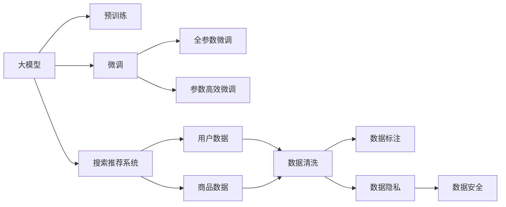

                 

# 电商平台的AI 大模型战略：搜索推荐系统是核心，数据质量控制是关键

## 1. 背景介绍

### 1.1 电商行业发展现状

随着互联网技术的普及和消费者购物习惯的改变，电子商务行业进入了蓬勃发展的时期。数据显示，全球电商市场规模逐年增长，预计未来几年将维持20%以上的年复合增长率。中国作为全球最大的电商市场，其规模和渗透率也遥遥领先。

电商平台的成功不仅依赖于用户界面的美观和用户体验，更离不开高效、精准的搜索推荐系统。好的搜索推荐系统能够帮助用户快速找到所需商品，提升用户购物体验，提高平台销售额。

### 1.2 大模型的兴起与电商平台的AI 战略

近年来，深度学习技术迅猛发展，深度神经网络在图像识别、自然语言处理等领域取得了巨大成功。其中，预训练大模型（如BERT、GPT、DALL-E等）因其强大的语言和视觉能力，正在逐步成为电商平台的核心AI 技术。这些大模型通过海量的数据进行预训练，能够捕捉到数据的深层模式，从而在搜索推荐等任务上表现出色。

电商平台通过采用预训练大模型，不仅可以大幅度提升搜索推荐系统的性能，还可以降低算法开发和部署的复杂度，显著降低开发成本和时间。基于此，大模型战略已成为电商平台AI 发展的重要组成部分。

### 1.3 数据质量控制的必要性

大模型通过大规模数据进行预训练，对数据的依赖性极高。电商平台的搜索推荐系统涉及海量的商品信息和用户行为数据，数据质量的好坏直接决定了模型的性能。

数据质量控制不仅包括数据收集、清洗、标注等环节，还涉及数据隐私、安全等问题。只有在确保数据质量的前提下，才能使大模型发挥其真正的潜力，为用户提供高质量的搜索结果和推荐内容。

## 2. 核心概念与联系

### 2.1 核心概念概述

为更好地理解电商平台的AI 大模型战略，本文将介绍几个关键概念：

- **大模型（Large Models）**：指通过大规模数据进行预训练的深度神经网络，如BERT、GPT等。这些模型通常在预训练阶段学习到丰富的语言知识和视觉能力，能够进行复杂任务的处理。
- **预训练（Pre-training）**：指在大规模无标注数据上进行训练，以获得通用的语言或视觉表示。预训练模型通常具有较强的泛化能力，可以应用于多个下游任务。
- **微调（Fine-tuning）**：指在预训练模型的基础上，使用下游任务的少量标注数据进行微调，以获得任务特定的性能。
- **搜索推荐系统（Search & Recommendation System）**：指电商平台用于帮助用户快速找到所需商品的智能系统。通过深度学习模型，系统能够分析用户行为，预测用户需求，推荐相关商品。
- **数据质量控制（Data Quality Control）**：指通过各种手段，确保数据集的质量和准确性，以提高AI 模型的性能和可靠性。

这些核心概念之间的关系可以用以下Mermaid流程图进行表示：



该流程图展示了各概念之间的联系：

1. 大模型通过预训练获取基础能力，可以作为通用的表示学习器。
2. 微调是对预训练模型进行任务特定的优化，以获得下游任务的最佳性能。
3. 搜索推荐系统是大模型在电商平台中的应用，旨在提升用户购物体验。
4. 数据质量控制是保证大模型性能的前提，涉及数据清洗、标注和隐私保护。

## 3. 核心算法原理 & 具体操作步骤

### 3.1 算法原理概述

基于大模型的搜索推荐系统，通过预训练大模型在大量无标签数据上学习通用的语言和视觉表示，然后在特定任务的标注数据上进行微调，以获得该任务的最佳性能。

具体来说，搜索推荐系统的算法流程包括以下几个关键步骤：

1. 收集和清洗电商平台的商品和用户行为数据。
2. 对数据进行标注，生成训练集。
3. 在大模型上使用标注数据进行微调。
4. 部署微调后的模型到线上，进行实时搜索推荐。

### 3.2 算法步骤详解

以下详细介绍搜索推荐系统的算法步骤：

#### 3.2.1 数据收集与预处理

电商平台的搜索推荐系统需要大量的商品和用户行为数据。数据收集的方式包括：

- **商品数据**：从电商平台的产品目录中抽取商品信息，如标题、描述、图片等。
- **用户数据**：通过用户的浏览、点击、购买等行为数据，提取用户的兴趣和偏好。

数据预处理的主要任务包括：

- **数据清洗**：去除缺失值、异常值和噪声数据。
- **数据归一化**：对数据进行标准化处理，确保数据的一致性。
- **数据分块**：将数据集划分为训练集、验证集和测试集，以便进行模型训练和评估。

#### 3.2.2 模型选择与微调

选择合适的预训练大模型是搜索推荐系统的关键。目前，BERT、GPT、DALL-E等模型在电商推荐领域都有应用。根据电商平台的业务需求，可以选择适合的大模型进行微调。

微调过程包括以下步骤：

1. **设置超参数**：选择合适的学习率、批大小、迭代轮数等。
2. **添加任务适配层**：在预训练模型的顶层添加分类器或解码器，以便进行任务特定的优化。
3. **训练与评估**：使用标注数据进行模型训练，并在验证集上评估性能。
4. **部署模型**：将微调后的模型部署到线上，进行实时推荐。

#### 3.2.3 实时搜索与推荐

部署到线上后，搜索推荐系统需要实时处理用户的查询请求，进行商品推荐。具体流程包括：

1. **用户输入查询**：用户通过搜索界面输入查询语句。
2. **数据检索与处理**：系统从商品数据库中检索相关商品，并提取特征向量。
3. **模型预测**：将查询语句和商品特征向量输入微调后的模型，进行预测。
4. **推荐结果生成**：根据预测结果，生成推荐商品列表，并展示给用户。

### 3.3 算法优缺点

基于大模型的搜索推荐系统具有以下优点：

1. **性能优越**：大模型具有强大的泛化能力，能够在电商推荐等复杂任务上取得较好的效果。
2. **算法简单**：微调过程相对简单，不需要复杂的算法设计和特征工程。
3. **部署方便**：微调后的模型可以方便地部署到线上，进行实时推荐。

同时，该系统也存在一些缺点：

1. **依赖标注数据**：微调过程需要大量的标注数据，获取标注数据的时间和成本较高。
2. **数据质量要求高**：商品和用户数据的准确性和完整性直接影响模型的性能。
3. **资源消耗大**：大模型通常具有较多的参数，对计算资源的需求较高。

### 3.4 算法应用领域

基于大模型的搜索推荐系统已经在电商、社交媒体、新闻推荐等领域得到了广泛应用，取得了显著的效果。例如：

- **电商平台**：通过搜索推荐系统，帮助用户快速找到所需商品，提高购物体验和销售额。
- **社交媒体**：通过内容推荐系统，帮助用户发现感兴趣的内容，提升平台活跃度和用户粘性。
- **新闻推荐**：通过新闻推荐系统，帮助用户获取个性化的新闻内容，提高阅读体验。

## 4. 数学模型和公式 & 详细讲解 & 举例说明

### 4.1 数学模型构建

搜索推荐系统的目标是在大规模商品数据中找到与用户查询最匹配的商品，通常使用自然语言处理和推荐算法相结合的方式。下面以电商平台为例，构建搜索推荐系统的数学模型。

假设商品集合为 $S=\{s_1,s_2,\cdots,s_n\}$，每个商品 $s_i$ 的特征向量为 $x_i \in \mathbb{R}^d$，用户的查询为 $q \in \mathbb{R}^d$。模型的目标是预测商品 $s_i$ 被点击的概率 $y_i$。

模型的输入为商品特征向量 $x_i$ 和用户查询向量 $q$，输出为商品被点击的概率 $y_i$。模型的结构如图1所示：

```mermaid
graph LR
    A[x_i] --> B[q]
    B --> C[M(x_i|q)]
    C --> D[y_i]
```

其中，$M$ 表示模型，$C$ 为模型的输出层。假设输出层为全连接神经网络，其结构如图2所示：


该模型可以通过以下公式进行训练：

$$
\min_{\theta} \sum_{i=1}^N \ell(y_i, \hat{y}_i)
$$

其中，$\ell$ 为损失函数，$\hat{y}_i$ 为模型预测的概率值。常用的损失函数包括交叉熵损失、均方误差损失等。

### 4.2 公式推导过程

下面以交叉熵损失函数为例，推导搜索推荐系统的训练公式。

假设模型的输出为 $y_i \in [0,1]$，真实标签为 $y_i \in \{0,1\}$。则交叉熵损失函数为：

$$
\ell(y_i, \hat{y}_i) = -y_i\log \hat{y}_i - (1-y_i)\log(1-\hat{y}_i)
$$

将损失函数扩展到整个数据集，得到经验风险函数：

$$
\mathcal{L}(\theta) = -\frac{1}{N}\sum_{i=1}^N [y_i\log \hat{y}_i + (1-y_i)\log(1-\hat{y}_i)]
$$

其中，$\theta$ 为模型参数。

通过梯度下降等优化算法，最小化经验风险函数，更新模型参数 $\theta$，即可得到最优的搜索推荐模型。

### 4.3 案例分析与讲解

为了更好地理解搜索推荐系统的工作原理，我们以电商平台为例进行案例分析。

假设一个电商平台的商品集合 $S$ 包含1000个商品，每个商品的特征向量 $x_i \in \mathbb{R}^{50}$。用户输入查询 $q$ 后，系统从商品集合中检索出与查询最相关的10个商品，并使用搜索推荐模型预测每个商品被点击的概率 $y_i$。

在训练阶段，系统使用历史用户行为数据 $D$ 进行微调，得到最优模型 $M^*$。在测试阶段，系统使用微调后的模型 $M^*$ 对新用户查询进行推荐，预测每个商品被点击的概率，并返回推荐列表。

## 5. 项目实践：代码实例和详细解释说明

### 5.1 开发环境搭建

在搜索推荐系统开发中，需要使用深度学习框架和自然语言处理库。以下是在Python中使用TensorFlow和BERT模型进行开发的示例环境搭建：

1. 安装TensorFlow和相关的NLP库：

```bash
pip install tensorflow
pip install transformers
```

2. 安装GPU版本（可选）：

```bash
pip install tensorflow-gpu
```

3. 安装Docker和TensorFlow-Serving（可选）：

```bash
sudo apt-get update
sudo apt-get install docker
```

4. 安装BERT模型：

```bash
pip install transformers
```

完成以上步骤后，即可在开发环境中进行搜索推荐系统的开发。

### 5.2 源代码详细实现

以下是在Python中使用TensorFlow和BERT模型进行搜索推荐系统开发的示例代码：

```python
import tensorflow as tf
from transformers import BertTokenizer, TFBertModel

# 加载模型和分词器
tokenizer = BertTokenizer.from_pretrained('bert-base-cased')
model = TFBertModel.from_pretrained('bert-base-cased')

# 定义搜索推荐模型
class SearchRecommendation(tf.keras.Model):
    def __init__(self):
        super(SearchRecommendation, self).__init__()
        self.bert = model
        self.fc = tf.keras.layers.Dense(2, activation='sigmoid')

    def call(self, x):
        x = self.bert(x)
        x = self.fc(x)
        return x

# 定义数据集
class SearchDataset(tf.data.Dataset):
    def __init__(self, dataset, tokenizer):
        self.dataset = dataset
        self.tokenizer = tokenizer

    def __len__(self):
        return len(self.dataset)

    def __getitem__(self, index):
        text = self.dataset[index]['text']
        label = self.dataset[index]['label']
        encoding = self.tokenizer(text, return_tensors='tf')
        input_ids = encoding['input_ids']
        attention_mask = encoding['attention_mask']
        return {'input_ids': input_ids, 'attention_mask': attention_mask, 'label': label}

# 加载数据集
dataset = load_dataset('search_dataset')
tokenizer = BertTokenizer.from_pretrained('bert-base-cased')

# 构建数据集
train_dataset = SearchDataset(dataset, tokenizer)
train_dataset = train_dataset.shuffle(1000).batch(32)
test_dataset = SearchDataset(dataset, tokenizer)

# 定义模型
model = SearchRecommendation()

# 设置超参数
learning_rate = 2e-5
epochs = 5
batch_size = 32

# 定义优化器
optimizer = tf.keras.optimizers.Adam(learning_rate=learning_rate)

# 定义损失函数
loss_fn = tf.keras.losses.BinaryCrossentropy(from_logits=True)

# 定义评估指标
metrics = tf.keras.metrics.BinaryAccuracy(name='accuracy')

# 训练模型
model.compile(optimizer=optimizer, loss=loss_fn, metrics=[metrics])
model.fit(train_dataset, validation_data=test_dataset, epochs=epochs, batch_size=batch_size)

# 评估模型
model.evaluate(test_dataset)
```

以上代码展示了使用TensorFlow和BERT模型进行搜索推荐系统开发的完整流程。具体实现步骤包括：

1. 加载BERT模型和分词器。
2. 定义搜索推荐模型。
3. 加载数据集，并构建数据集对象。
4. 设置模型超参数和优化器。
5. 定义损失函数和评估指标。
6. 编译模型并训练。
7. 评估模型性能。

### 5.3 代码解读与分析

为了更好地理解代码的实现细节，下面对关键部分进行解读：

- **模型定义**：使用TFBertModel作为特征提取器，定义全连接层进行二分类预测。
- **数据集定义**：定义搜索推荐数据集，并使用BertTokenizer进行分词和编码。
- **模型编译**：设置优化器、损失函数和评估指标，编译模型。
- **模型训练**：使用fit方法进行模型训练，设置训练轮数和批大小。
- **模型评估**：使用evaluate方法评估模型性能。

## 6. 实际应用场景

### 6.1 电商搜索推荐系统

电商平台的搜索推荐系统已经广泛应用于商品推荐、个性化搜索等方面，极大提升了用户体验和平台收益。例如：

1. **商品推荐**：通过搜索推荐系统，用户可以更方便地找到所需的商品，提高购物体验。
2. **个性化搜索**：系统根据用户历史行为，推荐个性化的搜索结果，提高搜索效率。
3. **用户行为分析**：系统可以实时分析用户行为数据，提取用户兴趣和偏好，进一步优化推荐策略。

### 6.2 社交媒体内容推荐

社交媒体平台如微博、抖音等，通过搜索推荐系统向用户推荐感兴趣的内容，提升用户粘性和平台活跃度。例如：

1. **内容推荐**：系统根据用户行为数据，推荐感兴趣的内容，增加用户停留时间。
2. **话题推荐**：系统根据用户兴趣，推荐相关话题，促进话题讨论。
3. **视频推荐**：系统根据用户行为，推荐相关视频，提升视频观看体验。

### 6.3 新闻推荐系统

新闻平台通过搜索推荐系统，向用户推荐个性化的新闻内容，提升阅读体验和平台收益。例如：

1. **新闻推荐**：系统根据用户兴趣，推荐相关新闻，增加阅读量。
2. **话题推荐**：系统推荐相关话题，促进用户参与讨论。
3. **专家推荐**：系统推荐相关专家，增加用户关注度。

## 7. 工具和资源推荐

### 7.1 学习资源推荐

为了帮助开发者系统掌握搜索推荐系统的开发流程，以下推荐一些优质的学习资源：

1. **《深度学习》课程**：斯坦福大学开设的深度学习课程，涵盖深度学习的基础理论和前沿应用，适合初学者入门。
2. **《TensorFlow实战》书籍**：介绍TensorFlow的实用技巧和应用案例，适合有一定基础的开发者学习。
3. **《BERT论文》**：了解BERT模型的构建和应用，掌握预训练大模型的基本原理和实践方法。
4. **《自然语言处理》书籍**：介绍自然语言处理的基本概念和前沿技术，适合对NLP感兴趣的开发者。

### 7.2 开发工具推荐

以下是几款用于搜索推荐系统开发的常用工具：

1. **TensorFlow**：由Google主导开发的深度学习框架，适合复杂的深度学习模型开发。
2. **PyTorch**：由Facebook开发的深度学习框架，适合动态计算图和算法开发。
3. **Transformers**：HuggingFace开发的NLP工具库，支持预训练大模型的微调和部署。
4. **TensorBoard**：TensorFlow配套的可视化工具，可以实时监测模型训练状态和结果。
5. **Weights & Biases**：实验跟踪工具，记录和可视化模型训练过程中的各项指标，方便对比和调优。

### 7.3 相关论文推荐

搜索推荐系统涉及多种前沿技术和算法，以下是几篇经典的搜索推荐系统论文，推荐阅读：

1. **《Deep Interest Networks for Web Search Ranking》**：提出Deep Interest Networks模型，提升搜索结果的相关性和多样性。
2. **《Neural Collaborative Filtering》**：介绍神经协同过滤算法，通过协同过滤进行推荐。
3. **《Attention is All You Need》**：提出Transformer模型，提升推荐系统的效果和效率。
4. **《Deep Recurrent Attention Networks for Personalized Recommendation》**：提出Deep Recurrent Attention Networks模型，进一步提升推荐系统的效果。

## 8. 总结：未来发展趋势与挑战

### 8.1 研究成果总结

本文对基于大模型的搜索推荐系统进行了全面系统的介绍，从算法原理到项目实践，从实际应用到未来展望，详细讲解了搜索推荐系统的开发流程。通过案例分析，展示了搜索推荐系统在电商、社交媒体、新闻推荐等多个领域的应用。

### 8.2 未来发展趋势

展望未来，搜索推荐系统的趋势如下：

1. **深度学习与自然语言处理融合**：搜索推荐系统将更深入地结合深度学习和自然语言处理技术，提升推荐的精准性和多样性。
2. **个性化推荐**：通过分析用户行为数据，实现更加个性化的推荐，提高用户体验和平台收益。
3. **跨平台推荐**：搜索推荐系统将跨平台、跨设备进行协同推荐，提供更加一致和统一的推荐体验。
4. **实时推荐**：通过实时数据流处理，实现更加即时和动态的推荐。
5. **多模态推荐**：结合图像、视频等多种模态信息，提升推荐系统的丰富性和多样性。

### 8.3 面临的挑战

尽管搜索推荐系统取得了显著的成果，但在迈向更加智能化、普适化应用的过程中，仍面临以下挑战：

1. **数据隐私和安全**：用户数据的隐私和安全问题，需要严格的数据保护机制和算法设计。
2. **模型泛化能力**：模型在不同场景下的泛化能力不足，需要进一步提升模型的鲁棒性和泛化性。
3. **计算资源需求**：大规模数据和复杂模型的计算需求，需要更高的计算能力和资源支持。
4. **算法复杂度**：搜索推荐系统的算法复杂度较高，需要更好的优化和简化。
5. **用户互动性**：如何增强用户与系统的互动性，提升用户体验和满意度，是未来需要解决的问题。

### 8.4 研究展望

未来，搜索推荐系统需要在以下几个方面进行研究：

1. **隐私保护技术**：开发更安全、更高效的数据隐私保护算法，保护用户数据安全。
2. **跨模态推荐技术**：研究如何将视觉、语音等多模态信息与文本信息结合，提升推荐系统的丰富性和多样性。
3. **实时推荐技术**：研究如何高效处理实时数据流，实现实时推荐。
4. **推荐模型优化**：研究如何优化推荐模型，提升模型的泛化能力和精度。
5. **用户体验设计**：研究如何提升用户体验，增强用户与系统的互动性。

总之，搜索推荐系统在电商、社交媒体、新闻推荐等领域具有广泛的应用前景，未来需要在多方面进行深入研究和创新，才能更好地满足用户需求，提升平台收益。

## 9. 附录：常见问题与解答

### Q1：搜索推荐系统的核心是什么？

A：搜索推荐系统的核心是搜索和推荐算法，通过预训练大模型进行特征提取，再结合算法进行匹配和推荐。

### Q2：搜索推荐系统如何提高推荐效果？

A：搜索推荐系统可以通过以下方法提高推荐效果：

1. **数据质量控制**：确保数据集的质量和完整性，提高模型的准确性。
2. **模型优化**：通过微调大模型，提升模型的泛化能力和精度。
3. **算法改进**：引入新的推荐算法，如协同过滤、深度学习等，提高推荐效果。
4. **实时更新**：根据实时数据，动态更新推荐模型，提高推荐效果。

### Q3：如何选择适合的大模型进行微调？

A：选择适合的大模型进行微调，需要考虑以下几个因素：

1. **任务需求**：根据任务需求选择合适的模型，如对于电商推荐，可以选择BERT或GPT等。
2. **数据规模**：根据数据规模选择合适的模型，如大规模数据适合选择大模型。
3. **计算资源**：根据计算资源选择合适的模型，如计算资源有限，可以选择参数较少的模型。

### Q4：如何缓解搜索推荐系统的过拟合问题？

A：缓解搜索推荐系统的过拟合问题，可以采取以下方法：

1. **数据增强**：通过数据增强技术，增加训练数据的多样性，防止模型过拟合。
2. **正则化**：使用L2正则、Dropout等正则化技术，防止模型过拟合。
3. **模型裁剪**：裁剪不必要的层和参数，减小模型规模，防止过拟合。
4. **多模型集成**：训练多个模型，取平均输出，抑制过拟合。

总之，搜索推荐系统需要在数据质量控制、模型选择、算法优化等方面进行全面考虑，才能提高推荐效果，提升用户体验。

---

作者：禅与计算机程序设计艺术 / Zen and the Art of Computer Programming

