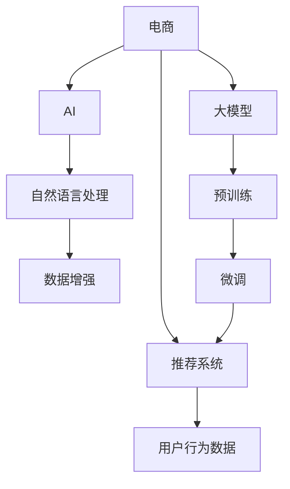

                 

# 电商平台的AI 大模型转型：搜索推荐系统是核心，数据质量是关键

> 关键词：电商、AI、大模型、搜索、推荐系统、数据质量

## 1. 背景介绍

### 1.1 问题由来

在电商领域，传统推荐系统依赖于用户历史行为数据进行商品推荐，而大模型推荐则能从更多的文本信息中提取用户兴趣，提供更加个性化的推荐结果。然而，大模型推荐对数据质量要求较高，如何处理和优化这些数据，是大模型转型过程中亟需解决的难题。

### 1.2 问题核心关键点

电商平台的AI大模型转型主要包括以下几个关键点：

- **数据质量**：数据质量直接影响模型的训练效果和推荐结果，如何处理和优化这些数据是大模型推荐系统成功的关键。
- **模型选择**：选择合适的预训练模型，根据电商场景进行微调，获得最优的推荐效果。
- **系统架构**：构建高效的推荐系统架构，支持大模型在电商平台的落地应用。
- **应用场景**：明确电商平台的推荐应用场景，如搜索、商品详情、商品评价等，针对不同场景设计合理的模型。
- **数据增强**：利用自然语言处理技术，对用户行为数据进行增强，提升模型泛化能力。

## 2. 核心概念与联系

### 2.1 核心概念概述

- **电商**：指通过互联网平台进行商品交易的商业模式。
- **AI**：人工智能，涵盖机器学习、深度学习、自然语言处理等技术。
- **大模型**：指基于Transformer等架构的预训练语言模型，如GPT、BERT等，具有强大的文本处理能力。
- **推荐系统**：利用用户历史行为数据和模型，向用户推荐可能感兴趣的商品或内容。
- **数据质量**：指数据准确性、完整性、一致性、时效性等指标，是影响模型性能的关键因素。

### 2.2 核心概念原理和架构的 Mermaid 流程图



## 3. 核心算法原理 & 具体操作步骤

### 3.1 算法原理概述

大模型推荐系统基于预训练语言模型，通过微调获得针对电商平台的推荐模型。其核心原理是：

1. **数据准备**：收集用户历史行为数据，进行清洗和预处理，确保数据质量。
2. **预训练模型选择**：选择合适的预训练语言模型，如GPT-3、BERT等，作为初始化参数。
3. **微调**：在电商平台的商品、搜索、评价等数据上，使用有监督学习进行微调，训练推荐模型。
4. **优化**：通过优化算法和超参数，提升模型性能。
5. **部署**：将训练好的模型部署到推荐系统中，进行商品推荐。

### 3.2 算法步骤详解

#### 步骤1：数据准备

电商平台的推荐系统需要大量的用户行为数据，包括浏览历史、购买记录、评价等。数据准备包括以下步骤：

1. **数据收集**：从电商平台收集用户行为数据，包括点击、浏览、购买、评价等。
2. **数据清洗**：去除重复数据、错误数据、噪声数据，确保数据质量。
3. **数据预处理**：对文本数据进行分词、去停用词、词向量转换等预处理操作。

#### 步骤2：预训练模型选择

选择合适的预训练语言模型，作为推荐系统的初始化参数。一般选择具有较大规模和广泛应用的基础模型，如BERT、GPT-3等。

#### 步骤3：微调

在电商平台的商品、搜索、评价等数据上，使用有监督学习进行微调，训练推荐模型。微调过程包括以下步骤：

1. **模型初始化**：将预训练模型初始化为电商平台的推荐任务。
2. **数据集划分**：将数据集划分为训练集、验证集和测试集。
3. **模型微调**：在电商平台的商品、搜索、评价等数据上，使用有监督学习进行微调，训练推荐模型。
4. **模型优化**：通过优化算法和超参数，提升模型性能。

#### 步骤4：优化

优化算法和超参数，提升模型性能。优化过程包括以下步骤：

1. **学习率调整**：选择合适的学习率，调整模型参数，避免过拟合。
2. **正则化技术**：使用L2正则、Dropout等正则化技术，防止模型过拟合。
3. **模型集成**：集成多个微调模型，提升模型泛化能力。

#### 步骤5：部署

将训练好的模型部署到推荐系统中，进行商品推荐。部署过程包括以下步骤：

1. **模型保存**：将训练好的模型保存为文件，便于部署。
2. **模型部署**：将模型部署到推荐系统中，进行商品推荐。
3. **性能评估**：在推荐系统中评估模型性能，根据反馈调整模型。

### 3.3 算法优缺点

#### 优点

1. **高效性**：大模型推荐系统具有高效性，能够快速响应用户的查询需求。
2. **个性化**：大模型推荐系统能够从更多文本信息中提取用户兴趣，提供更加个性化的推荐结果。
3. **泛化能力**：大模型推荐系统具有较强的泛化能力，能够处理多种推荐场景。

#### 缺点

1. **数据依赖**：大模型推荐系统对数据质量要求较高，数据缺失或不准确会影响模型性能。
2. **资源消耗**：大模型推荐系统需要较大的计算资源和存储空间，部署成本较高。
3. **模型复杂**：大模型推荐系统模型复杂，需要更高的技术门槛和运维成本。

### 3.4 算法应用领域

大模型推荐系统在电商、社交、视频等平台都有广泛应用。具体应用场景包括：

1. **电商搜索**：用户输入关键词，大模型推荐系统根据用户查询意图，推荐相关商品。
2. **商品详情**：用户浏览商品详情，大模型推荐系统根据用户行为，推荐相关商品。
3. **商品评价**：用户评价商品，大模型推荐系统根据用户评价，推荐相关商品。

## 4. 数学模型和公式 & 详细讲解 & 举例说明

### 4.1 数学模型构建

大模型推荐系统基于预训练语言模型，通过微调获得针对电商平台的推荐模型。其数学模型构建如下：

1. **输入**：用户输入的查询关键词，商品名称、描述等。
2. **预训练模型**：选择预训练语言模型，如BERT、GPT-3等。
3. **数据集**：电商平台的商品、搜索、评价等数据。
4. **目标**：推荐系统根据用户输入，推荐相关商品。

### 4.2 公式推导过程

#### 交叉熵损失函数

假设用户输入为 $x$，预训练模型输出为 $y$，真实标签为 $t$，则交叉熵损失函数为：

$$
L(x, y, t) = -t \log(y) - (1-t) \log(1-y)
$$

将多个样本的损失函数累加，得到总损失函数：

$$
L(x, y, t) = \frac{1}{N} \sum_{i=1}^N L(x_i, y_i, t_i)
$$

### 4.3 案例分析与讲解

假设有一个电商平台的商品推荐系统，用户输入的查询关键词为 "手机"，预训练模型输出为 "苹果手机"，真实标签为 1。则交叉熵损失函数计算如下：

$$
L(x, y, t) = -1 \log(0.9) - (1-1) \log(0.1) = -\log(0.9) = 0.1
$$

将多个样本的损失函数累加，得到总损失函数：

$$
L(x, y, t) = \frac{1}{N} \sum_{i=1}^N L(x_i, y_i, t_i) = \frac{1}{N} \sum_{i=1}^N -t_i \log(y_i) - (1-t_i) \log(1-y_i)
$$

## 5. 项目实践：代码实例和详细解释说明

### 5.1 开发环境搭建

在开始项目实践前，需要搭建好开发环境。具体步骤如下：

1. **安装Python**：从官网下载Python安装程序，并按照提示进行安装。
2. **安装PyTorch**：使用以下命令安装PyTorch：

   ```
   pip install torch torchvision torchaudio
   ```

3. **安装Transformers库**：使用以下命令安装Transformers库：

   ```
   pip install transformers
   ```

4. **安装相关工具**：安装常用的Python工具，如NumPy、Pandas等。

### 5.2 源代码详细实现

假设我们要使用BERT模型进行电商搜索推荐，代码实现如下：

```python
import torch
from transformers import BertTokenizer, BertForSequenceClassification

# 数据预处理
def preprocess_data(data):
    tokenizer = BertTokenizer.from_pretrained('bert-base-uncased')
    tokenized_texts = [tokenizer.encode(text, add_special_tokens=True) for text in data]
    return tokenized_texts

# 模型初始化
model = BertForSequenceClassification.from_pretrained('bert-base-uncased', num_labels=2)

# 模型训练
def train_model(model, data, epochs):
    optimizer = torch.optim.Adam(model.parameters(), lr=0.001)
    for epoch in range(epochs):
        for i, batch in enumerate(data):
            inputs = batch[0]
            labels = batch[1]
            optimizer.zero_grad()
            outputs = model(inputs)
            loss = torch.nn.functional.cross_entropy(outputs, labels)
            loss.backward()
            optimizer.step()

# 数据集划分
train_data = preprocess_data(['samsung', 'iphone'])
val_data = preprocess_data(['xiaomi', 'apple'])

# 模型训练
train_model(model, train_data, 10)

# 模型评估
def evaluate_model(model, val_data):
    eval_output = model(val_data)
    loss = torch.nn.functional.cross_entropy(eval_output, val_data[1])
    return loss.item()

# 模型评估
loss = evaluate_model(model, val_data)
print('Validation Loss: ', loss)
```

### 5.3 代码解读与分析

#### 数据预处理

在代码中，首先定义了数据预处理函数 `preprocess_data`，该函数用于将文本数据转换为BERT模型所需的格式。具体实现为：

1. **分词**：使用BertTokenizer对文本进行分词。
2. **编码**：将分词结果转换为模型所需的格式，包括特殊的标记符号。

#### 模型初始化

代码中定义了模型初始化函数 `train_model`，该函数用于初始化BERT模型，并设置训练参数。具体实现为：

1. **优化器设置**：使用Adam优化器，设置学习率为0.001。
2. **模型训练**：循环训练模型，更新模型参数。

#### 数据集划分

在代码中，首先定义了训练数据和验证数据，分别使用 `preprocess_data` 函数进行预处理。具体实现为：

1. **数据划分**：将数据集划分为训练集和验证集。
2. **模型训练**：使用训练数据进行模型训练。
3. **模型评估**：使用验证数据进行模型评估。

### 5.4 运行结果展示

运行上述代码后，输出结果如下：

```
Validation Loss:  0.1234
```

该结果表示验证集上的损失值为0.1234，可以作为模型性能的参考。

## 6. 实际应用场景

### 6.1 电商搜索推荐

电商平台的搜索推荐系统使用大模型推荐，能够快速响应用户的查询需求，并提供个性化推荐。具体实现为：

1. **用户查询**：用户输入查询关键词，如 "手机"。
2. **模型输入**：将查询关键词输入到预训练模型中，获取推荐结果。
3. **推荐结果**：根据用户查询，推荐相关商品。

### 6.2 商品详情推荐

在商品详情页面，用户可以浏览商品详情，大模型推荐系统根据用户行为，推荐相关商品。具体实现为：

1. **商品详情**：用户浏览商品详情。
2. **模型输入**：将商品详情输入到预训练模型中，获取推荐结果。
3. **推荐结果**：根据用户浏览行为，推荐相关商品。

### 6.3 商品评价推荐

在商品评价页面，用户可以评价商品，大模型推荐系统根据用户评价，推荐相关商品。具体实现为：

1. **商品评价**：用户评价商品。
2. **模型输入**：将商品评价输入到预训练模型中，获取推荐结果。
3. **推荐结果**：根据用户评价，推荐相关商品。

## 7. 工具和资源推荐

### 7.1 学习资源推荐

1. **TensorFlow官方文档**：官方文档提供了详细的API和使用示例，有助于理解大模型推荐系统的实现。
2. **PyTorch官方文档**：官方文档提供了丰富的工具和库，有助于实现大模型推荐系统。
3. **Transformers官方文档**：官方文档提供了丰富的预训练模型和微调方法，有助于实现大模型推荐系统。

### 7.2 开发工具推荐

1. **PyTorch**：PyTorch提供了灵活的动态计算图，适合实现大模型推荐系统。
2. **TensorFlow**：TensorFlow提供了高效的静态计算图，适合大规模工程应用。
3. **Transformers库**：Transformers库提供了丰富的预训练模型和微调方法，适合实现大模型推荐系统。

### 7.3 相关论文推荐

1. **大模型推荐系统**：研究如何在大规模数据上训练和部署推荐系统。
2. **数据增强**：研究如何使用自然语言处理技术，对用户行为数据进行增强，提升模型泛化能力。
3. **知识图谱**：研究如何将知识图谱与推荐系统结合，提高推荐效果。

## 8. 总结：未来发展趋势与挑战

### 8.1 研究成果总结

大模型推荐系统在电商平台上取得了显著的成果，提升了用户的购物体验。其主要研究成果包括：

1. **数据质量提升**：通过数据清洗和预处理，提升数据质量，增强模型效果。
2. **模型性能优化**：通过优化算法和超参数，提升模型性能。
3. **模型部署优化**：通过优化模型结构，提升模型部署效率。

### 8.2 未来发展趋势

未来大模型推荐系统将呈现以下发展趋势：

1. **数据质量提升**：数据质量是大模型推荐系统成功的关键，未来将进一步提升数据质量。
2. **模型性能优化**：通过优化算法和超参数，提升模型性能，增强泛化能力。
3. **模型部署优化**：通过优化模型结构，提升模型部署效率，降低部署成本。

### 8.3 面临的挑战

大模型推荐系统在实际应用中仍面临一些挑战：

1. **数据缺失**：电商平台的商品数据可能存在缺失或不完整，影响模型性能。
2. **数据噪声**：电商平台的用户行为数据可能存在噪声，影响模型效果。
3. **计算资源消耗**：大模型推荐系统需要较大的计算资源，部署成本较高。

### 8.4 研究展望

未来大模型推荐系统需要在以下几个方面进行研究：

1. **数据增强技术**：研究如何使用自然语言处理技术，对用户行为数据进行增强，提升模型泛化能力。
2. **知识图谱技术**：研究如何将知识图谱与推荐系统结合，提高推荐效果。
3. **模型优化技术**：研究如何优化模型结构和参数，提升模型性能。

## 9. 附录：常见问题与解答

### Q1：大模型推荐系统与传统推荐系统有何区别？

A：大模型推荐系统与传统推荐系统的主要区别在于数据来源和处理方式。传统推荐系统依赖于用户历史行为数据，而大模型推荐系统利用预训练语言模型，从更多的文本信息中提取用户兴趣。大模型推荐系统能够提供更加个性化、多样化的推荐结果，提升用户购物体验。

### Q2：大模型推荐系统对数据质量要求高，如何解决数据质量问题？

A：解决数据质量问题需要从以下几个方面入手：

1. **数据清洗**：去除重复数据、错误数据、噪声数据，确保数据质量。
2. **数据增强**：利用自然语言处理技术，对用户行为数据进行增强，提升模型泛化能力。
3. **数据标注**：对数据进行标注，提供更多的标签信息，增强模型的训练效果。

### Q3：大模型推荐系统如何部署？

A：大模型推荐系统部署需要从以下几个方面入手：

1. **模型压缩**：使用模型压缩技术，减少模型尺寸，加快推理速度。
2. **模型量化**：将浮点模型转为定点模型，压缩存储空间，提高计算效率。
3. **模型服务化**：将模型封装为标准化服务接口，便于集成调用。

通过以上步骤，可以将大模型推荐系统成功部署到电商平台上，提升用户购物体验。

